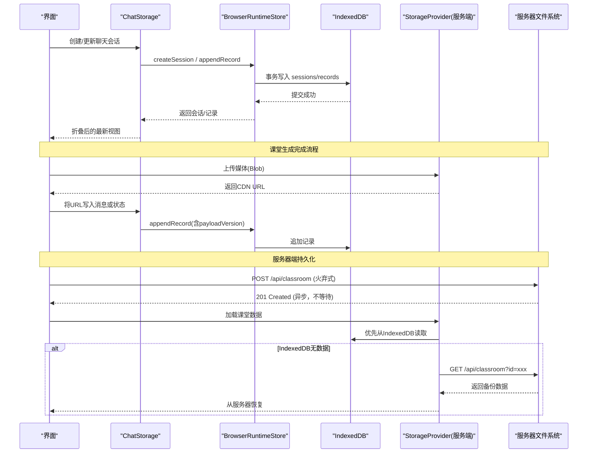
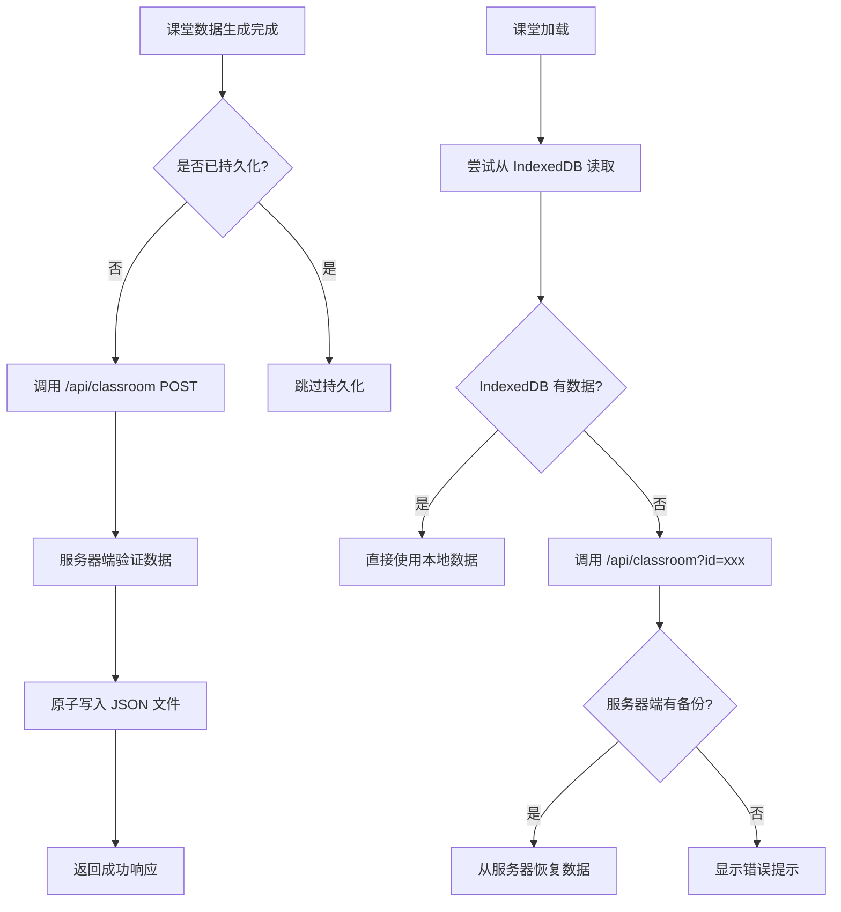

# 状态持久化

<cite>
**本文引用的文件**   
- [packages/@openmaic/dsl/src/storage.ts](file://packages/@openmaic/dsl/src/storage.ts)
- [packages/@openmaic/storage/src/runtime/browser.ts](file://packages/@openmaic/storage/src/runtime/browser.ts)
- [packages/@openmaic/storage/src/runtime/pg.ts](file://packages/@openmaic/storage/src/runtime/pg.ts)
- [lib/utils/chat-storage.ts](file://lib/utils/chat-storage.ts)
- [lib/utils/playback-storage.ts](file://lib/utils/playback-storage.ts)
- [lib/storage/client.ts](file://lib/storage/client.ts)
- [lib/storage/types.ts](file://lib/storage/types.ts)
- [lib/storage/index.ts](file://lib/storage/index.ts)
- [app/api/classroom/route.ts](file://app/api/classroom/route.ts)
- [lib/server/classroom-storage.ts](file://lib/server/classroom-storage.ts)
- [app/classroom/[id]/page.tsx](file://app/classroom/[id]/page.tsx)
- [app/generation-preview/page.tsx](file://app/generation-preview/page.tsx)
- [lib/classroom/load-classroom.ts](file://lib/classroom/load-classroom.ts)
</cite>

## 更新摘要
**所做更改**
- 新增服务器端持久化功能章节，详细说明课堂数据自动持久化机制
- 更新核心业务流程，包含火弃式备份策略
- 扩展数据存储架构，支持IndexedDB与服务器文件系统双重存储
- 新增跨浏览器/缓存清理场景的数据恢复流程
- 更新关键约束与边界，包含服务器端存储限制处理

## 目录
- 产品概述
- 核心业务流程
- 功能模块清单
- 数据与状态
- 服务器端持久化架构
- 关键约束与边界

## 产品概述
OpenMAIC 的状态持久化以浏览器端 IndexedDB 为核心权威源，结合新增的服务器端文件系统持久化作为最佳努力备份机制，实现课件编辑、课堂互动、回放等场景的可靠本地状态管理。其设计目标包括：
- **权威性分层**：IndexedDB 作为唯一真实来源，服务器端存储为跨浏览器/缓存清理场景的备份
- **结构化持久化**：会话与追加式记录分离，保证可重放与一致性
- **版本与迁移**：运行时 DSL 版本标记，读取时自动迁移，避免破坏性升级
- **可扩展后端**：DSL 抽象出资源存储接口，浏览器端使用 IndexedDB + Object URL，服务端通过对象存储/CDN 提供稳定 URL
- **性能与可靠性**：索引优化、分片与锁机制、去重上传、清理策略与监控能力

## 核心业务流程
- **课件运行时会话创建与追加写入**
  - 创建会话并写入初始状态记录，后续消息/状态变更以追加记录形式落盘，读取时折叠为最新视图。
- **聊天会话持久化与恢复**
  - 基于 RuntimeStore 的追加式记录，维护消息窗口与状态快照；支持恢复标记与删除标记，确保跨标签页/多进程一致。
- **播放状态断点续播**
  - 保存当前场景与动作索引以及已消费讨论项，支持中断后快速恢复。
- **媒体资源上传与解析**
  - 客户端计算内容哈希，服务端去重返回 CDN URL；文档仅引用稳定 AssetRef，渲染时解析为可用 URL。
- **服务器端自动持久化**
  - 课堂生成完成后自动将完成数据持久化到服务器文件系统，作为跨浏览器/缓存清理场景的备份。
- **预览页面火弃式备份**
  - 生成预览页面在确认大纲后执行非阻塞服务器持久化，失败不影响主流程。



**图表来源**
- [app/classroom/[id]/page.tsx:50-64](file://app/classroom/[id]/page.tsx#L50-L64)
- [app/generation-preview/page.tsx:1080-1092](file://app/generation-preview/page.tsx#L1080-L1092)
- [lib/classroom/load-classroom.ts:107-131](file://lib/classroom/load-classroom.ts#L107-L131)

**章节来源**
- [packages/@openmaic/storage/src/runtime/browser.ts](file://packages/@openmaic/storage/src/runtime/browser.ts)
- [lib/utils/chat-storage.ts](file://lib/utils/chat-storage.ts)
- [lib/storage/client.ts](file://lib/storage/client.ts)
- [app/classroom/[id]/page.tsx](file://app/classroom/[id]/page.tsx)
- [app/generation-preview/page.tsx](file://app/generation-preview/page.tsx)
- [lib/classroom/load-classroom.ts](file://lib/classroom/load-classroom.ts)

## 功能模块清单
- **DSL 存储契约（@openmaic/dsl）**
  - 定义资源引用类型与 StorageProvider 接口，解耦文档与具体存储实现。
- **运行时存储后端（@openmaic/storage）**
  - 浏览器端 BrowserRuntimeStore：基于 IndexedDB 的会话与记录存储，包含索引、迁移、校验与事务语义。
  - 服务端 PG 后端：用于非浏览器环境或跨设备同步时的持久化（表结构、索引）。
- **聊天持久化（lib/utils/chat-storage.ts）**
  - 会话与消息的追加式记录、折叠算法、恢复/删除标记、分区锁与队列化写入。
- **播放状态存储（lib/utils/playback-storage.ts）**
  - 最小化断点信息持久化，支持按 stageId 单条记录。
- **资源上传客户端（lib/storage/client.ts, types.ts, index.ts）**
  - 计算 SHA-256、表单上传、服务端去重与 URL 返回；统一 Provider 接口。
- **服务器端课堂存储（lib/server/classroom-storage.ts）**
  - 基于文件系统的课堂数据持久化，支持原子写入和路径重写。
- **课堂API路由（app/api/classroom/route.ts）**
  - 提供课堂数据的CRUD操作，支持POST创建和GET读取。

**章节来源**
- [packages/@openmaic/dsl/src/storage.ts](file://packages/@openmaic/dsl/src/storage.ts)
- [packages/@openmaic/storage/src/runtime/browser.ts](file://packages/@openmaic/storage/src/runtime/browser.ts)
- [packages/@openmaic/storage/src/runtime/pg.ts](file://packages/@openmaic/storage/src/runtime/pg.ts)
- [lib/utils/chat-storage.ts](file://lib/utils/chat-storage.ts)
- [lib/utils/playback-storage.ts](file://lib/utils/playback-storage.ts)
- [lib/storage/client.ts](file://lib/storage/client.ts)
- [lib/storage/types.ts](file://lib/storage/types.ts)
- [lib/storage/index.ts](file://lib/storage/index.ts)
- [lib/server/classroom-storage.ts](file://lib/server/classroom-storage.ts)
- [app/api/classroom/route.ts](file://app/api/classroom/route.ts)

## 数据与状态
- **运行时会话与记录模型**
  - 会话（sessions）：标识、阶段、学习者键、状态、时间戳、DSL 版本等。
  - 记录（records）：顺序号、场景、时间戳、payload（消息/状态/标记等）。
  - 索引策略：按 stageId+learnerKey、session_id+scene_id 等维度建立索引，提升查询效率。
- **聊天会话数据结构**
  - 消息 payload 与状态 payload 均携带 payloadVersion，便于向后兼容与增量迁移。
  - 折叠算法根据 sessionUpdatedAt 与 seq 选择最新值，保证幂等与一致性。
- **播放状态**
  - 最小字段：sceneIndex、actionIndex、consumedDiscussions、sceneId（用于失效判断）。
- **资源引用**
  - AssetRef 为稳定字符串，文档不内嵌二进制；渲染时通过 StorageProvider.resolve 获取 URL。
- **服务器端课堂数据**
  - PersistedClassroomData 包含 id、stage、scenes、createdAt 字段，支持媒体URL路径重写。

```mermaid
classDiagram
class RuntimeSession {
+string id
+string kind
+string stageId
+string learnerKey
+string status
+string createdAt
+string updatedAt
+string runtimeDslVersion
}
class RuntimeRecord {
+string id
+string sessionId
+bigint seq
+string sceneId
+string createdAt
+object payload
}
class BrowserRuntimeStore {
+createSession(init) RuntimeSession
+appendRecord(record) void
+listRecords(sessionId) RuntimeRecord[]
+getSession(id) RuntimeSession
+setSessionStatus(id,status,time) void
+deleteSession(id) void
}
class ChatStorage {
+load(stageId,learnerKey) ChatSession[]
+save(stageId,learnerKey,session) void
+restoreMarker(stageId,learnerKey,targetIds) void
+deletionMarker(stageId,learnerKey,chatId) void
}
class PersistedClassroomData {
+string id
+Stage stage
+Scene[] scenes
+string createdAt
}
class ClassroomStorage {
+persistClassroom(data, baseUrl) Promise~PersistedClassroomData&{url}~
+readClassroom(id) Promise~PersistedClassroomData|null~
+ensureClassroomsDir() Promise~void~
+writeJsonFileAtomic(filePath, data) Promise~void~
}
BrowserRuntimeStore --> RuntimeSession : "读写"
BrowserRuntimeStore --> RuntimeRecord : "追加记录"
ChatStorage --> BrowserRuntimeStore : "依赖"
ClassroomStorage --> PersistedClassroomData : "持久化"
```

**图表来源**
- [packages/@openmaic/storage/src/runtime/browser.ts](file://packages/@openmaic/storage/src/runtime/browser.ts)
- [lib/utils/chat-storage.ts](file://lib/utils/chat-storage.ts)
- [lib/server/classroom-storage.ts:46-51](file://lib/server/classroom-storage.ts#L46-L51)

**章节来源**
- [packages/@openmaic/storage/src/runtime/browser.ts](file://packages/@openmaic/storage/src/runtime/browser.ts)
- [lib/utils/chat-storage.ts](file://lib/utils/chat-storage.ts)
- [lib/server/classroom-storage.ts](file://lib/server/classroom-storage.ts)

## 服务器端持久化架构

### 双存储策略设计
系统采用 IndexedDB 作为权威数据源，服务器端文件系统作为最佳努力备份的双层存储架构：

1. **优先级规则**：
   - 读取时优先从 IndexedDB 获取数据
   - IndexedDB 无数据时回退到服务器端存储
   - 写入时同时更新两个存储（但服务器端写入为非阻塞）

2. **触发时机**：
   - 课堂详情页面：生成完成后自动持久化
   - 预览页面：确认大纲后执行火弃式持久化

### 服务器端存储实现


**图表来源**
- [app/classroom/[id]/page.tsx:50-64](file://app/classroom/[id]/page.tsx#L50-L64)
- [lib/classroom/load-classroom.ts:107-131](file://lib/classroom/load-classroom.ts#L107-L131)

### 火弃式持久化模式
预览页面的服务器端持久化采用 fire-and-forget 模式：
- 非阻塞调用，不等待响应结果
- 失败仅记录警告日志，不影响主流程
- 确保 IndexedDB 操作的原子性和一致性

**章节来源**
- [app/classroom/[id]/page.tsx:50-64](file://app/classroom/[id]/page.tsx#L50-L64)
- [app/generation-preview/page.tsx:1080-1092](file://app/generation-preview/page.tsx#L1080-L1092)
- [lib/server/classroom-storage.ts:88-111](file://lib/server/classroom-storage.ts#L88-L111)

## 关键约束与边界
- **浏览器存储限制与处理方案**
  - 容量限制：采用分片存储（按 stageId/learnerKey/sessionId 划分）、压缩大对象（在 Provider 层实现）、定期清理旧记录与过期快照。
  - 私有模式/权限问题：打开失败时不清缓存连接，重试并降级；必要时提示用户释放空间。
  - 并发与一致性：使用 Web Locks API 进行分区锁与全局锁，避免跨标签页竞争；写入队列化，串行化同一 partition 的写操作。
- **序列化与反序列化**
  - 所有 payload 携带 payloadVersion，读取时按版本校验与转换；运行时 DSL 版本 stamp 强制存在，无"未版本化"历史路径。
- **版本迁移**
  - 读取会话时检查 needsRuntimeMigration，必要时调用 migrateRuntime 前向迁移；PG 后端通过 ensureSchema 保证表结构存在。
- **备份恢复与导入导出**
  - 恢复标记（restore marker）与删除标记（deletion marker）保障跨会话恢复与逻辑删除；导出时收集文档中的 AssetRef 清单，配合 StorageProvider 生成资源清单。
- **跨设备同步**
  - 通过 PG 后端作为权威源，浏览器端作为缓存；冲突解决以序列号与时间戳为准，必要时触发合并与回滚。
- **服务器端存储限制**
  - 文件系统容量监控与清理策略，防止磁盘空间耗尽。
  - 原子写入确保数据完整性，临时文件命名包含进程ID和时间戳。
  - 路径安全验证，防止路径遍历攻击。
- **性能监控与内存防护**
  - 记录写入耗时、事务失败率、IndexedDB 大小监控；避免持有大对象引用，及时释放临时 ArrayBuffer；对长列表分页加载与懒渲染。
- **兼容性处理**
  - 检测 navigator.locks 可用性，不可用时抛出明确错误；Provider 抽象屏蔽浏览器/Node 差异。
  - 支持 basePath 部署模式，自动重写媒体URL路径。

**章节来源**
- [packages/@openmaic/storage/src/runtime/browser.ts](file://packages/@openmaic/storage/src/runtime/browser.ts)
- [packages/@openmaic/storage/src/runtime/pg.ts](file://packages/@openmaic/storage/src/runtime/pg.ts)
- [lib/utils/chat-storage.ts](file://lib/utils/chat-storage.ts)
- [lib/utils/playback-storage.ts](file://lib/utils/playback-storage.ts)
- [lib/storage/client.ts](file://lib/storage/client.ts)
- [lib/storage/types.ts](file://lib/storage/types.ts)
- [lib/storage/index.ts](file://lib/storage/index.ts)
- [packages/@openmaic/dsl/src/storage.ts](file://packages/@openmaic/dsl/src/storage.ts)
- [lib/server/classroom-storage.ts](file://lib/server/classroom-storage.ts)
- [app/api/classroom/route.ts](file://app/api/classroom/route.ts)