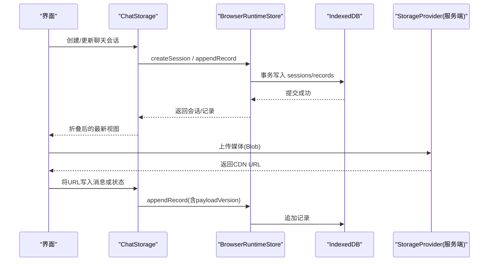
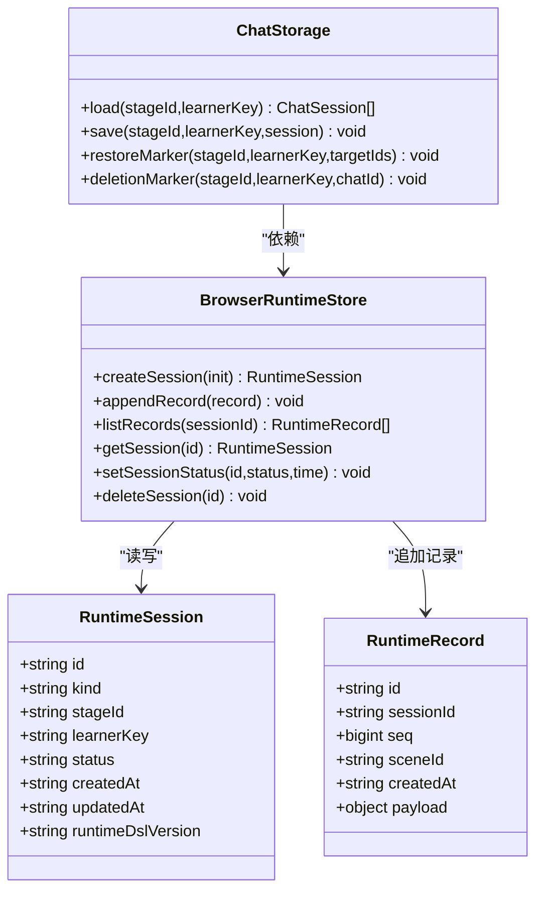

# 状态持久化

<cite>
**本文引用的文件**   
- [packages/@openmaic/dsl/src/storage.ts](file://packages/@openmaic/dsl/src/storage.ts)
- [packages/@openmaic/storage/src/runtime/browser.ts](file://packages/@openmaic/storage/src/runtime/browser.ts)
- [packages/@openmaic/storage/src/runtime/pg.ts](file://packages/@openmaic/storage/src/runtime/pg.ts)
- [lib/utils/chat-storage.ts](file://lib/utils/chat-storage.ts)
- [lib/utils/playback-storage.ts](file://lib/utils/playback-storage.ts)
- [lib/storage/client.ts](file://lib/storage/client.ts)
- [lib/storage/types.ts](file://lib/storage/types.ts)
- [lib/storage/index.ts](file://lib/storage/index.ts)
</cite>

## 目录
- 产品概述
- 核心业务流程
- 功能模块清单
- 数据与状态
- 关键约束与边界

## 产品概述
OpenMAIC 的状态持久化以浏览器端 IndexedDB 为核心，结合 DSL 层定义的存储契约（StorageProvider）与运行时会话/记录模型（RuntimeStore），实现课件编辑、课堂互动、回放等场景的可靠本地状态管理。其设计目标包括：
- 结构化持久化：会话与追加式记录分离，保证可重放与一致性。
- 版本与迁移：运行时 DSL 版本标记，读取时自动迁移，避免破坏性升级。
- 可扩展后端：DSL 抽象出资源存储接口，浏览器端使用 IndexedDB + Object URL，服务端通过对象存储/CDN 提供稳定 URL。
- 性能与可靠性：索引优化、分片与锁机制、去重上传、清理策略与监控能力。

## 核心业务流程
- 课件运行时会话创建与追加写入
  - 创建会话并写入初始状态记录，后续消息/状态变更以追加记录形式落盘，读取时折叠为最新视图。
- 聊天会话持久化与恢复
  - 基于 RuntimeStore 的追加式记录，维护消息窗口与状态快照；支持恢复标记与删除标记，确保跨标签页/多进程一致。
- 播放状态断点续播
  - 保存当前场景与动作索引以及已消费讨论项，支持中断后快速恢复。
- 媒体资源上传与解析
  - 客户端计算内容哈希，服务端去重返回 CDN URL；文档仅引用稳定 AssetRef，渲染时解析为可用 URL。

图表来源 
- [packages/@openmaic/storage/src/runtime/browser.ts](file://packages/@openmaic/storage/src/runtime/browser.ts)
- [lib/utils/chat-storage.ts](file://lib/utils/chat-storage.ts)
- [lib/storage/client.ts](file://lib/storage/client.ts)

章节来源
- [packages/@openmaic/storage/src/runtime/browser.ts](file://packages/@openmaic/storage/src/runtime/browser.ts)
- [lib/utils/chat-storage.ts](file://lib/utils/chat-storage.ts)
- [lib/storage/client.ts](file://lib/storage/client.ts)

## 功能模块清单
- DSL 存储契约（@openmaic/dsl）
  - 定义资源引用类型与 StorageProvider 接口，解耦文档与具体存储实现。
- 运行时存储后端（@openmaic/storage）
  - 浏览器端 BrowserRuntimeStore：基于 IndexedDB 的会话与记录存储，包含索引、迁移、校验与事务语义。
  - 服务端 PG 后端：用于非浏览器环境或跨设备同步时的持久化（表结构、索引）。
- 聊天持久化（lib/utils/chat-storage.ts）
  - 会话与消息的追加式记录、折叠算法、恢复/删除标记、分区锁与队列化写入。
- 播放状态存储（lib/utils/playback-storage.ts）
  - 最小化断点信息持久化，支持按 stageId 单条记录。
- 资源上传客户端（lib/storage/client.ts, types.ts, index.ts）
  - 计算 SHA-256、表单上传、服务端去重与 URL 返回；统一 Provider 接口。

章节来源
- [packages/@openmaic/dsl/src/storage.ts](file://packages/@openmaic/dsl/src/storage.ts)
- [packages/@openmaic/storage/src/runtime/browser.ts](file://packages/@openmaic/storage/src/runtime/browser.ts)
- [packages/@openmaic/storage/src/runtime/pg.ts](file://packages/@openmaic/storage/src/runtime/pg.ts)
- [lib/utils/chat-storage.ts](file://lib/utils/chat-storage.ts)
- [lib/utils/playback-storage.ts](file://lib/utils/playback-storage.ts)
- [lib/storage/client.ts](file://lib/storage/client.ts)
- [lib/storage/types.ts](file://lib/storage/types.ts)
- [lib/storage/index.ts](file://lib/storage/index.ts)

## 数据与状态
- 运行时会话与记录模型
  - 会话（sessions）：标识、阶段、学习者键、状态、时间戳、DSL 版本等。
  - 记录（records）：顺序号、场景、时间戳、payload（消息/状态/标记等）。
  - 索引策略：按 stageId+learnerKey、session_id+scene_id 等维度建立索引，提升查询效率。
- 聊天会话数据结构
  - 消息 payload 与状态 payload 均携带 payloadVersion，便于向后兼容与增量迁移。
  - 折叠算法根据 sessionUpdatedAt 与 seq 选择最新值，保证幂等与一致性。
- 播放状态
  - 最小字段：sceneIndex、actionIndex、consumedDiscussions、sceneId（用于失效判断）。
- 资源引用
  - AssetRef 为稳定字符串，文档不内嵌二进制；渲染时通过 StorageProvider.resolve 获取 URL。

图表来源 
- [packages/@openmaic/storage/src/runtime/browser.ts](file://packages/@openmaic/storage/src/runtime/browser.ts)
- [lib/utils/chat-storage.ts](file://lib/utils/chat-storage.ts)

章节来源
- [packages/@openmaic/storage/src/runtime/browser.ts](file://packages/@openmaic/storage/src/runtime/browser.ts)
- [lib/utils/chat-storage.ts](file://lib/utils/chat-storage.ts)

## 关键约束与边界
- 浏览器存储限制与处理方案
  - 容量限制：采用分片存储（按 stageId/learnerKey/sessionId 划分）、压缩大对象（在 Provider 层实现）、定期清理旧记录与过期快照。
  - 私有模式/权限问题：打开失败时不清缓存连接，重试并降级；必要时提示用户释放空间。
  - 并发与一致性：使用 Web Locks API 进行分区锁与全局锁，避免跨标签页竞争；写入队列化，串行化同一 partition 的写操作。
- 序列化与反序列化
  - 所有 payload 携带 payloadVersion，读取时按版本校验与转换；运行时 DSL 版本 stamp 强制存在，无“未版本化”历史路径。
- 版本迁移
  - 读取会话时检查 needsRuntimeMigration，必要时调用 migrateRuntime 前向迁移；PG 后端通过 ensureSchema 保证表结构存在。
- 备份恢复与导入导出
  - 恢复标记（restore marker）与删除标记（deletion marker）保障跨会话恢复与逻辑删除；导出时收集文档中的 AssetRef 清单，配合 StorageProvider 生成资源清单。
- 跨设备同步
  - 通过 PG 后端作为权威源，浏览器端作为缓存；冲突解决以序列号与时间戳为准，必要时触发合并与回滚。
- 性能监控与内存防护
  - 记录写入耗时、事务失败率、IndexedDB 大小监控；避免持有大对象引用，及时释放临时 ArrayBuffer；对长列表分页加载与懒渲染。
- 兼容性处理
  - 检测 navigator.locks 可用性，不可用时抛出明确错误；Provider 抽象屏蔽浏览器/Node 差异。

章节来源
- [packages/@openmaic/storage/src/runtime/browser.ts](file://packages/@openmaic/storage/src/runtime/browser.ts)
- [packages/@openmaic/storage/src/runtime/pg.ts](file://packages/@openmaic/storage/src/runtime/pg.ts)
- [lib/utils/chat-storage.ts](file://lib/utils/chat-storage.ts)
- [lib/utils/playback-storage.ts](file://lib/utils/playback-storage.ts)
- [lib/storage/client.ts](file://lib/storage/client.ts)
- [lib/storage/types.ts](file://lib/storage/types.ts)
- [lib/storage/index.ts](file://lib/storage/index.ts)
- [packages/@openmaic/dsl/src/storage.ts](file://packages/@openmaic/dsl/src/storage.ts)