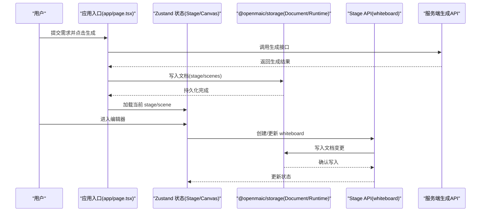
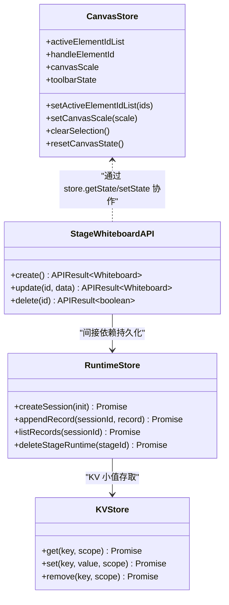

# 状态管理架构

<cite>
**本文引用的文件**
- [lib/store/canvas.ts](file://lib/store/canvas.ts)
- [lib/api/stage-api-whiteboard.ts](file://lib/api/stage-api-whiteboard.ts)
- [components/chat/use-chat-sessions.ts](file://components/chat/use-chat-sessions.ts)
- [packages/@openmaic/storage/README.md](file://packages/@openmaic/storage/README.md)
- [packages/@openmaic/storage/src/runtime/browser.ts](file://packages/@openmaic/storage/src/runtime/browser.ts)
- [packages/@openmaic/storage/test/persist-adapter.test.ts](file://packages/@openmaic/storage/test/persist-adapter.test.ts)
- [tests/quiz/persistence.test.ts](file://tests/quiz/persistence.test.ts)
- [app/page.tsx](file://app/page.tsx)
</cite>

## 产品概述
OpenMAIC 是一个 AI 驱动的交互式课件（MAIC）生成与课堂管理平台，核心用户场景包括：通过自然语言生成结构化课件、课堂实时互动（问答/讨论/测验）、课件编辑与回放。前端基于 Next.js + React + Zustand 进行全局状态管理；持久化层由 @openmaic/storage 提供可插拔的浏览器后端（IndexedDB/localStorage），并与 DSL 校验/迁移能力协同，确保数据一致性与可演进性。

## 核心业务流程
- 生成流程：用户在首页输入需求并选择配置，触发服务端生成管线，完成后将生成的文档（stage/scenes）写入持久化层，并在客户端状态中加载当前 stage 与 scene。
- 编辑流程：编辑器通过 Canvas Store 维护 UI 交互态（选区、缩放、工具栏等），并通过 Stage API 对 stage/whiteboard 等数据进行增删改，最终落盘到 DocumentStore。
- 课堂互动流程：聊天与会话在运行时以 append-only records 形式持久化，支持会话恢复、软关闭、流式渲染与白板工具联动。
- 回放流程：播放引擎按记录顺序重放事件，保证与录制一致的时序与表现。

**章节来源**
- [app/page.tsx:317-344](file://app/page.tsx#L317-L344)
- [lib/api/stage-api-whiteboard.ts:19-50](file://lib/api/stage-api-whiteboard.ts#L19-L50)
- [packages/@openmaic/storage/README.md:23-54](file://packages/@openmaic/storage/README.md#L23-L54)

## 功能模块清单
- 全局状态切片
  - Canvas Store：编辑器 UI 状态（选区、缩放、工具栏、教学特效、视频播放等）。职责清晰，不包含 slide 数据本身。
  - Stage 相关状态：通过 Stage API 暴露 create/update 等方法，统一操作 stage/whiteboard 等数据。
  - Chat Sessions：课堂聊天与会话生命周期管理，包含流式消费、软关闭、资源回收。
- 持久化存储
  - DocumentStore：DSL 文档聚合（stage + scenes + outline）的规范化存储与读取，带版本戳与迁移。
  - RuntimeStore：学习者运行时数据（sessions + append-only records），分区隔离、单调 seq 排序、按 kind 校验。
  - KVStore：设备/账户级小值存储，适配 Zustand persist。
- 同步与一致性
  - 客户端状态与服务端数据通过 API 调用与持久化层协调，错误隔离与降级策略保障可用性。
- 调试与迁移
  - 测试覆盖持久化适配器、运行时契约、回放与导航等关键路径；DSL 提供迁移钩子与校验门控。

**章节来源**
- [lib/store/canvas.ts:36-48](file://lib/store/canvas.ts#L36-L48)
- [lib/api/stage-api-whiteboard.ts:1-18](file://lib/api/stage-api-whiteboard.ts#L1-L18)
- [packages/@openmaic/storage/README.md:23-72](file://packages/@openmaic/storage/README.md#L23-L72)

## 数据与状态
- 状态切片设计
  - Canvas Store：聚焦编辑器交互态，使用 createSelectors 增强 use.xxx() 语法，减少不必要的重渲染。
  - Stage API：封装 stage/whiteboard 的 CRUD，内部通过 store.getState()/setState() 原子更新，避免竞态。
  - Chat Sessions：维护 sessions、activeSessionId、isStreaming 等，结合 AbortController 与资源清理函数 retireLiveRequestResources。
- 异步状态处理
  - 生成与 API 调用采用 try/catch 包裹，失败时回退或提示；流式消费通过 onEvent/onIterationEnd 回调驱动状态更新。
  - 运行时 drain 流程具备超时与锁机制，防止阻塞与死锁。
- 持久化存储
  - kvPersistStorage 将 KVStore 适配为 Zustand persist 存储，支持 account/device 作用域与 {state, version} 信封。
  - BrowserRuntimeStore 使用 IndexedDB 的 sessions/records 对象存储，按阶段与学习者键分区，append-only 有序事实。
- 客户端与服务端同步
  - 页面挂载后从 localStorage 恢复部分 UI 偏好；生成完成后将文档写入持久化层，再加载到状态树。
  - 聊天会话在恢复时进行归一化处理，避免残留“活跃”状态导致 UI 不一致。
- 性能优化
  - 使用 selectors 精确订阅，避免全量重渲染；批量操作（如 clearSelection/resetCanvasState）合并状态更新。
  - 流式文本渲染采用 pacedStep/pacedDelay 控制节奏，降低高频 setState 压力。

**图表来源**
- [lib/store/canvas.ts:256-482](file://lib/store/canvas.ts#L256-L482)
- [lib/api/stage-api-whiteboard.ts:19-50](file://lib/api/stage-api-whiteboard.ts#L19-L50)
- [packages/@openmaic/storage/src/runtime/browser.ts:1-38](file://packages/@openmaic/storage/src/runtime/browser.ts#L1-L38)
- [packages/@openmaic/storage/README.md:23-72](file://packages/@openmaic/storage/README.md#L23-L72)

**章节来源**
- [lib/store/canvas.ts:256-482](file://lib/store/canvas.ts#L256-L482)
- [lib/api/stage-api-whiteboard.ts:19-50](file://lib/api/stage-api-whiteboard.ts#L19-L50)
- [components/chat/use-chat-sessions.ts:438-470](file://components/chat/use-chat-sessions.ts#L438-L470)
- [packages/@openmaic/storage/test/persist-adapter.test.ts:1-42](file://packages/@openmaic/storage/test/persist-adapter.test.ts#L1-L42)
- [packages/@openmaic/storage/src/runtime/browser.ts:1-38](file://packages/@openmaic/storage/src/runtime/browser.ts#L1-L38)

## 关键约束与边界
- 非功能性需求
  - 性能：高频 UI 更新需使用 selectors 与批量 set；流式渲染限速节流。
  - 可靠性：持久化层具备版本戳与校验门控，schema 漂移失败即报；运行时 append-only 保证可重放。
  - 可移植性：DocumentStore 输出标准化 DSL，跨环境可迁移。
- 依赖与集成边界
  - @openmaic/storage 仅依赖 @openmaic/dsl，不耦合 React/Zustand；后端通过注入 Storage/IDBFactory 实现解耦。
  - Stage API 与 Canvas Store 职责分离：前者管业务数据，后者管 UI 态。
- 业务约束
  - 会话状态恢复需归一化，避免“活跃/软关闭”残留导致 UI 异常。
  - 运行时记录按 session 分区，禁止全局扫描；跨阶段合并仅限 mergeLearner。
  - 资产引用采用内容寻址（sha256），避免 URL 绑定导致不可移植。

**章节来源**
- [packages/@openmaic/storage/README.md:33-72](file://packages/@openmaic/storage/README.md#L33-L72)
- [components/chat/use-chat-sessions.ts:242-258](file://components/chat/use-chat-sessions.ts#L242-L258)
- [tests/quiz/persistence.test.ts:1-49](file://tests/quiz/persistence.test.ts#L1-L49)