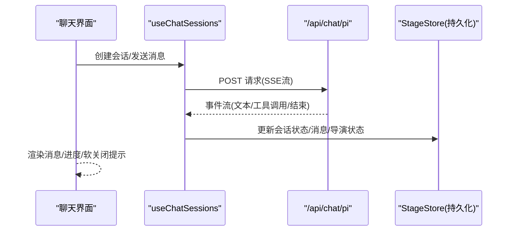
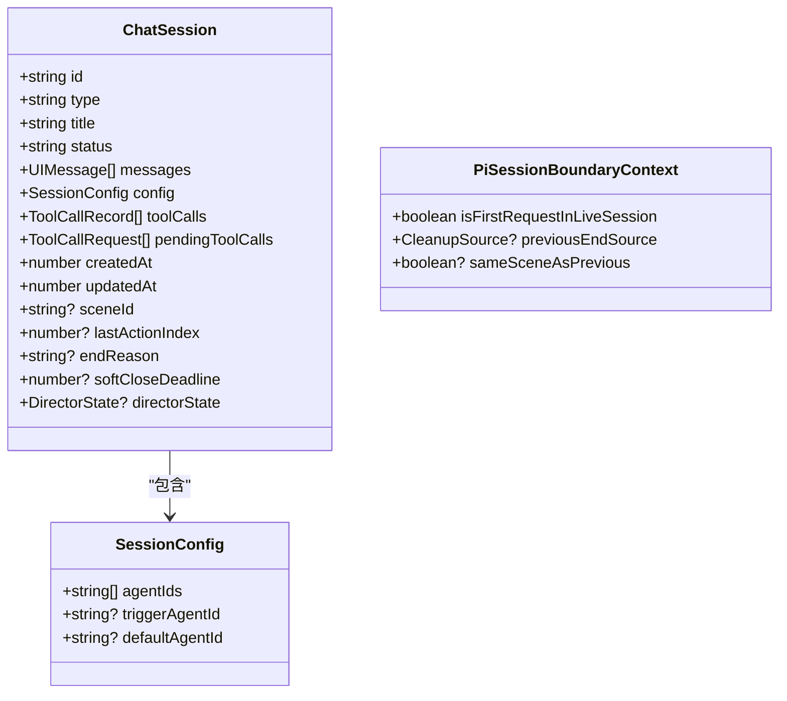
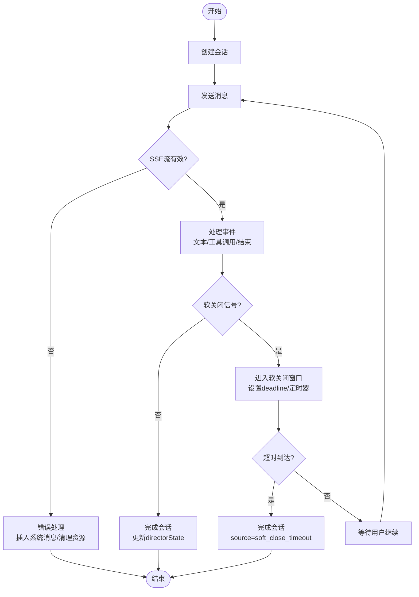
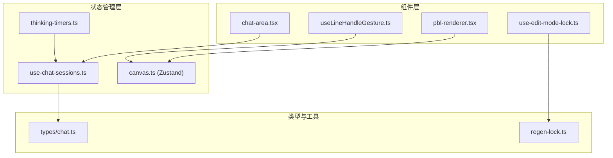

# 组件本地状态

<cite>
**本文引用的文件**   
- [components/chat/use-chat-sessions.ts](file://components/chat/use-chat-sessions.ts)
- [components/chat/chat-area.tsx](file://components/chat/chat-area.tsx)
- [lib/types/chat.ts](file://lib/types/chat.ts)
- [lib/store/canvas.ts](file://lib/store/canvas.ts)
- [components/edit/use-edit-mode-lock.ts](file://components/edit/use-edit-mode-lock.ts)
- [lib/edit/regen-lock.ts](file://lib/edit/regen-lock.ts)
- [app/page.tsx](file://app/page.tsx)
- [components/scene-renderers/pbl-renderer.tsx](file://components/scene-renderers/pbl-renderer.tsx)
- [packages/@openmaic/renderer/src/editing/useLineHandleGesture.ts](file://packages/@openmaic/renderer/src/editing/useLineHandleGesture.ts)
- [lib/agent/client/thinking-timers.ts](file://lib/agent/client/thinking-timers.ts)
</cite>

## 产品概述
OpenMAIC 是一个 AI 驱动的交互式课件（MAIC）生成与课堂管理平台，核心用户场景包括：通过自然语言生成结构化课件、课堂实时互动（问答/讨论/测验）、课件编辑与回放。前端基于 Next.js + React 19 + Zustand 状态管理；AI 编排层使用 LangGraph + Vercel AI SDK；课件格式为自定义 DSL。本章节聚焦“组件本地状态管理”，系统梳理 React Hooks 在复杂交互中的最佳实践，覆盖聊天会话状态、场景生成重试逻辑、编辑器状态管理等，并给出与全局状态的协调方案与性能优化技巧。

## 核心业务流程
- 聊天与会话流：创建会话 → 发送消息 → SSE 流式响应 → 软关闭窗口 → 完成或错误处理 → 持久化到课程存储。
- 编辑器模式锁：跨标签页编辑冲突检测 → 心跳保活 → 离开时释放锁。
- 生成预览与全屏：项目数据标准化 → 变更通知 → 全屏容器同步。
- 手势与拖拽：指针事件 → 距离阈值判定 → 实时更新预览 → 提交变更。

**图表来源** 
- [components/chat/use-chat-sessions.ts](file://components/chat/use-chat-sessions.ts)
- [lib/types/chat.ts](file://lib/types/chat.ts)

**章节来源**
- [components/chat/use-chat-sessions.ts](file://components/chat/use-chat-sessions.ts)
- [lib/types/chat.ts](file://lib/types/chat.ts)

## 功能模块清单
- 聊天会话管理（useChatSessions）
  - 职责：会话生命周期、SSE 流式消费、软关闭窗口、错误恢复、与 StageStore 同步。
  - 验收要点：会话创建/结束正确；软关闭超时自动完成；错误插入系统消息；流中断后清理资源。
- 聊天区域（chat-area）
  - 职责：聚合 useChatSessions 回调、派生视图状态（活跃会话、软关闭标志）、Tab 切换。
  - 验收要点：lecture 与 chat 分离；活跃会话指示器；软关闭状态透传父级。
- 画布状态（canvas store）
  - 职责：元素选择、编辑句柄、分组、隐藏列表、视口缩放与比例、批量重置。
  - 验收要点：多选/单选联动 handleElementId；选中元素自动切设计面板；重置保留视口设置。
- 编辑器模式锁（useEditModeLock + regen-lock）
  - 职责：跨标签页编辑锁、心跳刷新、离开释放、进入编辑前检查冲突。
  - 验收要点：冲突弹窗；心跳保活；无课程 ID 降级为单标签语义；编辑中禁止覆盖生成。
- 生成预览（pbl-renderer）
  - 职责：项目数据标准化、变更检测、全屏容器同步、启动动画控制。
  - 验收要点：结构化克隆避免引用污染；changed 触发上层更新；全屏事件监听同步。
- 手势钩子（useLineHandleGesture）
  - 职责：指针事件捕获、拖拽阈值判定、实时预览、提交意图。
  - 验收要点：阈值以下不触发修改；scale 转换屏幕坐标到画布单位。
- 思考计时（thinking-timers）
  - 职责：按推理块计时、起止标记、时长格式化。
  - 验收要点：多步 agent 的多个推理块独立计时；最后一个块保持运行直到后续部分出现。

**章节来源**
- [components/chat/chat-area.tsx](file://components/chat/chat-area.tsx)
- [lib/store/canvas.ts](file://lib/store/canvas.ts)
- [components/edit/use-edit-mode-lock.ts](file://components/edit/use-edit-mode-lock.ts)
- [lib/edit/regen-lock.ts](file://lib/edit/regen-lock.ts)
- [components/scene-renderers/pbl-renderer.tsx](file://components/scene-renderers/pbl-renderer.tsx)
- [packages/@openmaic/renderer/src/editing/useLineHandleGesture.ts](file://packages/@openmaic/renderer/src/editing/useLineHandleGesture.ts)
- [lib/agent/client/thinking-timers.ts](file://lib/agent/client/thinking-timers.ts)

## 数据与状态
- 聊天会话模型（ChatSession）
  - 字段：类型、标题、状态、消息数组、配置、工具调用、时间戳、场景ID、软关闭截止时间、导演状态等。
  - 辅助函数：更新时间戳、状态转换、分段完成推进、中断标记。
- 会话边界上下文（PiSessionBoundaryContext）
  - 作用：记录首次请求、上一轮结束来源、是否同场景，用于跨轮次一致性。
- 会话状态机
  - active → soft-closing → completed/interrupted/error；支持软关闭窗口内继续或超时完成。
- 全局状态协调
  - 聊天会话通过 StageStore.chats 持久化；画布状态由 CanvasStore 管理；设置与用户信息来自 Settings/UserProfile Store。
- 派生状态与计算
  - 使用 useMemo 派生 lectureNotes、chatSessions、hasActiveChatSession 等，减少重渲染。

**图表来源** 
- [lib/types/chat.ts](file://lib/types/chat.ts)

**章节来源**
- [lib/types/chat.ts](file://lib/types/chat.ts)

## 关键约束与边界
- 非功能性需求
  - 流式响应需处理中断与错误，确保资源清理（AbortController、StreamBuffer shutdown）。
  - 软关闭窗口需在可见性变化时重新校验过期定时器。
  - 跨标签页编辑锁需心跳保活与崩溃恢复（过期锁可被抢占）。
- 依赖与集成边界
  - 聊天会话与 StageStore 双向同步：读持久化、写回持久化；课程切换时重置派生状态。
  - 画布操作与编辑器命令解耦：元素级动作与全局命令分离。
- 业务约束
  - 编辑中的场景禁止静默覆盖生成内容；生成预览需保证数据结构标准化后再通知上层。
  - 手势操作需满足最小移动阈值，避免误触。

**章节来源**
- [components/chat/use-chat-sessions.ts](file://components/chat/use-chat-sessions.ts)
- [lib/store/canvas.ts](file://lib/store/canvas.ts)
- [components/edit/use-edit-mode-lock.ts](file://components/edit/use-edit-mode-lock.ts)
- [lib/edit/regen-lock.ts](file://lib/edit/regen-lock.ts)
- [components/scene-renderers/pbl-renderer.tsx](file://components/scene-renderers/pbl-renderer.tsx)
- [packages/@openmaic/renderer/src/editing/useLineHandleGesture.ts](file://packages/@openmaic/renderer/src/editing/useLineHandleGesture.ts)

## 详细组件分析

### 聊天会话管理（useChatSessions）
- 实现要点
  - useState 管理 sessions、activeSessionId、expandedSessionIds、isStreaming。
  - useRef 保存 AbortController、buffersMap、softCloseRegistrations、previousLiveSessionContext、piSessionBoundaries。
  - useEffect 同步选项回调、阶段切换时重置状态、写入持久化、清理资源。
  - useCallback 封装 createSession、endSession、retireActiveLiveRequest、enterSoftClosing、markSessionCompleted 等。
  - SSE 消费：runPiSingleRequest 解析事件、处理 done/soft_closing/cue_user/completed。
- 性能优化
  - 使用 ref 缓存外部回调以避免依赖变化导致 effect 重跑。
  - 派生状态通过 useMemo 在 chat-area 中计算，减少重复过滤。
- 错误处理
  - clearLiveSessionAfterError 插入系统错误消息、清理资源、回调通知。
  - 软关闭超时 finishSoftCloseTimeout 自动完成会话。

**图表来源** 
- [components/chat/use-chat-sessions.ts](file://components/chat/use-chat-sessions.ts)

**章节来源**
- [components/chat/use-chat-sessions.ts](file://components/chat/use-chat-sessions.ts)

### 聊天区域（chat-area）
- 职责：聚合 useChatSessions 回调，派生 lectureNotes、chatSessions、hasActiveChatSession、softClosingChatSession。
- 状态提升：将 softClosing 状态通过 onSoftClosingChange 通知父级，便于统一 UI 控制。
- 性能：使用 useMemo 派生派生状态，避免每次渲染重新计算。

**章节来源**
- [components/chat/chat-area.tsx](file://components/chat/chat-area.tsx)

### 画布状态（CanvasStore）
- 状态结构：元素选择列表、编辑句柄、分组、隐藏列表、视口尺寸/比例、缩放百分比、拖拽状态。
- 行为：多选联动 handleElementId；选中元素自动切换到设计面板；批量重置保留视口设置。
- 扩展：createSelectors 支持 store.use.xxx() 语法，细粒度订阅。

**章节来源**
- [lib/store/canvas.ts](file://lib/store/canvas.ts)

### 编辑器模式锁（useEditModeLock + regen-lock）
- useEditModeLock：封装跨标签页编辑锁，提供 acquire/release/conflictOpen/dismissConflict。
- regen-lock：纯函数 isSceneEditLocked，阻止编辑中的场景被覆盖生成。
- 心跳：LOCK_HEARTbeat_MS 周期刷新锁，防止浏览器后台标签页锁失效。
- 卸载清理：beforeunload 事件释放锁，避免僵尸锁。

**章节来源**
- [components/edit/use-edit-mode-lock.ts](file://components/edit/use-edit-mode-lock.ts)
- [lib/edit/regen-lock.ts](file://lib/edit/regen-lock.ts)

### 生成预览（pbl-renderer）
- useMemo 对 projectV2 进行结构化克隆与标准化，返回 runtimeProject 与 changed 标志。
- useEffect 监听 changed 并通知上层 onProjectV2Change。
- 全屏同步：监听 document.fullscreenchange，动态更新 portal 宿主元素。

**章节来源**
- [components/scene-renderers/pbl-renderer.tsx](file://components/scene-renderers/pbl-renderer.tsx)

### 手势钩子（useLineHandleGesture）
- 输入：scale、onElementsChange。
- 输出：lineDrag（当前拖拽预览）、onHandlePointerDown（绑定指针事件）。
- 逻辑：记录 pointer-down/up 位移，超过阈值才触发 element.update；scale 转换屏幕坐标到画布单位。

**章节来源**
- [packages/@openmaic/renderer/src/editing/useLineHandleGesture.ts](file://packages/@openmaic/renderer/src/editing/useLineHandleGesture.ts)

### 思考计时（thinking-timers）
- 数据结构：ThinkTimer { startedAt, endedAt? }。
- 状态转移：nextThinkTimer 根据 end 标志与 now 更新计时。
- 格式化：formatThinkDuration 输出人类可读时长（小于10s显示小数，否则整数秒）。

**章节来源**
- [lib/agent/client/thinking-timers.ts](file://lib/agent/client/thinking-timers.ts)

## 架构总览

**图表来源** 
- [components/chat/chat-area.tsx](file://components/chat/chat-area.tsx)
- [components/chat/use-chat-sessions.ts](file://components/chat/use-chat-sessions.ts)
- [lib/store/canvas.ts](file://lib/store/canvas.ts)
- [lib/types/chat.ts](file://lib/types/chat.ts)
- [components/edit/use-edit-mode-lock.ts](file://components/edit/use-edit-mode-lock.ts)
- [lib/edit/regen-lock.ts](file://lib/edit/regen-lock.ts)
- [packages/@openmaic/renderer/src/editing/useLineHandleGesture.ts](file://packages/@openmaic/renderer/src/editing/useLineHandleGesture.ts)
- [lib/agent/client/thinking-timers.ts](file://lib/agent/client/thinking-timers.ts)

## 依赖分析
- 组件耦合
  - chat-area 强依赖 useChatSessions，但通过回调解耦副作用（语音、思考、错误等）。
  - pbl-renderer 依赖 CanvasStore 与类型定义，通过 useMemo 降低重渲染。
  - useEditModeLock 与 regen-lock 解耦：前者负责生命周期，后者提供纯函数判断。
- 间接依赖
  - useChatSessions 依赖 StageStore、SettingsStore、UserProfileStore、AgentRegistry、I18n、ModelConfig。
  - thinking-timers 作为轻量 Zustand store 被运行时驱动，面板读取。
- 循环依赖
  - 未发现直接循环导入；通过类型与接口隔离避免耦合。

**章节来源**
- [components/chat/chat-area.tsx](file://components/chat/chat-area.tsx)
- [components/chat/use-chat-sessions.ts](file://components/chat/use-chat-sessions.ts)
- [components/scene-renderers/pbl-renderer.tsx](file://components/scene-renderers/pbl-renderer.tsx)
- [components/edit/use-edit-mode-lock.ts](file://components/edit/use-edit-mode-lock.ts)
- [lib/edit/regen-lock.ts](file://lib/edit/regen-lock.ts)
- [lib/agent/client/thinking-timers.ts](file://lib/agent/client/thinking-timers.ts)

## 性能考虑
- 使用 useMemo 派生昂贵计算结果（如 lectureNotes、chatSessions、runtimeProject）。
- 使用 useRef 缓存外部回调与临时状态，避免不必要的 effect 重跑。
- 细粒度订阅 Zustand store，仅订阅所需字段。
- 流式处理中及时清理资源（AbortController、StreamBuffer），防止内存泄漏。
- 软关闭定时器在页面不可见时暂停，恢复时重新校验过期。

## 故障排查指南
- 聊天会话中断
  - 检查 runPiSingleRequest 的事件解析与 getPiSingleRequestOutcome 分支。
  - 确认 retireActiveLiveRequest 是否正确清理 buffers 与控制器。
- 软关闭未超时
  - 验证 finishSoftCloseTimeout 定时器是否被正确设置与清除。
  - 检查 visibilitychange 事件是否触发 reconcileExpiredSoftClose。
- 编辑器锁冲突
  - 确认 tryAcquireEditLock 与 refreshEditLock 的键名与时间戳。
  - 检查 beforeunload 事件是否释放锁。
- 画布状态异常
  - 检查 setActiveElementIdList 的联动逻辑与 clearSelection 的完整性。
  - 确认 resetCanvasState 是否保留 viewportSize/viewportRatio。

**章节来源**
- [components/chat/use-chat-sessions.ts](file://components/chat/use-chat-sessions.ts)
- [components/edit/use-edit-mode-lock.ts](file://components/edit/use-edit-mode-lock.ts)
- [lib/store/canvas.ts](file://lib/store/canvas.ts)

## 结论
OpenMAIC 的组件本地状态管理以 React Hooks 为核心，结合 Zustand 全局状态与 IndexedDB 持久化，实现了复杂的聊天会话、编辑器模式锁、生成预览与手势交互。通过 useMemo/useRef/useCallback 优化性能，通过清晰的类型定义与辅助函数保障状态一致性。未来可进一步抽象通用 Hook（如流式状态、定时器管理），提升复用性与可测试性。