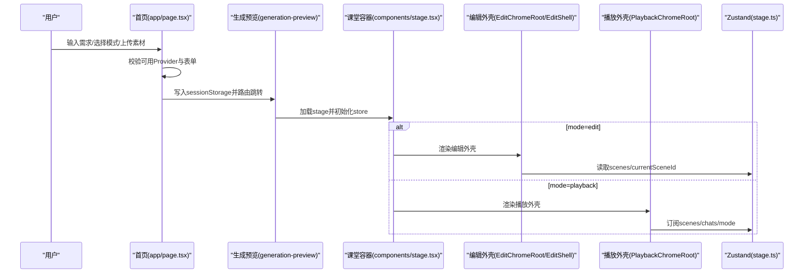
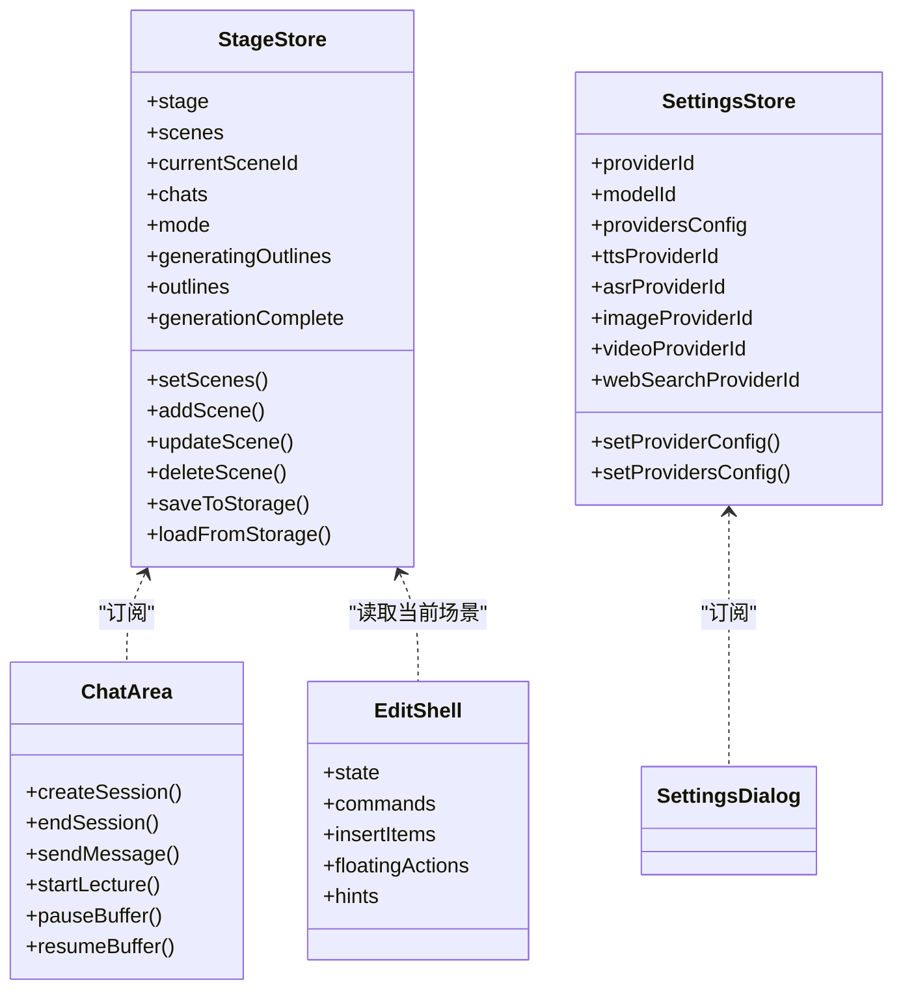
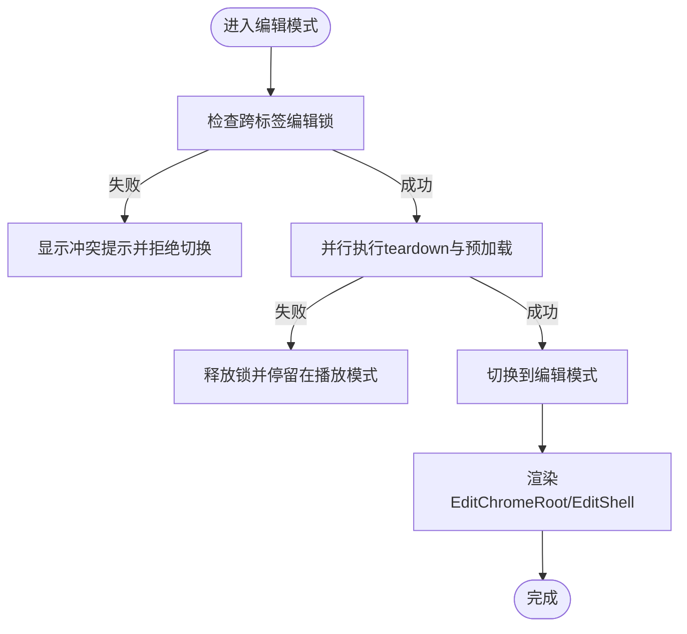
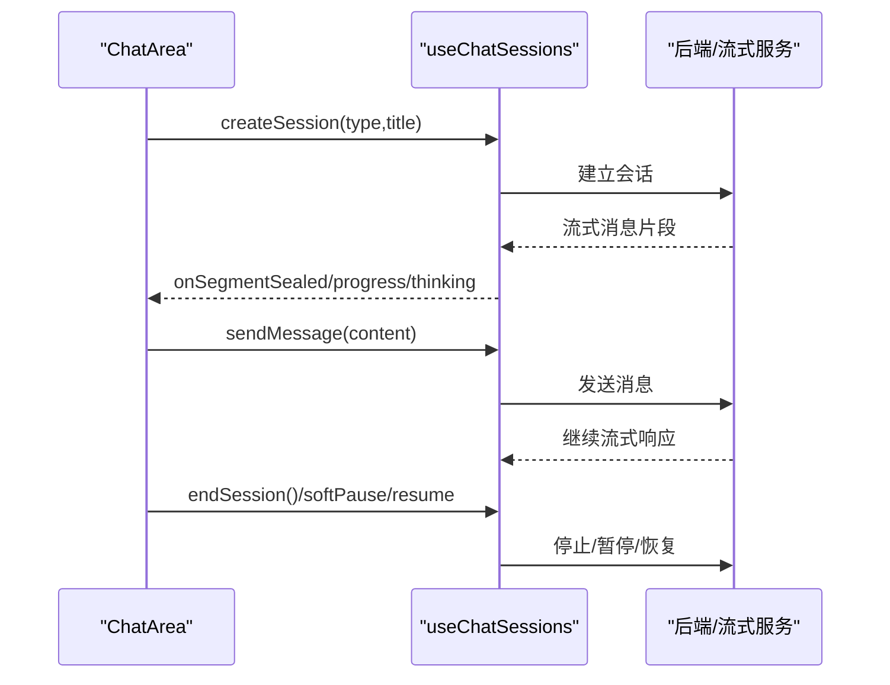

# 业务组件架构

<cite>
**本文引用的文件**   
- [app/page.tsx](file://app/page.tsx)
- [components/stage.tsx](file://components/stage.tsx)
- [components/edit/EditChromeRoot.tsx](file://components/edit/EditChromeRoot.tsx)
- [components/edit/EditShell/EditShell.tsx](file://components/edit/EditShell/EditShell.tsx)
- [components/chat/chat-area.tsx](file://components/chat/chat-area.tsx)
- [components/agent/agent-config-panel.tsx](file://components/agent/agent-config-panel.tsx)
- [components/settings/index.tsx](file://components/settings/index.tsx)
- [lib/store/index.ts](file://lib/store/index.ts)
- [lib/store/stage.ts](file://lib/store/stage.ts)
- [lib/store/settings.ts](file://lib/store/settings.ts)
- [components/scene-renderers/classroom-complete.tsx](file://components/scene-renderers/classroom-complete.tsx)
- [components/scene-renderers/interactive-renderer.tsx](file://components/scene-renderers/interactive-renderer.tsx)
</cite>

## 产品概述
OpenMAIC 是面向课堂与课件的 AI 驱动交互式生成与管理平台。前端基于 Next.js + React + Zustand，核心能力包括：自然语言生成结构化课件、课堂实时互动（问答/讨论/测验）、课件编辑与回放、智能体编排与配置、多模态媒体生成与设置管理。本架构文档聚焦具体业务场景下的 React 组件设计，涵盖课堂渲染器、编辑器外壳、智能体面板、聊天区域与设置界面等核心组件的职责划分、状态管理策略、事件通信机制与数据流设计，并说明与 Zustand 的集成方式、副作用处理、异步操作管理、生命周期与错误边界、性能优化与测试覆盖方案。

## 核心业务流程
- 首页生成入口：用户在首页输入需求、选择模式与素材，校验可用 LLM 提供者后进入生成预览页，随后进入课堂页面。
- 课堂容器 Stage：根据 mode 分发到编辑外壳或播放外壳；跨标签页编辑锁协调；Pro Switch 切换时先 teardown 再切换，保证资源清理与动画平滑。
- 编辑外壳 EditShell：按 scene.type 解析注册表面（如 slide/quiz），通过 SurfaceStateRunner 发布状态，CommandBar/左右侧栏/底部时间轴组合呈现。
- 聊天区域 ChatArea：会话列表与讲座笔记双 Tab，支持软关闭、暂停/恢复、流式输出、语音进度回调、跳转动作等。
- 智能体面板 AgentConfigPanel：查看/删除/新建智能体，联动注册表与持久化。
- 设置界面 SettingsDialog：统一的多 Provider 配置（LLM/PDF/图像/视频/TTS/ASR/搜索），含模型探测、自定义添加、保存与重置。

**图表来源** 
- [app/page.tsx](file://app/page.tsx)
- [components/stage.tsx](file://components/stage.tsx)
- [components/edit/EditChromeRoot.tsx](file://components/edit/EditChromeRoot.tsx)
- [components/edit/EditShell/EditShell.tsx](file://components/edit/EditShell/EditShell.tsx)
- [lib/store/stage.ts](file://lib/store/stage.ts)

**章节来源**
- [app/page.tsx](file://app/page.tsx)
- [components/stage.tsx](file://components/stage.tsx)

## 功能模块清单
- 课堂渲染器（Stage）
  - 职责：mode 分发、编辑锁协调、Pro Switch 切换 choreography、跨标签冲突提示、iframe 宿主保持。
  - 验收要点：编辑/播放模式切换无闪烁；跨标签编辑互斥；可插拔 iframe 存活。
- 编辑器外壳（EditChromeRoot/EditShell）
  - 职责：组装 CommandBar、左右侧栏、底部时间轴；按 scene.type 解析 surface；SurfaceStateRunner 发布状态；预加载编辑器。
  - 验收要点：不同 scene 类型共享 chrome 不重挂载；插入工具栏/浮动工具栏位置稳定；AI 编辑面板与画布解耦。
- 智能体面板（AgentConfigPanel）
  - 职责：展示/编辑/删除智能体；与注册表交互；默认智能体保护。
  - 验收要点：删除确认；非默认不可删；列表滚动与选中态。
- 聊天区域（ChatArea）
  - 职责：讲座笔记与聊天会话双 Tab；会话创建/结束/软关闭；流式消息与语音进度；宽度拖拽与折叠。
  - 验收要点：活跃会话指示；软关闭流程正确；流式缓冲控制；无障碍与键盘可达性。
- 设置界面（SettingsDialog）
  - 职责：多 Provider 配置管理；模型探测与合并；自定义 Provider 添加；TTS/ASR/图像/视频/搜索设置。
  - 验收要点：列宽可调；保存状态反馈；内置 Provider 不可删除；模型列表更新去重。

**章节来源**
- [components/stage.tsx](file://components/stage.tsx)
- [components/edit/EditChromeRoot.tsx](file://components/edit/EditChromeRoot.tsx)
- [components/edit/EditShell/EditShell.tsx](file://components/edit/EditShell/EditShell.tsx)
- [components/agent/agent-config-panel.tsx](file://components/agent/agent-config-panel.tsx)
- [components/chat/chat-area.tsx](file://components/chat/chat-area.tsx)
- [components/settings/index.tsx](file://components/settings/index.tsx)

## 数据与状态
- Zustand 全局 Store
  - lib/store/index.ts 聚合 useCanvasStore/useStageStore/useSnapshotStore/useKeyboardStore/useSettingsStore。
  - StageStore：维护 stage/scenes/currentSceneId/chats/mode/generatingOutlines/outlines/generationComplete 等；提供 save/load、自动迁移、去抖持久化、失败重试与完成标记。
  - SettingsStore：集中管理各 Provider 配置、模型选择、音频/图像/视频/搜索开关与参数、播放速度等。
- 组件内状态
  - 首页 app/page.tsx：表单状态、本地缓存、缩略图对象 URL 回收、搜索延迟过滤、导入流程。
  - ChatArea：Tab 切换、会话展开、拖拽宽度、软关闭倒计时、流式状态。
  - SettingsDialog：分区导航、列宽调整、模型编辑弹窗、保存状态。
- 数据流设计
  - 单向数据流：Store → 组件订阅；组件通过 actions 修改 store；副作用在 useEffect/useLayoutEffect 中触发。
  - 持久化：StageStore.saveToStorage 使用 IndexedDB；Outline 与 agent 配置独立去抖写入；chat snapshot 用于增量恢复。
  - 跨组件通信：props 透传、ref 暴露方法（ChatAreaRef）、useImperativeHandle、事件回调（onXxx）。

**图表来源** 
- [lib/store/index.ts](file://lib/store/index.ts)
- [lib/store/stage.ts](file://lib/store/stage.ts)
- [lib/store/settings.ts](file://lib/store/settings.ts)
- [components/chat/chat-area.tsx](file://components/chat/chat-area.tsx)
- [components/edit/EditShell/EditShell.tsx](file://components/edit/EditShell/EditShell.tsx)

**章节来源**
- [lib/store/index.ts](file://lib/store/index.ts)
- [lib/store/stage.ts](file://lib/store/stage.ts)
- [lib/store/settings.ts](file://lib/store/settings.ts)
- [components/chat/chat-area.tsx](file://components/chat/chat-area.tsx)
- [components/edit/EditShell/EditShell.tsx](file://components/edit/EditShell/EditShell.tsx)

## 关键约束与边界
- 模式切换与资源清理
  - Stage 在 playback→edit 切换前执行 teardown，确保 SSE/engine/TTS 停止后再进入编辑模式；edit→playback 直接翻转。
  - 跨标签编辑锁：进入 edit 前 acquire，失败则拒绝切换并显示冲突提示。
- 编辑器预加载与动画
  - EditChromeRoot 在进入编辑模式前预加载字体与 surface 注册，避免 NOOP 闪烁；chrome 层仅 opacity 过渡，避免 backdrop-filter 重绘。
- 可访问性与动效
  - 尊重 prefers-reduced-motion；课堂完成页与统计数字动画可降级为静态。
- 数据一致性与迁移
  - Scene 内容加载与写入均经过 migrate/hydrate，确保 schemaVersion 兼容；PBL 场景持久化前后转换。
- 性能优化
  - 缩略图对象 URL 及时 revoke；search 查询 useDeferredValue；store 变更去抖保存；iframe keep-alive 池避免重复创建。
- 错误处理
  - 网络/存储异常捕获并 toast；删除/重命名失败回滚；Provider 不可用时禁用生成按钮并引导配置。

**图表来源** 
- [components/stage.tsx](file://components/stage.tsx)
- [components/edit/EditChromeRoot.tsx](file://components/edit/EditChromeRoot.tsx)

**章节来源**
- [components/stage.tsx](file://components/stage.tsx)
- [components/edit/EditChromeRoot.tsx](file://components/edit/EditChromeRoot.tsx)

## 组件设计与实现要点
- 课堂渲染器（Stage）
  - 职责：mode 分发、编辑锁、Pro Switch 切换 choreography、iframe 宿主保持。
  - 关键点：mode 切换使用 AnimatePresence 交叉淡入；PlaybackChromeRoot.teardown 与 preloadEditor 并行；MultiTabEditConflictPrompt 始终挂载。
- 编辑器外壳（EditChromeRoot/EditShell）
  - 职责：组装 chrome、surface 解析、状态发布、命令栏与侧栏。
  - 关键点：SurfaceStateRunner 以 key={scene.type} 作为重挂载边界；surfaceStateEqual 字段级比较避免无限循环；Frame 仅 opacity 过渡。
- 聊天区域（ChatArea）
  - 职责：会话管理与讲座笔记；流式输出与语音进度；软关闭流程。
  - 关键点：useImperativeHandle 暴露 API；onSoftCloseSession 与 onStopSession 协同引擎清理；拖拽宽度与折叠状态。
- 智能体面板（AgentConfigPanel）
  - 职责：智能体 CRUD；默认保护；能力描述与动作标签。
  - 关键点：useAgentRegistry 订阅；删除前 confirm；选中态高亮。
- 设置界面（SettingsDialog）
  - 职责：多 Provider 配置；模型探测与合并；自定义添加；保存状态。
  - 关键点：列宽 resizable；handleModelsFetched 去重 probed 模型；内置 Provider 不可删除；toast 反馈。

**图表来源** 
- [components/chat/chat-area.tsx](file://components/chat/chat-area.tsx)

**章节来源**
- [components/stage.tsx](file://components/stage.tsx)
- [components/edit/EditChromeRoot.tsx](file://components/edit/EditChromeRoot.tsx)
- [components/edit/EditShell/EditShell.tsx](file://components/edit/EditShell/EditShell.tsx)
- [components/chat/chat-area.tsx](file://components/chat/chat-area.tsx)
- [components/agent/agent-config-panel.tsx](file://components/agent/agent-config-panel.tsx)
- [components/settings/index.tsx](file://components/settings/index.tsx)

## 与 Zustand 的集成与副作用管理
- Store 组织
  - lib/store/index.ts 统一导出；StageStore/SettingsStore 为核心。
- 订阅与选择器
  - 组件通过 createSelectors 细粒度订阅，减少不必要重渲染。
- 副作用与异步
  - StageStore.saveToStorage/loadFromStorage 封装 IndexedDB 读写；debounce 降低写压力；chat snapshot 用于增量恢复。
  - ChatArea 通过 ref 暴露方法，父组件调用进行会话控制；流式回调通过 props 上抛。
- 错误处理
  - 网络/存储异常捕获并记录日志；UI 层 toast 提示；失败路径回滚或降级。

**章节来源**
- [lib/store/index.ts](file://lib/store/index.ts)
- [lib/store/stage.ts](file://lib/store/stage.ts)
- [lib/store/settings.ts](file://lib/store/settings.ts)
- [components/chat/chat-area.tsx](file://components/chat/chat-area.tsx)

## 生命周期管理与错误边界
- 组件生命周期
  - Stage：mode 切换时卸载/挂载对应 chrome；iframe host 跨模式存活。
  - EditChromeRoot：body.dataset 标记编辑模式；预加载编辑器；运行时随 Pro 模式挂载/卸载。
  - InteractiveRenderer：mount/claim/release 生命周期由 iframe pool 管理；rect 测量 rAF 循环。
- 错误边界
  - 未显式使用 ErrorBoundary，但通过 try/catch + toast + log.error 兜底；Provider 不可用禁用入口。
- 可访问性
  - 尊重 reduced motion；屏幕阅读器友好（sr-only 状态文本）。

**章节来源**
- [components/stage.tsx](file://components/stage.tsx)
- [components/edit/EditChromeRoot.tsx](file://components/edit/EditChromeRoot.tsx)
- [components/scene-renderers/interactive-renderer.tsx](file://components/scene-renderers/interactive-renderer.tsx)

## 性能监控与优化建议
- 渲染性能
  - 使用 useDeferredValue 延迟搜索过滤；useMemo 计算 lectureNotes/summary；缩略图对象 URL 及时 revoke。
- 存储性能
  - StageStore 去抖保存；agent 配置独立去抖写入；chat snapshot 增量恢复。
- 网络与 I/O
  - Provider 探测结果合并去重；iframe keep-alive 池避免重复创建；SSE/engine teardown 并行执行。
- 监控建议
  - 埋点关键路径耗时（切换模式、保存、加载场景、流式首帧）；错误率与失败原因分类统计。

**章节来源**
- [app/page.tsx](file://app/page.tsx)
- [lib/store/stage.ts](file://lib/store/stage.ts)
- [components/scene-renderers/classroom-complete.tsx](file://components/scene-renderers/classroom-complete.tsx)

## 组件复用模式与组合策略
- 组合优先
  - EditShell 通过 slots（leftRail/rightRail/bottomRail/commandTrailing）组合 chrome，surface 通过 registry 注入。
- 插槽与协议
  - ChatArea 通过 props 回调与 ref 暴露 API，便于父组件编排。
- 注册表模式
  - sceneEditorRegistry 按 type 解析 surface，扩展新场景类型无需改动 chrome。
- 状态发布
  - SurfaceStateRunner 发布 state，chrome 消费；字段级相等比较避免循环。

**章节来源**
- [components/edit/EditShell/EditShell.tsx](file://components/edit/EditShell/EditShell.tsx)
- [components/chat/chat-area.tsx](file://components/chat/chat-area.tsx)

## 测试覆盖方案
- 单元测试
  - Store actions：setScenes/addScene/updateScene/deleteScene/saveToStorage/loadFromStorage；SettingsStore setProviderConfig/setProvidersConfig。
  - ChatArea：createSession/endSession/sendMessage/softPause/resume；软关闭流程分支。
- 集成测试
  - Stage 模式切换：edit↔playback teardown/preload 并行；跨标签编辑锁冲突提示。
  - EditShell：不同 scene.type 下 chrome 不重挂载；插入工具栏位置稳定。
- E2E 测试
  - 首页生成→预览→课堂加载；聊天会话创建/结束；设置保存与刷新一致性。
- 辅助工具
  - 使用 MSW 模拟后端；IndexedDB 测试库隔离环境；Mock iframe pool。

[本节为通用指导，不直接分析具体文件]

## 结论
OpenMAIC 的业务组件架构以 Stage 为容器，EditShell 为编辑外壳，ChatArea 为互动中心，AgentConfigPanel 为智能体管理，SettingsDialog 为配置中枢，配合 Zustand 全局状态与 IndexedDB 持久化，形成清晰的数据流与职责边界。通过注册表与插槽组合、去抖与懒加载、iframe keep-alive 等优化手段，保障性能与可扩展性。建议在后续迭代中补充 ErrorBoundary、完善埋点与自动化测试覆盖率，持续提升稳定性与可维护性。