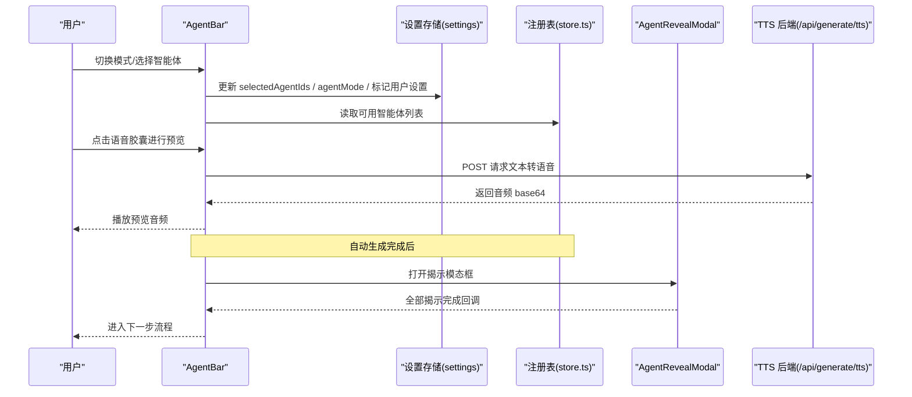
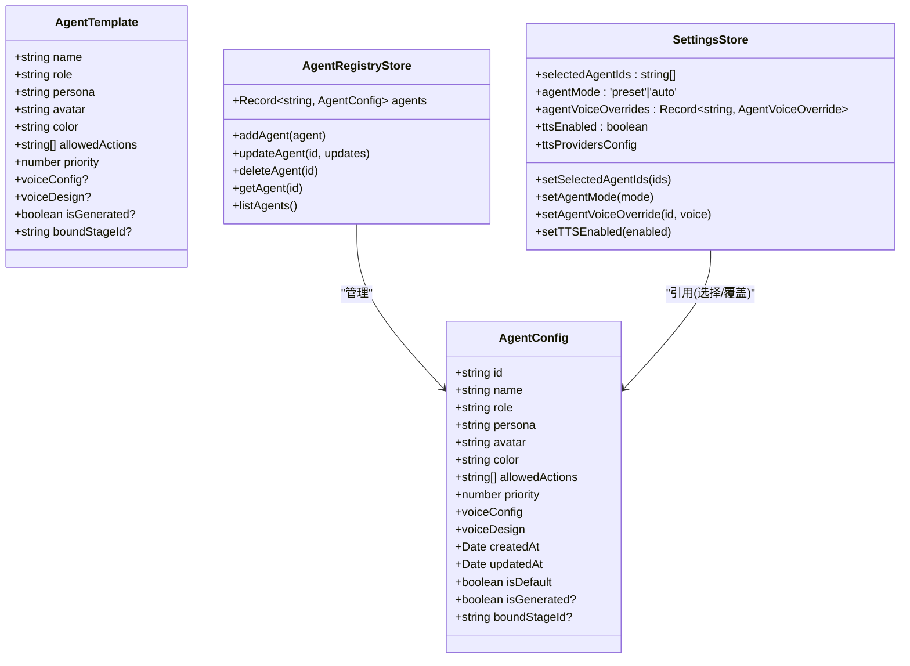
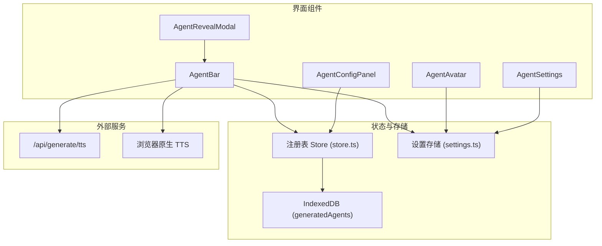
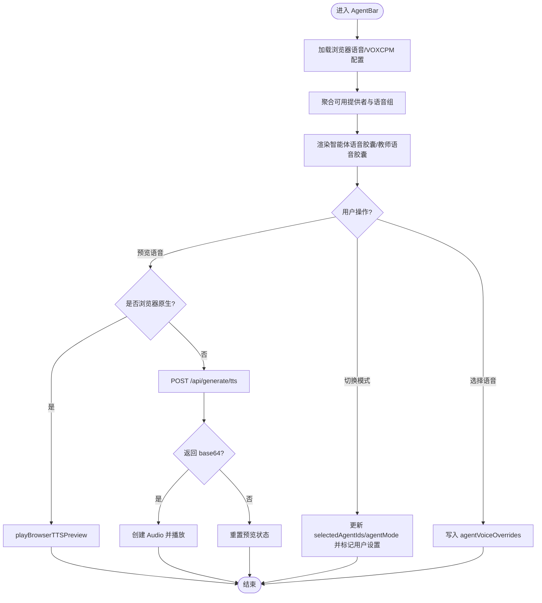
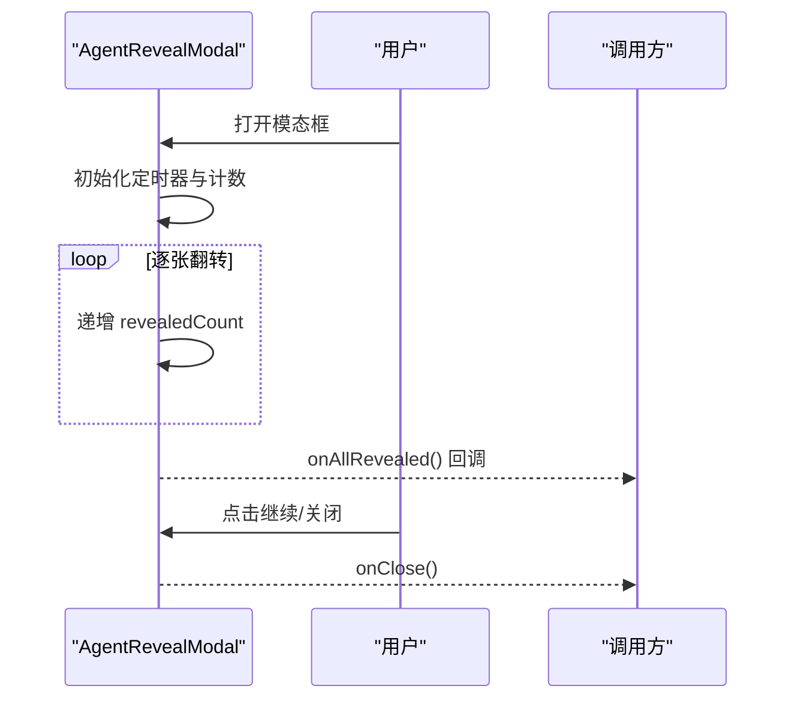
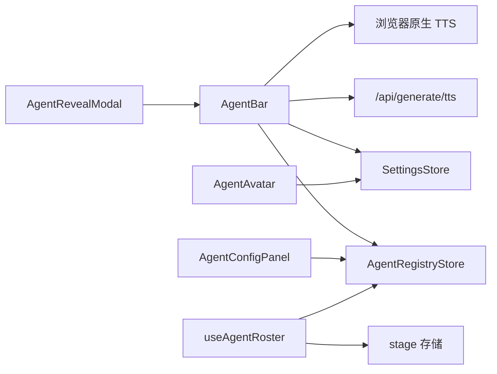

# 智能体界面组件

<cite>
**本文引用的文件**   
- [agent-bar.tsx](file://components/agent/agent-bar.tsx)
- [agent-avatar.tsx](file://components/agent/agent-avatar.tsx)
- [agent-config-panel.tsx](file://components/agent/agent-config-panel.tsx)
- [agent-reveal-modal.tsx](file://components/agent/agent-reveal-modal.tsx)
- [store.ts](file://lib/orchestration/registry/store.ts)
- [types.ts](file://lib/orchestration/registry/types.ts)
- [useAgentRoster.ts](file://components/edit/AgentsView/useAgentRoster.ts)
- [AvatarPicker.tsx](file://components/edit/AgentsView/AvatarPicker.tsx)
- [agent-defaults.ts](file://lib/constants/agent-defaults.ts)
- [settings.ts](file://lib/store/settings.ts)
- [agent-settings.tsx](file://components/settings/agent-settings.tsx)
</cite>

## 产品概述
本组件族围绕“智能体”在课堂与课件场景中的呈现与交互展开，提供：
- 智能体栏（AgentBar）：展示当前模式、选中智能体头像集合、TTS 状态，并提供语音选择与预览。
- 头像（AgentAvatar）：在对话消息中显示智能体头像与名称，支持图片 URL 或 Emoji。
- 配置面板（AgentConfigPanel）：查看与管理注册表中的智能体，支持删除与编辑入口。
- 揭示模态框（AgentRevealModal）：以卡片翻转动画逐步揭示生成的智能体，完成后触发继续流程。

核心价值：
- 统一的多智能体编排与展示，支持预设与自动生成两种模式。
- 可定制的 TTS 语音与预览，提升课堂讲解的沉浸感。
- 持久化的用户偏好（选择、语音覆盖、模式），跨教室恢复一致体验。
- 多语言与主题适配，保证不同文化与视觉风格下的可用性。

适用场景：
- 生成式课堂：自动根据课程阶段生成智能体并揭示。
- 预设课堂：教师手动选择若干智能体参与讨论。
- 回放与编辑：在编辑与回放过程中保持一致的智能体展示与行为。

## 核心业务流程
- 模式切换与选择
  - 在 AgentBar 中切换“预设/自动”模式；预设模式下多选智能体，自动模式下使用已生成的智能体。
  - 选择变更会标记为用户设置，确保跨教室恢复时保留用户选择。
- 语音选择与预览
  - 为每个智能体提供独立的语音覆盖（AgentVoiceOverride），同时全局教师语音由设置存储统一管理。
  - 支持浏览器原生 TTS 与服务器端 TTS 预览，失败时降级提示。
- 智能体揭示
  - 自动生成后通过 AgentRevealModal 逐步翻牌展示，完成后回调上层继续流程。
- 数据同步
  - 注册表 store 管理默认与生成的智能体；设置存储持久化用户选择与语音覆盖。
  - 编辑视图通过 useAgentRoster 维护操作历史并回写 stage。

**章节来源**
- [agent-bar.tsx:614-705](file://components/agent/agent-bar.tsx#L614-L705)
- [agent-bar.tsx:121-197](file://components/agent/agent-bar.tsx#L121-L197)
- [agent-reveal-modal.tsx:45-96](file://components/agent/agent-reveal-modal.tsx#L45-L96)
- [store.ts:336-370](file://lib/orchestration/registry/store.ts#L336-L370)
- [settings.ts:201-245](file://lib/store/settings.ts#L201-L245)

## 功能模块清单
- 智能体栏（AgentBar）
  - 职责：模式切换、智能体多选、TTS 开关与语音选择、教师语音全局控制、预览与错误处理。
  - 验收要点：
    - 预设/自动模式切换正确且不影响非用户设置的残留 ID。
    - 语音胶囊按提供者分组、支持搜索与自动语音标签。
    - 禁用 TTS 时仍显示静音胶囊，不隐藏控件。
    - 预览成功播放，失败时重置状态。
- 头像（AgentAvatar）
  - 职责：在消息中渲染头像与名称，URL 与 Emoji 兼容，尺寸可选。
  - 验收要点：URL 检测正确，fallback 显示首字符，颜色边框一致。
- 配置面板（AgentConfigPanel）
  - 职责：列出注册表智能体，展示角色、能力描述、动作标签，支持删除与编辑入口。
  - 验收要点：默认智能体不可删除，自定义智能体可删改；空状态引导创建。
- 揭示模态框（AgentRevealModal）
  - 职责：逐步翻牌展示智能体卡片，进度点指示，完成后回调。
  - 验收要点：动画流畅，单条与多条分支逻辑正确，关闭按钮可见。
- 设置与偏好
  - 职责：持久化 selectedAgentIds、agentMode、agentVoiceOverrides、ttsEnabled 等。
  - 验收要点：跨会话恢复一致；用户显式选择跨教室保留。

**章节来源**
- [agent-bar.tsx:614-800](file://components/agent/agent-bar.tsx#L614-L800)
- [agent-avatar.tsx:1-49](file://components/agent/agent-avatar.tsx#L1-L49)
- [agent-config-panel.tsx:17-153](file://components/agent/agent-config-panel.tsx#L17-L153)
- [agent-reveal-modal.tsx:45-104](file://components/agent/agent-reveal-modal.tsx#L45-L104)
- [settings.ts:201-245](file://lib/store/settings.ts#L201-L245)

## 数据与状态
- 核心数据模型
  - AgentConfig：包含 id、name、role、persona、avatar、color、allowedActions、priority、voiceConfig、voiceDesign、元数据与生成字段。
  - AgentTemplate：用于新建智能体的模板结构。
  - 参与者映射：agentsToParticipants 将智能体映射为 UI 参与者（含用户）。
- 关键状态流转
  - 注册表 store：维护 agents Map，提供 add/update/delete/list/get；合并持久化与默认智能体；加载/保存生成智能体到 IndexedDB 并预热语音。
  - 设置存储：持久化 selectedAgentIds、agentMode、agentVoiceOverrides、ttsEnabled、ttsProvidersConfig 等；迁移与校验内置提供者。
  - 编辑视图：useAgentRoster 维护操作历史（undo/redo），将变更回写到 stage。
- 数据所有权边界
  - 默认智能体由代码定义，不被缓存覆盖；自定义智能体持久化；生成智能体按 stage 隔离。
  - 语音覆盖优先于注册表记录，避免被默认重置覆盖。

**图表来源**
- [types.ts:9-46](file://lib/orchestration/registry/types.ts#L9-L46)
- [store.ts:17-26](file://lib/orchestration/registry/store.ts#L17-L26)
- [settings.ts:201-245](file://lib/store/settings.ts#L201-L245)

**章节来源**
- [types.ts:9-96](file://lib/orchestration/registry/types.ts#L9-L96)
- [store.ts:207-264](file://lib/orchestration/registry/store.ts#L207-L264)
- [store.ts:336-437](file://lib/orchestration/registry/store.ts#L336-L437)
- [settings.ts:446-491](file://lib/store/settings.ts#L446-L491)

## 关键约束与边界
- 非功能性需求
  - 性能：语音预览需支持中止与清理，避免内存泄漏；大量语音选项需分组与搜索过滤。
  - 可访问性：所有交互元素具备 aria-label；禁用状态明确；键盘可达。
  - 主题与多语言：颜色与文案通过 i18n 与主题变量驱动；自动语音标签本地化。
- 依赖与集成边界
  - TTS 后端：/api/generate/tts 接收 providerId、modelId、voiceId、speed、apiKey、baseUrl、providerOptions，返回 base64 音频。
  - IndexedDB：生成智能体按 stage 隔离读写；注册表与 DB 双向同步。
  - 浏览器原生 TTS：仅 opt-in，质量较低，默认关闭。
- 业务约束
  - 教师智能体不可取消选择；自动模式下清空预设选择以避免不一致。
  - 默认智能体始终由代码值决定，不会被缓存覆盖。
  - 用户显式选择才跨教室恢复，防止课堂级默认覆盖用户偏好。

**章节来源**
- [agent-bar.tsx:666-695](file://components/agent/agent-bar.tsx#L666-L695)
- [store.ts:243-261](file://lib/orchestration/registry/store.ts#L243-L261)
- [settings.ts:477-480](file://lib/store/settings.ts#L477-L480)

## 架构总览

**图表来源**
- [agent-bar.tsx:614-800](file://components/agent/agent-bar.tsx#L614-L800)
- [agent-avatar.tsx:1-49](file://components/agent/agent-avatar.tsx#L1-L49)
- [agent-config-panel.tsx:17-153](file://components/agent/agent-config-panel.tsx#L17-L153)
- [agent-reveal-modal.tsx:45-104](file://components/agent/agent-reveal-modal.tsx#L45-L104)
- [store.ts:336-437](file://lib/orchestration/registry/store.ts#L336-L437)
- [settings.ts:201-245](file://lib/store/settings.ts#L201-L245)

## 详细组件分析

### 智能体栏（AgentBar）
- 设计模式
  - 组合式 UI：模式切换、多选、语音胶囊、教师语音胶囊、TTS 开关。
  - 状态分层：UI 局部状态（popover、查询、预览）+ 全局设置（selectedAgentIds、agentMode、ttsEnabled、ttsProvidersConfig）。
  - 资源管理：预览音频 AbortController 与事件监听清理。
- 交互逻辑
  - 模式切换：预设模式保留 teacher 并确保至少一个智能体；自动模式清空预设选择并使用生成智能体。
  - 语音选择：按提供者分组，支持搜索；自动语音标签本地化；选择写入 agentVoiceOverrides。
  - 预览：浏览器原生直接播放；服务端通过 /api/generate/tts 获取 base64 音频并播放。
- 错误处理
  - 无可用提供者或 TTS 关闭时显示静音胶囊且不交互。
  - 预览失败重置状态，避免卡死。
- 扩展点
  - 新增 TTS 提供者：在 settings.ts 的 ttsProvidersConfig 中添加默认项与校验。
  - 新增语音属性：在 resolveAgentVoiceOptions 与预览路径中透传。

**图表来源**
- [agent-bar.tsx:614-705](file://components/agent/agent-bar.tsx#L614-L705)
- [agent-bar.tsx:121-197](file://components/agent/agent-bar.tsx#L121-L197)

**章节来源**
- [agent-bar.tsx:614-800](file://components/agent/agent-bar.tsx#L614-L800)
- [agent-bar.tsx:350-612](file://components/agent/agent-bar.tsx#L350-L612)

### 头像（AgentAvatar）
- 设计模式
  - 简单展示组件：URL 检测与 fallback 首字符，尺寸与颜色参数化。
- 交互逻辑
  - 无交互，纯展示；颜色来自主题或传入色值。
- 扩展点
  - 新增尺寸档位或样式变体；支持更多占位策略。

**章节来源**
- [agent-avatar.tsx:1-49](file://components/agent/agent-avatar.tsx#L1-L49)

### 配置面板（AgentConfigPanel）
- 设计模式
  - 列表+详情卡片：滚动区域承载，点击选中高亮；默认智能体不可删除。
- 交互逻辑
  - 删除确认；编辑入口预留；空状态引导创建。
- 扩展点
  - 接入编辑对话框；批量操作；导入导出。

**章节来源**
- [agent-config-panel.tsx:17-153](file://components/agent/agent-config-panel.tsx#L17-L153)

### 揭示模态框（AgentRevealModal）
- 设计模式
  - 动画序列：定时器递增 revealedCount，完成后切换 3D 布局为 flat 以便滚动。
  - 卡片正反面：正面展示头像、角色、人设；背面装饰图案。
- 交互逻辑
  - 打开后延迟启动，逐张翻转；全部完成后显示“继续”按钮并回调 onAllRevealed。
- 扩展点
  - 自定义动画时长与间隔；增加音效；支持跳过动画。

**图表来源**
- [agent-reveal-modal.tsx:45-96](file://components/agent/agent-reveal-modal.tsx#L45-L96)
- [agent-reveal-modal.tsx:98-104](file://components/agent/agent-reveal-modal.tsx#L98-L104)

**章节来源**
- [agent-reveal-modal.tsx:45-104](file://components/agent/agent-reveal-modal.tsx#L45-L104)
- [agent-reveal-modal.tsx:105-127](file://components/agent/agent-reveal-modal.tsx#L105-L127)

### 设置与偏好（settings.ts）
- 设计模式
  - 集中式设置存储：持久化、迁移、合并默认与用户配置；校验与修复无效选择。
- 关键能力
  - 智能体相关：selectedAgentIds、agentMode、agentVoiceOverrides、agentSelectionIsUserSet。
  - TTS/ASR：providersConfig、enabled、modelId、customModels、serverDisabled。
  - 媒体与搜索：image/video/webSearch 配置与默认回退。
- 扩展点
  - 新增设置项：在接口与默认初始化中补齐，并在迁移函数中处理旧版本。

**章节来源**
- [settings.ts:201-245](file://lib/store/settings.ts#L201-L245)
- [settings.ts:446-491](file://lib/store/settings.ts#L446-L491)
- [settings.ts:598-645](file://lib/store/settings.ts#L598-L645)

### 编辑视图（useAgentRoster）
- 设计模式
  - 操作历史（past/present/future）：applyOp/undo/redo；脏标记避免初始物化触发持久化。
- 交互逻辑
  - 从 stage 物化 roster；增删改查与重排；最后回写 stage。
- 扩展点
  - 扩展操作类型；引入撤销栈限制与合并策略。

**章节来源**
- [useAgentRoster.ts:68-187](file://components/edit/AgentsView/useAgentRoster.ts#L68-L187)

### 头像选择器（AvatarPicker）
- 设计模式
  - 网格选择器：内置头像常量，选中高亮，无障碍标签。
- 扩展点
  - 动态加载头像；支持上传自定义头像。

**章节来源**
- [AvatarPicker.tsx:1-36](file://components/edit/AgentsView/AvatarPicker.tsx#L1-L36)
- [agent-defaults.ts:1-41](file://lib/constants/agent-defaults.ts#L1-L41)

## 依赖分析
- 组件耦合
  - AgentBar 强依赖设置存储与注册表；预览依赖 TTS 后端与浏览器原生能力。
  - AgentRevealModal 弱依赖调用方回调，内部自管动画状态。
  - AgentConfigPanel 与 useAgentRoster 分别面向管理与编辑，均依赖注册表。
- 外部依赖
  - TTS 后端：/api/generate/tts；浏览器 SpeechSynthesis。
  - IndexedDB：generatedAgents 表按 stage 隔离。
- 潜在循环依赖
  - 组件层无循环；状态层通过 store.ts 与 settings.ts 解耦。

**图表来源**
- [agent-bar.tsx:614-800](file://components/agent/agent-bar.tsx#L614-L800)
- [store.ts:336-437](file://lib/orchestration/registry/store.ts#L336-L437)
- [settings.ts:201-245](file://lib/store/settings.ts#L201-L245)

**章节来源**
- [agent-bar.tsx:614-800](file://components/agent/agent-bar.tsx#L614-L800)
- [store.ts:336-437](file://lib/orchestration/registry/store.ts#L336-L437)
- [settings.ts:201-245](file://lib/store/settings.ts#L201-L245)

## 性能考虑
- 语音预览
  - 使用 AbortController 中断请求；及时释放 Audio 实例与事件监听。
  - 对 VOXCPM 自动语音禁用预览，避免无效请求。
- 列表与过滤
  - 语音分组与搜索在前端执行，减少不必要渲染；最大高度滚动。
- 状态持久化
  - 设置存储使用持久化中间件，合并默认与用户配置，避免全量重建。
- 动画
  - 揭示模态框在全部翻转完成后切换布局，避免 3D 影响滚动性能。

[本节为通用指导，不直接分析具体文件]

## 故障排查指南
- 无法预览语音
  - 检查 ttsEnabled 与提供者 enabled；确认 apiKey/baseUrl 配置；查看 /api/generate/tts 响应。
  - 浏览器原生 TTS 未启用或无可用语音。
- 语音选择不生效
  - 确认 agentVoiceOverrides 是否正确写入；默认智能体会被代码重置，覆盖需通过设置存储。
- 自动生成智能体未显示
  - 检查 IndexedDB 中 generatedAgents 是否有记录；确认 loadGeneratedAgentsForStage 是否调用。
- 模式切换异常
  - 自动模式下应清空预设选择；预设模式需确保至少一个智能体且包含教师。

**章节来源**
- [agent-bar.tsx:121-197](file://components/agent/agent-bar.tsx#L121-L197)
- [store.ts:336-370](file://lib/orchestration/registry/store.ts#L336-L370)
- [settings.ts:477-480](file://lib/store/settings.ts#L477-L480)

## 结论
智能体界面组件通过清晰的职责划分与稳健的状态管理，实现了多智能体的灵活展示与交互。结合 TTS 预览、揭示动画与持久化偏好，提供了良好的用户体验与可扩展性。建议在后续迭代中持续完善可访问性、国际化与性能优化，并基于现有扩展点丰富自定义能力。

[本节为总结，不直接分析具体文件]