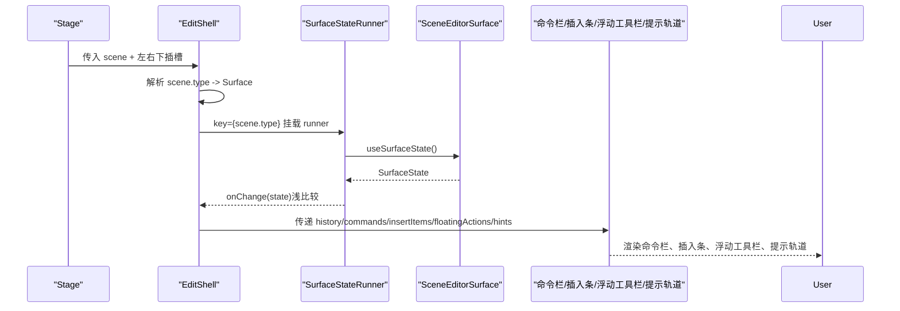
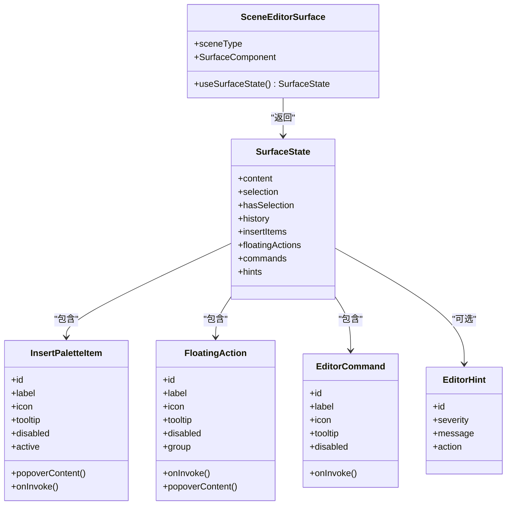

# 编辑器外壳组件

<cite>
**本文引用的文件**   
- [EditShell.tsx](file://components/edit/EditShell/EditShell.tsx)
- [CommandBar.tsx](file://components/edit/EditShell/CommandBar.tsx)
- [FloatingToolbar.tsx](file://components/edit/EditShell/FloatingToolbar.tsx)
- [HintRail.tsx](file://components/edit/EditShell/HintRail.tsx)
- [FloatingInsertToolbar.tsx](file://components/edit/EditShell/FloatingInsertToolbar.tsx)
- [InsertButton.tsx](file://components/edit/EditShell/InsertButton.tsx)
- [index.ts](file://components/edit/EditShell/index.ts)
- [scene-editor-surface.ts](file://lib/edit/scene-editor-surface.ts)
- [scene-editor-registry.ts](file://lib/edit/scene-editor-registry.ts)
- [scene-timeline.ts](file://components/edit/scene-timeline.ts)
- [use-edit-mode-lock.ts](file://components/edit/use-edit-mode-lock.ts)
- [MultiTabEditConflictPrompt.tsx](file://components/edit/MultiTabEditConflictPrompt.tsx)
- [agent-panel-visibility.ts](file://components/edit/agent-panel-visibility.ts)
- [RightRailTabs.tsx](file://components/edit/RightRailTabs.tsx)
</cite>

## 目录
- 产品概述
- 核心业务流程
- 功能模块清单
- 数据与状态
- 关键约束与边界

## 产品概述
本文件面向 OpenMAIC 的“编辑模式”外壳组件 EditShell，作为编辑模式的顶级容器，负责协调命令栏、浮动工具栏、提示轨道、插入条以及右侧智能体面板等子组件。它通过场景编辑器注册表将不同场景类型（如幻灯片、测验等）的编辑表面统一接入，屏蔽具体实现差异，提供一致的撤销重做、选择上下文操作、插入元素与 AI 协作体验。同时，EditShell 与场景时间线解耦，支持多标签页编辑锁定冲突处理，并提供键盘快捷键、拖拽定位与实时预览能力，便于扩展新的编辑功能。

## 核心业务流程
- 进入编辑模式：EditShell 根据当前 scene.type 解析对应 Surface，若未注册则回退到 NOOP_SURFACE；SurfaceStateRunner 调用 surface.useSurfaceState() 获取状态并浅比较后发布给外壳。
- 渲染外壳框架：Frame 使用 StageGrid 布局顶部命令栏、左侧导航、中心画布、右侧面板与底部轨道；各层以淡入动画入场，避免布局抖动。
- 用户交互：
  - 命令栏：返回主页、撤销/重做、场景级命令、全局控制插槽（设置/Pro开关/下载）。
  - 插入条：可拖拽定位，支持键盘移动与 Tooltip 提示，点击按钮触发插入或弹出子面板。
  - 浮动工具栏：选中内容时显示，支持分组、Popover 属性面板与危险操作高亮。
  - 提示轨道：预留 AI 教练位，按严重级别展示信息卡片并可带动作。
- 智能体面板：右侧面板按条件渲染，包含“AI 编辑”和“课堂阵容”两个 Tab，支持会话历史、清空对话、折叠展开与宽度拖拽调整。
- 多标签冲突：尝试获取编辑锁失败时弹出冲突提示，阻止进入编辑模式。
- 时间线集成：根据场景类型与是否注册了编辑表面决定是否显示旁白时间线。

图表来源 
- [EditShell.tsx](file://components/edit/EditShell/EditShell.tsx)
- [scene-editor-surface.ts](file://lib/edit/scene-editor-surface.ts)
- [scene-editor-registry.ts](file://lib/edit/scene-editor-registry.ts)

章节来源
- [EditShell.tsx](file://components/edit/EditShell/EditShell.tsx)
- [scene-editor-surface.ts](file://lib/edit/scene-editor-surface.ts)
- [scene-editor-registry.ts](file://lib/edit/scene-editor-registry.ts)

## 功能模块清单
- EditShell（编辑外壳）
  - 职责：编排命令栏、插入条、浮动工具栏、提示轨道与 Surface 渲染；管理状态发布与动画过渡。
  - 验收要点：切换场景类型不闪烁；无 Surface 时回退正常；插入条位置持久化；提示轨道占位正确。
- CommandBar（命令栏）
  - 职责：返回主页、撤销/重做、场景命令、trailing 插槽（全局控制）。
  - 验收要点：history 存在时才显示撤销/重做；命令项禁用态与 tooltip 正确。
- FloatingInsertToolbar（浮动插入条）
  - 职责：可拖拽定位、键盘移动、Tooltip、子 Popover。
  - 验收要点：拖拽限制在画布内；Shift+方向键大步长；键盘焦点与无障碍标签。
- FloatingToolbar（浮动工具栏）
  - 职责：选中内容时的上下文操作，支持分组与 Popover 属性面板。
  - 验收要点：danger 样式；Popover 打开不抢焦点；连续格式化不关闭。
- HintRail（提示轨道）
  - 职责：AI 教练提示，预留空间计算，按严重级别展示。
  - 验收要点：无 hints 时不渲染；reserveSpace 时动态更新 CSS 变量。
- RightRailTabs（右侧面板）
  - 职责：AI 编辑与课堂阵容双 Tab，会话历史、清空对话、折叠与宽度拖拽。
  - 验收要点：AI Tab 条件渲染；Tab 切换保持状态；拖拽边界限制。
- 编辑锁与冲突提示
  - 职责：跨标签页编辑锁、心跳刷新、释放锁；冲突弹窗。
  - 验收要点：无课程 ID 降级为单标签语义；beforeunload 释放锁；冲突弹窗仅可关闭。
- 时间线支持
  - 职责：判断是否支持旁白时间线（已注册表面或特定场景类型）。
  - 验收要点：interactive/pbl 即使无表面也支持时间线。

章节来源
- [EditShell.tsx](file://components/edit/EditShell/EditShell.tsx)
- [CommandBar.tsx](file://components/edit/EditShell/CommandBar.tsx)
- [FloatingInsertToolbar.tsx](file://components/edit/EditShell/FloatingInsertToolbar.tsx)
- [FloatingToolbar.tsx](file://components/edit/EditShell/FloatingToolbar.tsx)
- [HintRail.tsx](file://components/edit/EditShell/HintRail.tsx)
- [RightRailTabs.tsx](file://components/edit/RightRailTabs.tsx)
- [use-edit-mode-lock.ts](file://components/edit/use-edit-mode-lock.ts)
- [MultiTabEditConflictPrompt.tsx](file://components/edit/MultiTabEditConflictPrompt.tsx)
- [scene-timeline.ts](file://components/edit/scene-timeline.ts)

## 数据与状态
- SurfaceState 字段与用途
  - content：当前场景内容引用，作为“真实变更”信号。
  - selection：当前选择对象（由 Surface 定义）。
  - hasSelection：是否存在有效选择，驱动浮动工具栏显隐。
  - history：撤销/重做能力（canUndo/canRedo/undo/redo），不存在则隐藏相关控件。
  - insertItems：插入条项目数组（id/label/icon/tooltip/disabled/active/popoverContent）。
  - floatingActions：浮动工具栏动作（分组、Popover、危险操作）。
  - commands：命令栏全局命令（id/label/icon/tooltip/disabled/onInvoke）。
  - hints：AI 提示轨道（severity/message/action）。
- 状态发布与浅比较
  - SurfaceStateRunner 调用 surface.useSurfaceState()，使用 surfaceStateEqual 进行字段级浅比较，避免无限循环发布。
  - 新增 chrome 读取字段需同步更新比较函数。
- 注册表机制
  - sceneEditorRegistry 维护 SceneType -> Surface 映射，支持 HMR 清理与测试卸载。
- 智能体面板可见性
  - shouldRenderAgentPanel 基于 agentEnabled/hasMessages/isRunning 决定“AI 编辑”Tab 是否可用。
- 时间线支持判定
  - supportsNarrationTimeline 对已注册表面或特定场景类型（interactive/pbl）返回 true。

图表来源 
- [scene-editor-surface.ts](file://lib/edit/scene-editor-surface.ts)

章节来源
- [scene-editor-surface.ts](file://lib/edit/scene-editor-surface.ts)
- [scene-editor-registry.ts](file://lib/edit/scene-editor-registry.ts)
- [agent-panel-visibility.ts](file://components/edit/agent-panel-visibility.ts)
- [scene-timeline.ts](file://components/edit/scene-timeline.ts)

## 关键约束与边界
- 架构约束
  - EditShell 不直接分支到不同组件类型，始终通过注册表解析 Surface，保证 chrome 稳定不重挂载。
  - SurfaceStateRunner 以 key={scene.type} 作为重新挂载边界，确保 hooks 签名变化安全。
- 性能与动画
  - 使用 motion/react 的淡入动画与 layoutId 共享元素过渡，避免 transform 导致 backdrop-filter 重算。
  - 插入条拖拽使用 MotionValue，减少重排；ResizeObserver 动态计算提示轨道高度。
- 可访问性与键盘交互
  - 插入条支持 Enter/Space 启动拖拽、Esc 退出、方向键移动（Shift 大步长），并提供 aria-label 与 aria-pressed。
  - 浮动工具栏 Popover 阻止自动聚焦与外部焦点事件，保证选择上下文不被打断。
- 多标签冲突与生命周期
  - 无课程 ID 时降级为单标签语义；持有锁期间定时心跳刷新；页面卸载与组件卸载释放锁。
  - 冲突弹窗仅可关闭，不提供修复路径。
- 扩展点与最佳实践
  - 新增 Surface 时，需在注册表注册，并在 SurfaceState 中声明所有 chrome 读取字段，同步更新 surfaceStateEqual。
  - 插入项与浮动动作应提供稳定的 id、label、tooltip，必要时使用 popoverContent 承载复杂 UI。
  - 提示轨道预留接口，Phase 1 返回空数组，后续可按 severity 扩展行为。
  - 右侧面板 Tab 逻辑受 shouldRenderAgentPanel 控制，确保不可用时自动回退。

章节来源
- [EditShell.tsx](file://components/edit/EditShell/EditShell.tsx)
- [FloatingInsertToolbar.tsx](file://components/edit/EditShell/FloatingInsertToolbar.tsx)
- [FloatingToolbar.tsx](file://components/edit/EditShell/FloatingToolbar.tsx)
- [HintRail.tsx](file://components/edit/EditShell/HintRail.tsx)
- [use-edit-mode-lock.ts](file://components/edit/use-edit-mode-lock.ts)
- [MultiTabEditConflictPrompt.tsx](file://components/edit/MultiTabEditConflictPrompt.tsx)
- [RightRailTabs.tsx](file://components/edit/RightRailTabs.tsx)
- [scene-editor-surface.ts](file://lib/edit/scene-editor-surface.ts)