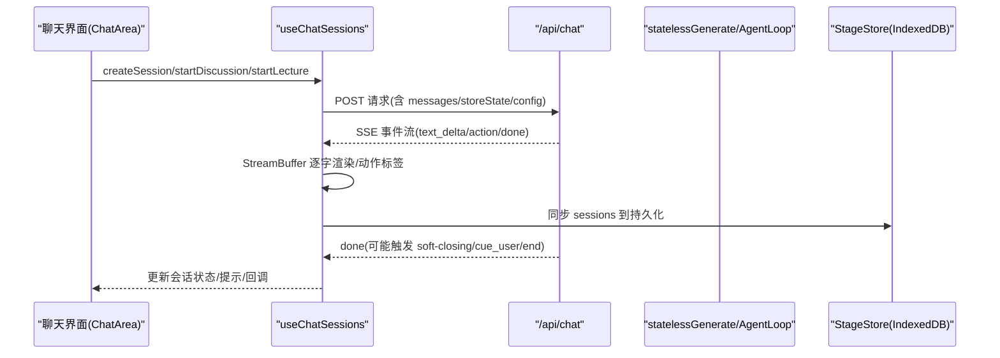
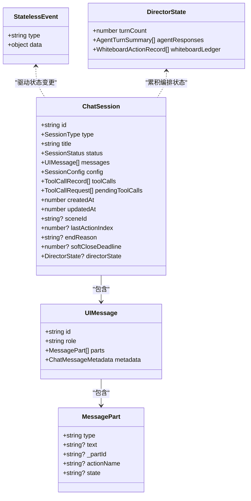
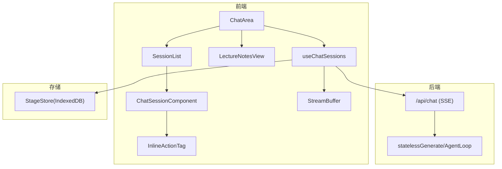
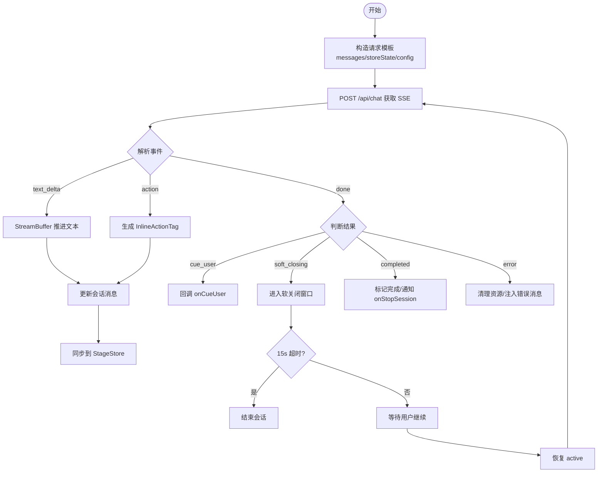
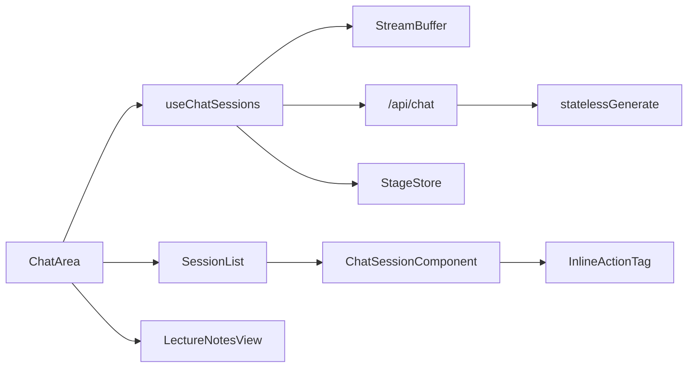

# 聊天界面组件

<cite>
**本文引用的文件**   
- [components/chat/chat-area.tsx](file://components/chat/chat-area.tsx)
- [components/chat/session-list.tsx](file://components/chat/session-list.tsx)
- [components/chat/chat-session.tsx](file://components/chat/chat-session.tsx)
- [components/chat/inline-action-tag.tsx](file://components/chat/inline-action-tag.tsx)
- [components/chat/use-chat-sessions.ts](file://components/chat/use-chat-sessions.ts)
- [lib/types/chat.ts](file://lib/types/chat.ts)
- [app/api/chat/route.ts](file://app/api/chat/route.ts)
- [lib/chat/agent-loop.ts](file://lib/chat/agent-loop.ts)
- [components/chat/lecture-notes-view.tsx](file://components/chat/lecture-notes-view.tsx)
</cite>

## 产品概述
本组件为 OpenMAIC 的“聊天界面”核心，提供课堂场景下的多智能体对话、实时流式消息展示、会话管理与讲稿笔记视图。它通过 SSE（Server-Sent Events）与后端 /api/chat 进行无状态通信，结合前端 StreamBuffer 实现逐字渲染与动作标签内联显示；同时支持讨论/QA 会话的软关闭窗口、讲师讲稿自动生成与跳转联动，以及与 AI 编排层（LangGraph + Vercel AI SDK）的多智能体协调、上下文传递与消息路由。

## 核心业务流程
- 创建会话：用户选择类型（qa/discussion/lecture），前端构造请求模板并调用 runPiSingleRequest 或 runAgentLoop，进入流式处理。
- 流式接收：SSE 事件经 TextDecoder 分片解析，StreamBuffer 按字符节奏推进文本，动作事件生成 InlineActionTag。
- 会话状态：active → soft-closing（15s 缓冲）→ completed/interrupted/error；软关闭可由用户继续或超时结束。
- 持久化：每轮更新写入 stage store（IndexedDB），切换 stage 时恢复会话列表与状态。
- 讲稿视图：基于 scenes/actions 构建 LectureNoteEntry，当前页高亮并可跳转到对应 action。

**图表来源** 
- [components/chat/chat-area.tsx:86-230](file://components/chat/chat-area.tsx#L86-L230)
- [components/chat/use-chat-sessions.ts:327-416](file://components/chat/use-chat-sessions.ts#L327-L416)
- [app/api/chat/route.ts:44-196](file://app/api/chat/route.ts#L44-L196)
- [lib/chat/agent-loop.ts:125-237](file://lib/chat/agent-loop.ts#L125-L237)

**章节来源**
- [components/chat/chat-area.tsx:86-230](file://components/chat/chat-area.tsx#L86-L230)
- [components/chat/use-chat-sessions.ts:327-416](file://components/chat/use-chat-sessions.ts#L327-L416)
- [app/api/chat/route.ts:44-196](file://app/api/chat/route.ts#L44-L196)
- [lib/chat/agent-loop.ts:125-237](file://lib/chat/agent-loop.ts#L125-L237)

## 功能模块清单
- 聊天区域 ChatArea
  - 职责：Tab 切换（讲稿/聊天）、拖拽调整宽度、聚合会话管理、暴露命令式 API（ref）。
  - 关键点：监听 activeBubbleId 滚动定位、软关闭状态透传、讲座消息 ID 映射。
- 会话列表 SessionList
  - 职责：会话卡片展开/折叠、状态徽标、消息计数、操作按钮（结束/继续）。
  - 关键点：活跃会话高亮、脉冲动画、软关闭倒计时。
- 会话内容 ChatSessionComponent
  - 职责：消息气泡渲染、自动滚动、活动气泡高亮、结束/软关闭控制。
  - 关键点：MessageBubble 按 parts 渲染 text/action，最后一条消息追加闪烁光标。
- 动作标签 InlineActionTag
  - 职责：将 agent 动作以内联标签呈现（聚光灯/激光/白板/讨论等）。
  - 关键点：运行态加载动画、白板家族样式前缀。
- 会话管理 Hook useChatSessions
  - 职责：SSE 消费、StreamBuffer 生命周期、会话状态机、软关闭窗口、持久化同步、错误清理。
  - 关键点：runPiSingleRequest/runAgentLoop、PI session boundary、directorState 累积。
- 类型定义 lib/types/chat.ts
  - 职责：会话/消息/事件/请求/响应类型、工具调用记录、讲稿条目结构。
- 后端接口 app/api/chat/route.ts
  - 职责：校验请求、模型解析、SSE 流式输出、心跳保活、错误事件回送。
- 讲稿视图 LectureNotesView
  - 职责：按 scene 分组展示演讲文本与内联动作，当前页高亮与跳转。
- 软关闭倒计时 use-soft-close-countdown
  - 职责：每秒刷新剩余秒数，页面可见性变化时重新计算。

**章节来源**
- [components/chat/chat-area.tsx:86-230](file://components/chat/chat-area.tsx#L86-L230)
- [components/chat/session-list.tsx:46-147](file://components/chat/session-list.tsx#L46-L147)
- [components/chat/chat-session.tsx:159-387](file://components/chat/chat-session.tsx#L159-L387)
- [components/chat/inline-action-tag.tsx:85-127](file://components/chat/inline-action-tag.tsx#L85-L127)
- [components/chat/use-chat-sessions.ts:418-800](file://components/chat/use-chat-sessions.ts#L418-L800)
- [lib/types/chat.ts:1-449](file://lib/types/chat.ts#L1-L449)
- [app/api/chat/route.ts:44-196](file://app/api/chat/route.ts#L44-L196)
- [components/chat/lecture-notes-view.tsx:65-291](file://components/chat/lecture-notes-view.tsx#L65-L291)

## 数据与状态
- 核心数据模型
  - ChatSession：会话实体（id/type/title/status/messages/config/toolCalls/pendingToolCalls/createdAt/updatedAt/sceneId/lastActionIndex/endReason/softCloseDeadline/directorState）。
  - UIMessage<ChatMessageMetadata>：消息体，parts 包含 text/step-start/action-* 片段。
  - StatelessEvent：SSE 事件（agent_start/text_delta/action/thinking/cue_user/done/error）。
  - DirectorState：跨请求累积的编排状态（turnCount/agentResponses/whiteboardLedger）。
  - LectureNoteEntry/LectureNoteItem：讲稿条目与项（speech/action 有序）。
- 关键状态流转
  - 会话状态：idle → active → soft-closing → completed/interrupted/error。
  - 流式状态：isStreaming、streamingSessionIdRef、buffersRef（per-session StreamBuffer）。
  - 软关闭：进入后注册 token+deadline，15s 超时自动结束；用户可 continue 恢复 active。
  - 持久化：sessions → setChats → IndexedDB；stage 切换时 normalizeStoredSessionsForRestore。
- 数据所有权边界
  - 前端维护 messages/storeState/directorState；后端无状态，仅返回事件。
  - 讲稿由 scenes/actions 构建，不依赖后端。

**图表来源** 
- [lib/types/chat.ts:49-108](file://lib/types/chat.ts#L49-L108)
- [lib/types/chat.ts:299-303](file://lib/types/chat.ts#L299-L303)
- [lib/types/chat.ts:408-448](file://lib/types/chat.ts#L408-L448)

**章节来源**
- [lib/types/chat.ts:49-108](file://lib/types/chat.ts#L49-L108)
- [lib/types/chat.ts:299-303](file://lib/types/chat.ts#L299-L303)
- [lib/types/chat.ts:408-448](file://lib/types/chat.ts#L408-L448)
- [components/chat/use-chat-sessions.ts:418-800](file://components/chat/use-chat-sessions.ts#L418-L800)

## 关键约束与边界
- 非功能性需求
  - 低延迟：默认 thinking disabled，SSE 心跳 15s 保活，最大时长 60s。
  - 稳定性：连续两次空 agent 响应即停止循环；错误路径清理 buffer 并注入错误消息。
  - 一致性：冲突顺序时钟 nextChatUpdatedAt 保证 restored 数据排序稳定。
- 依赖与集成边界
  - 后端无状态：每次请求携带完整 messages/storeState/directorState。
  - 前端编排：runAgentLoop/runPiSingleRequest 统一消费 SSE，封装 onEvent/onIterationEnd。
  - 持久化：StageStore.chats 使用 IndexedDB，切换 stage 时隔离数据。
- 业务约束
  - 会话类型：qa/discussion/lecture；lecture 仅用于讲稿视图，不参与聊天 Tab。
  - 软关闭窗口：15s 缓冲，允许继续或超时结束；避免误关导致课堂中断。
  - 动作系统：action-* 片段在 StreamBuffer 揭示后才显示，确保时序正确。

**章节来源**
- [app/api/chat/route.ts:25-26](file://app/api/chat/route.ts#L25-L26)
- [app/api/chat/route.ts:96-196](file://app/api/chat/route.ts#L96-L196)
- [lib/chat/agent-loop.ts:224-236](file://lib/chat/agent-loop.ts#L224-L236)
- [lib/types/chat.ts:79-98](file://lib/types/chat.ts#L79-L98)
- [components/chat/use-chat-sessions.ts:663-704](file://components/chat/use-chat-sessions.ts#L663-L704)

## 架构总览

**图表来源** 
- [components/chat/chat-area.tsx:86-230](file://components/chat/chat-area.tsx#L86-L230)
- [components/chat/session-list.tsx:46-147](file://components/chat/session-list.tsx#L46-L147)
- [components/chat/chat-session.tsx:159-387](file://components/chat/chat-session.tsx#L159-L387)
- [components/chat/inline-action-tag.tsx:85-127](file://components/chat/inline-action-tag.tsx#L85-L127)
- [components/chat/lecture-notes-view.tsx:65-291](file://components/chat/lecture-notes-view.tsx#L65-L291)
- [components/chat/use-chat-sessions.ts:418-800](file://components/chat/use-chat-sessions.ts#L418-L800)
- [app/api/chat/route.ts:44-196](file://app/api/chat/route.ts#L44-L196)

## 详细组件分析

### 聊天区域 ChatArea
- 设计要点
  - 双 Tab：讲稿（LectureNotesView）与聊天（SessionList）。
  - 命令式 API：createSession/endSession/sendMessage/startDiscussion/startLecture 等通过 ref 暴露。
  - 交互：拖拽宽度、活跃气泡滚动定位、软关闭状态透传给父级。
- 性能
  - useMemo 派生 lectureNotes 与 chatSessions，减少重渲染。
  - 底部滚动锚点 bottomRef 保障新消息可见。

**章节来源**
- [components/chat/chat-area.tsx:86-230](file://components/chat/chat-area.tsx#L86-L230)
- [components/chat/chat-area.tsx:232-262](file://components/chat/chat-area.tsx#L232-L262)
- [components/chat/chat-area.tsx:324-364](file://components/chat/chat-area.tsx#L324-L364)

### 会话列表 SessionList
- 设计要点
  - 会话卡片：状态徽标、消息计数、展开/折叠动画。
  - 活跃会话高亮与脉冲指示，软关闭倒计时按钮。
- 扩展点
  - 新增会话类型徽标样式需同步 sessionBadgeStyles。

**章节来源**
- [components/chat/session-list.tsx:46-147](file://components/chat/session-list.tsx#L46-L147)

### 会话内容 ChatSessionComponent
- 设计要点
  - MessageBubble：按 parts 渲染 text/action，最后一条消息追加闪烁光标。
  - 自动滚动：新消息 smooth scroll；文本增长 rAF 节流即时滚动。
  - 活动气泡：activeBubbleId 驱动边框与阴影动画。
- 错误与中断
  - interrupted 元数据标记红色圆点；结束状态显示分隔条。

**章节来源**
- [components/chat/chat-session.tsx:46-157](file://components/chat/chat-session.tsx#L46-L157)
- [components/chat/chat-session.tsx:159-387](file://components/chat/chat-session.tsx#L159-L387)

### 动作标签 InlineActionTag
- 设计要点
  - 动作配置表 ACTION_CONFIG：图标/样式/白板家族标识 wb。
  - 运行态 spinner 与脉冲动画，增强反馈。

**章节来源**
- [components/chat/inline-action-tag.tsx:85-127](file://components/chat/inline-action-tag.tsx#L85-L127)

### 会话管理 Hook useChatSessions
- 设计要点
  - 流式处理：runPiSingleRequest/runAgentLoop 统一消费 SSE，onEvent 驱动 StreamBuffer。
  - 状态机：enterSoftClosing/markSessionCompleted/clearLiveSessionAfterError。
  - 持久化：setChats 同步 StageStore，stage 切换时 restore。
  - PI 边界：piSessionBoundariesRef 记录首次请求上下文，支持同场景续接。
- 性能与健壮性
  - retireActiveLiveRequest 串行回收 AbortController/Buffer。
  - visibilitychange 修复后台定时器过期。

**图表来源** 
- [components/chat/use-chat-sessions.ts:327-416](file://components/chat/use-chat-sessions.ts#L327-L416)
- [components/chat/use-chat-sessions.ts:663-704](file://components/chat/use-chat-sessions.ts#L663-L704)
- [lib/chat/agent-loop.ts:125-237](file://lib/chat/agent-loop.ts#L125-L237)

**章节来源**
- [components/chat/use-chat-sessions.ts:418-800](file://components/chat/use-chat-sessions.ts#L418-L800)
- [components/chat/use-chat-sessions.ts:327-416](file://components/chat/use-chat-sessions.ts#L327-L416)
- [lib/chat/agent-loop.ts:125-237](file://lib/chat/agent-loop.ts#L125-L237)

### 讲稿视图 LectureNotesView
- 设计要点
  - 按 scene 分组，speech 与 inline actions（spotlight/laser/play_video）组合行。
  - discussion 作为独立卡片；当前页高亮与平滑滚动定位。
  - 支持跳转到具体 action（canJumpToAction/onJumpToAction）。

**章节来源**
- [components/chat/lecture-notes-view.tsx:65-291](file://components/chat/lecture-notes-view.tsx#L65-L291)

## 依赖分析
- 组件耦合
  - ChatArea 依赖 useChatSessions、SessionList、LectureNotesView。
  - SessionList 依赖 ChatSessionComponent、InlineActionTag。
  - ChatSessionComponent 依赖 AvatarDisplay、i18n、motion。
- 外部依赖
  - SSE 客户端：TextDecoder + ReadableStream。
  - 状态管理：Zustand（StageStore/UserProfileStore/SettingsStore）。
  - 持久化：IndexedDB（StageStore.chats）。
  - AI 编排：statelessGenerate/AgentLoop（Vercel AI SDK + LangGraph）。

**图表来源** 
- [components/chat/chat-area.tsx:86-230](file://components/chat/chat-area.tsx#L86-L230)
- [components/chat/session-list.tsx:46-147](file://components/chat/session-list.tsx#L46-L147)
- [components/chat/chat-session.tsx:159-387](file://components/chat/chat-session.tsx#L159-L387)
- [components/chat/use-chat-sessions.ts:418-800](file://components/chat/use-chat-sessions.ts#L418-L800)
- [app/api/chat/route.ts:44-196](file://app/api/chat/route.ts#L44-L196)

**章节来源**
- [components/chat/chat-area.tsx:86-230](file://components/chat/chat-area.tsx#L86-L230)
- [components/chat/session-list.tsx:46-147](file://components/chat/session-list.tsx#L46-L147)
- [components/chat/chat-session.tsx:159-387](file://components/chat/chat-session.tsx#L159-L387)
- [components/chat/use-chat-sessions.ts:418-800](file://components/chat/use-chat-sessions.ts#L418-L800)
- [app/api/chat/route.ts:44-196](file://app/api/chat/route.ts#L44-L196)

## 性能考虑
- 渲染优化
  - memo(MessageBubble)、rAF 节流滚动、按需展开会话。
  - useMemo 派生 lectureNotes/chatSessions，减少无效重算。
- 网络与流式
  - SSE 心跳 15s 保活，maxDuration 60s；错误事件及时回送。
  - StreamBuffer 控制字符速率（约 30ms/字），避免 UI 抖动。
- 内存与资源
  - retireActiveLiveRequest 串行回收 AbortController/Buffer，防止泄漏。
  - 软关闭定时器在 unmount/stage 切换时清理。

[本节为通用指导，不直接分析具体文件]

## 故障排查指南
- 常见问题
  - 流中断：检查 response.ok 与 reader；错误路径会注入 System 错误消息。
  - 软关闭未结束：确认 timer 是否被清理；visibilitychange 会修复后台过期。
  - 讲稿不更新：确认 scenes 变化与 buildLectureNotes 依赖。
- 调试建议
  - 打开 logger('ChatSessions') 查看事件处理与状态转换。
  - 使用 onSegmentSealed 回调验证分段完成时机。
  - 断点 onEvent/onIterationEnd 观察事件序列与退出条件。

**章节来源**
- [components/chat/use-chat-sessions.ts:724-782](file://components/chat/use-chat-sessions.ts#L724-L782)
- [components/chat/use-chat-sessions.ts:706-718](file://components/chat/use-chat-sessions.ts#L706-L718)
- [components/chat/chat-area.tsx:156-159](file://components/chat/chat-area.tsx#L156-L159)

## 结论
聊天界面组件以“前端编排 + 无状态后端”为核心，借助 SSE 与 StreamBuffer 实现低延迟、高流畅的流式对话体验；通过严格的状态机与持久化策略保障课堂场景的稳定性与可恢复性。未来可扩展自定义消息类型、动作系统与渲染器，并通过性能调优与错误自愈进一步提升用户体验。