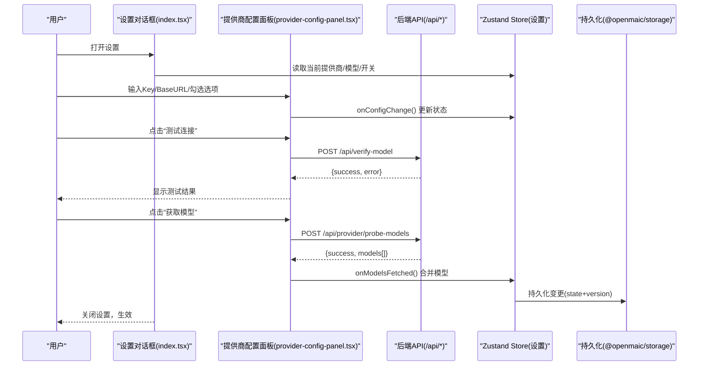
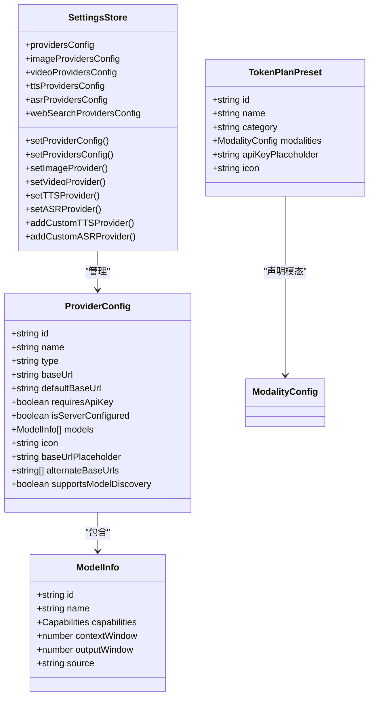
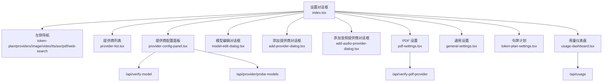
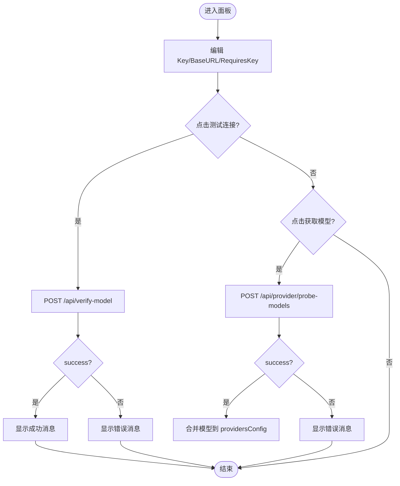
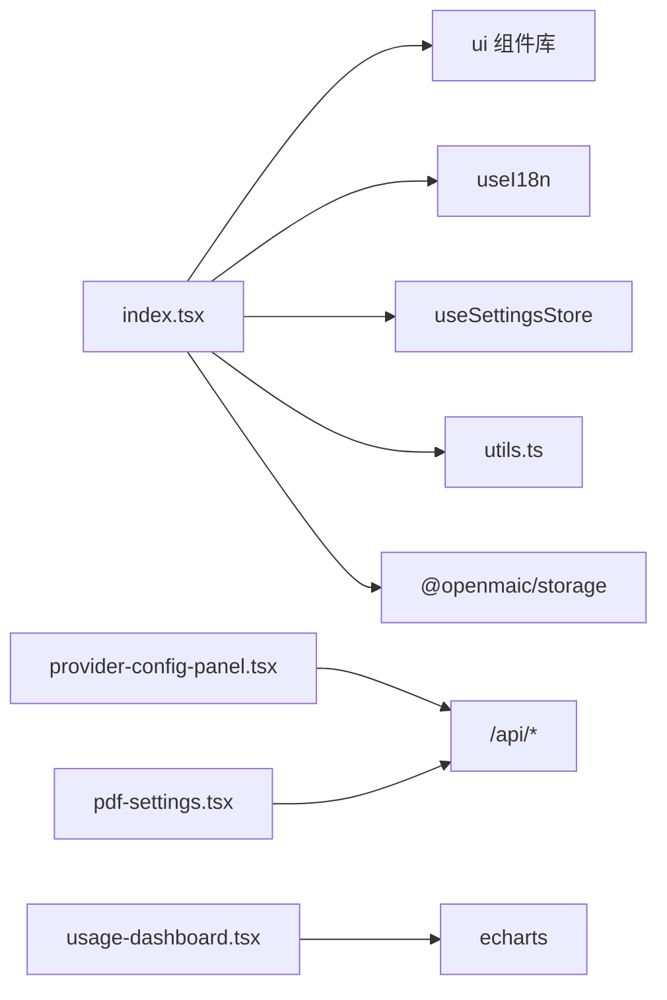

# 设置界面组件

<cite>
**本文引用的文件**   
- [components/settings/index.tsx](file://components/settings/index.tsx)
- [components/settings/general-settings.tsx](file://components/settings/general-settings.tsx)
- [components/settings/provider-config-panel.tsx](file://components/settings/provider-config-panel.tsx)
- [components/settings/token-plan-settings.tsx](file://components/settings/token-plan-settings.tsx)
- [components/settings/utils.ts](file://components/settings/utils.ts)
- [components/settings/provider-list.tsx](file://components/settings/provider-list.tsx)
- [components/settings/model-edit-dialog.tsx](file://components/settings/model-edit-dialog.tsx)
- [components/settings/add-provider-dialog.tsx](file://components/settings/add-provider-dialog.tsx)
- [components/settings/add-audio-provider-dialog.tsx](file://components/settings/add-audio-provider-dialog.tsx)
- [components/settings/usage-dashboard.tsx](file://components/settings/usage-dashboard.tsx)
- [components/settings/pdf-settings.tsx](file://components/settings/pdf-settings.tsx)
</cite>

## 产品概述
本组件为 OpenMAIC 的设置界面，提供统一的配置入口与交互体验。核心目标包括：
- 统一管理与配置各类 AI 服务商（LLM、图像、视频、TTS、ASR、PDF、Web 搜索等）
- 提供“令牌计划”一键启用多模态能力，简化初始配置
- 支持通用设置（使用统计、缓存清理）、动态表单生成、字段校验与错误反馈
- 通过 Zustand 存储与持久化适配器实现本地持久化与版本兼容
- 全面国际化、主题适配与权限控制（服务端托管配置不可覆盖）

适用场景：
- 首次安装后快速启用多种模型与服务
- 日常维护与故障排查（连接测试、模型探测、用量查看）
- 企业部署时由管理员集中管理密钥与模型目录

## 核心业务流程
- 打开设置对话框：根据当前选中的模块渲染对应面板（提供商、图片、视频、TTS、ASR、PDF、Web 搜索、通用、令牌计划）
- 选择并编辑提供商：输入 API Key/Base URL，可选切换“需要 API Key”，支持连接测试与模型探测
- 管理模型列表：新增/编辑/删除模型，自动保存或手动保存，支持能力标记（流式、工具、视觉）
- 应用令牌计划：选择预设，输入 LLM 的 API Key，一键启用多模态能力（仅写入配置，不探测）
- 通用设置：查看用量统计、清空缓存（IndexedDB/localStorage/sessionStorage），二次确认与失败回退
- 数据持久化：所有变更通过 store 更新，持久化由 @openmaic/storage 的 kvPersistStorage 负责

**图表来源** 
- [components/settings/index.tsx](file://components/settings/index.tsx)
- [components/settings/provider-config-panel.tsx](file://components/settings/provider-config-panel.tsx)
- [components/settings/utils.ts](file://components/settings/utils.ts)

**章节来源**
- [components/settings/index.tsx](file://components/settings/index.tsx)
- [components/settings/provider-config-panel.tsx](file://components/settings/provider-config-panel.tsx)

## 功能模块清单
- 通用设置（GeneralSettings）
  - 职责：展示用量统计、危险操作区（清空缓存），二次确认与失败提示
  - 验收要点：清空 IndexedDB/localStorage/sessionStorage；页面刷新；错误日志记录
- 提供商配置（ProviderList + ProviderConfigPanel）
  - 职责：列出所有提供商（内置/自定义/服务端托管），编辑 API Key/Base URL，切换是否需要 Key，连接测试，模型探测与列表管理
  - 验收要点：服务端托管时隐藏编辑项；模型锁定模式只读；探测结果合并去重；重置到默认
- 模型编辑（ModelEditDialog）
  - 职责：新增/编辑模型 ID、名称、能力（视觉/工具/流式）、上下文窗口与输出窗口；支持连接测试与自动保存
  - 验收要点：ID 必填校验；能力复选框即时生效；保存后同步到 providersConfig
- 令牌计划（TokenPlanSettings）
  - 职责：按分类展示预设，选择后输入 LLM Key 即可启用；显示各模态可用模型（只读）；支持禁用
  - 验收要点：apply/remove 流程同步更新多个 provider 配置与默认模型；UI 反映已启用状态
- 音频提供商（TTS/ASR 添加对话框）
  - 职责：添加自定义 TTS/ASR 提供商，填写名称、Base URL、默认模型（TTS）、是否需 Key
  - 验收要点：基础字段校验；创建后自动选中新提供商
- PDF 设置（PDFSettings）
  - 职责：支持多云/自托管/阿里云文档智能等多种提供商，分别要求 API Key、AK/SK、Base URL；连接测试
  - 验收要点：不同提供商的认证字段差异化展示；服务端托管不可覆盖
- 用量仪表盘（UsageDashboard）
  - 职责：拉取 /api/usage，按日趋势与各模态用量展示，ECharts 渲染
  - 验收要点：主题自适应；空数据占位；刷新按钮

**章节来源**
- [components/settings/general-settings.tsx](file://components/settings/general-settings.tsx)
- [components/settings/provider-list.tsx](file://components/settings/provider-list.tsx)
- [components/settings/provider-config-panel.tsx](file://components/settings/provider-config-panel.tsx)
- [components/settings/model-edit-dialog.tsx](file://components/settings/model-edit-dialog.tsx)
- [components/settings/token-plan-settings.tsx](file://components/settings/token-plan-settings.tsx)
- [components/settings/add-audio-provider-dialog.tsx](file://components/settings/add-audio-provider-dialog.tsx)
- [components/settings/pdf-settings.tsx](file://components/settings/pdf-settings.tsx)
- [components/settings/usage-dashboard.tsx](file://components/settings/usage-dashboard.tsx)

## 数据与状态
- 状态管理
  - 使用 Zustand 的 useSettingsStore 读写设置（providersConfig、tts/asr/image/video/web-search 等独立配置与选中项）
  - 设置项包含：providerId/modelId、各提供商配置、各模态提供商与默认模型、服务端托管标记
- 持久化与版本兼容
  - 通过 @openmaic/storage 的 kvPersistStorage 将 state 与 version 一起持久化，支持作用域隔离（account/device）
  - 清除缓存会同时清理 IndexedDB、localStorage、sessionStorage，并刷新页面
- 数据流向
  - 用户输入 → store action → 持久化 → 其他组件订阅更新
  - 模型探测结果合并策略：保留非 probed 条目，过滤重复，补充能力元信息
- 关键数据结构
  - ProviderConfig：id/name/type/baseUrl/models/requiresApiKey/isServerConfigured 等
  - ModelInfo：id/name/capabilities/contextWindow/outputWindow/source
  - TokenPlanPreset：category/modalities/{llm,image,video,tts,webSearch}/defaultModels/defaultModelId

**图表来源** 
- [components/settings/index.tsx](file://components/settings/index.tsx)
- [components/settings/utils.ts](file://components/settings/utils.ts)
- [components/settings/token-plan-settings.tsx](file://components/settings/token-plan-settings.tsx)

**章节来源**
- [components/settings/index.tsx](file://components/settings/index.tsx)
- [components/settings/utils.ts](file://components/settings/utils.ts)
- [components/settings/token-plan-settings.tsx](file://components/settings/token-plan-settings.tsx)

## 关键约束与边界
- 权限与托管
  - 当 isServerConfigured 为真时，客户端不可编辑 Key/Base URL，且模型目录可能锁定（serverModels），仅允许查看
  - 内置提供商可重置到默认，但无法删除
- 模型管理
  - 新增/编辑模型必须提供有效 ID；能力标记影响前端行为（如 InlineThinkingControl）
  - 探测到的模型以 source='probed' 标记，避免重复累积，保留 catalog 与手动添加的模型
- 验证与错误处理
  - 连接测试失败返回明确错误消息；网络异常兜底提示
  - 清空缓存需二次确认，失败时记录日志并提示
- 性能与可用性
  - 大列表渲染采用虚拟滚动与懒加载（依赖 UI 组件库）
  - ECharts 图表按需初始化与销毁，响应窗口大小变化
- 扩展点
  - 新增提供商类型：在 PROVIDERS/PDF_PROVIDERS/IMAGE_PROVIDERS/VIDEO_PROVIDERS/TTS_PROVIDERS/ASR_PROVIDERS/WEN_SEARCH_PROVIDERS 中注册
  - 新增令牌计划：在 TOKEN_PLAN_PRESETS 中添加预设，定义 modalities 与默认模型
  - 自定义配置面板：复用 ProviderConfigPanel 的 props 接口，接入新的认证字段与验证逻辑

**章节来源**
- [components/settings/provider-config-panel.tsx](file://components/settings/provider-config-panel.tsx)
- [components/settings/model-edit-dialog.tsx](file://components/settings/model-edit-dialog.tsx)
- [components/settings/general-settings.tsx](file://components/settings/general-settings.tsx)
- [components/settings/token-plan-settings.tsx](file://components/settings/token-plan-settings.tsx)

## 架构总览
设置界面采用“对话框 + 侧边导航 + 内容面板”的结构，核心由 index.tsx 编排，子模块各司其职。

**图表来源** 
- [components/settings/index.tsx](file://components/settings/index.tsx)
- [components/settings/provider-config-panel.tsx](file://components/settings/provider-config-panel.tsx)
- [components/settings/pdf-settings.tsx](file://components/settings/pdf-settings.tsx)
- [components/settings/usage-dashboard.tsx](file://components/settings/usage-dashboard.tsx)

## 详细组件分析

### 提供商配置面板（ProviderConfigPanel）
- 功能要点
  - 编辑 API Key/Base URL，切换是否需要 Key
  - 连接测试：调用 /api/verify-model，展示成功/失败消息
  - 模型探测：调用 /api/provider/probe-models，合并结果到 providersConfig
  - 模型列表管理：新增/编辑/删除，支持重置到默认（内置提供商）
  - 服务端托管与模型锁定：isServerConfigured 与 serverModels 控制编辑可见性
- 数据流
  - onConfigChange 实时同步 store；onSave 触发失焦保存
  - onModelsFetched 合并探测结果，保留非 probed 条目，去重并补充能力元信息
- 错误处理
  - 无模型时提示不可测试；网络异常与 401/404 分支处理

**图表来源** 
- [components/settings/provider-config-panel.tsx](file://components/settings/provider-config-panel.tsx)
- [components/settings/utils.ts](file://components/settings/utils.ts)

**章节来源**
- [components/settings/provider-config-panel.tsx](file://components/settings/provider-config-panel.tsx)

### 模型编辑对话框（ModelEditDialog）
- 功能要点
  - 新增/编辑模型 ID、名称、能力（视觉/工具/流式）、上下文窗口与输出窗口
  - 支持连接测试（同 verify-model），自动保存（blur）与手动保存
- 交互细节
  - ID 变更时自动同步名称（若为空或与旧 ID 一致）
  - 能力复选框变更即时触发 onAutoSave
  - 高级设置输入框 blur 时自动保存

**章节来源**
- [components/settings/model-edit-dialog.tsx](file://components/settings/model-edit-dialog.tsx)

### 令牌计划（TokenPlanSettings）
- 功能要点
  - 分组展示预设（token_plan/aggregator/third_party/official）
  - 选择预设后输入 LLM 的 API Key，启用/禁用预设
  - 显示各模态可用模型（只读，不探测）
- 数据流
  - applyTokenPlan/removeTokenPlan 同步更新多个 provider 配置与默认模型
  - 已启用预设显示对勾标识

**章节来源**
- [components/settings/token-plan-settings.tsx](file://components/settings/token-plan-settings.tsx)

### 通用设置（GeneralSettings）
- 功能要点
  - 用量仪表盘（UsageDashboard）
  - 危险操作区：清空缓存（IndexedDB/localStorage/sessionStorage），二次确认
  - 失败时记录日志并提示

**章节来源**
- [components/settings/general-settings.tsx](file://components/settings/general-settings.tsx)
- [components/settings/usage-dashboard.tsx](file://components/settings/usage-dashboard.tsx)

### PDF 设置（PDFSettings）
- 功能要点
  - 支持多云（mineru-cloud）、自托管（mineru）、阿里云文档智能（alidocmind）
  - 不同提供商认证字段差异：apiKey、accessKeyId/accessKeySecret、baseUrl
  - 连接测试与错误提示

**章节来源**
- [components/settings/pdf-settings.tsx](file://components/settings/pdf-settings.tsx)

### 提供商列表（ProviderList）
- 功能要点
  - 显示提供商图标与名称（支持国际化翻译键）
  - 服务端托管标记显示
  - 底部“添加提供商”按钮

**章节来源**
- [components/settings/provider-list.tsx](file://components/settings/provider-list.tsx)

### 添加提供商/音频提供商对话框
- 功能要点
  - 添加 LLM 提供商：名称、类型（openai/anthropic/google）、Base URL、图标、是否需要 Key
  - 添加 TTS/ASR 提供商：名称、Base URL、默认模型（TTS）、是否需要 Key
  - 基础字段校验与提交

**章节来源**
- [components/settings/add-provider-dialog.tsx](file://components/settings/add-provider-dialog.tsx)
- [components/settings/add-audio-provider-dialog.tsx](file://components/settings/add-audio-provider-dialog.tsx)

## 依赖分析
- 外部依赖
  - ECharts：用量仪表盘图表渲染
  - sonner：Toast 通知
  - lucide-react：图标
  - @openmaic/storage：持久化适配器（kvPersistStorage）
- 内部依赖
  - useI18n：国际化
  - useSettingsStore：设置状态管理
  - lib/ai/providers：提供商常量与类型
  - lib/types/settings：设置类型定义
  - lib/config/token-plan-presets：令牌计划预设

**图表来源** 
- [components/settings/index.tsx](file://components/settings/index.tsx)
- [components/settings/provider-config-panel.tsx](file://components/settings/provider-config-panel.tsx)
- [components/settings/pdf-settings.tsx](file://components/settings/pdf-settings.tsx)
- [components/settings/usage-dashboard.tsx](file://components/settings/usage-dashboard.tsx)

**章节来源**
- [components/settings/index.tsx](file://components/settings/index.tsx)

## 性能考虑
- 列表渲染优化：提供商列表与模型列表采用扁平结构与条件渲染，避免不必要的重绘
- 图表初始化：ECharts 实例在 useEffect 中创建与销毁，监听 resize 事件
- 网络请求：连接测试与模型探测仅在用户触发时发起，避免频繁请求
- 状态更新：store 动作细粒度更新，减少全局重渲染

## 故障排查指南
- 连接测试失败
  - 检查 API Key/Base URL 是否正确
  - 查看后端返回的错误消息（401/404/网络异常）
  - 对于 Azure，注意部署名与端点路径
- 模型探测无结果
  - 确认提供商支持 /models 端点
  - 检查 Base URL 与 modelsUrl 覆盖是否正确
- 清空缓存无效
  - 确认浏览器未阻止 IndexedDB/localStorage/sessionStorage
  - 查看控制台日志与 Toast 提示
- 服务端托管不可编辑
  - 确认 isServerConfigured 标志；该模式下 Key/Base URL 与模型目录由服务端管理

**章节来源**
- [components/settings/provider-config-panel.tsx](file://components/settings/provider-config-panel.tsx)
- [components/settings/general-settings.tsx](file://components/settings/general-settings.tsx)

## 结论
设置界面组件以清晰的模块化设计与稳健的状态管理，提供了完整的配置、验证与反馈闭环。通过令牌计划与提供商探测机制，显著降低了初始配置复杂度；结合持久化与版本兼容，确保长期稳定运行。未来可扩展更多提供商类型与预设，并通过统一的 ProviderConfigPanel 接口快速集成。