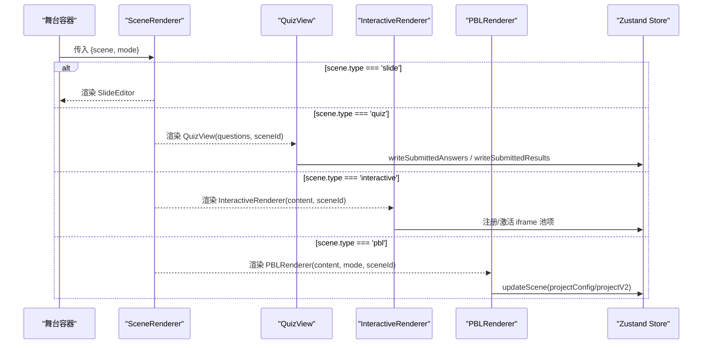
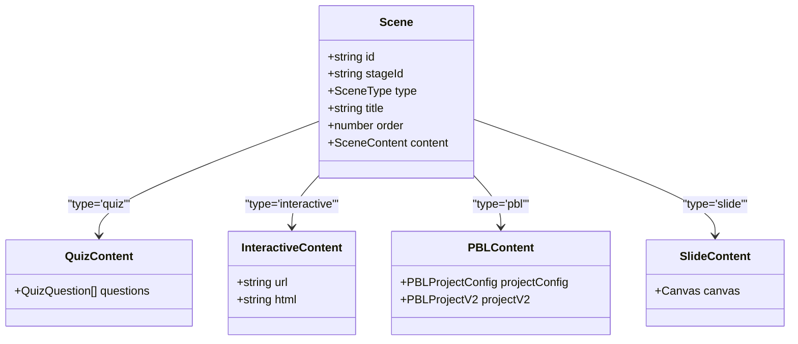
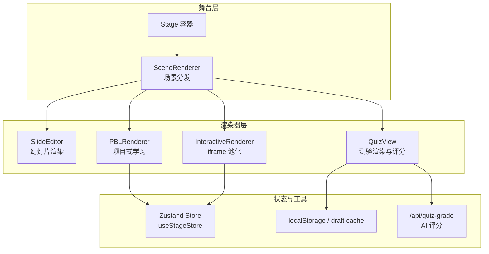
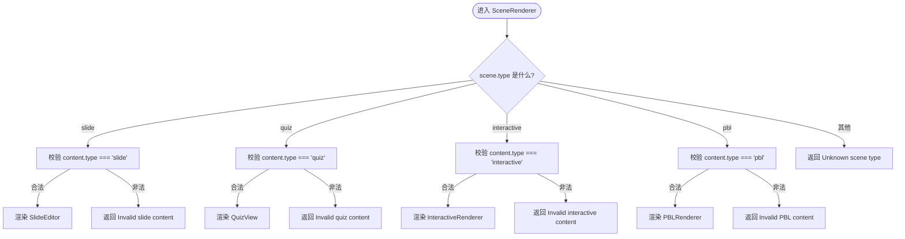
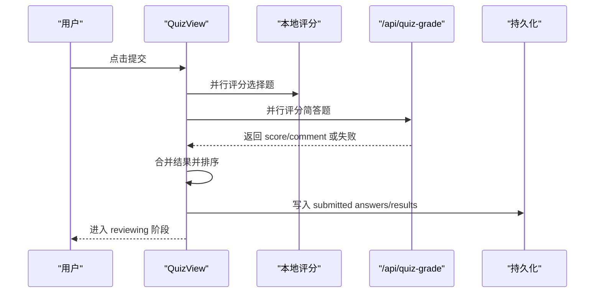
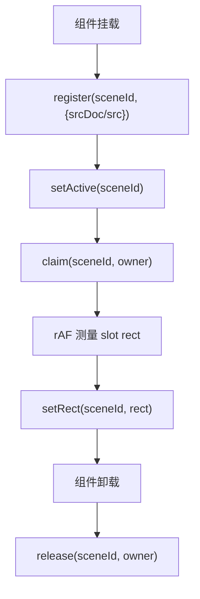
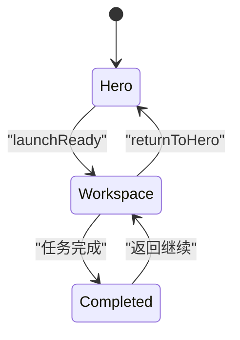
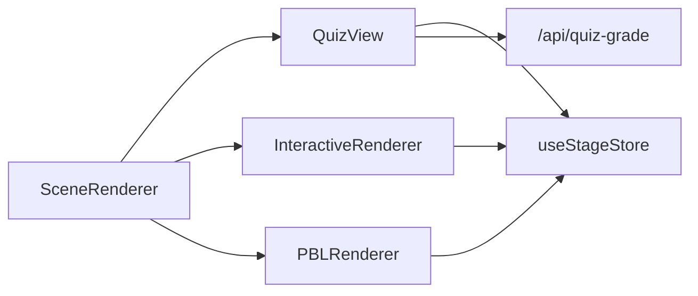

# 课堂渲染器组件

<cite>
**本文引用的文件**   
- [components/stage/scene-renderer.tsx](file://components/stage/scene-renderer.tsx)
- [components/scene-renderers/quiz-view.tsx](file://components/scene-renderers/quiz-view.tsx)
- [components/scene-renderers/interactive-renderer.tsx](file://components/scene-renderers/interactive-renderer.tsx)
- [components/scene-renderers/pbl-renderer.tsx](file://components/scene-renderers/pbl-renderer.tsx)
- [components/scene-renderers/classroom-complete.tsx](file://components/scene-renderers/classroom-complete.tsx)
- [components/scene-renderers/next-lesson.tsx](file://components/scene-renderers/next-lesson.tsx)
- [lib/api/stage-api-defaults.ts](file://lib/api/stage-api-defaults.ts)
</cite>

## 产品概述
本组件文档聚焦于课堂播放路径中的“场景渲染器”能力：SceneRenderer 根据当前场景类型（幻灯片、测验、交互式内容、PBL）动态选择并挂载对应的渲染器，统一对外暴露 props 接口，并通过 Zustand 状态管理与播放进度、场景切换和用户交互保持同步。同时涵盖性能优化策略（如 useMemo 缓存、懒加载与 iframe 池化）、错误处理机制以及常见问题解决方案，帮助开发者快速集成与排障。

## 核心业务流程
- 场景分发：SceneRenderer 接收 scene 与 mode，按 scene.type 分派到 SlideRenderer、QuizView、InteractiveRenderer、PBLRenderer。
- 模式控制：mode 为 StageMode（如 playback/autonomous），影响部分渲染器的行为（例如 QuizView 的提交按钮仅在特定模式下显示）。
- 状态同步：PBL 与 Quiz 等子渲染器通过 useStageStore.updateScene 将用户操作写回全局 store，驱动舞台状态更新与后续流程。
- 完成页与连续学习：ClassroomCompletePage 汇总各场景统计，NextLessonBanner 提供下一节自动/手动跳转。

**图表来源** 
- [components/stage/scene-renderer.tsx:1-42](file://components/stage/scene-renderer.tsx#L1-L42)
- [components/scene-renderers/quiz-view.tsx:689-796](file://components/scene-renderers/quiz-view.tsx#L689-L796)
- [components/scene-renderers/interactive-renderer.tsx:22-69](file://components/scene-renderers/interactive-renderer.tsx#L22-L69)
- [components/scene-renderers/pbl-renderer.tsx:45-169](file://components/scene-renderers/pbl-renderer.tsx#L45-L169)

**章节来源**
- [components/stage/scene-renderer.tsx:1-42](file://components/stage/scene-renderer.tsx#L1-L42)
- [lib/api/stage-api-defaults.ts:1-40](file://lib/api/stage-api-defaults.ts#L1-L40)

## 功能模块清单
- SceneRenderer（场景分发器）
  - 职责：根据 scene.type 选择对应渲染器；对 content 类型进行校验；返回占位或错误提示。
  - 验收要点：四种场景类型均能正确渲染；非法 content 类型给出明确提示。
- QuizView（测验渲染与评分）
  - 职责：单选/多选/简答题型渲染；本地草稿缓存；提交后并行评分（选择题本地、简答题 AI API）；结果持久化与回顾。
  - 验收要点：草稿恢复、AI 评分降级、结果排序与展示、语音输入辅助。
- InteractiveRenderer（交互式内容）
  - 职责：基于 iframe 池化实现 keep-alive；注册/激活/释放生命周期；跟踪 slot 矩形以对齐宿主。
  - 验收要点：跨 mount 不丢失文档状态；URL/HTML 双源支持；rAF 精准定位。
- PBLRenderer（项目式学习）
  - 职责：兼容 legacy projectConfig 与 v2 projectV2；角色选择与工作区；全屏/窗口化切换；流式 Instructor 计数；状态回写。
  - 验收要点：Hero→Workspace 动画；portal 宿主跟随 native fullscreen；stream 计数防误清。
- ClassroomCompletePage（课堂完成页）
  - 职责：汇总场景统计、测验成绩环形图、鼓励文案；NextLessonBanner 集成连续学习。
  - 验收要点：动画可访问性（减少动效）、分数计算、下一节导航。

**章节来源**
- [components/stage/scene-renderer.tsx:1-42](file://components/stage/scene-renderer.tsx#L1-L42)
- [components/scene-renderers/quiz-view.tsx:689-796](file://components/scene-renderers/quiz-view.tsx#L689-L796)
- [components/scene-renderers/interactive-renderer.tsx:22-69](file://components/scene-renderers/interactive-renderer.tsx#L22-L69)
- [components/scene-renderers/pbl-renderer.tsx:45-169](file://components/scene-renderers/pbl-renderer.tsx#L45-L169)
- [components/scene-renderers/classroom-complete.tsx:309-506](file://components/scene-renderers/classroom-complete.tsx#L309-L506)
- [components/scene-renderers/next-lesson.tsx:19-131](file://components/scene-renderers/next-lesson.tsx#L19-L131)

## 数据与状态
- 核心数据模型
  - Scene：包含 id、stageId、type、title、order、content（按类型区分）。
  - StageMode：控制渲染器行为（如 quiz 的提交按钮可见性）。
  - QuizContent/PBLContent/InteractiveContent/SlideContent：各自场景的内容结构。
- 关键状态流转
  - QuizView：not_started → answering → grading → reviewing；答案与结果写入 localStorage 并恢复。
  - PBLRenderer：legacy 配置升级至 v2；uiPhase 在 hero/workspace/completed 间切换；activeStreamCount 管理并发流。
  - InteractiveRenderer：mount/claim/setActive/release 维护 iframe 池的生命周期与可见性。
- 数据所有权边界
  - 渲染器仅持有 UI 状态与临时缓存；持久化通过 useStageStore.updateScene 或专用 persistence 模块写入。
  - 完成页统计由 summarizeScenes 与 readAnswersForSummary 聚合，避免重复计算。

**图表来源** 
- [lib/api/stage-api-defaults.ts:1-40](file://lib/api/stage-api-defaults.ts#L1-L40)

**章节来源**
- [lib/api/stage-api-defaults.ts:1-40](file://lib/api/stage-api-defaults.ts#L1-L40)
- [components/scene-renderers/quiz-view.tsx:689-796](file://components/scene-renderers/quiz-view.tsx#L689-L796)
- [components/scene-renderers/pbl-renderer.tsx:171-359](file://components/scene-renderers/pbl-renderer.tsx#L171-L359)
- [components/scene-renderers/interactive-renderer.tsx:22-69](file://components/scene-renderers/interactive-renderer.tsx#L22-L69)

## 关键约束与边界
- 非功能性需求
  - 性能：使用 useMemo 缓存计算结果（如数学文本分段、总分数、iframe HTML patch）；InteractiveRenderer 使用 rAF 节流测量；PBL 工作区单实例 portal 避免重挂载。
  - 可用性：尊重 prefersReducedMotion；无障碍状态播报；键盘退出原生全屏。
  - 兼容性：PBL 兼容 legacy projectConfig 与 v2 projectV2；InteractiveRenderer 支持 src 与 srcDoc 双源。
- 依赖与集成边界
  - Zustand：所有场景写操作通过 useStageStore.updateScene 或专用持久化模块；避免直接修改 store。
  - API：简答题评分调用 /api/quiz-grade，失败时降级给基础分；模型配置通过 getCurrentModelConfig 注入请求头。
  - DOM：Portal 目标跟随 document.fullscreenElement；ResizeObserver + scroll/rAF 保证 docked 帧对齐。
- 业务约束
  - SceneRenderer 仅在播放路径使用，编辑模式由 EditShell 接管；content.type 必须与 scene.type 一致，否则返回无效提示。
  - Quiz 草稿隔离按 sceneId 键控；完成页统计只读聚合，不触发重新评分。

**章节来源**
- [components/stage/scene-renderer.tsx:1-42](file://components/stage/scene-renderer.tsx#L1-L42)
- [components/scene-renderers/quiz-view.tsx:83-135](file://components/scene-renderers/quiz-view.tsx#L83-L135)
- [components/scene-renderers/interactive-renderer.tsx:22-69](file://components/scene-renderers/interactive-renderer.tsx#L22-L69)
- [components/scene-renderers/pbl-renderer.tsx:241-256](file://components/scene-renderers/pbl-renderer.tsx#L241-L256)
- [components/scene-renderers/classroom-complete.tsx:309-506](file://components/scene-renderers/classroom-complete.tsx#L309-L506)

## 架构概览

**图表来源** 
- [components/stage/scene-renderer.tsx:1-42](file://components/stage/scene-renderer.tsx#L1-L42)
- [components/scene-renderers/quiz-view.tsx:689-796](file://components/scene-renderers/quiz-view.tsx#L689-L796)
- [components/scene-renderers/interactive-renderer.tsx:22-69](file://components/scene-renderers/interactive-renderer.tsx#L22-L69)
- [components/scene-renderers/pbl-renderer.tsx:45-169](file://components/scene-renderers/pbl-renderer.tsx#L45-L169)

## 详细组件分析

### SceneRenderer（场景分发器）
- 设计要点
  - 使用 useMemo 缓存渲染结果，依赖 scene 与 mode，避免不必要的重渲染。
  - 对 content.type 做严格校验，非法类型返回占位提示。
  - 仅用于播放路径，编辑模式由上层接管。
- 错误处理
  - 当 scene.content.type 与 scene.type 不一致时，返回“Invalid … content”。
  - 未知 scene.type 返回“Unknown scene type”。
- 性能
  - 渲染分支稳定，key 设置（如 QuizView key={scene.id}）确保切换时重建必要实例。

**图表来源** 
- [components/stage/scene-renderer.tsx:20-38](file://components/stage/scene-renderer.tsx#L20-L38)

**章节来源**
- [components/stage/scene-renderer.tsx:1-42](file://components/stage/scene-renderer.tsx#L1-L42)

### QuizView（测验渲染与评分）
- 设计要点
  - 阶段机：not_started → answering → grading → reviewing。
  - 草稿缓存：useDraftCache 按 sceneId 隔离，首次无提交状态时恢复草稿。
  - 评分流程：选择题本地 gradeChoiceQuestions；简答题并行调用 /api/quiz-grade；合并结果并按题目顺序输出。
  - 降级策略：API 失败记录日志并回退为基础分；支持语音转录追加。
- 性能
  - useMemo 计算总分与是否全部作答；memo 包裹数学文本渲染；rAF 与节流未在此处出现，但整体渲染轻量。
- 错误处理
  - 网络异常捕获并降级；UI 反馈“评分服务暂时不可用”。

**图表来源** 
- [components/scene-renderers/quiz-view.tsx:756-796](file://components/scene-renderers/quiz-view.tsx#L756-L796)
- [components/scene-renderers/quiz-view.tsx:83-135](file://components/scene-renderers/quiz-view.tsx#L83-L135)

**章节来源**
- [components/scene-renderers/quiz-view.tsx:689-796](file://components/scene-renderers/quiz-view.tsx#L689-L796)
- [components/scene-renderers/quiz-view.tsx:83-135](file://components/scene-renderers/quiz-view.tsx#L83-L135)

### InteractiveRenderer（交互式内容）
- 设计要点
  - iframe 池化：mount/claim/setActive/release 管理生命周期，确保跨 mount 不丢失文档状态。
  - 双源支持：优先 srcDoc（HTML），否则使用 url。
  - 位置跟踪：rAF 循环读取 slotRef.getBoundingClientRect 并上报 setRect，保证宿主对齐。
- 性能
  - useMemo 对 HTML 进行 patch 处理；rAF 节流测量；unmount 时 release 保留实例。
- 错误处理
  - 若 slotRef 为空则跳过测量；owner token 防止竞态隐藏。

**图表来源** 
- [components/scene-renderers/interactive-renderer.tsx:41-66](file://components/scene-renderers/interactive-renderer.tsx#L41-L66)

**章节来源**
- [components/scene-renderers/interactive-renderer.tsx:22-69](file://components/scene-renderers/interactive-renderer.tsx#L22-L69)

### PBLRenderer（项目式学习）
- 设计要点
  - 兼容层：projectV2 优先；否则升级 legacy projectConfig；空配置或空 agents 给出友好提示。
  - Hero/Workspace 切换：PBLV2Container 维持单一实例，通过 portal 与 motion 动画实现展开/收起；autoExpand 一次触发首启动画。
  - 流式计数：activeStreamCount 管理 Instructor/评估等多流并发，避免误清 busy 状态。
  - 状态回写：handleWorkspaceProjectChange 读取 live uiPhase，防止从 Hero 被意外拉回 Workspace。
- 性能
  - useMemo 克隆并归一化 projectV2；requestAnimationFrame 与 ResizeObserver 监听 host 尺寸变化；expanded 时关闭 rAF 轮询。
- 错误处理
  - 空项目/旧格式提示；native fullscreen 退出按钮兜底。

**图表来源** 
- [components/scene-renderers/pbl-renderer.tsx:171-359](file://components/scene-renderers/pbl-renderer.tsx#L171-L359)

**章节来源**
- [components/scene-renderers/pbl-renderer.tsx:45-169](file://components/scene-renderers/pbl-renderer.tsx#L45-L169)
- [components/scene-renderers/pbl-renderer.tsx:241-256](file://components/scene-renderers/pbl-renderer.tsx#L241-L256)
- [components/scene-renderers/pbl-renderer.tsx:292-304](file://components/scene-renderers/pbl-renderer.tsx#L292-L304)

### ClassroomCompletePage（课堂完成页）与 NextLessonBanner（下一节导航）
- 设计要点
  - 完成页：汇总各场景数量、测验百分比环、鼓励文案；尊重 reduced motion。
  - 下一节：连续学习上下文存在时显示；开启自动倒计时可取消；最后一节提示课程完成。
- 性能
  - useMemo 聚合统计与日期格式化；动画按需启用。
- 错误处理
  - 日期格式化失败回退默认方案。

**章节来源**
- [components/scene-renderers/classroom-complete.tsx:309-506](file://components/scene-renderers/classroom-complete.tsx#L309-L506)
- [components/scene-renderers/next-lesson.tsx:19-131](file://components/scene-renderers/next-lesson.tsx#L19-L131)

## 依赖分析
- 组件耦合
  - SceneRenderer 低耦合地分派到各渲染器；渲染器内部通过 useStageStore 与外部状态解耦。
  - PBLRenderer 与 QuizView 分别依赖各自的持久化与 API，互不干扰。
- 外部依赖
  - Zustand：集中式状态管理，updateScene 作为唯一写入入口。
  - Motion/Framer：动画与过渡；尊重 reduced motion。
  - DOM API：Fullscreen、ResizeObserver、requestAnimationFrame。
- 潜在循环依赖
  - 无直接循环导入；SceneRenderer 仅消费类型定义与具体渲染器。

**图表来源** 
- [components/stage/scene-renderer.tsx:1-42](file://components/stage/scene-renderer.tsx#L1-L42)
- [components/scene-renderers/quiz-view.tsx:689-796](file://components/scene-renderers/quiz-view.tsx#L689-L796)
- [components/scene-renderers/interactive-renderer.tsx:22-69](file://components/scene-renderers/interactive-renderer.tsx#L22-L69)
- [components/scene-renderers/pbl-renderer.tsx:45-169](file://components/scene-renderers/pbl-renderer.tsx#L45-L169)

**章节来源**
- [components/stage/scene-renderer.tsx:1-42](file://components/stage/scene-renderer.tsx#L1-L42)
- [components/scene-renderers/quiz-view.tsx:689-796](file://components/scene-renderers/quiz-view.tsx#L689-L796)
- [components/scene-renderers/interactive-renderer.tsx:22-69](file://components/scene-renderers/interactive-renderer.tsx#L22-L69)
- [components/scene-renderers/pbl-renderer.tsx:45-169](file://components/scene-renderers/pbl-renderer.tsx#L45-L169)

## 性能考虑
- useMemo 缓存
  - SceneRenderer 渲染结果缓存；QuizView 数学文本分段与总分计算；InteractiveRenderer HTML patch；完成页统计与日期格式化。
- 懒加载与池化
  - InteractiveRenderer 使用 iframe 池化，避免频繁创建销毁；slot 可见时才激活。
- 内存管理
  - PBL 工作区单实例 portal 避免重挂载；rAF 与 ResizeObserver 在 expanded 时停止轮询；unmount 清理事件监听与定时器。
- 动画与可访问性
  - 遵循 prefersReducedMotion，禁用不必要动画；屏幕阅读器状态播报。

[本节为通用指导，无需引用具体文件]

## 故障排查指南
- 常见错误
  - “Invalid slide/quiz/interactive/PBL content”：检查 scene.content.type 是否与 scene.type 一致。
  - “Unknown scene type”：确认 scene.type 属于已知枚举。
  - 简答题评分失败：查看网络与模型配置；降级逻辑已生效，检查日志与基础分。
  - Interactive iframe 空白：确认 srcDoc/src 有效；检查 owner 令牌与 claim/release 配对。
  - PBL 全屏错位：检查 document.fullscreenElement 与 portal 目标；确认 resize/scroll 监听正常。
- 调试建议
  - 打印 useStageStore 快照，确认 updateScene 写入是否正确。
  - 在 QuizView 中观察 phase 转换与 results 顺序。
  - 在 PBL 中关注 activeStreamCount 与 uiPhase 一致性。

**章节来源**
- [components/stage/scene-renderer.tsx:20-38](file://components/stage/scene-renderer.tsx#L20-L38)
- [components/scene-renderers/quiz-view.tsx:83-135](file://components/scene-renderers/quiz-view.tsx#L83-L135)
- [components/scene-renderers/interactive-renderer.tsx:41-66](file://components/scene-renderers/interactive-renderer.tsx#L41-L66)
- [components/scene-renderers/pbl-renderer.tsx:241-256](file://components/scene-renderers/pbl-renderer.tsx#L241-L256)

## 结论
SceneRenderer 作为课堂播放的核心分发器，结合各场景渲染器实现了类型安全、状态同步与高性能渲染。通过 useMemo、iframe 池化、portal 与 rAF 等技术手段，在保证用户体验的同时降低了资源消耗。配合 Zustand 与持久化模块，确保了状态一致性与可恢复性。建议在扩展新场景类型时遵循现有契约，保持 content.type 与 scene.type 的一致性，并通过 useStageStore 统一管理状态变更。

[本节为总结性内容，无需引用具体文件]