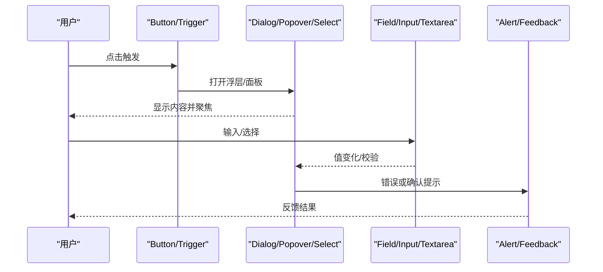
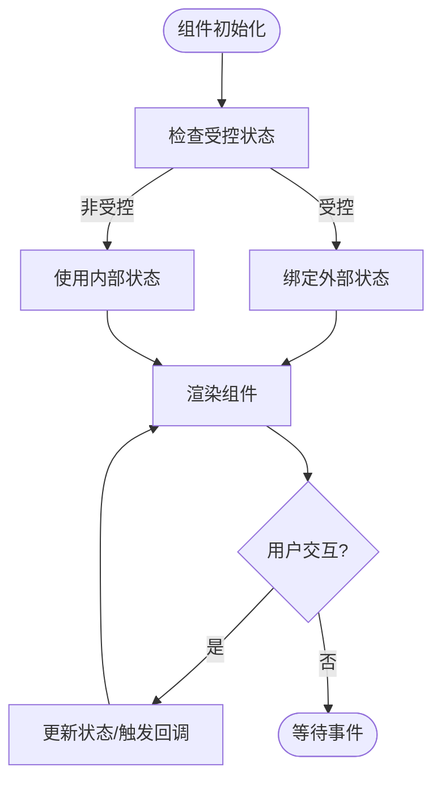

# 基础 UI 组件库

<cite>
**本文引用的文件**   
- [button.tsx](file://components\ui\button.tsx)
- [dialog.tsx](file://components\ui\dialog.tsx)
- [input.tsx](file://components\ui\input.tsx)
- [card.tsx](file://components\ui\card.tsx)
- [checkbox.tsx](file://components\ui\checkbox.tsx)
- [select.tsx](file://components\ui\select.tsx)
- [tabs.tsx](file://components\ui\tabs.tsx)
- [alert-dialog.tsx](file://components\ui\alert-dialog.tsx)
- [textarea.tsx](file://components\ui\textarea.tsx)
- [popover.tsx](file://components\ui\popover.tsx)
- [command.tsx](file://components\ui\command.tsx)
- [field.tsx](file://components\ui\field.tsx)
- [input-group.tsx](file://components\ui\input-group.tsx)
- [globals.css](file://app\globals.css)
</cite>

## 产品概述
OpenMAIC 的基础 UI 组件库基于 shadcn/ui 与 Radix UI 构建，采用 Tailwind CSS 进行样式编排，并通过 class-variance-authority（CVA）实现变体驱动的主题化。该组件库为 OpenMAIC 的课件生成、课堂互动与编辑回放等核心场景提供一致、可访问、可主题化的交互控件，包括按钮、对话框、输入框、卡片、选择器、标签页、命令面板等常用能力。

- 目标用户：面向教育科技产品的开发者与设计师，快速搭建高质量界面。
- 核心价值：统一设计语言、无障碍优先、强类型 Props、灵活的样式定制与响应式适配。
- 适用场景：表单录入、弹窗确认、信息展示、导航切换、全局命令检索等。

## 核心业务流程
- 用户操作触发：通过 Button/Trigger 等入口组件发起交互（打开对话框、弹出菜单、切换标签）。
- 状态管理：由 Radix 原语或组件内部状态维护可见性、选中态、焦点与键盘导航。
- 内容渲染：Dialog/Popover/SelectContent/TabsContent 等容器承载业务内容，结合 Field/Input/Textarea 完成数据输入。
- 反馈与校验：FieldError/Alert Dialog 提供错误提示与二次确认；ARIA 属性确保屏幕阅读器可读。
- 主题与响应式：通过 CSS 变量与 Tailwind 断点实现明暗主题与多端布局自适应。

## 功能模块清单
- 按钮与组合
  - 职责：提供多种外观与尺寸，支持 asChild 透传原生行为，便于与路由/表单集成。
  - 验收要点：变体/尺寸覆盖完整；禁用态与焦点环正确；图标对齐与间距一致。
  - 参考实现：[button.tsx](file://components\ui\button.tsx)

- 对话框与模态
  - 职责：承载重要操作与确认流程，包含标题、描述、动作区与关闭按钮。
  - 验收要点：遮罩与动画、焦点陷阱、ESC 关闭、键盘可达性。
  - 参考实现：[dialog.tsx](file://components\ui\dialog.tsx), [alert-dialog.tsx](file://components\ui\alert-dialog.tsx)

- 输入与文本域
  - 职责：标准输入与多行文本，支持占位符、禁用态、无效态视觉反馈。
  - 验收要点：边框/焦点环、占位符颜色、最小宽度与换行行为。
  - 参考实现：[input.tsx](file://components\ui\input.tsx), [textarea.tsx](file://components\ui\textarea.tsx)

- 选择器与下拉
  - 职责：单选/多选列表，含分组、分隔、滚动与定位策略。
  - 验收要点：键盘导航、高亮选中项、滚动按钮与视口对齐。
  - 参考实现：[select.tsx](file://components\ui\select.tsx)

- 标签页
  - 职责：水平/垂直方向的内容分栏切换，支持默认与线型变体。
  - 验收要点：方向与变体切换、激活态指示器、焦点与键盘切换。
  - 参考实现：[tabs.tsx](file://components\ui\tabs.tsx)

- 复选框
  - 职责：布尔选项勾选，带对勾指示与禁用态。
  - 验收要点：状态切换、焦点环、无障碍标签关联。
  - 参考实现：[checkbox.tsx](file://components\ui\checkbox.tsx)

- 弹出层与锚点
  - 职责：轻量级浮层，支持对齐与偏移，常用于工具提示与快捷操作。
  - 验收要点：定位准确、动画流畅、可关闭。
  - 参考实现：[popover.tsx](file://components\ui\popover.tsx)

- 命令面板
  - 职责：全局搜索与快捷执行，常以对话框形式呈现。
  - 验收要点：输入过滤、列表分组、快捷键提示、空态处理。
  - 参考实现：[command.tsx](file://components\ui\command.tsx)

- 字段与表单组织
  - 职责：将 Label、Description、Error、Separator 等组合成一致的表单单元，支持横纵布局与响应式。
  - 验收要点：布局切换、错误聚合、无障碍语义。
  - 参考实现：[field.tsx](file://components\ui\field.tsx)

- 输入组
  - 职责：将 Input/Textarea 与前缀/后缀按钮或文本组合，统一边框与焦点行为。
  - 验收要点：Addon 位置、按钮尺寸、聚焦联动。
  - 参考实现：[input-group.tsx](file://components\ui\input-group.tsx)

- 卡片
  - 职责：信息块容器，支持头部、内容、动作与底部区域，提供尺寸变体。
  - 验收要点：图片圆角、栅格布局、尺寸切换。
  - 参考实现：[card.tsx](file://components\ui\card.tsx)

## 数据与状态
- 受控与非受控
  - 多数 Radix 组件遵循受控模式（如 Select、Tabs），外部通过 props 控制状态；部分组件提供默认状态（如 Dialog 的 open 状态由父组件管理）。
- 表单数据流
  - Field + Input/Textarea 组合时，建议配合表单库（如 React Hook Form）进行受控绑定与校验，FieldError 负责错误展示。
- 状态边界
  - 浮层类组件（Dialog/Popover/SelectContent）通过 Portal 挂载到文档根节点，避免被父级 overflow 裁剪。
- 主题与样式变量
  - 通过 app/globals.css 中的 CSS 变量定义明暗主题色板与圆角，组件使用 Tailwind 原子类引用这些变量，保证一致性。

## 关键约束与边界
- 依赖与集成
  - 基于 Radix UI 原语，确保无障碍与键盘行为；样式层依赖 Tailwind 与 shadcn 主题变量。
- 可访问性
  - 所有交互组件均具备合适的 ARIA 角色与状态，焦点管理由 Radix 处理；错误提示使用 role="alert"。
- 主题与响应式
  - 通过 data-slot/data-* 属性与 Tailwind 断点进行样式扩展；深色模式通过 .dark 类切换 CSS 变量。
- 性能
  - 浮层组件使用 Portal 减少重排；列表类组件（Select/Command）注意虚拟化与懒加载；避免在高频回调中创建新对象。
- 兼容性
  - 浏览器需支持 CSS 变量与 Tailwind v4；动画与回退策略已在 globals.css 中考虑。

**章节来源**
- [globals.css](file://app\globals.css)
- [button.tsx](file://components\ui\button.tsx)
- [dialog.tsx](file://components\ui\dialog.tsx)
- [select.tsx](file://components\ui\select.tsx)
- [command.tsx](file://components\ui\command.tsx)
- [field.tsx](file://components\ui\field.tsx)
- [input-group.tsx](file://components\ui\input-group.tsx)
- [card.tsx](file://components\ui\card.tsx)
- [checkbox.tsx](file://components\ui\checkbox.tsx)
- [tabs.tsx](file://components\ui\tabs.tsx)
- [alert-dialog.tsx](file://components\ui\alert-dialog.tsx)
- [input.tsx](file://components\ui\input.tsx)
- [textarea.tsx](file://components\ui\textarea.tsx)
- [popover.tsx](file://components\ui\popover.tsx)