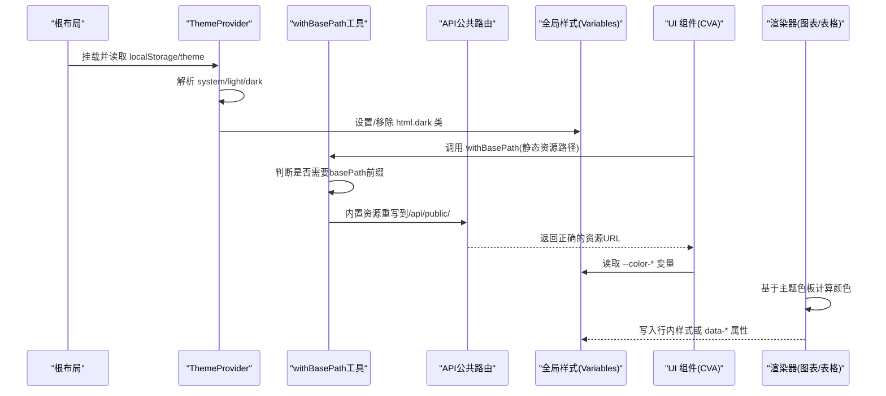
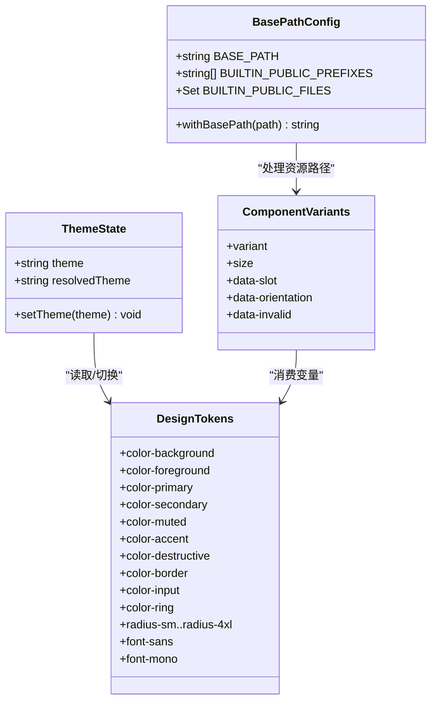

# 组件样式与主题系统

<cite>
**本文引用的文件**   
- [app/globals.css](file://app/globals.css)
- [app/layout.tsx](file://app/layout.tsx)
- [lib/hooks/use-theme.tsx](file://lib/hooks/use-theme.tsx)
- [components/ui/button.tsx](file://components/ui/button.tsx)
- [components/ui/badge.tsx](file://components/ui/badge.tsx)
- [components/ui/field.tsx](file://components/ui/field.tsx)
- [components/ui/button-group.tsx](file://components/ui/button-group.tsx)
- [packages/@openmaic/renderer/src/elements/chart/Chart.tsx](file://packages/@openmaic/renderer/src/elements/chart/Chart.tsx)
- [packages/@openmaic/renderer/src/elements/table/tableUtils.ts](file://packages/@openmaic/renderer/src/elements/table/tableUtils.ts)
- [components/slide-renderer/components/element/ShapeElement/BaseShapeElement.tsx](file://components/slide-renderer/components/element/ShapeElement/BaseShapeElement.tsx)
- [lib/agent/tools/edit-elements-patch.ts](file://lib/agent/tools/edit-elements-patch.ts)
- [postcss.config.mjs](file://postcss.config.mjs)
- [lib/utils/base-path.ts](file://lib/utils/base-path.ts)
- [app/api/public/[...path]/route.ts](file://app/api/public/[...path]/route.ts)
- [components/chat/chat-session.tsx](file://components/chat/chat-session.tsx)
- [components/roundtable/constants.ts](file://components/roundtable/constants.ts)
- [app/page.tsx](file://app/page.tsx)
- [components/edit/SlideNavRail/SlideNavRail.tsx](file://components/edit/SlideNavRail/SlideNavRail.tsx)
- [components/stage/scene-sidebar.tsx](file://components/stage/scene-sidebar.tsx)
</cite>

## 更新摘要
**变更内容**   
- 新增静态资源路径处理机制，通过 withBasePath() 工具函数统一处理头像和静态资源 URL
- 实现 basePath 兼容性支持，解决子路径部署下的资源加载问题
- 添加 API 路由作为静态资源服务回退，绕过 Next.js 16 Turbopack 开发模式 bug
- 在多个组件中系统性应用 withBasePath() 工具函数，确保资源路径正确性

## 产品概述
OpenMAIC 的样式与主题系统以 Tailwind CSS v4 为核心，结合 CSS Variables（CSS 自定义属性）实现设计令牌驱动的主题化。通过 shadcn/ui 与 Radix 基础组件提供一致的交互语义，使用 class-variance-authority（CVA）在组件层管理变体与组合样式。主题切换支持明/暗/跟随系统三种模式，并通过 document.documentElement 上的 .dark 类名进行全局切换。字体配置采用本地变量注入与 Geist 字体组合，图表与表格渲染器按需生成样式并遵循主题色板。整体架构强调"令牌集中、组件复用、样式隔离、可维护性"。

**更新** 新增静态资源路径管理机制，通过 withBasePath() 工具函数统一处理所有组件中的头像和静态资源 URL，确保在不同部署环境下的正确加载。

## 核心业务流程
- 主题初始化流程：根布局加载全局样式与字体，ThemeProvider 从 localStorage 恢复用户选择，监听系统主题变化，动态为 html 元素添加或移除 dark 类，从而触发 CSS 变量覆盖。
- 组件样式应用流程：UI 组件通过 CVA 定义变体，结合 cn 工具合并 className；组件内部使用语义化 data-slot 和 data-* 属性配合 Tailwind 修饰符实现状态与组合样式。
- 静态资源路径处理流程：所有组件中的静态资源 URL 通过 withBasePath() 工具函数处理，自动添加 basePath 前缀或在独立运行时重写到 /api/public/ 路径。
- 第三方渲染器集成：图表与表格等渲染器根据主题色板计算颜色，将结果以行内样式或数据属性传递给 DOM，确保与主题一致。

**图示来源** 
- [app/layout.tsx:1-49](file://app/layout.tsx#L1-L49)
- [lib/hooks/use-theme.tsx:1-72](file://lib/hooks/use-theme.tsx#L1-L72)
- [lib/utils/base-path.ts:1-90](file://lib/utils/base-path.ts#L1-L90)
- [app/api/public/[...path]/route.ts:1-35](file://app/api/public/[...path]/route.ts#L1-L35)
- [app/globals.css:17-127](file://app/globals.css#L17-L127)
- [components/ui/button.tsx:1-68](file://components/ui/button.tsx#L1-L68)
- [packages/@openmaic/renderer/src/elements/chart/Chart.tsx:47-94](file://packages/@openmaic/renderer/src/elements/chart/Chart.tsx#L47-L94)
- [packages/@openmaic/renderer/src/elements/table/tableUtils.ts:1-40](file://packages/@openmaic/renderer/src/elements/table/tableUtils.ts#L1-L40)

**章节来源**
- [app/layout.tsx:1-49](file://app/layout.tsx#L1-L49)
- [lib/hooks/use-theme.tsx:1-72](file://lib/hooks/use-theme.tsx#L1-L72)
- [lib/utils/base-path.ts:1-90](file://lib/utils/base-path.ts#L1-L90)
- [app/api/public/[...path]/route.ts:1-35](file://app/api/public/[...path]/route.ts#L1-L35)
- [app/globals.css:17-127](file://app/globals.css#L17-L127)

## 功能模块清单
- 设计令牌与主题变量
  - 职责：集中定义颜色、圆角、字体等令牌，映射到 CSS 变量，供 Tailwind 与组件消费。
  - 验收要点：明/暗模式下变量正确覆盖；Tailwind @theme inline 映射完整；无硬编码颜色。
- 组件样式体系（CVA + data-slot）
  - 职责：以 CVA 声明变体，统一尺寸、颜色、交互态；通过 data-slot 与 data-* 属性组合样式。
  - 验收要点：按钮、徽章、字段、按钮组等组件具备一致的变体与响应式行为。
- 主题切换机制
  - 职责：支持 light/dark/system 三种模式，持久化到 localStorage，监听系统偏好变化。
  - 验收要点：切换后页面即时生效；刷新后保持选择；系统主题变更时自动同步。
- 静态资源路径管理
  - 职责：通过 withBasePath() 工具函数统一处理所有静态资源 URL，支持 basePath 部署和独立运行模式。
  - 验收要点：头像、logo 等资源在所有环境下正确加载；data: URL 不受影响；已带 basePath 的路径不重复处理。
- API 公共资源服务
  - 职责：提供 /api/public/[...path] 路由作为静态资源服务回退，绕过 Next.js 16 Turbopack 开发模式 bug。
  - 验收要点：仅允许白名单路径访问；支持多种 MIME 类型；生产环境不影响正常 public 资源服务。
- 国际化样式适配
  - 职责：通过 i18n 文本与主题变量共同影响界面；避免硬编码文案导致的样式错位。
  - 验收要点：多语言下布局稳定；图标与文字对齐一致。
- 响应式设计与移动端适配
  - 职责：使用 Tailwind 断点与容器查询；编辑器与播放器在不同视口下表现一致。
  - 验收要点：小屏下滚动条与内容不偏移；弹窗与抽屉不造成水平位移。
- 浏览器兼容性与回退
  - 职责：对滚动条、动画、backdrop-filter 等特性提供降级策略。
  - 验收要点：旧版浏览器不崩溃；关键功能可用；动画尊重 prefers-reduced-motion。
- 样式性能与打包优化
  - 职责：Tailwind v4 按需生成；显式 @source 扫描依赖；最小化运行时样式。
  - 验收要点：构建产物体积可控；无冗余类；第三方库样式按需引入。

**章节来源**
- [app/globals.css:1-571](file://app/globals.css#L1-L571)
- [components/ui/button.tsx:1-68](file://components/ui/button.tsx#L1-L68)
- [components/ui/badge.tsx:1-25](file://components/ui/badge.tsx#L1-L25)
- [components/ui/field.tsx:54-93](file://components/ui/field.tsx#L54-L93)
- [components/ui/button-group.tsx:1-38](file://components/ui/button-group.tsx#L1-L38)
- [lib/utils/base-path.ts:1-90](file://lib/utils/base-path.ts#L1-L90)
- [app/api/public/[...path]/route.ts:1-35](file://app/api/public/[...path]/route.ts#L1-L35)

## 数据与状态
- 主题状态模型
  - theme: 'light' | 'dark' | 'system'
  - resolvedTheme: 'light' | 'dark'（最终生效主题）
  - 存储：localStorage 键 theme
  - 更新：setTheme(newTheme) 同时写入存储并更新 html 类名
- 主题变量模型
  - 颜色：--background, --foreground, --primary, --secondary, --muted, --accent, --destructive, --border, --input, --ring, --chart-1..5, --sidebar* 等
  - 圆角：--radius-sm .. --radius-4xl
  - 字体：--font-sans, --font-mono
- 组件样式状态
  - 变体：variant（如 default/outline/secondary/ghost/destructive/link）、size（xs/sm/lg/icon 等）
  - 组合：data-slot、data-orientation、data-invalid、aria-* 等属性驱动样式
- 静态资源路径状态
  - BASE_PATH: 环境变量 NEXT_PUBLIC_BASE_PATH，默认为空字符串
  - BUILTIN_PUBLIC_PREFIXES: ['/avatars/', '/logos/', '/vendor/'] 内置资源前缀白名单
  - BUILTIN_PUBLIC_FILES: Set(['/logo-horizontal.png', '/openmaic-mark.png']) 内置资源文件白名单
  - withBasePath(): 核心工具函数，处理资源路径转换逻辑

**图示来源** 
- [lib/hooks/use-theme.tsx:1-72](file://lib/hooks/use-theme.tsx#L1-L72)
- [app/globals.css:17-127](file://app/globals.css#L17-L127)
- [components/ui/button.tsx:1-68](file://components/ui/button.tsx#L1-L68)
- [components/ui/badge.tsx:1-25](file://components/ui/badge.tsx#L1-L25)
- [components/ui/field.tsx:54-93](file://components/ui/field.tsx#L54-L93)
- [components/ui/button-group.tsx:1-38](file://components/ui/button-group.tsx#L1-L38)
- [lib/utils/base-path.ts:1-90](file://lib/utils/base-path.ts#L1-L90)

**章节来源**
- [lib/hooks/use-theme.tsx:1-72](file://lib/hooks/use-theme.tsx#L1-L72)
- [app/globals.css:17-127](file://app/globals.css#L17-L127)
- [components/ui/button.tsx:1-68](file://components/ui/button.tsx#L1-L68)
- [components/ui/badge.tsx:1-25](file://components/ui/badge.tsx#L1-L25)
- [components/ui/field.tsx:54-93](file://components/ui/field.tsx#L54-L93)
- [components/ui/button-group.tsx:1-38](file://components/ui/button-group.tsx#L1-L38)
- [lib/utils/base-path.ts:1-90](file://lib/utils/base-path.ts#L1-L90)

## 关键约束与边界
- 样式架构约束
  - 禁止在业务组件中直接写死颜色值，必须使用设计令牌变量。
  - 组件样式优先使用 CVA 与 data-* 属性，避免深层嵌套与高特异性选择器。
  - 第三方渲染器（图表、表格）通过行内样式或 data-* 属性输出，需保证与主题一致。
- 主题切换边界
  - 仅通过 html.dark 类控制主题，避免在组件内直接操作 CSS 变量。
  - 系统主题变更需实时监听并同步，避免闪烁与不一致。
- 静态资源路径边界
  - 所有静态资源 URL 必须通过 withBasePath() 工具函数处理，禁止直接使用硬编码路径。
  - data:、blob:、http(s): 协议的资源路径原样返回，不受 basePath 影响。
  - 已包含 basePath 前缀的路径不会重复处理，避免双重前缀问题。
- API 公共路由安全边界
  - 仅允许白名单中的资源前缀（/avatars/、/logos/、/vendor/）和特定文件访问。
  - 拒绝包含 '..' 或绝对路径的请求，防止路径遍历攻击。
  - 仅支持 GET 方法，限制请求类型。
- 国际化与排版边界
  - 文案长度变化不应破坏布局；使用弹性布局与自适应字号。
  - 列表与编辑器样式需在编辑与回放两种模式下分别处理，避免相互污染。
- 响应式与兼容性边界
  - 滚动条与弹窗需考虑 body 滚动锁定时的水平偏移问题。
  - 动画与特效需尊重 prefers-reduced-motion。
- 性能与打包边界
  - 使用 Tailwind v4 的 @source 显式声明扫描路径，避免遗漏类名。
  - 第三方库样式按需引入，减少未用样式体积。
  - 避免过度使用复杂选择器与深度样式，降低重排与重绘成本。

**章节来源**
- [app/globals.css:1-571](file://app/globals.css#L1-L571)
- [lib/agent/tools/edit-elements-patch.ts:83-116](file://lib/agent/tools/edit-elements-patch.ts#L83-L116)
- [packages/@openmaic/renderer/src/elements/chart/Chart.tsx:47-94](file://packages/@openmaic/renderer/src/elements/chart/Chart.tsx#L47-L94)
- [packages/@openmaic/renderer/src/elements/table/tableUtils.ts:1-40](file://packages/@openmaic/renderer/src/elements/table/tableUtils.ts#L1-L40)
- [components/slide-renderer/components/element/ShapeElement/BaseShapeElement.tsx:69-118](file://components/slide-renderer/components/element/ShapeElement/BaseShapeElement.tsx#L69-L118)
- [postcss.config.mjs](file://postcss.config.mjs)
- [lib/utils/base-path.ts:1-90](file://lib/utils/base-path.ts#L1-L90)
- [app/api/public/[...path]/route.ts:1-35](file://app/api/public/[...path]/route.ts#L1-L35)

## 静态资源路径管理系统

### withBasePath 工具函数
withBasePath() 是 OpenMAIC 静态资源路径管理的核心工具函数，负责处理不同部署环境下的资源路径问题：

- **basePath 支持**：当 NEXT_PUBLIC_BASE_PATH 环境变量存在时，自动为资源路径添加前缀
- **Turbopack 兼容**：在独立运行模式下，将内置资源路径重写为 /api/public/ 路径，绕过 Next.js 16 Turbopack 开发模式的 404 bug
- **智能识别**：自动跳过 data:、blob:、http(s): 协议的资源路径，保护用户上传的自定义头像
- **防重复处理**：检测已包含 basePath 的路径，避免双重前缀问题

### API 公共资源服务
/app/api/public/[...path]/route.ts 提供了安全的静态资源服务回退机制：

- **路径白名单**：仅允许 /avatars/、/logos/、/vendor/ 前缀和特定文件（logo-horizontal.png、openmaic-mark.png）
- **安全防护**：拒绝包含 '..' 或绝对路径的请求，防止路径遍历攻击
- **MIME 类型支持**：支持图片、字体、脚本、样式等多种文件类型的正确响应
- **生产环境兼容**：在生产模式下不影响 Next.js 正常的 public 资源服务

### 组件集成示例
多个组件已系统性应用 withBasePath() 工具函数：

- **聊天会话组件**：chat-session.tsx 中的默认头像常量使用 withBasePath() 包裹
- **圆桌组件**：constants.ts 中的教师和学生头像常量统一处理
- **主页组件**：page.tsx 中的 logo-horizontal.png 资源路径正确处理
- **导航组件**：SlideNavRail.tsx 和 scene-sidebar.tsx 中的 Logo 资源路径统一处理

**章节来源**
- [lib/utils/base-path.ts:1-90](file://lib/utils/base-path.ts#L1-L90)
- [app/api/public/[...path]/route.ts:1-35](file://app/api/public/[...path]/route.ts#L1-L35)
- [components/chat/chat-session.tsx:34-38](file://components/chat/chat-session.tsx#L34-L38)
- [components/roundtable/constants.ts:1-7](file://components/roundtable/constants.ts#L1-L7)
- [app/page.tsx:570-582](file://app/page.tsx#L570-L582)
- [components/edit/SlideNavRail/SlideNavRail.tsx:385-390](file://components/edit/SlideNavRail/SlideNavRail.tsx#L385-L390)
- [components/stage/scene-sidebar.tsx:130-135](file://components/stage/scene-sidebar.tsx#L130-L135)