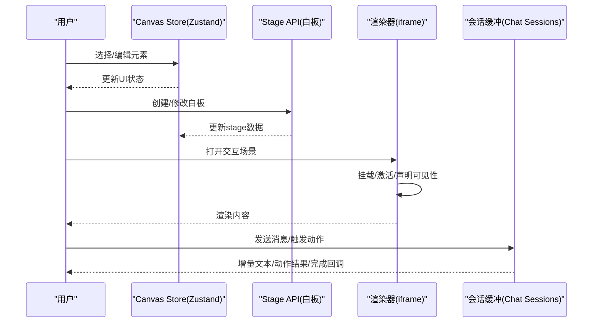
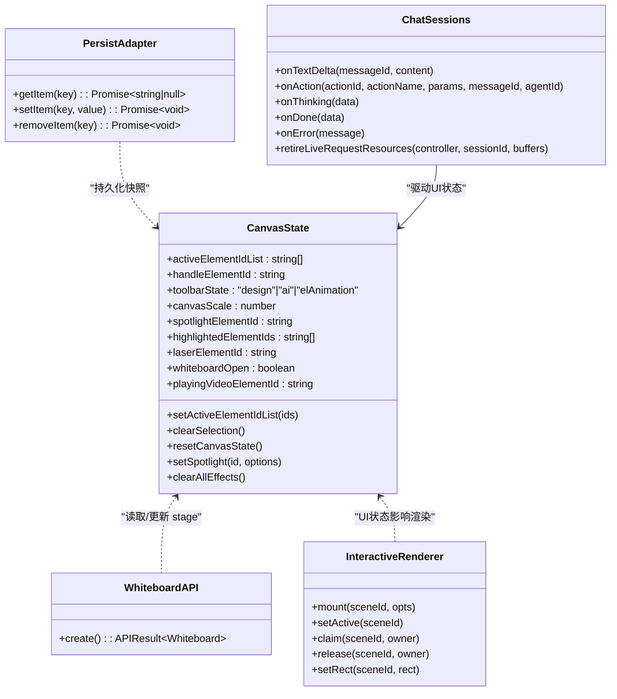

# 组件生命周期与状态管理

<cite>
**本文引用的文件**   
- [lib/store/canvas.ts](file://lib/store/canvas.ts)
- [packages/@openmaic/storage/src/index.ts](file://packages/@openmaic/storage/src/index.ts)
- [packages/@openmaic/storage/test/persist-adapter.test.ts](file://packages/@openmaic/storage/test/persist-adapter.test.ts)
- [components/scene-renderers/interactive-renderer.tsx](file://components/scene-renderers/interactive-renderer.tsx)
- [components/scene-renderers/pbl/v2/chat.tsx](file://components/scene-renderers/pbl/v2/chat.tsx)
- [components/scene-renderers/pbl-renderer.tsx](file://components/scene-renderers/pbl-renderer.tsx)
- [app/page.tsx](file://app/page.tsx)
- [lib/api/stage-api-whiteboard.ts](file://lib/api/stage-api-whiteboard.ts)
- [components/chat/use-chat-sessions.ts](file://components/chat/use-chat-sessions.ts)
- [tests/playback/action-navigation.test.ts](file://tests/playback/action-navigation.test.ts)
</cite>

## 产品概述
OpenMAIC 是一个 AI 驱动的交互式课件（MAIC）生成与课堂管理平台，核心用户场景包括：通过自然语言生成结构化课件、课堂实时互动（问答/讨论/测验）、课件编辑与回放。前端基于 Next.js + React 19 + Zustand 状态管理；AI 编排层使用 LangGraph + Vercel AI SDK；课件格式为自定义 DSL。本仓库将状态管理与组件生命周期贯穿在编辑器、渲染器、会话流与持久化层中，强调可预测的状态切片、清晰的挂载/卸载清理、以及跨组件数据共享与同步。

## 核心业务流程
- 课件编辑流程：用户在画布上选择/编辑元素，Zustand 的 Canvas Store 维护 UI 状态（选中项、缩放、工具栏、教学特效等），操作通过 API 命名空间写入 stage 数据。
- 交互渲染流程：交互式场景以 iframe 形式挂载，组件在挂载时注册/激活/声明可见性，卸载时释放资源并停止测量循环。
- 课堂会话流：聊天与会话缓冲按事件驱动推进，支持文本增量、动作执行、思考过程与完成回调，并在会话结束时统一回收资源。
- 回放与导航：回放引擎基于动作序列进行定位与恢复，避免引入时间戳/进度等不安全字段，确保跳转与恢复的一致性。

图表来源 
- [lib/store/canvas.ts](file://lib/store/canvas.ts)
- [lib/api/stage-api-whiteboard.ts](file://lib/api/stage-api-whiteboard.ts)
- [components/scene-renderers/interactive-renderer.tsx](file://components/scene-renderers/interactive-renderer.tsx)
- [components/chat/use-chat-sessions.ts](file://components/chat/use-chat-sessions.ts)

章节来源
- [lib/store/canvas.ts](file://lib/store/canvas.ts)
- [lib/api/stage-api-whiteboard.ts](file://lib/api/stage-api-whiteboard.ts)
- [components/scene-renderers/interactive-renderer.tsx](file://components/scene-renderers/interactive-renderer.tsx)
- [components/chat/use-chat-sessions.ts](file://components/chat/use-chat-sessions.ts)

## 功能模块清单
- 画布状态管理（Zustand Store）
  - 职责：管理元素选择、视图缩放、工具栏面板、富文本属性、教学特效（聚光灯/高亮/激光笔）、视频播放、白板开关等。
  - 验收要点：选择联动 handleElementId、多选自动切设计面板、批量重置保留视口设置、效果清理不中断视频播放。
- 持久化存储适配（@openmaic/storage）
  - 职责：提供 KVStore、文档与运行时存储后端，暴露 kvPersistStorage 适配器对接 Zustand persist 中间件。
  - 验收要点：读写空值返回 null、版本信封 round-trip、scope 隔离（account/device）、默认 scope 行为。
- 交互渲染器（iframe）
  - 职责：挂载/激活/声明可见性，卸载时释放；每帧测量宿主矩形并同步给宿主。
  - 验收要点：content 变更重建 iframe、卸载取消 rAF、生命周期钩子成对调用。
- 课堂聊天与会话缓冲
  - 职责：处理 text_delta、action、thinking、cue_user、done、error 等事件，驱动聊天区节奏与状态。
  - 验收要点：会话结束统一回收控制器与缓冲区、直播语音与讲座模式分流、动作执行错误日志。
- 回放与动作导航
  - 职责：构建动作导航目标、保存/读取动作级恢复位置，避免引入时间戳/进度等不安全字段。
  - 验收要点：不可安全重建区间保护、恢复位置仅含 actionIndex/actionId/actionType。

章节来源
- [lib/store/canvas.ts](file://lib/store/canvas.ts)
- [packages/@openmaic/storage/src/index.ts](file://packages/@openmaic/storage/src/index.ts)
- [packages/@openmaic/storage/test/persist-adapter.test.ts](file://packages/@openmaic/storage/test/persist-adapter.test.ts)
- [components/scene-renderers/interactive-renderer.tsx](file://components/scene-renderers/interactive-renderer.tsx)
- [components/chat/use-chat-sessions.ts](file://components/chat/use-chat-sessions.ts)
- [tests/playback/action-navigation.test.ts](file://tests/playback/action-navigation.test.ts)

## 数据与状态
- Zustand 状态切片设计
  - CanvasState 切片：包含元素选择、视图、工具栏、教学特效、视频播放、白板等，所有 setter 方法集中定义，便于类型推导与调试。
  - 选择态联动：setActiveElementIdList 自动设置 handleElementId 与 toolbarState，减少分散逻辑。
  - 批量重置：resetCanvasState 保留 viewportSize/viewportRatio，避免切换场景导致布局抖动。
- 全局状态同步机制
  - Stage API 命名空间：createWhiteboardAPI 通过 store.getState() 读取当前 stage，setState 合并更新 whiteboard 列表。
  - 渲染器与宿主同步：interactive-renderer 在挂载时 mount/setActive/claim，卸载 release；rAF 循环测量宿主矩形并 setRect。
- 持久化与版本控制
  - kvPersistStorage 将 KVStore 适配为 Zustand persist 存储，支持 { state, version } 信封与 scope 隔离。
  - 测试覆盖：未写入返回 null、round-trip 成功、removeItem 清空、scope 隔离与默认 account scope。
- 会话与事件流
  - use-chat-sessions 缓冲事件：text_delta、action、thinking、cue_user、done、error，驱动聊天区与状态机。
  - 资源回收：retireLiveRequestResources 统一 abort 控制器、shutdown 缓冲区、等待当前动作完成并清理 Map。

图表来源 
- [lib/store/canvas.ts](file://lib/store/canvas.ts)
- [lib/api/stage-api-whiteboard.ts](file://lib/api/stage-api-whiteboard.ts)
- [packages/@openmaic/storage/src/index.ts](file://packages/@openmaic/storage/src/index.ts)
- [components/scene-renderers/interactive-renderer.tsx](file://components/scene-renderers/interactive-renderer.tsx)
- [components/chat/use-chat-sessions.ts](file://components/chat/use-chat-sessions.ts)

章节来源
- [lib/store/canvas.ts](file://lib/store/canvas.ts)
- [lib/api/stage-api-whiteboard.ts](file://lib/api/stage-api-whiteboard.ts)
- [packages/@openmaic/storage/src/index.ts](file://packages/@openmaic/storage/src/index.ts)
- [components/scene-renderers/interactive-renderer.tsx](file://components/scene-renderers/interactive-renderer.tsx)
- [components/chat/use-chat-sessions.ts](file://components/chat/use-chat-sessions.ts)

## 关键约束与边界
- 组件生命周期与内存泄漏防护
  - useEffect/useLayoutEffect 必须成对清理：ResizeObserver.disconnect、rAF.cancelAnimationFrame、AbortController.abort、PointerCapture 释放。
  - 示例：app/page.tsx 中 ResizeObserver 在卸载时 disconnect；interactive-renderer 卸载时 release 并 cancelAnimationFrame。
- 状态提升与跨组件共享
  - 选择态与工具栏态提升到 CanvasStore，避免组件内重复状态；Stage API 通过 setState 合并 stage 数据，保证单一数据源。
- 持久化边界
  - kvPersistStorage 要求 { state, version } 信封；scope 隔离避免不同域数据污染；未写入键返回 null。
- 会话流边界
  - 讲座模式下 onLiveSpeech 由 PlaybackEngine 管理，Buffer 仅驱动聊天区节奏；动作执行异常需记录日志并继续流程。
- 回放导航约束
  - 恢复位置仅包含 actionIndex/actionId/actionType，禁止引入 timestamp/duration/progress 等不安全字段；不可安全重建区间需保护。

章节来源
- [app/page.tsx](file://app/page.tsx)
- [components/scene-renderers/interactive-renderer.tsx](file://components/scene-renderers/interactive-renderer.tsx)
- [lib/api/stage-api-whiteboard.ts](file://lib/api/stage-api-whiteboard.ts)
- [packages/@openmaic/storage/test/persist-adapter.test.ts](file://packages/@openmaic/storage/test/persist-adapter.test.ts)
- [components/chat/use-chat-sessions.ts](file://components/chat/use-chat-sessions.ts)
- [tests/playback/action-navigation.test.ts](file://tests/playback/action-navigation.test.ts)

## 性能分析与优化建议
- 状态订阅粒度
  - 使用 createSelectors 或细粒度 selector 订阅，避免全量重渲染；CanvasStore 已导出 useCanvasStore 增强 selectors。
- 批量更新与合并
  - setState 合并 stage.whiteboard 列表，避免多次渲染；resetCanvasState 保留视口设置减少布局抖动。
- 渲染循环节流
  - rAF 测量仅在宿主尺寸变化时更新 React 状态，避免频繁 re-render；pbl-renderer 使用脏检查 rectsEqual 降低更新频率。
- 事件缓冲与去抖
  - Chat Sessions 缓冲 text_delta 与 action，按节奏推送到 UI；任务就绪消息动画延迟完成，避免阻塞主线程。
- 资源清理
  - 统一 retireLiveRequestResources 回收控制器与缓冲区；interactive-renderer 卸载时 release 与 cancelAnimationFrame。

章节来源
- [lib/store/canvas.ts](file://lib/store/canvas.ts)
- [components/scene-renderers/pbl-renderer.tsx](file://components/scene-renderers/pbl-renderer.tsx)
- [components/chat/use-chat-sessions.ts](file://components/chat/use-chat-sessions.ts)
- [components/scene-renderers/interactive-renderer.tsx](file://components/scene-renderers/interactive-renderer.tsx)

## 附录：调试与监控
- Zustand 调试
  - 使用 Redux DevTools 或 Zustand middleware 记录状态变更；selectors 输出可追踪组件订阅范围。
- 持久化调试
  - 通过 kvPersistStorage 的 getItem/removeItem 断点验证信封结构与 scope 隔离；测试用例覆盖 round-trip 与默认 scope。
- 会话流监控
  - 在 onAction/onThinking/onDone 处打点，观察事件顺序与异常路径；retireLiveRequestResources 后确认缓冲区清理。
- 渲染性能分析
  - 使用 React Profiler 与 Performance 面板，关注 rAF 与 ResizeObserver 触发频率；确保卸载时清理定时器与观察者。

章节来源
- [packages/@openmaic/storage/test/persist-adapter.test.ts](file://packages/@openmaic/storage/test/persist-adapter.test.ts)
- [components/chat/use-chat-sessions.ts](file://components/chat/use-chat-sessions.ts)
- [components/scene-renderers/interactive-renderer.tsx](file://components/scene-renderers/interactive-renderer.tsx)