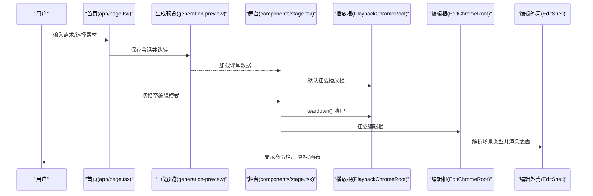
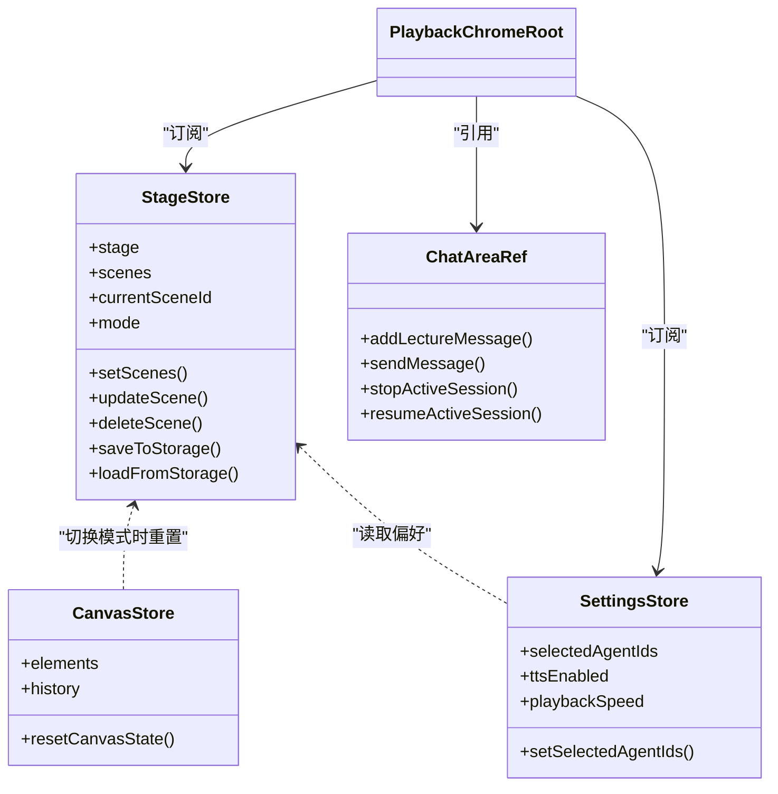

# 组件系统架构

<cite>
**本文引用的文件**   
- [app/layout.tsx](file://app/layout.tsx)
- [app/page.tsx](file://app/page.tsx)
- [components/stage.tsx](file://components/stage.tsx)
- [components/edit/EditChromeRoot.tsx](file://components/edit/EditChromeRoot.tsx)
- [components/edit/PlaybackChromeRoot.tsx](file://components/edit/PlaybackChromeRoot.tsx)
- [components/edit/EditShell/EditShell.tsx](file://components/edit/EditShell/EditShell.tsx)
- [components/ui/button.tsx](file://components/ui/button.tsx)
- [components/ui/card.tsx](file://components/ui/card.tsx)
- [lib/store/index.ts](file://lib/store/index.ts)
- [lib/store/stage.ts](file://lib/store/stage.ts)
</cite>

## 产品概述
OpenMAIC 是一个 AI 驱动的交互式课件（MAIC）生成与课堂管理平台，核心用户场景包括：通过自然语言生成结构化课件、课堂实时互动（问答/讨论/测验）、课件编辑与回放。前端基于 Next.js + React 19 + Zustand 状态管理；AI 编排层使用 LangGraph + Vercel AI SDK；课件格式为自定义 DSL（@openmaic/dsl）。项目采用“基础 UI 组件库（shadcn/ui + Radix）+ 业务组件 + 页面组件”的分层组织方式，以 Stage 为顶层容器，在“播放/自动模式”和“编辑模式”之间切换，并通过 EditShell 统一承载不同场景类型的编辑器表面。

## 核心业务流程
- 首页输入需求与素材 → 进入生成预览页 → 生成大纲与内容 → 进入课堂（Stage）→ 播放/自动播放或进入编辑模式 → 编辑/回放双 chrome 根组件协作完成交互。
- 关键交互节点：需求输入与校验、素材导入与去重、生成会话持久化、课堂加载与缩略图渲染、Pro 模式切换（编辑/播放）、多标签编辑锁、SSE 讨论流、TTS 语音播报、全屏演示与自动隐藏控制条。

**图表来源** 
- [app/page.tsx:317-409](file://app/page.tsx#L317-L409)
- [components/stage.tsx:63-89](file://components/stage.tsx#L63-L89)
- [components/edit/PlaybackChromeRoot.tsx:422-441](file://components/edit/PlaybackChromeRoot.tsx#L422-L441)
- [components/edit/EditChromeRoot.tsx:43-121](file://components/edit/EditChromeRoot.tsx#L43-L121)
- [components/edit/EditShell/EditShell.tsx:74-123](file://components/edit/EditShell/EditShell.tsx#L74-L123)

**章节来源**
- [app/page.tsx:317-409](file://app/page.tsx#L317-L409)
- [components/stage.tsx:63-89](file://components/stage.tsx#L63-L89)
- [components/edit/PlaybackChromeRoot.tsx:422-441](file://components/edit/PlaybackChromeRoot.tsx#L422-L441)
- [components/edit/EditChromeRoot.tsx:43-121](file://components/edit/EditChromeRoot.tsx#L43-L121)
- [components/edit/EditShell/EditShell.tsx:74-123](file://components/edit/EditShell/EditShell.tsx#L74-123)

## 功能模块清单
- 基础 UI 组件库（shadcn/ui + Radix）
  - 职责：提供可复用、主题化、无障碍的原子组件（按钮、卡片、对话框、输入等），通过 class-variance-authority 管理变体，Slot 支持 asChild 组合。
  - 验收要点：样式一致性、暗色主题适配、键盘可达性、响应式尺寸、可组合性。
- 业务组件
  - 职责：封装领域逻辑（如 AgentBar、GenerationToolbar、ChatArea、Roundtable、SlideThumbnail 等），聚合多个基础组件形成完整交互。
  - 验收要点：Props 接口清晰、事件回调明确、错误提示友好、性能可控。
- 页面组件
  - 职责：路由级入口（首页、课堂、生成预览等），负责布局、上下文提供者、全局初始化与导航。
  - 验收要点：首屏加载优化、SSR/CSR 一致性、依赖注入顺序正确。
- 舞台与 Chrome 根
  - 职责：Stage 作为顶层容器，分发编辑/播放两种 chrome；EditChromeRoot/PlaybackChromeRoot 分别承载编辑与播放的全套 UI 与状态。
  - 验收要点：模式切换平滑、资源清理彻底、跨标签编辑锁生效、全屏演示稳定。

**章节来源**
- [components/ui/button.tsx:1-68](file://components/ui/button.tsx#L1-L68)
- [components/ui/card.tsx:1-93](file://components/ui/card.tsx#L1-L93)
- [components/stage.tsx:19-32](file://components/stage.tsx#L19-L32)
- [components/edit/EditChromeRoot.tsx:22-42](file://components/edit/EditChromeRoot.tsx#L22-L42)
- [components/edit/PlaybackChromeRoot.tsx:78-84](file://components/edit/PlaybackChromeRoot.tsx#L78-L84)

## 数据与状态
- 状态管理
  - 使用 Zustand 集中管理 Stage、Canvas、Settings、Keyboard、Snapshot 等核心 store，并提供 Scene Context API 用于可扩展的场景类型数据共享。
  - StageStore 维护 stage、scenes、currentSceneId、mode、chats、outlines、generationComplete 等，提供增删改查、存储持久化、恢复与去抖写入。
- 关键状态流转
  - Stage 根据 mode 切换 EditChromeRoot/PlaybackChromeRoot；编辑模式下由 EditShell 解析 scene.type 到对应 surface 并渲染。
  - PlaybackChromeRoot 持有 Engine、AudioPlayer、ChatArea 引用，管理演讲/讨论/TTS/进度/自动播放等状态。
- 数据所有权边界
  - StageStore 拥有场景与课堂元数据；CanvasStore 拥有画布元素与操作历史；SettingsStore 拥有用户偏好；ChatArea 拥有会话消息与流式状态。
  - 跨组件通信通过 props、事件回调、store 订阅与 context 共享，避免隐式耦合。

**图表来源** 
- [lib/store/index.ts:1-19](file://lib/store/index.ts#L1-L19)
- [lib/store/stage.ts:163-575](file://lib/store/stage.ts#L163-L575)
- [components/edit/PlaybackChromeRoot.tsx:85-120](file://components/edit/PlaybackChromeRoot.tsx#L85-L120)

**章节来源**
- [lib/store/index.ts:1-19](file://lib/store/index.ts#L1-L19)
- [lib/store/stage.ts:163-575](file://lib/store/stage.ts#L163-L575)
- [components/edit/PlaybackChromeRoot.tsx:85-120](file://components/edit/PlaybackChromeRoot.tsx#L85-L120)

## 关键约束与边界
- 组件设计原则
  - 单一职责：UI 原子组件仅负责呈现与基础交互；业务组件封装领域逻辑；页面组件负责装配与上下文。
  - Props 接口：显式声明必需/可选字段，使用 TypeScript 类型约束；事件回调命名规范（onXxx），参数最小化且语义清晰。
  - 事件通信：优先使用回调与 store 订阅，必要时使用 context 共享；避免深层 prop drilling。
  - 状态提升：将需要跨组件同步的状态提升到最近的共同父组件或 store；局部 UI 状态保持在组件内。
- 组件复用机制与组合模式
  - 使用 Slot/Radix 的 asChild 能力实现灵活组合；EditShell 通过 leftRail/rightRail/bottomRail/commandTrailing 插槽注入 chrome 子树。
  - Surface 注册表（sceneEditorRegistry）按场景类型动态解析编辑器表面，保证壳不变、内容可变。
- 样式管理与主题适配
  - 通过 Tailwind CSS 与 class-variance-authority 定义变体；dark 类名与 CSS 变量配合 ThemeProvider 实现主题切换。
  - 全局字体与动画引入在 layout.tsx 中统一配置，确保 SSR/CSR 一致。
- 响应式实现
  - 使用 Tailwind 断点与容器查询；全屏演示下自动隐藏控制条，鼠标/触摸活动恢复显示。
- 开发规范与测试策略
  - 组件需具备可访问性（aria-*、键盘导航）；单元测试覆盖关键逻辑（如状态更新、事件处理）；集成测试验证流程（如 Pro 模式切换、SSE 讨论）。
- 性能优化指南
  - 使用 useMemo/useCallback 稳定引用；避免不必要的重渲染；大列表虚拟化；懒加载编辑器 chunk；去抖保存与请求；对象 URL 及时释放。

**章节来源**
- [components/edit/EditShell/EditShell.tsx:74-123](file://components/edit/EditShell/EditShell.tsx#L74-L123)
- [components/stage.tsx:121-167](file://components/stage.tsx#L121-L167)
- [app/layout.tsx:27-48](file://app/layout.tsx#L27-L48)
- [components/edit/PlaybackChromeRoot.tsx:460-537](file://components/edit/PlaybackChromeRoot.tsx#L460-L537)