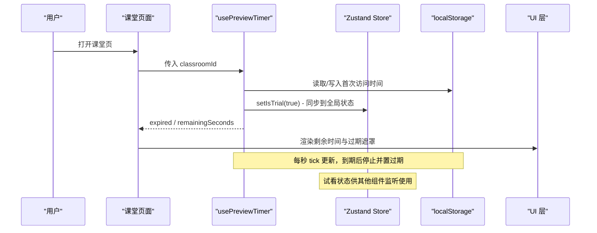
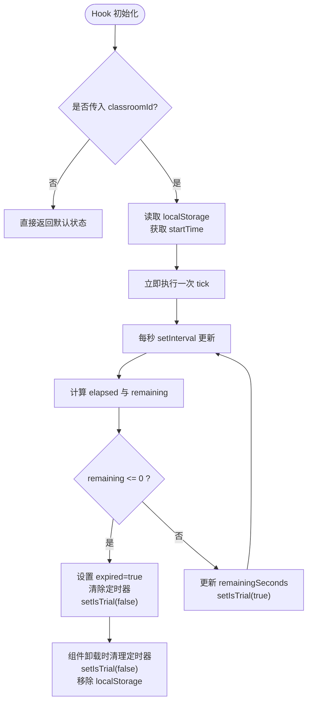

# 预览计时器钩子

<cite>
**本文引用的文件**   
- [use-preview-timer.ts](file://lib/hooks/use-preview-timer.ts)
- [preview.ts](file://lib/store/preview.ts)
- [use-soft-close-countdown.ts](file://components/chat/use-soft-close-countdown.ts)
- [thinking-timers.ts](file://lib/agent/client/thinking-timers.ts)
- [use-tts-preview.ts](file://lib/audio/use-tts-preview.ts)
- [generation-preview.page.ts](file://e2e/pages/generation-preview.page.ts)
- [preview-timer-reset.spec.ts](file://e2e/tests/preview-timer-reset.spec.ts)
</cite>

## 更新摘要
**所做更改**   
- 新增 Zustand store 集成部分，说明预览状态的全局管理
- 增强试用过期处理逻辑，详细说明重置机制和用户体验改进
- 添加完整的 E2E 测试覆盖说明，包括试用重置行为验证
- 更新数据流图以反映新的状态管理模式

## 目录
- 产品概述
- 核心业务流程
- 功能模块清单
- 数据与状态
- 关键约束与边界
- 使用示例与集成点

## 产品概述
本文件聚焦 OpenMAIC 中的"预览计时器"能力，围绕课堂免费试看倒计时、软关闭倒计时以及思考块计时等三类计时场景，梳理其实现思路、数据流与使用方式。该能力服务于生成预览与课堂回放入口的时效控制与体验反馈，帮助在免费试用或会话收尾阶段提供明确的剩余时间提示与阻断策略。

**更新** 现已集成 Zustand store 进行全局状态管理，增强了试用过期处理的健壮性，并提供了完整的端到端测试覆盖。

## 核心业务流程
- 课堂免费试看计时：进入课堂页面后，基于 classroomId 在本地存储记录首次访问时间，按固定时长（10 分钟）倒计时；到期后标记过期，由上层组件展示阻断提示。
- 软关闭倒计时：根据绝对截止时间计算剩余秒数，并在页面可见性变化时刷新，用于会话结束前的温和提醒。
- 思考块计时：为多步推理过程中的每个"思考块"独立计时，支持开始、结束、批量关闭与恢复，便于面板展示各块耗时。

**图表来源**
- [use-preview-timer.ts:24-97](file://lib/hooks/use-preview-timer.ts#L24-L97)
- [preview.ts:19-22](file://lib/store/preview.ts#L19-L22)

章节来源
- [use-preview-timer.ts:24-97](file://lib/hooks/use-preview-timer.ts#L24-L97)

## 功能模块清单
- 课堂免费试看计时 Hook
  - 职责：以 classroomId 为维度维护过期状态与剩余秒数，驱动 UI 展示与阻断逻辑。
  - 验收要点：不同 classroomId 独立计时；过期后不再继续 tick；异常降级不中断流程。
  - **新增**：通过 Zustand store 同步试看状态，供声音切换器等组件禁用操作。
  - 参考路径：[use-preview-timer.ts](file://lib/hooks/use-preview-timer.ts)

- 预览状态 Store（Zustand）
  - 职责：管理当前是否处于免费试看窗口内的全局状态。
  - 验收要点：状态变更响应式更新；生命周期内保持单一事实来源。
  - 参考路径：[preview.ts](file://lib/store/preview.ts)

- 软关闭倒计时 Hook
  - 职责：根据 deadline 计算剩余秒数，监听 visibilitychange 提升准确性。
  - 验收要点：无 deadline 返回 undefined；到期归零；切换标签页仍准确。
  - 参考路径：[use-soft-close-countdown.ts](file://components/chat/use-soft-close-countdown.ts)

- 思考块计时 Store
  - 职责：按 key 管理 ThinkTimer，支持 observe/endAll/seed/clear 等操作。
  - 验收要点：最后一个思考块保持运行直到后续部分出现或 run 结束；批量关闭前缀匹配有效。
  - 参考路径：[thinking-timers.ts](file://lib/agent/client/thinking-timers.ts)

- TTS 预览 Hook（辅助）
  - 职责：统一浏览器原生与 API 方式的音频预览播放，包含取消与资源释放。
  - 验收要点：重复调用自动清理上一次任务；Abort 错误吞掉，其他错误上抛。
  - 参考路径：[use-tts-preview.ts](file://lib/audio/use-tts-preview.ts)

章节来源
- [use-preview-timer.ts:24-97](file://lib/hooks/use-preview-timer.ts#L24-L97)
- [preview.ts:1-23](file://lib/store/preview.ts#L1-L23)
- [use-soft-close-countdown.ts:1-30](file://components/chat/use-soft-close-countdown.ts#L1-L30)
- [thinking-timers.ts:1-74](file://lib/agent/client/thinking-timers.ts#L1-L74)
- [use-tts-preview.ts:1-162](file://lib/audio/use-tts-preview.ts#L1-L162)

## 数据与状态
- 课堂免费试看计时
  - 输入：classroomId（字符串）
  - 输出：{ expired: boolean, remainingSeconds: number }
  - 持久化：localStorage，键形如 openmaic.preview.{classroomId}，值为首次访问时间的毫秒数
  - **新增**：Zustand store 状态 isTrial，用于全局试看状态管理
  - 生命周期：组件挂载后启动定时器，卸载时清理；classroomId 变更则重置计时

- 预览状态 Store
  - 结构：{ isTrial: boolean, setIsTrial: (v: boolean) => void }
  - 用途：作为试看窗口的单一事实来源，供多个组件订阅
  - 生命周期：随应用生命周期存在，不持久化

- 软关闭倒计时
  - 输入：deadline（可选，毫秒时间戳）
  - 输出：remainingSeconds（number | undefined）
  - 事件：每秒更新；document.visibilitychange 触发刷新

- 思考块计时
  - 结构：Record<string, { startedAt: number; endedAt?: number }>
  - 操作：observe(key, { end, now })、endAll(prefix, now)、seed(key, durationMs)、clear()
  - 显示：formatThinkDuration(ms) 将毫秒转为可读文本

**图表来源**
- [use-preview-timer.ts:32-94](file://lib/hooks/use-preview-timer.ts#L32-L94)
- [preview.ts:19-22](file://lib/store/preview.ts#L19-L22)

章节来源
- [use-preview-timer.ts:32-94](file://lib/hooks/use-preview-timer.ts#L32-L94)
- [preview.ts:1-23](file://lib/store/preview.ts#L1-L23)
- [use-soft-close-countdown.ts:1-30](file://components/chat/use-soft-close-countdown.ts#L1-L30)
- [thinking-timers.ts:1-74](file://lib/agent/client/thinking-timers.ts#L1-L74)

## 关键约束与边界
- 本地存储依赖
  - 若 localStorage 不可用，Hook 会静默降级，不限制预览时长，避免阻断主流程。
- 计时精度与性能
  - 使用 setInterval 每秒更新；到期后主动 clearInterval 释放资源。
- 多实例隔离
  - 课堂计时以 classroomId 为键隔离，避免跨课堂干扰。
- 软关闭准确性
  - 通过 visibilitychange 监听提升后台标签页下的剩余时间准确性。
- 思考块状态一致性
  - 纯函数 nextThinkTimer 保证状态转换可测试；store 仅做薄封装。
- 预览与媒体资源
  - TTS 预览 Hook 负责取消与资源释放，避免并发冲突与内存泄漏。
- **新增** Zustand store 集成
  - 试看状态为瞬态存储，不持久化，仅描述当前课堂页面的试看生命周期。
  - 所有组件通过订阅 store 状态实现响应式更新。

章节来源
- [use-preview-timer.ts:32-94](file://lib/hooks/use-preview-timer.ts#L32-L94)
- [preview.ts:1-23](file://lib/store/preview.ts#L1-L23)
- [use-soft-close-countdown.ts:1-30](file://components/chat/use-soft-close-countdown.ts#L1-L30)
- [thinking-timers.ts:1-74](file://lib/agent/client/thinking-timers.ts#L1-L74)
- [use-tts-preview.ts:1-162](file://lib/audio/use-tts-preview.ts#L1-L162)

## 使用示例与集成点
- 在课堂页面中调用 usePreviewTimer(classroomId)，根据返回的 expired 与 remainingSeconds 渲染倒计时与过期遮罩。
- 通过 usePreviewStore 订阅 isTrial 状态，实现声音切换器等组件的禁用逻辑。
- 在聊天与会话收尾处使用 useSoftCloseCountdown(deadline) 显示软关闭倒计时。
- 在多步推理场景中，使用 useThinkingTimers.observe/endAll/seed 管理各思考块的计时与展示。
- 生成预览流程可通过 e2e 页面跳转至课堂页，验证预览到课堂的过渡与计时生效。

**新增** E2E 测试覆盖
- 试用重置行为测试：验证过期后重新进入应重置计时起点，而非永久阻断。
- 首次进入测试：确保新用户获得完整新一轮试看，无阻断层。
- 声音按钮可用性：验证试看期间声音切换按钮的正确禁用逻辑。

章节来源
- [generation-preview.page.ts:33-61](file://e2e/pages/generation-preview.page.ts#L33-L61)
- [preview-timer-reset.spec.ts:102-139](file://e2e/tests/preview-timer-reset.spec.ts#L102-L139)