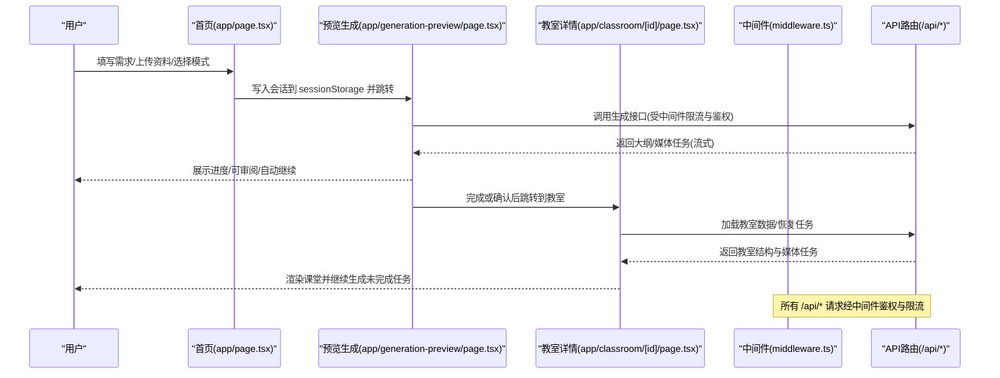
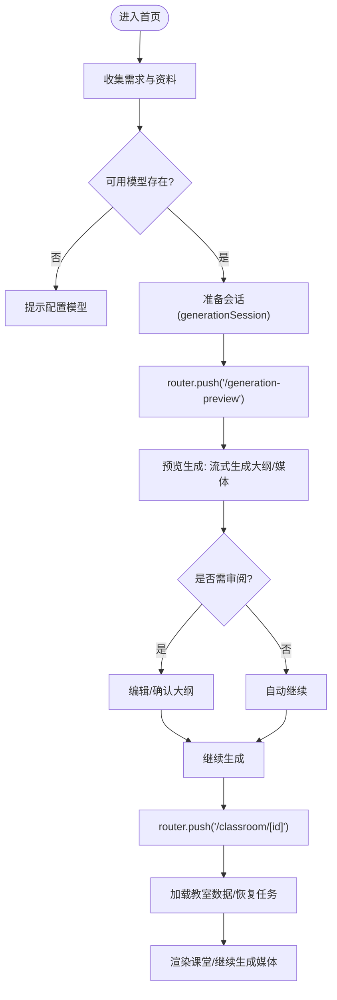

# 路由架构设计

<cite>
**本文引用的文件**   
- [app/layout.tsx](file://app/layout.tsx)
- [app/page.tsx](file://app/page.tsx)
- [app/classroom/[id]/page.tsx](file://app/classroom/[id]/page.tsx)
- [app/generation-preview/layout.tsx](file://app/generation-preview/layout.tsx)
- [app/generation-preview/page.tsx](file://app/generation-preview/page.tsx)
- [middleware.ts](file://middleware.ts)
- [next.config.ts](file://next.config.ts)
- [components/access-code-guard.tsx](file://components/access-code-guard.tsx)
</cite>

## 目录
- 产品概述
- 核心业务流程
- 功能模块清单
- 数据与状态
- 关键约束与边界

## 产品概述
OpenMAIC 是基于 Next.js App Router 的 AI 交互式课件生成与课堂管理平台。路由体系围绕“首页入口 → 预览生成 → 教室播放”的主路径组织，配合 API 路由、动态路由参数、嵌套布局与中间件实现安全鉴权、限流与跨端协作。页面采用客户端组件与服务器渲染协同，结合代码分割与预取策略，保障首屏性能与交互流畅度。

## 核心业务流程
- 首页入口：用户输入需求、选择资料与模式后，进入预览生成页。
- 预览生成：流式生成大纲与媒体任务，支持人工审阅与自动继续。
- 教室播放：根据课程 ID 加载场景与智能体，恢复未完成的任务并渲染课堂。

**图表来源** 
- [app/page.tsx:317-409](file://app/page.tsx#L317-L409)
- [app/generation-preview/page.tsx:187-200](file://app/generation-preview/page.tsx#L187-L200)
- [app/classroom/[id]/page.tsx](file://app/classroom/[id]/page.tsx#L44-L107)
- [middleware.ts:78-136](file://middleware.ts#L78-L136)

**章节来源**
- [app/page.tsx:317-409](file://app/page.tsx#L317-L409)
- [app/generation-preview/page.tsx:187-200](file://app/generation-preview/page.tsx#L187-L200)
- [app/classroom/[id]/page.tsx:44-107](file://app/classroom/[id]/page.tsx#L44-L107)
- [middleware.ts:78-136](file://middleware.ts#L78-L136)

## 功能模块清单
- 根布局与全局上下文
  - 职责：提供主题、国际化、服务端初始化、访问码守卫与全局样式。
  - 关键点：在根布局中注入 AccessCodeGuard，统一拦截未授权访问。
- 首页（入口）
  - 职责：收集需求与资料，校验可用模型，准备会话并跳转预览生成。
  - 关键点：使用客户端路由进行导航；将生成参数持久化到 sessionStorage。
- 预览生成（中间态）
  - 职责：流式生成大纲与媒体任务，支持审阅与自动继续，完成后跳转教室。
  - 关键点：强制动态渲染，避免 SSR 不匹配；维护会话状态与重试策略。
- 教室详情（动态路由）
  - 职责：按课程 ID 加载场景、恢复未完成任务、渲染课堂并继续生成。
  - 关键点：使用 useParams 获取 id；清理跨课程污染状态；自动恢复媒体生成。
- 中间件与安全
  - 职责：访问码鉴权、服务密钥放行、速率限制、安全响应头。
  - 关键点：区分高成本与通用 API 限流；对未认证 API 返回 401，页面放行由前端弹窗处理。
- 构建与部署
  - 职责：子路径部署、独立输出、外部包配置、CSP 等安全头。
  - 关键点：basePath 支持反向代理前缀；生产环境启用 HSTS。

**章节来源**
- [app/layout.tsx:27-48](file://app/layout.tsx#L27-L48)
- [app/page.tsx:317-409](file://app/page.tsx#L317-L409)
- [app/generation-preview/layout.tsx:1-7](file://app/generation-preview/layout.tsx#L1-L7)
- [app/generation-preview/page.tsx:187-200](file://app/generation-preview/page.tsx#L187-L200)
- [app/classroom/[id]/page.tsx:27-107](file://app/classroom/[id]/page.tsx#L27-L107)
- [middleware.ts:78-136](file://middleware.ts#L78-L136)
- [next.config.ts:1-40](file://next.config.ts#L1-L40)
- [components/access-code-guard.tsx:9-54](file://components/access-code-guard.tsx#L9-L54)

## 数据与状态
- 会话与参数传递
  - generationSession：首页写入，预览生成读取，包含需求、文档源、PDF 信息、当前步骤等。
  - generationParams：预览生成写入，教室详情页读取以恢复媒体映射与智能体配置。
- 状态隔离与清理
  - 切换教室时清理媒体任务与白板历史，防止跨课程污染。
  - 使用令牌机制确保并发加载与卸载时的正确性。
- URL 同步与历史操作
  - 使用 next/navigation 的 useRouter 进行 push 导航，保持浏览器历史一致。
  - 动态路由通过 [id] 参数驱动教室详情页面。

**图表来源** 
- [app/page.tsx:317-409](file://app/page.tsx#L317-L409)
- [app/generation-preview/page.tsx:187-200](file://app/generation-preview/page.tsx#L187-L200)
- [app/classroom/[id]/page.tsx:44-107](file://app/classroom/[id]/page.tsx#L44-L107)

**章节来源**
- [app/page.tsx:317-409](file://app/page.tsx#L317-L409)
- [app/generation-preview/page.tsx:187-200](file://app/generation-preview/page.tsx#L187-L200)
- [app/classroom/[id]/page.tsx:44-107](file://app/classroom/[id]/page.tsx#L44-L107)

## 关键约束与边界
- 鉴权与访问控制
  - 中间件校验访问码 Cookie 与服务密钥，未认证 API 返回 401，页面请求放行由前端弹窗提示。
  - 访问码状态由前端组件轮询后端接口决定是否需要弹窗。
- 速率限制
  - 通用 API 每分钟 60 次，高成本 API（生成类）每分钟 10 次，超限返回 429 并附带 Retry-After。
- 安全头与部署
  - 设置 CSP、X-Frame-Options、Referrer-Policy、Permissions-Policy，生产环境启用 HSTS。
  - basePath 支持子路径部署；standalone 输出便于容器化部署。
- 渲染策略
  - 预览生成页强制动态渲染，避免 SSR 与客户端 hooks 的不匹配。
  - 根布局提供全局上下文，减少重复初始化开销。

**章节来源**
- [middleware.ts:78-136](file://middleware.ts#L78-L136)
- [components/access-code-guard.tsx:9-54](file://components/access-code-guard.tsx#L9-L54)
- [next.config.ts:13-36](file://next.config.ts#L13-L36)
- [app/generation-preview/layout.tsx:1-7](file://app/generation-preview/layout.tsx#L1-L7)
- [app/layout.tsx:27-48](file://app/layout.tsx#L27-L48)