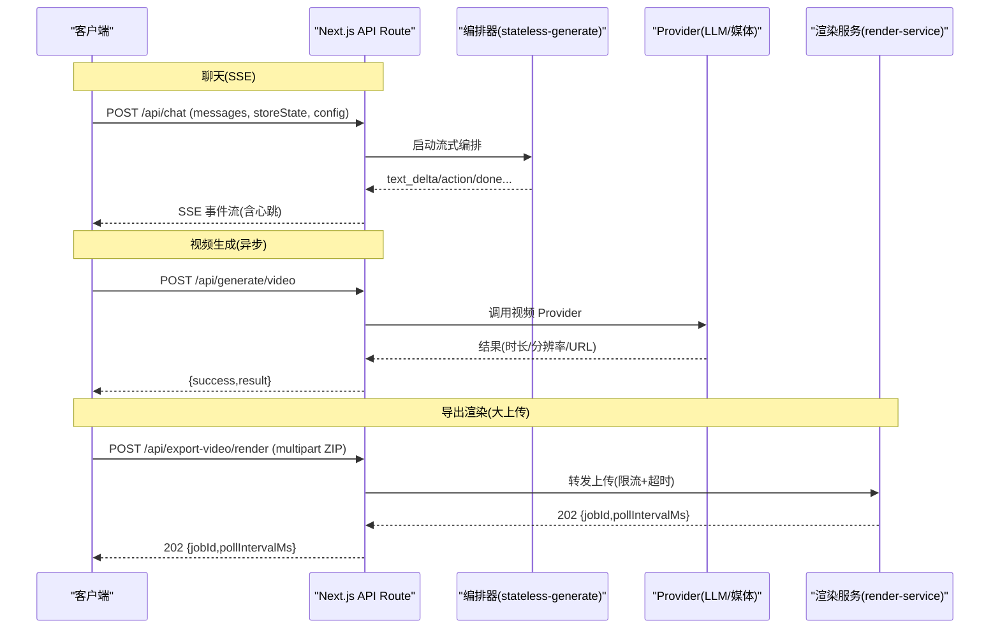
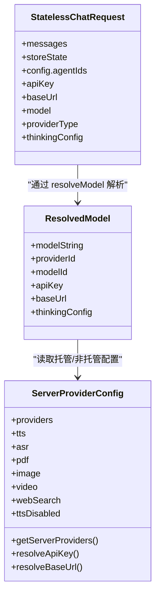

# 后端架构设计

<cite>
**本文引用的文件**   
- [app/api/chat/route.ts](file://app/api/chat/route.ts)
- [lib/orchestration/stateless-generate.ts](file://lib/orchestration/stateless-generate.ts)
- [app/api/generate/video/route.ts](file://app/api/generate/video/route.ts)
- [app/api/export-video/render/route.ts](file://app/api/export-video/render/route.ts)
- [render-service/src/main.ts](file://render-service/src/main.ts)
- [lib/server/provider-config.ts](file://lib/server/provider-config.ts)
- [lib/server/resolve-model.ts](file://lib/server/resolve-model.ts)
- [lib/server/api-response.ts](file://lib/server/api-response.ts)
- [lib/logger.ts](file://lib/logger.ts)
- [app/api/proxy-media/route.ts](file://app/api/proxy-media/route.ts)
- [app/api/health/route.ts](file://app/api/health/route.ts)
</cite>

## 产品概述
OpenMAIC 是一个 AI 驱动的交互式课件（MAIC）生成与课堂管理平台。后端基于 Next.js API Routes，提供无状态、流式、可扩展的 RESTful API，支撑多智能体编排、媒体生成、视频导出渲染、代理下载等核心能力。通过统一的模型解析与 Provider 配置管理，实现“服务端托管 + 客户端自定义”的双轨鉴权与路由策略；通过 SSE 流式响应与心跳保活，保障长时交互体验；通过 SSRF 防护、大小限制、重定向控制等机制强化安全边界。

## 核心业务流程
- 聊天对话（SSE 流式）：客户端发送完整状态与消息，服务端按单轮编排调用 LangGraph，逐事件推送文本与动作，支持中断与心跳保活。
- 视频生成（异步任务）：提交生成任务后返回 jobId，客户端轮询结果；服务端记录用量并统一错误码。
- 视频导出渲染（大体积上传）：将 multipart ZIP 直传到独立渲染服务，服务端仅做轻量转发与限流保护，渲染在远端异步完成。
- 媒体代理下载：服务端代理远程媒体，进行 SSRF 校验、重定向链检查、大小限制与安全类型过滤，返回二进制流。
- 健康检查：暴露版本与各能力开关，便于监控与健康探针。

**图表来源** 
- [app/api/chat/route.ts:44-196](file://app/api/chat/route.ts#L44-L196)
- [lib/orchestration/stateless-generate.ts:392-509](file://lib/orchestration/stateless-generate.ts#L392-L509)
- [app/api/generate/video/route.ts:36-109](file://app/api/generate/video/route.ts#L36-L109)
- [app/api/export-video/render/route.ts:46-113](file://app/api/export-video/render/route.ts#L46-L113)
- [render-service/src/main.ts:110-138](file://render-service/src/main.ts#L110-L138)

**章节来源**
- [app/api/chat/route.ts:44-196](file://app/api/chat/route.ts#L44-L196)
- [lib/orchestration/stateless-generate.ts:392-509](file://lib/orchestration/stateless-generate.ts#L392-L509)
- [app/api/generate/video/route.ts:36-109](file://app/api/generate/video/route.ts#L36-L109)
- [app/api/export-video/render/route.ts:46-113](file://app/api/export-video/render/route.ts#L46-L113)
- [render-service/src/main.ts:110-138](file://render-service/src/main.ts#L110-L138)

## 功能模块清单
- 聊天与多智能体编排
  - 职责：接收无状态请求，驱动 LangGraph 编排，流式输出文本与动作，维护 directorState。
  - 验收要点：SSE 事件顺序正确、心跳保活、中断可恢复、结构化 JSON Array 增量解析稳定。
- 视频生成
  - 职责：参数校验、Provider 选择、选项归一化、调用生成、用量记录、内容安全拦截。
  - 验收要点：maxDuration=300s、错误码区分敏感内容与上游错误、用量统计准确。
- 导出渲染
  - 职责：超大上传限速与字节上限、直传渲染服务、身份隔离与限流、异步 job 返回。
  - 验收要点：Content-Length 快速拒绝、流式转发不缓冲、429/413/502 映射清晰。
- 媒体代理
  - 职责：SSRF 校验、重定向链限制、大小限制、安全 Content-Type 过滤。
  - 验收要点：禁止内网/私有地址、最多 5 次重定向、最大 25MiB、非媒体类型降级为 octet-stream。
- 模型与 Provider 配置
  - 职责：YAML + 环境变量加载、托管/非托管双轨鉴权、Stage 路由覆盖、Thinking 仲裁。
  - 验收要点：托管 Provider 忽略客户端 key/baseUrl、生产环境 SSRF 校验生效、默认模型缺失时报错。
- 健康检查
  - 职责：返回版本与各能力开关，供探针使用。
  - 验收要点：capabilities 字段反映实际可用 Provider。

**章节来源**
- [app/api/chat/route.ts:44-196](file://app/api/chat/route.ts#L44-L196)
- [lib/orchestration/stateless-generate.ts:392-509](file://lib/orchestration/stateless-generate.ts#L392-L509)
- [app/api/generate/video/route.ts:36-109](file://app/api/generate/video/route.ts#L36-L109)
- [app/api/export-video/render/route.ts:46-113](file://app/api/export-video/render/route.ts#L46-L113)
- [app/api/proxy-media/route.ts:23-92](file://app/api/proxy-media/route.ts#L23-L92)
- [lib/server/provider-config.ts:362-422](file://lib/server/provider-config.ts#L362-L422)
- [app/api/health/route.ts:11-22](file://app/api/health/route.ts#L11-L22)

## 数据与状态
- 聊天请求/响应
  - 输入：messages、storeState、config.agentIds、apiKey/baseUrl/model/providerType/thinkingConfig。
  - 输出：SSE 事件流（text_delta、action、done、error），最终携带 directorState 增量。
- 视频生成
  - 输入：prompt、duration、aspectRatio、resolution、x-video-provider/x-video-model。
  - 输出：{ success, result:{ url,width,height,duration } } 或错误码。
- 导出渲染
  - 输入：multipart/form-data ZIP（受 MAX_UPLOAD_BYTES 限制）。
  - 输出：202 { jobId, pollIntervalMs }，后续由 render-service 处理。
- 媒体代理
  - 输入：{ url }。
  - 输出：二进制流（安全类型过滤）、或错误码。
- Provider 配置
  - YAML + 环境变量合并，缓存于进程级 Map；区分托管与非托管，暴露最小元信息。

**图表来源** 
- [lib/types/chat.ts:357-396](file://lib/types/chat.ts#L357-L396)
- [lib/server/resolve-model.ts:20-128](file://lib/server/resolve-model.ts#L20-L128)
- [lib/server/provider-config.ts:362-422](file://lib/server/provider-config.ts#L362-L422)

**章节来源**
- [lib/types/chat.ts:357-396](file://lib/types/chat.ts#L357-L396)
- [lib/server/resolve-model.ts:20-128](file://lib/server/resolve-model.ts#L20-L128)
- [lib/server/provider-config.ts:362-422](file://lib/server/provider-config.ts#L362-L422)

## 关键约束与边界
- 请求生命周期与中间件
  - Next.js API Route 作为入口，统一使用 apiError/apiSuccess 返回标准结构。
  - 长连接接口设置 maxDuration（chat=60s，video/render=300s），配合心跳保活与 AbortSignal 传播中断。
- 安全与防护
  - SSRF 防护：生产环境下对非托管 Provider base URL 与代理目标 URL 进行校验，禁止内网/私有地址。
  - 大小限制：媒体代理最大 25MiB，导出渲染上传最大 300MiB（按真实字节计数）。
  - 重定向限制：最多 5 次，防止循环跳转。
  - 内容安全：视频生成敏感内容直接拦截并返回专用错误码。
- 限流与并发
  - 渲染服务侧基于 x-openmaic-client 身份隔离与队列预留，避免内存爆炸与资源争用。
  - 场景内容并行度可通过 PARALLEL_SCENE_CONCURRENCY 控制（0 表示串行）。
- 日志与可观测性
  - 统一 createLogger(tag) 输出，支持 LOG_LEVEL 与 LOG_FORMAT=json。
  - 关键路径均记录 model/provider/prompt 摘要与耗时上下文。
- 错误处理与重试
  - 上游 5xx 统一折叠为 502 UPSTREAM_ERROR，客户端据此决定是否重试。
  - 429 RATE_LIMITED 明确限流信号，建议指数退避。
  - 中断 AbortError 优雅关闭 writer，不抛错。
- 版本管理与能力探测
  - /api/health 返回 version 与 capabilities，前端据此动态启用功能。
- 性能调优建议
  - 合理设置 maxDuration 与心跳间隔，避免代理/浏览器超时。
  - 大体积上传采用流式转发，避免全量缓冲。
  - 按需开启 Thinking，降低首字延迟。
  - 使用托管 Provider 减少鉴权开销与网络抖动。
- 监控告警方案
  - 以 /api/health 作为存活探针，结合错误码分布（UPSTREAM_ERROR/RATE_LIMITED/CONTENT_SENSITIVE）建立告警。
  - 对渲染服务队列占用、上传失败率、SSE 断连率进行指标采集。

**章节来源**
- [lib/server/api-response.ts:1-51](file://lib/server/api-response.ts#L1-L51)
- [app/api/chat/route.ts:25-26](file://app/api/chat/route.ts#L25-L26)
- [app/api/generate/video/route.ts:34](file://app/api/generate/video/route.ts#L34)
- [app/api/export-video/render/route.ts:15-21](file://app/api/export-video/render/route.ts#L15-L21)
- [app/api/proxy-media/route.ts:38-58](file://app/api/proxy-media/route.ts#L38-L58)
- [lib/logger.ts:1-53](file://lib/logger.ts#L1-L53)
- [lib/server/provider-config.ts:672-677](file://lib/server/provider-config.ts#L672-L677)
- [render-service/src/main.ts:110-138](file://render-service/src/main.ts#L110-L138)
- [app/api/health/route.ts:11-22](file://app/api/health/route.ts#L11-L22)