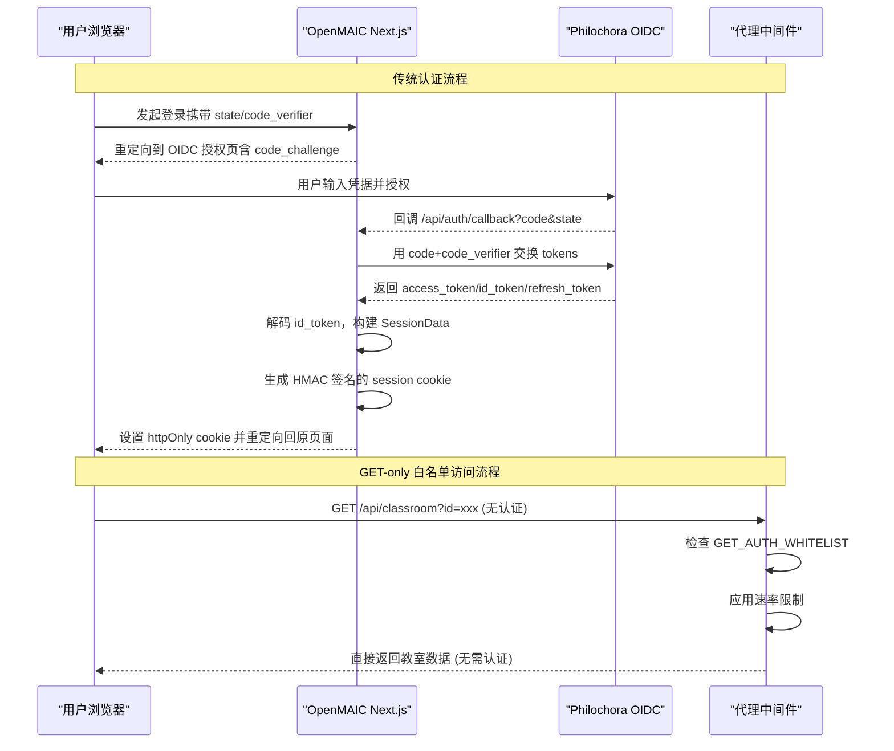
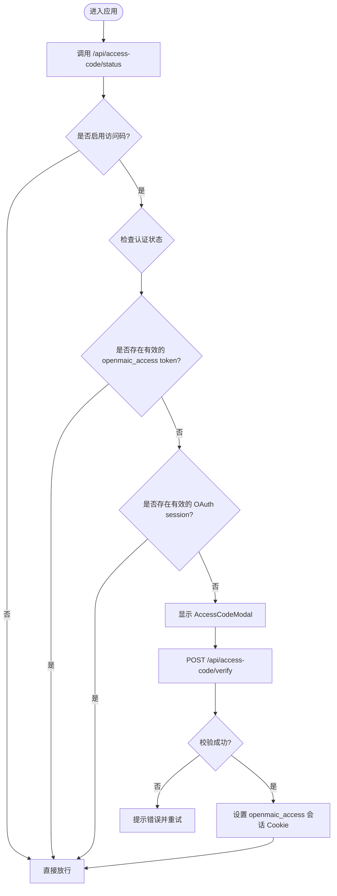
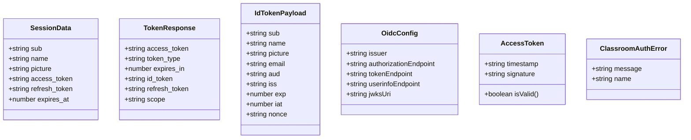
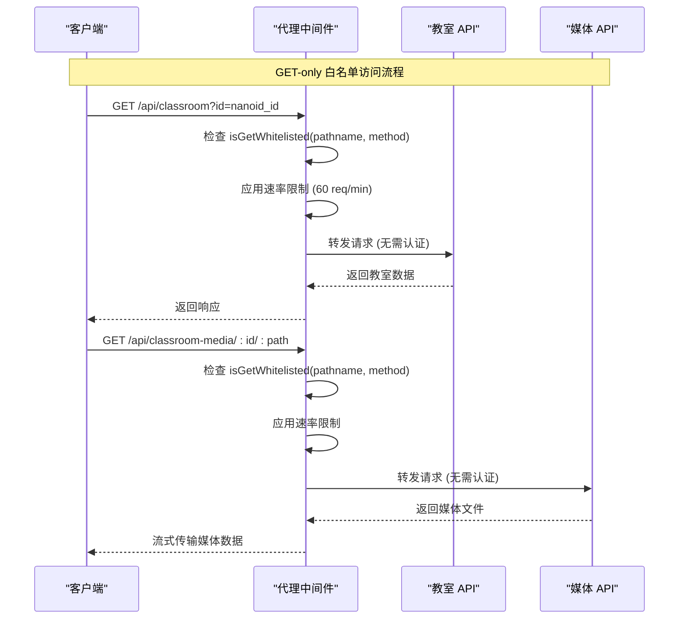
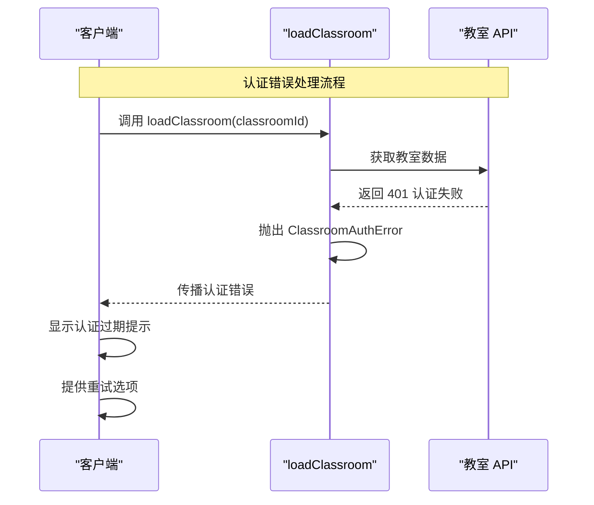
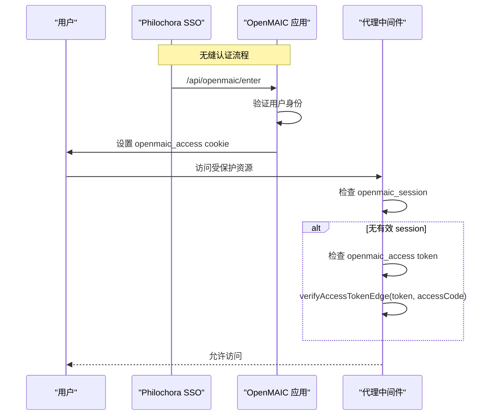

# OAuth 2.0 认证系统

<cite>
**本文引用的文件**   
- [app/api/auth/callback/route.ts](file://app/api/auth/callback/route.ts)
- [lib/server/oauth-client.ts](file://lib/server/oauth-client.ts)
- [lib/server/oauth-config.ts](file://lib/server/oauth-config.ts)
- [lib/server/session-cookie.ts](file://lib/server/session-cookie.ts)
- [app/api/access-code/status/route.ts](file://app/api/access-code/status/route.ts)
- [app/api/access-code/verify/route.ts](file://app/api/access-code/verify/route.ts)
- [lib/server/access-token.ts](file://lib/server/access-token.ts)
- [components/access-code-guard.tsx](file://components/access-code-guard.tsx)
- [components/access-code-modal.tsx](file://components/access-code-modal.tsx)
- [proxy.ts](file://proxy.ts)
- [app/api/classroom/route.ts](file://app/api/classroom/route.ts)
- [app/api/classroom-media/[classroomId]/[...path]/route.ts](file://app/api/classroom-media/[classroomId]/[...path]/route.ts)
- [lib/server/classroom-storage.ts](file://lib/server/classroom-storage.ts)
- [lib/classroom/load-classroom.ts](file://lib/classroom/load-classroom.ts)
</cite>

## 更新摘要
**变更内容**   
- **新增** GET-only 认证白名单机制，允许未认证访问者读取教室数据和媒体资源
- **增强**代理中间件支持 `/api/classroom` 和 `/api/classroom-media/` 的 GET 请求免认证访问
- **引入** ClassroomAuthError 哨兵错误机制，用于区分401认证错误与其他类型失败
- **改进**认证错误处理机制，提供更精确的错误分类和用户反馈
- 利用 nanoid 生成的不可猜测教室 ID 确保只读数据安全暴露
- 保持页面级认证保护（307 重定向），仅开放 API 数据层的只读访问
- 维持速率限制防护，防止滥用未认证访问

## 产品概述
本系统为 OpenMAIC 的 OAuth 2.0 认证子系统，基于 Authorization Code + PKCE 流程与 OIDC Discovery，完成用户登录、会话建立与访问控制。核心能力包括：
- 通过 Philochora OIDC 服务进行授权码交换，获取 access_token、id_token、refresh_token
- 使用 HMAC-SHA256 签名会话 Cookie，在 Edge/Node 双环境兼容验证
- 提供"访问码"模式作为轻量级鉴权补充（适用于无 OIDC 或快速部署场景）
- **新增**无缝认证集成，支持 Philochora SSO 与 OpenMAIC 教室的直接认证
- **新增**GET-only 认证白名单，允许安全的只读数据访问而无需完整认证流程
- **新增**增强的错误处理机制，通过 ClassroomAuthError 精确区分认证失败与其他错误
- 前端根据后端状态动态展示访问码弹窗并维持登录态

适用场景：
- 面向教师/讲师的课件生成与课堂互动平台
- 需要统一身份认证与跨端会话保持的 Web 应用
- 需要快速部署且可配置外部 OIDC 提供商的系统
- **新增**需要无缝单点登录体验的教育平台集成
- **新增**需要公开只读教室数据访问的教育资源共享场景

## 核心业务流程
本节描述四种主要认证路径：OAuth 2.0 授权码流程、访问码流程、无缝认证流程和 GET-only 白名单访问流程。

**图表来源** 
- [app/api/auth/callback/route.ts:73-116](file://app/api/auth/callback/route.ts#L73-L116)
- [lib/server/oauth-client.ts:1-130](file://lib/server/oauth-client.ts#L1-L130)
- [lib/server/oauth-config.ts:1-81](file://lib/server/oauth-config.ts#L1-L81)
- [lib/server/session-cookie.ts:24-32](file://lib/server/session-cookie.ts#L24-L32)
- [proxy.ts:92-116](file://proxy.ts#L92-L116)

**图表来源** 
- [components/access-code-guard.tsx:16-38](file://components/access-code-guard.tsx#L16-L38)
- [components/access-code-modal.tsx:27-53](file://components/access-code-modal.tsx#L27-L53)
- [app/api/access-code/status/route.ts:6-31](file://app/api/access-code/status/route.ts#L6-L31)
- [app/api/access-code/verify/route.ts:6-41](file://app/api/access-code/verify/route.ts#L6-L41)
- [lib/server/access-token.ts:3-25](file://lib/server/access-token.ts#L3-L25)

**章节来源**
- [app/api/auth/callback/route.ts:73-116](file://app/api/auth/callback/route.ts#L73-L116)
- [lib/server/oauth-client.ts:1-130](file://lib/server/oauth-client.ts#L1-L130)
- [lib/server/oauth-config.ts:1-81](file://lib/server/oauth-config.ts#L1-L81)
- [lib/server/session-cookie.ts:24-99](file://lib/server/session-cookie.ts#L24-L99)
- [components/access-code-guard.tsx:16-38](file://components/access-code-guard.tsx#L16-L38)
- [components/access-code-modal.tsx:27-53](file://components/access-code-modal.tsx#L27-L53)
- [app/api/access-code/status/route.ts:6-31](file://app/api/access-code/status/route.ts#L6-L31)
- [app/api/access-code/verify/route.ts:6-41](file://app/api/access-code/verify/route.ts#L6-L41)
- [lib/server/access-token.ts:3-25](file://lib/server/access-token.ts#L3-L25)

## 功能模块清单
- OAuth 客户端工具（PKCE、State、Token 交换、JWT 解码、授权 URL 构建）
  - 职责：实现标准 OAuth 2.0 安全增强（PKCE）、CSRF 防护（state）、令牌交换与用户信息提取
  - 验收要点：code_verifier/challenge 生成符合规范；state 随机性；token 交换成功时返回完整字段；JWT 解码仅用于 payload 提取
- OIDC 配置发现与回退
  - 职责：从 /.well-known/openid-configuration 拉取端点，失败则回退环境变量构造默认端点；缓存配置减少请求
  - 验收要点：生产环境缓存生效；环境变量覆盖正确；回调地址拼接正确
- 会话 Cookie 签名与验证
  - 职责：服务端签名（Node crypto），Edge 兼容验证（Web Crypto API）；包含过期时间校验与必填字段检查
  - 验收要点：签名算法一致；HMAC 比较安全；过期判断准确；子域/路径/SameSite 策略合理
- **新增**无缝访问令牌验证
  - 职责：Edge 兼容的 HMAC-SHA256 验证，支持 Next.js middleware 中的无缝认证
  - 验收要点：verifyAccessTokenEdge 函数在 Edge Runtime 中正常工作；与 Node.js 版本产生相同签名
- **新增**GET-only 认证白名单机制
  - 职责：允许特定 GET 端点无需认证访问，同时保持速率限制防护
  - 验收要点：仅允许 GET 方法；应用适当的速率限制；保持页面级认证保护
- **新增**增强的错误处理机制
  - 职责：通过 ClassroomAuthError 哨兵错误精确区分认证失败与其他错误类型
  - 验收要点：401 错误被正确识别并抛出 ClassroomAuthError；其他错误类型正常处理
- 访问码鉴权（可选）
  - 职责：前端检测状态并弹出模态框；后端常量时间比较访问码；成功后下发短期访问令牌 Cookie
  - 验收要点：timingSafeEqual 防时序攻击；Cookie 安全属性正确；前端默认安全策略（失败即视为需认证）
- **新增**统一授权模型
  - 职责：代理中间件同时接受 OAuth session cookies 和 seamless access tokens，创建'或'授权模型
  - 验收要点：中间件优先检查 OAuth session，然后检查无缝 token；任一有效即可放行

**章节来源**
- [lib/server/oauth-client.ts:1-130](file://lib/server/oauth-client.ts#L1-L130)
- [lib/server/oauth-config.ts:1-81](file://lib/server/oauth-config.ts#L1-L81)
- [lib/server/session-cookie.ts:24-99](file://lib/server/session-cookie.ts#L24-L99)
- [lib/server/access-token.ts:27-71](file://lib/server/access-token.ts#L27-L71)
- [proxy.ts:91-117](file://proxy.ts#L91-L117)
- [app/api/access-code/status/route.ts:6-31](file://app/api/access-code/status/route.ts#L6-L31)
- [app/api/access-code/verify/route.ts:6-41](file://app/api/access-code/verify/route.ts#L6-L41)
- [components/access-code-guard.tsx:16-38](file://components/access-code-guard.tsx#L16-L38)
- [components/access-code-modal.tsx:27-53](file://components/access-code-modal.tsx#L27-L53)

## 数据与状态
- 会话数据结构（SessionData）
  - 字段：sub、name、picture、access_token、refresh_token、expires_at
  - 作用：承载用户标识、头像、令牌及过期时间，用于后续 API 调用与刷新
- Cookie 命名与安全属性
  - 会话 Cookie：openmaic_session（httpOnly、secure 在生产启用、sameSite=lax、path=/、maxAge=30天）
  - 临时 OAuth Cookie：oauth_state、oauth_code_verifier、oauth_return_to（一次性，完成后清空）
  - **新增**无缝访问令牌：openmaic_access（httpOnly、sameSite=lax、path=/、maxAge=7天）
- 配置与密钥
  - OIDC 发现端点：OAUTH_ISSUER/.well-known/openid-configuration
  - Client 凭据：OAUTH_CLIENT_ID、OAUTH_CLIENT_SECRET
  - 回调地址：NEXT_PUBLIC_APP_URL 或 OAUTH_REDIRECT_URI
  - 会话密钥：OPENMAIC_SESSION_SECRET 或 ACCESS_CODE 或开发默认值

**图表来源** 
- [lib/server/session-cookie.ts:15-22](file://lib/server/session-cookie.ts#L15-L22)
- [lib/server/oauth-client.ts:34-53](file://lib/server/oauth-client.ts#L34-53)
- [lib/server/oauth-config.ts:11-17](file://lib/server/oauth-config.ts#L11-17)
- [lib/server/access-token.ts:3-8](file://lib/server/access-token.ts#L3-8)
- [lib/classroom/load-classroom.ts:28-34](file://lib/classroom/load-classroom.ts#L28-34)

**章节来源**
- [lib/server/session-cookie.ts:15-22](file://lib/server/session-cookie.ts#L15-22)
- [lib/server/oauth-client.ts:34-53](file://lib/server/oauth-client.ts#L34-53)
- [lib/server/oauth-config.ts:11-17](file://lib/server/oauth-config.ts#L11-17)
- [lib/server/access-token.ts:3-8](file://lib/server/access-token.ts#L3-8)

## 关键约束与边界
- 安全约束
  - 必须使用 PKCE（S256）与随机 state 防止 CSRF 与授权码泄露
  - JWT 签名由上游 OIDC 保证，本侧仅做 payload 解码
  - 会话 Cookie 使用 HMAC-SHA256 签名，Edge/Node 两端一致性验证
  - 访问码校验采用常量时间比较，避免时序攻击
  - **新增**无缝访问令牌验证使用 Edge 兼容的 HMAC-SHA256 实现，确保在 Next.js middleware 中正常工作
  - **新增**GET-only 白名单仅允许 GET 方法，所有其他 HTTP 方法仍需完整认证
- 依赖与集成边界
  - 依赖 Philochora OIDC 服务的 discovery 端点；若不可用则回退环境变量
  - 回调地址需与 OIDC 注册一致；支持同域与子路径部署
  - **新增**无缝认证依赖 Philochora 的 /api/openmaic/enter 端点颁发 openmaic_access token
  - **新增**教室数据访问依赖 nanoid 生成的不可猜测 ID，防止枚举攻击
- 业务约束
  - 访问码模式为可选开关，未启用时不强制认证
  - 会话有效期由 expires_at 控制，过期后需重新登录或刷新令牌
  - 生产环境建议开启 secure Cookie 与 SameSite=Lax
  - **新增**统一授权模型：OAuth session 和无缝 access token 任一有效即可通过认证
  - **新增**页面级认证保护保持不变，仅 API 数据层提供只读访问
  - **新增**增强的错误处理：认证失败抛出 ClassroomAuthError，便于前端精确处理

**章节来源**
- [lib/server/oauth-client.ts:10-23](file://lib/server/oauth-client.ts#L10-23)
- [lib/server/oauth-client.ts:92-101](file://lib/server/oauth-client.ts#L92-101)
- [lib/server/session-cookie.ts:70-99](file://lib/server/session-cookie.ts#L70-99)
- [lib/server/access-token.ts:10-25](file://lib/server/access-token.ts#L10-25)
- [lib/server/access-token.ts:51-71](file://lib/server/access-token.ts#L51-71)
- [lib/server/oauth-config.ts:25-60](file://lib/server/oauth-config.ts#L25-60)
- [proxy.ts:101-112](file://proxy.ts#L101-112)
- [lib/server/classroom-storage.ts:53-55](file://lib/server/classroom-storage.ts#L53-55)
- [lib/classroom/load-classroom.ts:28-34](file://lib/classroom/load-classroom.ts#L28-34)

## GET-only 认证白名单详解

### 架构设计
GET-only 认证白名单机制允许未认证用户直接访问特定的只读 API 端点，主要用于教室数据的公开分享和媒体资源的直接访问。系统设计遵循"最小权限原则"，仅提供必要的只读访问能力。

**图表来源** 
- [proxy.ts:101-116](file://proxy.ts#L101-116)
- [app/api/classroom/route.ts:51-86](file://app/api/classroom/route.ts#L51-86)
- [app/api/classroom-media/[classroomId]/[...path]/route.ts:23-95](file://app/api/classroom-media/[classroomId]/[...path]/route.ts#L23-95)

### 技术实现
- **白名单配置**：GET_AUTH_WHITELIST 数组定义允许的 GET 端点路径
- **方法验证**：isGetWhitelisted 函数确保仅允许 GET 方法
- **速率限制**：即使免认证访问，仍应用统一的速率限制策略
- **ID 验证**：isValidClassroomId 使用正则表达式验证 nanoid 格式
- **路径安全**：媒体端点实施严格的路径遍历防护

### 安全考虑
- **只读访问**：仅允许 GET 方法，禁止任何数据修改操作
- **不可猜测 ID**：使用 nanoid 生成的 10 字符 ID，防止枚举攻击
- **路径验证**：媒体端点严格验证文件路径，防止目录遍历
- **速率限制**：所有白名单端点都受速率限制保护
- **页面保护**：教室页面本身仍需认证，仅 API 数据层开放

### 前端集成
教室页面在加载时会尝试通过白名单 API 获取数据，如果认证失败但仍能访问数据端点，则可以直接渲染教室内容，提供更好的用户体验。

**章节来源**
- [proxy.ts:43-50](file://proxy.ts#L43-50)
- [proxy.ts:72-74](file://proxy.ts#L72-74)
- [proxy.ts:101-116](file://proxy.ts#L101-116)
- [lib/server/classroom-storage.ts:53-55](file://lib/server/classroom-storage.ts#L53-55)
- [app/api/classroom/route.ts:51-86](file://app/api/classroom/route.ts#L51-86)
- [app/api/classroom-media/[classroomId]/[...path]/route.ts:23-95](file://app/api/classroom-media/[classroomId]/[...path]/route.ts#L23-95)

## 增强的错误处理机制

### ClassroomAuthError 哨兵错误
系统引入了专门的 ClassroomAuthError 类来精确区分认证失败与其他类型的错误，提供更清晰的错误处理和用户反馈。

**图表来源** 
- [lib/classroom/load-classroom.ts:210-245](file://lib/classroom/load-classroom.ts#L210-245)

### 技术实现
- **错误分类**：HTTP 401 状态码被识别为认证失败，抛出 ClassroomAuthError
- **错误传播**：认证错误被正确传播到调用方，而不是被静默处理
- **用户反馈**：前端可以捕获 ClassroomAuthError 并提供具体的错误消息和操作选项
- **兼容性**：其他类型的错误继续按原有方式处理，不影响现有功能

### 前端集成
前端组件可以捕获 ClassroomAuthError 并显示相应的用户友好提示，如"认证已过期，请重新进入教室"，并提供重试按钮让用户重新尝试。

**章节来源**
- [lib/classroom/load-classroom.ts:28-34](file://lib/classroom/load-classroom.ts#L28-34)
- [lib/classroom/load-classroom.ts:210-245](file://lib/classroom/load-classroom.ts#L210-245)

## 无缝认证集成详解

### 架构设计
无缝认证系统允许已通过 Philochora SSO 认证的用户直接进入 OpenMAIC 教室，无需重复登录。系统采用"或"授权模型，同时支持传统 OAuth session 和新的无缝 access token。

**图表来源** 
- [proxy.ts:101-112](file://proxy.ts#L101-112)
- [lib/server/access-token.ts:51-71](file://lib/server/access-token.ts#L51-71)

### 技术实现
- **Edge 兼容验证**：verifyAccessTokenEdge 函数使用 Web Crypto API 而非 Node.js crypto，确保在 Next.js middleware 环境中正常工作
- **常量时间比较**：使用位运算 XOR 实现安全的字符串比较，防止时序攻击
- **统一授权逻辑**：代理中间件优先检查 OAuth session，然后检查无缝 access token，任一有效即可放行

### 前端集成
访问码状态端点已更新以识别两种认证方法，修复了仅具有 OAuth session 的用户被 AccessCodeModal 错误阻止的问题。

**章节来源**
- [proxy.ts:101-112](file://proxy.ts#L101-112)
- [lib/server/access-token.ts:51-71](file://lib/server/access-token.ts#L51-71)
- [app/api/access-code/status/route.ts:17-27](file://app/api/access-code/status/route.ts#L17-27)