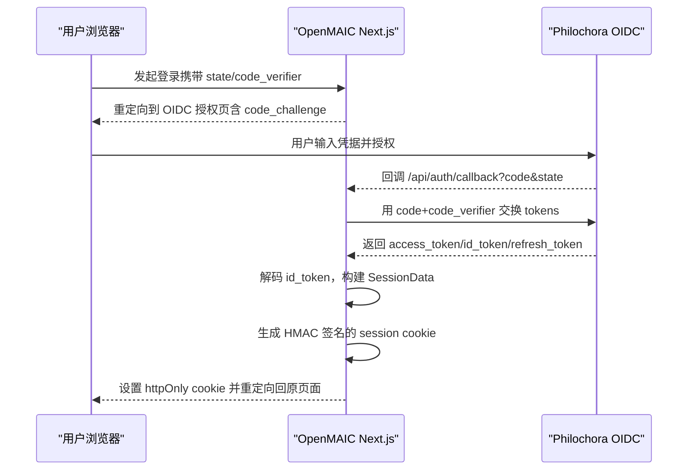
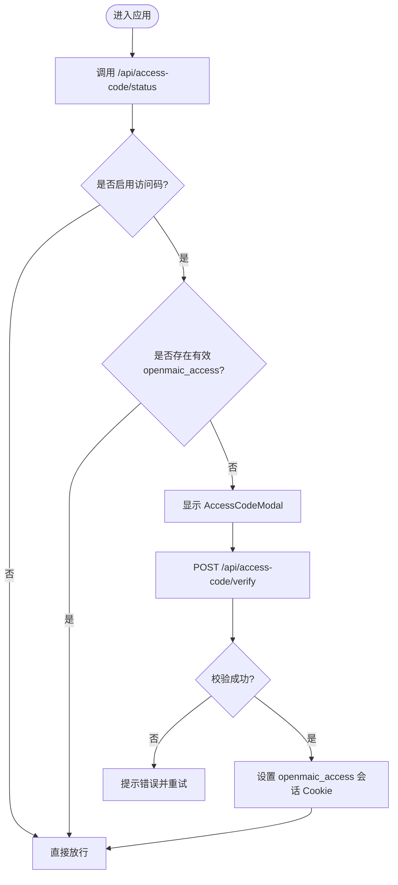
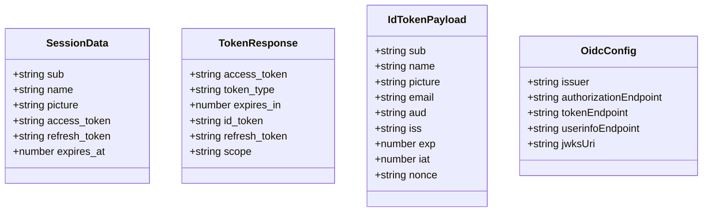

# OAuth 2.0 认证系统

<cite>
**本文引用的文件**   
- [app/api/auth/callback/route.ts](file://app/api/auth/callback/route.ts)
- [lib/server/oauth-client.ts](file://lib/server/oauth-client.ts)
- [lib/server/oauth-config.ts](file://lib/server/oauth-config.ts)
- [lib/server/session-cookie.ts](file://lib/server/session-cookie.ts)
- [app/api/access-code/status/route.ts](file://app/api/access-code/status/route.ts)
- [app/api/access-code/verify/route.ts](file://app/api/access-code/verify/route.ts)
- [lib/server/access-token.ts](file://lib/server/access-token.ts)
- [components/access-code-guard.tsx](file://components/access-code-guard.tsx)
- [components/access-code-modal.tsx](file://components/access-code-modal.tsx)
</cite>

## 产品概述
本系统为 OpenMAIC 的 OAuth 2.0 认证子系统，基于 Authorization Code + PKCE 流程与 OIDC Discovery，完成用户登录、会话建立与访问控制。核心能力包括：
- 通过 Philochora OIDC 服务进行授权码交换，获取 access_token、id_token、refresh_token
- 使用 HMAC-SHA256 签名会话 Cookie，在 Edge/Node 双环境兼容验证
- 提供“访问码”模式作为轻量级鉴权补充（适用于无 OIDC 或快速部署场景）
- 前端根据后端状态动态展示访问码弹窗并维持登录态

适用场景：
- 面向教师/讲师的课件生成与课堂互动平台
- 需要统一身份认证与跨端会话保持的 Web 应用
- 需要快速部署且可配置外部 OIDC 提供商的系统

## 核心业务流程
本节描述两种主要认证路径：OAuth 2.0 授权码流程与访问码流程。

**图表来源** 
- [app/api/auth/callback/route.ts:1-117](file://app/api/auth/callback/route.ts#L1-L117)
- [lib/server/oauth-client.ts:1-130](file://lib/server/oauth-client.ts#L1-L130)
- [lib/server/oauth-config.ts:1-81](file://lib/server/oauth-config.ts#L1-L81)
- [lib/server/session-cookie.ts:1-109](file://lib/server/session-cookie.ts#L1-L109)

**图表来源** 
- [components/access-code-guard.tsx:1-53](file://components/access-code-guard.tsx#L1-L53)
- [components/access-code-modal.tsx:1-199](file://components/access-code-modal.tsx#L1-L199)
- [app/api/access-code/status/route.ts:1-17](file://app/api/access-code/status/route.ts#L1-L17)
- [app/api/access-code/verify/route.ts:1-41](file://app/api/access-code/verify/route.ts#L1-L41)
- [lib/server/access-token.ts:1-26](file://lib/server/access-token.ts#L1-L26)

**章节来源**
- [app/api/auth/callback/route.ts:1-117](file://app/api/auth/callback/route.ts#L1-L117)
- [lib/server/oauth-client.ts:1-130](file://lib/server/oauth-client.ts#L1-L130)
- [lib/server/oauth-config.ts:1-81](file://lib/server/oauth-config.ts#L1-L81)
- [lib/server/session-cookie.ts:1-109](file://lib/server/session-cookie.ts#L1-L109)
- [components/access-code-guard.tsx:1-53](file://components/access-code-guard.tsx#L1-L53)
- [components/access-code-modal.tsx:1-199](file://components/access-code-modal.tsx#L1-L199)
- [app/api/access-code/status/route.ts:1-17](file://app/api/access-code/status/route.ts#L1-L17)
- [app/api/access-code/verify/route.ts:1-41](file://app/api/access-code/verify/route.ts#L1-L41)
- [lib/server/access-token.ts:1-26](file://lib/server/access-token.ts#L1-L26)

## 功能模块清单
- OAuth 客户端工具（PKCE、State、Token 交换、JWT 解码、授权 URL 构建）
  - 职责：实现标准 OAuth 2.0 安全增强（PKCE）、CSRF 防护（state）、令牌交换与用户信息提取
  - 验收要点：code_verifier/challenge 生成符合规范；state 随机性；token 交换成功时返回完整字段；JWT 解码仅用于 payload 提取
- OIDC 配置发现与回退
  - 职责：从 /.well-known/openid-configuration 拉取端点，失败则回退环境变量构造默认端点；缓存配置减少请求
  - 验收要点：生产环境缓存生效；环境变量覆盖正确；回调地址拼接正确
- 会话 Cookie 签名与验证
  - 职责：服务端签名（Node crypto），Edge 兼容验证（Web Crypto API）；包含过期时间校验与必填字段检查
  - 验收要点：签名算法一致；HMAC 比较安全；过期判断准确；子域/路径/SameSite 策略合理
- 访问码鉴权（可选）
  - 职责：前端检测状态并弹出模态框；后端常量时间比较访问码；成功后下发短期访问令牌 Cookie
  - 验收要点：timingSafeEqual 防时序攻击；Cookie 安全属性正确；前端默认安全策略（失败即视为需认证）

**章节来源**
- [lib/server/oauth-client.ts:1-130](file://lib/server/oauth-client.ts#L1-L130)
- [lib/server/oauth-config.ts:1-81](file://lib/server/oauth-config.ts#L1-L81)
- [lib/server/session-cookie.ts:1-109](file://lib/server/session-cookie.ts#L1-L109)
- [app/api/access-code/status/route.ts:1-17](file://app/api/access-code/status/route.ts#L1-L17)
- [app/api/access-code/verify/route.ts:1-41](file://app/api/access-code/verify/route.ts#L1-L41)
- [lib/server/access-token.ts:1-26](file://lib/server/access-token.ts#L1-L26)
- [components/access-code-guard.tsx:1-53](file://components/access-code-guard.tsx#L1-L53)
- [components/access-code-modal.tsx:1-199](file://components/access-code-modal.tsx#L1-L199)

## 数据与状态
- 会话数据结构（SessionData）
  - 字段：sub、name、picture、access_token、refresh_token、expires_at
  - 作用：承载用户标识、头像、令牌及过期时间，用于后续 API 调用与刷新
- Cookie 命名与安全属性
  - 会话 Cookie：openmaic_session（httpOnly、secure 在生产启用、sameSite=lax、path=/、maxAge=30天）
  - 临时 OAuth Cookie：oauth_state、oauth_code_verifier、oauth_return_to（一次性，完成后清空）
  - 访问码令牌：openmaic_access（httpOnly、sameSite=lax、path=/、maxAge=7天）
- 配置与密钥
  - OIDC 发现端点：OAUTH_ISSUER/.well-known/openid-configuration
  - Client 凭据：OAUTH_CLIENT_ID、OAUTH_CLIENT_SECRET
  - 回调地址：NEXT_PUBLIC_APP_URL 或 OAUTH_REDIRECT_URI
  - 会话密钥：OPENMAIC_SESSION_SECRET 或 ACCESS_CODE 或开发默认值

**图表来源** 
- [lib/server/session-cookie.ts:15-22](file://lib/server/session-cookie.ts#L15-L22)
- [lib/server/oauth-client.ts:34-53](file://lib/server/oauth-client.ts#L34-L53)
- [lib/server/oauth-config.ts:11-17](file://lib/server/oauth-config.ts#L11-L17)

**章节来源**
- [lib/server/session-cookie.ts:15-22](file://lib/server/session-cookie.ts#L15-L22)
- [lib/server/oauth-client.ts:34-53](file://lib/server/oauth-client.ts#L34-L53)
- [lib/server/oauth-config.ts:11-17](file://lib/server/oauth-config.ts#L11-L17)

## 关键约束与边界
- 安全约束
  - 必须使用 PKCE（S256）与随机 state 防止 CSRF 与授权码泄露
  - JWT 签名由上游 OIDC 保证，本侧仅做 payload 解码
  - 会话 Cookie 使用 HMAC-SHA256 签名，Edge/Node 两端一致性验证
  - 访问码校验采用常量时间比较，避免时序攻击
- 依赖与集成边界
  - 依赖 Philochora OIDC 服务的 discovery 端点；若不可用则回退环境变量
  - 回调地址需与 OIDC 注册一致；支持同域与子路径部署
- 业务约束
  - 访问码模式为可选开关，未启用时不强制认证
  - 会话有效期由 expires_at 控制，过期后需重新登录或刷新令牌
  - 生产环境建议开启 secure Cookie 与 SameSite=Lax

**章节来源**
- [lib/server/oauth-client.ts:10-23](file://lib/server/oauth-client.ts#L10-L23)
- [lib/server/oauth-client.ts:92-101](file://lib/server/oauth-client.ts#L92-L101)
- [lib/server/session-cookie.ts:70-99](file://lib/server/session-cookie.ts#L70-L99)
- [lib/server/access-token.ts:10-25](file://lib/server/access-token.ts#L10-L25)
- [lib/server/oauth-config.ts:25-60](file://lib/server/oauth-config.ts#L25-L60)