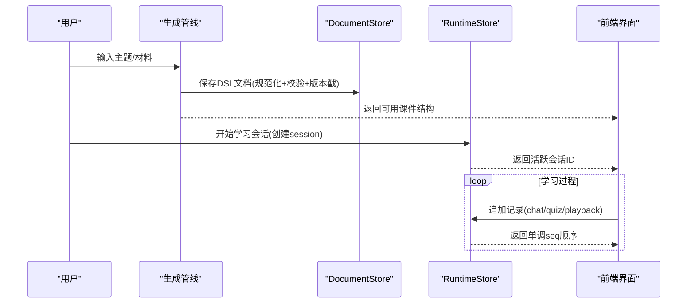
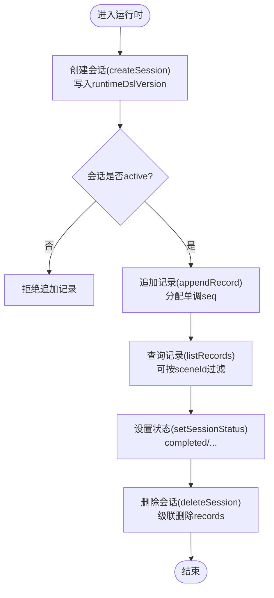
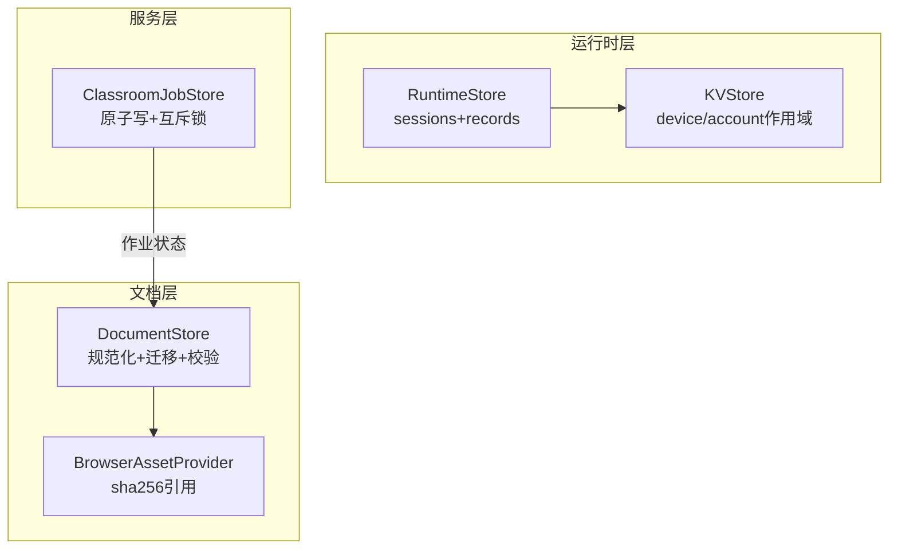
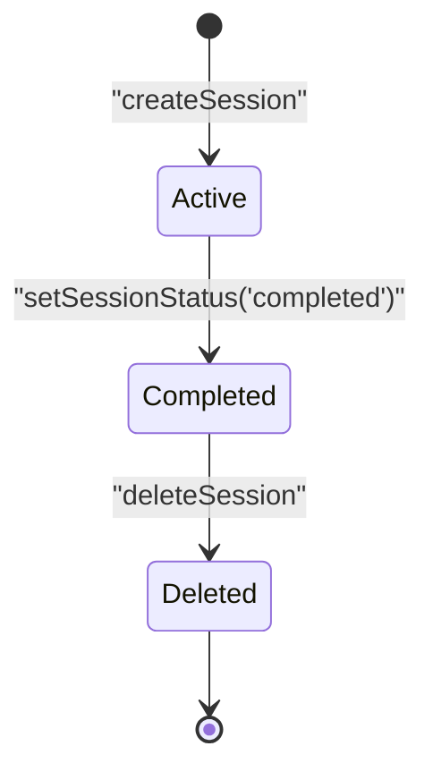

# 数据流设计

<cite>
**本文引用的文件**   
- [packages/@openmaic/storage/README.md](file://packages/@openmaic/storage/README.md)
- [packages/@openmaic/storage/src/runtime/browser.ts](file://packages/@openmaic/storage/src/runtime/browser.ts)
- [packages/@openmaic/storage/test/runtime-contract.ts](file://packages/@openmaic/storage/test/runtime-contract.ts)
- [lib/server/classroom-job-store.ts](file://lib/server/classroom-job-store.ts)
- [lib/generation/generation-pipeline.ts](file://lib/generation/generation-pipeline.ts)
- [components/chat/use-chat-sessions.ts](file://components/chat/use-chat-sessions.ts)
- [components/scene-renderers/pbl/v2/use-instructor-stream.ts](file://components/scene-renderers/pbl/v2/use-instructor-stream.ts)
- [tests/pbl/v2/drain.test.ts](file://tests/pbl/v2/drain.test.ts)
</cite>

## 产品概述
OpenMAIC 是一个 AI 驱动的交互式课件（MAIC）生成与课堂管理平台，支持通过自然语言生成结构化课件、课堂实时互动（问答/讨论/测验）、课件编辑与回放。前端基于 Next.js + React + Zustand；AI 编排层使用 LangGraph + Vercel AI SDK；课件格式为自定义 DSL。核心业务模块位于 lib/ 目录：orchestration（AI 编排）、generation（课件生成）、playback（课堂回放）、agent（智能体）、classroom（课堂管理）、edit（编辑器）、export（导出 PPTX/PDF）。持久化层由 @openmaic/storage 提供可插拔后端（浏览器 IndexedDB 默认，后续扩展 HTTP 后端），文档与运行时数据分离存储，确保类型安全、迁移与一致性。

## 核心业务流程
- 课件生成流水线：两阶段生成（大纲 → 场景内容/动作），产出 DSL 文档并写入 DocumentStore。
- 课堂运行期：每个学习者以会话为单位产生追加式记录（聊天、测验尝试、回放事实），写入 RuntimeStore。
- 跨组件共享：Zustand 状态与 IndexedDB 持久化通过 KVStore 适配，保证设备级与账户级数据边界清晰。
- 协作与同步：服务端作业存储用于课堂生成任务的状态追踪与进度上报，前端通过流式接口驱动 UI 更新。

图表来源
- [lib/generation/generation-pipeline.ts:1-48](file://lib/generation/generation-pipeline.ts#L1-L48)
- [packages/@openmaic/storage/README.md:30-53](file://packages/@openmaic/storage/README.md#L30-L53)
- [packages/@openmaic/storage/src/runtime/browser.ts:1-38](file://packages/@openmaic/storage/src/runtime/browser.ts#L1-L38)

章节来源
- [lib/generation/generation-pipeline.ts:1-48](file://lib/generation/generation-pipeline.ts#L1-L48)
- [packages/@openmaic/storage/README.md:30-72](file://packages/@openmaic/storage/README.md#L30-L72)

## 功能模块清单
- 文档持久化（DocumentStore）
  - 职责：持久化 DSL 文档（stage/scenes/embedded agents/quiz/actions + outline 快照），规范化存储、读取时迁移、写入时校验。
  - 验收要点：按实体行存储、scene 级别写入高效、dslVersion 戳记、outline 原样携带。
- 运行时持久化（RuntimeStore）
  - 职责：按 (stageId, learnerKey) 分区，维护 sessions + append-only records（chat/quizAttempt/playback等），单调 seq 排序，payload 按 kind 校验。
  - 验收要点：会话 born stamped、记录不可变追加、合并学习者键、级联删除。
- 资产提供者（StorageProvider/BrowserAssetProvider）
  - 职责：内容寻址的 blob 引用（sha256-<hex>），put/resolve/remove 接口，渲染时解析 URL。
  - 验收要点：去重稳定引用、不绑定 provider/expiry。
- KVStore 与 Zustand 适配
  - 职责：device/account 作用域小值存储，kvPersistStorage 将 KVStore 适配为 zustand persist 存储。
  - 验收要点：作用域语义在底层实现中强制，跨端行为一致。
- 课堂生成作业存储（Classroom Job Store）
  - 职责：以 JSON 文件原子写的方式维护生成任务状态、进度、结果，支持并发锁与过期清理。
  - 验收要点：幂等标记 running/succeeded/failed、超时 stale 处理、进度增量更新。

章节来源
- [packages/@openmaic/storage/README.md:25-72](file://packages/@openmaic/storage/README.md#L25-L72)
- [lib/server/classroom-job-store.ts:57-224](file://lib/server/classroom-job-store.ts#L57-L224)

## 数据与状态
- 核心数据模型
  - 文档模型：Stage + Scenes + Embedded Agents/Quiz/Actions + Outline Snapshot，带 dslVersion 戳记。
  - 运行时模型：Session（born stamped runtimeDslVersion）+ Records（append-only，单调 seq，kind 校验）。
  - 资产模型：Content-addressed 引用 sha256-<hex>，provider 透明解析。
- 关键状态流转
  - 文档：生成后写入 DocumentStore，读取时执行 DSL 迁移，写入时通过 validateStage/validateScene 校验。
  - 运行时：createSession → appendRecord（active session）→ listRecords（可选 sceneId 锚定）→ setSessionStatus → deleteSession。
  - 作业：markRunning → updateProgress → markSucceeded/Failed，含 stale 检测。
- 数据所有权边界
  - device 作用域：本地偏好（主题/语言/布局）不出设备。
  - account 作用域：用户数据可在多设备间同步（未来 HTTP 后端）。
  - 运行时按 stageId + learnerKey 分区，无全局列表，避免越权访问。

图表来源
- [packages/@openmaic/storage/src/runtime/browser.ts:1-38](file://packages/@openmaic/storage/src/runtime/browser.ts#L1-L38)
- [packages/@openmaic/storage/test/runtime-contract.ts:91-158](file://packages/@openmaic/storage/test/runtime-contract.ts#L91-L158)

章节来源
- [packages/@openmaic/storage/README.md:33-72](file://packages/@openmaic/storage/README.md#L33-L72)
- [packages/@openmaic/storage/test/runtime-contract.ts:91-258](file://packages/@openmaic/storage/test/runtime-contract.ts#L91-L258)

## 关键约束与边界
- 类型安全与验证
  - 文档写入通过 DSL gate（validateStage/validateScene）失败即报错。
  - 运行时记录 payload 按 kind 注入校验器（chat/quizAttempt 默认骨架守卫）。
  - 会话 born stamped，未带 runtimeDslVersion 的行直接失败。
- 数据一致性
  - 记录追加顺序以单调 seq 为准，非时间戳。
  - 作业存储使用 per-job 互斥锁与原子写，避免竞态。
  - 运行时维护 exclusive lock 保障 drain 期间的数据一致性。
- 性能优化
  - 文档规范化：scene 级别写入低成本，读取时重组。
  - 资产去重：sha256 引用避免重复存储。
  - 运行时分区：按 stageId + learnerKey 隔离，减少扫描范围。
- 错误恢复
  - 过时作业自动标记 failed（30分钟无更新）。
  - 流式处理异常捕获并回退到初始项目状态。
  - 测试覆盖合同契约，确保后端等价性。

图表来源
- [packages/@openmaic/storage/README.md:25-53](file://packages/@openmaic/storage/README.md#L25-L53)
- [lib/server/classroom-job-store.ts:57-224](file://lib/server/classroom-job-store.ts#L57-L224)

章节来源
- [packages/@openmaic/storage/README.md:33-72](file://packages/@openmaic/storage/README.md#L33-L72)
- [lib/server/classroom-job-store.ts:57-224](file://lib/server/classroom-job-store.ts#L57-L224)
- [components/scene-renderers/pbl/v2/use-instructor-stream.ts:126-276](file://components/scene-renderers/pbl/v2/use-instructor-stream.ts#L126-L276)
- [tests/pbl/v2/drain.test.ts:865-909](file://tests/pbl/v2/drain.test.ts#L865-L909)

## 数据流图、状态转换图与缓存策略说明
- 数据流图（端到端）
  - 生成管线产出 DSL → DocumentStore 持久化 → 前端加载 → 运行时会话建立 → 追加记录 → 回放/评估消费。
- 状态转换图（运行时会话）
  - active → completed（setSessionStatus）→ deleted（deleteSession）
- 缓存策略
  - KVStore 作为 Zustand persist 后端，device 作用域本地缓存，account 作用域预留同步。
  - AssetProvider 内容寻址去重，避免重复 I/O。
  - RuntimeStore 分区隔离，减少不必要扫描。

图表来源
- [packages/@openmaic/storage/test/runtime-contract.ts:130-145](file://packages/@openmaic/storage/test/runtime-contract.ts#L130-L145)

章节来源
- [lib/generation/generation-pipeline.ts:1-48](file://lib/generation/generation-pipeline.ts#L1-L48)
- [components/chat/use-chat-sessions.ts:438-470](file://components/chat/use-chat-sessions.ts#L438-L470)
- [components/scene-renderers/pbl/v2/use-instructor-stream.ts:126-276](file://components/scene-renderers/pbl/v2/use-instructor-stream.ts#L126-L276)
- [packages/@openmaic/storage/README.md:33-72](file://packages/@openmaic/storage/README.md#L33-L72)