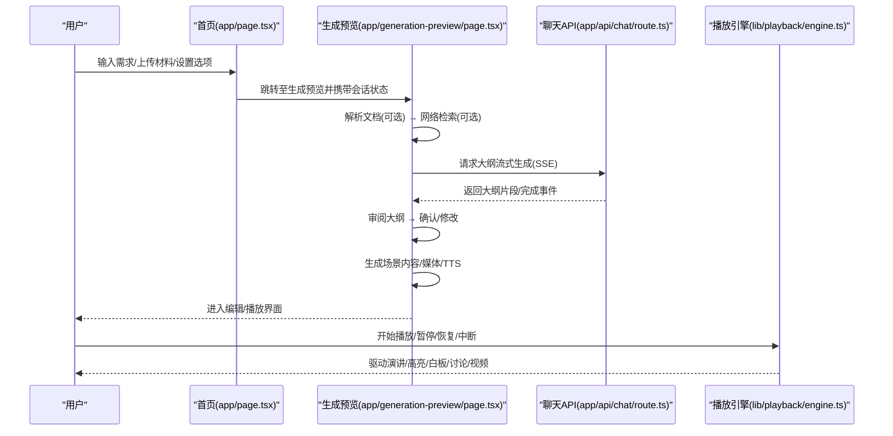
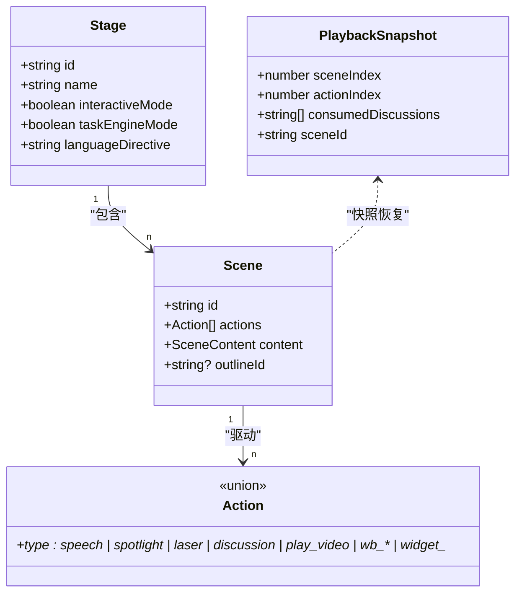
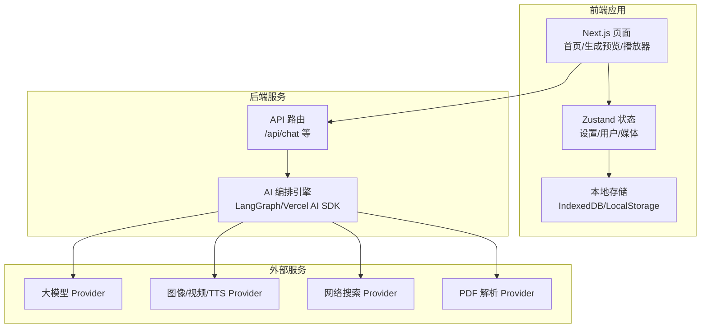
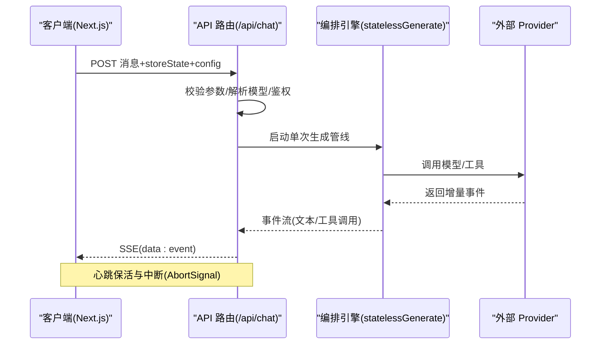
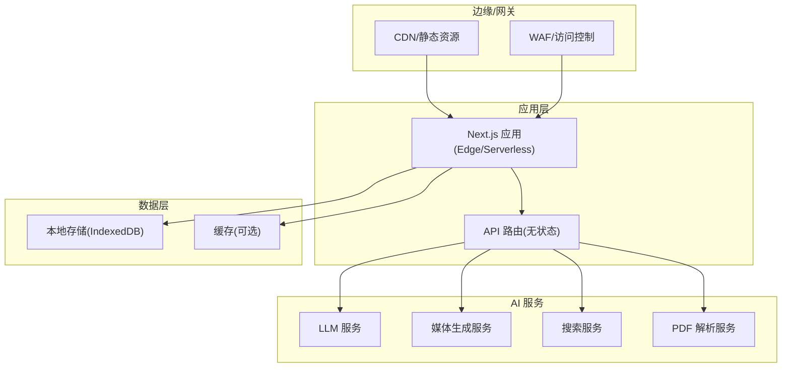

# 整体架构概览

<cite>
**本文引用的文件**   
- [app/page.tsx](file://app/page.tsx)
- [app/layout.tsx](file://app/layout.tsx)
- [app/generation-preview/page.tsx](file://app/generation-preview/page.tsx)
- [app/api/chat/route.ts](file://app/api/chat/route.ts)
- [lib/playback/engine.ts](file://lib/playback/engine.ts)
- [lib/types/stage.ts](file://lib/types/stage.ts)
</cite>

## 产品概述
OpenMAIC 是一个 AI 驱动的交互式课件（MAIC）生成与课堂管理平台。核心目标是通过自然语言快速生成结构化课件，并在课堂上实现实时互动（问答、讨论、测验），同时提供强大的编辑与回放能力。系统采用前端 Next.js + React 的现代化 Web 应用形态，结合后端 API 路由与 AI 编排引擎，形成“生成—编辑—播放”的一体化体验。

- 项目定位：面向教师与培训讲师的 AI 课件生成与课堂互动平台
- 核心价值：以自然语言驱动课件生成，降低内容制作门槛；通过多智能体编排提升教学互动性；支持编辑与回放闭环
- 适用场景：课程大纲到课件的快速生成、课堂实时问答与讨论、交互式练习与评测、PPT/文档导入与二次编辑

## 核心业务流程
OpenMAIC 的核心业务链路围绕“需求输入 → 素材解析 → 大纲生成 → 内容生成 → 编辑预览 → 课堂播放/互动”展开。关键交互节点如下：

- 首页需求输入与配置：用户在首页输入需求、选择是否启用网页搜索、交互模式等，并可选择上传 PDF 等课程材料
- 生成预览流程：进入生成预览页，按步骤执行文档解析、可选网络检索、大纲流式生成与审阅、内容与媒体生成、TTS 合成等
- 课堂播放与互动：播放引擎基于动作序列驱动演讲、高亮、白板、视频与讨论事件，支持用户中断与实时对话

**图表来源** 
- [app/page.tsx](file://app/page.tsx)
- [app/generation-preview/page.tsx](file://app/generation-preview/page.tsx)
- [app/api/chat/route.ts](file://app/api/chat/route.ts)
- [lib/playback/engine.ts](file://lib/playback/engine.ts)

**章节来源**
- [app/page.tsx](file://app/page.tsx)
- [app/generation-preview/page.tsx](file://app/generation-preview/page.tsx)
- [app/api/chat/route.ts](file://app/api/chat/route.ts)
- [lib/playback/engine.ts](file://lib/playback/engine.ts)

## 功能模块清单
- 前端 Next.js 应用
  - 职责：页面路由、用户交互、状态管理、媒体与渲染集成、国际化与主题
  - 验收要点：首页需求输入与配置、生成预览流程、播放器与编辑器 UI、设置与提供者配置
- 后端 API 路由
  - 职责：无状态聊天接口、SSE 流式响应、模型与密钥解析、错误处理与心跳保活
  - 验收要点：请求校验、SSE 事件流、中断与重试、鉴权与限流
- AI 编排引擎
  - 职责：LangGraph + Vercel AI SDK 驱动的单次生成管线、工具调用与事件分发
  - 验收要点：可插拔 Provider、Thinking 模式控制、事件类型完备性
- 课件生成系统
  - 职责：文档解析、网络检索、大纲生成、场景内容构建、媒体与 TTS 合成
  - 验收要点：流式输出、截断告警、图片映射与存储、任务引擎模式推断
- 播放引擎
  - 职责：统一的状态机驱动 Action 执行、音频/TTS/视频调度、讨论触发与恢复
  - 验收要点：idle/playing/paused/live 状态转换、进度快照与恢复、白板和效果联动

**章节来源**
- [app/layout.tsx](file://app/layout.tsx)
- [app/api/chat/route.ts](file://app/api/chat/route.ts)
- [app/generation-preview/page.tsx](file://app/generation-preview/page.tsx)
- [lib/playback/engine.ts](file://lib/playback/engine.ts)

## 数据与状态
- 核心数据模型
  - Stage/Scene/Action：由 @openmaic/dsl 定义通用骨架，应用层扩展为 AppScene（包含 Slide/Quiz/Interactive/PBL 内容）
  - Session 状态：generationSession 保存需求、PDF 文本/图像、大纲、任务引擎模式等
  - 播放快照：sceneIndex/actionIndex/consumedDiscussions/sceneId 用于恢复播放位置
- 关键状态流转
  - 生成阶段：preparing → outline/streaming → review → generating-content → complete
  - 播放阶段：idle → playing → paused/live → idle（讨论结束或用户中断后恢复）
- 数据所有权边界
  - 前端负责 IndexedDB/LocalStorage 持久化与媒体 URL 生命周期管理
  - 后端保持无状态，仅处理请求与事件流，不维护会话
  - DSL 作为跨模块契约，确保生成与播放的数据一致性

**图表来源** 
- [lib/types/stage.ts](file://lib/types/stage.ts)
- [lib/playback/engine.ts](file://lib/playback/engine.ts)

**章节来源**
- [lib/types/stage.ts](file://lib/types/stage.ts)
- [lib/playback/engine.ts](file://lib/playback/engine.ts)

## 关键约束与边界
- 非功能性需求
  - 性能：SSE 心跳保活、流式输出、异步中断（AbortController）、阅读时长估算避免阻塞
  - 安全：Provider 密钥透传与校验、访问码守卫、最小权限原则（仅必要字段入参）
  - 可用性：错误分类与友好提示、自动重试与降级（浏览器原生 TTS）、离线草稿缓存
- 依赖与集成边界
  - 外部 Provider：LLM、图像、视频、TTS、PDF 解析、网络搜索等通过配置注入
  - 运行时环境：Next.js 服务端/客户端协同，IndexedDB 本地存储，Web Speech API 原生 TTS
- 业务约束
  - 文档包大小与数量限制、视觉图像上限、截断告警
  - 交互模式与职教任务模式的开关控制
  - 播放引擎对未知 Action 的容错跳过

**章节来源**
- [app/generation-preview/page.tsx](file://app/generation-preview/page.tsx)
- [app/api/chat/route.ts](file://app/api/chat/route.ts)
- [lib/playback/engine.ts](file://lib/playback/engine.ts)

## 架构决策权衡与扩展性考虑
- 技术栈选型理由
  - Next.js + React：SSR/CSR 灵活切换，组件化生态成熟，便于复杂交互与状态管理
  - LangGraph + Vercel AI SDK：声明式编排与流式事件，适配多 Provider 与工具调用
  - @openmaic/dsl：解耦生成与播放，保证数据结构稳定与演进兼容
- 架构决策权衡
  - 无状态 API：简化部署与水平扩展，但需客户端承担中断与重试逻辑
  - 流式 SSE：提升首屏与交互体验，但需处理心跳、超时与错误事件
  - 本地持久化：增强可用性与离线能力，但需处理版本迁移与冲突合并
- 扩展性考虑
  - Provider 插件化：新增 LLM/图像/视频/TTS/搜索等只需配置与校验
  - Action 扩展：播放引擎对未知 Action 容错，新增动作无需改动核心状态机
  - 内容类型扩展：DSL 契约稳定，应用层可扩展 Interactive/PBL 等场景

## 系统上下文图

[本图为概念性架构图，不直接映射具体源码文件]

## 组件交互图

**图表来源** 
- [app/api/chat/route.ts](file://app/api/chat/route.ts)

**章节来源**
- [app/api/chat/route.ts](file://app/api/chat/route.ts)

## 部署架构图

[本图为概念性部署图，不直接映射具体源码文件]

## 性能优化策略
- 前端
  - 流式渲染与懒加载：大纲/内容分片渲染，减少首屏压力
  - 媒体去重与对象 URL 回收：避免内存泄漏与跨课程污染
  - 本地缓存与草稿：localStorage/IndexedDB 持久化，提升可用性
- 后端
  - SSE 心跳保活：防止代理/浏览器关闭空闲连接
  - 中断传播：利用 AbortSignal 快速释放资源
  - 错误分类与降级：401/429/5xx 区分处理，必要时回退到浏览器原生 TTS

**章节来源**
- [app/generation-preview/page.tsx](file://app/generation-preview/page.tsx)
- [app/api/chat/route.ts](file://app/api/chat/route.ts)
- [lib/playback/engine.ts](file://lib/playback/engine.ts)

## 安全考虑
- 鉴权与密钥管理：Provider 密钥通过请求头传递，服务端校验必填项与有效性
- 访问码守卫：全局 AccessCodeGuard 控制访问权限
- 最小权限原则：仅暴露必要字段与接口，避免敏感信息泄露
- 输入校验与错误处理：严格校验请求体，返回标准化错误事件

**章节来源**
- [app/layout.tsx](file://app/layout.tsx)
- [app/api/chat/route.ts](file://app/api/chat/route.ts)

## 监控方案
- 日志记录：创建 Logger 实例，记录关键路径与错误堆栈
- 指标采集：SSE 心跳、请求耗时、错误率、Provider 调用成功率
- 健康检查：/health 端点用于存活探测与依赖检查
- 告警策略：阈值触发（如 5xx 比例、延迟 P95）与通知渠道

**章节来源**
- [app/api/chat/route.ts](file://app/api/chat/route.ts)

## 结论
OpenMAIC 通过清晰的模块划分与数据契约，实现了从自然语言到课件生成的端到端闭环。前端 Next.js 应用提供流畅的用户体验，后端 API 路由保持无状态与高扩展性，AI 编排引擎支撑多 Provider 与工具调用，播放引擎确保稳定的课堂回放与互动。系统在性能、安全与可观测性方面均有完善设计，具备良好的扩展性与可维护性。