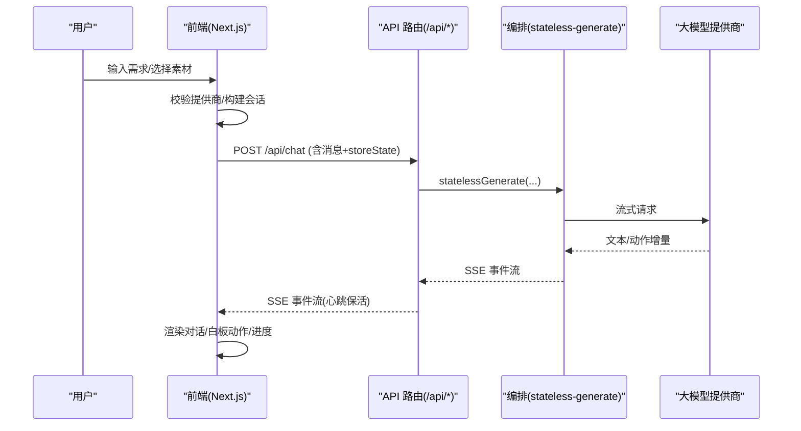
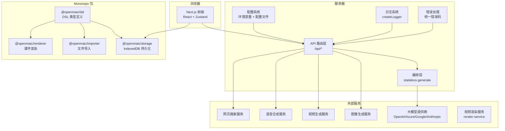
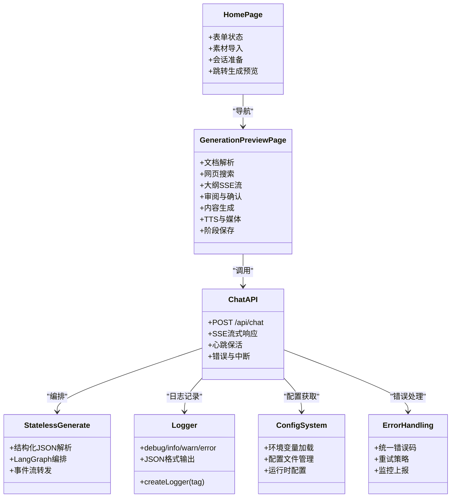

# 架构设计

<cite>
**本文引用的文件**   
- [package.json](file://package.json)
- [next.config.ts](file://next.config.ts)
- [app/layout.tsx](file://app/layout.tsx)
- [app/page.tsx](file://app/page.tsx)
- [app/generation-preview/page.tsx](file://app/generation-preview/page.tsx)
- [app/api/chat/route.ts](file://app/api/chat/route.ts)
- [lib/orchestration/stateless-generate.ts](file://lib/orchestration/stateless-generate.ts)
- [lib/logger.ts](file://lib/logger.ts)
- [pnpm-workspace.yaml](file://pnpm-workspace.yaml)
- [packages/@openmaic/dsl/README.md](file://packages/@openmaic/dsl/README.md)
- [packages/@openmaic/storage/README.md](file://packages/@openmaic/storage/README.md)
- [docker-compose.yml](file://docker-compose.yml)
</cite>

## 更新摘要
**所做更改**   
- 重新组织了知识维基结构，新增专门章节：OpenMAIC 根应用、配置系统、Monorepo 依赖管理、日志系统和错误处理系统
- 更新了模块层次结构以更好地反映项目架构
- 增强了内部子包（@openmaic/*）的文档说明
- 完善了系统边界和组件交互关系描述

## 产品概述
OpenMAIC 是一个 AI 驱动的交互式课件（MAIC）生成与课堂管理平台。核心目标是通过自然语言快速生成结构化课件，并在课堂中实现实时互动（问答、讨论、测验）、课件编辑与回放。系统采用前后端分离的 Next.js 应用形态：前端基于 React + Zustand 状态管理，后端通过 API 路由层调用 AI 编排层（LangGraph + Vercel AI SDK），课件格式使用自定义 DSL（@openmaic/dsl）。内部子包提供 DSL 定义、IndexedDB 持久化、PPTX/MAIC 导入与课件渲染引擎等能力。

适用场景包括：教师或学习者上传 PDF/PPTX 等素材后一键生成课件；在课堂中进行多智能体协作教学；对生成的课件进行编辑、预览与导出（PPTX/PDF）。

## 核心业务流程
- 首页输入需求与素材，校验可用模型与提供商，准备会话数据并跳转至生成预览页。
- 生成预览页按步骤执行：文档解析（可选）、网络搜索（可选）、大纲流式生成（SSE）、大纲审阅与确认、内容生成、TTS 生成、媒体资源处理、阶段保存。
- 聊天交互走无状态 API：客户端发送完整消息与存储状态，服务端单遍生成并通过 SSE 返回事件流（文本增量与工具调用），支持心跳保活与中断。



**图表来源** 
- [app/page.tsx](file://app/page.tsx)
- [app/generation-preview/page.tsx](file://app/generation-preview/page.tsx)
- [app/api/chat/route.ts](file://app/api/chat/route.ts)
- [lib/orchestration/stateless-generate.ts](file://lib/orchestration/stateless-generate.ts)

## OpenMAIC 根应用架构
OpenMAIC 根应用基于 Next.js 16.1.2 构建，采用 App Router 模式组织页面和 API 路由。应用结构清晰分层：

### 应用目录结构
- **app/** - Next.js 应用入口，包含页面路由和 API 路由
- **components/** - React UI 组件库，按功能模块组织
- **lib/** - 核心业务逻辑模块，按领域划分
- **packages/** - Monorepo 内部子包，提供可复用能力
- **configs/** - 共享配置常量（主题、字体、快捷键等）
- **public/** - 静态资源文件

### 技术栈选型
- **前端框架**: Next.js 16.1.2 + React 19.2.3
- **状态管理**: Zustand 5.x 用于全局状态管理
- **AI 集成**: Vercel AI SDK 6.x + LangChain/LangGraph 1.x
- **样式方案**: Tailwind CSS 4.x + shadcn/ui 组件库
- **开发工具**: pnpm 包管理器 + TypeScript 5.x

**章节来源**
- [package.json:103-143](file://package.json#L103-L143)
- [pnpm-workspace.yaml:1-5](file://pnpm-workspace.yaml#L1-L5)

## 配置系统
OpenMAIC 采用多层次配置管理策略，支持环境变量、配置文件和运行时配置：

### 环境变量配置
- **AI 提供商配置**: OPENAI_API_KEY, ANTHROPIC_API_KEY, AZURE_OPENAI_API_KEY 等
- **媒体服务配置**: IMAGE_*_BASE_URL, TTS_*_BASE_URL, ASR_*_BASE_URL
- **功能开关**: ACCESS_CODE（站点访问密码）、RENDER_SERVICE_URL（视频渲染服务）
- **调试配置**: LOG_LEVEL（日志级别）、LOG_FORMAT（日志格式）

### 配置文件管理
- **server-providers.yml**: 服务器端提供商配置，支持动态加载
- **next.config.ts**: Next.js 应用配置，basePath 支持子路径部署
- **ecosystem.dev.config.cjs**: PM2 进程管理配置

### 运行时配置
- **Provider 抽象层**: 统一的 AI、图像、视频、TTS、网页搜索提供商接口
- **配置验证**: 启动时验证必需配置项，失败时提供清晰的错误信息
- **热重载支持**: 开发模式下配置变更无需重启应用

**章节来源**
- [next.config.ts](file://next.config.ts)
- [docker-compose.yml:8-15](file://docker-compose.yml#L8-L15)

## Monorepo 依赖管理系统
项目采用 pnpm workspace 管理 Monorepo 结构，实现了清晰的依赖隔离和版本控制：

### 工作空间配置
```yaml
packages:
  - "packages/*"
  - "packages/@openmaic/*"
  - "!packages/docs" # 独立文档应用
```

### 内部子包架构
- **@openmaic/dsl**: 课件 DSL 类型定义与验证器，零运行时依赖
- **@openmaic/storage**: IndexedDB 持久化封装，支持浏览器和 Node.js
- **@openmaic/importer**: PPTX/MAIC 文件导入转换器
- **@openmaic/renderer**: 课件渲染引擎，支持多种输出格式
- **mathml2omml**: MathML 到 Office Math 公式转换工具
- **pptxgenjs**: 定制的 PowerPoint 生成库

### 依赖管理策略
- **Workspace 引用**: 使用 `workspace:*` 协议引用内部包
- **版本锁定**: pnpm-lock.yaml 确保依赖一致性
- **构建顺序**: postinstall 脚本按依赖顺序构建内部包
- **独立发布**: 每个包可独立发布到 npm

**章节来源**
- [pnpm-workspace.yaml:1-5](file://pnpm-workspace.yaml#L1-L5)
- [package.json:10](file://package.json#L10)
- [packages/@openmaic/dsl/README.md:11-21](file://packages/@openmaic/dsl/README.md#L11-L21)

## 日志系统
OpenMAIC 实现了统一、结构化的日志系统，支持多环境适配和性能优化：

### 日志级别与格式
- **级别**: debug < info < warn < error
- **格式**: 支持普通文本和 JSON 两种格式
- **标签**: 每个日志条目包含模块标签便于过滤
- **时间戳**: ISO 8601 格式的时间戳

### 日志配置
- **环境变量**: LOG_LEVEL 控制最低记录级别，LOG_FORMAT 指定输出格式
- **默认级别**: 生产环境默认为 info，开发环境可使用 debug
- **性能优化**: 低于阈值的日志直接丢弃，避免字符串拼接开销

### 使用示例
```typescript
import { createLogger } from '@/lib/logger';
const log = createLogger('ChatAPI');
log.info('Processing chat request', { userId, messageCount });
log.error('Failed to process message', error);
```

**章节来源**
- [lib/logger.ts:1-53](file://lib/logger.ts#L1-L53)

## 错误处理系统
系统采用分层错误处理策略，确保异常的可追踪性和用户体验：

### 错误分类
- **业务错误**: 用户操作相关的错误，提供友好的错误提示
- **系统错误**: 基础设施或服务不可用导致的错误
- **网络错误**: API 调用失败、超时等网络相关问题
- **数据错误**: 数据验证失败、格式不兼容等问题

### 错误处理机制
- **统一错误码**: 标准化的 HTTP 状态码和错误响应格式
- **重试策略**: 针对网络错误的自动重试和降级处理
- **监控上报**: 关键错误自动上报到监控系统
- **用户反馈**: 面向用户的错误提示和操作建议

### 异常恢复
- **优雅降级**: 功能不可用时提供替代方案
- **状态清理**: 异常发生时清理临时状态和资源
- **会话恢复**: 支持断点续传和状态恢复

## 功能模块清单
- **前端页面与组件**
  - 首页与生成预览：需求输入、素材导入、会话准备、大纲审阅与内容生成流程
  - 编辑器与回放：幻灯片编辑、白板、播放与导出
  - 设置与配置：模型/图像/视频/TTS/网页搜索等提供商配置
- **后端 API 路由层**
  - 聊天接口：无状态 SSE 流式生成，心跳保活，错误与中断处理
  - 其他业务接口：文档解析、网页搜索、TTS、图像/视频生成、导出、健康检查等
- **核心业务逻辑（lib/）**
  - orchestration：多智能体编排（LangGraph StateGraph），结构化 JSON Array 输出解析与流式处理
  - generation：课件大纲与内容生成、TTS、媒体清单构建
  - playback：课堂回放与状态同步
  - agent：智能体注册与行为定义
  - classroom：课堂生命周期管理
  - edit：编辑器状态与操作
  - export：PPTX/PDF 导出
- **内部子包（packages/@openmaic）**
  - @openmaic/dsl：课件 DSL 类型与结构定义
  - @openmaic/storage：IndexedDB 持久化封装
  - @openmaic/importer：PPTX/MAIC 导入
  - @openmaic/renderer：课件渲染引擎与字体样式

**章节来源**
- [package.json:32-143](file://package.json#L32-L143)
- [app/layout.tsx](file://app/layout.tsx)

## 数据与状态
- **会话状态**
  - 生成会话：包含需求、PDF 文本与图片、研究上下文、大纲、任务引擎模式、预览阶段等，保存在 sessionStorage
  - 聊天会话：messages + storeState（stage、scenes、currentSceneId、mode）由客户端全量提交，服务端无状态处理
- **媒体与文档**
  - 文档与图片通过 IndexedDB 持久化，生成映射关系用于后续引用
  - 媒体对象 URL 在切换课程时清理，避免跨课程缩略图污染
- **设置与配置**
  - 模型、图像、视频、TTS、网页搜索等提供商配置集中管理，运行时注入到请求头
- **状态边界**
  - 前端负责 UI 状态与本地缓存（localStorage/sessionStorage），后端仅处理单次请求的无状态生成

**章节来源**
- [app/page.tsx](file://app/page.tsx)
- [app/generation-preview/page.tsx](file://app/generation-preview/page.tsx)
- [app/api/chat/route.ts](file://app/api/chat/route.ts)

## 关键约束与边界
- **技术栈与版本**
  - Node >= 20.9.0；Next.js 16.1.2；React 19.2.3；Zustand 5.x；Vercel AI SDK 6.x；LangChain/LangGraph 1.x
  - pnpm 作为包管理器；部分原生依赖（sharp、unrs-resolver）被忽略构建
- **部署与运行**
  - standalone 输出（非 Vercel）；basePath 支持子路径部署（如 /openmaic）
  - 代理最大请求体 200MB；安全头（CSP、X-Frame-Options、HSTS 等）在生产环境启用
- **性能与可靠性**
  - SSE 心跳间隔 15 秒，防止代理/浏览器超时断开
  - 结构化输出解析采用 jsonrepair + partial-json 容错，抑制残留 JSON 片段泄露
- **安全与隐私**
  - 禁止 iframe 嵌入默认（可配置 ALLOWED_FRAME_ANCESTORS）
  - 权限策略限制摄像头、麦克风、定位等敏感能力
- **扩展性**
  - 多提供商抽象（AI/图像/视频/TTS/网页搜索）可通过配置切换
  - 编排层基于 LangGraph，便于扩展智能体与工作流节点
- **兼容性**
  - 向后兼容旧版会话字段（pdfStorageKey、imageMapping 等）
  - 子路径部署与独立运行两种模式共用同一代码库

**章节来源**
- [package.json:6-7](file://package.json#L6-L7)
- [next.config.ts](file://next.config.ts)
- [lib/orchestration/stateless-generate.ts](file://lib/orchestration/stateless-generate.ts)

## 系统上下文图


**图表来源** 
- [app/layout.tsx](file://app/layout.tsx)
- [app/api/chat/route.ts](file://app/api/chat/route.ts)
- [lib/logger.ts](file://lib/logger.ts)
- [packages/@openmaic/dsl/README.md](file://packages/@openmaic/dsl/README.md)
- [packages/@openmaic/storage/README.md](file://packages/@openmaic/storage/README.md)

## 组件分解图


**图表来源** 
- [app/page.tsx](file://app/page.tsx)
- [app/generation-preview/page.tsx](file://app/generation-preview/page.tsx)
- [app/api/chat/route.ts](file://app/api/chat/route.ts)
- [lib/logger.ts](file://lib/logger.ts)

## 详细组件分析
### 前端根布局与全局初始化
- 主题与国际化提供者、访问码守卫、Toaster 通知等在全局布局中挂载
- 字体与动画样式引入，确保渲染一致性
- 全局错误边界和加载状态管理

### 首页与生成入口
- 收集需求、素材、选项（网页搜索、交互模式、职教测试模式）
- 校验可用模型与提供商，准备会话数据并跳转到生成预览页
- 管理最近教室列表、缩略图、搜索与删除重命名等操作

### 生成预览流程
- 加载/恢复会话，清理旧图片，校验文档数量与大小限制
- 可选文档解析（支持多种提供商参数），构建文档束与图片映射
- 可选网页搜索，获取研究上下文与来源
- 大纲生成（SSE），支持重试、自动继续与人工审阅
- 创建阶段（Stage），保存语言指令与课程标题，进入内容生成
- 智能体生成（根据设置自动或手动），TTS 生成与媒体清单构建

### 聊天 API 与无状态编排
- 接收完整消息与存储状态，解析模型与思考配置，校验 API Key
- 创建 TransformStream 与心跳定时器，保持连接活跃
- 调用 statelessGenerate 迭代事件流，转发为 SSE 事件
- 异常与中断处理：AbortError 静默关闭，错误事件回传

### 结构化输出解析与编排
- 增量解析 JSON Array，优先 jsonrepair 修复，再 fallback partial-json
- 维护文本片段与动作序列，支持部分文本增量流式输出
- 最终化阶段抑制结构化残留，保证不泄露原始 JSON
- 编排循环基于 LangGraph，产出 agent_start/text_delta/action/done 等事件

### 日志系统实现
- 统一的 createLogger 工厂函数，支持模块化日志记录
- 环境变量控制的日志级别和格式
- 性能优化的条件编译和字符串处理

### 配置系统实现
- 多层级配置合并策略（环境变量 > 配置文件 > 默认值）
- 启动时配置验证和错误提示
- 运行时配置热更新支持

### 错误处理实现
- 标准化错误类和错误码定义
- 异步错误传播和 Promise 错误处理
- 用户友好的错误提示和操作建议

**章节来源**
- [app/layout.tsx](file://app/layout.tsx)
- [app/page.tsx](file://app/page.tsx)
- [app/generation-preview/page.tsx](file://app/generation-preview/page.tsx)
- [app/api/chat/route.ts](file://app/api/chat/route.ts)
- [lib/logger.ts](file://lib/logger.ts)
- [lib/orchestration/stateless-generate.ts](file://lib/orchestration/stateless-generate.ts)

## 依赖分析
- **包管理与脚本**
  - postinstall 构建内部子包与工具链，确保依赖就绪
  - dev/build/start/lint/test/e2e 等脚本覆盖开发到发布全流程
- **关键依赖**
  - Next.js 16、React 19、Zustand 5、Vercel AI SDK 6、LangChain/LangGraph 1
  - 多媒体与渲染：sharp、pptxgenjs、prosemirror、echarts、katex、shiki
  - 第三方集成：@ai-sdk/*、openai、unpdf、streamdown、tokenlens
- **外部子系统**
  - 大模型提供商（OpenAI/Azure/Google/Anthropic）
  - 图像/视频/TTS/网页搜索等服务通过配置注入
  - 可选的视频渲染服务（render-service）用于 MP4 导出

**章节来源**
- [package.json:32-143](file://package.json#L32-L143)

## 性能考虑
- **SSE 心跳保活**降低长连接超时风险
- **结构化输出解析**采用增量与容错策略，减少阻塞与错误传播
- **媒体对象 URL**及时释放，避免内存泄漏与跨课程污染
- **文档束大小**与图片数量限制，控制 LLM 输入预算
- **日志系统优化**避免不必要的字符串拼接和 I/O 操作
- **Monorepo 构建**并行构建内部包，提升开发体验

## 故障排查指南
- **常见错误**
  - 缺少 API Key 或鉴权失败：检查提供商配置与请求头
  - 速率限制或上游不可用：重试与降级策略
  - 流式响应不可读或中断：检查网络代理与 AbortController
  - 配置加载失败：验证环境变量和配置文件语法
  - 依赖安装问题：检查 pnpm 版本和 node 版本兼容性
- **日志与监控**
  - 各模块使用 createLogger 记录关键路径与异常
  - 建议在网关层采集 SSE 连接时长与错误率
  - 生产环境启用结构化日志便于日志聚合和分析
- **调试技巧**
  - 使用 LOG_LEVEL=debug 获取详细调试信息
  - 利用浏览器开发者工具检查网络请求和状态
  - 通过 PM2 查看进程状态和错误日志

**章节来源**
- [app/api/chat/route.ts](file://app/api/chat/route.ts)
- [lib/orchestration/stateless-generate.ts](file://lib/orchestration/stateless-generate.ts)
- [lib/logger.ts](file://lib/logger.ts)

## 结论
OpenMAIC 以 Next.js 为统一载体，结合无状态 API 路由与 LangGraph 编排，实现了从需求到课件生成的端到端流水线。通过重新组织的模块层次结构，系统现在拥有清晰的 OpenMAIC 根应用、配置系统、Monorepo 依赖管理、日志系统和错误处理系统等专门模块。前端聚焦交互与状态管理，后端专注流式生成与外部服务集成，内部子包提供 DSL、存储、导入与渲染等横切能力。系统在安全性、可扩展性与部署灵活性方面具备良好设计，适合教育场景下的智能化课件生产与课堂互动。

新的架构设计不仅提升了代码的可维护性和可扩展性，还为未来的功能扩展和技术演进奠定了坚实基础。通过标准化的配置管理、统一的日志记录和完善的错误处理机制，系统在生产环境中具备了更好的稳定性和可观测性。