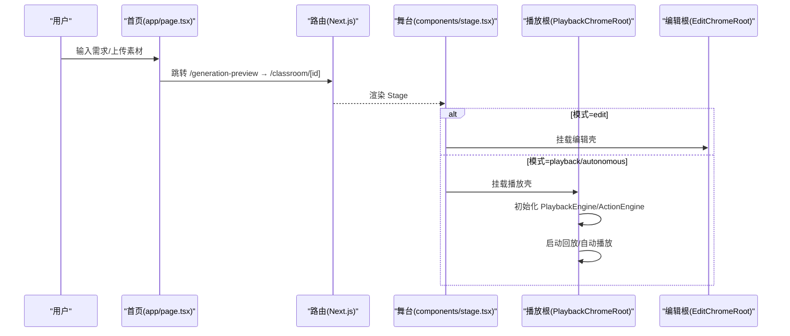
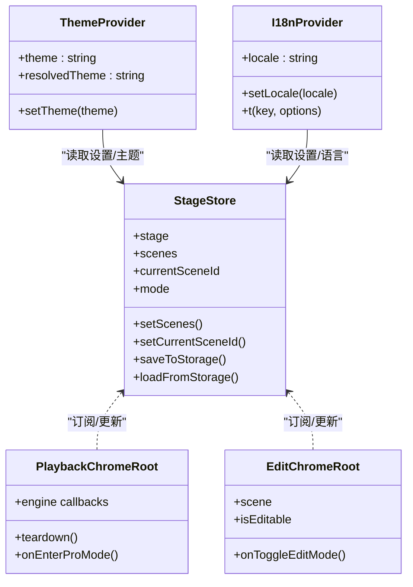

# 组件架构设计

<cite>
**本文引用的文件**   
- [app/layout.tsx](file://app/layout.tsx)
- [app/page.tsx](file://app/page.tsx)
- [components/stage.tsx](file://components/stage.tsx)
- [components/edit/EditChromeRoot.tsx](file://components/edit/EditChromeRoot.tsx)
- [components/edit/PlaybackChromeRoot.tsx](file://components/edit/PlaybackChromeRoot.tsx)
- [components/header.tsx](file://components/header.tsx)
- [components/ui/button.tsx](file://components/ui/button.tsx)
- [lib/store/index.ts](file://lib/store/index.ts)
- [lib/store/stage.ts](file://lib/store/stage.ts)
- [lib/hooks/use-theme.tsx](file://lib/hooks/use-theme.tsx)
- [lib/hooks/use-i18n.tsx](file://lib/hooks/use-i18n.tsx)
- [app/globals.css](file://app/globals.css)
</cite>

## 产品概述
OpenMAIC 是一个 AI 驱动的交互式课件（MAIC）生成与课堂管理平台，核心用户场景包括：通过自然语言生成结构化课件、课堂实时互动（问答/讨论/测验）、课件编辑与回放。前端基于 Next.js + React 19 + Zustand 状态管理；AI 编排层使用 LangGraph + Vercel AI SDK；课件格式为自定义 DSL。项目采用分层组件架构：基础 UI 组件库、业务组件与页面组件职责清晰，配合主题与国际化能力，提供一致的交互体验。

## 核心业务流程
- 首页输入需求并选择素材后进入“生成预览”流程，随后跳转到课堂舞台（Stage）。
- Stage 根据模式在“编辑 Chrome”和“播放 Chrome”之间切换，前者用于编辑幻灯片/测验等表面，后者负责回放引擎、SSE 聊天、TTS 与全屏演示。
- 播放模式下，PlaybackChromeRoot 驱动 PlaybackEngine 与 ActionEngine，按时间线推进动作，并与 ChatArea 协作完成讲师语音、讨论与效果触发。
- 编辑模式下，EditChromeRoot 挂载编辑器外壳（Shell），左侧为幻灯片导航，右侧为 AI 编辑面板与角色列表，底部为叙述时间轴（ActionsBar）。

图表来源 
- [app/page.tsx](file://app/page.tsx)
- [components/stage.tsx](file://components/stage.tsx)
- [components/edit/PlaybackChromeRoot.tsx](file://components/edit/PlaybackChromeRoot.tsx)
- [components/edit/EditChromeRoot.tsx](file://components/edit/EditChromeRoot.tsx)

章节来源
- [app/page.tsx](file://app/page.tsx)
- [components/stage.tsx](file://components/stage.tsx)
- [components/edit/PlaybackChromeRoot.tsx](file://components/edit/PlaybackChromeRoot.tsx)
- [components/edit/EditChromeRoot.tsx](file://components/edit/EditChromeRoot.tsx)

## 功能模块清单
- 基础 UI 组件库（components/ui/*）
  - 职责：提供可复用、可访问的原子化控件（按钮、对话框、下拉菜单、输入框等），统一变体与尺寸系统。
  - 验收要点：样式一致、无障碍属性完备、支持 asChild 与组合。
- 业务组件（components/agent, components/chat, components/settings, components/audio, components/roundtable 等）
  - 职责：封装领域逻辑与交互（智能体配置、会话管理、设置面板、语音控制、圆桌讨论等）。
  - 验收要点：状态与副作用隔离、事件处理明确、与 Store/Hooks 集成稳定。
- 页面与容器组件（app/page.tsx, components/stage.tsx, components/header.tsx, components/edit/*Root.tsx）
  - 职责：组织页面布局、模式切换、生命周期协调、跨组件通信。
  - 验收要点：渲染路径清晰、错误边界与加载态合理、性能优化到位。
- 渲染器与编辑器（components/slide-renderer, components/scene-renderers）
  - 职责：Canvas/SVG 渲染、元素编辑、工具栏与覆盖层。
  - 验收要点：帧率与内存占用可控、事件穿透与命中测试正确、扩展点清晰。

章节来源
- [components/ui/button.tsx](file://components/ui/button.tsx)
- [components/stage.tsx](file://components/stage.tsx)
- [components/header.tsx](file://components/header.tsx)
- [components/edit/EditChromeRoot.tsx](file://components/edit/EditChromeRoot.tsx)
- [components/edit/PlaybackChromeRoot.tsx](file://components/edit/PlaybackChromeRoot.tsx)

## 数据与状态
- 全局上下文与提供者
  - 主题：ThemeProvider 管理 light/dark/system 主题，应用至 documentElement，监听系统偏好变化并持久化到 localStorage。
  - 国际化：I18nProvider 基于 react-i18next，自动检测浏览器语言并持久化 locale。
- 状态管理（Zustand）
  - 入口导出 useStageStore、useSettingsStore、useCanvasStore 等，集中管理课堂、设置、画布等状态。
  - StageStore 维护 stage、scenes、currentSceneId、chats、mode、生成进度与失败重试等，并提供 save/load 与防抖持久化。
- 关键状态流转
  - Stage 模式切换：edit ↔ playback/autonomous，由 Stage 协调 EditChromeRoot 与 PlaybackChromeRoot 的挂载与卸载。
  - 播放引擎：PlaybackChromeRoot 创建并持有 PlaybackEngine/ActionEngine，响应 onModeChange/onProgress/onSpeechStart/End 等回调更新 UI。
  - 多标签编辑锁：Stage 层在进入编辑前获取锁，避免并发冲突。

图表来源 
- [lib/hooks/use-theme.tsx](file://lib/hooks/use-theme.tsx)
- [lib/hooks/use-i18n.tsx](file://lib/hooks/use-i18n.tsx)
- [lib/store/index.ts](file://lib/store/index.ts)
- [lib/store/stage.ts](file://lib/store/stage.ts)
- [components/edit/PlaybackChromeRoot.tsx](file://components/edit/PlaybackChromeRoot.tsx)
- [components/edit/EditChromeRoot.tsx](file://components/edit/EditChromeRoot.tsx)

章节来源
- [lib/hooks/use-theme.tsx](file://lib/hooks/use-theme.tsx)
- [lib/hooks/use-i18n.tsx](file://lib/hooks/use-i18n.tsx)
- [lib/store/index.ts](file://lib/store/index.ts)
- [lib/store/stage.ts](file://lib/store/stage.ts)
- [components/edit/PlaybackChromeRoot.tsx](file://components/edit/PlaybackChromeRoot.tsx)
- [components/edit/EditChromeRoot.tsx](file://components/edit/EditChromeRoot.tsx)

## 关键约束与边界
- 组件分层与职责边界
  - 基础 UI 组件仅关注呈现与交互细节，不承载业务逻辑。
  - 业务组件封装领域行为，通过 Hooks/Store 与外部解耦。
  - 页面/容器组件负责编排、路由与生命周期，不直接实现底层渲染。
- 模式切换与资源清理
  - Stage 在从播放切换到编辑时，先 teardown 播放引擎（SSE/音频/TTS），再切换模式，确保无竞态。
  - 编辑模式进入前预加载编辑器 chunk，避免闪烁与 NOOP。
- 样式系统与主题定制
  - Tailwind + CSS 变量定义主题色板，dark/light 双主题；body[data-maic-editor='true'] 控制编辑器专属样式。
  - 动画与滚动条等全局样式集中在 globals.css，保证一致性。
- 可访问性与国际化
  - 主题与语言通过 Context 暴露，遵循 SSR 安全的水合策略。
  - 基础 UI 组件遵循 Radix/shadcn 的可访问性约定。
- 性能与稳定性
  - 状态变更防抖写入 IndexedDB，减少频繁 IO。
  - 播放引擎与 SSE 流式回调通过 epoch/ref 去重与丢弃过期回调。
  - 首屏与切换使用 AnimatePresence 平滑过渡，避免布局抖动。

章节来源
- [components/stage.tsx](file://components/stage.tsx)
- [components/edit/EditChromeRoot.tsx](file://components/edit/EditChromeRoot.tsx)
- [components/edit/PlaybackChromeRoot.tsx](file://components/edit/PlaybackChromeRoot.tsx)
- [app/globals.css](file://app/globals.css)
- [lib/store/stage.ts](file://lib/store/stage.ts)

## 附录：组件开发规范、API 设计与集成指南（概览）
- 组件开发规范
  - 单一职责：UI 组件只负责展示与事件转发；业务逻辑下沉至 Hooks/Store。
  - 组合优先：通过 props、插槽（asChild/Slot）与组合模式复用，避免深层嵌套。
  - 命名与目录：按功能域划分目录，文件名体现用途，导出最小 API。
- API 设计原则
  - Props 显式且类型安全，默认值明确，可选参数需文档化。
  - 事件回调命名以 onXxx 形式，参数结构稳定，必要时提供 payload 对象。
  - 对外暴露 ref/handle 时保持幂等与可清理（如 teardown）。
- 集成指南
  - 在根布局注入 ThemeProvider/I18nProvider，确保全局可用。
  - 通过 useStageStore/useSettingsStore 读写状态，避免直接 DOM 操作。
  - 与后端 API 交互集中在 lib/api 或 hooks，组件侧只做调用与结果映射。

[本节为概念性说明，不直接分析具体文件，故不附“章节来源”]