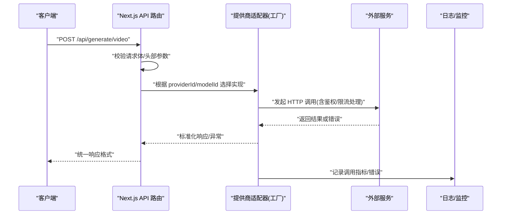

# 集成模式设计

<cite>
**本文引用的文件**   
- [lib/ai/providers.ts](file://lib/ai/providers.ts)
- [lib/audio/tts-providers.ts](file://lib/audio/tts-providers.ts)
- [lib/media/types.ts](file://lib/media/types.ts)
- [app/api/generate/video/route.ts](file://app/api/generate/video/route.ts)
- [app/api/azure-voices/route.ts](file://app/api/azure-voices/route.ts)
- [lib/logger.ts](file://lib/logger.ts)
- [components/settings/index.tsx](file://components/settings/index.tsx)
- [components/settings/add-audio-provider-dialog.tsx](file://components/settings/add-audio-provider-dialog.tsx)
- [lib/hooks/use-asr-available.ts](file://lib/hooks/use-asr-available.ts)
- [lib/hooks/use-browser-tts.ts](file://lib/hooks/use-browser-tts.ts)
- [tests/ai/anthropic-provider.test.ts](file://tests/ai/anthropic-provider.test.ts)
- [README-zh.md](file://README-zh.md)
- [lib/server/render-service.ts](file://lib/server/render-service.ts)
</cite>

## 目录
- 产品概述
- 核心业务流程
- 功能模块清单
- 数据与状态
- 关键约束与边界

## 产品概述
OpenMAIC 是一个 AI 驱动的交互式课件（MAIC）生成与课堂管理平台，通过统一抽象层对接多种外部服务：AI 大模型、TTS/ASR 语音服务、图像与视频媒体生成服务等。其核心价值在于以插件化架构屏蔽不同供应商差异，提供一致的调用接口、配置管理、认证授权、错误处理与可观测性能力，使业务侧无需关心底层实现细节即可灵活扩展新的服务提供商。

适用场景包括：
- 自然语言驱动的结构化课件生成
- 课堂实时互动（问答、讨论、测验）
- 多模态内容生成（文本、图像、音频、视频）
- 本地与云端混合部署（如 Lemonade 本地推理）

## 核心业务流程
围绕“请求进入 → 路由到具体提供商 → 鉴权与参数归一 → 调用外部 API → 结果回传与记录”的主链路，典型流程如下：

该流程在视频生成、TTS 生成、Azure 语音列表等接口中均有体现，确保一致的可观测性与错误处理策略。

章节来源
- [app/api/generate/video/route.ts:1-42](file://app/api/generate/video/route.ts#L1-L42)
- [lib/audio/tts-providers.ts:145-186](file://lib/audio/tts-providers.ts#L145-L186)
- [app/api/azure-voices/route.ts:1-45](file://app/api/azure-voices/route.ts#L1-L45)

## 功能模块清单
- AI 提供商统一抽象
  - 职责：基于 Vercel AI SDK 封装多厂商 LLM，暴露统一的 LanguageModel 接口；支持 OpenAI、Anthropic、Google Gemini、MiniMax、OpenAI 兼容服务商等。
  - 验收要点：模型元数据、能力标记（流式、工具、视觉、思考）、默认配置与别名解析正确。
  - 参考路径：[lib/ai/providers.ts:1-58](file://lib/ai/providers.ts#L1-L58), [lib/ai/providers.ts:163-213](file://lib/ai/providers.ts#L163-L213)

- TTS 服务适配器（插件化）
  - 职责：工厂模式路由到各 TTS 实现（OpenAI、Azure、GLM、Qwen、MiniMax、Doubao、ElevenLabs、Lemonade、浏览器原生），统一输入输出与错误处理。
  - 验收要点：新增提供商需按规范注册配置与实现；服务端禁用浏览器原生 TTS；速率限制与错误信息规范化。
  - 参考路径：[lib/audio/tts-providers.ts:1-828](file://lib/audio/tts-providers.ts#L1-L828)

- ASR 可用性检测与浏览器原生 TTS
  - 职责：前端判断 ASR 可用（开关 + 提供商配置 + Web Speech API 支持）；浏览器原生 TTS Hook 封装 Web Speech API。
  - 验收要点：统一 gate 逻辑避免重复判断；浏览器环境安全限制。
  - 参考路径：[lib/hooks/use-asr-available.ts:1-28](file://lib/hooks/use-asr-available.ts#L1-L28), [lib/hooks/use-browser-tts.ts:1-53](file://lib/hooks/use-browser-tts.ts#L1-L53)

- 媒体生成（图像/视频）类型与路由
  - 职责：定义统一的 MediaGenerationRequest 与 ProviderId 集合；视频生成 API 使用异步任务提交与轮询模式。
  - 验收要点：新增提供商需在类型与常量中注册，并在对应 providers 文件中实现；SSRF 防护与超时控制。
  - 参考路径：[lib/media/types.ts:1-309](file://lib/media/types.ts#L1-L309), [app/api/generate/video/route.ts:1-42](file://app/api/generate/video/route.ts#L1-L42)

- 设置与提供商管理 UI
  - 职责：展示/编辑各提供商名称、图标、基础 URL、是否需 API Key 等；支持自定义 TTS/ASR 提供商添加。
  - 验收要点：名称映射与图标资源正确；自定义提供商表单字段完整。
  - 参考路径：[components/settings/index.tsx:156-192](file://components/settings/index.tsx#L156-L192), [components/settings/add-audio-provider-dialog.tsx:51-87](file://components/settings/add-audio-provider-dialog.tsx#L51-L87)

- 渲染服务健康检查
  - 职责：探测内部渲染服务可达性与健康状态，用于能力端点降级与 UI 优雅退化。
  - 验收要点：未配置时返回 not_configured；健康检查失败不抛异常。
  - 参考路径：[lib/server/render-service.ts:31-60](file://lib/server/render-service.ts#L31-L60)

章节来源
- [lib/ai/providers.ts:1-58](file://lib/ai/providers.ts#L1-L58)
- [lib/audio/tts-providers.ts:1-828](file://lib/audio/tts-providers.ts#L1-L828)
- [lib/media/types.ts:1-309](file://lib/media/types.ts#L1-L309)
- [app/api/generate/video/route.ts:1-42](file://app/api/generate/video/route.ts#L1-L42)
- [components/settings/index.tsx:156-192](file://components/settings/index.tsx#L156-L192)
- [components/settings/add-audio-provider-dialog.tsx:51-87](file://components/settings/add-audio-provider-dialog.tsx#L51-L87)
- [lib/server/render-service.ts:31-60](file://lib/server/render-service.ts#L31-L60)

## 数据与状态
- 提供商配置与发现
  - AI 提供商：集中式配置表包含 id、name、baseUrlPlaceholder、requiresApiKey、icon、models 等元数据；支持模型别名与能力推断。
  - TTS/ASR：通过常量与类型注册提供商 ID、默认 Base URL、支持的格式与速度范围；UI 层维护用户选择的 providerId、voice、speed 等。
  - 媒体生成：MediaGenerationRequest 统一描述 prompt、elementId、aspectRatio、style 等；VideoProviderId/ImageProviderId 作为路由键。

- 运行时状态与可用性
  - ASR 可用性由全局开关、提供商配置有效性、浏览器能力共同决定；TTS 在浏览器端使用 Web Speech API，服务端禁止直接调用。
  - 渲染服务健康状态影响导出/渲染能力的启用与降级。

- 配置来源与环境变量
  - 支持 server-providers.yml 与 .env 环境变量（如 OPENAI_API_KEY、DEFAULT_MODEL、LEMONADE_BASE_URL 等）进行多厂商接入。
  - Azure 语音列表通过专用 API 获取并受 SSRF 保护。

章节来源
- [lib/ai/providers.ts:1-58](file://lib/ai/providers.ts#L1-L58)
- [lib/audio/tts-providers.ts:1-828](file://lib/audio/tts-providers.ts#L1-L828)
- [lib/media/types.ts:1-309](file://lib/media/types.ts#L1-L309)
- [lib/hooks/use-asr-available.ts:1-28](file://lib/hooks/use-asr-available.ts#L1-L28)
- [lib/hooks/use-browser-tts.ts:1-53](file://lib/hooks/use-browser-tts.ts#L1-L53)
- [app/api/azure-voices/route.ts:1-45](file://app/api/azure-voices/route.ts#L1-L45)
- [README-zh.md:120-177](file://README-zh.md#L120-L177)

## 关键约束与边界
- 认证与授权
  - 各提供商要求不同的鉴权方式（API Key、Ocp-Apim-Subscription-Key、Bearer Token 等），适配器负责注入与校验。
  - 访问令牌签名与验证用于会话级权限控制（示例测试覆盖）。
  - 渲染服务与外部服务调用需通过 SSRF 防护与重定向限制。

- 错误处理与可观测性
  - 统一日志器支持 JSON/文本两种格式，按级别过滤输出；各适配器对速率限制与网络错误进行规范化处理。
  - 能力端点与健康检查返回布尔值，便于 UI 降级。

- 性能与可靠性
  - 视频生成采用异步任务提交与轮询，maxDuration 设置为较长时限；TTS/ASR 调用注意速率限制与重试策略。
  - 浏览器原生能力受限（Web Speech API），服务端不可用。

- 扩展边界
  - 新增提供商需遵循“类型注册 → 常量配置 → 适配器实现 → i18n 翻译”的规范；媒体生成异步任务需复用 polled-task 工具。
  - 所有对外 URL 必须经过 SSRF 校验，禁止危险重定向。

章节来源
- [lib/logger.ts:1-53](file://lib/logger.ts#L1-L53)
- [lib/audio/tts-providers.ts:586-633](file://lib/audio/tts-providers.ts#L586-L633)
- [app/api/azure-voices/route.ts:1-45](file://app/api/azure-voices/route.ts#L1-L45)
- [lib/server/render-service.ts:31-60](file://lib/server/render-service.ts#L31-L60)
- [tests/ai/anthropic-provider.test.ts:1-22](file://tests/ai/anthropic-provider.test.ts#L1-L22)