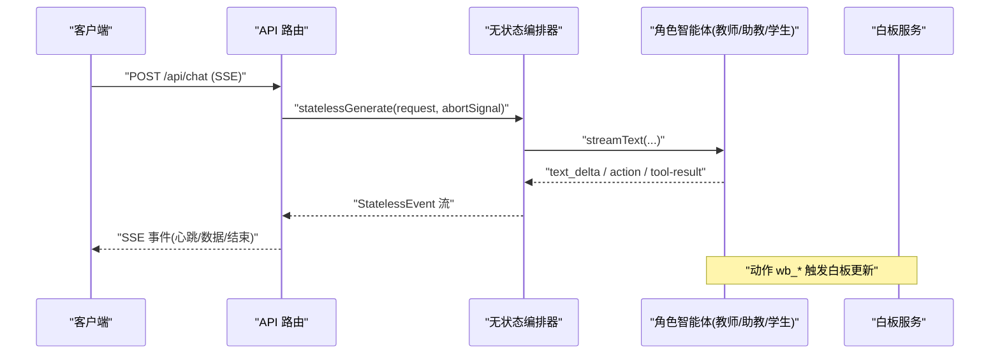
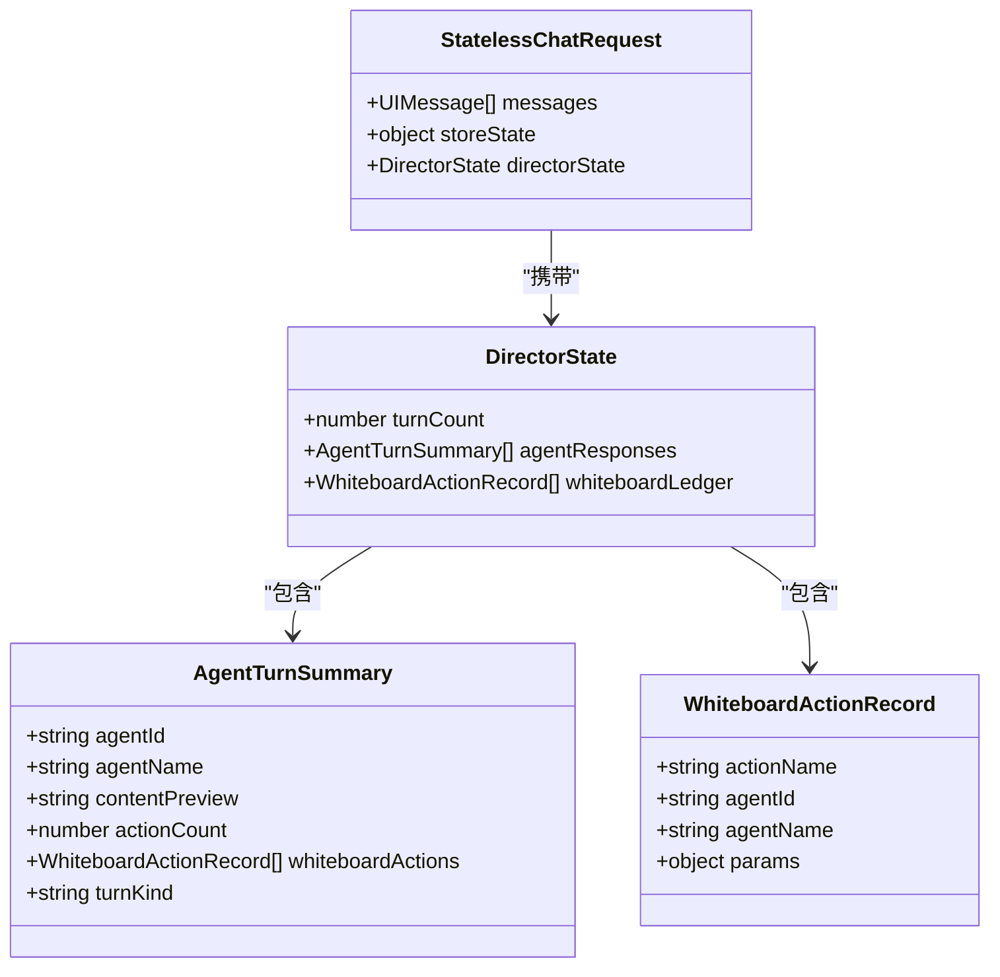

# 多智能体编排系统

<cite>
**本文引用的文件**
- [lib/orchestration/stateless-generate.ts](file://lib/orchestration/stateless-generate.ts)
- [lib/orchestration/types.ts](file://lib/orchestration/types.ts)
- [lib/orchestration/summarizers/whiteboard-conflicts.ts](file://lib/orchestration/summarizers/whiteboard-conflicts.ts)
- [app/api/chat/route.ts](file://app/api/chat/route.ts)
- [lib/pbl/v2/agents/instructor.ts](file://lib/pbl/v2/agents/instructor.ts)
- [components/scene-renderers/pbl/v2/use-instructor-stream.ts](file://components/scene-renderers/pbl/v2/use-instructor-stream.ts)
- [components/whiteboard/index.tsx](file://components/whiteboard/index.tsx)
- [lib/types/chat.ts](file://lib/types/chat.ts)
- [lib/orchestration/registry/store.ts](file://lib/orchestration/registry/store.ts)
- [lib/utils/base-path.ts](file://lib/utils/base-path.ts)
- [lib/constants/agent-defaults.ts](file://lib/constants/agent-defaults.ts)
</cite>

## 更新摘要
**所做更改**
- 新增智能体头像路径规范化机制章节，详细说明 withBasePath 工具的使用
- 更新智能体注册表存储部分，强调历史数据兼容性处理
- 增强静态资源路径管理说明，涵盖 basePath 部署和独立运行场景
- 完善头像加载错误恢复策略的文档说明

## 产品概述
OpenMAIC 是一个 AI 驱动的交互式课件（MAIC）生成与课堂管理平台，核心目标是通过自然语言驱动的多智能体协作，完成结构化课件生成、课堂实时互动（问答/讨论/测验）、课件编辑与回放。本系统以 LangGraph 状态机为核心编排引擎，结合 Vercel AI SDK 的流式能力，实现教师、助教、学生等角色的协同教学流程；同时提供白板协作、冲突检测与实时同步机制，并通过 SSE 流式传输保障低延迟与高可用。

## 核心业务流程
- 用户发起对话或任务后，服务端通过无状态多智能体生成管线进行单轮或多轮编排：由"导演"智能体决定发言者，调用各角色智能体执行文本输出与工具动作（如白板绘制、图表生成）。
- 前端通过 SSE 接收增量事件（文本片段、动作、状态），实时更新聊天气泡、白板画面与进度提示。
- 在 PBL v2 场景中，教师智能体根据里程碑与微任务上下文构建系统提示，驱动教学工具（记录观察、调整难度等），并产出面向学生的教学反馈。
- 白板操作具备历史快照、清理动画与视图重置能力，确保多人协作时的体验一致性。



**章节来源**
- [lib/orchestration/stateless-generate.ts:392-510](file://lib/orchestration/stateless-generate.ts#L392-L510)
- [app/api/chat/route.ts:95-130](file://app/api/chat/route.ts#L95-L130)
- [lib/pbl/v2/agents/instructor.ts:1758-1789](file://lib/pbl/v2/agents/instructor.ts#L1758-L1789)

## 功能模块清单
- 无状态多智能体生成
  - 职责：基于 LangGraph 的状态图驱动单轮/多轮编排，解析结构化 JSON Array 输出，流式推送文本与动作。
  - 验收要点：支持 partial-json 增量解析、结构化残留抑制、动作与文本交错顺序保持、directorState 累积。
- 教师智能体（PBL v2）
  - 职责：依据项目、里程碑、微任务与角色设定构建系统提示，使用工具记录观察与调整难度，输出教学反馈。
  - 验收要点：setup/instructing 阶段切换、合成平台开场消息、思考模式禁用策略、工具结果回写。
- 白板协作
  - 职责：提供画布渲染、元素增删改、历史快照、清理动画与视图重置。
  - 验收要点：清空前保存快照、级联退出动画、错误提示与成功反馈。
- 冲突检测与解决
  - 职责：对白板元素的几何重叠、线段穿越、边界裁剪进行检测，生成文本摘要供模型决策。
  - 验收要点：阈值判定、线框转换、冲突列表拼接。
- SSE 流式传输
  - 职责：维持长连接、心跳保活、断线重连、错误恢复。
  - 验收要点：定时心跳注释、异常捕获与中断处理、AbortError 分支。

**章节来源**
- [lib/orchestration/stateless-generate.ts:1-510](file://lib/orchestration/stateless-generate.ts#L1-L510)
- [lib/pbl/v2/agents/instructor.ts:1-1789](file://lib/pbl/v2/agents/instructor.ts#L1-L1789)
- [components/whiteboard/index.tsx:1-180](file://components/whiteboard/index.tsx#L1-L180)
- [lib/orchestration/summarizers/whiteboard-conflicts.ts:1-194](file://lib/orchestration/summarizers/whiteboard-conflicts.ts#L1-L194)
- [app/api/chat/route.ts:95-130](file://app/api/chat/route.ts#L95-L130)

## 数据与状态
- 白板动作账本与智能体回合摘要
  - WhiteboardActionRecord：记录每次白板动作的名称、执行者、参数。
  - AgentTurnSummary：汇总每轮智能体的内容预览、动作计数与白板动作序列。
- 无状态会话与导演状态
  - DirectorState：维护轮次计数、智能体响应摘要与白板账本，客户端维护并在请求中回传。
  - StatelessChatRequest：包含消息历史与应用状态（舞台、场景、当前场景、白板开关、测验状态等）。
- 会话生命周期与冲突时钟
  - withChatSessionStatus/withChatSegmentSealed/withChatSegmentReveal：保证时间单调性与分段揭示顺序。
  - interruptActiveChatSessions：刷新活跃会话状态，避免陈旧排序。



**图示来源**
- [lib/orchestration/types.ts:1-47](file://lib/orchestration/types.ts#L1-L47)
- [lib/types/chat.ts:283-323](file://lib/types/chat.ts#L283-L323)

**章节来源**
- [lib/orchestration/types.ts:1-47](file://lib/orchestration/types.ts#L1-L47)
- [lib/types/chat.ts:51-95](file://lib/types/chat.ts#L51-95)
- [lib/types/chat.ts:283-323](file://lib/types/chat.ts#L283-L323)

## 智能体头像路径规范化机制

### 问题背景
在多智能体系统中，智能体头像路径的跨环境兼容性是一个关键挑战。系统需要同时支持两种部署模式：
- **独立运行模式**：basePath 为空，直接访问 `/avatars/...`
- **子路径部署模式**：basePath 为 `/openmaic`，需要访问 `/openmaic/avatars/...`

### 历史问题
服务器持久化的智能体头像字段包含原始路径（如 `/avatars/teacher.png`），这些路径没有经过 basePath 系统处理，导致在子路径部署模式下头像无法正确加载。

### 解决方案
通过 `applyGeneratedAgentsToRegistry` 函数中的路径规范化机制解决此问题：

```typescript
// 运行时统一补上 basePath 前缀 + 改写到 /api/public/
const normalizedAvatar = withBasePath(rest.avatar);
```

### withBasePath 工具详解
`withBasePath` 工具提供了完整的静态资源路径处理能力：

1. **协议保护**：跳过 `data:`、`blob:`、`http(s):` 等协议 URL
2. **内置资源重写**：将 `/avatars/`、`/logos/`、`/vendor/` 等内置资源自动改写为 `/api/public/` 路径
3. **basePath 拼接**：在非空 basePath 环境下自动添加前缀
4. **防重复处理**：已带 basePath 的路径不会被重复处理

### 部署兼容性
- **开发环境**：绕过 Next.js 16 + Turbopack 的 public 资源 404 bug
- **生产环境**：直接使用标准 basePath 机制
- **子路径部署**：自动适配 `/openmaic` 等子路径结构

**章节来源**
- [lib/orchestration/registry/store.ts:369-372](file://lib/orchestration/registry/store.ts#L369-L372)
- [lib/utils/base-path.ts:1-90](file://lib/utils/base-path.ts#L1-L90)
- [lib/constants/agent-defaults.ts:31-41](file://lib/constants/agent-defaults.ts#L31-L41)

## 智能体注册表存储

### 存储架构
智能体注册表使用 Zustand 状态管理库，结合 localStorage 持久化机制：

- **默认智能体**：预定义的 6 个基础角色（教师、助教、3种学生角色）
- **自定义智能体**：用户创建的个性化智能体配置
- **生成智能体**：LLM 动态创建的智能体，不持久化到 localStorage

### 数据迁移策略
版本号为 11 的存储结构支持向后兼容：
- 生成的智能体被排除在持久化之外（partialize 过滤）
- 合并时保留非默认、非生成的自定义智能体
- 默认智能体始终使用代码定义的值，而非缓存副本

### 头像路径处理
所有智能体头像路径都通过 `withBasePath` 工具处理，确保跨环境兼容性：
- 默认智能体：直接在定义时使用 `withBasePath('/avatars/xxx.png')`
- 生成智能体：在应用时通过 `applyGeneratedAgentsToRegistry` 进行路径规范化

**章节来源**
- [lib/orchestration/registry/store.ts:48-193](file://lib/orchestration/registry/store.ts#L48-L193)
- [lib/orchestration/registry/store.ts:237-274](file://lib/orchestration/registry/store.ts#L237-L274)
- [lib/orchestration/registry/store.ts:356-405](file://lib/orchestration/registry/store.ts#L356-L405)

## 关键约束与边界
- 后端无状态：所有状态随请求/响应传递，客户端维护 DirectorState 与会话状态。
- 单次生成路径：不采用 generate/tool/loop 循环，而是单遍结构化输出解析与事件流。
- 结构化输出鲁棒性：partial-json 与 jsonrepair 双保险，抑制结构化残留，避免泄露原始 JSON。
- 白板冲突阈值：重叠面积≥30%、线段穿越非线元素、超出画布边界即报告。
- SSE 保活与超时：心跳间隔固定，空闲连接可能被代理/浏览器关闭，需客户端重连。
- 并发控制：AbortController 用于中断请求；会话状态变更使用冲突时钟保证顺序。
- 性能优化：增量解析、最小化文本片段推送、动作与文本交错顺序保持，减少前端重绘。
- **头像路径兼容性**：所有静态资源路径必须通过 `withBasePath` 处理，确保跨部署模式兼容性。
- **历史数据迁移**：服务器持久化的原始路径在运行时自动规范化，无需手动迁移。

**章节来源**
- [lib/orchestration/stateless-generate.ts:1-510](file://lib/orchestration/stateless-generate.ts#L1-L510)
- [lib/orchestration/summarizers/whiteboard-conflicts.ts:1-194](file://lib/orchestration/summarizers/whiteboard-conflicts.ts#L1-L194)
- [app/api/chat/route.ts:95-130](file://app/api/chat/route.ts#L95-L130)
- [lib/types/chat.ts:51-95](file://lib/types/chat.ts#L51-95)
- [lib/orchestration/registry/store.ts:369-372](file://lib/orchestration/registry/store.ts#L369-L372)
- [lib/utils/base-path.ts:1-90](file://lib/utils/base-path.ts#L1-L90)

## 静态资源路径管理系统

### 架构设计
系统实现了完整的静态资源路径管理方案，解决 Next.js 16 + Turbopack 的已知问题：

1. **withBasePath 工具**：统一的资源路径处理入口
2. **API 公共路由**：`/api/public/[...path]` 作为静态资源服务 fallback
3. **白名单机制**：仅允许安全的内置资源路径访问

### 支持的资源类型
- **头像资源**：`/avatars/*.png` - 智能体和用户头像
- **Logo 资源**：`/logos/*.svg` - 品牌标识
- **第三方资源**：`/vendor/*` - 外部依赖库
- **特殊文件**：`/logo-horizontal.png`、`/openmaic-mark.png`

### 错误恢复策略
- **开发环境**：自动降级到 `/api/public/` 路由
- **生产环境**：直接使用标准静态资源服务
- **网络错误**：前端组件级别的图片加载失败处理

**章节来源**
- [lib/utils/base-path.ts:1-90](file://lib/utils/base-path.ts#L1-L90)
- [app/api/public/[...path]/route.ts:1-35](file://app/api/public/[...path]/route.ts#L1-L35)