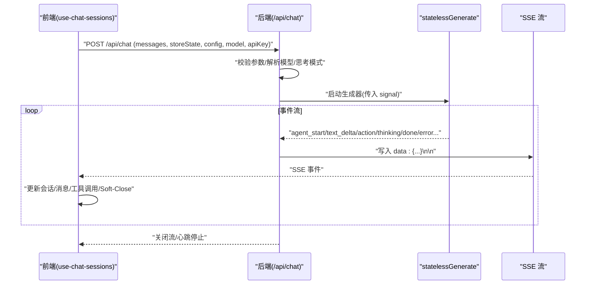
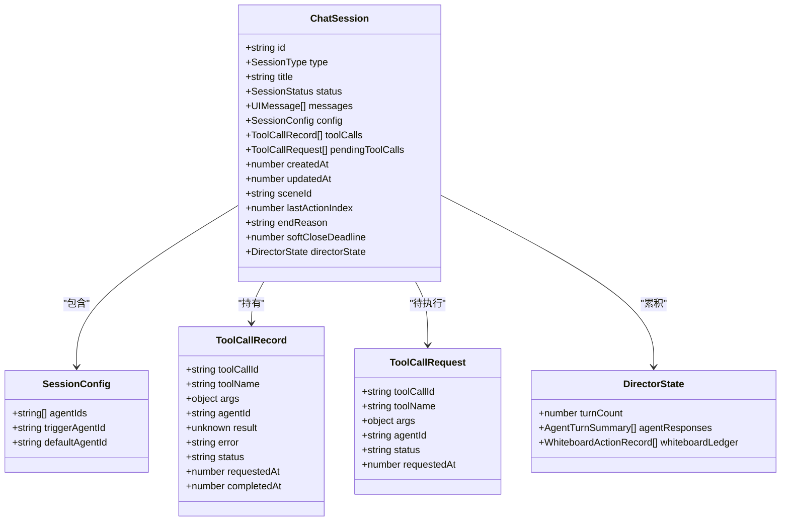
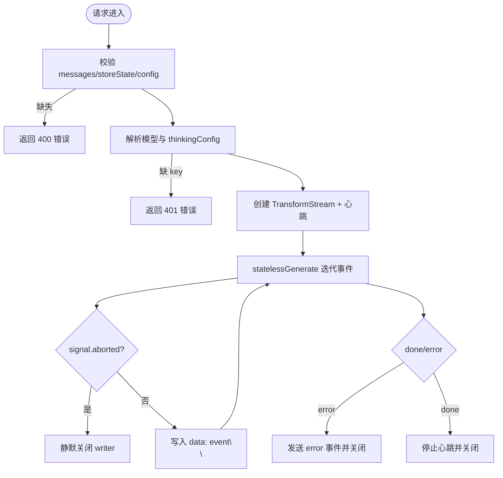
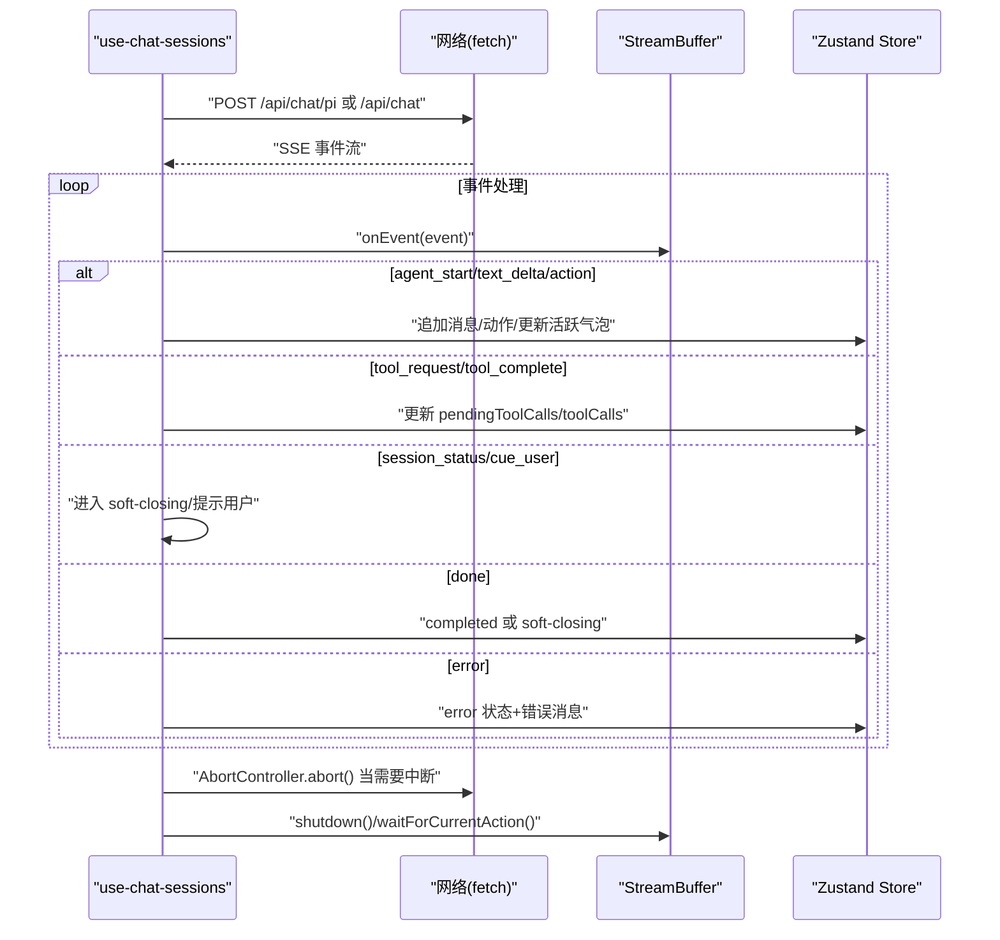
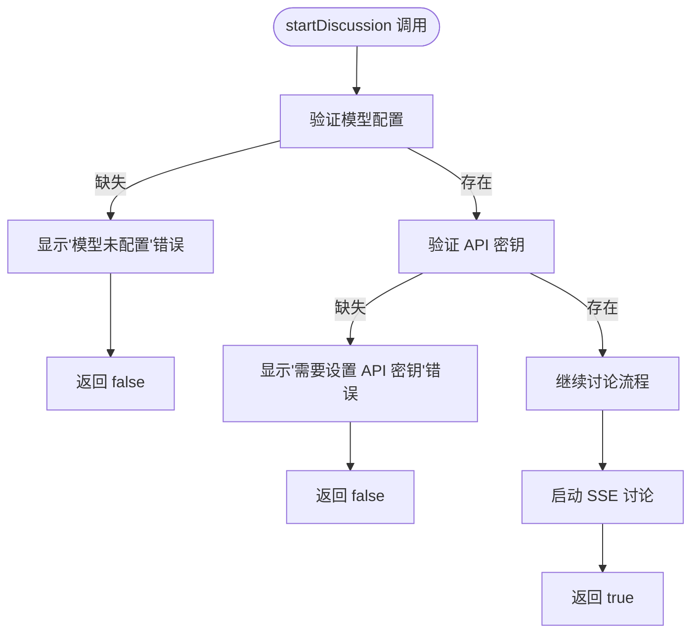
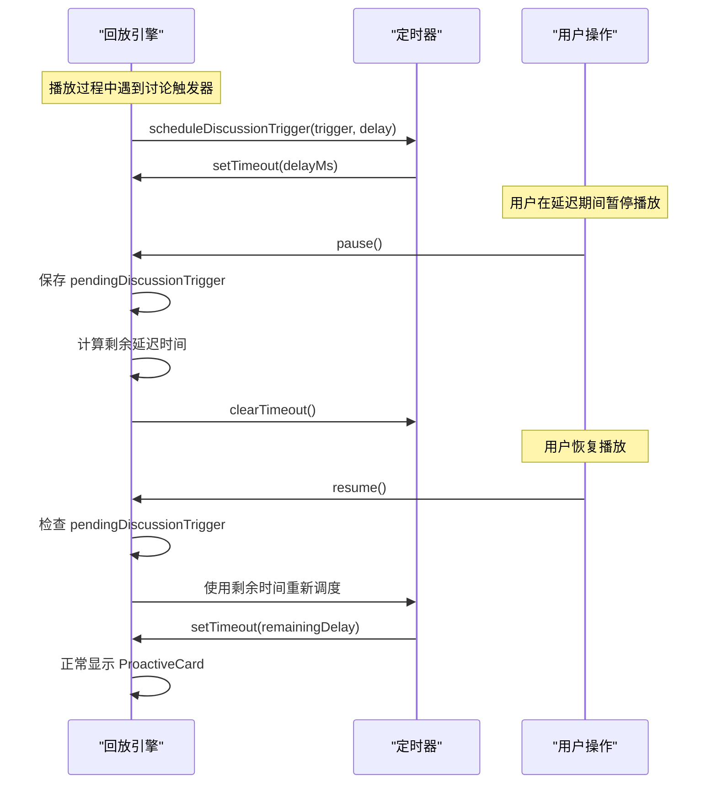
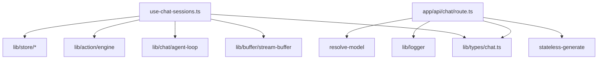

# 对话协调机制

<cite>
**本文引用的文件**   
- [app/api/chat/route.ts](file://app/api/chat/route.ts)
- [lib/types/chat.ts](file://lib/types/chat.ts)
- [components/chat/use-chat-sessions.ts](file://components/chat/use-chat-sessions.ts)
- [lib/types/provider.ts](file://lib/types/provider.ts)
- [components/chat/chat-area.tsx](file://components/chat/chat-area.tsx)
- [lib/playback/engine.ts](file://lib/playback/engine.ts)
- [components/edit/PlaybackChromeRoot.tsx](file://components/edit/PlaybackChromeRoot.tsx)
</cite>

## 更新摘要
**变更内容**   
- 更新了 startDiscussion 函数的返回值类型和验证逻辑，现在返回布尔值指示讨论请求是否成功分发
- 增强了回放引擎的暂停/恢复周期中待处理讨论触发器的保留能力
- 修复了暂停期间触发的讨论丢失问题
- 改进了模型配置缺失和 API 密钥未设置时的错误处理流程

## 产品概述
OpenMAIC 是一个 AI 驱动的交互式课件（MAIC）生成与课堂管理平台，核心用户场景包括：通过自然语言生成结构化课件、课堂实时互动（问答/讨论/测验）、课件编辑与回放。对话协调机制围绕"无状态后端 + 前端会话编排"的架构展开：后端提供无状态的 SSE 流式接口，负责单次多智能体生成；前端维护会话状态、消息去重、顺序保证与断线恢复，并通过 Soft-Close 窗口实现优雅收尾与自动恢复。

## 核心业务流程
- 请求入口：客户端 POST /api/chat，携带完整上下文（消息历史、storeState、agent 配置、模型与凭据）。
- 服务端处理：解析并校验请求，解析模型与思考模式，创建 TransformStream 输出 SSE，使用心跳保活连接，调用 statelessGenerate 迭代事件并逐条写入。
- 前端消费：use-chat-sessions 建立 AbortController 控制生命周期，按事件类型更新会话状态、消息与工具调用，管理 Soft-Close 窗口与错误恢复。
- 结束流程：done 事件触发会话完成或进入 soft-closing；超时后自动标记 completed，清理资源并回调上层。

**图表来源** 
- [app/api/chat/route.ts:44-207](file://app/api/chat/route.ts#L44-L207)
- [components/chat/use-chat-sessions.ts:1130-1198](file://components/chat/use-chat-sessions.ts#L1130-L1198)

**章节来源**
- [app/api/chat/route.ts:44-207](file://app/api/chat/route.ts#L44-L207)
- [components/chat/use-chat-sessions.ts:1130-1198](file://components/chat/use-chat-sessions.ts#L1130-L1198)

## 功能模块清单
- 无状态聊天 API（/api/chat）
  - 职责：接收全量上下文、校验、解析模型与思考模式、SSE 流式输出、心跳保活、错误事件上报。
  - 验收要点：参数校验失败返回 4xx；异常时发送 error 事件；支持 abort 中断；最大时长限制生效。
- 会话编排与状态机（use-chat-sessions）
  - 职责：构建请求模板、发起 fetch、消费 SSE、维护 ChatSession 状态机（idle/active/soft-closing/interrupted/completed/error）、工具调用队列、Soft-Close 窗口、资源回收。
  - 验收要点：事件顺序正确；重复事件去重；中断后恢复；Soft-Close 超时自动完成；错误路径清晰。
- 类型与协议（lib/types/chat.ts）
  - 职责：定义会话、消息、工具调用、SSE 事件、DirectorState、Pi 边界上下文等。
  - 验收要点：前后端事件契约一致；字段完备且可序列化。
- 提供商与思考模式（lib/types/provider.ts）
  - 职责：统一 ThinkingConfig 与能力描述，适配不同 LLM 提供商。
  - 验收要点：thinking 默认关闭以降低延迟；可按模型能力启用/调整。

**章节来源**
- [lib/types/chat.ts:1-449](file://lib/types/chat.ts#L1-L449)
- [lib/types/provider.ts:1-192](file://lib/types/provider.ts#L1-L192)
- [components/chat/use-chat-sessions.ts:1-800](file://components/chat/use-chat-sessions.ts#L1-L800)
- [app/api/chat/route.ts:44-207](file://app/api/chat/route.ts#L44-L207)

## 数据与状态
- 会话模型（ChatSession）
  - 关键字段：id、type、title、status、messages、config、toolCalls、pendingToolCalls、directorState、softCloseDeadline、endReason、updatedAt。
  - 状态流转：idle → active → soft-closing → completed；异常路径进入 interrupted/error。
- 消息与元数据（UIMessage + ChatMessageMetadata）
  - 支持 senderName、agentId、agentColor、actions、createdAt、interrupted 等。
- 工具调用（ToolCallRequest/ToolCallRecord）
  - 生命周期：pending → executing → completed/failed；记录 agentId、时间戳与结果/错误。
- DirectorState（跨轮次累积）
  - turnCount、agentResponses、whiteboardLedger；由前端在每次请求中回传，后端无状态。
- Pi 会话边界上下文（PiSessionBoundaryContext）
  - isFirstRequestInLiveSession、previousEndSource、sameSceneAsPrevious；用于首请求上下文注入与场景一致性判断。

**图表来源** 
- [lib/types/chat.ts:49-153](file://lib/types/chat.ts#L49-L153)
- [lib/types/chat.ts:299-303](file://lib/types/chat.ts#L299-L303)

**章节来源**
- [lib/types/chat.ts:49-153](file://lib/types/chat.ts#L49-L153)
- [lib/types/chat.ts:299-303](file://lib/types/chat.ts#L299-L303)

## 关键约束与边界
- 无状态后端
  - 所有上下文由客户端在每次请求中提供；后端不持久化会话状态，仅处理单次生成循环。
- SSE 传输与保活
  - 使用 TransformStream 输出 text/event-stream；每 15 秒发送注释心跳防止代理/浏览器断开。
  - 支持 AbortController 传播中断；异常时发送 error 事件并安全关闭 writer。
- 消息去重与顺序保证
  - 基于 messageId 与 updatedAt 冲突时钟推进；text_start/text_delta/text_end 三段式确保片段完整性；segment 完成后推进 sealed 时间戳。
- Soft-Close 窗口
  - 服务端语义关闭后进入 15 秒软关闭窗口；期间允许继续交互；超时自动完成并清理资源。
- 并发与会话隔离
  - 每个会话独立 AbortController 与 StreamBuffer；stageId 切换时重置状态并清理定时器与缓冲。
- 性能与内存优化
  - 默认关闭 thinking 降低延迟；按需启用白板工具；流式分片减少峰值内存；退订/销毁及时释放资源。

**章节来源**
- [app/api/chat/route.ts:96-195](file://app/api/chat/route.ts#L96-L195)
- [lib/types/chat.ts:79-117](file://lib/types/chat.ts#L79-117)
- [components/chat/use-chat-sessions.ts:509-573](file://components/chat/use-chat-sessions.ts#L509-573)
- [lib/types/provider.ts:113-134](file://lib/types/provider.ts#L113-L134)

## 详细组件分析

### 无状态聊天 API（/api/chat）
- 输入校验：messages、storeState、config.agentIds 必填；缺失返回 400；缺少 apiKey 返回 401。
- 模型解析：resolveModel 根据 modelString、apiKey、baseUrl、providerType 解析语言模型与 thinkingConfig。
- 流式输出：TransformStream + TextEncoder 写入 data: {...}\n\n；心跳间隔 15s；信号中断时静默关闭。
- 错误处理：捕获异常，尝试发送 error 事件；若 writer 已关闭则忽略。

**图表来源** 
- [app/api/chat/route.ts:44-207](file://app/api/chat/route.ts#L44-L207)

**章节来源**
- [app/api/chat/route.ts:44-207](file://app/api/chat/route.ts#L44-L207)

### 前端会话编排（use-chat-sessions）
- 请求构造：组装 messages、storeState、config（含 agentConfigs）、userProfile、model/provider/thinkingConfig、directorState、piSessionBoundary。
- 流式消费：fetch 读取 body，按 \n\n 分片解析 SSE；对 agent_start/text_delta/action/thinking/cue_user/done/error 分类处理。
- 状态机：active → soft-closing → completed；错误路径置 error；中断置 interrupted；segment 完成后推进 sealed。
- 工具调用：pendingToolCalls 与 toolCalls 同步；executing → completed/failed。
- Soft-Close：进入窗口设置 deadline 与 token；超时自动完成；visibilitychange 时修复过期注册。
- 资源回收：retireActiveLiveRequest 统一中止 fetch、shutdown buffer、清理 Map；卸载时清理定时器与缓冲。

**图表来源** 
- [components/chat/use-chat-sessions.ts:1130-1198](file://components/chat/use-chat-sessions.ts#L1130-L1198)
- [components/chat/use-chat-sessions.ts:327-416](file://components/chat/use-chat-sessions.ts#L327-416)

**章节来源**
- [components/chat/use-chat-sessions.ts:1-800](file://components/chat/use-chat-sessions.ts#L1-L800)
- [components/chat/use-chat-sessions.ts:1130-1198](file://components/chat/use-chat-sessions.ts#L1130-L1198)
- [components/chat/use-chat-sessions.ts:327-416](file://components/chat/use-chat-sessions.ts#L327-416)

### 事件协议与类型（lib/types/chat.ts）
- 会话类型：qa、discussion、lecture；状态：idle、active、soft-closing、interrupted、completed、error。
- 消息元数据：senderName、agentId、agentColor、actions、createdAt、interrupted。
- 工具调用：ToolCallRequest（pending/executing）、ToolCallRecord（completed/failed）。
- SSE 事件：message/tool_request/tool_complete/agent_switch/session_status/error/done/text_start/text_delta/text_end。
- DirectorState：turnCount、agentResponses、whiteboardLedger。
- Pi 边界上下文：isFirstRequestInLiveSession、previousEndSource、sameSceneAsPrevious。

**章节来源**
- [lib/types/chat.ts:1-449](file://lib/types/chat.ts#L1-L449)

### 提供商与思考模式（lib/types/provider.ts）
- ThinkingConfig：mode、effort、level、enabled、budgetTokens、excludeReasoningOutput。
- 能力描述：ThinkingCapability 控制 UI 控件、适配器、默认值与范围。
- 默认行为：chat 默认 disabled 以降低延迟；评估环境可通过环境变量开启。

**章节来源**
- [lib/types/provider.ts:113-134](file://lib/types/provider.ts#L113-L134)
- [lib/types/provider.ts:71-107](file://lib/types/provider.ts#L71-L107)

### 讨论系统增强功能

#### startDiscussion 函数改进
**更新** startDiscussion 函数现在返回布尔值以指示讨论请求是否成功分发，允许调用方优雅地处理验证失败。

- **返回值类型**：从 `Promise<void>` 改为 `Promise<boolean>`
- **验证逻辑**：在开始讨论前检查模型配置和 API 密钥设置
- **错误处理**：当模型配置缺失或 API 密钥未设置时，函数提前返回 false 并显示适当的错误提示
- **UI 状态恢复**：调用方可以根据返回值进行适当的 UI 状态恢复

**图表来源** 
- [components/chat/use-chat-sessions.ts:1871-2006](file://components/chat/use-chat-sessions.ts#L1871-L2006)

**章节来源**
- [components/chat/use-chat-sessions.ts:1871-2006](file://components/chat/use-chat-sessions.ts#L1871-L2006)
- [components/chat/chat-area.tsx:60-80](file://components/chat/chat-area.tsx#L60-80)

#### 回放引擎讨论触发器保留机制
**更新** 回放引擎增强了跨暂停/恢复周期保留待处理讨论触发器的能力，修复了在暂停期间触发的讨论丢失的问题。

- **新增字段**：`pendingDiscussionTrigger` 用于存储等待延迟定时器的讨论触发器
- **暂停处理**：在 `pause()` 方法中保存触发器剩余延迟时间和起始时间
- **恢复处理**：在 `resume()` 方法中使用保存的信息重新调度触发器
- **状态持久化**：确保讨论触发器在播放暂停和恢复之间保持有效

**图表来源** 
- [lib/playback/engine.ts:224-329](file://lib/playback/engine.ts#L224-L329)
- [lib/playback/engine.ts:513-527](file://lib/playback/engine.ts#L513-L527)

**章节来源**
- [lib/playback/engine.ts:85-88](file://lib/playback/engine.ts#L85-88)
- [lib/playback/engine.ts:224-329](file://lib/playback/engine.ts#L224-L329)
- [lib/playback/engine.ts:513-527](file://lib/playback/engine.ts#L513-L527)

### 依赖分析
- 组件耦合
  - use-chat-sessions 依赖 lib/types/chat（事件与模型）、lib/buffer/stream-buffer（分片缓冲）、lib/chat/agent-loop（会话循环）、lib/action/engine（动作引擎）、lib/store（Zustand 状态）。
  - /api/chat 依赖 resolve-model、stateless-generate、logger、types/chat。
- 外部依赖
  - Next.js Server（TransformStream、Response、maxDuration）、Fetch API（ReadableStream）、TextEncoder/Decoder。
- 潜在循环依赖
  - 当前为单向依赖（前端→API→生成器），无循环导入风险。

**图表来源** 
- [components/chat/use-chat-sessions.ts:1-800](file://components/chat/use-chat-sessions.ts#L1-L800)
- [app/api/chat/route.ts:44-207](file://app/api/chat/route.ts#L44-L207)

**章节来源**
- [components/chat/use-chat-sessions.ts:1-800](file://components/chat/use-chat-sessions.ts#L1-L800)
- [app/api/chat/route.ts:44-207](file://app/api/chat/route.ts#L44-L207)

## 性能考虑
- 流式分片与背压
  - 使用 TransformStream 与 ReadableStream 分块处理，避免一次性加载大响应；心跳保活降低中间层丢弃概率。
- 内存优化
  - StreamBuffer 按会话隔离，及时 shutdown；退订/卸载时清理定时器与 Map；避免泄漏。
- 延迟优化
  - 默认关闭 thinking；按需启用白板工具；最小化 payload（storeState 精简必要字段）。
- 并发策略
  - 单会话单控制器；stage 切换时重置状态与清理；Soft-Close 窗口内限流后续请求。

[本节为通用指导，无需特定文件引用]

## 故障排查指南
- 常见问题
  - 连接被代理/浏览器断开：检查心跳是否持续；确认 maxDuration 与后端超时。
  - 事件乱序或缺失：检查 messageId 与 updatedAt 冲突时钟；确认 text_start/text_delta/text_end 三段完整性。
  - 工具调用未执行：检查 pendingToolCalls 到 toolCalls 的状态转换；确认 agentId 与工具名匹配。
  - Soft-Close 未超时：检查 visibilitychange 事件与定时器清理；确认 token 匹配。
  - 讨论触发器丢失：检查回放引擎的暂停/恢复逻辑；确认 pendingDiscussionTrigger 是否正确保存和恢复。
- 调试技巧
  - 打印 StatelessEvent 序列；观察 done 事件中的 totalAgents、agentHadContent、cueUserReceived。
  - 监控 storeState 变化与 directorState 累积；对比前后端消息计数。
  - 使用 AbortController.signal 模拟中断，验证错误路径与资源回收。
  - 检查 startDiscussion 返回值以诊断模型配置问题。

**章节来源**
- [app/api/chat/route.ts:154-186](file://app/api/chat/route.ts#L154-L186)
- [components/chat/use-chat-sessions.ts:509-573](file://components/chat/use-chat-sessions.ts#L509-573)
- [components/chat/use-chat-sessions.ts:621-704](file://components/chat/use-chat-sessions.ts#L621-704)

## 结论
本方案以无状态后端与前端强编排为核心，结合 SSE 流式传输、心跳保活、Soft-Close 窗口与严格的类型契约，实现了高可靠、低延迟、易扩展的多智能体对话协调机制。通过冲突时钟与分段事件保证消息顺序与去重，借助资源隔离与及时回收保障并发与内存效率。最新的改进包括增强的讨论系统验证机制和回放引擎的讨论触发器保留能力，进一步提升了用户体验和系统稳定性。未来可在工具调用编排、白板协同与 Pi 边界上下文中进一步扩展协作能力。