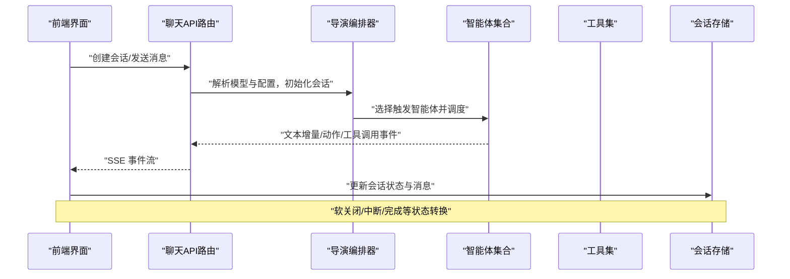
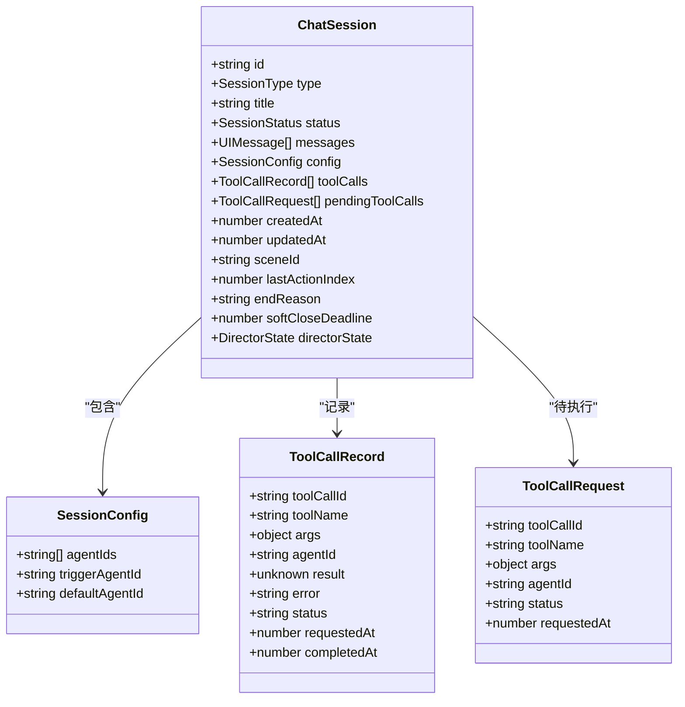

# 智能体管理

<cite>
**本文引用的文件**   
- [lib/types/chat.ts](file://lib/types/chat.ts)
- [app/api/chat/route.ts](file://app/api/chat/route.ts)
- [app/api/agent/edit/route.ts](file://app/api/agent/edit/route.ts)
- [lib/orchestration/registry/agent-selection.ts](file://lib/orchestration/registry/agent-selection.ts)
- [components/chat/use-chat-sessions.ts](file://components/chat/use-chat-sessions.ts)
- [lib/export/use-export-classroom.ts](file://lib/export/use-export-classroom.ts)
- [lib/pbl/v2/agents/planner.ts](file://lib/pbl/v2/agents/planner.ts)
- [components/scene-renderers/pbl/v2/hero.tsx](file://components/scene-renderers/pbl/v2/hero.tsx)
- [lib/agent/client/DESIGN-thread-persistence.md](file://lib/agent/client/DESIGN-thread-persistence.md)
</cite>

## 目录
- 产品概述
- 核心业务流程
- 功能模块清单
- 数据与状态
- 关键约束与边界

## 产品概述
OpenMAIC 是 AI 驱动的交互式课件（MAIC）生成与课堂管理平台，围绕“自然语言生成结构化课件、课堂实时互动（问答/讨论/测验）、课件编辑与回放”三大场景构建。智能体管理系统贯穿其中：负责智能体的注册与配置、生命周期编排、资源分配与负载均衡、角色权限控制、动态创建与销毁、以及跨智能体的通信与冲突解决。系统前端基于 Next.js + React + Zustand，AI 编排层使用 LangGraph + Vercel AI SDK，课件 DSL 由内部包定义，运行时通过 SSE/流式事件驱动多智能体协作。

## 核心业务流程
- 会话创建与智能体选择
  - 客户端根据设置或阶段默认值决定智能体集合（自动/预设模式），并构造会话与触发智能体。
  - 服务端接收请求后解析模型与思考配置，建立 SSE 流，按轮次推进对话与工具调用。
- 多智能体协作与消息流转
  - 服务端以事件流推送文本增量、动作、工具调用等；客户端维护会话状态、消息与工具调用记录。
  - 支持软关闭、中断、完成等状态机转换，保证并发与恢复一致性。
- 编辑智能体工作流
  - 编辑器侧通过专用端点将上下文（场景、选择元素、历史）注入智能体，SSE 回传 AgentEvent，实现内容再生成与动作编排。
- PBL 项目中的角色与任务编排
  - 规划器生成项目信息、里程碑、微任务与角色（如 Instructor），并在渲染层展示角色信息与引导流程。

图表来源 
- [app/api/chat/route.ts:67-97](file://app/api/chat/route.ts#L67-L97)
- [lib/types/chat.ts:158-177](file://lib/types/chat.ts#L158-L177)
- [components/chat/use-chat-sessions.ts:1892-1932](file://components/chat/use-chat-sessions.ts#L1892-L1932)

章节来源
- [app/api/chat/route.ts:67-97](file://app/api/chat/route.ts#L67-L97)
- [lib/types/chat.ts:158-177](file://lib/types/chat.ts#L158-L177)
- [components/chat/use-chat-sessions.ts:1892-1932](file://components/chat/use-chat-sessions.ts#L1892-L1932)

## 功能模块清单
- 会话与消息管理
  - 职责：维护会话类型（qa/discussion/lecture）、状态机（idle/active/soft-closing/interrupted/completed/error）、消息与工具调用记录。
  - 验收要点：状态转换正确、冲突时钟递增、流式事件完整、软关闭窗口有效。
- 智能体选择与配置
  - 职责：根据用户显式选择或阶段生成的智能体集合确定 mode（preset/auto）与 selectedAgentIds。
  - 验收要点：跨教室持久化策略正确、回退逻辑符合预期、仅允许有效智能体。
- 编辑智能体端点
  - 职责：接收编辑指令、注入场景上下文与选择元素、SSE 推送 AgentEvent、支持长时媒体生成。
  - 验收要点：上下文映射安全、历史裁剪合理、超时与中止处理完善。
- PBL 角色与任务编排
  - 职责：生成项目信息、里程碑、微任务与 Instructor 角色；渲染层展示角色信息与引导。
  - 验收要点：角色唯一性校验、系统提示锚定、任务结构清晰。
- 导出与清单
  - 职责：导出课堂 manifest，包含智能体元数据（名称、角色、人格、头像、颜色、优先级）。
  - 验收要点：兼容数据库与阶段生成配置、ID 到索引映射用于多智能体引用。

章节来源
- [lib/types/chat.ts:49-66](file://lib/types/chat.ts#L49-L66)
- [lib/orchestration/registry/agent-selection.ts:1-59](file://lib/orchestration/registry/agent-selection.ts#L1-L59)
- [app/api/agent/edit/route.ts:28-56](file://app/api/agent/edit/route.ts#L28-L56)
- [lib/pbl/v2/agents/planner.ts:630-685](file://lib/pbl/v2/agents/planner.ts#L630-L685)
- [lib/export/use-export-classroom.ts:79-117](file://lib/export/use-export-classroom.ts#L79-L117)

## 数据与状态
- 核心数据模型
  - 会话模型：包含 id、type、title、status、messages、config、toolCalls、pendingToolCalls、createdAt、updatedAt、sceneId、lastActionIndex、endReason、softCloseDeadline、directorState。
  - 消息与工具调用：UIMessage 附带 ChatMessageMetadata（发送者、角色、动作、智能体标识与颜色等）；ToolCallRequest/Record 描述工具调用的生命周期。
  - 会话事件：message、tool_request、tool_complete、agent_switch、session_status、error、done、text_start/delta/end。
- 状态流转与冲突顺序
  - nextChatUpdatedAt 确保单调递增的冲突顺序时钟；withChatSessionStatus/withChatSegmentSealed/withChatSegmentReveal 保障状态与片段揭示的一致性。
  - interruptActiveChatSessions 在刷新等场景标记中断，避免陈旧排序。
- 智能体选择与持久化
  - restoreAgentSelection 决定加载教室时的智能体模式与集合，区分用户显式选择与阶段默认，提供回退策略。
- 线程持久化（AgentBar）
  - 设计文档明确 per-course 轻量持久化：localStorage 键 maic-agent-threads，序列化精简消息（文本与工具卡片元数据），支持“新对话”按钮清空。

图表来源 
- [lib/types/chat.ts:49-153](file://lib/types/chat.ts#L49-L153)

章节来源
- [lib/types/chat.ts:49-153](file://lib/types/chat.ts#L49-L153)
- [lib/types/chat.ts:158-177](file://lib/types/chat.ts#L158-L177)
- [lib/orchestration/registry/agent-selection.ts:27-58](file://lib/orchestration/registry/agent-selection.ts#L27-L58)
- [lib/agent/client/DESIGN-thread-persistence.md:34-100](file://lib/agent/client/DESIGN-thread-persistence.md#L34-L100)

## 关键约束与边界
- 非功能性需求
  - 流式传输与超时：编辑端点 maxDuration=300s，支持 AbortSignal 取消；聊天 API 使用 TransformStream 与 SSE。
  - 冲突顺序与恢复：会话 updatedAt 单调递增，刷新时中断活跃会话，软关闭窗口提供缓冲。
  - 资源隔离：per-course 线程持久化，避免跨课程污染；localStorage 容量可控（精简投影）。
- 依赖与集成边界
  - 模型解析：chat 路由通过 resolveModel 解析 provider、apiKey、thinkingConfig；编辑路由按 stage 缓存模型解析结果。
  - 工具集与上下文：编辑端点注入 sceneContextMap、selection，限制工具调用参数可信来源。
  - PBL 角色边界：仅允许 instructor 类型角色，拒绝其他类型，确保渲染与行为一致。
- 业务约束
  - 智能体选择：用户显式选择可跨教室保留但需对当前阶段有效；无生成智能体时回退到预设或默认三件套。
  - 导出清单：agentId→index 映射用于多智能体引用，兼容 DB 与阶段生成配置。

章节来源
- [app/api/agent/edit/route.ts:22-26](file://app/api/agent/edit/route.ts#L22-L26)
- [app/api/chat/route.ts:67-97](file://app/api/chat/route.ts#L67-L97)
- [lib/types/chat.ts:109-117](file://lib/types/chat.ts#L109-L117)
- [lib/pbl/v2/agents/planner.ts:630-685](file://lib/pbl/v2/agents/planner.ts#L630-L685)
- [lib/export/use-export-classroom.ts:112-117](file://lib/export/use-export-classroom.ts#L112-L117)