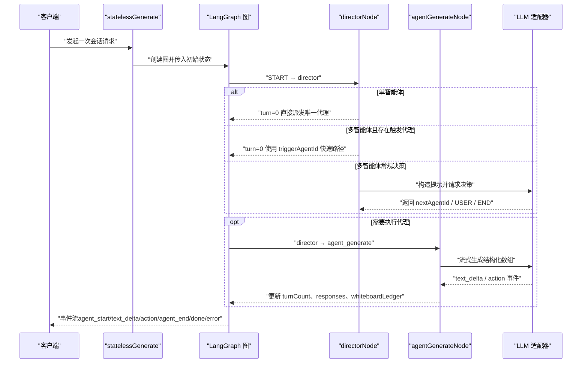
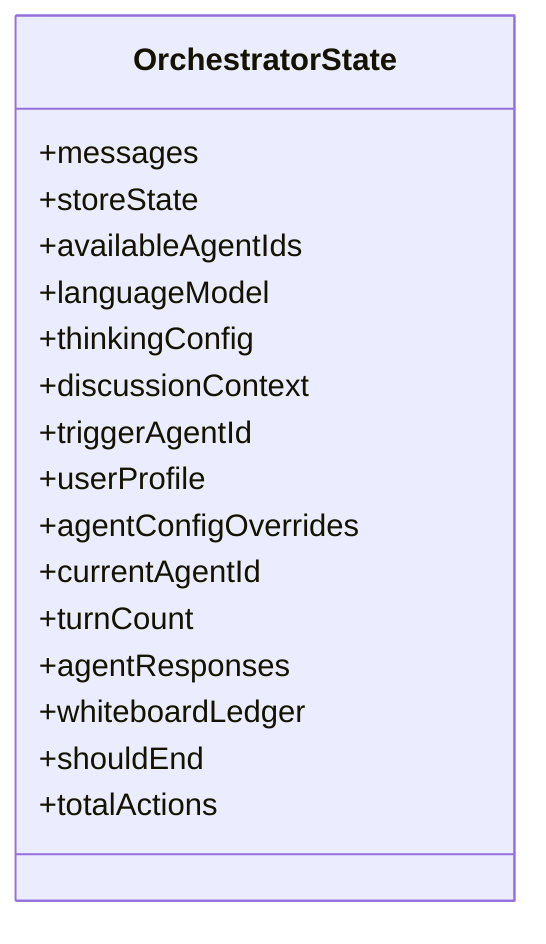
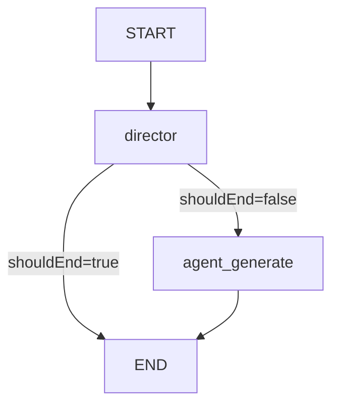
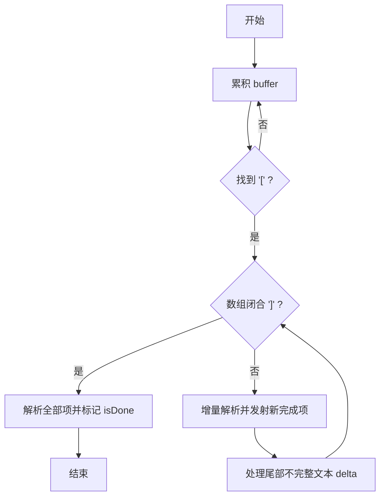

# 状态机设计

<cite>
**本文引用的文件**   
- [lib/orchestration/director-graph.ts](file://lib/orchestration/director-graph.ts)
- [lib/orchestration/stateless-generate.ts](file://lib/orchestration/stateless-generate.ts)
- [lib/orchestration/summarizers/state-context.ts](file://lib/orchestration/summarizers/state-context.ts)
- [lib/orchestration/types.ts](file://lib/orchestration/types.ts)
- [lib/orchestration/registry/types.ts](file://lib/orchestration/registry/types.ts)
- [lib/pbl/v2/runtime/learner-state.ts](file://lib/pbl/v2/runtime/learner-state.ts)
</cite>

## 目录
- 产品概述
- 核心业务流程
- 功能模块清单
- 数据与状态
- 关键约束与边界

## 产品概述
本系统为多智能体编排的状态机设计文档，聚焦基于 LangGraph 的 StateGraph 架构。通过“导演节点 + 生成节点”的单轮拓扑，结合无状态结构化输出解析器，实现教师、助教、学生等智能体的协作对话与白板/课件动作编排。状态机以请求为单位运行，服务端保持无状态；客户端串行发起多次请求驱动多轮讨论。状态定义清晰、转换规则明确、事件流可观测，便于调试与扩展。

## 核心业务流程
- 入口：statelessGenerate 接收 StatelessChatRequest，构建初始状态并启动图执行。
- 导演决策：directorNode 根据单/多智能体策略决定下一个发言者（含触发代理快速路径）。
- 智能体生成：agentGenerateNode 调用 LLM 流式生成结构化 JSON Array（文本与动作交错），并通过 writer 推送事件。
- 结束与回传：每轮结束后汇总 directorState（回合数、响应摘要、白板行动记录）返回给客户端，由客户端继续下一轮。

图表来源
- [lib/orchestration/stateless-generate.ts](file://lib/orchestration/stateless-generate.ts)
- [lib/orchestration/director-graph.ts](file://lib/orchestration/director-graph.ts)

章节来源
- [lib/orchestration/stateless-generate.ts](file://lib/orchestration/stateless-generate.ts)
- [lib/orchestration/director-graph.ts](file://lib/orchestration/director-graph.ts)

## 功能模块清单
- 状态机与图构建
  - 职责：定义 OrchestratorState、节点函数、边连接与条件分支，编译为可执行图。
  - 验收要点：单/多智能体策略正确；触发代理快速路径生效；shouldEnd 控制终止。
- 结构化输出解析器
  - 职责：增量解析 LLM 输出的 JSON Array，维护 ordered 序列，支持部分文本与动作交错流式输出。
  - 验收要点：jsonrepair/partial-json 双路容错；尾部不完整文本 delta 正确；finalizeParser 抑制结构化残留。
- 上下文摘要与状态注入
  - 职责：将 storeState（场景、白板、测验结果等）压缩为紧凑上下文，供提示词使用。
  - 验收要点：代码行预算、测验未提交/已提交的不同策略、冲突检测提示。
- 智能体注册与权限映射
  - 职责：角色到允许动作的映射、默认动作集、按角色过滤有效动作。
  - 验收要点：teacher/assistant/student 的动作集正确；sceneType 二次过滤生效。
- PBL 学习者状态（扩展）
  - 职责：提取/应用学习者项目状态，用于教学评估与任务推进。
  - 验收要点：里程碑/微任务状态同步、线程消息克隆与合并。

章节来源
- [lib/orchestration/director-graph.ts](file://lib/orchestration/director-graph.ts)
- [lib/orchestration/stateless-generate.ts](file://lib/orchestration/stateless-generate.ts)
- [lib/orchestration/summarizers/state-context.ts](file://lib/orchestration/summarizers/state-context.ts)
- [lib/orchestration/registry/types.ts](file://lib/orchestration/registry/types.ts)
- [lib/pbl/v2/runtime/learner-state.ts](file://lib/pbl/v2/runtime/learner-state.ts)

## 数据与状态
### 状态定义（OrchestratorState）
- 输入字段（仅进入时设置）
  - messages、storeState、availableAgentIds、languageModel、thinkingConfig、discussionContext、triggerAgentId、userProfile、agentConfigOverrides
- 可变字段（节点更新）
  - currentAgentId、turnCount、agentResponses（reducer 追加）、whiteboardLedger（reducer 追加）、shouldEnd、totalActions

图表来源
- [lib/orchestration/director-graph.ts](file://lib/orchestration/director-graph.ts)

### 状态转换与边连接
- START → director
- director 条件边：
  - shouldEnd = true → END
  - shouldEnd = false → agent_generate
- agent_generate → END

图表来源
- [lib/orchestration/director-graph.ts](file://lib/orchestration/director-graph.ts)

### 智能体生命周期与触发条件
- 单智能体模式
  - turn=0：直接派发唯一代理；turn≥1：提示用户发言并结束本轮。
- 多智能体模式
  - turn=0 且存在 triggerAgentId：快速路径派发触发代理。
  - 否则：LLM 决策 nextAgentId（可为 USER 或某代理 ID），若未知则结束。
- 代理生成阶段
  - 发送 agent_start → 流式 text_delta/action → agent_end。
  - 统计 actionCount、收集 whiteboardActions，更新 totalActions 与 agentResponses。

章节来源
- [lib/orchestration/director-graph.ts](file://lib/orchestration/director-graph.ts)

### 结构化输出解析状态（ParserState）
- 字段：buffer、jsonStarted、lastParsedItemCount、lastPartialTextLength、isDone
- 流程：累积缓冲 → 定位首个 [ → 增量解析 → 发射完整项 → 处理尾部不完整文本 → 关闭标记 isDone

图表来源
- [lib/orchestration/stateless-generate.ts](file://lib/orchestration/stateless-generate.ts)

### 上下文状态摘要（buildStateContext）
- 包含：模式、白板开关、课程信息、当前场景类型与元素摘要、测验题目与结果（已提交/未提交）、最近白板内容、冲突提示。
- 作用：为提示词提供精简但关键的运行时上下文，避免泄露敏感细节。

章节来源
- [lib/orchestration/summarizers/state-context.ts](file://lib/orchestration/summarizers/state-context.ts)

### PBL 学习者状态（PBLLearnerState）
- 字段：uiPhase、status、milestones、submissions、evaluations、threads、engagementEvents、proficiencyAssessment、pendingHandover、pendingTaskCompletion、runtimeResetEpoch
- 用途：在 PBL 场景中驱动学习进度、评估与交互线程。

章节来源
- [lib/pbl/v2/runtime/learner-state.ts](file://lib/pbl/v2/runtime/learner-state.ts)

## 关键约束与边界
- 无状态后端
  - 所有状态随请求传递（包括 agentConfigOverrides、storeState、directorState），服务端不持久化。
- 单轮拓扑限制
  - 每个请求最多一次 director→agent 循环；多轮由客户端串行驱动，无需 maxTurns。
- 动作权限与安全
  - 角色到动作映射（ROLE_ACTIONS）与 sceneType 二次过滤（getEffectiveActions）确保越权动作被拒绝。
- 错误处理
  - 代理生成异常捕获并输出 error 事件；AbortError 中断请求；finalizeParser 抑制结构化残留，防止 JSON 泄漏。
- 并发与流式
  - 通过 config.writer 推送 StatelessEvent；abortSignal 支持取消；ordered 序列保证文本与动作交错顺序。
- 性能与预算
  - 代码行渲染预算（createCodeRenderBudget/renderCodeLines）控制上下文大小；白板上旧代码块不会饿死新块。

章节来源
- [lib/orchestration/stateless-generate.ts](file://lib/orchestration/stateless-generate.ts)
- [lib/orchestration/director-graph.ts](file://lib/orchestration/director-graph.ts)
- [lib/orchestration/registry/types.ts](file://lib/orchestration/registry/types.ts)
- [lib/orchestration/summarizers/state-context.ts](file://lib/orchestration/summarizers/state-context.ts)