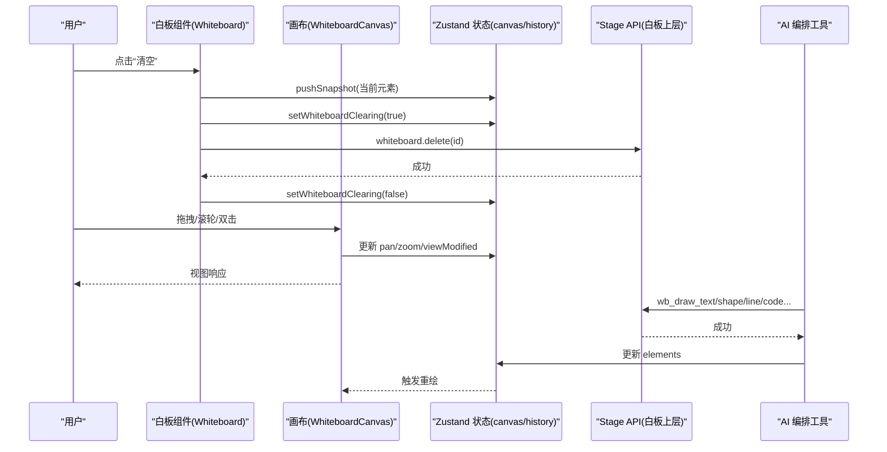
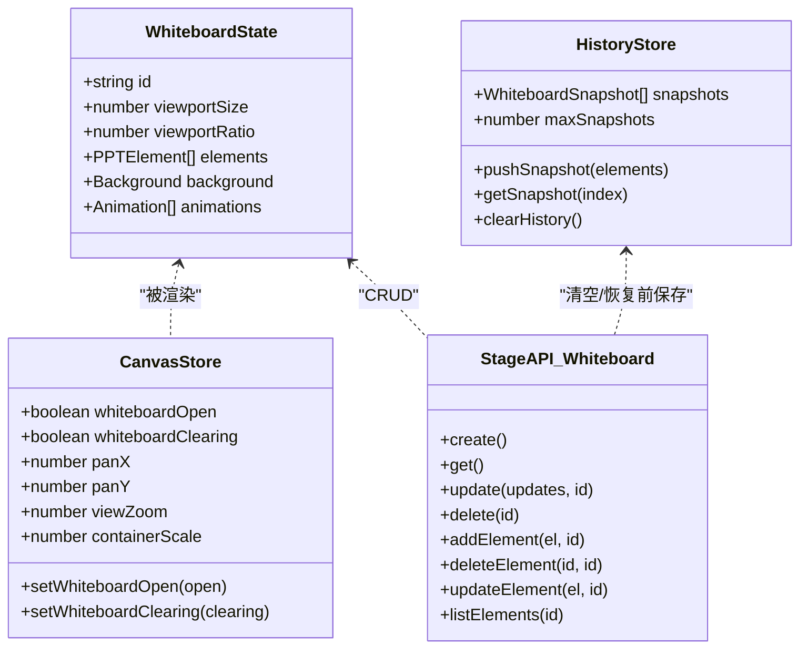

# 白板协作功能

<cite>
**本文引用的文件**   
- [components/whiteboard/index.tsx](file://components/whiteboard/index.tsx)
- [components/whiteboard/whiteboard-canvas.tsx](file://components/whiteboard/whiteboard-canvas.tsx)
- [components/whiteboard/whiteboard-history.tsx](file://components/whiteboard/whiteboard-history.tsx)
- [lib/store/whiteboard-history.ts](file://lib/store/whiteboard-history.ts)
- [lib/api/stage-api-whiteboard.ts](file://lib/api/stage-api-whiteboard.ts)
- [lib/store/canvas.ts](file://lib/store/canvas.ts)
- [lib/hooks/use-canvas-operations.ts](file://lib/hooks/use-canvas-operations.ts)
- [lib/orchestration/summarizers/whiteboard-conflicts.ts](file://lib/orchestration/summarizers/whiteboard-conflicts.ts)
- [lib/orchestration/summarizers/whiteboard-ledger.ts](file://lib/orchestration/summarizers/whiteboard-ledger.ts)
- [lib/chat/pi/tools/classroom-actions.ts](file://lib/chat/pi/tools/classroom-actions.ts)
</cite>

## 目录
- 产品概述
- 核心业务流程
- 功能模块清单
- 数据与状态
- 关键约束与边界

## 产品概述
本仓库中的白板协作能力围绕“多用户实时协作”的核心目标，提供以下关键能力：
- 基于前端状态驱动的白板画布（平移、缩放、清空动画）与历史快照恢复机制。
- 通过编排层工具将 AI Agent 的绘图动作（文本、形状、表格、代码、公式、线条等）转化为对白板的变更操作，并生成冲突检测摘要辅助模型决策。
- 以 Zustand Store 为中心的状态管理，结合 Stage API 对白板进行增删改查，保证操作的原子性与一致性。
- 面向课堂场景的工具链集成，支持在聊天/编排流程中调用白板绘制工具，形成“对话—绘图—校验—回放”的闭环。

该方案强调：
- 交互体验优先：平滑动画、视图自适应、双击复位、滚动缩放。
- 可观测性优先：冲突检测摘要、历史快照、元素指纹去重。
- 可扩展性优先：工具注册式扩展、虚拟上下文构建、预算控制。

## 核心业务流程
白板协作的关键链路包括：
- 打开/关闭白板：组件挂载后监听容器尺寸变化，计算初始缩放比例；关闭时清理事件与定时器。
- 清空与恢复：清空前保存快照，执行级联退出动画后再删除元素；恢复时事务性替换所有元素，避免中间态。
- 视图交互：拖拽平移、滚轮缩放、双击复位；根据容器与画布尺寸动态计算边界与变换矩阵。
- AI 绘图：通过编排工具触发 wb_draw_* 系列动作，更新本地状态并渲染元素；必要时生成冲突摘要供上层决策。
- 历史回溯：按时间顺序展示快照，支持一键恢复到指定版本，自动跳过无变更恢复。

图表来源
- [components/whiteboard/index.tsx](file://components/whiteboard/index.tsx)
- [components/whiteboard/whiteboard-canvas.tsx](file://components/whiteboard/whiteboard-canvas.tsx)
- [lib/api/stage-api-whiteboard.ts](file://lib/api/stage-api-whiteboard.ts)
- [lib/store/canvas.ts](file://lib/store/canvas.ts)
- [lib/store/whiteboard-history.ts](file://lib/store/whiteboard-history.ts)

章节来源
- [components/whiteboard/index.tsx](file://components/whiteboard/index.tsx)
- [components/whiteboard/whiteboard-canvas.tsx](file://components/whiteboard/whiteboard-canvas.tsx)
- [lib/api/stage-api-whiteboard.ts](file://lib/api/stage-api-whiteboard.ts)
- [lib/store/whiteboard-history.ts](file://lib/store/whiteboard-history.ts)

## 功能模块清单
- 白板容器与工具栏
  - 职责：承载画布、提供清空/历史/最小化等操作入口，维护视图修改状态提示。
  - 验收要点：清空动画流畅、历史记录面板弹出/收起正常、视图复位按钮可用。
- 画布交互层
  - 职责：实现平移、缩放、边界限制、双击复位、空态占位、元素入场/出场动画。
  - 验收要点：滚轮缩放以光标为中心、拖拽不越界、元素数量变化时自动复位视图。
- 历史快照与恢复
  - 职责：记录破坏性操作前的快照，限制最大数量，支持按索引恢复，去重避免重复快照。
  - 验收要点：恢复时跳过无变更、清空动画进行中禁止恢复、恢复失败有明确提示。
- Stage API（白板 CRUD）
  - 职责：创建/获取/更新/删除白板及元素，统一错误返回格式。
  - 验收要点：未找到白板时返回错误、批量更新原子性、新增元素自动生成 ID。
- 冲突检测摘要
  - 职责：基于几何计算输出重叠、穿线、越界等冲突文本，供编排系统消费。
  - 验收要点：阈值合理、输出简洁可读、空结果返回空串。
- 虚拟上下文构建
  - 职责：回放本轮 ledger 到初始快照，生成元素列表与代码行预算，便于后续编辑。
  - 验收要点：代码块行 ID 分配稳定、预算优先级正确、无变更时返回空串。
- 编排工具集成
  - 职责：注册 wb_draw_* / wb_edit_code / wb_clear 等工具，暴露参数校验与执行路径。
  - 验收要点：工具按需启用、参数类型安全、执行结果回写状态。

章节来源
- [components/whiteboard/index.tsx](file://components/whiteboard/index.tsx)
- [components/whiteboard/whiteboard-canvas.tsx](file://components/whiteboard/whiteboard-canvas.tsx)
- [components/whiteboard/whiteboard-history.tsx](file://components/whiteboard/whiteboard-history.tsx)
- [lib/store/whiteboard-history.ts](file://lib/store/whiteboard-history.ts)
- [lib/api/stage-api-whiteboard.ts](file://lib/api/stage-api-whiteboard.ts)
- [lib/orchestration/summarizers/whiteboard-conflicts.ts](file://lib/orchestration/summarizers/whiteboard-conflicts.ts)
- [lib/orchestration/summarizers/whiteboard-ledger.ts](file://lib/orchestration/summarizers/whiteboard-ledger.ts)
- [lib/chat/pi/tools/classroom-actions.ts](file://lib/chat/pi/tools/classroom-actions.ts)

## 数据与状态
- 核心数据模型
  - 白板对象：包含 id、viewportSize、viewportRatio、elements、background、animations 等字段。
  - 元素集合：PPTElement 数组，支持 text/latex/shape/table/chart/code/image/line 等类型。
  - 历史快照：elements 深拷贝 + timestamp + fingerprint（用于去重）。
- 关键状态流转
  - 画布状态：panX/panY、viewZoom、isPanning、isResetting、containerScale。
  - 白板状态：whiteboardOpen、whiteboardClearing、elements。
  - 历史状态：snapshots 栈（最多 N 条），pushSnapshot 时做指纹去重。
- 数据所有权边界
  - UI 状态（平移/缩放/面板开关）由 canvas store 管理。
  - 业务数据（白板元素）由 stage store 管理，通过 Stage API 访问。
  - 历史快照为会话内内存存储，不持久化。

图表来源
- [lib/api/stage-api-whiteboard.ts](file://lib/api/stage-api-whiteboard.ts)
- [lib/store/canvas.ts](file://lib/store/canvas.ts)
- [lib/store/whiteboard-history.ts](file://lib/store/whiteboard-history.ts)

章节来源
- [lib/api/stage-api-whiteboard.ts](file://lib/api/stage-api-whiteboard.ts)
- [lib/store/canvas.ts](file://lib/store/canvas.ts)
- [lib/store/whiteboard-history.ts](file://lib/store/whiteboard-history.ts)

## 关键约束与边界
- 性能与交互约束
  - 画布尺寸固定（1000×562.5），容器缩放基于 ResizeObserver 计算，避免频繁重排。
  - 清空动画时长按元素数量线性增长但上限封顶，保障用户体验。
  - 缩放范围限制（0.2~5），平移边界随缩放动态调整，防止内容不可见。
- 一致性与并发
  - 恢复操作使用一次 update 替换全部元素，避免多次 delete/add 导致的中间态。
  - 历史快照使用指纹去重，避免重复保存相同内容。
  - 清空动画进行中禁止恢复，防止时序竞争覆盖已恢复内容。
- 编排与冲突处理
  - 冲突检测仅作为摘要信息，不直接修改数据，由上层策略决定修复方式。
  - 代码行预算按“本轮最新优先”的顺序分配，确保后续编辑能拿到稳定的行 ID。
- 离线与持久化
  - 当前历史快照为内存存储，刷新即丢失；如需离线支持需引入 IndexedDB 或后端同步。
  - 网络异常时 Stage API 返回错误对象，UI 层通过 toast 提示，未实现重试队列。

章节来源
- [components/whiteboard/whiteboard-canvas.tsx](file://components/whiteboard/whiteboard-canvas.tsx)
- [components/whiteboard/index.tsx](file://components/whiteboard/index.tsx)
- [lib/store/whiteboard-history.ts](file://lib/store/whiteboard-history.ts)
- [lib/orchestration/summarizers/whiteboard-conflicts.ts](file://lib/orchestration/summarizers/whiteboard-conflicts.ts)
- [lib/orchestration/summarizers/whiteboard-ledger.ts](file://lib/orchestration/summarizers/whiteboard-ledger.ts)