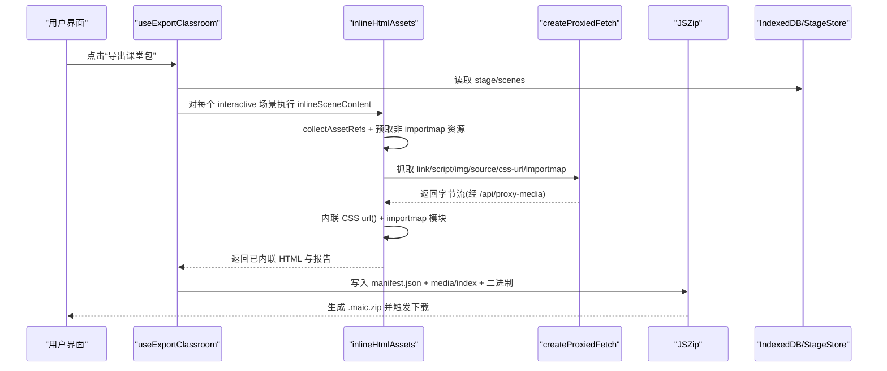
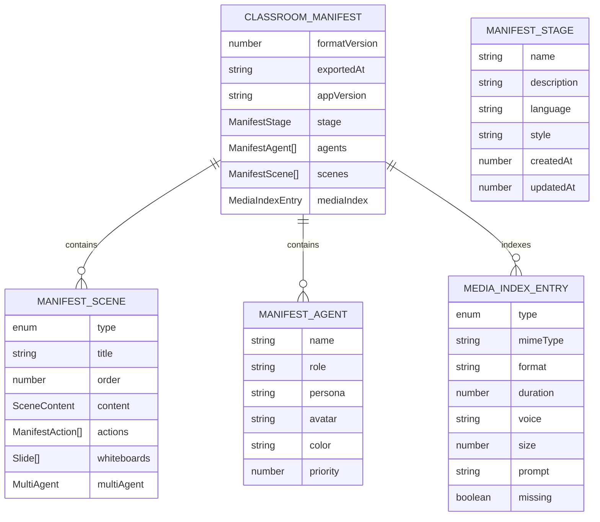
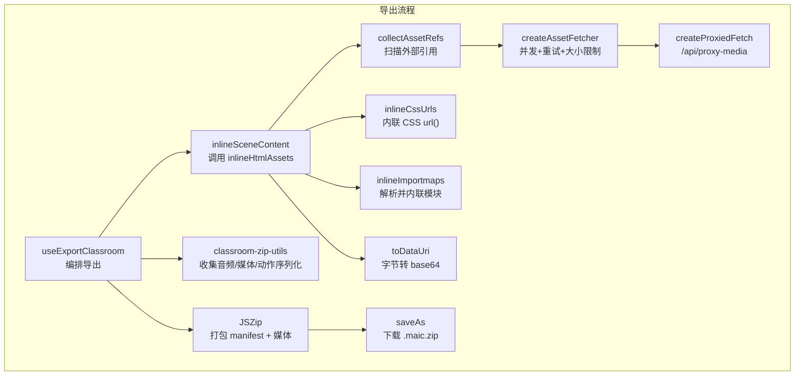
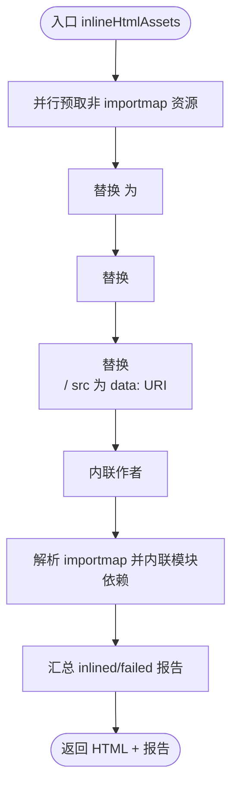
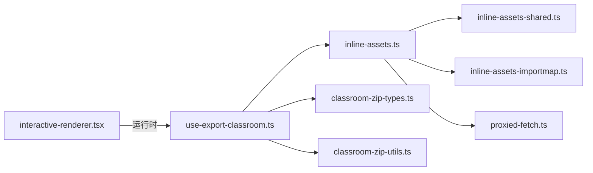

# HTML 导出

<cite>
**本文引用的文件**   
- [lib/export/inline-assets.ts](file://lib/export/inline-assets.ts)
- [lib/export/inline-assets-shared.ts](file://lib/export/inline-assets-shared.ts)
- [lib/export/inline-assets-importmap.ts](file://lib/export/inline-assets-importmap.ts)
- [lib/export/proxied-fetch.ts](file://lib/export/proxied-fetch.ts)
- [lib/export/use-export-classroom.ts](file://lib/export/use-export-classroom.ts)
- [lib/export/classroom-zip-types.ts](file://lib/export/classroom-zip-types.ts)
- [lib/export/classroom-zip-utils.ts](file://lib/export/classroom-zip-utils.ts)
- [components/scene-renderers/interactive-renderer.tsx](file://components/scene-renderers/interactive-renderer.tsx)
</cite>

## 产品概述
本章节聚焦于 OpenMAIC 的“HTML 导出”能力：将交互式课件（DSL 中的 interactive 场景）转换为可离线运行的自包含 HTML，并打包为 .maic.zip 供课堂分发与回放。核心目标包括：
- DSL 到 HTML 的转换：对交互式场景的 HTML 进行资源内联、CSS url() 处理、importmap 模块内联与依赖解析。
- 离线支持机制：通过代理抓取跨域资源、数据 URI 内联、ZIP 打包与清单索引，确保无网络环境可用。
- 配置与定制：提供主题、交互行为与响应式设置的扩展点；在渲染层保持 iframe 隔离与生命周期管理。
- 性能与兼容性：并发抓取、大小限制、MIME 推断、字体优化与失败回退策略，提升导出成功率与加载速度。

## 核心业务流程
- 触发导出：用户在界面发起“导出课堂包”，系统读取当前 Stage 与 Scenes。
- 内容预处理：对每个 Scene 的 content.type === 'interactive' 且含 html 字段的内容执行资源内联。
- 资源抓取与内联：
  - 扫描 <link>/<script>//<source>/css url()/importmap 引用。
  - 通过代理 fetch 获取远端资源，转 data: URI 内联。
  - CSS 中 url() 递归内联，优先 woff2 字体优化。
  - importmap 模块静态分析 + 递归依赖解析，生成内联映射。
- 打包与下载：构建 manifest.json、媒体索引、音频/图片等二进制文件，生成 ZIP 并触发下载。
- 反馈与容错：汇总内联成功/失败报告，提示部分失败的主机来源，保障用户体验。

图表来源
- [lib/export/use-export-classroom.ts:48-215](file://lib/export/use-export-classroom.ts#L48-L215)
- [lib/export/inline-assets.ts:282-381](file://lib/export/inline-assets.ts#L282-L381)
- [lib/export/proxied-fetch.ts:7-17](file://lib/export/proxied-fetch.ts#L7-L17)

章节来源
- [lib/export/use-export-classroom.ts:48-215](file://lib/export/use-export-classroom.ts#L48-L215)
- [lib/export/inline-assets.ts:282-381](file://lib/export/inline-assets.ts#L282-L381)

## 功能模块清单
- 资源收集与抓取
  - 职责：扫描 HTML 中的外部引用，统一通过代理 fetch 获取，支持重试与大小限制。
  - 验收要点：正确识别 link/script/img/source/css-url/importmap；失败项记录原因；大文件跳过。
- CSS 内联与字体优化
  - 职责：递归内联 css url()，@font-face 块优先 woff2，其余格式置 about:invalid 避免多余请求。
  - 验收要点：woff2 存在时不内联其他字体；相对路径正确解析；失败项统计。
- Importmap 模块内联
  - 职责：静态分析 type="module" 脚本中的 import/export 语句，按 importmap 规则解析绝对 URL，递归抓取子依赖并生成 data: URI 映射。
  - 验收要点：保留原 importmap 前缀作为在线回退；精确匹配优先；长前缀匹配正确。
- 课堂包打包与清单
  - 职责：聚合 Stage/Agents/Scenes/Media，生成 manifest.json 与 mediaIndex，写入音频/图片/海报等二进制。
  - 验收要点：音频 ID→zipPath 映射正确；讨论动作 agentId→agentIndex 兼容；缺失音频标记 missing。
- 渲染与隔离
  - 职责：交互式场景通过 iframe 池化与占位符组件挂载，保证跨模式切换不丢失状态。
  - 验收要点：iframe 可见性由 pool 控制；HTML 注入前进行必要补丁。

章节来源
- [lib/export/inline-assets.ts:22-100](file://lib/export/inline-assets.ts#L22-L100)
- [lib/export/inline-assets.ts:158-213](file://lib/export/inline-assets.ts#L158-L213)
- [lib/export/inline-assets-importmap.ts:28-67](file://lib/export/inline-assets-importmap.ts#L28-L67)
- [lib/export/classroom-zip-utils.ts:20-80](file://lib/export/classroom-zip-utils.ts#L20-L80)
- [components/scene-renderers/interactive-renderer.tsx:22-36](file://components/scene-renderers/interactive-renderer.tsx#L22-L36)

## 数据与状态
- 导出清单模型（ClassroomManifest）
  - 字段：formatVersion、exportedAt、appVersion、stage、agents、scenes、mediaIndex。
  - 作用：描述一次导出的元数据、阶段信息、智能体集合、场景清单与媒体索引。
- 场景清单（ManifestScene）
  - 字段：type、title、order、content、actions、whiteboards、multiAgent。
  - 作用：序列化每个场景的结构与内容，actions 中 audioRef/agentIndex 用于导入还原。
- 媒体索引（MediaIndexEntry）
  - 字段：type(audio/image/generated)、mimeType/format/duration/voice/size/prompt/missing。
  - 作用：记录 zip 内媒体文件的元信息与缺失标记，便于导入校验与提示。
- 内联报告（InlineReport）
  - 字段：inlined[]、failed[{url, reason}]。
  - 作用：追踪哪些资源被成功内联或失败，辅助诊断与降级提示。

图表来源
- [lib/export/classroom-zip-types.ts:9-74](file://lib/export/classroom-zip-types.ts#L9-L74)

章节来源
- [lib/export/classroom-zip-types.ts:9-74](file://lib/export/classroom-zip-types.ts#L9-L74)
- [lib/export/inline-assets-shared.ts:1-26](file://lib/export/inline-assets-shared.ts#L1-L26)

## 关键约束与边界
- 资源大小限制
  - 默认最大单资源 8MB，超过则跳过内联并计入失败列表，避免内存溢出与导出卡顿。
- 并发与重试
  - 资源抓取采用并发上限（如 8），失败自动重试最多 3 次，指数退避（150ms、300ms）。
- CORS 与代理
  - 直接跨域 fetch 会被浏览器拦截，使用 createProxiedFetch 统一走 /api/proxy-media，服务端做 SSRF 校验后返回字节。
- 字体优化
  - @font-face 块若包含 woff2，仅内联 woff2，其他字体格式改写为 about:invalid，减少冗余请求。
- Importmap 解析
  - 仅处理 type="module" 的非 importmap 脚本；保留原始 importmap 前缀作为在线回退，确保未静态分析的动态导入仍可解析。
- 错误与降级
  - 抓取失败记录原因；部分失败时提示主机来源；最终仍生成 ZIP，保证可用性。
- 渲染隔离
  - 交互式 HTML 在 iframe 中运行，避免样式/脚本污染主应用；占位符组件负责可见性与尺寸同步。

章节来源
- [lib/export/inline-assets.ts:61-100](file://lib/export/inline-assets.ts#L61-L100)
- [lib/export/inline-assets.ts:158-213](file://lib/export/inline-assets.ts#L158-L213)
- [lib/export/inline-assets-importmap.ts:28-67](file://lib/export/inline-assets-importmap.ts#L28-L67)
- [lib/export/proxied-fetch.ts:7-17](file://lib/export/proxied-fetch.ts#L7-L17)
- [components/scene-renderers/interactive-renderer.tsx:22-36](file://components/scene-renderers/interactive-renderer.tsx#L22-L36)

## 架构总览

图表来源
- [lib/export/use-export-classroom.ts:48-215](file://lib/export/use-export-classroom.ts#L48-L215)
- [lib/export/inline-assets.ts:282-381](file://lib/export/inline-assets.ts#L282-L381)
- [lib/export/inline-assets-shared.ts:1-26](file://lib/export/inline-assets-shared.ts#L1-L26)
- [lib/export/classroom-zip-utils.ts:20-80](file://lib/export/classroom-zip-utils.ts#L20-L80)
- [lib/export/proxied-fetch.ts:7-17](file://lib/export/proxied-fetch.ts#L7-L17)

## 详细组件分析

### 资源内联引擎（inline-html-assets）
- 扫描阶段
  - 正则匹配 link/script/img/source/css-url/importmap，过滤 application/json 与 importmap 标签本身。
- 抓取阶段
  - createAssetFetcher 提供缓存、重试、大小限制与 MIME 推断；失败项记录原因。
- 内联阶段
  - <link rel=stylesheet> → <style> 并内联其 url()。
  - <script src> → data: URI（排除 importmap）。
  - /<source> src → data: URI。
  - 作者 <style> 块内的 url() 递归内联（跳过步骤 1 生成的块）。
  - importmap：静态分析 module 脚本，递归解析依赖，生成 data: URI 映射并合并回 importmap。
- 输出
  - 返回已内联 HTML 与 InlineReport（inlined/failed）。

图表来源
- [lib/export/inline-assets.ts:282-381](file://lib/export/inline-assets.ts#L282-L381)
- [lib/export/inline-assets.ts:158-213](file://lib/export/inline-assets.ts#L158-L213)
- [lib/export/inline-assets-importmap.ts:28-67](file://lib/export/inline-assets-importmap.ts#L28-L67)

章节来源
- [lib/export/inline-assets.ts:22-100](file://lib/export/inline-assets.ts#L22-L100)
- [lib/export/inline-assets.ts:282-381](file://lib/export/inline-assets.ts#L282-L381)

### 代理抓取（proxied-fetch）
- 目的：绕过浏览器 CORS 限制，统一通过同域 /api/proxy-media 获取远端资源。
- 实现：将输入 URL POST 到代理端点，服务端校验后返回字节流。
- 适用：CDN 资源、跨域图片/音视频等。

章节来源
- [lib/export/proxied-fetch.ts:7-17](file://lib/export/proxied-fetch.ts#L7-L17)

### 课堂包打包（use-export-classroom）
- 流程
  - 读取 Stage/Scenes，准备 PBL 场景持久化。
  - 收集 Agent、Audio、Media 文件，构建映射。
  - 对每个 Scene 的 interactive 内容执行 inlineSceneContent。
  - 构建 manifest.json、mediaIndex，写入二进制文件。
  - 生成 ZIP 并下载，提示部分失败情况。
- 关键点
  - 共享 fetcher 复用连接与缓存。
  - actionsToManifest 将 audioId→audioRef、agentId→agentIndex 转换。
  - 缺失音频标记 missing，便于导入侧提示。

章节来源
- [lib/export/use-export-classroom.ts:48-215](file://lib/export/use-export-classroom.ts#L48-L215)
- [lib/export/classroom-zip-utils.ts:52-80](file://lib/export/classroom-zip-utils.ts#L52-L80)

### 渲染与隔离（interactive-renderer）
- 职责：为交互式场景提供 iframe 占位与生命周期管理，确保跨模式切换不丢失状态。
- 机制：注册内容至 keep-alive 池，标记活跃与可视区域，卸载时隐藏而非销毁。
- 注入：在挂载前对 HTML 进行必要补丁（如基础 meta/样式），保证 iframe 内独立运行。

章节来源
- [components/scene-renderers/interactive-renderer.tsx:22-36](file://components/scene-renderers/interactive-renderer.tsx#L22-L36)

## 依赖关系图

图表来源
- [lib/export/use-export-classroom.ts:48-215](file://lib/export/use-export-classroom.ts#L48-L215)
- [lib/export/inline-assets.ts:282-381](file://lib/export/inline-assets.ts#L282-L381)
- [lib/export/inline-assets-shared.ts:1-26](file://lib/export/inline-assets-shared.ts#L1-L26)
- [lib/export/inline-assets-importmap.ts:28-67](file://lib/export/inline-assets-importmap.ts#L28-L67)
- [lib/export/classroom-zip-types.ts:9-74](file://lib/export/classroom-zip-types.ts#L9-L74)
- [lib/export/classroom-zip-utils.ts:20-80](file://lib/export/classroom-zip-utils.ts#L20-L80)
- [lib/export/proxied-fetch.ts:7-17](file://lib/export/proxied-fetch.ts#L7-L17)
- [components/scene-renderers/interactive-renderer.tsx:22-36](file://components/scene-renderers/interactive-renderer.tsx#L22-L36)

## 性能考虑
- 并发抓取：限制并发度（如 8），避免阻塞与过多连接。
- 资源去重：Map 缓存 URL→Promise，重复请求直接复用。
- 大小限制：默认 8MB，防止超大资源导致内存压力。
- 字体优化：@font-face 优先 woff2，其他格式置空，减少请求。
- 预取预热：先并行抓取非 importmap 资源，后续顺序替换命中缓存。
- 失败快速回退：失败项记录原因，不影响整体导出。

[本节为通用指导，无需源码引用]

## 故障排除指南
- 常见失败原因
  - 跨域限制：确认已通过 createProxiedFetch 走 /api/proxied-media。
  - 资源过大：检查 maxAssetBytes 设置，必要时拆分或外链。
  - 网络不稳定：重试次数与退避策略已内置，可观察 failed 列表定位主机。
  - importmap 未解析：确认 type="module" 且 import 语句可被静态分析捕获。
- 排查步骤
  - 查看 InlineReport.failed，提取 host 定位问题源站。
  - 检查 CSS 中 url() 是否被正确内联，woff2 是否存在。
  - 验证 manifest.mediaIndex 中是否有 missing 标记的音频。
- 建议优化
  - 对高频 CDN 启用本地缓存或镜像。
  - 压缩图片与音频，减小 ZIP 体积。
  - 按需内联，避免不必要的大模块。

章节来源
- [lib/export/inline-assets.ts:61-100](file://lib/export/inline-assets.ts#L61-L100)
- [lib/export/use-export-classroom.ts:217-233](file://lib/export/use-export-classroom.ts#L217-L233)

## 结论
OpenMAIC 的 HTML 导出以“资源内联 + 代理抓取 + importmap 解析 + ZIP 打包”为核心链路，实现了交互式课件的离线可用与高保真回放。通过并发与大小限制、字体优化与失败回退，兼顾了性能与鲁棒性。结合 iframe 隔离与 keep-alive 池，保证了复杂交互场景的稳定呈现。建议在大规模分发时配合 CDN 镜像与资源瘦身策略，进一步提升体验。

[本节为总结性内容，无需源码引用]