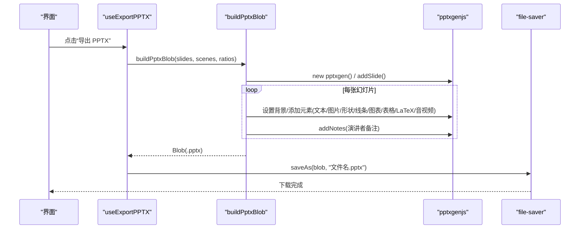
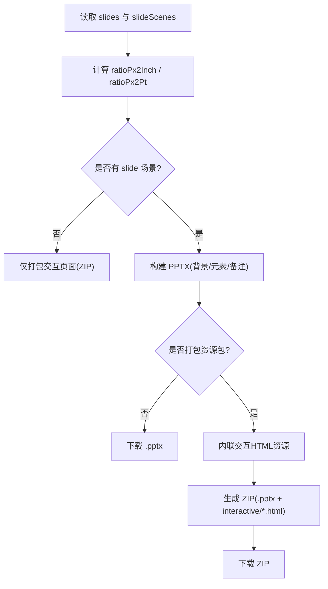
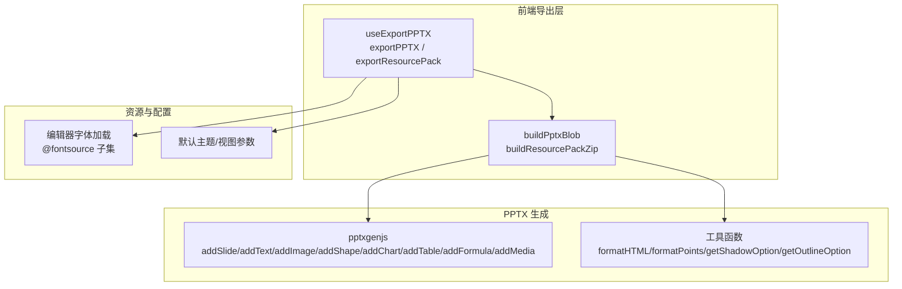
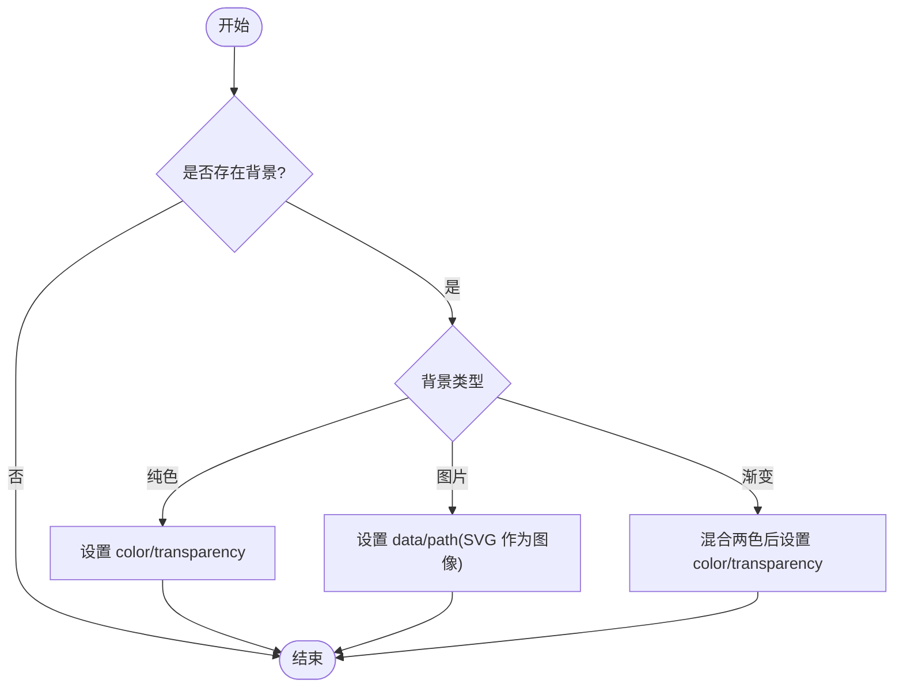
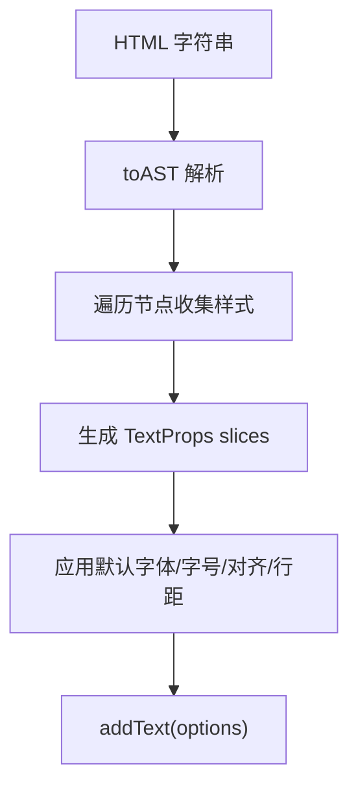
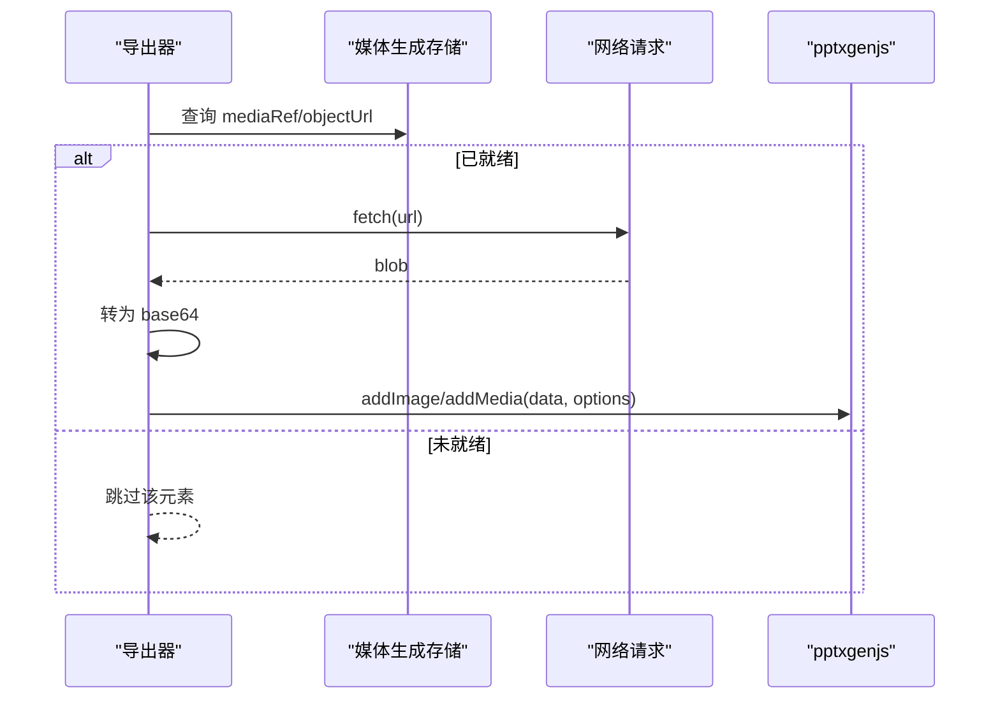
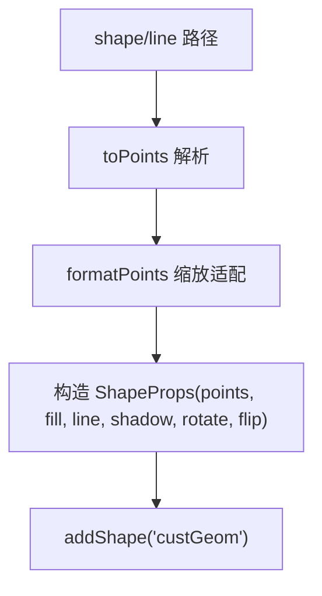
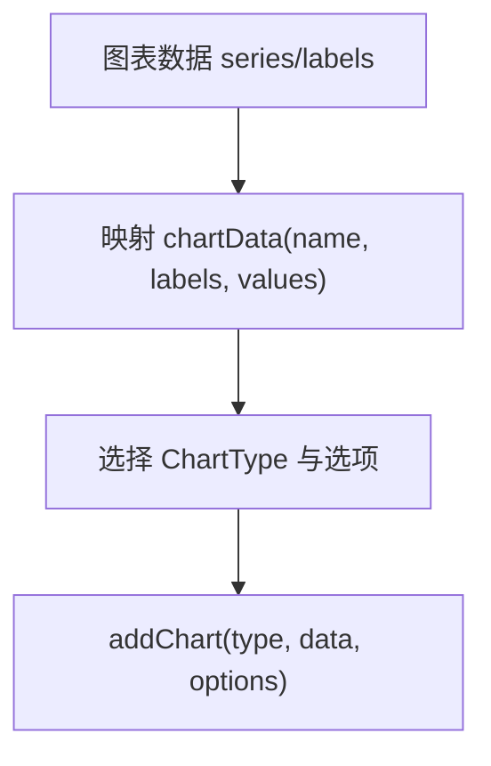
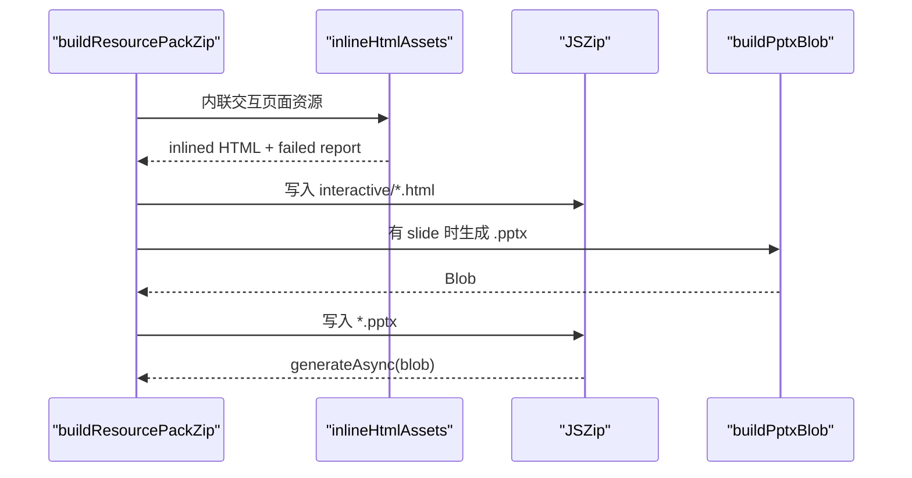
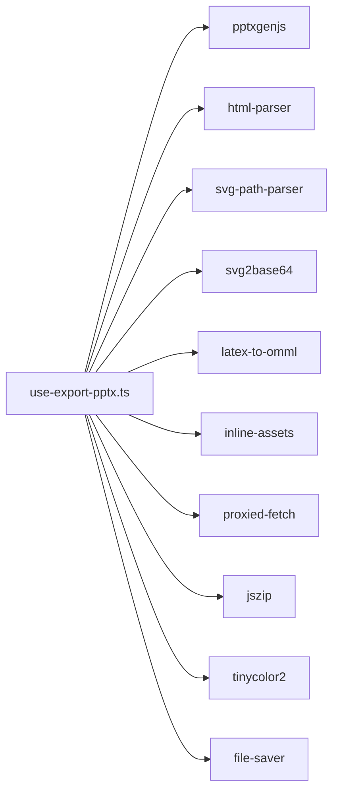

# PPTX 导出

<cite>
**本文引用的文件**   
- [use-export-pptx.ts](file://lib/export/use-export-pptx.ts)
- [core-interfaces.ts](file://packages/pptxgenjs/src/core-interfaces.ts)
- [classroom-zip-types.ts](file://lib/export/classroom-zip-types.ts)
- [classroom-zip-utils.ts](file://lib/export/classroom-zip-utils.ts)
- [editor-fonts.ts](file://app/editor-fonts.ts)
- [font.ts](file://configs/font.ts)
- [stage-api-defaults.ts](file://lib/api/stage-api-defaults.ts)
- [background.test.ts](file://tests/edit/round-trip/background.test.ts)
- [SlideElement.tsx](file://packages/@openmaic/renderer/src/SlideElement.tsx)
</cite>

## 产品概述
本模块提供将 OpenMAIC 课件数据导出为 PowerPoint（.pptx）的能力，核心目标包括：
- 将幻灯片元素（文本、图片、形状、线条、图表、表格、公式、音视频）高保真映射到 PPTX 结构
- 保留文本格式（字体、字号、颜色、加粗/斜体、下划线/删除线、对齐、行距、项目符号与缩进、超链接）
- 嵌入图片与媒体资源（本地 base64、远程 URL 抓取后内嵌、视频封面图自动生成）
- 支持背景（纯色、图片、渐变）、阴影、描边、透明度、旋转与翻转等样式
- 生成演讲者备注（从场景动作中提取语音文本）
- 提供“仅 PPTX”和“资源包（PPTX + 交互 HTML 页面 ZIP）”两种导出模式
- 通过 pptxgenjs 库完成最终 .pptx 构建，并基于视口比例进行尺寸换算

适用场景：教师/讲师快速将交互式课件导出为可离线播放的 PPTX；同时可将互动页面打包为 ZIP 供分发。

## 核心业务流程
- 入口：React Hook 暴露 exportPPTX 与 exportResourcePack 两个动作
- 数据准备：从状态中获取 slides（幻灯片画布）与 slideScenes（对应场景），计算 px→inch/pt 换算比
- 构建 PPTX：遍历每张幻灯片，设置布局、背景、元素（文本/图片/形状/线条/图表/表格/LaTeX/音视频），写入备注
- 输出：生成 Blob 并通过 file-saver 下载；或打包为 ZIP（含交互 HTML 页面）

**章节来源**
- [use-export-pptx.ts:1172-1307](file://lib/export/use-export-pptx.ts#L1172-L1307)
- [use-export-pptx.ts:366-1093](file://lib/export/use-export-pptx.ts#L366-L1093)

## 功能模块清单
- 幻灯片结构与布局
  - 根据 viewportRatio 选择 LAYOUT_16x9 / 16x10 / 4x3
  - 背景支持纯色、图片、渐变（混合色处理）
- 文本元素
  - HTML AST → TextProps 转换，支持字体、字号、颜色、加粗/斜体、上下标、对齐、行距、段落间距、项目符号、缩进、超链接
  - 默认字体族与字号常量，兼容 CJK 字体加载策略
- 图片元素
  - 支持 base64 与远程 URL（自动 fetch→base64 内嵌）
  - 支持裁剪、旋转、翻转、透明度、超链接
- 形状与路径
  - 自定义路径点集转换为 PPTX 点集，支持填充、描边、阴影、旋转、翻转、超链接
  - 特殊形状以 SVG 渲染为图片嵌入
- 线条元素
  - 路径转点集，支持虚线、箭头端点、阴影
- 图表元素
  - 柱状/折线/面积/雷达/散点/饼/环形，支持堆叠、平滑线、图例、主题色扩展
- 表格元素
  - 合并单元格、主题配色、边框、单元格样式（粗体/斜体/下划线/对齐/字体/字号/颜色/背景色）
- LaTeX 公式
  - 优先 OMML（可编辑），回退为 SVG 图片
- 音视频媒体
  - 抓取 mediaRef 或占位符，fetch→base64 内嵌；视频封面优先 poster，否则首帧捕获
- 演讲者备注
  - 从 speech 动作拼接纯文本
- 资源包打包
  - 将交互 HTML 页面内联资源后打包，必要时跳过 PPTX 生成

**章节来源**
- [use-export-pptx.ts:366-1093](file://lib/export/use-export-pptx.ts#L366-L1093)
- [use-export-pptx.ts:1095-1168](file://lib/export/use-export-pptx.ts#L1095-L1168)

## 数据与状态
- 输入数据
  - slides: Slide[]（来自 Stage 的 slide 类型场景）
  - slideScenes: Scene[]（与 slides 一一对应，用于备注与媒体引用）
  - viewportRatio / viewportSize：决定布局与像素换算
- 导出产物
  - PPTX Blob（.pptx）
  - 可选 ZIP（包含 .pptx 与 interactive/*.html 页面）
- 媒体索引与引用
  - 资源包模式下，交互页面资源通过 inlineHtmlAssets 内联；失败 URL 记录并提示
  - 音视频通过 mediaRef 或占位符 key 查找任务结果 objectUrl

**章节来源**
- [use-export-pptx.ts:1172-1307](file://lib/export/use-export-pptx.ts#L1172-L1307)
- [use-export-pptx.ts:1095-1168](file://lib/export/use-export-pptx.ts#L1095-L1168)

## 关键约束与边界
- 尺寸与单位换算
  - 所有坐标/宽高由 px 换算至 inch/pt，确保在 PPTX 中尺寸一致
  - 阴影偏移与模糊使用 pt 单位，需按 ratioPx2Pt 换算
- 字体与排版
  - 默认字体族为 Microsoft YaHei；编辑器字体通过 @fontsource 按需加载，CJK 子集懒加载
  - 文本内容经 HTML AST 解析，部分 CSS 属性映射有限（如 line-height、letter-spacing）
- 媒体与网络
  - 远程图片/音视频需可访问；跨域或不可达将被跳过并记录警告
  - 视频封面若无法获取则回退到首帧捕获，仍失败则使用默认播放控件
- 兼容性
  - 图表类型与选项受 pptxgenjs 能力限制；某些高级效果可能降级为图片
  - 备注仅在存在 speech 动作时生成
- 性能
  - 大量媒体/复杂图表会增加内存与导出时间；建议控制单页元素数量与媒体分辨率

**章节来源**
- [use-export-pptx.ts:366-1093](file://lib/export/use-export-pptx.ts#L366-L1093)
- [editor-fonts.ts:1-39](file://app/editor-fonts.ts#L1-L39)
- [font.ts:1-39](file://configs/font.ts#L1-L39)

## 架构总览

**图示来源**
- [use-export-pptx.ts:366-1093](file://lib/export/use-export-pptx.ts#L366-L1093)
- [use-export-pptx.ts:1172-1307](file://lib/export/use-export-pptx.ts#L1172-L1307)
- [core-interfaces.ts:1846-1901](file://packages/pptxgenjs/src/core-interfaces.ts#L1846-L1901)

## 详细组件分析

### 幻灯片与背景映射
- 布局选择：依据 viewportRatio 选择 16x9/16x10/4x3
- 背景类型：
  - 纯色：color + transparency
  - 图片：data/path（SVG 作为背景图插入）
  - 渐变：两色混合后作为纯色背景
- 测试覆盖：纯色/图片背景的 XML 序列化断言

**图示来源**
- [use-export-pptx.ts:392-426](file://lib/export/use-export-pptx.ts#L392-L426)
- [background.test.ts:43-79](file://tests/edit/round-trip/background.test.ts#L43-L79)

**章节来源**
- [use-export-pptx.ts:366-426](file://lib/export/use-export-pptx.ts#L366-L426)
- [background.test.ts:43-79](file://tests/edit/round-trip/background.test.ts#L43-L79)

### 文本元素与 HTML→TextProps 转换
- 解析 HTML AST，提取样式属性（字体、字号、颜色、加粗/斜体、上下标、对齐、行距、段落间距、项目符号、缩进、超链接）
- 映射到 pptxgen.TextPropsOptions，应用默认字体族与字号
- 支持旋转、字符间距、垂直文本、阴影、描边、透明度

**图示来源**
- [use-export-pptx.ts:47-176](file://lib/export/use-export-pptx.ts#L47-L176)

**章节来源**
- [use-export-pptx.ts:47-176](file://lib/export/use-export-pptx.ts#L47-L176)

### 图片与媒体嵌入
- 图片：
  - 支持 base64 直接嵌入；远程 URL 先 fetch→blob→base64
  - 支持裁剪、旋转、翻转、透明度、超链接
- 音视频：
  - 通过 mediaRef 或占位符 key 获取 objectUrl
  - 视频封面优先 poster，否则首帧捕获；失败则忽略封面
  - 自动推断 extn（mp4/mp3）

**图示来源**
- [use-export-pptx.ts:472-549](file://lib/export/use-export-pptx.ts#L472-L549)
- [use-export-pptx.ts:962-1088](file://lib/export/use-export-pptx.ts#L962-L1088)

**章节来源**
- [use-export-pptx.ts:472-549](file://lib/export/use-export-pptx.ts#L472-L549)
- [use-export-pptx.ts:962-1088](file://lib/export/use-export-pptx.ts#L962-L1088)

### 形状、线条与路径点集
- 形状：
  - 自定义 path 经 toPoints 解析为点集，缩放适配 viewBox→实际尺寸
  - 填充（纯色/渐变混合）、描边、阴影、旋转、翻转、超链接
  - 特殊形状以 SVG 渲染为图片嵌入
- 线条：
  - 路径转点集，支持虚线、箭头端点、阴影

**图示来源**
- [use-export-pptx.ts:551-674](file://lib/export/use-export-pptx.ts#L551-L674)
- [use-export-pptx.ts:676-701](file://lib/export/use-export-pptx.ts#L676-L701)

**章节来源**
- [use-export-pptx.ts:551-701](file://lib/export/use-export-pptx.ts#L551-L701)

### 图表与表格
- 图表：
  - 多类型（bar/column/line/area/radar/scatter/pie/doughnut）
  - 主题色扩展（模拟色板/类似色），图例位置与颜色，轴标签字体大小
  - 堆叠、平滑线、绘图区填充/边框
- 表格：
  - 合并单元格、主题配色（头/尾行/列）、边框、单元格样式（粗体/斜体/下划线/对齐/字体/字号/颜色/背景色）

**图示来源**
- [use-export-pptx.ts:703-800](file://lib/export/use-export-pptx.ts#L703-L800)
- [use-export-pptx.ts:803-895](file://lib/export/use-export-pptx.ts#L803-L895)

**章节来源**
- [use-export-pptx.ts:703-895](file://lib/export/use-export-pptx.ts#L703-L895)

### LaTeX 公式
- 优先尝试 OMML（可在 PPT 中编辑），估算字号以适应容器高度
- 回退方案：将 path 绘制为 SVG 并 base64 嵌入（不可编辑）

**图示来源**
- [use-export-pptx.ts:897-960](file://lib/export/use-export-pptx.ts#L897-L960)

**章节来源**
- [use-export-pptx.ts:897-960](file://lib/export/use-export-pptx.ts#L897-L960)

### 演讲者备注与资源包
- 备注：从 scene.actions 中的 speech 文本拼接
- 资源包：
  - 交互 HTML 页面内联资源（失败 URL 记录并提示）
  - 若无 slide 场景，跳过 PPTX 生成，仅导出交互页面 ZIP

**图示来源**
- [use-export-pptx.ts:351-361](file://lib/export/use-export-pptx.ts#L351-L361)
- [use-export-pptx.ts:1095-1168](file://lib/export/use-export-pptx.ts#L1095-L1168)

**章节来源**
- [use-export-pptx.ts:351-361](file://lib/export/use-export-pptx.ts#L351-L361)
- [use-export-pptx.ts:1095-1168](file://lib/export/use-export-pptx.ts#L1095-L1168)

## 依赖分析与接口契约
- 外部库
  - pptxgenjs：幻灯片、文本、图片、形状、图表、表格、公式、媒体、背景等 API
  - jszip：ZIP 打包（资源包）
  - tinycolor2：颜色混合与透明处理
  - file-saver：浏览器端下载
- 内部依赖
  - html-parser：HTML→AST 转换
  - svg-path-parser：路径点集解析
  - svg2base64：SVG→base64
  - latex-to-omml：LaTeX→OMML
  - inline-assets：交互页面资源内联
  - proxied-fetch：代理请求（资源包）

**图示来源**
- [use-export-pptx.ts:1-25](file://lib/export/use-export-pptx.ts#L1-L25)

**章节来源**
- [use-export-pptx.ts:1-25](file://lib/export/use-export-pptx.ts#L1-L25)

## 导出配置选项说明
- 页面设置
  - layout：根据 viewportRatio 自动选择 16x9/16x10/4x3
  - background：纯色/图片/渐变（混合色）
- 质量与兼容性
  - 媒体内嵌：远程资源需可达；失败跳过并记录警告
  - 视频封面：优先 poster，其次首帧捕获，失败则无封面
  - 字体：默认 Microsoft YaHei；编辑器字体按需加载
- 行为开关
  - requireSlides：仅当存在 slide 场景时才允许导出 PPTX（资源包可跳过）
  - 导出模式：仅 PPTX 或资源包 ZIP（含交互页面）

**章节来源**
- [use-export-pptx.ts:366-426](file://lib/export/use-export-pptx.ts#L366-L426)
- [use-export-pptx.ts:1172-1307](file://lib/export/use-export-pptx.ts#L1172-L1307)

## 常见问题与解决方案
- 远程图片/音视频无法内嵌
  - 现象：导出跳过元素并记录警告
  - 解决：确保资源可访问或使用 base64；检查跨域策略
- 视频封面缺失
  - 现象：视频无封面图
  - 解决：提供 poster；或确保首帧捕获成功（网络/权限）
- 字体显示异常
  - 现象：英文/数字宽度不一致
  - 解决：确保所需字体已加载；避免冷启动导致字体未就绪
- 导出缓慢或内存占用高
  - 现象：大文档导出耗时较长
  - 解决：减少元素数量与媒体分辨率；拆分演示文稿

**章节来源**
- [use-export-pptx.ts:486-507](file://lib/export/use-export-pptx.ts#L486-L507)
- [use-export-pptx.ts:983-1088](file://lib/export/use-export-pptx.ts#L983-L1088)
- [editor-fonts.ts:1-39](file://app/editor-fonts.ts#L1-L39)

## 性能优化建议
- 媒体优化
  - 预压缩图片与视频；尽量使用 base64 缓存避免重复 fetch
  - 控制视频分辨率与时长，减少首帧捕获开销
- 元素精简
  - 减少单页元素数量；合并复杂形状为图片（牺牲可编辑性）
- 字体策略
  - 仅加载必要字重与子集；避免过多字体族切换
- 导出流程
  - 批量导出前清理无效占位符与未就绪媒体
  - 使用资源包模式时，关注 failedAssetUrls 并修复外链

**章节来源**
- [use-export-pptx.ts:472-549](file://lib/export/use-export-pptx.ts#L472-L549)
- [use-export-pptx.ts:962-1088](file://lib/export/use-export-pptx.ts#L962-L1088)

## 附录：相关数据模型与默认值
- 默认幻灯片主题与视图参数（背景色、主题色、字体、描边、阴影）
- 渲染器默认主题（字体颜色与字体族）
- 课堂 ZIP 导出元数据（版本、时间、应用版本、阶段信息、媒体索引）

**章节来源**
- [stage-api-defaults.ts:42-125](file://lib/api/stage-api-defaults.ts#L42-L125)
- [SlideElement.tsx:22-25](file://packages/@openmaic/renderer/src/SlideElement.tsx#L22-L25)
- [classroom-zip-types.ts:1-75](file://lib/export/classroom-zip-types.ts#L1-L75)