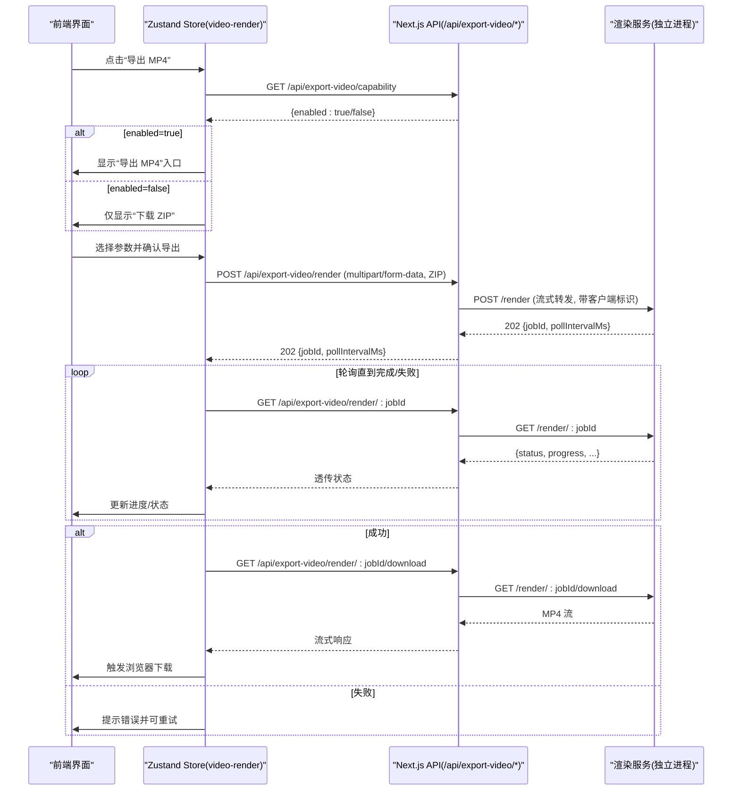
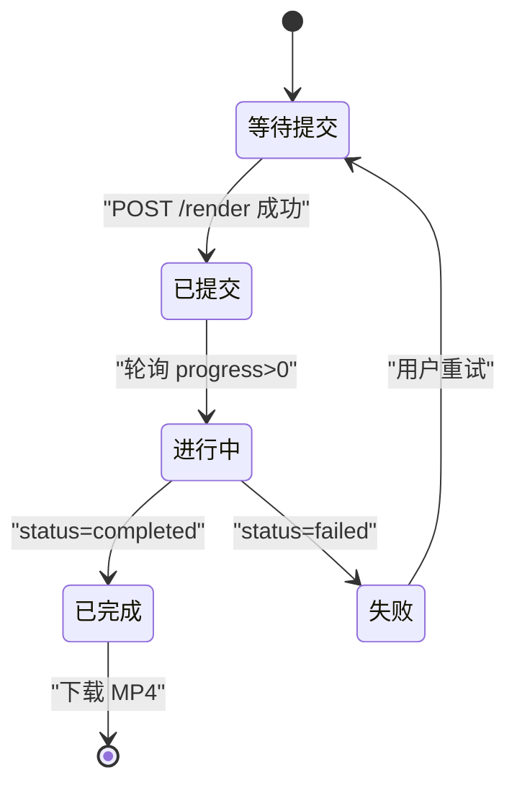
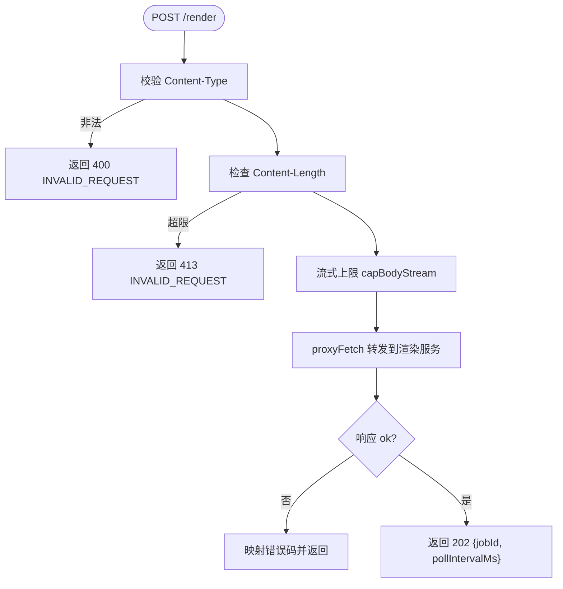
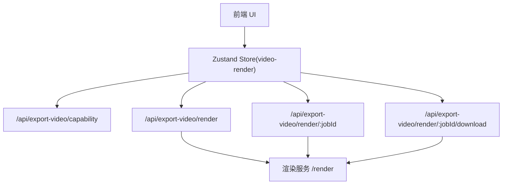

# 导出工作流

<cite>
**本文引用的文件**   
- [app/api/export-video/capability/route.ts](file://app/api/export-video/capability/route.ts)
- [app/api/export-video/render/route.ts](file://app/api/export-video/render/route.ts)
- [app/api/export-video/render/[jobId]/route.ts](file://app/api/export-video/render/[jobId]/route.ts)
- [app/api/export-video/render/[jobId]/download/route.ts](file://app/api/export-video/render/[jobId]/download/route.ts)
- [lib/server/render-service.ts](file://lib/server/render-service.ts)
- [lib/video-export/index.ts](file://lib/video-export/index.ts)
- [lib/video-export/compile.ts](file://lib/video-export/compile.ts)
- [lib/video-export/passes/timeline.ts](file://lib/video-export/passes/timeline.ts)
- [lib/store/video-render.ts](file://lib/store/video-render.ts)
</cite>

## 产品概述
本文件面向 OpenMAIC 的“视频导出”能力，完整说明从用户触发导出到最终 MP4 文件生成的端到端流程。系统采用“前端发起 → Next.js API 转发 → 独立渲染服务异步渲染 → 轮询状态与下载”的架构，确保大体积 ZIP 上传与长耗时渲染不影响主应用响应。导出过程包含：
- 能力探测（是否启用远程渲染）
- 项目打包与上传（ZIP 流式转发）
- 任务提交、状态轮询与取消
- 结果下载（MP4）
- 错误处理、限流与重试策略
- 纯函数编译管线（IR 生成）与资源计划

该能力对未配置渲染服务的部署自动降级为“下载 ZIP”，由本地 CLI 完成渲染，保证功能可用性与可观测性。

## 核心业务流程
下图展示一次完整的“一键导出 MP4”调用链路与关键交互节点。



**图表来源** 
- [app/api/export-video/capability/route.ts:1-17](file://app/api/export-video/capability/route.ts#L1-L17)
- [app/api/export-video/render/route.ts:1-114](file://app/api/export-video/render/route.ts#L1-L114)
- [app/api/export-video/render/[jobId]/route.ts](file://app/api/export-video/render/[jobId]/route.ts#L1-L60)
- [app/api/export-video/render/[jobId]/download/route.ts](file://app/api/export-video/render/[jobId]/download/route.ts#L1-L80)
- [lib/server/render-service.ts:1-61](file://lib/server/render-service.ts#L1-L61)
- [lib/store/video-render.ts:120-190](file://lib/store/video-render.ts#L120-L190)

**章节来源**
- [app/api/export-video/capability/route.ts:1-17](file://app/api/export-video/capability/route.ts#L1-L17)
- [app/api/export-video/render/route.ts:1-114](file://app/api/export-video/render/route.ts#L1-L114)
- [app/api/export-video/render/[jobId]/route.ts:1-60](file://app/api/export-video/render/[jobId]/route.ts#L1-L60)
- [app/api/export-video/render/[jobId]/download/route.ts:1-80](file://app/api/export-video/render/[jobId]/download/route.ts#L1-L80)
- [lib/server/render-service.ts:1-61](file://lib/server/render-service.ts#L1-L61)
- [lib/store/video-render.ts:120-190](file://lib/store/video-render.ts#L120-L190)

## 功能模块清单
- 能力探测接口
  - 职责：判断渲染服务是否已配置且健康，避免前端暴露不可用能力。
  - 验收要点：未配置或不可达时返回 disabled；绝不泄露服务 URL。
- 渲染提交接口
  - 职责：接收 multipart/form-data 的 ZIP 包，流式转发至渲染服务，返回 jobId 与轮询间隔。
  - 验收要点：严格限制上传大小；超时保护；错误码映射（限流/过大/上游错误）。
- 任务状态查询接口
  - 职责：轮询渲染任务状态（进行中/完成/失败），透传服务端返回的进度信息。
  - 验收要点：支持取消请求；异常统一包装。
- 结果下载接口
  - 职责：在任务完成后提供 MP4 下载流。
  - 验收要点：仅在任务完成时允许下载；错误回退友好。
- 渲染服务适配层
  - 职责：读取环境变量、解析服务地址、健康检查。
  - 验收要点：未配置时优雅降级；健康检查短超时不抛错。
- 视频导出编译管线（纯函数 IR）
  - 职责：将课堂数据转换为 VideoTimeline IR，产出资产清单、字幕、场景片段等。
  - 验收要点：无 IO、可单元测试；不支持的场景以标记保留而非丢弃。
- 前端状态管理（Zustand）
  - 职责：封装能力探测、提交、轮询、下载、错误与重试的用户体验。
  - 验收要点：加载态、进度反馈、失败提示、重试入口。

**章节来源**
- [app/api/export-video/capability/route.ts:1-17](file://app/api/export-video/capability/route.ts#L1-L17)
- [app/api/export-video/render/route.ts:1-114](file://app/api/export-video/render/route.ts#L1-L114)
- [app/api/export-video/render/[jobId]/route.ts:1-60](file://app/api/export-video/render/[jobId]/route.ts#L1-L60)
- [app/api/export-video/render/[jobId]/download/route.ts:1-80](file://app/api/export-video/render/[jobId]/download/route.ts#L1-L80)
- [lib/server/render-service.ts:1-61](file://lib/server/render-service.ts#L1-L61)
- [lib/video-export/index.ts:1-41](file://lib/video-export/index.ts#L1-L41)
- [lib/video-export/compile.ts:1-183](file://lib/video-export/compile.ts#L1-L183)
- [lib/video-export/passes/timeline.ts:1-268](file://lib/video-export/passes/timeline.ts#L1-L268)
- [lib/store/video-render.ts:120-190](file://lib/store/video-render.ts#L120-L190)

## 数据与状态
- 导出任务状态机
  - 初始：等待提交
  - 已提交：收到 jobId，开始轮询
  - 进行中：progress 递增
  - 已完成：可下载 MP4
  - 失败：错误码与消息，支持重试
- 关键数据结构
  - 提交响应：{ jobId, pollIntervalMs }
  - 状态响应：{ status, progress, error? }
  - 下载响应：二进制流（MP4）
- 状态存储与所有权
  - 前端 Zustand store 持有当前 job 的状态与进度，生命周期与页面会话绑定。
  - 后端不持久化任务状态（由渲染服务负责），Next.js 仅做转发与鉴权边界。
- 编译产物（IR）
  - VideoTimeline：场景分段、字幕、资产清单、诊断信息等。
  - 资产计划：去重与命名策略，供下游渲染器消费。



**图表来源** 
- [app/api/export-video/render/route.ts:1-114](file://app/api/export-video/render/route.ts#L1-L114)
- [app/api/export-video/render/[jobId]/route.ts:1-60](file://app/api/export-video/render/[jobId]/route.ts#L1-L60)
- [lib/store/video-render.ts:120-190](file://lib/store/video-render.ts#L120-L190)

**章节来源**
- [lib/video-export/index.ts:1-41](file://lib/video-export/index.ts#L1-L41)
- [lib/video-export/compile.ts:1-183](file://lib/video-export/compile.ts#L1-L183)
- [lib/video-export/passes/timeline.ts:1-268](file://lib/video-export/passes/timeline.ts#L1-L268)
- [lib/store/video-render.ts:120-190](file://lib/store/video-render.ts#L120-L190)

## 关键约束与边界
- 上传大小限制
  - 单任务最大 ZIP 字节数限制（例如 300MB），在流式传输中强制截断，防止内存溢出与拒绝服务。
- 超时与预算
  - 提交阶段设置较长超时（如 300s）用于慢链路上传；渲染本身异步进行，不占用请求线程。
- 身份与限流
  - 通过代理头或保守直连标识区分客户端，渲染服务侧按身份限流；若不受信则合并为共享桶。
- 能力降级
  - 未配置渲染服务时，能力接口返回 disabled，前端仅展示“下载 ZIP”，由本地 CLI 渲染。
- 错误码映射
  - 上游 429→RATE_LIMITED，413→INVALID_REQUEST，其他→UPSTREAM_ERROR；统一包装便于前端处理。
- 兼容性
  - 不支持的场景类型（测验/互动/PBL）以占位标记保留，不会静默丢弃，保障可追溯性。

**章节来源**
- [app/api/export-video/render/route.ts:1-114](file://app/api/export-video/render/route.ts#L1-L114)
- [lib/server/render-service.ts:1-61](file://lib/server/render-service.ts#L1-L61)
- [lib/video-export/compile.ts:1-183](file://lib/video-export/compile.ts#L1-L183)

## 详细组件分析

### 能力探测接口（/api/export-video/capability）
- 行为：调用渲染服务健康检查，返回 enabled 布尔值。
- 设计要点：不泄露服务 URL；健康检查短超时且不抛错，保证 UI 降级。
- 前端使用：根据 enabled 决定菜单项可见性。

**章节来源**
- [app/api/export-video/capability/route.ts:1-17](file://app/api/export-video/capability/route.ts#L1-L17)
- [lib/server/render-service.ts:1-61](file://lib/server/render-service.ts#L1-L61)

### 渲染提交接口（/api/export-video/render）
- 行为：校验 Content-Type 与长度，流式转发 multipart/form-data 至渲染服务，返回 jobId 与轮询间隔。
- 安全与健壮性：
  - 基于 Content-Length 快速拒绝超大请求。
  - 流式上限 capBodyStream 强制字节计数。
  - 超时 AbortSignal.timeout 控制提交时间。
- 错误处理：
  - 429→RATE_LIMITED，413→INVALID_REQUEST，其他→UPSTREAM_ERROR。
  - 捕获 cap 超限与网络异常，返回明确错误码与消息。



**图表来源** 
- [app/api/export-video/render/route.ts:1-114](file://app/api/export-video/render/route.ts#L1-L114)

**章节来源**
- [app/api/export-video/render/route.ts:1-114](file://app/api/export-video/render/route.ts#L1-L114)

### 任务状态与取消（/api/export-video/render/[jobId]）
- 行为：GET 获取任务状态（进行中/完成/失败），DELETE 取消任务。
- 设计要点：透传上游状态与进度；异常统一包装；支持取消。
- 前端轮询：按 pollIntervalMs 定时拉取，直至完成或失败。

**章节来源**
- [app/api/export-video/render/[jobId]/route.ts:1-60](file://app/api/export-video/render/[jobId]/route.ts#L1-L60)

### 结果下载（/api/export-video/render/[jobId]/download）
- 行为：在任务完成后提供 MP4 下载流。
- 设计要点：仅在完成状态下允许下载；错误回退友好；流式响应降低内存占用。

**章节来源**
- [app/api/export-video/render/[jobId]/download/route.ts:1-80](file://app/api/export-video/render/[jobId]/download/route.ts#L1-L80)

### 渲染服务适配层（lib/server/render-service.ts）
- 行为：读取 RENDER_SERVICE_URL，解析基础地址；健康检查 GET /health。
- 设计要点：未配置时返回 null/false；健康检查短超时且不抛错；不经过 SSRF 守卫（因为这是内部服务地址）。

**章节来源**
- [lib/server/render-service.ts:1-61](file://lib/server/render-service.ts#L1-L61)

### 视频导出编译管线（lib/video-export）
- 编译入口：compileVideoTimeline(input, deps) 输出 VideoTimeline IR。
- Passes 顺序：normalize → probe → timeline → geometry → assets → unsupported markers。
- 时间线构建：resolveActionTimeline 将动作展开为片段，计算总时长与字幕。
- 资产计划：去重与命名，标注 present/degraded 等元信息。
- 不支持场景：quiz/interactive/pbl 以占位标记保留，附带诊断信息。

```mermaid
classDiagram
class CompileInput {
+stage : {id,name}
+scenes : CompilerScene[]
}
class CompileDeps {
+timing : TimingProbe
+assets : AssetSource
+config? : CompileConfig
}
class VideoTimeline {
+schema
+version
+compiler
+stage
+canvas
+config
+totalDurationMs
+scenes
+subtitles
+assets
+diagnostics
}
class TimelinePass {
+buildTimeline(scenes, opts) : TimelineResult
}
CompileInput --> VideoTimeline : "编译产出"
CompileDeps --> TimelinePass : "注入依赖"
TimelinePass --> VideoTimeline : "生成片段/字幕/时长"
```

**图表来源** 
- [lib/video-export/compile.ts:1-183](file://lib/video-export/compile.ts#L1-L183)
- [lib/video-export/passes/timeline.ts:1-268](file://lib/video-export/passes/timeline.ts#L1-L268)

**章节来源**
- [lib/video-export/index.ts:1-41](file://lib/video-export/index.ts#L1-L41)
- [lib/video-export/compile.ts:1-183](file://lib/video-export/compile.ts#L1-L183)
- [lib/video-export/passes/timeline.ts:1-268](file://lib/video-export/passes/timeline.ts#L1-L268)

### 前端状态管理与用户体验（lib/store/video-render.ts）
- 能力探测：调用 capability 接口，控制 UI 入口。
- 提交与轮询：构造表单（ZIP），POST 提交，按 pollIntervalMs 轮询状态。
- 下载与回调：成功后触发浏览器下载；失败提示并支持重试。
- 进度反馈：loading、error、progress 状态驱动 UI。

**章节来源**
- [lib/store/video-render.ts:120-190](file://lib/store/video-render.ts#L120-L190)

## 依赖分析
- 组件耦合
  - Next.js API 与渲染服务松耦合，通过 HTTP 通信；错误码映射集中处理。
  - 前端 Store 与 API 解耦，仅依赖约定好的响应结构。
  - 编译管线纯函数化，无外部依赖，便于测试与复用。
- 外部依赖
  - 渲染服务（可选）：RENDER_SERVICE_URL 控制开关与健康检查。
  - 代理与流式传输：proxyFetch、capBodyStream、AbortSignal。
- 潜在循环依赖
  - 无直接循环；API 层仅转发，编译管线与 UI 分离。



**图表来源** 
- [app/api/export-video/capability/route.ts:1-17](file://app/api/export-video/capability/route.ts#L1-L17)
- [app/api/export-video/render/route.ts:1-114](file://app/api/export-video/render/route.ts#L1-L114)
- [app/api/export-video/render/[jobId]/route.ts:1-60](file://app/api/export-video/render/[jobId]/route.ts#L1-L60)
- [app/api/export-video/render/[jobId]/download/route.ts:1-80](file://app/api/export-video/render/[jobId]/download/route.ts#L1-L80)
- [lib/server/render-service.ts:1-61](file://lib/server/render-service.ts#L1-L61)
- [lib/store/video-render.ts:120-190](file://lib/store/video-render.ts#L120-L190)

**章节来源**
- [lib/server/render-service.ts:1-61](file://lib/server/render-service.ts#L1-L61)
- [lib/store/video-render.ts:120-190](file://lib/store/video-render.ts#L120-L190)

## 性能考虑
- 流式上传与下载
  - 使用流式转发避免全量缓冲，降低内存峰值。
  - 大 ZIP 上传需足够带宽与超时预算。
- 轮询频率
  - 按 pollIntervalMs 动态调整，避免频繁请求造成拥塞。
- 编译管线
  - 纯函数 pass 可并行优化（如资产计划与几何计算），但需注意输入一致性。
- 限流与背压
  - 渲染服务按客户端身份限流；必要时前端实现指数退避重试。

[本节为通用指导，不直接分析具体文件]

## 故障排查指南
- 常见问题
  - 能力不可用：检查 RENDER_SERVICE_URL 是否配置且服务可达。
  - 上传过大：确认 ZIP 压缩率与内容，确保不超过 MAX_UPLOAD_BYTES。
  - 限流 429：减少并发或等待退避后重试。
  - 上游错误 502：检查渲染服务日志与网络连通性。
- 诊断方法
  - 查看能力接口返回 enabled 状态。
  - 观察提交响应中的 jobId 与 pollIntervalMs。
  - 轮询接口返回的 status/progress/error 字段定位问题阶段。
  - 下载接口仅在 completed 状态可用，否则检查任务状态。
- 重试策略
  - 网络错误与 5xx：指数退避 + 最大重试次数。
  - 限流 429：随机抖动 + 退避。
  - 413/400：提示用户修正输入或压缩策略。

**章节来源**
- [app/api/export-video/capability/route.ts:1-17](file://app/api/export-video/capability/route.ts#L1-L17)
- [app/api/export-video/render/route.ts:1-114](file://app/api/export-video/render/route.ts#L1-L114)
- [app/api/export-video/render/[jobId]/route.ts:1-60](file://app/api/export-video/render/[jobId]/route.ts#L1-L60)
- [lib/server/render-service.ts:1-61](file://lib/server/render-service.ts#L1-L61)

## 结论
OpenMAIC 的视频导出工作流通过“能力探测 → 流式上传 → 异步渲染 → 轮询下载”的分层设计，实现了高可靠与大体积处理的稳定性。纯函数编译管线确保了可测试性与可移植性；前端状态管理提供了良好的用户体验。针对未配置渲染服务的场景，系统自动降级为 ZIP 下载，保证功能可用性。建议在生产环境中合理配置渲染服务、监控限流与错误率，并结合业务需求优化轮询频率与重试策略。