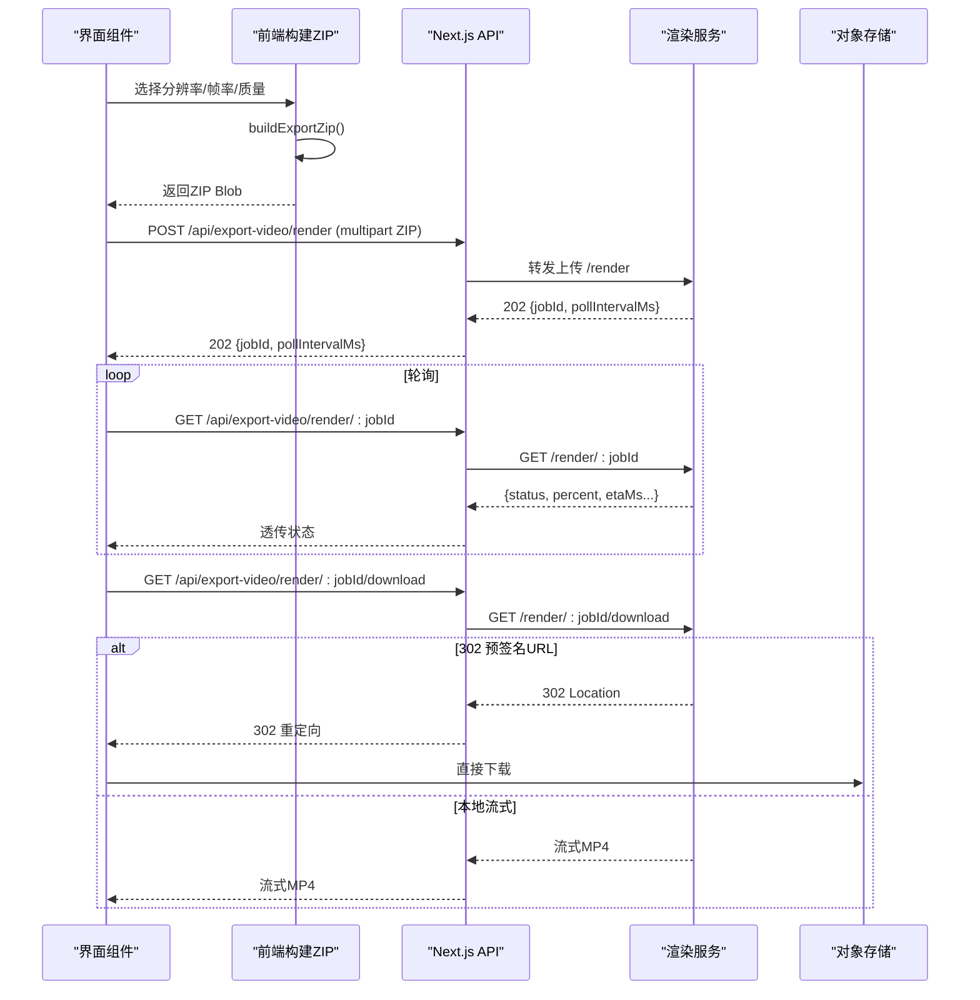
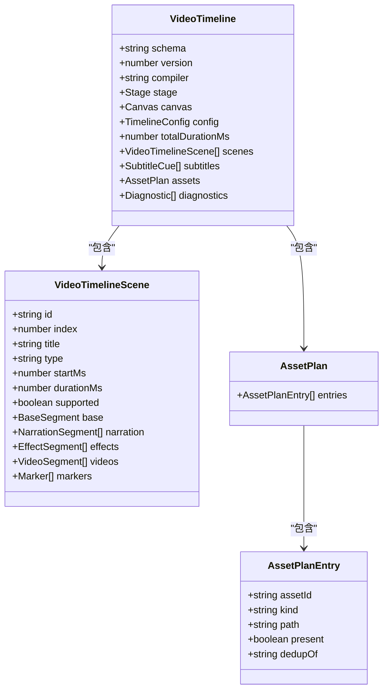

# 导出系统

<cite>
**本文引用的文件**   
- [app/api/export-video/render/route.ts](file://app/api/export-video/render/route.ts)
- [app/api/export-video/capability/route.ts](file://app/api/export-video/capability/route.ts)
- [app/api/export-video/render/[jobId]/route.ts](file://app/api/export-video/render/[jobId]/route.ts)
- [app/api/export-video/render/[jobId]/download/route.ts](file://app/api/export-video/render/[jobId]/download/route.ts)
- [components/stage/video-export-menu.tsx](file://components/stage/video-export-menu.tsx)
- [lib/video-export-app/build-export-zip.ts](file://lib/video-export-app/build-export-zip.ts)
- [lib/video-export/index.ts](file://lib/video-export/index.ts)
- [lib/video-export/ir.ts](file://lib/video-export/ir.ts)
- [lib/export/use-export-pptx.ts](file://lib/export/use-export-pptx.ts)
</cite>

## 产品概述
本导出系统为 OpenMAIC 提供两类导出能力：
- PPTX 导出：在浏览器端将课件幻灯片、文本、图表、图片与样式转换为 .pptx，支持演讲备注、超链接、阴影与描边等。
- HTML 导出：通过 HTML 解析器与内联资源策略，生成可离线运行的自包含 HTML（含资源映射与内联）。
- 视频导出：前端构建自包含 ZIP（Hyperframes 项目 + 资源），后端代理上传至独立渲染服务进行 MP4 渲染，支持分辨率、帧率与质量配置，并提供任务状态轮询与下载流式返回。

核心价值：
- 统一 DSL → 多格式输出（PPTX/HTML/MP4）
- 纯函数编译管线（IR）确保可测试性与跨环境一致性
- 异步渲染解耦，提升大体积导出体验与稳定性

适用场景：
- 教师/讲师快速导出课件用于线下演示或归档
- 课堂回放与分享需要 MP4 视频
- 教学平台集成 PPTX/HTML 分发

## 核心业务流程
- PPTX 导出流程
  - 读取当前舞台与幻灯片数据
  - 遍历元素类型（文本、图片、形状、线条、图表）并映射到 pptxgenjs 对象
  - 处理背景、阴影、描边、透明度、旋转、裁剪、超链接等样式
  - 生成 Blob 并通过 file-saver 触发下载

- HTML 导出流程
  - 使用 HTML 解析器将内容转为 AST
  - 通过 stringify/format 生成 HTML
  - 内联资源（图片、媒体）与 importmap 管理依赖
  - 打包为自包含 HTML

- 视频导出流程
  - 前端构建 ZIP：编译 IR → 生成 Hyperframes 项目文本 → 收集资源字节 → 打包 ZIP
  - 选择“渲染 MP4”时，POST 上传 ZIP 至渲染服务，获取 jobId
  - 定时 GET 查询任务状态，直至完成
  - GET 下载 MP4，支持直连存储重定向与流式传输

**章节来源**
- [lib/video-export-app/build-export-zip.ts:56-84](file://lib/video-export-app/build-export-zip.ts#L56-L84)
- [app/api/export-video/render/route.ts:46-113](file://app/api/export-video/render/route.ts#L46-L113)
- [app/api/export-video/render/[jobId]/route.ts:12-34](file://app/api/export-video/render/[jobId]/route.ts#L12-L34)
- [app/api/export-video/render/[jobId]/download/route.ts:20-66](file://app/api/export-video/render/[jobId]/download/route.ts#L20-L66)

## 功能模块清单
- PPTX 导出模块
  - 职责：DSL → pptxgenjs 转换；样式映射（颜色、字体、阴影、描边、透明度、旋转、裁剪、超链接）；图表与备注生成
  - 验收要点：文本段落/列表/对齐/行距正确；图片 Base64 嵌入；特殊形状 SVG→Base64；图表主题色与图例；备注提取
  - 参考实现路径：[lib/export/use-export-pptx.ts](file://lib/export/use-export-pptx.ts)

- HTML 导出模块
  - 职责：HTML 解析为 AST；字符串化输出；内联资源与 importmap；兼容离线运行
  - 验收要点：AST 结构稳定；资源内联完整；importmap 可解析；无外部依赖加载失败
  - 参考实现路径：lib/export/html-parser/*（index.ts、stringify.ts、format.ts、types.ts）

- 视频导出前端模块
  - 职责：构建 ZIP（IR → Hyperframes → 资源收集 → 打包）；能力探测；选项设置（分辨率、帧率、质量）；进度展示
  - 验收要点：buildExportZip 抛出 NoScenesError 当无场景；ZIP 自包含；能力接口返回 enabled；进度与 ETA 显示
  - 参考实现路径：[lib/video-export-app/build-export-zip.ts:56-84](file://lib/video-export-app/build-export-zip.ts#L56-L84)、[components/stage/video-export-menu.tsx](file://components/stage/video-export-menu.tsx)

- 视频导出后端模块
  - 职责：上传转发（限流与大小限制）、任务状态查询、结果下载（支持 302 直链）
  - 验收要点：上传上限 300MB；超时控制合理；错误码区分（413/429/502）；下载流式与缓存头正确
  - 参考实现路径：[app/api/export-video/render/route.ts:46-113](file://app/api/export-video/render/route.ts#L46-L113)、[app/api/export-video/render/[jobId]/route.ts:12-34](file://app/api/export-video/render/[jobId]/route.ts#L12-L34)、[app/api/export-video/render/[jobId]/download/route.ts:20-66](file://app/api/export-video/render/[jobId]/download/route.ts#L20-L66)、[app/api/export-video/capability/route.ts:13-16](file://app/api/export-video/capability/route.ts#L13-L16)

## 数据与状态
- 视频导出 IR（VideoTimeline）
  - 描述：纯函数编译产物，包含场景片段（基础帧、旁白、特效、视频、标记）、字幕、资产计划、诊断信息
  - 关键类型：Scene、NarrationSegment、EffectSegment、VideoSegment、Marker、AssetPlan、Diagnostics
  - 版本与校验：schema 标签与版本号，zod 定义，便于跨环境验证与回滚
  - 参考实现路径：[lib/video-export/ir.ts:1-323](file://lib/video-export/ir.ts#L1-L323)、[lib/video-export/index.ts:1-41](file://lib/video-export/index.ts#L1-L41)

- 构建 ZIP 流程数据
  - 输入：stage、scenes、分辨率
  - 中间态：IR、Hyperframes 项目文本、资源 blobs
  - 输出：zipBlob、stageName、missingCount、errorCount
  - 参考实现路径：[lib/video-export-app/build-export-zip.ts:56-84](file://lib/video-export-app/build-export-zip.ts#L56-L84)

- PPTX 导出数据
  - 输入：Slide[]、Scene[]、viewport 比例与尺寸
  - 转换：HTML→TextProps、SVG Path→Points、图表数据→ChartData
  - 输出：pptxgen 文档 Blob
  - 参考实现路径：[lib/export/use-export-pptx.ts:366-800](file://lib/export/use-export-pptx.ts#L366-L800)

**图示来源**
- [lib/video-export/ir.ts:272-284](file://lib/video-export/ir.ts#L272-L284)
- [lib/video-export/ir.ts:205-219](file://lib/video-export/ir.ts#L205-L219)
- [lib/video-export/ir.ts:240-253](file://lib/video-export/ir.ts#L240-L253)

**章节来源**
- [lib/video-export/ir.ts:1-323](file://lib/video-export/ir.ts#L1-L323)
- [lib/video-export/index.ts:1-41](file://lib/video-export/index.ts#L1-L41)
- [lib/video-export-app/build-export-zip.ts:56-84](file://lib/video-export-app/build-export-zip.ts#L56-L84)
- [lib/export/use-export-pptx.ts:366-800](file://lib/export/use-export-pptx.ts#L366-L800)

## 关键约束与边界
- 非功能性需求
  - 上传大小限制：300MB（压缩 ZIP），基于 Content-Length 与流式计数双重保护
  - 超时策略：上传提交 300s；任务查询 15s；下载仅头部获取限时 30s，避免截断大文件
  - 速率限制：上游 429 映射为客户端 429，提示重试
  - 能力探测：/capability 仅在渲染服务健康时启用 MP4 选项

- 依赖与集成边界
  - 渲染服务 URL 由 resolveRenderServiceUrl 决定，未配置则降级为 ZIP 下载
  - 下载支持 302 直链到对象存储，减少代理带宽占用
  - 前端与后端共享 buildExportZip 逻辑，保证 ZIP 一致性

- 业务约束
  - 无场景时抛出 NoScenesError
  - 不支持的场景家族以占位符与诊断记录呈现，不静默丢弃
  - 媒体缺失记录为 skipped-media 诊断，不影响时间线结构

- 性能优化策略
  - 流式转发上传与下载，避免内存峰值
  - 资源去重（assetPlan dedupOf）
  - 可选降低分辨率/帧率/质量以提升速度
  - 仅头部超时，主体流不受限

**章节来源**
- [app/api/export-video/render/route.ts:15-21](file://app/api/export-video/render/route.ts#L15-L21)
- [app/api/export-video/render/route.ts:52-59](file://app/api/export-video/render/route.ts#L52-L59)
- [app/api/export-video/render/[jobId]/route.ts:20-23](file://app/api/export-video/render/[jobId]/route.ts#L20-L23)
- [app/api/export-video/render/[jobId]/download/route.ts:27-31](file://app/api/export-video/render/[jobId]/download/route.ts#L27-L31)
- [app/api/export-video/capability/route.ts:13-16](file://app/api/export-video/capability/route.ts#L13-L16)
- [lib/video-export-app/build-export-zip.ts:56-60](file://lib/video-export-app/build-export-zip.ts#L56-L60)