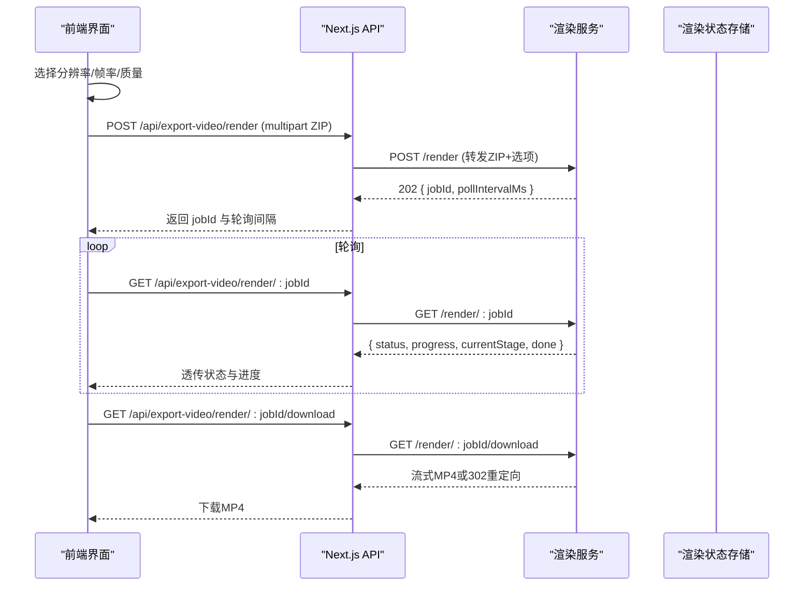
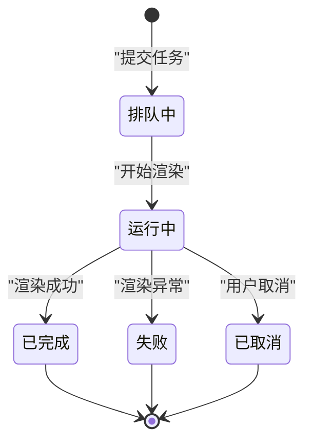

# 任务管理

<cite>
**本文引用的文件**   
- [app/api/export-video/render/route.ts](file://app/api/export-video/render/route.ts)
- [app/api/export-video/capability/route.ts](file://app/api/export-video/capability/route.ts)
- [app/api/export-video/render/[jobId]/route.ts](file://app/api/export-video/render/[jobId]/route.ts)
- [lib/server/render-service.ts](file://lib/server/render-service.ts)
- [render-service/src/main.ts](file://render-service/src/main.ts)
- [render-service/src/types.ts](file://render-service/src/types.ts)
- [lib/video-export/index.ts](file://lib/video-export/index.ts)
- [lib/video-export-app/build-export-zip.ts](file://lib/video-export-app/build-export-zip.ts)
- [components/stage/video-export-menu.tsx](file://components/stage/video-export-menu.tsx)
- [lib/video-export-app/use-render-video.ts](file://lib/video-export-app/use-render-video.ts)
- [lib/video-export-app/use-export-video.ts](file://lib/video-export-app/use-export-video.ts)
</cite>

## 目录
- 产品概述
- 核心业务流程
- 功能模块清单
- 数据与状态
- 关键约束与边界

## 产品概述
本系统为 OpenMAIC 的视频导出任务管理方案，提供“一键导出 MP4”和“下载 ZIP（本地渲染）”两条路径。其核心由两部分组成：
- 前端应用侧：将课件编译为 Hyperframes 项目并打包为自包含 ZIP；可选择上传至渲染服务生成 MP4，或直接下载 ZIP 供本地 CLI 渲染。
- 渲染服务侧：独立 Node + Chromium + FFmpeg 容器，负责接收 ZIP、调度渲染、输出 MP4 并提供任务状态查询与下载。

该设计通过最小化 HTTP 契约与清晰的职责边界，实现高内聚、低耦合的异步任务队列与渲染流水线，支持并发控制、错误处理、能力探测与降级策略。

**章节来源**
- [lib/video-export/index.ts:1-41](file://lib/video-export/index.ts#L1-L41)
- [render-service/src/main.ts:1-269](file://render-service/src/main.ts#L1-L269)

## 核心业务流程
视频导出涉及两条主链路：

- 链路 A：下载 ZIP（本地渲染）
  - 用户在界面选择分辨率，触发构建 ZIP；浏览器端完成编译、资产收集与打包；完成后直接保存 ZIP 到本地。
- 链路 B：在线渲染 MP4（远程服务）
  - 用户选择分辨率/帧率/质量后，前端构建相同 ZIP 并上传至渲染服务；服务端返回 jobId；前端轮询任务状态直至完成；完成后从服务端下载 MP4。

**图表来源**
- [app/api/export-video/render/route.ts:46-113](file://app/api/export-video/render/route.ts#L46-L113)
- [app/api/export-video/render/[jobId]/route.ts:12-57](file://app/api/export-video/render/[jobId]/route.ts#L12-L57)
- [render-service/src/main.ts:100-228](file://render-service/src/main.ts#L100-L228)

**章节来源**
- [components/stage/video-export-menu.tsx:87-199](file://components/stage/video-export-menu.tsx#L87-L199)
- [lib/video-export-app/use-export-video.ts:40-81](file://lib/video-export-app/use-export-video.ts#L40-L81)
- [lib/video-export-app/use-render-video.ts:16-35](file://lib/video-export-app/use-render-video.ts#L16-L35)

## 功能模块清单
- 能力探测接口
  - 职责：判断渲染服务是否可用（配置存在且健康），避免展示不可用的 MP4 导出入口。
  - 验收要点：未配置或不可达时返回 disabled=false；不泄露服务地址。
- 提交渲染任务接口
  - 职责：校验请求体大小与类型，限流与身份隔离，流式转发 ZIP 到渲染服务，返回 jobId 与轮询间隔。
  - 验收要点：超大包拒绝、非 multipart 拒绝、上游错误映射正确、超时保护。
- 任务状态查询接口
  - 职责：代理查询渲染服务任务状态，透传进度、阶段、错误信息，支持取消。
  - 验收要点：404/502 错误映射、超时保护、取消语义明确。
- 渲染服务（HTTP 入口）
  - 职责：解析表单参数、限制并发缓冲与解压、创建项目目录、提交渲染任务、提供状态/下载/取消接口与健康检查。
  - 验收要点：内存上限保护、并发门控、错误分类、清理资源。
- 视频编译与打包（前端）
  - 职责：读取当前课件与依赖，编译为 IR，生成 Hyperframes 项目文本，收集资产字节，打包为自包含 ZIP。
  - 验收要点：无场景报错、诊断统计、文件名安全。
- 前端交互与状态
  - 职责：暴露分辨率/帧率/质量选项，维护渲染状态与 ETA，驱动下载与轮询流程。
  - 验收要点：能力探测后动态显示按钮，进度与剩余时间提示，失败降级。

**章节来源**
- [app/api/export-video/capability/route.ts:13-16](file://app/api/export-video/capability/route.ts#L13-L16)
- [app/api/export-video/render/route.ts:46-113](file://app/api/export-video/render/route.ts#L46-L113)
- [app/api/export-video/render/[jobId]/route.ts:12-57](file://app/api/export-video/render/[jobId]/route.ts#L12-L57)
- [render-service/src/main.ts:91-229](file://render-service/src/main.ts#L91-L229)
- [lib/video-export-app/build-export-zip.ts:56-84](file://lib/video-export-app/build-export-zip.ts#L56-L84)
- [components/stage/video-export-menu.tsx:87-199](file://components/stage/video-export-menu.tsx#L87-L199)

## 数据与状态
- 渲染选项
  - fps：整数帧率，范围受服务校验限制。
  - quality：draft/standard/high 三档，影响速度与画质。
  - format：当前仅支持 mp4。
- 任务记录
  - id：任务唯一标识。
  - userId：可选调用者身份，用于每身份并发限制。
  - status：queued/running/succeeded/failed/cancelled。
  - progress：0..1 原始进度，客户端可换算百分比。
  - currentStage：当前阶段描述。
  - framesRendered/totalFrames：已渲染/总帧数。
  - error：错误信息。
  - createdAtMs/updatedAtMs：时间戳。
  - projectDir/outputPath：临时工程目录与输出 MP4 路径。
- 状态流转
  - 提交后进入 queued，开始执行转为 running，期间持续更新 progress/currentStage；成功则 succeeded，失败则 failed，用户取消则为 cancelled。终态包括 succeeded/failed/cancelled。

**图表来源**
- [render-service/src/types.ts:10-45](file://render-service/src/types.ts#L10-L45)

**章节来源**
- [render-service/src/types.ts:13-41](file://render-service/src/types.ts#L13-L41)
- [render-service/src/main.ts:181-200](file://render-service/src/main.ts#L181-L200)

## 关键约束与边界
- 并发与内存控制
  - 提交前进行身份级配额与队列预留，拒绝超限请求，避免无界缓冲。
  - 使用信号量限制同时进行的缓冲与解压操作数量，确保内存峰值可控。
- 上传大小限制
  - 基于声明长度快速拒绝过大请求；实际以流式计数为准，防止分块上传绕过。
- 超时与重试
  - 提交与轮询均设置超时；渲染为异步任务，前端按固定间隔轮询。
- 错误分类与降级
  - 区分 413/400/429/502/404 等错误码与业务码；当渲染服务不可用时，自动降级为下载 ZIP。
- 分布式与扩展性
  - 渲染服务为独立进程，可通过多实例部署配合反向代理实现负载均衡；任务状态与产物存储可替换为持久化后端（如 Redis/S3）。
- 配置项
  - 分辨率：720p/1080p/4k（宽度决定快照渲染宽度）。
  - 帧率：24/30/60。
  - 质量：draft/standard/high。
  - 格式：mp4。
- 监控与日志
  - 前端与后端均有日志记录；能力探测与健康检查用于前端可用性反馈。
- 性能建议
  - 合理设置最大并发与上传阈值；对大体积 ZIP 采用流式传输；按需调整帧率与质量平衡时长与清晰度。

**章节来源**
- [render-service/src/main.ts:100-179](file://render-service/src/main.ts#L100-L179)
- [lib/server/render-service.ts:36-60](file://lib/server/render-service.ts#L36-L60)
- [lib/video-export-app/build-export-zip.ts:24-39](file://lib/video-export-app/build-export-zip.ts#L24-L39)
- [components/stage/video-export-menu.tsx:95-108](file://components/stage/video-export-menu.tsx#L95-L108)