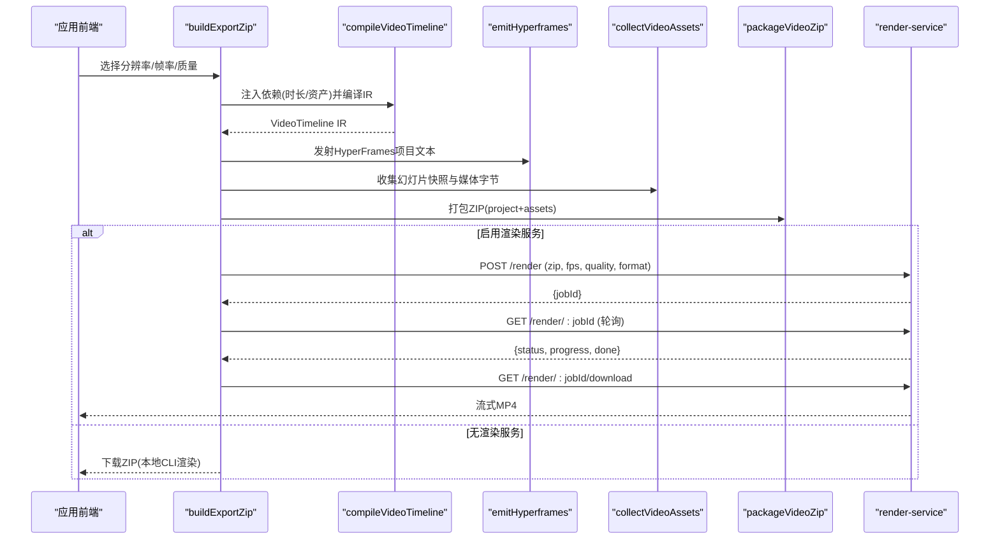
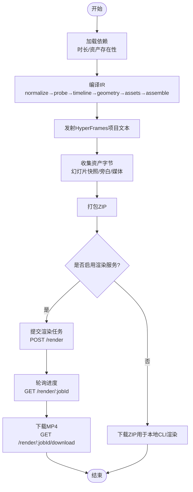

# 渲染引擎

<cite>
**本文引用的文件**   
- [lib/video-export/index.ts](file://lib/video-export/index.ts)
- [lib/video-export/compile.ts](file://lib/video-export/compile.ts)
- [lib/video-export/subtitles.ts](file://lib/video-export/subtitles.ts)
- [lib/video-export-app/build-export-zip.ts](file://lib/video-export-app/build-export-zip.ts)
- [render-service/src/main.ts](file://render-service/src/main.ts)
- [render-service/README.md](file://render-service/README.md)
- [app/api/generate/video/route.ts](file://app/api/generate/video/route.ts)
- [app/api/generate/scene-actions/route.ts](file://app/api/generate/scene-actions/route.ts)
- [lib/store/canvas.ts](file://lib/store/canvas.ts)
</cite>

## 目录
- 产品概述
- 核心业务流程
- 功能模块清单
- 数据与状态
- 关键约束与边界

## 产品概述
本渲染引擎面向 OpenMAIC 的“课堂视频导出”能力，将课件（场景、动作、媒体）编译为 HyperFrames 项目并输出 MP4。它在前端浏览器中完成 DSL→IR→HyperFrames 文本与资源收集，在独立的 render-service 中以无头 Chromium + FFmpeg 进行帧渲染与编码，最终提供下载或流式返回。该引擎支持分辨率、帧率、质量等参数选择，内置字幕生成（SRT/WebVTT），并提供批量处理与并发控制策略。

## 核心业务流程
- 前端构建导出 ZIP：从当前舞台与场景读取依赖（时长、资产存在性），编译为 VideoTimeline IR，发射 HyperFrames 项目文本，收集幻灯片快照与旁白/媒体字节，打包为自包含 ZIP。
- 可选云端渲染：将 ZIP 提交至 render-service，按 fps/quality/format 异步渲染 MP4，轮询进度后下载。
- 本地降级路径：若无 render-service，则下载 ZIP 供本地 CLI 渲染。
- 字幕生成：基于 IR 中的字幕轨道，纯函数格式化为 SRT 或 WebVTT，保证烧录与外挂字幕一致性。
- 场景动作与时间线：场景动作（含语音、特效、转场）参与时间线构建；音频对齐由 IR 的时序探针与几何计算阶段保障。

**图表来源** 
- [lib/video-export-app/build-export-zip.ts:56-84](file://lib/video-export-app/build-export-zip.ts#L56-L84)
- [lib/video-export/index.ts:1-41](file://lib/video-export/index.ts#L1-L41)
- [lib/video-export/compile.ts:1-36](file://lib/video-export/compile.ts#L1-L36)
- [render-service/README.md:16-31](file://render-service/README.md#L16-L31)
- [render-service/src/main.ts:1-28](file://render-service/src/main.ts#L1-L28)

**章节来源**
- [lib/video-export-app/build-export-zip.ts:56-84](file://lib/video-export-app/build-export-zip.ts#L56-L84)
- [lib/video-export/index.ts:1-41](file://lib/video-export/index.ts#L1-L41)
- [lib/video-export/compile.ts:1-36](file://lib/video-export/compile.ts#L1-L36)
- [render-service/README.md:16-31](file://render-service/README.md#L16-L31)
- [render-service/src/main.ts:1-28](file://render-service/src/main.ts#L1-L28)

## 功能模块清单
- 视频导出编译器（lib/video-export）
  - 职责：将课堂数据编译为 VideoTimeline IR，执行多 pass 纯函数流水线（归一化、探测、时间线、几何、资产计划、不支持场景标记、组装）。
  - 验收要点：IR 可被 Node 环境独立测试；诊断信息顺序可读；不支持场景以占位符保留。
- HyperFrames 发射器（emit-hyperframes）
  - 职责：将 IR 转换为 HyperFrames 项目文本（index.html + assets），并生成资源 URL。
  - 验收要点：输出与 IR 严格一致；宽高参数正确传播。
- 字幕序列化（subtitles）
  - 职责：将 IR 字幕轨道转为 SRT/WebVTT，统一时间戳与文本规范化。
  - 验收要点：毫秒精度、CRLF 规范化、空白尾行处理。
- 前端导出管线（build-export-zip）
  - 职责：读取 store/Dexie 依赖，编译 IR，发射项目文本，收集资产字节，打包 ZIP。
  - 验收要点：无场景抛出错误；统计缺失资产数与诊断错误数。
- 渲染服务（render-service）
  - 职责：接收 ZIP，使用无头 Chromium + FFmpeg 渲染 MP4，提供异步任务 API 与下载。
  - 验收要点：并发/队列/单用户限制、ZIP 炸弹防护、出站网络隔离、健康检查。
- 视频生成 API（app/api/generate/video）
  - 职责：调用外部视频生成提供商，记录用量与安全过滤。
  - 验收要点：内容安全拦截、错误码与日志。
- 场景动作生成（app/api/generate/scene-actions）
  - 职责：根据大纲与上下文生成动作序列，组装完整场景。
  - 验收要点：跨场景上下文连贯、动作数量与类型校验。
- 画布状态管理（lib/store/canvas）
  - 职责：播放、聚焦、特效（聚光、高亮、激光）、缩放、批操作等。
  - 验收要点：切换场景时重置状态、特效清理、快捷键禁用开关。

**章节来源**
- [lib/video-export/index.ts:1-41](file://lib/video-export/index.ts#L1-L41)
- [lib/video-export/compile.ts:1-36](file://lib/video-export/compile.ts#L1-L36)
- [lib/video-export/subtitles.ts:1-30](file://lib/video-export/subtitles.ts#L1-L30)
- [lib/video-export-app/build-export-zip.ts:56-84](file://lib/video-export-app/build-export-zip.ts#L56-L84)
- [render-service/README.md:16-31](file://render-service/README.md#L16-L31)
- [app/api/generate/video/route.ts:69-109](file://app/api/generate/video/route.ts#L69-L109)
- [app/api/generate/scene-actions/route.ts:136-184](file://app/api/generate/scene-actions/route.ts#L136-L184)
- [lib/store/canvas.ts:156-191](file://lib/store/canvas.ts#L156-L191)

## 数据与状态
- 核心数据模型
  - VideoTimeline IR：描述场景、动作、时间线、几何、资产计划与字幕轨道。
  - HyperFrames 项目：由 IR 发射得到的 index.html 与 assets 目录结构。
  - 字幕轨道：每段非空语音对应一个 cue，全局墙钟时间轴。
- 关键状态流转
  - 导出前：从 stage store 与 Dexie 获取场景与时长依赖。
  - 编译期：多 pass 生成 IR，诊断累积。
  - 发射期：生成项目文本与资源映射。
  - 收集期：幻灯片快照与媒体字节收集，统计缺失项。
  - 打包期：ZIP 自包含产物。
  - 渲染期：render-service 异步任务状态机（queued → running → succeeded/failed/cancelled）。
- 数据所有权边界
  - lib/video-export 保持纯函数与后端无关，仅通过依赖注入接口访问运行时。
  - 前端负责 IO 与状态读取；渲染服务负责解码/渲染/编码。

**图表来源** 
- [lib/video-export/compile.ts:1-36](file://lib/video-export/compile.ts#L1-L36)
- [lib/video-export-app/build-export-zip.ts:56-84](file://lib/video-export-app/build-export-zip.ts#L56-L84)
- [render-service/README.md:16-31](file://render-service/README.md#L16-L31)

**章节来源**
- [lib/video-export/compile.ts:1-36](file://lib/video-export/compile.ts#L1-L36)
- [lib/video-export-app/build-export-zip.ts:56-84](file://lib/video-export-app/build-export-zip.ts#L56-L84)
- [render-service/README.md:16-31](file://render-service/README.md#L16-L31)

## 关键约束与边界
- 性能与并发
  - render-service 支持 RENDER_MAX_CONCURRENCY、RENDER_MAX_QUEUE、RENDER_MAX_JOBS_PER_USER 等配置，控制并发、队列长度与单用户限制。
  - 导出 ZIP 体积上限与条目限制（RENDER_MAX_UPLOAD_BYTES、RENDER_MAX_ENTRIES、RENDER_MAX_ENTRY_BYTES、RENDER_MAX_EXPANDED_BYTES、RENDER_MAX_COMPRESSION_RATIO）防止 ZIP 炸弹。
- 安全与隔离
  - 渲染容器默认启用出站网络封锁（iptables），禁止 Chromium 回连应用；Compose 内部网络隔离，无需外网。
  - 上传归档解压在 worker 线程执行，限制并发与内存峰值。
- 渲染质量与格式
  - 支持 fps（24/30/60）、质量预设（draft/standard/high）、分辨率（720p/1080p/4k）。
  - 字幕输出同时支持 SRT 与 WebVTT，确保烧录与外挂字幕一致性。
- 兼容性
  - 不支持的场景类型（如 quiz/interactive/pbl）以占位符保留并在诊断中标记，避免静默丢弃。
- 集成边界
  - 视频生成 API 与外部提供商对接，需处理内容安全过滤与用量记录。
  - 场景动作生成依赖跨场景上下文（页码、标题、历史语音）以保证连贯性。

**章节来源**
- [render-service/README.md:32-66](file://render-service/README.md#L32-L66)
- [render-service/README.md:67-96](file://render-service/README.md#L67-L96)
- [lib/video-export-app/build-export-zip.ts:24-39](file://lib/video-export-app/build-export-zip.ts#L24-L39)
- [lib/video-export/subtitles.ts:1-30](file://lib/video-export/subtitles.ts#L1-L30)
- [lib/video-export/compile.ts:1-36](file://lib/video-export/compile.ts#L1-L36)
- [app/api/generate/video/route.ts:69-109](file://app/api/generate/video/route.ts#L69-L109)
- [app/api/generate/scene-actions/route.ts:136-184](file://app/api/generate/scene-actions/route.ts#L136-L184)