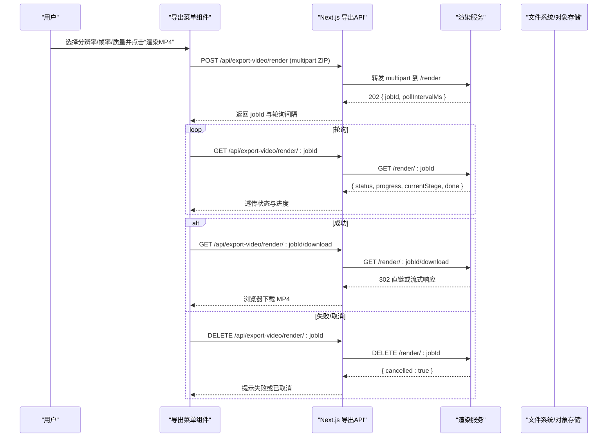
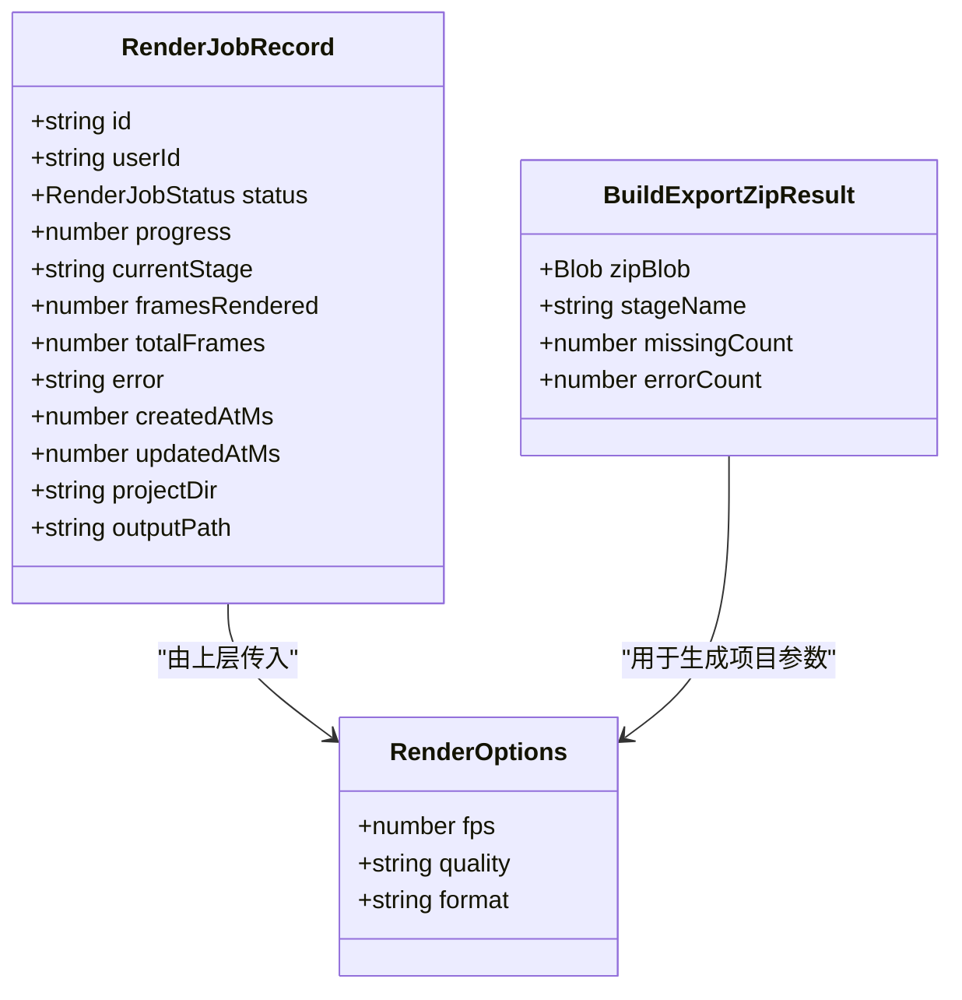
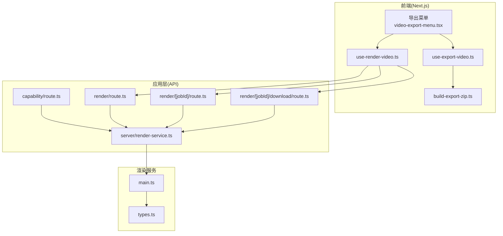
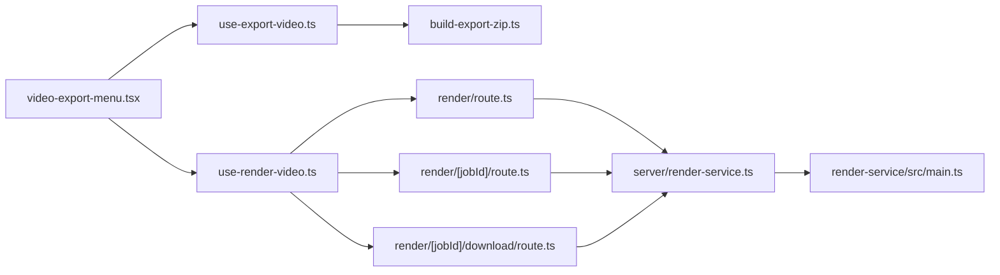

# 视频导出

<cite>
**本文引用的文件**   
- [app/api/export-video/render/route.ts](file://app/api/export-video/render/route.ts)
- [app/api/export-video/capability/route.ts](file://app/api/export-video/capability/route.ts)
- [app/api/export-video/render/[jobId]/route.ts](file://app/api/export-video/render/[jobId]/route.ts)
- [app/api/export-video/render/[jobId]/download/route.ts](file://app/api/export-video/render/[jobId]/download/route.ts)
- [lib/server/render-service.ts](file://lib/server/render-service.ts)
- [components/stage/video-export-menu.tsx](file://components/stage/video-export-menu.tsx)
- [lib/video-export-app/use-export-video.ts](file://lib/video-export-app/use-export-video.ts)
- [lib/video-export-app/use-render-video.ts](file://lib/video-export-app/use-render-video.ts)
- [lib/video-export-app/build-export-zip.ts](file://lib/video-export-app/build-export-zip.ts)
- [render-service/src/main.ts](file://render-service/src/main.ts)
- [render-service/src/types.ts](file://render-service/src/types.ts)
</cite>

## 产品概述
本模块提供“一键导出 MP4”的视频导出能力，支持两条路径：
- 在线渲染：将当前课件打包为 HyperFrames 项目 ZIP 后上传至独立的渲染服务，异步生成 MP4 并下载。
- 本地降级：直接在前端构建 ZIP 并下载到本地，供后续 CLI 或离线工具链渲染。

核心价值：
- 统一的前端导出入口与配置（分辨率、帧率、质量），自动探测渲染服务可用性，失败时优雅降级。
- 异步任务队列与进度跟踪，支持取消与错误恢复。
- 通过 HyperFrames 格式实现跨平台、可复现的帧生成与编码流程。

适用场景：
- 课堂回放/分享需要稳定的 MP4 输出。
- 批量导出或离线环境下的本地渲染需求。

## 核心业务流程
整体链路分为“前端构建 ZIP → 提交渲染任务 → 轮询进度 → 下载成品”四个阶段；同时提供“仅构建 ZIP 下载”的降级路径。

**图表来源** 
- [app/api/export-video/render/route.ts](file://app/api/export-video/render/route.ts)
- [app/api/export-video/render/[jobId]/route.ts](file://app/api/export-video/render/[jobId]/route.ts)
- [app/api/export-video/render/[jobId]/download/route.ts](file://app/api/export-video/render/[jobId]/download/route.ts)
- [render-service/src/main.ts](file://render-service/src/main.ts)

**章节来源**
- [components/stage/video-export-menu.tsx](file://components/stage/video-export-menu.tsx)
- [lib/video-export-app/use-export-video.ts](file://lib/video-export-app/use-export-video.ts)
- [lib/video-export-app/use-render-video.ts](file://lib/video-export-app/use-render-video.ts)
- [lib/video-export-app/build-export-zip.ts](file://lib/video-export-app/build-export-zip.ts)
- [app/api/export-video/render/route.ts](file://app/api/export-video/render/route.ts)
- [app/api/export-video/render/[jobId]/route.ts](file://app/api/export-video/render/[jobId]/route.ts)
- [app/api/export-video/render/[jobId]/download/route.ts](file://app/api/export-video/render/[jobId]/download/route.ts)
- [render-service/src/main.ts](file://render-service/src/main.ts)

## 功能模块清单
- 前端导出菜单与交互
  - 职责：展示分辨率/帧率/质量选项，发起渲染或 ZIP 下载，显示进度与 ETA。
  - 验收要点：能力探测正确、按钮禁用态合理、进度条与剩余时间更新流畅。
- 前端 ZIP 构建管线
  - 职责：读取当前课件状态，编译为 VideoTimeline IR，生成 HyperFrames 项目文本，收集资产并打包 ZIP。
  - 验收要点：无场景时报错、资产缺失计数准确、ZIP 可被渲染服务识别。
- Next.js 导出 API
  - 职责：校验请求体大小与类型、转发上传、代理查询/下载、统一错误码与超时控制。
  - 验收要点：大体积限制生效、上游不可用返回 501、429/413 映射正确。
- 渲染服务（独立进程）
  - 职责：接收 ZIP、解压、调度渲染、维护任务状态、产出 MP4 并提供下载或预签名 URL。
  - 验收要点：并发与内存门控、任务生命周期完整、健康检查可用。
- 能力探测与健康检查
  - 职责：检测渲染服务是否配置且可达，决定 UI 是否暴露“渲染 MP4”。
  - 验收要点：未配置或未启动时返回 disabled，不泄露服务地址。

**章节来源**
- [components/stage/video-export-menu.tsx](file://components/stage/video-export-menu.tsx)
- [lib/video-export-app/build-export-zip.ts](file://lib/video-export-app/build-export-zip.ts)
- [lib/video-export-app/use-export-video.ts](file://lib/video-export-app/use-export-video.ts)
- [lib/video-export-app/use-render-video.ts](file://lib/video-export-app/use-render-video.ts)
- [app/api/export-video/render/route.ts](file://app/api/export-video/render/route.ts)
- [app/api/export-video/capability/route.ts](file://app/api/export-video/capability/route.ts)
- [lib/server/render-service.ts](file://lib/server/render-service.ts)
- [render-service/src/main.ts](file://render-service/src/main.ts)

## 数据与状态
- 渲染任务状态机
  - 状态：queued → running → succeeded | failed | cancelled
  - 字段：progress(0..1)、currentStage、framesRendered、totalFrames、error、projectDir、outputPath
- 渲染选项
  - fps：24/30/60
  - quality：draft/standard/high
  - format：mp4（当前阶段固定）
- 前端导出选项
  - resolution：720p/1080p/4k（16:9）
  - fps、quality 仅在启用渲染服务时参与
- 关键数据流
  - 前端 buildExportZip 产出 ZIP → API 转发 → 渲染服务解压/渲染 → 产物落盘或对象存储 → 客户端下载

**图表来源** 
- [render-service/src/types.ts](file://render-service/src/types.ts)
- [lib/video-export-app/build-export-zip.ts](file://lib/video-export-app/build-export-zip.ts)

**章节来源**
- [render-service/src/types.ts](file://render-service/src/types.ts)
- [lib/video-export-app/build-export-zip.ts](file://lib/video-export-app/build-export-zip.ts)

## 关键约束与边界
- 上传大小与超时
  - 最大上传字节数：300MB（按实际字节计数截断）
  - 提交超时：300s（覆盖慢速网络上传）
  - 轮询/下载超时：15s（查询）、30s（下载首包头）
- 并发与内存
  - 渲染服务使用信号量限制并发解压与缓冲，避免多任务叠加导致 OOM
  - 任务 TTL 到期后清理项目目录与产物
- 安全与鉴权
  - 客户端身份基于 x-forwarded-for/x-real-ip（需可信代理）或降级为共享桶 direct
  - 能力接口不泄露渲染服务地址
- 降级策略
  - 渲染服务不可用时，UI 仅显示“下载 ZIP”，由用户本地渲染
- 错误码映射
  - 413 过大、429 限流、404 任务不存在、502 上游错误、501 未配置

**章节来源**
- [app/api/export-video/render/route.ts](file://app/api/export-video/render/route.ts)
- [app/api/export-video/render/[jobId]/route.ts](file://app/api/export-video/render/[jobId]/route.ts)
- [app/api/export-video/render/[jobId]/download/route.ts](file://app/api/export-video/render/[jobId]/download/route.ts)
- [lib/server/render-service.ts](file://lib/server/render-service.ts)
- [render-service/src/main.ts](file://render-service/src/main.ts)

## 架构总览

**图表来源** 
- [components/stage/video-export-menu.tsx](file://components/stage/video-export-menu.tsx)
- [lib/video-export-app/use-export-video.ts](file://lib/video-export-app/use-export-video.ts)
- [lib/video-export-app/use-render-video.ts](file://lib/video-export-app/use-render-video.ts)
- [lib/video-export-app/build-export-zip.ts](file://lib/video-export-app/build-export-zip.ts)
- [app/api/export-video/capability/route.ts](file://app/api/export-video/capability/route.ts)
- [app/api/export-video/render/route.ts](file://app/api/export-video/render/route.ts)
- [app/api/export-video/render/[jobId]/route.ts](file://app/api/export-video/render/[jobId]/route.ts)
- [app/api/export-video/render/[jobId]/download/route.ts](file://app/api/export-video/render/[jobId]/download/route.ts)
- [lib/server/render-service.ts](file://lib/server/render-service.ts)
- [render-service/src/main.ts](file://render-service/src/main.ts)
- [render-service/src/types.ts](file://render-service/src/types.ts)

## 详细组件分析

### 前端导出菜单与交互
- 能力探测：挂载时调用 capability 接口决定是否显示“渲染 MP4”
- 选项绑定：resolution/fps/quality 通过 store 管理，渲染中禁用编辑
- 进度展示：百分比与 ETA 来自轮询结果，渲染中显示加载图标
- 降级提示：当 serviceEnabled=false 时显示“仅支持下载 ZIP”

**章节来源**
- [components/stage/video-export-menu.tsx](file://components/stage/video-export-menu.tsx)
- [lib/video-export-app/use-render-video.ts](file://lib/video-export-app/use-render-video.ts)

### 前端 ZIP 构建管线
- 步骤：
  1) 注入依赖（时长探测、资产存在性）
  2) 纯函数编译为 VideoTimeline IR
  3) 生成 HyperFrames 项目文本
  4) 收集资产（幻灯片快照、旁白/媒体）
  5) 打包 ZIP
- 异常处理：无场景抛出 NoScenesError；统计 missing/error 数量用于提示

**章节来源**
- [lib/video-export-app/build-export-zip.ts](file://lib/video-export-app/build-export-zip.ts)

### Next.js 导出 API
- 提交上传：
  - 校验 content-type 与内容长度
  - 流式转发 multipart 到渲染服务，限制实际字节上限
  - 设置 x-openmaic-client 用于限流/隔离
  - 返回 202 与 jobId、pollIntervalMs
- 轮询状态：
  - 透传渲染服务状态，包含进度、阶段、完成标志
- 下载产物：
  - 支持 302 重定向到预签名 URL 或直接流式传输
  - 设置 Content-Type 与文件名

**章节来源**
- [app/api/export-video/render/route.ts](file://app/api/export-video/render/route.ts)
- [app/api/export-video/render/[jobId]/route.ts](file://app/api/export-video/render/[jobId]/route.ts)
- [app/api/export-video/render/[jobId]/download/route.ts](file://app/api/export-video/render/[jobId]/download/route.ts)

### 渲染服务（HTTP 入口与任务管理）
- 路由：
  - POST /render：接收 ZIP，返回 jobId
  - GET /render/:jobId：查询任务状态
  - DELETE /render/:jobId：取消任务
  - GET /render/:jobId/download：下载 MP4 或 302 跳转
  - GET /health：健康检查
- 并发与资源：
  - 使用信号量限制并发解压/缓冲
  - 临时目录与产物按任务隔离，TTL 到期回收
- 错误分类：
  - 上传过大、请求非法、项目无效、渲染拒绝、通用错误

**章节来源**
- [render-service/src/main.ts](file://render-service/src/main.ts)
- [render-service/src/types.ts](file://render-service/src/types.ts)

### 能力探测与健康检查
- 能力接口：GET /api/export-video/capability
  - 内部调用 checkRenderServiceHealth，短超时探测 /health
  - 返回 enabled 布尔值，不泄露服务地址
- 用途：控制 UI 行为，确保“渲染 MP4”仅在可用时出现

**章节来源**
- [app/api/export-video/capability/route.ts](file://app/api/export-video/capability/route.ts)
- [lib/server/render-service.ts](file://lib/server/render-service.ts)

## 依赖分析

**图表来源** 
- [components/stage/video-export-menu.tsx](file://components/stage/video-export-menu.tsx)
- [lib/video-export-app/use-export-video.ts](file://lib/video-export-app/use-export-video.ts)
- [lib/video-export-app/use-render-video.ts](file://lib/video-export-app/use-render-video.ts)
- [lib/video-export-app/build-export-zip.ts](file://lib/video-export-app/build-export-zip.ts)
- [app/api/export-video/render/route.ts](file://app/api/export-video/render/route.ts)
- [app/api/export-video/render/[jobId]/route.ts](file://app/api/export-video/render/[jobId]/route.ts)
- [app/api/export-video/render/[jobId]/download/route.ts](file://app/api/export-video/render/[jobId]/download/route.ts)
- [lib/server/render-service.ts](file://lib/server/render-service.ts)
- [render-service/src/main.ts](file://render-service/src/main.ts)

**章节来源**
- [components/stage/video-export-menu.tsx](file://components/stage/video-export-menu.tsx)
- [lib/video-export-app/use-export-video.ts](file://lib/video-export-app/use-export-video.ts)
- [lib/video-export-app/use-render-video.ts](file://lib/video-export-app/use-render-video.ts)
- [lib/video-export-app/build-export-zip.ts](file://lib/video-export-app/build-export-zip.ts)
- [app/api/export-video/render/route.ts](file://app/api/export-video/render/route.ts)
- [app/api/export-video/render/[jobId]/route.ts](file://app/api/export-video/render/[jobId]/route.ts)
- [app/api/export-video/render/[jobId]/download/route.ts](file://app/api/export-video/render/[jobId]/download/route.ts)
- [lib/server/render-service.ts](file://lib/server/render-service.ts)
- [render-service/src/main.ts](file://render-service/src/main.ts)

## 性能考虑
- 前端构建
  - 资产收集与 ZIP 打包在浏览器内存中进行，建议限制分辨率与帧数以降低 CPU/内存占用
  - 无场景时快速失败，避免无效计算
- 网络传输
  - 上传采用流式转发，避免服务端缓冲大 body
  - 下载支持 302 直连对象存储，减少中间转发压力
- 渲染服务
  - 并发门控防止多任务叠加导致的内存峰值
  - 任务 TTL 与清理保证磁盘与内存回收
- 调优建议
  - 根据服务器 CPU/内存调整 maxConcurrency 与 maxConcurrentExtractions
  - 对慢速网络适当提高提交超时与轮询间隔
  - 使用对象存储直链下载以降低带宽瓶颈

[本节为通用指导，不直接分析具体文件]

## 故障排查指南
- 常见问题
  - “渲染服务未配置”：检查 RENDER_SERVICE_URL 与环境变量，确认 /health 可达
  - “导出归档过大”：检查 ZIP 大小是否超过 300MB 限制
  - “任务不存在/未完成”：确认 jobId 有效且状态为 succeeded 后再下载
  - “上游错误”：查看渲染服务日志，确认资源不足或渲染被拒绝
- 定位手段
  - 前端：观察 toast 提示与日志，确认构建阶段是否报错
  - API：检查返回码与错误码映射（413/429/502/501）
  - 渲染服务：查看任务状态、错误信息、磁盘空间与并发指标

**章节来源**
- [app/api/export-video/render/route.ts](file://app/api/export-video/render/route.ts)
- [app/api/export-video/render/[jobId]/route.ts](file://app/api/export-video/render/[jobId]/route.ts)
- [app/api/export-video/render/[jobId]/download/route.ts](file://app/api/export-video/render/[jobId]/download/route.ts)
- [lib/server/render-service.ts](file://lib/server/render-service.ts)
- [render-service/src/main.ts](file://render-service/src/main.ts)

## 结论
本模块以“前端构建 ZIP + 独立渲染服务”的解耦架构，实现了稳定可靠的视频导出能力。通过能力探测与优雅降级，保障在不同部署环境下的一致体验；借助 HyperFrames 格式与严格的并发/内存门控，确保大规模导出时的稳定性与可观测性。生产部署建议结合对象存储直链、合理的并发与 TTL 配置，以及完善的监控告警，以获得最佳的性能与可靠性。

[本节为总结，不直接分析具体文件]