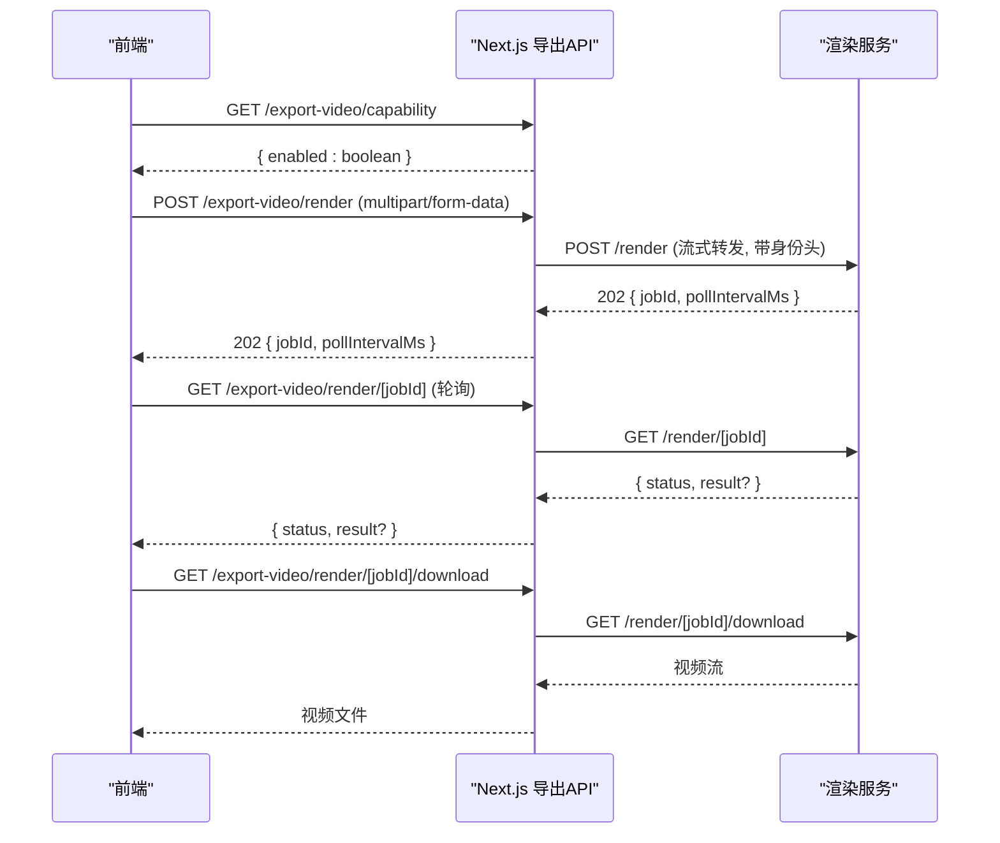
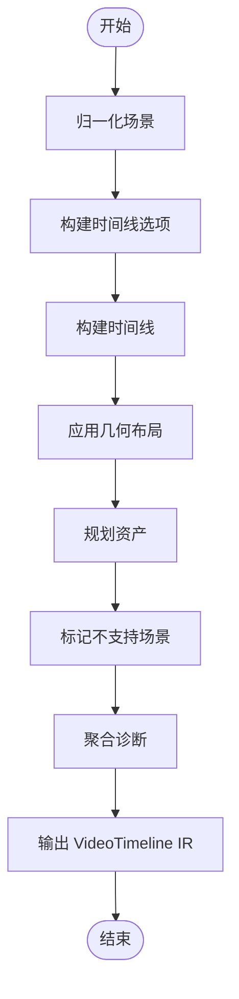

# 配置与优化

<cite>
**本文引用的文件**   
- [app/api/export-video/render/route.ts](file://app/api/export-video/render/route.ts)
- [app/api/export-video/capability/route.ts](file://app/api/export-video/capability/route.ts)
- [lib/video-export/index.ts](file://lib/video-export/index.ts)
- [lib/video-export/compile.ts](file://lib/video-export/compile.ts)
</cite>

## 产品概述
本章节聚焦于 OpenMAIC 的视频导出配置与优化系统，围绕渲染服务接入、视频编译管线、资源管理与性能调优展开。该系统将课堂数据编译为可被下游渲染器（如 Hyperframes）消费的视频时间线 IR，并通过独立的渲染服务完成 MP4 生成与下载。其核心价值在于：
- 提供稳定的“一键导出 MP4”能力，前端根据渲染服务可用性动态展示入口。
- 通过纯函数编译管线保证可测试性与跨环境一致性，避免对运行时环境的强依赖。
- 以流式上传、大小限制与超时控制保障大体积 ZIP 的可靠提交。
- 通过诊断信息与标记机制，明确不支持场景的处理策略，提升可观测性。

## 核心业务流程
视频导出的端到端流程如下：
- 前端调用能力探测接口，判断是否启用“一键导出 MP4”。
- 用户发起导出请求，服务端校验并流式转发 multipart/form-data 到独立渲染服务。
- 渲染服务异步处理，返回 jobId；客户端按间隔轮询获取结果。
- 完成后，客户端从专用下载接口拉取最终视频文件。

**图表来源** 
- [app/api/export-video/capability/route.ts:1-17](file://app/api/export-video/capability/route.ts#L1-L17)
- [app/api/export-video/render/route.ts:1-114](file://app/api/export-video/render/route.ts#L1-L114)

**章节来源**
- [app/api/export-video/capability/route.ts:1-17](file://app/api/export-video/capability/route.ts#L1-L17)
- [app/api/export-video/render/route.ts:1-114](file://app/api/export-video/render/route.ts#L1-L114)

## 功能模块清单
- 能力探测模块
  - 职责：检测渲染服务是否可用（已配置且健康），返回布尔值供前端决定是否显示“一键导出 MP4”。
  - 验收要点：未配置或不可用时返回 disabled，不泄露服务 URL。
- 渲染提交模块
  - 职责：接收前端 multipart/form-data，进行大小与类型校验，流式转发至渲染服务，返回 jobId 与轮询间隔。
  - 验收要点：支持大体积 ZIP 流式上传、严格大小上限、超时控制、错误码映射。
- 视频编译模块
  - 职责：将课堂数据编译为 VideoTimeline IR，包含场景归一化、时间线构建、几何布局、资产规划与诊断输出。
  - 验收要点：纯函数实现、无外部 IO、支持占位符与诊断信息、兼容后续 Hyperframes 发射器。

**章节来源**
- [app/api/export-video/capability/route.ts:1-17](file://app/api/export-video/capability/route.ts#L1-L17)
- [app/api/export-video/render/route.ts:1-114](file://app/api/export-video/render/route.ts#L1-L114)
- [lib/video-export/index.ts:1-41](file://lib/video-export/index.ts#L1-L41)
- [lib/video-export/compile.ts:1-183](file://lib/video-export/compile.ts#L1-L183)

## 数据与状态
- 视频时间线 IR（VideoTimeline）
  - 结构：schema、version、compiler、stage、canvas、config、totalDurationMs、scenes、subtitles、assets、diagnostics。
  - 作用：作为导出系统的契约，描述时间轴、场景、字幕与资产计划，供下游渲染器消费。
- 编译输入与依赖
  - CompileInput：包含 stage（id、name）与 scenes（CompilerScene[]）。
  - CompileDeps：注入 timing（TimingProbe）、assets（AssetSource）、config（CompileConfig）。
- 状态流转
  - 归一化 → 探针选项 → 时间线构建 → 几何应用 → 资产规划 → 不支持场景标记 → 诊断聚合 → IR 产出。

**图表来源** 
- [lib/video-export/compile.ts:1-183](file://lib/video-export/compile.ts#L1-L183)

**章节来源**
- [lib/video-export/index.ts:1-41](file://lib/video-export/index.ts#L1-L41)
- [lib/video-export/compile.ts:1-183](file://lib/video-export/compile.ts#L1-L183)

## 关键约束与边界
- 渲染服务配置与健康检查
  - 能力探测接口仅在服务已配置且健康时返回 enabled，避免前端误报。
  - 未配置时返回禁用状态，前端降级为“下载 ZIP”。
- 上传大小与超时
  - 最大上传字节数限制（MAX_UPLOAD_BYTES），对 Content-Length 快速拒绝与流式计数双重保护。
  - 提交超时（SUBMIT_TIMEOUT_MS）确保慢链路下的稳定性。
- 身份识别与限流
  - 基于 x-forwarded-for/x-real-ip 推导客户端身份，受 TRUST_PROXY_HEADERS 环境变量控制。
  - 渲染服务侧使用身份进行限流与配额管理。
- 错误处理与诊断
  - 上游错误映射为统一 API 错误码（RATE_LIMITED、INVALID_REQUEST、UPSTREAM_ERROR）。
  - 编译阶段输出诊断信息，包括不支持场景的占位符与原因说明。

**章节来源**
- [app/api/export-video/capability/route.ts:1-17](file://app/api/export-video/capability/route.ts#L1-L17)
- [app/api/export-video/render/route.ts:1-114](file://app/api/export-video/render/route.ts#L1-L114)
- [lib/video-export/compile.ts:1-183](file://lib/video-export/compile.ts#L1-L183)