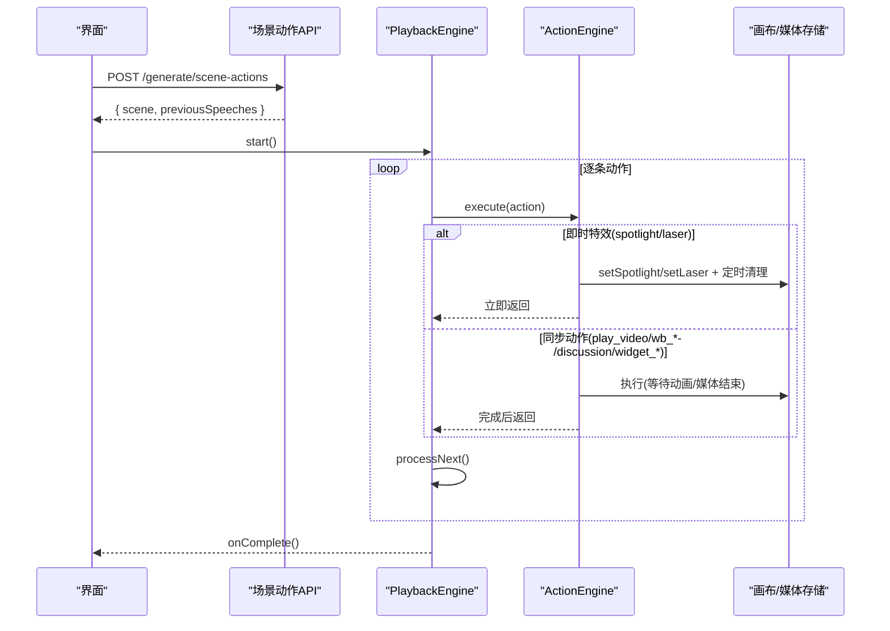
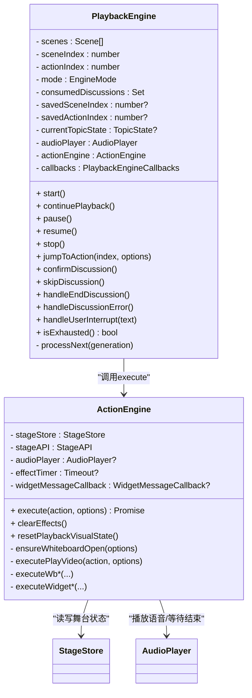
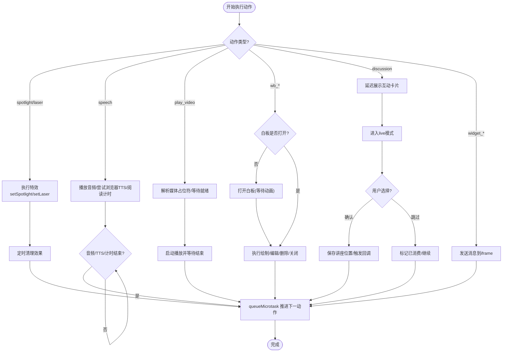
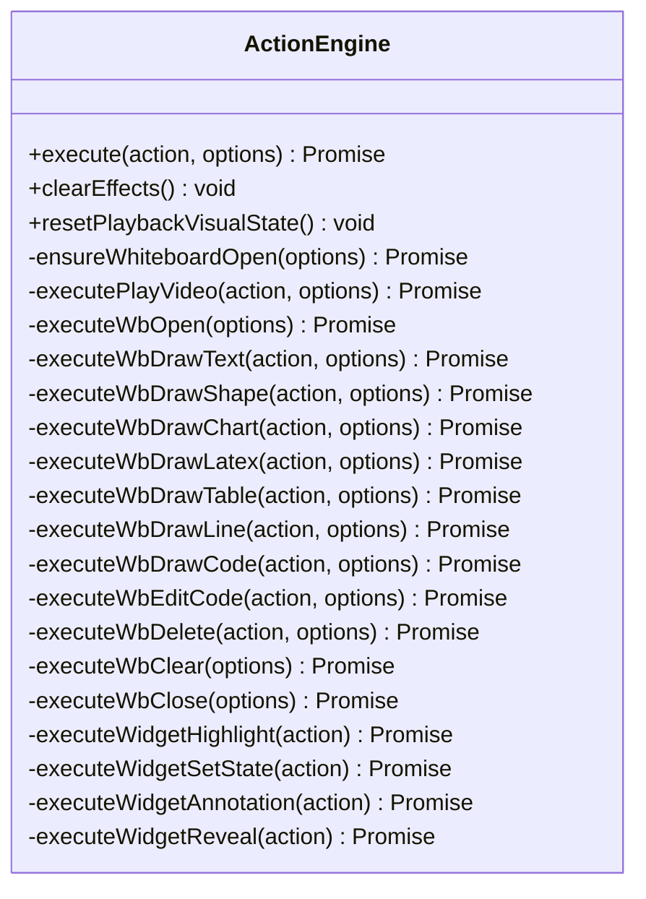
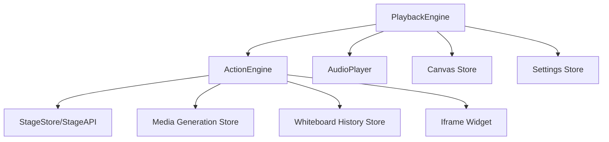

# 动作执行引擎

<cite>
**本文引用的文件**   
- [packages/@openmaic/dsl/src/action.ts](file://packages/@openmaic/dsl/src/action.ts)
- [lib/playback/engine.ts](file://lib/playback/engine.ts)
- [lib/action/engine.ts](file://lib/action/engine.ts)
- [app/api/generate/scene-actions/route.ts](file://app/api/generate/scene-actions/route.ts)
- [components/chat/use-chat-sessions.ts](file://components/chat/use-chat-sessions.ts)
- [tests/playback/action-navigation.test.ts](file://tests/playback/action-navigation.test.ts)
</cite>

## 产品概述
本文件聚焦于 OpenMAIC 的动作执行引擎，系统化阐述动作类型、执行顺序、异步与错误恢复机制、动作与场景的绑定关系、参数解析与执行流程，以及自定义动作开发指南。引擎由“播放控制层（PlaybackEngine）”和“动作执行层（ActionEngine）”组成：前者负责状态机、时序编排与用户交互；后者负责具体动作到渲染/媒体/白板的落地实现。

## 核心业务流程
- 生成阶段：通过 API 根据场景大纲与内容生成动作序列，并组装完整 Scene。
- 回放阶段：PlaybackEngine 按顺序消费 Scene.actions，调用 ActionEngine.execute 执行动作；对同步动作等待完成，对即时特效采用“即发即弃”。
- 讨论触发：遇到 discussion 动作时延迟展示互动卡片，进入 live 模式，支持确认/跳过/中断等交互。
- 跳转与重放：支持安全跳转至可重建的前缀（如白板动作），自动静默重放确定性动作，避免重复副作用。



**章节来源**
- [app/api/generate/scene-actions/route.ts:1-184](file://app/api/generate/scene-actions/route.ts#L1-L184)
- [lib/playback/engine.ts:540-734](file://lib/playback/engine.ts#L540-L734)
- [lib/action/engine.ts:130-201](file://lib/action/engine.ts#L130-L201)

## 功能模块清单
- 语音合成（speech）
  - 职责：优先播放预置音频；若无则尝试浏览器原生 TTS；否则按阅读时长估算推进。
  - 验收要点：onSpeechStart/onSpeechEnd 回调正确；暂停/恢复后继续；无文本时走阅读计时器。
- 白板操作（wb_*）
  - 职责：打开/绘制/编辑/删除/关闭等；自动确保白板已打开；支持静默重放用于跳转。
  - 验收要点：元素添加/更新/删除动画完成后再推进；多次跳转不重复副作用。
- 视频播放（play_video）
  - 职责：等待媒体就绪（含占位符解析与任务监听），启动播放并在结束时返回。
  - 验收要点：失败或超时不阻塞后续动作；信号中止能安全退出。
- 特效展示（spotlight/laser）
  - 职责：即时高亮/激光指示，自动定时清理；不影响主流程阻塞。
  - 验收要点：连续多个特效不会栈溢出；跳转前未到达的目标不触发。
- 讨论触发（discussion）
  - 职责：延迟展示互动卡片，进入 live 模式；支持确认/跳过/中断；结束后恢复讲座位置。
  - 验收要点：被跳过的讨论不再重复触发；Agent 过滤生效；错误路径回到 idle。
- 小部件交互（widget_*）
  - 职责：向 iframe 发送消息（高亮/设置状态/标注/揭示）。
  - 验收要点：回调缺失时记录警告；延时保证视觉反馈。

**章节来源**
- [lib/playback/engine.ts:571-734](file://lib/playback/engine.ts#L571-L734)
- [lib/action/engine.ts:236-835](file://lib/action/engine.ts#L236-L835)
- [components/chat/use-chat-sessions.ts:2103-2139](file://components/chat/use-chat-sessions.ts#L2103-L2139)

## 数据与状态
- 动作类型与分类
  - 统一 Action 联合类型，包含 spotlight/laser/speech/wb_*/play_video/discussion/widget_* 等。
  - 常量定义区分“即时特效”“仅幻灯片作用域”“必须同步等待”的动作集合。
- 播放引擎状态
  - 模式：idle/playing/paused/live；快照包含 sceneIndex、actionIndex、consumedDiscussions、sceneId。
  - 关键内部状态：当前触发事件、定时器、TTS 分块、阅读计时剩余时间、播放代数（generation）。
- 动作执行器状态
  - 维护舞台 API、音频播放器、效果清理定时器、小部件消息回调。
  - 提供 resetPlaybackVisualState/clearEffects 以支持跳转与重置。



**图表来源**
- [lib/playback/engine.ts:61-108](file://lib/playback/engine.ts#L61-L108)
- [lib/action/engine.ts:94-123](file://lib/action/engine.ts#L94-L123)

**章节来源**
- [packages/@openmaic/dsl/src/action.ts:225-331](file://packages/@openmaic/dsl/src/action.ts#L225-L331)
- [lib/playback/engine.ts:61-146](file://lib/playback/engine.ts#L61-L146)
- [lib/action/engine.ts:94-123](file://lib/action/engine.ts#L94-L123)

## 关键约束与边界
- 动作执行顺序
  - 即时特效（spotlight/laser）非阻塞，使用微任务推进下一动作，避免深递归。
  - 同步动作（speech/play_video/wb_*/discussion/widget_*）必须 await 完成再推进。
- 异步处理与错误恢复
  - 播放代数（generation）防止旧回调影响新跳转；所有异步回调均检查 isCurrentGeneration。
  - 视频播放具备超时保护与中止信号；TTS 分块避免长文本 onend 丢失；阅读计时在暂停时保留剩余时间。
  - 讨论错误路径直接回到 idle，保持回放一致性。
- 跳转与重放
  - 仅允许跳转到“可重建前缀”（如 wb_*），自动静默重放确定性动作，避免重复副作用。
  - 跳转会清理效果、暂停视频、重置白板状态，确保目标位置一致。
- 并发控制
  - 单线程事件循环内串行执行；通过 queueMicrotask 与 setTimeout 解耦视觉效果。
  - 多源异步（音频、TTS、媒体、定时器）通过 generation 与订阅取消保证一致性。
- 性能优化策略
  - 对白板绘制/代码打字/表格清除等动画使用固定延时，避免频繁测量。
  - 视频等待使用状态订阅+超时双保险，减少无效等待。
  - 小部件消息批量短延时，保证 UI 反馈但不阻塞主流程。



**图表来源**
- [lib/playback/engine.ts:540-734](file://lib/playback/engine.ts#L540-L734)
- [lib/action/engine.ts:130-201](file://lib/action/engine.ts#L130-L201)

**章节来源**
- [tests/playback/action-navigation.test.ts:255-457](file://tests/playback/action-navigation.test.ts#L255-L457)
- [lib/playback/engine.ts:181-218](file://lib/playback/engine.ts#L181-L218)
- [lib/action/engine.ts:267-348](file://lib/action/engine.ts#L267-L348)

## 详细组件分析

### 动作类型与参数解析
- 动作类型定义集中在 DSL 包中，提供联合类型与常量集合，确保编译期穷尽检查。
- 参数校验与默认值：例如 spotlight.dimOpacity、laser.color、wb_draw_text.fontSize/color 等均有默认值。
- 作用域限制：SLIDE_ONLY_ACTIONS 限定仅在幻灯片场景有效。

**章节来源**
- [packages/@openmaic/dsl/src/action.ts:28-246](file://packages/@openmaic/dsl/src/action.ts#L28-L246)
- [packages/@openmaic/dsl/src/action.ts:250-315](file://packages/@openmaic/dsl/src/action.ts#L250-L315)

### 播放引擎（PlaybackEngine）
- 状态机：idle/playing/paused/live，支持 start/continue/pause/resume/stop。
- 核心循环 processNext：按动作类型分发执行，同步动作 await，即时特效微任务推进。
- 跳转能力：jumpToAction 支持安全前缀重建、静默重放白板动作、清理效果与状态。
- 讨论生命周期：confirm/skip/end/error 多种路径，确保讲座位置恢复与状态一致。
- TTS 与阅读计时：浏览器原生 TTS 分块播放，失败/取消兼容；无音频时按文本长度估算停留。

```mermaid
sequenceDiagram
participant PE as "PlaybackEngine"
participant AE as "ActionEngine"
participant AP as "AudioPlayer"
participant WS as "Web Speech API"
PE->>PE : processNext()
alt speech
PE->>AP : play(audioId/audioUrl)
opt 无预置音频且启用浏览器TTS
PE->>WS : speak(chunk)
WS-->>PE : onend -> onSpeechEnd
else 无音频且TTS禁用
PE->>PE : scheduleReadingTimer()
PE-->>PE : onTimeout -> onSpeechEnd
end
AP-->>PE : onEnded -> onSpeechEnd
PE->>PE : processNext()
else spotlight/laser
PE->>AE : execute(action)
AE-->>PE : 立即返回
PE->>PE : queueMicrotask(processNext)
else play_video/wb_*/discussion/widget_*
PE->>AE : execute(action)
AE-->>PE : 完成后返回
PE->>PE : processNext()
end
```

**图表来源**
- [lib/playback/engine.ts:571-734](file://lib/playback/engine.ts#L571-L734)
- [lib/action/engine.ts:236-263](file://lib/action/engine.ts#L236-L263)

**章节来源**
- [lib/playback/engine.ts:148-218](file://lib/playback/engine.ts#L148-L218)
- [lib/playback/engine.ts:540-734](file://lib/playback/engine.ts#L540-L734)

### 动作执行器（ActionEngine）
- 执行入口 execute：根据类型路由到具体方法；silent 选项跳过部分副作用（用于跳转重放）。
- 白板自动化：wb_* 动作前自动确保白板打开；绘制/编辑/删除/关闭均带动画延时。
- 视频播放：解析占位符 mediaRef，等待生成任务完成，启动播放并等待结束或超时。
- 小部件交互：通过回调发送消息，缺失时记录警告；统一短延时保证视觉反馈。
- 效果清理：spotlight/laser 自动定时清理；clearEffects/resetPlaybackVisualState 支持跳转重置。



**图表来源**
- [lib/action/engine.ts:130-201](file://lib/action/engine.ts#L130-L201)
- [lib/action/engine.ts:267-835](file://lib/action/engine.ts#L267-L835)

**章节来源**
- [lib/action/engine.ts:130-201](file://lib/action/engine.ts#L130-L201)
- [lib/action/engine.ts:267-835](file://lib/action/engine.ts#L267-L835)

### 场景动作生成与绑定
- API 接收 outline/allOutlines/content/stageId/agents/userProfile/languageDirective，构建跨场景上下文。
- 调用 generateSceneActions 生成动作序列，buildCompleteScene 组装 Scene。
- 输出 previousSpeeches 用于跨场景连贯性。

**章节来源**
- [app/api/generate/scene-actions/route.ts:35-176](file://app/api/generate/scene-actions/route.ts#L35-L176)

### 聊天会话与动作推送
- addLectureMessage 将 speech/spotlight/laser/discussion 推入会话缓冲，维持 lastActionIndex 去重。
- 对非 speech 动作（特效/讨论）以时间戳 pushAction，便于回放与展示。

**章节来源**
- [components/chat/use-chat-sessions.ts:2103-2139](file://components/chat/use-chat-sessions.ts#L2103-L2139)

### 跳转与重放行为验证
- 测试覆盖：拒绝非法/不安全目标；静默重放确定性白板动作；跳转前未达到的特效不触发；过时 microtask 被 generation 忽略；正常播放仍触发自身特效；暂停时跳转不自动播放；播放中跳转继续从目标推进；后退重放不重复白板动作；过时音频/TTS 回调不推进。

**章节来源**
- [tests/playback/action-navigation.test.ts:255-457](file://tests/playback/action-navigation.test.ts#L255-L457)

## 依赖分析
- 模块耦合
  - PlaybackEngine 依赖 ActionEngine、AudioPlayer、Canvas Store、Settings Store。
  - ActionEngine 依赖 StageStore/StageAPI、Canvas Store、媒体生成 Store、白板上历史 Store。
- 外部集成
  - Web Speech API（浏览器 TTS）、媒体生成任务（占位符解析）、iframe 小部件通信。
- 潜在循环依赖
  - 通过回调与订阅解耦，避免直接循环引用；generation 令牌保障异步一致性。



**图表来源**
- [lib/playback/engine.ts:26-52](file://lib/playback/engine.ts#L26-L52)
- [lib/action/engine.ts:94-123](file://lib/action/engine.ts#L94-L123)

**章节来源**
- [lib/playback/engine.ts:26-52](file://lib/playback/engine.ts#L26-L52)
- [lib/action/engine.ts:94-123](file://lib/action/engine.ts#L94-L123)

## 性能考虑
- 避免阻塞：即时特效使用微任务；视频播放使用订阅+超时；TTS 分块避免长句 onend 丢失。
- 动画成本：白板绘制/代码打字/表格清除使用固定延时，减少测量开销。
- 状态重置：跳转时统一清理效果/暂停视频/重置白板，避免累积状态导致卡顿。
- 资源释放：dispose/clearEffects/cancelBrowserTTS 确保无泄漏。

[本节为通用指导，无需源码引用]

## 故障排查指南
- 常见问题
  - 跳转后特效未触发：确认目标索引是否在可重建前缀内；检查 generation 令牌是否过期。
  - 视频播放卡住：检查媒体任务状态与超时；确认信号中止逻辑。
  - TTS 无声音：检查设置开关与浏览器支持；空文本走阅读计时器。
  - 讨论未出现：确认 Agent 过滤与延迟触发；查看 consumedDiscussions 是否已消费。
- 调试建议
  - 打印 engine.getSnapshot() 与 mode；观察 onProgress/onSpeechStart/onSpeechEnd 回调。
  - 使用 silent 选项重放白板动作验证确定性；检查 ActionEngine.clearEffects/resetPlaybackVisualState 调用时机。

**章节来源**
- [lib/playback/engine.ts:181-218](file://lib/playback/engine.ts#L181-L218)
- [lib/action/engine.ts:212-221](file://lib/action/engine.ts#L212-L221)
- [tests/playback/action-navigation.test.ts:255-457](file://tests/playback/action-navigation.test.ts#L255-L457)

## 结论
动作执行引擎通过清晰的类型契约、稳健的状态机与异步控制，实现了语音、白板、视频、特效、讨论与小部件交互的统一编排。其设计兼顾了回放一致性、跳转安全性与扩展性，为课件生成与课堂互动提供了可靠基础。