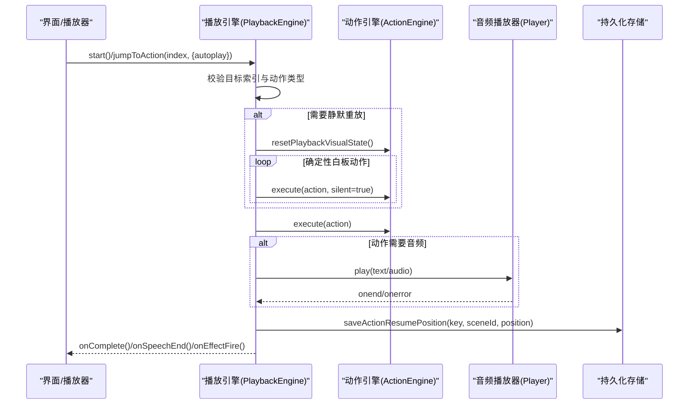
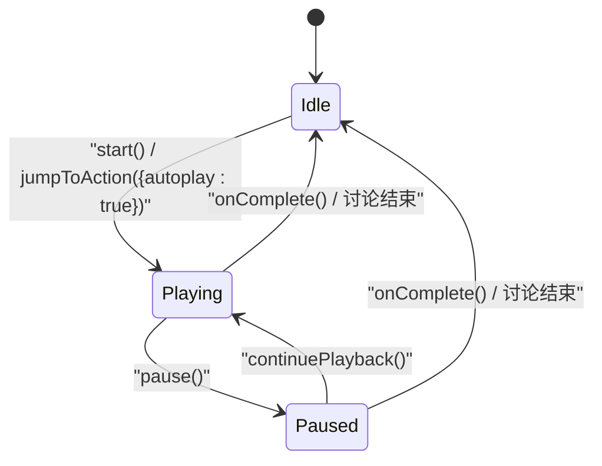
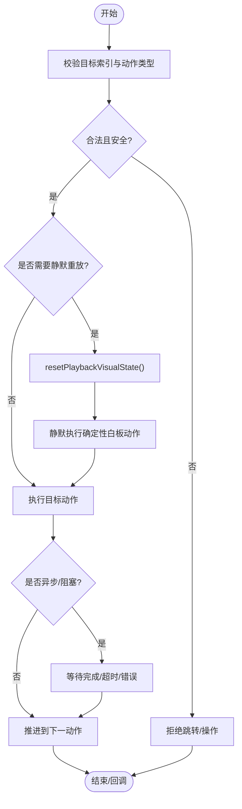

# 动作生命周期管理

<cite>
**本文引用的文件**   
- [lib/choreography/timing.ts](file://lib/choreography/timing.ts)
- [tests/playback/action-navigation.test.ts](file://tests/playback/action-navigation.test.ts)
- [components/chat/use-chat-sessions.ts](file://components/chat/use-chat-sessions.ts)
- [lib/logger.ts](file://lib/logger.ts)
</cite>

## 目录
- 产品概述
- 核心业务流程
- 功能模块清单
- 数据与状态
- 关键约束与边界

## 产品概述
本文件聚焦 OpenMAIC 中“动作（Action）”的生命周期管理，覆盖从动作入队、调度执行、异步处理、并发控制、信号取消到资源清理的全链路。文档同时解释静默执行模式、动画时序控制、性能优化策略，以及监控日志、调试工具与故障排查方法，帮助开发者在课件播放与课堂回放场景中稳定、可控地驱动各类动作（如语音播报、白板绘制、聚光灯效果、讨论触发等）。

## 核心业务流程
- 动作入队与校验：播放引擎接收场景中的动作序列，对目标位置进行合法性与安全性校验，拒绝不安全或需要重建上下文的目标（如某些交互型动作）。
- 执行与推进：按顺序执行动作，遇到需阻塞的视觉/媒体动作时等待其完成；对于可并发的效果类动作采用“fire-and-forget”并自动清理。
- 跳转与重放：支持跳转到任意动作索引，必要时对确定性白板动作进行静默重放以恢复一致状态；跳过非确定性或不可逆动作。
- 异步与取消：通过 AbortController 与软关闭机制中断长任务，确保请求与缓冲资源被正确回收。
- 完成与收尾：当到达最后一个动作或用户主动结束讨论时，触发完成回调并进入空闲态。

图表来源 
- [tests/playback/action-navigation.test.ts:261-300](file://tests/playback/action-navigation.test.ts#L261-L300)
- [tests/playback/action-navigation.test.ts:325-380](file://tests/playback/action-navigation.test.ts#L325-L380)
- [tests/playback/action-navigation.test.ts:417-453](file://tests/playback/action-navigation.test.ts#L417-L453)

章节来源
- [tests/playback/action-navigation.test.ts:261-300](file://tests/playback/action-navigation.test.ts#L261-L300)
- [tests/playback/action-navigation.test.ts:325-380](file://tests/playback/action-navigation.test.ts#L325-L380)
- [tests/playback/action-navigation.test.ts:417-453](file://tests/playback/action-navigation.test.ts#L417-L453)

## 功能模块清单
- 播放引擎（PlaybackEngine）
  - 职责：编排动作序列、处理跳转/暂停/继续、维护当前索引与模式、协调动作引擎与音频播放器、触发事件回调。
  - 验收要点：跳转安全校验、静默重放一致性、异步完成回调不串扰、最后动作完成后进入空闲态。
- 动作引擎（ActionEngine）
  - 职责：执行具体动作（语音、白板、聚光灯、交互等），提供重置播放视觉状态能力，记录执行轨迹。
  - 验收要点：支持 silent 模式、可观测执行结果、对不确定动作的幂等性保障。
- 音频播放器（Player）
  - 职责：播放 TTS/预生成音频，返回播放状态与结束事件。
  - 验收要点：旧播放任务结束后不触发过期回调、错误路径及时清理。
- 时间常量（timing.ts）
  - 职责：集中定义效果自动清理时长、讨论触发延迟、最大视频等待、白板/组件动画时长、无音频朗读估算等。
  - 验收要点：导出值与渲染/导出器保持一致，避免漂移。
- 会话与中断（use-chat-sessions.ts）
  - 职责：管理流式会话、AbortController 取消、软关闭注册、缓冲清理、错误后清理。
  - 验收要点：用户中断忽略 AbortError、finally 中清理活跃控制器、资源回收有序。
- 日志（logger.ts）
  - 职责：统一日志输出、级别过滤、JSON/文本格式切换。
  - 验收要点：按 LOG_LEVEL 过滤、错误堆栈友好输出。

章节来源
- [lib/choreography/timing.ts:1-122](file://lib/choreography/timing.ts#L1-L122)
- [components/chat/use-chat-sessions.ts:1479-1865](file://components/chat/use-chat-sessions.ts#L1479-L1865)
- [lib/logger.ts:1-53](file://lib/logger.ts#L1-L53)

## 数据与状态
- 核心数据模型
  - 动作（Action）：包含 id、type 及类型相关参数（如 speech 的文本、spotlight 的目标元素、wb_* 的绘图参数等）。
  - 场景（Scene）：由若干动作组成的序列。
  - 播放快照（Snapshot）：包含 actionIndex、mode（playing/paused/idle）、是否耗尽（isExhausted）等。
  - 恢复位点（Action Resume Position）：key + sceneId -> {actionIndex, actionId, actionType}，用于断点续播。
- 关键状态流转
  - idle → playing：start() 或 jumpToAction({autoplay:true})
  - playing → paused：pause()
  - paused → playing：continuePlayback()
  - playing/paused → idle：onComplete() 或用户结束讨论
- 数据所有权边界
  - PlaybackEngine 持有当前场景与动作索引，负责推进与事件派发。
  - ActionEngine 负责动作执行与视觉状态重置。
  - Player 仅暴露播放接口与事件，不感知动作语义。
  - 存储层负责持久化恢复位点，供下次加载恢复。

[此图为概念图，无需图表来源]

章节来源
- [tests/playback/action-navigation.test.ts:382-415](file://tests/playback/action-navigation.test.ts#L382-L415)
- [tests/playback/action-navigation.test.ts:533-553](file://tests/playback/action-navigation.test.ts#L533-L553)

## 关键约束与边界
- 并发控制与队列
  - 动作按序执行，阻塞型动作（如白板绘制、视频播放）等待完成后再推进。
  - 效果类动作（聚光灯/激光）采用 fire-and-forget，并在固定时长后自动清理。
  - 跳转时若目标前存在确定性白板动作，将静默重放以恢复一致状态，避免重复绘制。
- 信号取消与资源清理
  - 使用 AbortController 中断流式请求，捕获并忽略 AbortError。
  - 软关闭注册与缓冲 shutdown 保证资源释放有序。
  - finally 块中清理活跃控制器与状态标志，防止竞态。
- 动画时序与性能
  - 所有动画/等待时长集中在 timing.ts，确保应用与导出器行为一致。
  - 无音频朗读估算基于字符/词数与语言特征，避免长时间阻塞。
  - 最大视频等待上限防止无限挂起。
- 错误恢复与重试
  - 跳转至非法/不安全目标直接拒绝。
  - 过期的播放/计时器回调被丢弃，避免旧任务影响新状态。
  - 讨论结束时优先恢复被中断的最后一次语音，再通知结束。
- 监控与调试
  - 统一日志输出，支持 JSON 格式与级别过滤，便于问题定位。
  - 测试用例覆盖跳转、静默重放、过期回调、最后动作完成等关键路径。

[此图为概念图，无需图表来源]

章节来源
- [lib/choreography/timing.ts:1-122](file://lib/choreography/timing.ts#L1-L122)
- [components/chat/use-chat-sessions.ts:1479-1865](file://components/chat/use-chat-sessions.ts#L1479-L1865)
- [tests/playback/action-navigation.test.ts:261-300](file://tests/playback/action-navigation.test.ts#L261-L300)
- [tests/playback/action-navigation.test.ts:417-453](file://tests/playback/action-navigation.test.ts#L417-L453)
- [tests/playback/action-navigation.test.ts:533-553](file://tests/playback/action-navigation.test.ts#L533-L553)
- [lib/logger.ts:1-53](file://lib/logger.ts#L1-L53)