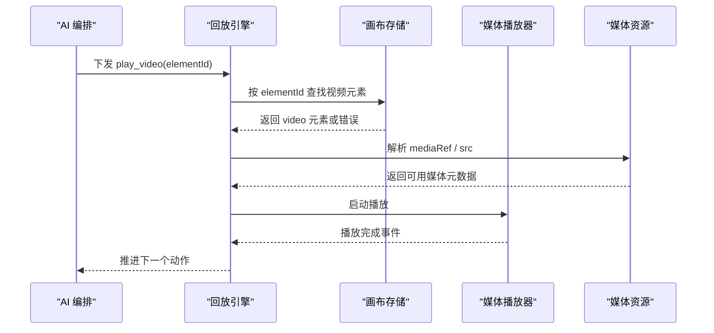
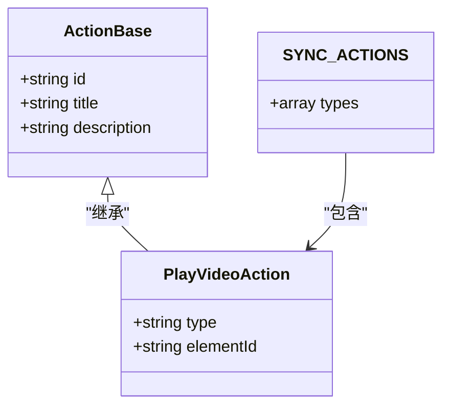
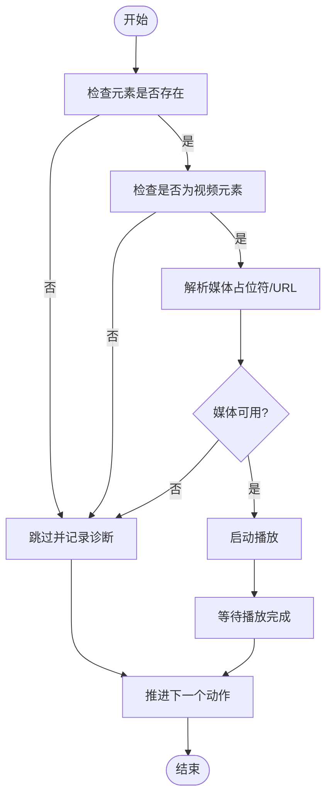
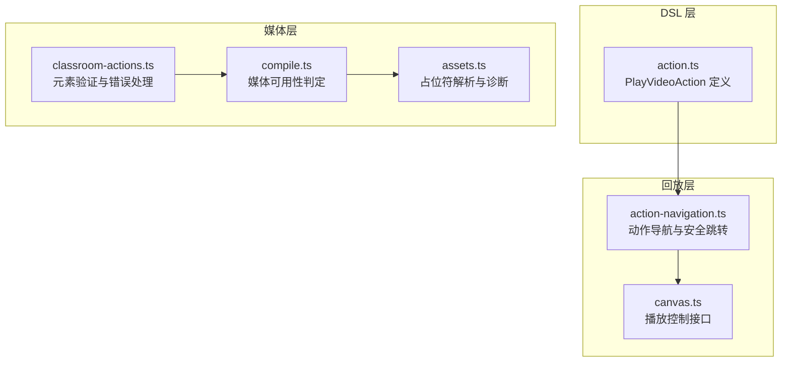
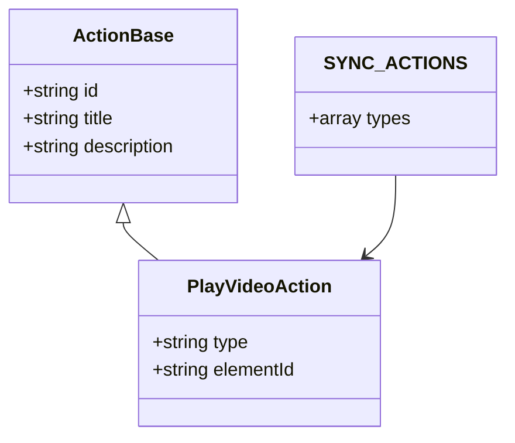
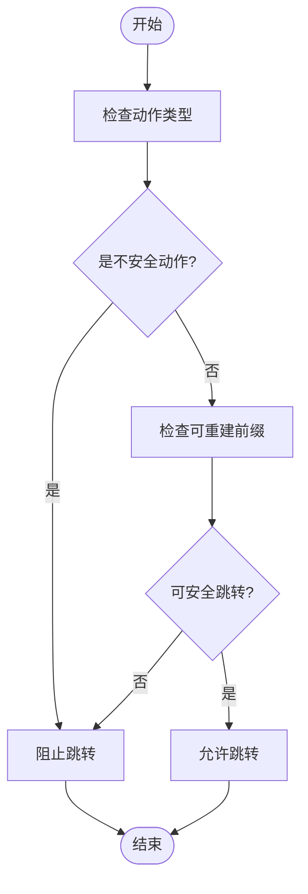
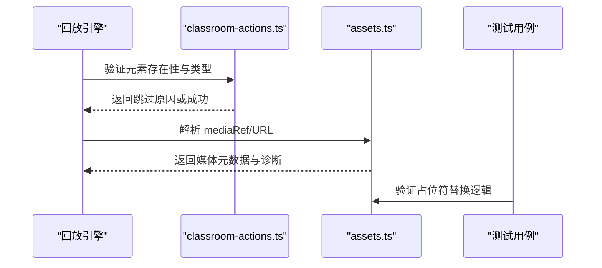
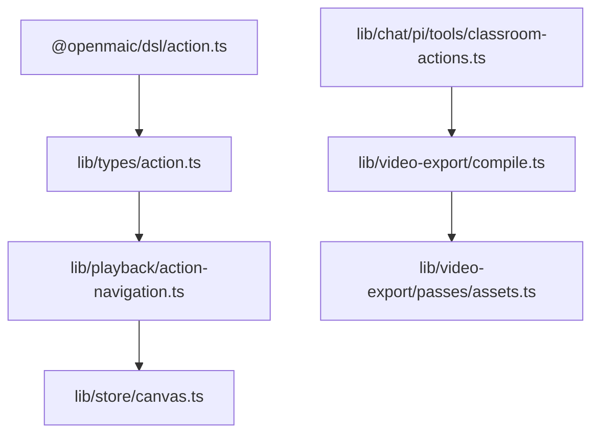

# 媒体播放动作

<cite>
**本文引用的文件**   
- [packages/@openmaic/dsl/src/action.ts](file://packages/@openmaic/dsl/src/action.ts)
- [lib/types/action.ts](file://lib/types/action.ts)
- [lib/playback/action-navigation.ts](file://lib/playback/action-navigation.ts)
- [lib/video-export/compile.ts](file://lib/video-export/compile.ts)
- [lib/video-export/passes/assets.ts](file://lib/video-export/passes/assets.ts)
- [lib/chat/pi/tools/classroom-actions.ts](file://lib/chat/pi/tools/classroom-actions.ts)
- [components/edit/ActionsBar/actions-edit.ts](file://components/edit/ActionsBar/actions-edit.ts)
- [lib/store/canvas.ts](file://lib/store/canvas.ts)
- [tests/server/classroom-media-generation.test.ts](file://tests/server/classroom-media-generation.test.ts)
</cite>

## 产品概述
本文件聚焦于“媒体播放动作”（play_video）在 OpenMAIC 中的完整实现与使用方式。它涵盖：
- 动作类型定义与分类（同步/异步、幻灯片专属等）
- 视频元素解析与媒体占位符处理
- 播放状态管理与生命周期控制
- 资源查找逻辑、生成任务等待机制与播放完成检测
- 错误恢复策略、超时处理与性能优化建议
- 配置选项与使用示例

OpenMAIC 通过统一的 Action 契约驱动课件回放，play_video 作为同步动作之一，确保在视频播放完成后才继续执行后续动作，从而保证课堂演示的时序一致性。

## 核心业务流程
- 动作触发：AI 编排或用户操作产生 play_video 动作，包含目标元素的 elementId。
- 元素定位：在当前场景的画布中根据 elementId 定位 video 元素。
- 媒体解析：若存在媒体占位符（mediaRef），优先替换为真实 URL；否则回退到直接 src。
- 播放控制：调用播放器接口启动播放，并进入同步等待状态。
- 完成检测：监听播放结束事件，确认播放完成后推进至下一个动作。
- 异常处理：找不到元素、非视频元素、媒体缺失等情况均返回跳过并记录诊断信息。

**图表来源** 
- [lib/playback/action-navigation.ts:16-42](file://lib/playback/action-navigation.ts#L16-L42)
- [lib/chat/pi/tools/classroom-actions.ts:387-415](file://lib/chat/pi/tools/classroom-actions.ts#L387-L415)
- [lib/video-export/passes/assets.ts:202-229](file://lib/video-export/passes/assets.ts#L202-L229)

**章节来源**
- [lib/playback/action-navigation.ts:16-42](file://lib/playback/action-navigation.ts#L16-L42)
- [lib/chat/pi/tools/classroom-actions.ts:387-415](file://lib/chat/pi/tools/classroom-actions.ts#L387-L415)
- [lib/video-export/passes/assets.ts:202-229](file://lib/video-export/passes/assets.ts#L202-L229)

## 功能模块清单
- 动作类型与分类
  - PlayVideoAction 定义与同步属性（SYNC_ACTIONS）
  - 幻灯片专属动作集合（SLIDE_ONLY_ACTIONS）
- 动作导航与安全跳转
  - 不安全动作识别（UNSAFE_ACTION_TYPES）
  - 可重建前缀与跳转限制
- 媒体资源解析与占位符替换
  - mediaRef 优先级与 src 回退
  - 导出管线中的可用性判定与跳过策略
- 播放控制与状态管理
  - 播放/暂停接口与状态更新
  - 播放完成检测与动作推进
- 错误恢复与诊断
  - 元素不存在、非视频、媒体缺失的诊断与跳过
  - 重试与失败持久化

**章节来源**
- [packages/@openmaic/dsl/src/action.ts:179-183](file://packages/@openmaic/dsl/src/action.ts#L179-L183)
- [packages/@openmaic/dsl/src/action.ts:250-277](file://packages/@openmaic/dsl/src/action.ts#L250-L277)
- [lib/playback/action-navigation.ts:16-42](file://lib/playback/action-navigation.ts#L16-L42)
- [lib/video-export/compile.ts:99-129](file://lib/video-export/compile.ts#L99-L129)
- [lib/video-export/passes/assets.ts:202-229](file://lib/video-export/passes/assets.ts#L202-L229)
- [lib/store/canvas.ts:156-158](file://lib/store/canvas.ts#L156-L158)

## 数据与状态
- 核心数据模型
  - PlayVideoAction：包含 id、elementId，用于定位视频元素
  - ActionBase：通用动作基础字段（id、title、description）
  - SYNC_ACTIONS：同步动作列表，play_video 在其中，确保顺序执行
- 关键状态流转
  - 播放前：定位元素、解析媒体、准备播放器
  - 播放中：进入等待状态，监听播放事件
  - 播放后：清理状态、推进动作索引、释放资源
- 数据所有权边界
  - 动作定义位于 DSL 包，回放引擎与渲染器共享同一份类型
  - 媒体资源由媒体编排器与存储层管理，回放仅消费已就绪的媒体

**图表来源** 
- [packages/@openmaic/dsl/src/action.ts:20-24](file://packages/@openmaic/dsl/src/action.ts#L20-L24)
- [packages/@openmaic/dsl/src/action.ts:179-183](file://packages/@openmaic/dsl/src/action.ts#L179-L183)
- [packages/@openmaic/dsl/src/action.ts:250-277](file://packages/@openmaic/dsl/src/action.ts#L250-L277)

**章节来源**
- [packages/@openmaic/dsl/src/action.ts:20-24](file://packages/@openmaic/dsl/src/action.ts#L20-L24)
- [packages/@openmaic/dsl/src/action.ts:179-183](file://packages/@openmaic/dsl/src/action.ts#L179-L183)
- [packages/@openmaic/dsl/src/action.ts:250-277](file://packages/@openmaic/dsl/src/action.ts#L250-L277)

## 关键约束与边界
- 非功能性需求
  - 播放必须同步阻塞，直到视频播放完成或明确跳过
  - 媒体缺失时不应阻塞后续动作，应快速跳过并记录诊断
- 依赖与集成边界
  - 动作类型来自 @openmaic/dsl，回放引擎与渲染器统一消费
  - 媒体生成与代理通过前端编排器与服务器 API 协作
- 业务约束
  - play_video 仅在幻灯片场景中有效（需要 canvas 元素）
  - 不安全动作（如 play_video、discussion、widget_*）禁止随意跳转，需重建前缀

**图表来源** 
- [lib/chat/pi/tools/classroom-actions.ts:387-415](file://lib/chat/pi/tools/classroom-actions.ts#L387-L415)
- [lib/video-export/passes/assets.ts:202-229](file://lib/video-export/passes/assets.ts#L202-L229)

**章节来源**
- [lib/chat/pi/tools/classroom-actions.ts:387-415](file://lib/chat/pi/tools/classroom-actions.ts#L387-L415)
- [lib/video-export/passes/assets.ts:202-229](file://lib/video-export/passes/assets.ts#L202-L229)

## 详细组件分析

### 动作类型与分类
- PlayVideoAction 定义在 DSL 包中，包含 elementId 用于定位视频元素
- SYNC_ACTIONS 将 play_video 标记为同步动作，确保回放引擎等待其完成
- SLIDE_ONLY_ACTIONS 限定某些动作仅在幻灯片场景生效

**章节来源**
- [packages/@openmaic/dsl/src/action.ts:179-183](file://packages/@openmaic/dsl/src/action.ts#L179-L183)
- [packages/@openmaic/dsl/src/action.ts:250-277](file://packages/@openmaic/dsl/src/action.ts#L250-L277)

### 动作导航与安全跳转
- UNSAFE_ACTION_TYPES 包含 play_video 等不安全动作，防止随意跳转
- canReconstructPrefixForAction 判断是否可安全跳转到指定动作
- buildActionNavigationTargets 构建可跳转的目标列表

**章节来源**
- [lib/playback/action-navigation.ts:16-42](file://lib/playback/action-navigation.ts#L16-L42)
- [lib/playback/action-navigation.ts:48-78](file://lib/playback/action-navigation.ts#L48-L78)
- [lib/playback/action-navigation.ts:80-95](file://lib/playback/action-navigation.ts#L80-L95)

### 媒体资源解析与占位符处理
- classroom-actions.ts 中验证元素存在性与类型，返回跳过原因
- assets.ts 中解析 mediaRef，若无媒体则标记 present:false 并记录诊断
- tests/server/classroom-media-generation.test.ts 验证占位符替换逻辑

**章节来源**
- [lib/chat/pi/tools/classroom-actions.ts:387-415](file://lib/chat/pi/tools/classroom-actions.ts#L387-L415)
- [lib/video-export/passes/assets.ts:202-229](file://lib/video-export/passes/assets.ts#L202-L229)
- [tests/server/classroom-media-generation.test.ts:24-44](file://tests/server/classroom-media-generation.test.ts#L24-L44)

### 播放控制与状态管理
- lib/store/canvas.ts 提供 playVideo/pauseVideo 接口
- 回放引擎根据动作类型决定等待策略
- 播放完成事件触发后推进动作索引

**章节来源**
- [lib/store/canvas.ts:156-158](file://lib/store/canvas.ts#L156-L158)

### 错误恢复与诊断
- classroom-actions.ts 返回结构化错误信息（skipped=true, reason=...）
- compile.ts 中 resolveAvailableVideos 提前判定媒体可用性，避免时间线偏移
- assets.ts 记录 skipped-media 诊断，区分无关联与引用缺失

**章节来源**
- [lib/chat/pi/tools/classroom-actions.ts:387-415](file://lib/chat/pi/tools/classroom-actions.ts#L387-L415)
- [lib/video-export/compile.ts:99-129](file://lib/video-export/compile.ts#L99-L129)
- [lib/video-export/passes/assets.ts:202-229](file://lib/video-export/passes/assets.ts#L202-L229)

## 架构总览

**图表来源** 
- [packages/@openmaic/dsl/src/action.ts:179-183](file://packages/@openmaic/dsl/src/action.ts#L179-L183)
- [lib/playback/action-navigation.ts:16-42](file://lib/playback/action-navigation.ts#L16-L42)
- [lib/store/canvas.ts:156-158](file://lib/store/canvas.ts#L156-L158)
- [lib/chat/pi/tools/classroom-actions.ts:387-415](file://lib/chat/pi/tools/classroom-actions.ts#L387-L415)
- [lib/video-export/compile.ts:99-129](file://lib/video-export/compile.ts#L99-L129)
- [lib/video-export/passes/assets.ts:202-229](file://lib/video-export/passes/assets.ts#L202-L229)

## 详细组件分析

### 组件 A：动作类型与分类
- PlayVideoAction 继承自 ActionBase，包含 elementId
- SYNC_ACTIONS 将 play_video 标记为同步动作
- SLIDE_ONLY_ACTIONS 限定幻灯片场景专用动作

**图表来源** 
- [packages/@openmaic/dsl/src/action.ts:20-24](file://packages/@openmaic/dsl/src/action.ts#L20-L24)
- [packages/@openmaic/dsl/src/action.ts:179-183](file://packages/@openmaic/dsl/src/action.ts#L179-L183)
- [packages/@openmaic/dsl/src/action.ts:250-277](file://packages/@openmaic/dsl/src/action.ts#L250-L277)

**章节来源**
- [packages/@openmaic/dsl/src/action.ts:20-24](file://packages/@openmaic/dsl/src/action.ts#L20-L24)
- [packages/@openmaic/dsl/src/action.ts:179-183](file://packages/@openmaic/dsl/src/action.ts#L179-L183)
- [packages/@openmaic/dsl/src/action.ts:250-277](file://packages/@openmaic/dsl/src/action.ts#L250-L277)

### 组件 B：动作导航与安全跳转
- isUnsafePlaybackNavigationAction 识别不安全动作
- canReconstructPrefixForAction 判断可重建前缀
- buildActionNavigationTargets 构建可跳转目标

**图表来源** 
- [lib/playback/action-navigation.ts:16-42](file://lib/playback/action-navigation.ts#L16-L42)
- [lib/playback/action-navigation.ts:48-78](file://lib/playback/action-navigation.ts#L48-L78)
- [lib/playback/action-navigation.ts:80-95](file://lib/playback/action-navigation.ts#L80-L95)

**章节来源**
- [lib/playback/action-navigation.ts:16-42](file://lib/playback/action-navigation.ts#L16-L42)
- [lib/playback/action-navigation.ts:48-78](file://lib/playback/action-navigation.ts#L48-L78)
- [lib/playback/action-navigation.ts:80-95](file://lib/playback/action-navigation.ts#L80-L95)

### 组件 C：媒体资源解析与占位符处理
- classroom-actions.ts 验证元素存在性与类型
- assets.ts 解析 mediaRef，记录诊断信息
- tests/server/classroom-media-generation.test.ts 验证占位符替换

**图表来源** 
- [lib/chat/pi/tools/classroom-actions.ts:387-415](file://lib/chat/pi/tools/classroom-actions.ts#L387-L415)
- [lib/video-export/passes/assets.ts:202-229](file://lib/video-export/passes/assets.ts#L202-L229)
- [tests/server/classroom-media-generation.test.ts:24-44](file://tests/server/classroom-media-generation.test.ts#L24-L44)

**章节来源**
- [lib/chat/pi/tools/classroom-actions.ts:387-415](file://lib/chat/pi/tools/classroom-actions.ts#L387-L415)
- [lib/video-export/passes/assets.ts:202-229](file://lib/video-export/passes/assets.ts#L202-L229)
- [tests/server/classroom-media-generation.test.ts:24-44](file://tests/server/classroom-media-generation.test.ts#L24-L44)

### 组件 D：播放控制与状态管理
- lib/store/canvas.ts 提供 playVideo/pauseVideo 接口
- 回放引擎根据动作类型决定等待策略
- 播放完成事件触发后推进动作索引

**章节来源**
- [lib/store/canvas.ts:156-158](file://lib/store/canvas.ts#L156-L158)

### 组件 E：错误恢复与诊断
- classroom-actions.ts 返回结构化错误信息
- compile.ts 中 resolveAvailableVideos 提前判定媒体可用性
- assets.ts 记录 skipped-media 诊断

**章节来源**
- [lib/chat/pi/tools/classroom-actions.ts:387-415](file://lib/chat/pi/tools/classroom-actions.ts#L387-L415)
- [lib/video-export/compile.ts:99-129](file://lib/video-export/compile.ts#L99-L129)
- [lib/video-export/passes/assets.ts:202-229](file://lib/video-export/passes/assets.ts#L202-L229)

## 依赖分析

**图表来源** 
- [packages/@openmaic/dsl/src/action.ts:179-183](file://packages/@openmaic/dsl/src/action.ts#L179-L183)
- [lib/types/action.ts:1-45](file://lib/types/action.ts#L1-45)
- [lib/playback/action-navigation.ts:16-42](file://lib/playback/action-navigation.ts#L16-L42)
- [lib/store/canvas.ts:156-158](file://lib/store/canvas.ts#L156-L158)
- [lib/chat/pi/tools/classroom-actions.ts:387-415](file://lib/chat/pi/tools/classroom-actions.ts#L387-L415)
- [lib/video-export/compile.ts:99-129](file://lib/video-export/compile.ts#L99-L129)
- [lib/video-export/passes/assets.ts:202-229](file://lib/video-export/passes/assets.ts#L202-L229)

**章节来源**
- [packages/@openmaic/dsl/src/action.ts:179-183](file://packages/@openmaic/dsl/src/action.ts#L179-L183)
- [lib/types/action.ts:1-45](file://lib/types/action.ts#L1-45)
- [lib/playback/action-navigation.ts:16-42](file://lib/playback/action-navigation.ts#L16-L42)
- [lib/store/canvas.ts:156-158](file://lib/store/canvas.ts#L156-L158)
- [lib/chat/pi/tools/classroom-actions.ts:387-415](file://lib/chat/pi/tools/classroom-actions.ts#L387-L415)
- [lib/video-export/compile.ts:99-129](file://lib/video-export/compile.ts#L99-L129)
- [lib/video-export/passes/assets.ts:202-229](file://lib/video-export/passes/assets.ts#L202-L229)

## 性能考虑
- 媒体可用性预判定：在时间线构建阶段提前判定媒体可用性，避免无效等待
- 快速跳过策略：媒体缺失时立即跳过，不阻塞后续动作
- 资源代理优化：通过服务器代理获取远程媒体，减少 CORS 问题
- 状态管理优化：Zustand 存储播放状态，避免重复计算

## 故障排查指南
- 元素不存在：检查 elementId 是否正确，确认场景中存在对应元素
- 非视频元素：验证元素类型是否为 video
- 媒体缺失：检查 mediaRef 是否有效，确认媒体资源可用
- 播放卡顿：检查网络延迟与媒体大小，考虑预加载策略

**章节来源**
- [lib/chat/pi/tools/classroom-actions.ts:387-415](file://lib/chat/pi/tools/classroom-actions.ts#L387-L415)
- [lib/video-export/passes/assets.ts:202-229](file://lib/video-export/passes/assets.ts#L202-L229)

## 结论
play_video 动作在 OpenMAIC 中实现了完整的媒体播放生命周期管理，包括元素解析、媒体占位符处理、播放状态管理与错误恢复。通过 DSL 统一的动作契约与回放引擎的同步等待机制，确保了课件演示的时序一致性与用户体验。未来可进一步优化媒体预加载与缓存策略，提升播放性能与稳定性。