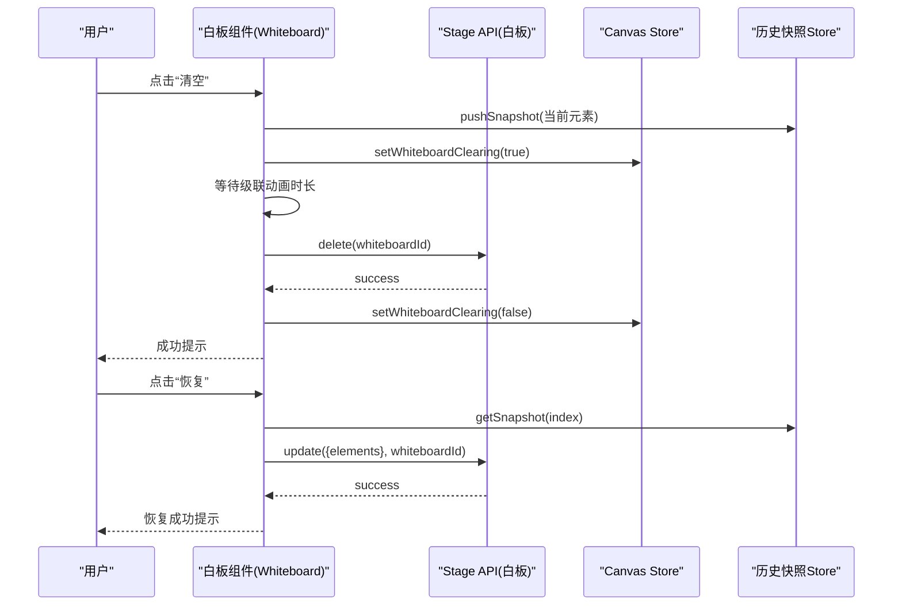
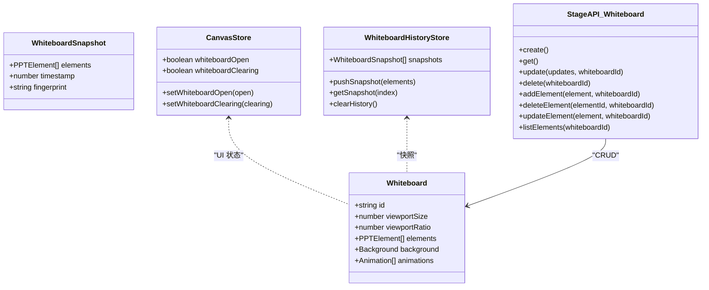
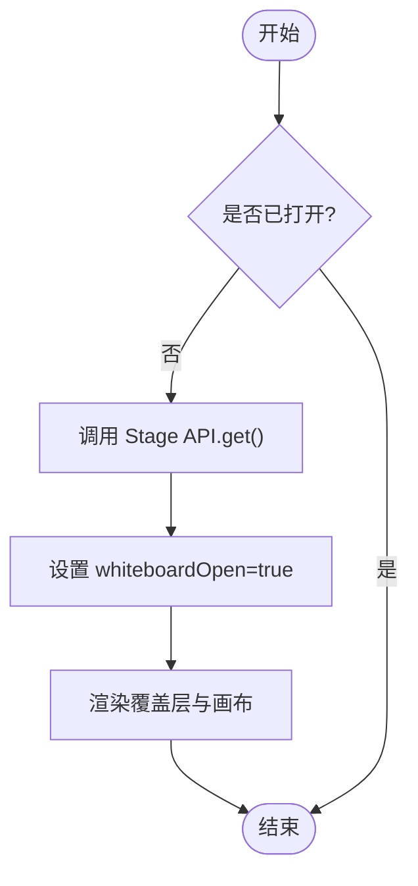
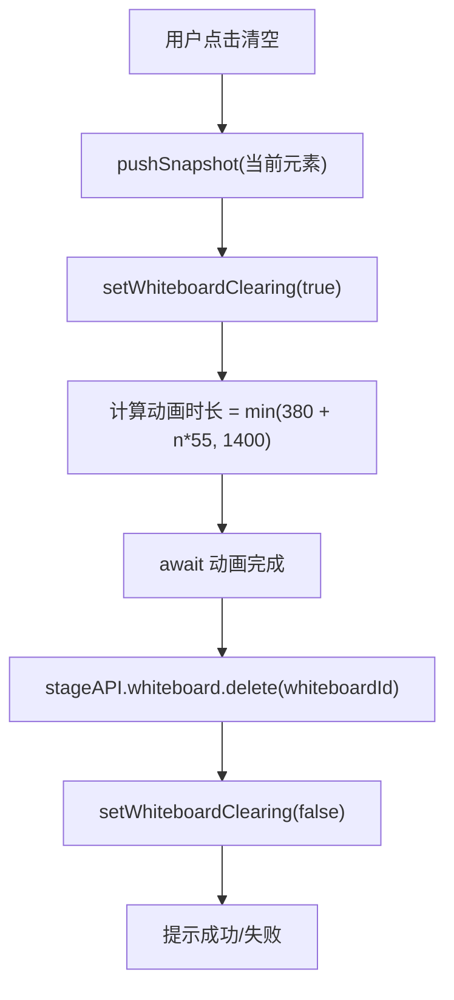
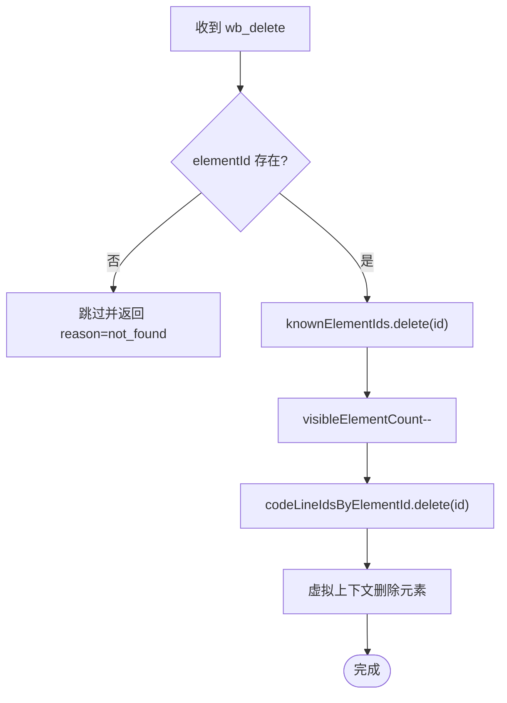
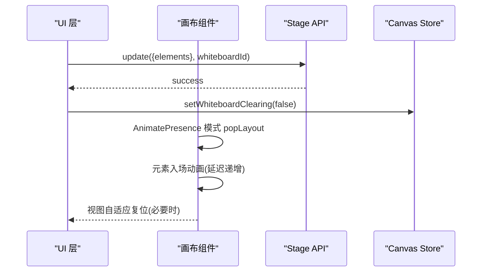
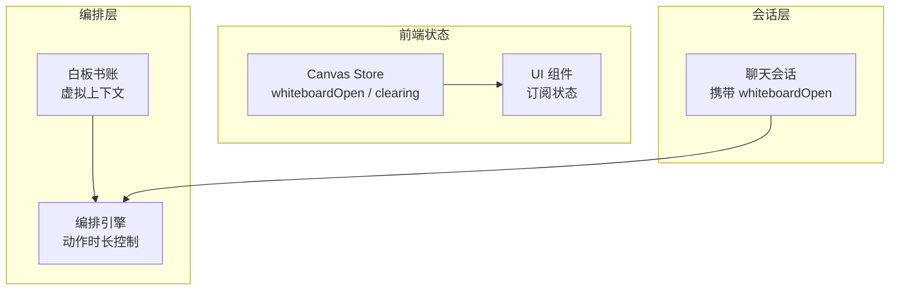

# 基础白板操作

<cite>
**本文引用的文件**   
- [components/whiteboard/index.tsx](file://components/whiteboard/index.tsx)
- [components/whiteboard/whiteboard-canvas.tsx](file://components/whiteboard/whiteboard-canvas.tsx)
- [components/whiteboard/whiteboard-history.tsx](file://components/whiteboard/whiteboard-history.tsx)
- [lib/api/stage-api-whiteboard.ts](file://lib/api/stage-api-whiteboard.ts)
- [lib/store/canvas.ts](file://lib/store/canvas.ts)
- [lib/store/whiteboard-history.ts](file://lib/store/whiteboard-history.ts)
- [lib/choreography/timing.ts](file://lib/choreography/timing.ts)
- [lib/orchestration/summarizers/whiteboard-ledger.ts](file://lib/orchestration/summarizers/whiteboard-ledger.ts)
- [components/chat/use-chat-sessions.ts](file://components/chat/use-chat-sessions.ts)
</cite>

## 产品概述
本文件聚焦于 OpenMAIC 的“白板”基础操作，围绕 wb_open、wb_close、wb_clear、wb_delete 等核心动作的实现原理与使用方式展开。白板作为课堂演示中的独立画布，支持元素绘制、删除、清空、历史快照恢复以及撤销重做能力；同时提供平移缩放、动画过渡和批量更新机制，确保在 AI 编排驱动下的稳定、流畅与可回滚体验。

## 核心业务流程
- 打开白板（wb_open）：创建或获取当前白板实例，设置打开状态并进入全屏覆盖层，准备渲染元素。
- 关闭白板（wb_close）：收起白板覆盖层，回到幻灯片主视图。
- 清空白板（wb_clear）：先保存快照，触发级联退出动画，等待动画结束后执行批量删除，最后提示结果。
- 删除元素（wb_delete）：校验元素存在性后从白板上移除，更新可见计数与代码行索引映射。
- 历史恢复与撤销重做：通过快照栈进行事务性替换，避免中间态；在清除动画进行中禁止恢复，防止数据覆盖冲突。

**图表来源** 
- [components/whiteboard/index.tsx](file://components/whiteboard/index.tsx)
- [lib/api/stage-api-whiteboard.ts](file://lib/api/stage-api-whiteboard.ts)
- [lib/store/canvas.ts](file://lib/store/canvas.ts)
- [lib/store/whiteboard-history.ts](file://lib/store/whiteboard-history.ts)

**章节来源**
- [components/whiteboard/index.tsx](file://components/whiteboard/index.tsx)
- [lib/api/stage-api-whiteboard.ts](file://lib/api/stage-api-whiteboard.ts)
- [lib/store/canvas.ts](file://lib/store/canvas.ts)
- [lib/store/whiteboard-history.ts](file://lib/store/whiteboard-history.ts)

## 功能模块清单
- 白板容器与生命周期控制
  - 职责：管理白板打开/关闭、工具栏按钮（清空、历史、最小化）、覆盖层动画与交互开关。
  - 验收要点：打开/关闭动画平滑；清空按钮在动画中禁用；历史记录面板弹出与外部点击关闭。
- 白板画布与视图交互
  - 职责：实现平移、缩放、双击复位、边界约束、空状态占位、元素入场/出场动画。
  - 验收要点：缩放以光标为中心；拖拽平移有边界限制；元素列表变化时自动复位视图。
- 历史快照与恢复
  - 职责：在破坏性操作前保存快照；去重指纹；限制最大数量；事务性替换元素集合。
  - 验收要点：恢复时跳过无变更；清除动画进行中禁止恢复；恢复失败给出错误提示。
- Stage API 白板 CRUD
  - 职责：创建、获取、更新、删除白板及元素；统一异常处理与返回结构。
  - 验收要点：get()在无白板时自动创建；update/delete 按 ID 定位；addElement/updateElement 保证 id 生成。
- Canvas Store 状态
  - 职责：维护 whiteboardOpen、whiteboardClearing 等 UI 状态；提供 setter。
  - 验收要点：clearing 标志贯穿清空流程；open 标志控制覆盖层显示。
- 编排时序与动画时长
  - 职责：定义 wb_* 动作的阻塞时长，用于编排引擎同步视觉反馈。
  - 验收要点：wb_open/close/clear/delete 等时长常量集中管理；代码绘制时长按行数计算。
- 编排侧状态同步与虚拟上下文
  - 职责：将一轮动作记录回放为虚拟白板上下文，供 AI 决策参考。
  - 验收要点：wb_clear/wb_delete/wb_draw_* 等动作被正确模拟；touchSequence 跟踪最近编辑。

**章节来源**
- [components/whiteboard/index.tsx](file://components/whiteboard/index.tsx)
- [components/whiteboard/whiteboard-canvas.tsx](file://components/whiteboard/whiteboard-canvas.tsx)
- [components/whiteboard/whiteboard-history.tsx](file://components/whiteboard/whiteboard-history.tsx)
- [lib/api/stage-api-whiteboard.ts](file://lib/api/stage-api-whiteboard.ts)
- [lib/store/canvas.ts](file://lib/store/canvas.ts)
- [lib/choreography/timing.ts](file://lib/choreography/timing.ts)
- [lib/orchestration/summarizers/whiteboard-ledger.ts](file://lib/orchestration/summarizers/whiteboard-ledger.ts)

## 数据与状态
- 核心数据模型
  - Whiteboard：包含 id、viewportSize、viewportRatio、elements、background、animations 等字段。
  - PPTElement：白板上的元素对象，具有唯一 id 与类型信息。
  - WhiteboardSnapshot：包含 elements 深拷贝、timestamp、fingerprint（用于去重与 no-op 判断）。
- 关键状态流转
  - whiteboardOpen：控制白板覆盖层显隐。
  - whiteboardClearing：控制清空动画期间 UI 行为（禁用恢复、阻止并发操作）。
  - 视图状态（zoom/pan）：由画布组件内部维护，并在元素为空或首次加载时自动复位。
- 数据所有权边界
  - 白板数据由 Stage Store 持有，UI 通过 createStageAPI 访问。
  - 历史快照仅内存存储，不持久化到 IndexedDB，会话内有效。
  - 编排侧通过 ledger 构建虚拟上下文，不影响真实状态。

**图表来源** 
- [lib/api/stage-api-whiteboard.ts](file://lib/api/stage-api-whiteboard.ts)
- [lib/store/canvas.ts](file://lib/store/canvas.ts)
- [lib/store/whiteboard-history.ts](file://lib/store/whiteboard-history.ts)

**章节来源**
- [lib/api/stage-api-whiteboard.ts](file://lib/api/stage-api-whiteboard.ts)
- [lib/store/canvas.ts](file://lib/store/canvas.ts)
- [lib/store/whiteboard-history.ts](file://lib/store/whiteboard-history.ts)

## 关键约束与边界
- 非功能性需求
  - 动画时长上限：清空级联动画按元素数量线性增长但封顶；代码绘制时长按行数计算且封顶。
  - 性能优化：画布组件对元素节点 memo 化，避免平移/缩放事件导致子树重排；视图变更回调仅在必要时触发。
  - 一致性：恢复操作采用单次 update 替换，避免多次 add/delete 导致的中间态闪烁。
- 依赖与集成边界
  - 白板操作受编排引擎时序控制，wb_* 动作需等待对应时长后再推进下一步。
  - 聊天与会话上下文会携带 whiteboardOpen 状态，确保跨会话一致。
- 业务约束
  - wb_delete 必须校验元素存在，否则跳过并返回原因。
  - wb_edit_code 需要已知 lineIds 映射，否则跳过。
  - 清空过程中禁止恢复，防止覆盖冲突。

**章节来源**
- [lib/choreography/timing.ts](file://lib/choreography/timing.ts)
- [components/whiteboard/whiteboard-canvas.tsx](file://components/whiteboard/whiteboard-canvas.tsx)
- [components/whiteboard/whiteboard-history.tsx](file://components/whiteboard/whiteboard-history.tsx)
- [lib/orchestration/summarizers/whiteboard-ledger.ts](file://lib/orchestration/summarizers/whiteboard-ledger.ts)
- [components/chat/use-chat-sessions.ts](file://components/chat/use-chat-sessions.ts)

## 详细实现说明

### wb_open 与 wb_close 的生命周期管理
- wb_open
  - 通过 Stage API 获取或创建白板实例，设置 whiteboardOpen=true，渲染覆盖层。
  - 编排侧使用 WB_OPEN_MS 控制打开动画阻塞时长。
- wb_close
  - 设置 whiteboardOpen=false，收起覆盖层；编排侧使用 WB_CLOSE_MS 控制关闭动画时长。

**图表来源** 
- [lib/api/stage-api-whiteboard.ts](file://lib/api/stage-api-whiteboard.ts)
- [lib/choreography/timing.ts](file://lib/choreography/timing.ts)
- [lib/store/canvas.ts](file://lib/store/canvas.ts)

**章节来源**
- [lib/api/stage-api-whiteboard.ts](file://lib/api/stage-api-whiteboard.ts)
- [lib/choreography/timing.ts](file://lib/choreography/timing.ts)
- [lib/store/canvas.ts](file://lib/store/canvas.ts)

### wb_clear 清空操作的实现原理
- 前置快照：在清空前保存当前元素快照，用于后续恢复。
- 动画阶段：设置 clearing=true，触发每个元素的级联退出动画（延迟与旋转），总时长按元素数计算并封顶。
- 实际删除：等待动画结束后调用 Stage API.delete(whiteboardId)，完成后清除 clearing 标志并提示结果。
- 防抖与互斥：清空过程中禁用恢复按钮，避免并发覆盖。

**图表来源** 
- [components/whiteboard/index.tsx](file://components/whiteboard/index.tsx)
- [lib/api/stage-api-whiteboard.ts](file://lib/api/stage-api-whiteboard.ts)
- [lib/store/canvas.ts](file://lib/store/canvas.ts)

**章节来源**
- [components/whiteboard/index.tsx](file://components/whiteboard/index.tsx)
- [lib/api/stage-api-whiteboard.ts](file://lib/api/stage-api-whiteboard.ts)
- [lib/store/canvas.ts](file://lib/store/canvas.ts)

### wb_delete 删除元素的实现原理
- 参数校验：检查 elementId 是否存在于 knownElementIds，不存在则跳过并返回原因。
- 状态更新：从 knownElementIds 移除该 id，减少 visibleElementCount，清理 codeLineIdsByElementId 映射。
- 编排同步：在虚拟上下文中删除对应元素，保持 AI 决策的一致性。

**图表来源** 
- [lib/orchestration/summarizers/whiteboard-ledger.ts](file://lib/orchestration/summarizers/whiteboard-ledger.ts)

**章节来源**
- [lib/orchestration/summarizers/whiteboard-ledger.ts](file://lib/orchestration/summarizers/whiteboard-ledger.ts)

### 元素批量操作与动画效果控制
- 批量更新：恢复快照时使用一次 update({elements}) 替换全部元素，避免中间态。
- 动画控制：
  - 元素入场：淡入、缩放、位移，延迟随索引递增。
  - 元素出场：清空时级联退出，带旋转与模糊，延迟反向递减。
  - 代码绘制：按行数计算时长，封顶限制。
- 视图自适应：元素为空或首次加载时自动复位视图（zoom=1, pan=0）。

**图表来源** 
- [components/whiteboard/whiteboard-canvas.tsx](file://components/whiteboard/whiteboard-canvas.tsx)
- [lib/api/stage-api-whiteboard.ts](file://lib/api/stage-api-whiteboard.ts)
- [lib/choreography/timing.ts](file://lib/choreography/timing.ts)

**章节来源**
- [components/whiteboard/whiteboard-canvas.tsx](file://components/whiteboard/whiteboard-canvas.tsx)
- [lib/api/stage-api-whiteboard.ts](file://lib/api/stage-api-whiteboard.ts)
- [lib/choreography/timing.ts](file://lib/choreography/timing.ts)

### 白板状态同步机制
- 前端状态：whiteboardOpen、whiteboardClearing 由 Canvas Store 管理，UI 层订阅。
- 编排上下文：通过 ledger 回放动作，构建虚拟白板上下文，供 AI 决策使用。
- 会话同步：聊天与会话上下文携带 whiteboardOpen 状态，确保跨请求一致。

**图表来源** 
- [lib/store/canvas.ts](file://lib/store/canvas.ts)
- [lib/orchestration/summarizers/whiteboard-ledger.ts](file://lib/orchestration/summarizers/whiteboard-ledger.ts)
- [components/chat/use-chat-sessions.ts](file://components/chat/use-chat-sessions.ts)

**章节来源**
- [lib/store/canvas.ts](file://lib/store/canvas.ts)
- [lib/orchestration/summarizers/whiteboard-ledger.ts](file://lib/orchestration/summarizers/whiteboard-ledger.ts)
- [components/chat/use-chat-sessions.ts](file://components/chat/use-chat-sessions.ts)

### 撤销重做功能与最佳实践
- 撤销重做策略
  - 清空前保存快照，恢复时再次保存当前内容，形成可逆链。
  - 恢复操作使用单次 update 替换，避免中间态。
  - 在清除动画进行中禁止恢复，防止覆盖冲突。
- 最佳实践
  - 使用 stageAPI.whiteboard.update 进行批量更新，减少状态抖动。
  - 利用 elementFingerprint 进行去重，避免无意义恢复。
  - 合理设置动画时长上限，避免长列表卡顿。
  - 在编排侧通过 ledger 构建虚拟上下文，确保 AI 决策基于最新状态。

**章节来源**
- [components/whiteboard/whiteboard-history.tsx](file://components/whiteboard/whiteboard-history.tsx)
- [lib/store/whiteboard-history.ts](file://lib/store/whiteboard-history.ts)
- [lib/api/stage-api-whiteboard.ts](file://lib/api/stage-api-whiteboard.ts)
- [lib/orchestration/summarizers/whiteboard-ledger.ts](file://lib/orchestration/summarizers/whiteboard-ledger.ts)

## 常见问题解决方案
- 恢复失败或无效
  - 现象：恢复后无变化或报错。
  - 排查：检查 snapshot.fingerprint 是否与当前元素指纹一致；确认 update 调用成功。
  - 解决：若指纹相同则跳过恢复；若失败则提示错误并保留当前状态。
- 清空动画卡住
  - 现象：清空按钮长时间不可用。
  - 排查：检查 isClearing 标志是否正确重置；确认动画时长计算未超限。
  - 解决：确保动画结束后调用 setWhiteboardClearing(false)。
- 删除元素无效
  - 现象：wb_delete 无效果。
  - 排查：检查 elementId 是否在 knownElementIds；确认编排侧 ledger 同步。
  - 解决：补充元素存在性校验；确保虚拟上下文同步删除。

**章节来源**
- [components/whiteboard/whiteboard-history.tsx](file://components/whiteboard/whiteboard-history.tsx)
- [components/whiteboard/index.tsx](file://components/whiteboard/index.tsx)
- [lib/orchestration/summarizers/whiteboard-ledger.ts](file://lib/orchestration/summarizers/whiteboard-ledger.ts)