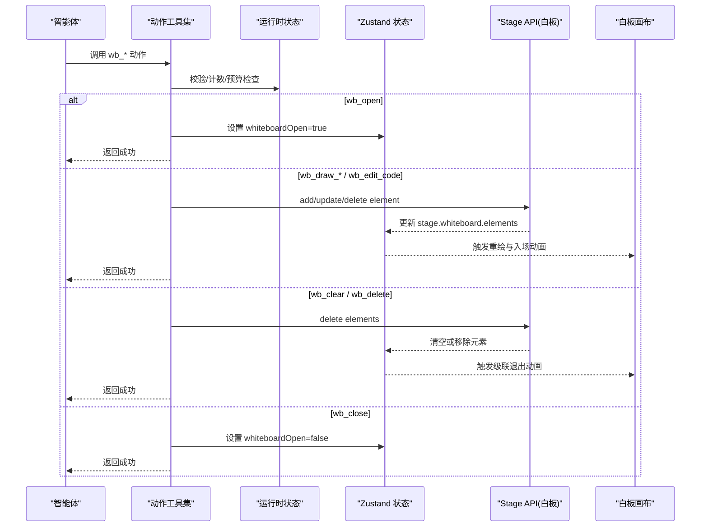
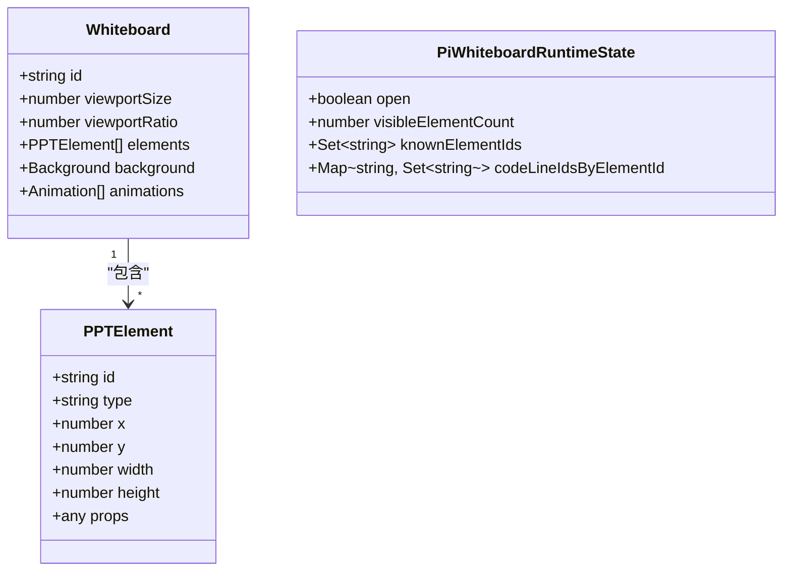
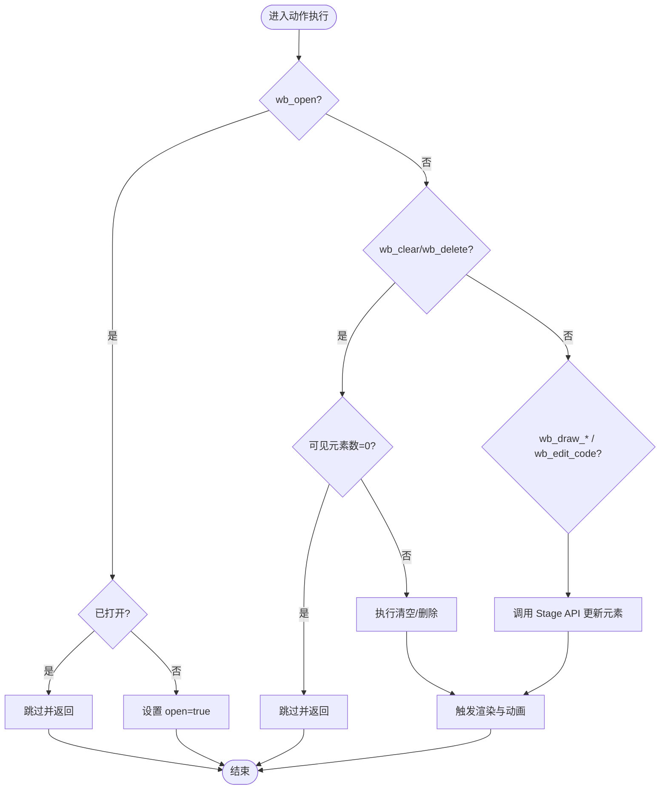
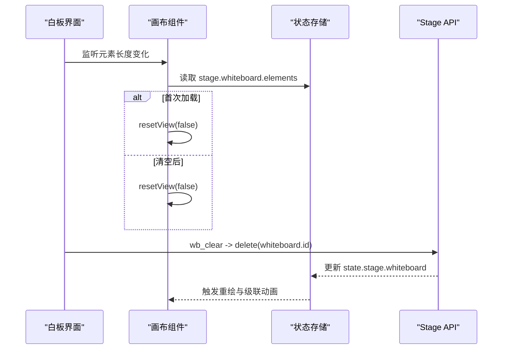

# 白板操作动作

<cite>
**本文引用的文件**   
- [components/whiteboard/index.tsx](file://components/whiteboard/index.tsx)
- [components/whiteboard/whiteboard-canvas.tsx](file://components/whiteboard/whiteboard-canvas.tsx)
- [components/whiteboard/whiteboard-history.tsx](file://components/whiteboard/whiteboard-history.tsx)
- [lib/api/stage-api-whiteboard.ts](file://lib/api/stage-api-whiteboard.ts)
- [lib/chat/pi/tools/classroom-actions.ts](file://lib/chat/pi/tools/classroom-actions.ts)
- [lib/orchestration/summarizers/whiteboard-ledger.ts](file://lib/orchestration/summarizers/whiteboard-ledger.ts)
- [eval/whiteboard-layout/types.ts](file://eval/whiteboard-layout/types.ts)
</cite>

## 产品概述
本文件系统化梳理 OpenMAIC 的“白板操作动作”体系，覆盖 wb_open、wb_draw_text、wb_draw_shape、wb_draw_chart、wb_draw_latex、wb_draw_table、wb_draw_line、wb_draw_code、wb_edit_code、wb_clear、wb_delete、wb_close 等动作类型。文档从参数结构、执行流程、动画效果、状态管理、性能优化与扩展指南等维度进行说明，帮助开发者快速理解并安全扩展白板能力。

## 核心业务流程
- 动作注册与授权：根据当前场景与智能体配置，动态生成可用的白板动作工具集，并对危险动作（如清空、删除）做空态保护与预算限制。
- 运行时状态维护：维护白板是否打开、可见元素数量、已知元素 ID 集合、代码块行 ID 映射，用于去重、增量更新与幂等控制。
- 数据写入与渲染：通过 Stage API 对白板对象与元素进行增删改查；前端 Canvas 层以 Pan/Zoom 与级联动画呈现元素变化。
- 历史快照与恢复：清空前自动保存快照，支持一键恢复，避免误操作丢失内容。

**章节来源**
- [lib/chat/pi/tools/classroom-actions.ts:270-310](file://lib/chat/pi/tools/classroom-actions.ts#L270-L310)
- [lib/chat/pi/tools/classroom-actions.ts:340-377](file://lib/chat/pi/tools/classroom-actions.ts#L340-L377)
- [lib/api/stage-api-whiteboard.ts:19-50](file://lib/api/stage-api-whiteboard.ts#L19-L50)
- [components/whiteboard/index.tsx:40-66](file://components/whiteboard/index.tsx#L40-L66)

## 功能模块清单
- 动作定义与参数校验
  - 使用 TypeBox 定义各动作参数，确保 AI 生成的参数合法且可序列化。
  - 关键动作包括：wb_open、wb_close、wb_draw_text、wb_draw_shape、wb_draw_chart、wb_draw_latex、wb_draw_table、wb_draw_line、wb_draw_code、wb_edit_code、wb_clear、wb_delete。
- 动作执行器与运行时状态
  - 统一封装 makeActionTool，集中处理预算、空态保护、重复打开等边界条件。
  - 维护 PiWhiteboardRuntimeState：open、visibleElementCount、knownElementIds、codeLineIdsByElementId。
- 白板数据访问层（Stage API）
  - create/get/update/delete/list 白板和元素，保证不可变更新与错误回退。
- 白板渲染与交互
  - WhiteboardCanvas 提供 Pan/Zoom、双击复位、滚动缩放、边界约束、空态提示。
  - AnimatedElement 为每个元素提供入场/出场动画，支持级联清除动画。
- 历史快照与恢复
  - 清空前自动保存快照，支持按时间戳与元素数量展示，一键恢复。

**章节来源**
- [lib/chat/pi/tools/classroom-actions.ts:35-173](file://lib/chat/pi/tools/classroom-actions.ts#L35-L173)
- [lib/chat/pi/tools/classroom-actions.ts:248-257](file://lib/chat/pi/tools/classroom-actions.ts#L248-L257)
- [lib/api/stage-api-whiteboard.ts:19-256](file://lib/api/stage-api-whiteboard.ts#L19-L256)
- [components/whiteboard/whiteboard-canvas.tsx:104-182](file://components/whiteboard/whiteboard-canvas.tsx#L104-L182)
- [components/whiteboard/whiteboard-canvas.tsx:318-382](file://components/whiteboard/whiteboard-canvas.tsx#L318-L382)
- [components/whiteboard/whiteboard-history.tsx:46-96](file://components/whiteboard/whiteboard-history.tsx#L46-L96)

## 数据与状态
- 白板数据结构
  - 白板对象包含 id、viewportSize、viewportRatio、elements、background、animations 等字段。
  - 元素类型为 PPTElement，支持文本、形状、图表、LaTeX、表格、线条、代码等多种类型。
- 运行时状态
  - open：白板是否已打开。
  - visibleElementCount：可见元素数量，用于空态保护。
  - knownElementIds：已知元素 ID 集合，用于去重与增量更新。
  - codeLineIdsByElementId：代码块内行 ID 映射，支撑 wb_edit_code 的增量操作。
- 状态存储与更新
  - Zustand store 中 stage.whiteboard 数组维护白板列表，最新白板为末尾项。
  - Stage API 通过不可变更新策略替换元素数组，保障 React 渲染一致性。

**图示来源**
- [lib/api/stage-api-whiteboard.ts:26-46](file://lib/api/stage-api-whiteboard.ts#L26-L46)
- [lib/chat/pi/tools/classroom-actions.ts:241-257](file://lib/chat/pi/tools/classroom-actions.ts#L241-L257)

**章节来源**
- [lib/api/stage-api-whiteboard.ts:26-46](file://lib/api/stage-api-whiteboard.ts#L26-L46)
- [lib/chat/pi/tools/classroom-actions.ts:241-257](file://lib/chat/pi/tools/classroom-actions.ts#L241-L257)
- [eval/whiteboard-layout/types.ts:16-29](file://eval/whiteboard-layout/types.ts#L16-L29)

## 关键约束与边界
- 动作授权与预算
  - 仅当 turnKind !== 'wrap_up' 且 enableWhiteboardTools 为真时，允许写操作。
  - 每轮智能体动作有最大次数限制，超出后后续动作将被跳过。
- 空态保护
  - wb_clear 与 wb_delete 在 visibleElementCount=0 时直接跳过，避免无意义操作。
- 幂等性
  - wb_open 若已打开则跳过并返回 skipped 信息。
- 代码编辑增量更新
  - wb_edit_code 支持 insert_after、insert_before、delete_lines、replace_lines，依赖 codeLineIdsByElementId 精确命中目标行。
- 渲染与动画
  - 清空时采用级联退出动画，时长按元素数量计算，上限封顶，避免卡顿。
  - 首次加载或清空后自动复位视图，保持最佳可视区域。

**图示来源**
- [lib/chat/pi/tools/classroom-actions.ts:340-377](file://lib/chat/pi/tools/classroom-actions.ts#L340-L377)
- [components/whiteboard/index.tsx:40-66](file://components/whiteboard/index.tsx#L40-L66)

**章节来源**
- [lib/chat/pi/tools/classroom-actions.ts:285-310](file://lib/chat/pi/tools/classroom-actions.ts#L285-L310)
- [lib/chat/pi/tools/classroom-actions.ts:340-377](file://lib/chat/pi/tools/classroom-actions.ts#L340-L377)
- [components/whiteboard/index.tsx:40-66](file://components/whiteboard/index.tsx#L40-L66)

## 详细动作说明与实现机制

### wb_open
- 作用：打开白板界面。
- 参数：无。
- 执行流程：
  - 若已打开则跳过并返回 skipped。
  - 否则设置 whiteboardOpen=true，触发 UI 显示。
- 动画效果：组件以 spring 动画入场，背景模糊与阴影增强层级感。

**章节来源**
- [lib/chat/pi/tools/classroom-actions.ts:340-350](file://lib/chat/pi/tools/classroom-actions.ts#L340-L350)
- [components/whiteboard/index.tsx:71-92](file://components/whiteboard/index.tsx#L71-L92)

### wb_close
- 作用：关闭白板并回到幻灯片。
- 参数：无。
- 执行流程：设置 whiteboardOpen=false，隐藏白板叠加层。

**章节来源**
- [lib/chat/pi/tools/classroom-actions.ts:762-771](file://lib/chat/pi/tools/classroom-actions.ts#L762-L771)
- [components/whiteboard/index.tsx:159-166](file://components/whiteboard/index.tsx#L159-L166)

### wb_draw_text
- 作用：在白板上绘制文本、公式或关键步骤。
- 参数：content、x、y、width、height、fontSize、color、elementId。
- 执行流程：调用 Stage API 添加元素，元素类型 text，位置与尺寸由参数决定。
- 动画效果：元素入场带淡入、缩放与轻微位移，延迟随索引递增。

**章节来源**
- [lib/chat/pi/tools/classroom-actions.ts:35-45](file://lib/chat/pi/tools/classroom-actions.ts#L35-L45)
- [lib/api/stage-api-whiteboard.ts:155-178](file://lib/api/stage-api-whiteboard.ts#L155-L178)
- [components/whiteboard/whiteboard-canvas.tsx:37-95](file://components/whiteboard/whiteboard-canvas.tsx#L37-L95)

### wb_draw_shape
- 作用：绘制矩形、圆形、三角形等几何图形。
- 参数：shape、x、y、width、height、fillColor、elementId。
- 执行流程：新增 shape 类型元素，填充色可选。
- 动画效果：同文本元素的入场动画。

**章节来源**
- [lib/chat/pi/tools/classroom-actions.ts:47-56](file://lib/chat/pi/tools/classroom-actions.ts#L47-L56)
- [lib/api/stage-api-whiteboard.ts:155-178](file://lib/api/stage-api-whiteboard.ts#L155-L178)

### wb_draw_chart
- 作用：绘制柱状图、折线图、饼图等数据可视化元素。
- 参数：chartType、x、y、width、height、data{labels, legends, series}、themeColors、elementId。
- 执行流程：新增 chart 类型元素，数据结构与主题颜色由参数传入。
- 动画效果：统一入场动画，适合数据对比与趋势展示。

**章节来源**
- [lib/chat/pi/tools/classroom-actions.ts:58-81](file://lib/chat/pi/tools/classroom-actions.ts#L58-L81)
- [lib/api/stage-api-whiteboard.ts:155-178](file://lib/api/stage-api-whiteboard.ts#L155-L178)

### wb_draw_latex
- 作用：绘制 LaTeX 数学公式。
- 参数：latex、x、y、width、height、color、elementId。
- 执行流程：新增 latex 类型元素，支持颜色与尺寸控制。
- 动画效果：统一入场动画，适合公式推导演示。

**章节来源**
- [lib/chat/pi/tools/classroom-actions.ts:83-92](file://lib/chat/pi/tools/classroom-actions.ts#L83-L92)
- [lib/api/stage-api-whiteboard.ts:155-178](file://lib/api/stage-api-whiteboard.ts#L155-L178)

### wb_draw_table
- 作用：绘制结构化表格。
- 参数：x、y、width、height、data（二维字符串数组）、outline、theme、elementId。
- 执行流程：新增 table 类型元素，支持边框样式与主题色。
- 动画效果：统一入场动画，适合数据罗列与对比。

**章节来源**
- [lib/chat/pi/tools/classroom-actions.ts:94-114](file://lib/chat/pi/tools/classroom-actions.ts#L94-L114)
- [lib/api/stage-api-whiteboard.ts:155-178](file://lib/api/stage-api-whiteboard.ts#L155-L178)

### wb_draw_line
- 作用：绘制直线或箭头。
- 参数：startX、startY、endX、endY、color、width、style、points、elementId。
- 执行流程：新增 line 类型元素，支持实线/虚线与端点样式。
- 动画效果：统一入场动画，适合标注与连接关系。

**章节来源**
- [lib/chat/pi/tools/classroom-actions.ts:116-134](file://lib/chat/pi/tools/classroom-actions.ts#L116-L134)
- [lib/api/stage-api-whiteboard.ts:155-178](file://lib/api/stage-api-whiteboard.ts#L155-L178)

### wb_draw_code
- 作用：绘制语法高亮的代码块。
- 参数：language、code、x、y、width、height、fileName、elementId。
- 执行流程：新增 code 类型元素，支持文件名与语言标识。
- 动画效果：统一入场动画，适合代码讲解与示例展示。

**章节来源**
- [lib/chat/pi/tools/classroom-actions.ts:136-146](file://lib/chat/pi/tools/classroom-actions.ts#L136-L146)
- [lib/api/stage-api-whiteboard.ts:155-178](file://lib/api/stage-api-whiteboard.ts#L155-L178)

### wb_edit_code
- 作用：对已有代码块进行增量编辑。
- 参数：elementId、operation（insert_after、insert_before、delete_lines、replace_lines）、lineId/lineIds、content。
- 执行流程：
  - 基于 codeLineIdsByElementId 定位目标行。
  - 插入/删除/替换行，保持行 ID 稳定，避免全量重绘。
- 动画效果：行级别变更最小化重排，提升流畅度。

**章节来源**
- [lib/chat/pi/tools/classroom-actions.ts:148-173](file://lib/chat/pi/tools/classroom-actions.ts#L148-L173)
- [lib/chat/pi/tools/classroom-actions.ts:200-221](file://lib/chat/pi/tools/classroom-actions.ts#L200-L221)
- [lib/api/stage-api-whiteboard.ts:215-234](file://lib/api/stage-api-whiteboard.ts#L215-L234)

### wb_clear
- 作用：清空白板所有元素。
- 参数：无。
- 执行流程：
  - 若为空则跳过。
  - 先保存快照，再触发级联退出动画，最后调用 Stage API 删除白板。
- 动画效果：每个元素依次缩小、旋转、模糊并上移，总时长按元素数量计算，上限封顶。

**章节来源**
- [lib/chat/pi/tools/classroom-actions.ts:742-751](file://lib/chat/pi/tools/classroom-actions.ts#L742-L751)
- [components/whiteboard/index.tsx:40-66](file://components/whiteboard/index.tsx#L40-L66)
- [components/whiteboard/whiteboard-canvas.tsx:37-95](file://components/whiteboard/whiteboard-canvas.tsx#L37-L95)

### wb_delete
- 作用：删除指定元素。
- 参数：elementId。
- 执行流程：
  - 若为空则跳过。
  - 调用 Stage API 删除对应元素，触发元素退出动画。
- 动画效果：元素淡出并缩小，过渡平滑。

**章节来源**
- [lib/chat/pi/tools/classroom-actions.ts:752-761](file://lib/chat/pi/tools/classroom-actions.ts#L752-L761)
- [lib/api/stage-api-whiteboard.ts:187-206](file://lib/api/stage-api-whiteboard.ts#L187-L206)

## 白板状态管理与动画时序控制
- 状态管理
  - whiteboardOpen：控制白板叠加层的显隐。
  - stage.whiteboard：数组形式维护白板实例，最新白板为末尾项。
  - elements：元素数组，通过不可变更新驱动渲染。
- 动画时序
  - 入场：每个元素按索引延迟，形成瀑布式出现。
  - 出场：清空时按逆序延迟，配合缩放、旋转与模糊，营造级联消散效果。
  - 视图复位：首次加载或清空后自动复位到初始缩放与平移。

**图示来源**
- [components/whiteboard/whiteboard-canvas.tsx:281-302](file://components/whiteboard/whiteboard-canvas.tsx#L281-L302)
- [components/whiteboard/index.tsx:40-66](file://components/whiteboard/index.tsx#L40-L66)

**章节来源**
- [components/whiteboard/whiteboard-canvas.tsx:122-182](file://components/whiteboard/whiteboard-canvas.tsx#L122-L182)
- [components/whiteboard/whiteboard-canvas.tsx:281-302](file://components/whiteboard/whiteboard-canvas.tsx#L281-L302)

## 性能优化策略
- 渲染隔离
  - AnimatedElement 使用 memo 包裹，避免父级 pan/zoom 频繁重绘导致子元素重排。
- 视图变换
  - 通过 transform 与 scale 组合实现高性能缩放与平移，减少布局抖动。
- 动画节流
  - 清空动画时长按元素数量线性增长但封顶，防止大量元素导致卡顿。
- 增量更新
  - wb_edit_code 基于行 ID 精准定位，避免全量重建代码块。
- 空态保护与预算限制
  - 减少无效操作与过度调用，降低状态更新频率。

**章节来源**
- [components/whiteboard/whiteboard-canvas.tsx:97-102](file://components/whiteboard/whiteboard-canvas.tsx#L97-L102)
- [components/whiteboard/whiteboard-canvas.tsx:312-316](file://components/whiteboard/whiteboard-canvas.tsx#L312-L316)
- [components/whiteboard/index.tsx:52-54](file://components/whiteboard/index.tsx#L52-L54)
- [lib/chat/pi/tools/classroom-actions.ts:367-377](file://lib/chat/pi/tools/classroom-actions.ts#L367-L377)

## 自定义白板元素开发指南与最佳实践
- 元素类型扩展
  - 在 DSL 中定义新元素类型，确保包含 id、type、x、y、width、height 等基础字段。
  - 在 Stage API 的 add/update/delete 中兼容新类型的序列化与反序列化。
- 渲染组件
  - 复用 ScreenElement 渲染管线，确保与现有元素一致的交互与动画体验。
  - 如需特殊交互，可在 AnimatedElement 外层包裹自定义逻辑。
- 动作集成
  - 在 classroom-actions.ts 中新增动作参数定义与执行逻辑，遵循幂等与空态保护原则。
  - 更新 PiWhiteboardRuntimeState 以支持增量更新与去重。
- 测试与评估
  - 使用 eval/whiteboard-layout 中的类型与报告框架，验证布局合理性与渲染正确性。

**章节来源**
- [lib/api/stage-api-whiteboard.ts:155-234](file://lib/api/stage-api-whiteboard.ts#L155-L234)
- [components/whiteboard/whiteboard-canvas.tsx:37-95](file://components/whiteboard/whiteboard-canvas.tsx#L37-L95)
- [lib/chat/pi/tools/classroom-actions.ts:241-257](file://lib/chat/pi/tools/classroom-actions.ts#L241-L257)
- [eval/whiteboard-layout/types.ts:50-73](file://eval/whiteboard-layout/types.ts#L50-L73)

## 附录：动作参数速览
- wb_open：无参
- wb_close：无参
- wb_draw_text：content、x、y、width、height、fontSize、color、elementId
- wb_draw_shape：shape、x、y、width、height、fillColor、elementId
- wb_draw_chart：chartType、x、y、width、height、data、themeColors、elementId
- wb_draw_latex：latex、x、y、width、height、color、elementId
- wb_draw_table：x、y、width、height、data、outline、theme、elementId
- wb_draw_line：startX、startY、endX、endY、color、width、style、points、elementId
- wb_draw_code：language、code、x、y、width、height、fileName、elementId
- wb_edit_code：elementId、operation、lineId/lineIds、content
- wb_clear：无参
- wb_delete：elementId

**章节来源**
- [lib/chat/pi/tools/classroom-actions.ts:35-173](file://lib/chat/pi/tools/classroom-actions.ts#L35-L173)