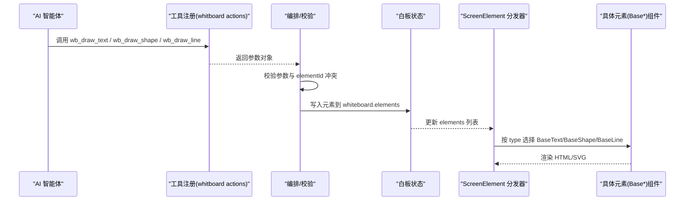
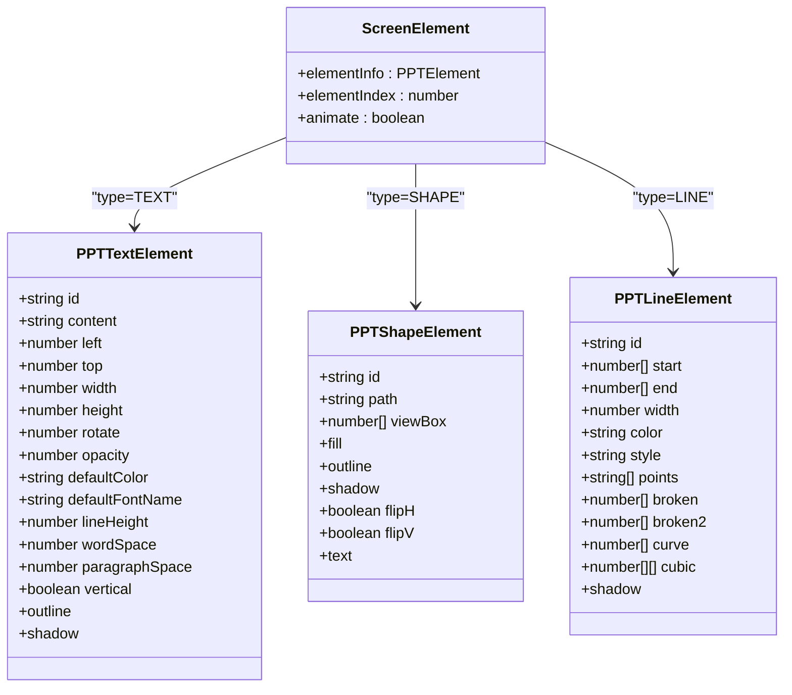
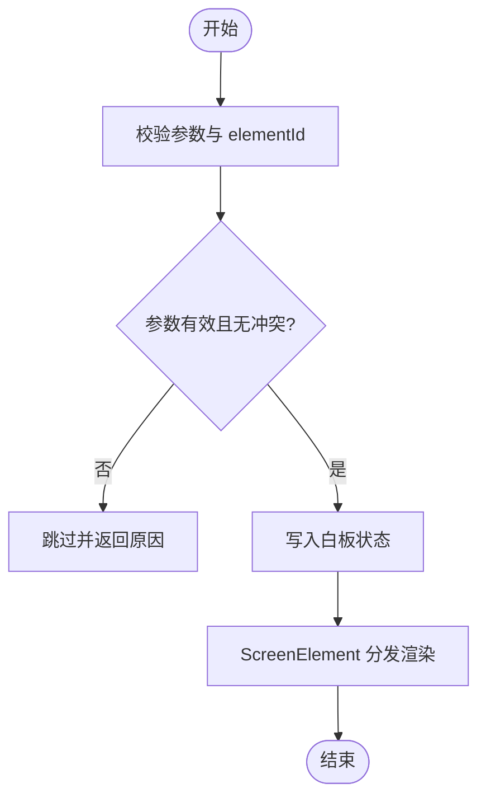
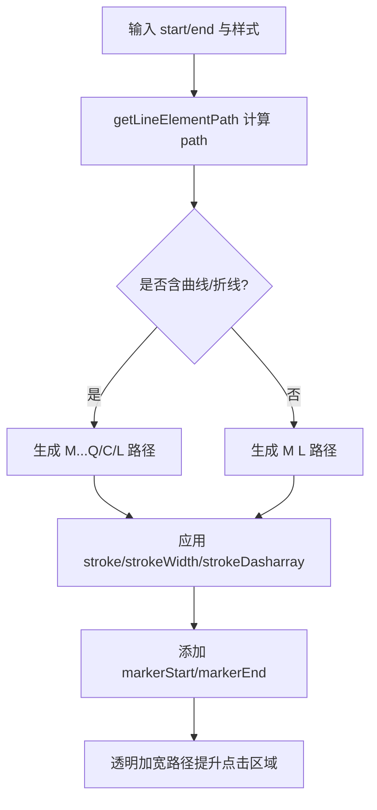
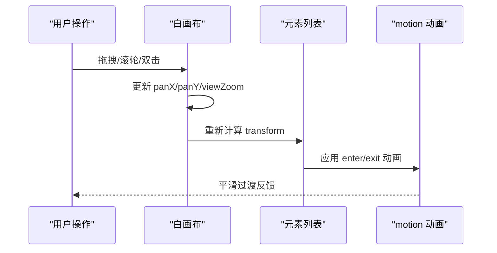
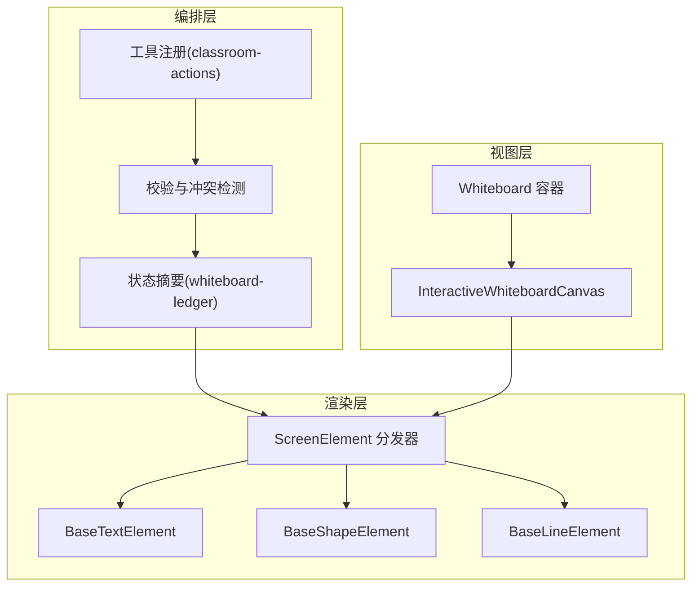
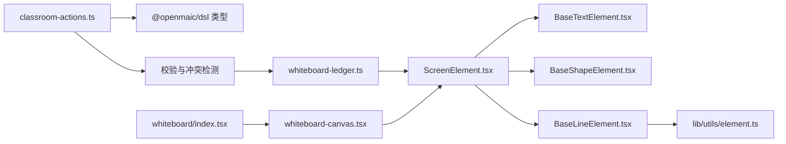

# 绘图元素操作

<cite>
**本文引用的文件**   
- [classroom-actions.ts](file://lib/chat/pi/tools/classroom-actions.ts)
- [whiteboard-ledger.ts](file://lib/orchestration/summarizers/whiteboard-ledger.ts)
- [ScreenElement.tsx](file://components/slide-renderer/Editor/ScreenElement.tsx)
- [BaseTextElement.tsx](file://components/slide-renderer/components/element/TextElement/BaseTextElement.tsx)
- [BaseShapeElement.tsx](file://components/slide-renderer/components/element/ShapeElement/BaseShapeElement.tsx)
- [BaseLineElement.tsx](file://components/slide-renderer/components/element/LineElement/BaseLineElement.tsx)
- [index.tsx（LineElement）](file://components/slide-renderer/components/element/LineElement/index.tsx)
- [element.ts](file://lib/utils/element.ts)
- [whiteboard-canvas.tsx](file://components/whiteboard/whiteboard-canvas.tsx)
- [index.tsx（Whiteboard）](file://components/whiteboard/index.tsx)
- [animation.ts](file://configs/animation.ts)
</cite>

## 产品概述
本章节聚焦于 OpenMAIC 白板中的“绘图元素”能力，围绕 wb_draw_text、wb_draw_shape、wb_draw_line 等动作的完整实现链路展开。该能力由 AI 编排层通过工具调用生成元素，经由状态汇总与去重校验后写入白板数据模型；渲染层基于统一的 ScreenElement 分发器将文本、形状、线条等元素以 HTML/SVG 形式呈现，并支持位置定位、尺寸调整、旋转角度、层级管理与动画效果。整体设计兼顾交互体验与性能优化，适用于课堂讲解、实时标注与可视化演示场景。

## 核心业务流程
- 工具定义与参数校验：在工具注册阶段为 wb_draw_* 系列动作声明参数结构，确保 x/y、width/height、样式等字段类型正确。
- 冲突检测与执行：对 elementId 进行存在性检查，避免重复创建；对无效数据（如表格矩阵）进行跳过处理。
- 状态摘要与追踪：根据动作记录生成元素摘要，便于后续冲突检测与审计。
- 渲染分发：ScreenElement 根据元素类型选择对应 Base* 组件进行渲染。
- 视图交互：白画布支持平移、缩放、双击复位，元素按 index 控制层级。

**图表来源** 
- [classroom-actions.ts:38-146](file://lib/chat/pi/tools/classroom-actions.ts#L38-L146)
- [classroom-actions.ts:428-470](file://lib/chat/pi/tools/classroom-actions.ts#L428-L470)
- [whiteboard-ledger.ts:159-240](file://lib/orchestration/summarizers/whiteboard-ledger.ts#L159-L240)
- [ScreenElement.tsx:24-41](file://components/slide-renderer/Editor/ScreenElement.tsx#L24-L41)

**章节来源**
- [classroom-actions.ts:38-146](file://lib/chat/pi/tools/classroom-actions.ts#L38-L146)
- [classroom-actions.ts:428-470](file://lib/chat/pi/tools/classroom-actions.ts#L428-L470)
- [whiteboard-ledger.ts:159-240](file://lib/orchestration/summarizers/whiteboard-ledger.ts#L159-L240)
- [ScreenElement.tsx:24-41](file://components/slide-renderer/Editor/ScreenElement.tsx#L24-L41)

## 功能模块清单
- 工具与参数定义
  - wb_draw_text：文本绘制，支持内容、坐标、宽高、字号、颜色、elementId。
  - wb_draw_shape：形状绘制，支持矩形/圆形/三角形、坐标、宽高、填充色、elementId。
  - wb_draw_line：线条绘制，支持起点/终点、线宽、颜色、虚线样式、端点标记、elementId。
- 冲突与校验
  - elementId 冲突检测：若已存在则跳过并返回原因。
  - 数据有效性校验：例如表格必须为非空二维字符串矩阵。
- 状态摘要
  - 针对 wb_draw_* 动作生成可读摘要，包含类型、位置、尺寸等信息。
- 渲染分发
  - ScreenElement 根据 type 映射到 BaseTextElement、BaseShapeElement、BaseLineElement。
- 视图与交互
  - 白画布支持平移、缩放、双击复位；元素层级由 index 决定。
- 动画与过渡
  - 元素进入/退出动画、清除级联动画、线条描边动画。

**章节来源**
- [classroom-actions.ts:38-146](file://lib/chat/pi/tools/classroom-actions.ts#L38-L146)
- [classroom-actions.ts:428-470](file://lib/chat/pi/tools/classroom-actions.ts#L428-L470)
- [whiteboard-ledger.ts:159-240](file://lib/orchestration/summarizers/whiteboard-ledger.ts#L159-L240)
- [ScreenElement.tsx:24-41](file://components/slide-renderer/Editor/ScreenElement.tsx#L24-L41)
- [whiteboard-canvas.tsx:104-180](file://components/whiteboard/whiteboard-canvas.tsx#L104-L180)
- [index.tsx（Whiteboard）:40-66](file://components/whiteboard/index.tsx#L40-L66)

## 数据与状态
- 文本元素（PPTTextElement）
  - 关键属性：content（HTML）、left/top/width/height、rotate、opacity、defaultColor/defaultFontName、lineHeight/wordSpace/paragraphSpace、vertical、outline/shadow。
  - 渲染方式：HTML div + CSS 排版，支持旋转、阴影、边框轮廓。
- 形状元素（PPTShapeElement）
  - 关键属性：path（SVG path）、viewBox、fill（纯色/渐变/图案）、outline、shadow、flipH/flipV、text（内嵌 HTML）。
  - 渲染方式：SVG path + defs（渐变/图案），叠加 HTML 文本层。
- 线条元素（PPTLineElement）
  - 关键属性：start/end（相对坐标）、width/color/style、points（端点标记）、broken/broken2/curve/cubic（路径变体）。
  - 渲染方式：SVG path 计算，markerStart/markerEnd 端点标记，透明加宽路径提升点击区域。
- 层级管理
  - 元素数组顺序即 z-index 顺序，reorder/duplicate/deleteMany 等操作影响层级。
- 视图状态
  - 白画布容器尺寸、containerScale、viewZoom、panX/panY，双击或按钮复位。

**图表来源** 
- [BaseTextElement.tsx:16-65](file://components/slide-renderer/components/element/TextElement/BaseTextElement.tsx#L16-L65)
- [BaseShapeElement.tsx:18-118](file://components/slide-renderer/components/element/ShapeElement/BaseShapeElement.tsx#L18-L118)
- [BaseLineElement.tsx:21-34](file://components/slide-renderer/components/element/LineElement/BaseLineElement.tsx#L21-L34)
- [ScreenElement.tsx:24-41](file://components/slide-renderer/Editor/ScreenElement.tsx#L24-L41)

**章节来源**
- [BaseTextElement.tsx:16-65](file://components/slide-renderer/components/element/TextElement/BaseTextElement.tsx#L16-L65)
- [BaseShapeElement.tsx:18-118](file://components/slide-renderer/components/element/ShapeElement/BaseShapeElement.tsx#L18-L118)
- [BaseLineElement.tsx:21-34](file://components/slide-renderer/components/element/LineElement/BaseLineElement.tsx#L21-L34)
- [ScreenElement.tsx:24-41](file://components/slide-renderer/Editor/ScreenElement.tsx#L24-L41)

## 关键约束与边界
- 工具参数约束
  - wb_draw_text：content 可为任意字符串；fontSize/color/elementId 可选。
  - wb_draw_shape：shape 限定 rectangle/circle/triangle；width/height 必填；fillColor 可选。
  - wb_draw_line：style 限定 solid/dashed；points 限定四种组合；start/end 必填。
- 冲突与跳过
  - elementId 冲突时直接跳过并返回 reason 与 actionName。
  - 表格数据非矩形矩阵时跳过，reason 为 whiteboard_invalid_table。
- 渲染边界
  - 线条最小 SVG 尺寸限制（小于 24px 时补齐），保证可点击性与视觉稳定性。
  - 文本/形状支持旋转与透明度，但需考虑 transformOrigin 与层级覆盖。
- 动画与性能
  - 元素进入/退出使用 motion 动画；清除时级联动画时长随元素数量线性增长，上限封顶。
  - 白画布平移/缩放采用 pointer 事件与 clampPan 边界限制，避免越界。
- 层级与编辑
  - reorder/duplicate/deleteMany 直接影响元素数组顺序与动画关联。

**图表来源** 
- [classroom-actions.ts:428-470](file://lib/chat/pi/tools/classroom-actions.ts#L428-L470)
- [ScreenElement.tsx:24-41](file://components/slide-renderer/Editor/ScreenElement.tsx#L24-L41)

**章节来源**
- [classroom-actions.ts:38-146](file://lib/chat/pi/tools/classroom-actions.ts#L38-L146)
- [classroom-actions.ts:428-470](file://lib/chat/pi/tools/classroom-actions.ts#L428-L470)
- [whiteboard-canvas.tsx:134-146](file://components/whiteboard/whiteboard-canvas.tsx#L134-L146)
- [index.tsx（Whiteboard）:40-66](file://components/whiteboard/index.tsx#L40-L66)

## 详细实现机制

### 文本元素（wb_draw_text）
- 参数与校验：content、x/y、width/height、fontSize、color、elementId。
- 渲染要点：
  - HTML div 布局，支持旋转、透明度、行高、字距、段落间距。
  - 阴影与边框轮廓通过 hooks 统一处理。
  - 垂直文本模式通过 writingMode 切换。
- 性能与交互：
  - 文本内容以 dangerouslySetInnerHTML 注入，注意 XSS 防护。
  - 元素层级由 index 控制，适合叠加注释与说明。

**章节来源**
- [classroom-actions.ts:38-44](file://lib/chat/pi/tools/classroom-actions.ts#L38-L44)
- [BaseTextElement.tsx:16-65](file://components/slide-renderer/components/element/TextElement/BaseTextElement.tsx#L16-L65)
- [ScreenElement.tsx:24-41](file://components/slide-renderer/Editor/ScreenElement.tsx#L24-L41)

### 形状元素（wb_draw_shape）
- 参数与校验：shape（rectangle/circle/triangle）、x/y、width/height、fillColor、elementId。
- 渲染要点：
  - SVG path 绘制，viewBox 缩放适配。
  - 支持纯色/渐变/图案填充，边框虚线样式。
  - 内嵌 HTML 文本层，支持对齐与字体样式。
- 性能与交互：
  - defs 缓存渐变/图案，减少重复计算。
  - 翻转（flipH/flipV）通过 transform 实现。

**章节来源**
- [classroom-actions.ts:47-56](file://lib/chat/pi/tools/classroom-actions.ts#L47-L56)
- [BaseShapeElement.tsx:18-118](file://components/slide-renderer/components/element/ShapeElement/BaseShapeElement.tsx#L18-L118)
- [ScreenElement.tsx:24-41](file://components/slide-renderer/Editor/ScreenElement.tsx#L24-L41)

### 线条元素（wb_draw_line）
- 参数与校验：start/end、width、color、style（solid/dashed）、points（端点标记）、elementId。
- 渲染要点：
  - getLineElementPath 计算 SVG path，支持直线、折线、二次曲线、三次曲线。
  - markerStart/markerEnd 设置箭头或圆点。
  - 透明加宽路径提升点击区域。
- 动画与交互：
  - BaseLineElement 支持描边动画（stroke-dashoffset），时长固定。
  - 最小尺寸限制保证可点击性。

**图表来源** 
- [element.ts:226-266](file://lib/utils/element.ts#L226-L266)
- [BaseLineElement.tsx:21-34](file://components/slide-renderer/components/element/LineElement/BaseLineElement.tsx#L21-L34)
- [index.tsx（LineElement）:96-126](file://components/slide-renderer/components/element/LineElement/index.tsx#L96-L126)

**章节来源**
- [classroom-actions.ts:123-134](file://lib/chat/pi/tools/classroom-actions.ts#L123-L134)
- [element.ts:226-266](file://lib/utils/element.ts#L226-L266)
- [BaseLineElement.tsx:21-34](file://components/slide-renderer/components/element/LineElement/BaseLineElement.tsx#L21-L34)
- [index.tsx（LineElement）:96-126](file://components/slide-renderer/components/element/LineElement/index.tsx#L96-L126)

### 位置定位、尺寸调整、旋转与层级
- 位置与尺寸：left/top/width/height 决定元素盒模型；lines 元素使用 start/end 相对坐标。
- 旋转：rotate 通过 CSS transform 实现，transformOrigin 默认中心。
- 层级：elements 数组顺序即为 z-index 顺序；reorder/duplicate/deleteMany 修改顺序。
- 视图变换：白画布 containerScale * viewZoom 控制整体缩放；panX/panY 控制平移。

**章节来源**
- [BaseTextElement.tsx:16-65](file://components/slide-renderer/components/element/TextElement/BaseTextElement.tsx#L16-L65)
- [BaseShapeElement.tsx:18-118](file://components/slide-renderer/components/element/ShapeElement/BaseShapeElement.tsx#L18-L118)
- [base-line-element.tsx:21-34](file://components/slide-renderer/components/element/LineElement/BaseLineElement.tsx#L21-L34)
- [whiteboard-canvas.tsx:134-146](file://components/whiteboard/whiteboard-canvas.tsx#L134-L146)
- [slide-ops.ts:205-246](file://lib/edit/slide-ops.ts#L205-L246)

### 动画效果与交互响应
- 元素进入/退出：motion 的 initial/animate/exit 配置淡入、缩放、模糊等。
- 清除级联动画：按元素数量计算延迟，最大时长封顶，避免卡顿。
- 线条描边动画：mount 时触发 stroke-dashoffset 动画，时长固定。
- 视图交互：pointer 事件实现拖拽平移；wheel 事件实现缩放；双击复位。

**图表来源** 
- [whiteboard-canvas.tsx:184-271](file://components/whiteboard/whiteboard-canvas.tsx#L184-L271)
- [index.tsx（Whiteboard）:40-66](file://components/whiteboard/index.tsx#L40-L66)
- [BaseLineElement.tsx:14-24](file://components/slide-renderer/components/element/LineElement/BaseLineElement.tsx#L14-L24)

**章节来源**
- [whiteboard-canvas.tsx:184-271](file://components/whiteboard/whiteboard-canvas.tsx#L184-L271)
- [index.tsx（Whiteboard）:40-66](file://components/whiteboard/index.tsx#L40-L66)
- [BaseLineElement.tsx:14-24](file://components/slide-renderer/components/element/LineElement/BaseLineElement.tsx#L14-L24)

### 性能优化策略
- 组件 memoization：AnimatedElement 使用 memo 避免父级频繁重渲染导致子组件重排。
- 事件捕获与边界限制：pointer 事件 setPointerCapture，clampPan 限制平移范围。
- 资源复用：SVG defs 缓存渐变/图案，减少重复计算。
- 动画时长封顶：清除动画总时长上限，防止大量元素导致卡顿。
- 可见性判断：isElementInViewport 可用于按需渲染（扩展点）。

**章节来源**
- [whiteboard-canvas.tsx:97-102](file://components/whiteboard/whiteboard-canvas.tsx#L97-L102)
- [whiteboard-canvas.tsx:134-146](file://components/whiteboard/whiteboard-canvas.tsx#L134-L146)
- [BaseShapeElement.tsx:61-73](file://components/slide-renderer/components/element/ShapeElement/BaseShapeElement.tsx#L61-L73)
- [index.tsx（Whiteboard）:40-66](file://components/whiteboard/index.tsx#L40-L66)
- [element.ts:256-266](file://lib/utils/element.ts#L256-L266)

## 架构概览

**图表来源** 
- [classroom-actions.ts:38-146](file://lib/chat/pi/tools/classroom-actions.ts#L38-L146)
- [whiteboard-ledger.ts:159-240](file://lib/orchestration/summarizers/whiteboard-ledger.ts#L159-L240)
- [ScreenElement.tsx:24-41](file://components/slide-renderer/Editor/ScreenElement.tsx#L24-L41)
- [whiteboard-canvas.tsx:104-180](file://components/whiteboard/whiteboard-canvas.tsx#L104-L180)

## 依赖分析
- 工具与 DSL
  - classroom-actions 依赖 @openmaic/dsl 的类型定义（PPTElement、PPTLineElement 等）。
  - ScreenElement 根据 ElementTypes 映射到具体 Base* 组件。
- 渲染与工具函数
  - BaseLineElement 依赖 lib/utils/element 的 getLineElementPath。
  - BaseShapeElement 依赖 useElementFill/useElementOutline/useElementShadow 等 hooks。
- 视图与状态
  - whiteboard-canvas 依赖 stage store 与 canvas store，管理 pan/zoom/clearing。
  - Whiteboard 容器负责历史快照与清理动画。

**图表来源** 
- [classroom-actions.ts:38-146](file://lib/chat/pi/tools/classroom-actions.ts#L38-L146)
- [whiteboard-ledger.ts:159-240](file://lib/orchestration/summarizers/whiteboard-ledger.ts#L159-L240)
- [ScreenElement.tsx:24-41](file://components/slide-renderer/Editor/ScreenElement.tsx#L24-L41)
- [BaseLineElement.tsx:21-34](file://components/slide-renderer/components/element/LineElement/BaseLineElement.tsx#L21-L34)
- [element.ts:226-266](file://lib/utils/element.ts#L226-L266)
- [index.tsx（Whiteboard）:40-66](file://components/whiteboard/index.tsx#L40-L66)
- [whiteboard-canvas.tsx:104-180](file://components/whiteboard/whiteboard-canvas.tsx#L104-L180)

**章节来源**
- [classroom-actions.ts:38-146](file://lib/chat/pi/tools/classroom-actions.ts#L38-L146)
- [whiteboard-ledger.ts:159-240](file://lib/orchestration/summarizers/whiteboard-ledger.ts#L159-L240)
- [ScreenElement.tsx:24-41](file://components/slide-renderer/Editor/ScreenElement.tsx#L24-L41)
- [BaseLineElement.tsx:21-34](file://components/slide-renderer/components/element/LineElement/BaseLineElement.tsx#L21-L34)
- [element.ts:226-266](file://lib/utils/element.ts#L226-L266)
- [index.tsx（Whiteboard）:40-66](file://components/whiteboard/index.tsx#L40-L66)
- [whiteboard-canvas.tsx:104-180](file://components/whiteboard/whiteboard-canvas.tsx#L104-L180)

## 性能考量
- 动画与渲染
  - 使用 motion 的 layout=false 避免不必要的重排。
  - AnimatedElement 使用 memo 降低重渲染成本。
- 事件与交互
  - pointer 事件 setPointerCapture 提升拖拽稳定性。
  - clampPan 限制平移范围，避免过度计算。
- 资源与样式
  - SVG defs 缓存渐变/图案，减少重复开销。
  - 最小尺寸限制保障线条可点击性。
- 可扩展性
  - isElementInViewport 可作为懒渲染入口。
  - 动画配置集中管理（configs/animation.ts），便于统一风格。

[本节为通用指导，不直接分析具体文件]

## 故障排查指南
- 元素未显示
  - 检查 elementId 是否冲突（跳过创建）。
  - 确认 content/path/start-end 数据完整性。
- 线条不可点击
  - 检查 width 是否为 0 或颜色 transparent。
  - 确认最小尺寸限制生效。
- 动画卡顿
  - 查看元素数量与清除动画时长是否超限。
  - 检查是否有过多重渲染（memo 是否生效）。
- 视图异常
  - 重置视图（双击或按钮）恢复初始状态。
  - 检查 containerScale 与 viewZoom 计算是否正确。

**章节来源**
- [classroom-actions.ts:428-470](file://lib/chat/pi/tools/classroom-actions.ts#L428-L470)
- [BaseLineElement.tsx:26-34](file://components/slide-renderer/components/element/LineElement/BaseLineElement.tsx#L26-L34)
- [index.tsx（Whiteboard）:40-66](file://components/whiteboard/index.tsx#L40-L66)
- [whiteboard-canvas.tsx:134-146](file://components/whiteboard/whiteboard-canvas.tsx#L134-L146)

## 结论
OpenMAIC 白板绘图元素通过工具定义、状态摘要与统一渲染分发，实现了文本、形状、线条的高效绘制与交互。其架构清晰、扩展性强，结合动画与性能优化策略，满足课堂实时标注与可视化演示的需求。未来可在懒渲染、碰撞检测与更丰富的路径编辑方面持续演进。

[本节为总结性内容，不直接分析具体文件]