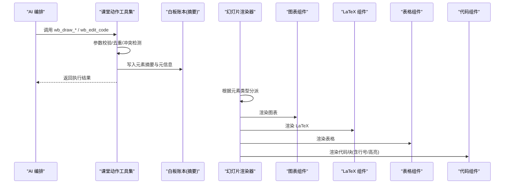
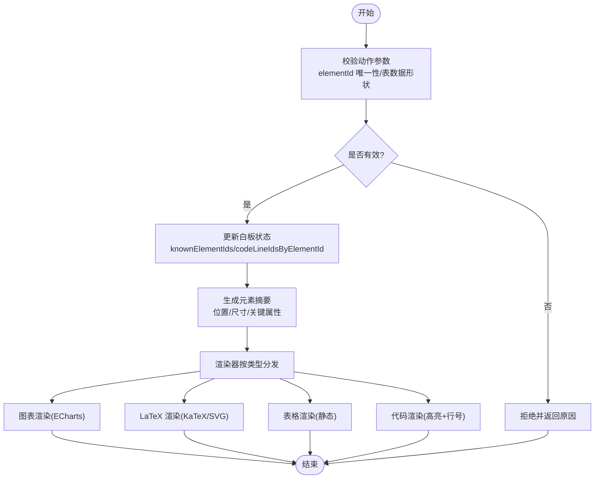

# 高级元素操作

<cite>
**本文引用的文件**   
- [whiteboard-ledger.ts](file://lib/orchestration/summarizers/whiteboard-ledger.ts)
- [classroom-actions.ts](file://lib/chat/pi/tools/classroom-actions.ts)
- [SlideElement.tsx](file://packages/@openmaic/renderer/src/SlideElement.tsx)
- [index.tsx（图表）](file://components/slide-renderer/components/element/ChartElement/index.tsx)
- [index.tsx（LaTeX）](file://components/slide-renderer/components/element/LatexElement/index.tsx)
- [index.tsx（表格）](file://components/slide-renderer/components/element/TableElement/index.tsx)
</cite>

## 目录
- 产品概述
- 核心业务流程
- 功能模块清单
- 数据与状态
- 关键约束与边界

## 产品概述
本文件聚焦白板“高级元素”的绘制与编辑能力，围绕 wb_draw_chart、wb_draw_latex、wb_draw_table、wb_draw_code、wb_edit_code 等动作，解释其从 AI 编排到渲染层的数据流转、可视化实现原理与交互机制。目标是帮助开发者与使用者理解：
- 图表数据的可视化渲染流程与主题定制
- LaTeX 公式的数学符号显示与缩放适配
- 表格数据的结构化展示与尺寸计算
- 代码块的语法高亮、行号管理与增量更新动画
- 配置选项、主题扩展与二次开发要点

## 核心业务流程
下图展示了从 AI 工具调用到白板元素渲染的关键链路：AI 编排生成动作参数 → 工具校验与状态维护 → 白板记录摘要 → 渲染器分发至具体元素组件 → 图表/LaTeX/表格/代码块渲染。

**图示来源** 
- [classroom-actions.ts:428-746](file://lib/chat/pi/tools/classroom-actions.ts#L428-L746)
- [whiteboard-ledger.ts:181-316](file://lib/orchestration/summarizers/whiteboard-ledger.ts#L181-L316)
- [SlideElement.tsx:74-108](file://packages/@openmaic/renderer/src/SlideElement.tsx#L74-L108)

**章节来源**
- [classroom-actions.ts:428-746](file://lib/chat/pi/tools/classroom-actions.ts#L428-L746)
- [whiteboard-ledger.ts:181-316](file://lib/orchestration/summarizers/whiteboard-ledger.ts#L181-L316)
- [SlideElement.tsx:74-108](file://packages/@openmaic/renderer/src/SlideElement.tsx#L74-L108)

## 功能模块清单
- 图表绘制 wb_draw_chart
  - 职责：将结构化数据以柱状/折线/饼图等形式渲染到白板区域，支持主题色、文本色、线条色与自定义选项。
  - 验收要点：数据维度与标签正确映射；颜色与主题一致；响应式尺寸；可锁定不可拖拽。
- LaTeX 绘制 wb_draw_latex
  - 职责：将 LaTeX 源码渲染为 HTML/SVG，自动缩放适配容器尺寸。
  - 验收要点：复杂公式显示完整；缩放不裁切；回退路径可用。
- 表格绘制 wb_draw_table
  - 职责：以二维矩阵展示结构化数据，支持边框、列宽、单元格最小高度等。
  - 验收要点：行列对齐；边框样式生效；尺寸自适应。
- 代码绘制 wb_draw_code
  - 职责：以语法高亮方式展示代码，支持行号与逐行动画。
  - 验收要点：语言识别准确；行号与内容对应；动画流畅。
- 代码编辑 wb_edit_code
  - 职责：对已有代码块进行增量更新（插入/删除/替换行），保持行 ID 一致性。
  - 验收要点：行 ID 映射正确；增量变更可见；无闪烁或错位。

**章节来源**
- [index.tsx（图表）:1-69](file://components/slide-renderer/components/element/ChartElement/index.tsx#L1-L69)
- [index.tsx（LaTeX）:1-107](file://components/slide-renderer/components/element/LatexElement/index.tsx#L1-L107)
- [index.tsx（表格）:1-52](file://components/slide-renderer/components/element/TableElement/index.tsx#L1-L52)

## 数据与状态
- 动作参数与校验
  - 所有 wb_draw_* 动作均要求 elementId 唯一且存在时不得重复创建；wb_draw_table 要求数据为非空矩形字符串矩阵。
  - wb_edit_code 通过 lineIds 与 operation 控制增量更新，确保行 ID 集合与内容同步。
- 白板账本与摘要
  - 针对 chart/latex/table/code 等类型，生成人类可读的摘要，包含位置、尺寸、关键字段（如 labels、rows×cols、code 片段）。
  - 代码块按预算限制输出行内容与 ID 列表，避免过长导致上下文溢出。
- 渲染器分发
  - 渲染器依据元素 type 分派到 Base*Element 组件，统一应用主题字体、字号与动画开关。
- 组件级状态
  - 图表：接收 width/height/chartType/data/themeColors/textColor/lineColor/options，内部由 ECharts 渲染。
  - LaTeX：优先使用 KaTeX HTML，失败回退 SVG path；根据自然宽高计算缩放比例。
  - 表格：静态渲染，支持旋转与锁定态。
  - 代码：行号管理基于 lineIds，支持 insert_after/insert_before/delete_lines/replace_lines 等操作。

**图示来源** 
- [classroom-actions.ts:428-746](file://lib/chat/pi/tools/classroom-actions.ts#L428-L746)
- [whiteboard-ledger.ts:181-316](file://lib/orchestration/summarizers/whiteboard-ledger.ts#L181-L316)
- [SlideElement.tsx:74-108](file://packages/@openmaic/renderer/src/SlideElement.tsx#L74-L108)

**章节来源**
- [classroom-actions.ts:428-746](file://lib/chat/pi/tools/classroom-actions.ts#L428-L746)
- [whiteboard-ledger.ts:181-316](file://lib/orchestration/summarizers/whiteboard-ledger.ts#L181-L316)
- [SlideElement.tsx:74-108](file://packages/@openmaic/renderer/src/SlideElement.tsx#L74-L108)

## 关键约束与边界
- 元素 ID 冲突
  - 若 elementId 已存在，wb_draw_* 将被跳过并返回冲突原因，防止重复绘制。
- 表格数据形状
  - wb_draw_table 要求 data 为非空矩形字符串矩阵，否则跳过并提示 whiteboard_invalid_table。
- 代码行 ID 一致性
  - wb_edit_code 的 delete_lines/replace_lines/insert_after/insert_before 必须与初始 lineIds 保持一致，否则可能导致行号错乱或更新失效。
- 渲染性能
  - 图表与 LaTeX 在尺寸变化时需重新计算布局；代码块大段内容需遵循预算限制，避免渲染卡顿。
- 主题与样式
  - 统一通过 theme.fontColor/fontName 控制；图表额外支持 themeColors/textColor/lineColor/options 定制。

**章节来源**
- [classroom-actions.ts:428-746](file://lib/chat/pi/tools/classroom-actions.ts#L428-L746)
- [whiteboard-ledger.ts:181-316](file://lib/orchestration/summarizers/whiteboard-ledger.ts#L181-L316)
- [index.tsx（图表）:1-69](file://components/slide-renderer/components/element/ChartElement/index.tsx#L1-L69)
- [index.tsx（LaTeX）:1-107](file://components/slide-renderer/components/element/LatexElement/index.tsx#L1-L107)
- [index.tsx（表格）:1-52](file://components/slide-renderer/components/element/TableElement/index.tsx#L1-L52)