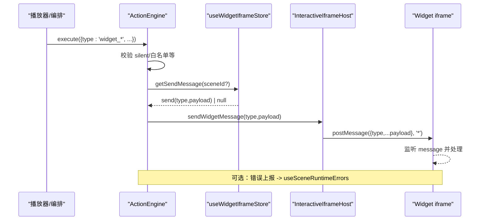
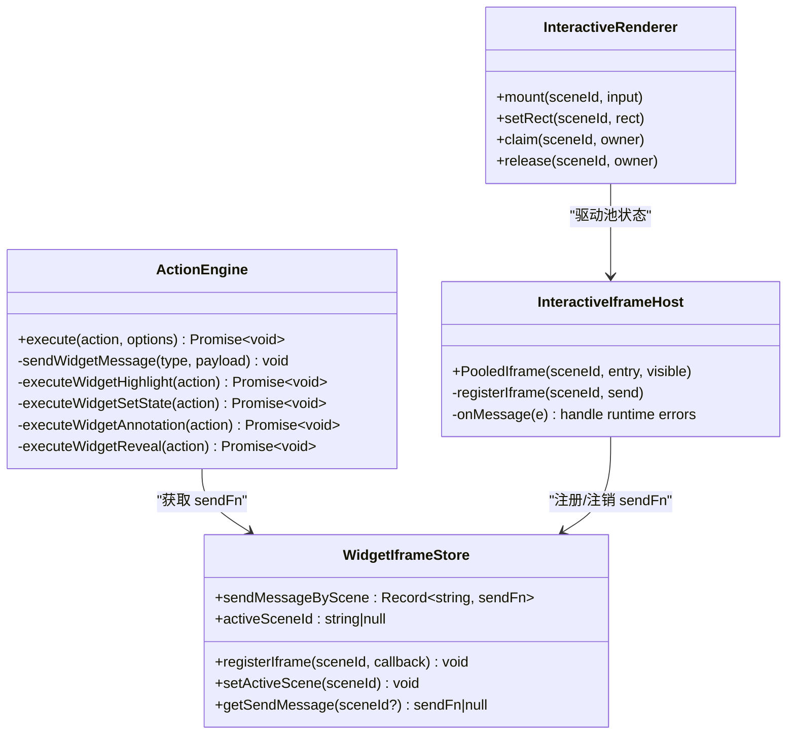
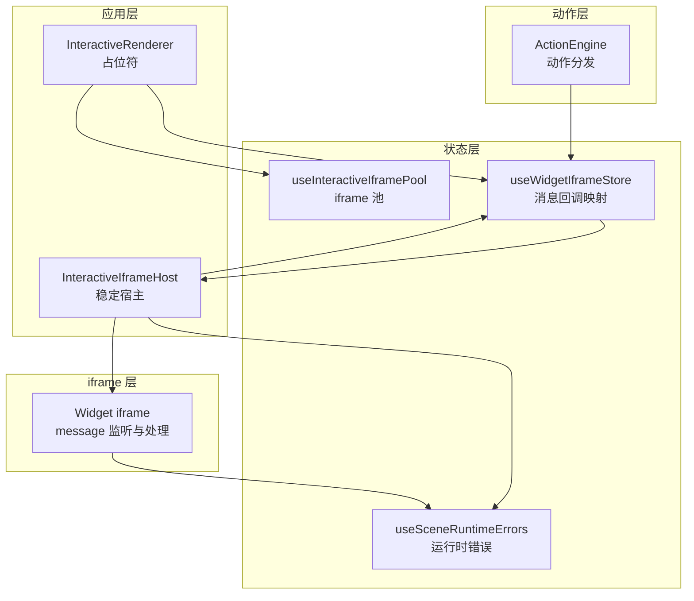
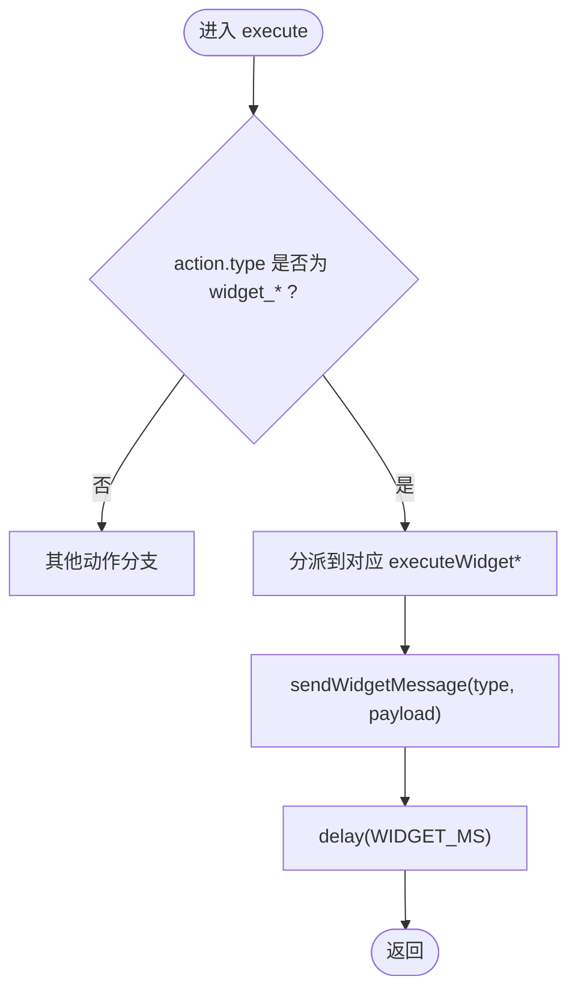
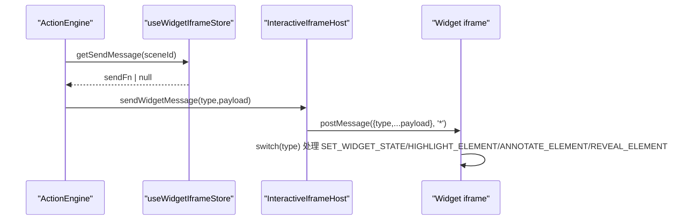
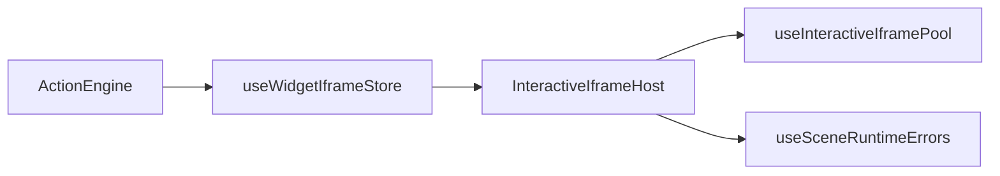

# 组件交互动作

<cite>
**本文引用的文件**   
- [engine.ts](file://lib/action/engine.ts)
- [widget-iframe.ts](file://lib/store/widget-iframe.ts)
- [interactive-iframe-pool.ts](file://lib/store/interactive-iframe-pool.ts)
- [InteractiveIframeHost.tsx](file://components/scene-renderers/InteractiveIframeHost.tsx)
- [interactive-renderer.tsx](file://components/scene-renderers/interactive-renderer.tsx)
- [scene-runtime-errors.ts](file://lib/store/scene-runtime-errors.ts)
- [system.md](file://lib/prompts/templates/diagram-content/system.md)
- [widget-actions.test.ts](file://tests/action/widget-actions.test.ts)
- [timing.ts](file://lib/choreography/timing.ts)
</cite>

## 产品概述
本文件聚焦 OpenMAIC 中“组件交互动作”的实现与使用，围绕 widget_highlight、widget_setState、widget_annotation、widget_reveal 四类动作的机制进行系统化说明。这些动作通过 ActionEngine 统一调度，经由 postMessage 向 iframe 内的交互式课件（Widget）发送指令，实现高亮、状态同步、标注提示与元素揭示等课堂演示效果。文档同时覆盖消息格式、回调注册、错误处理、安全隔离、性能优化与调试技巧，并提供自定义组件开发与动作扩展指南。

## 核心业务流程
- 播放或编辑流程触发 ActionEngine.execute(action)，根据 action.type 分派到对应执行器。
- 对于 widget_* 动作，ActionEngine 将类型与载荷封装为 postMessage 事件，通过已注册的 sendWidgetMessage 回调发送到目标 iframe。
- InteractiveIframeHost 在挂载时按 sceneId 注册每个 iframe 的 postMessage 发送函数；useWidgetIframeStore 维护 per-scene 的回调映射，避免场景切换竞态。
- Widget iframe 内部需监听 message 事件并处理 SET_WIDGET_STATE、HIGHLIGHT_ELEMENT、ANNOTATE_ELEMENT、REVEAL_ELEMENT 四类消息，完成 UI 更新。
- 运行时错误由 iframe 的错误 shim 上报至 useSceneRuntimeErrors，供编辑器诊断。

**图表来源** 
- [engine.ts:192-200](file://lib/action/engine.ts#L192-L200)
- [engine.ts:796-834](file://lib/action/engine.ts#L796-L834)
- [widget-iframe.ts:27-50](file://lib/store/widget-iframe.ts#L27-L50)
- [InteractiveIframeHost.tsx:107-113](file://components/scene-renderers/InteractiveIframeHost.tsx#L107-L113)

**章节来源**
- [engine.ts:130-201](file://lib/action/engine.ts#L130-L201)
- [engine.ts:796-834](file://lib/action/engine.ts#L796-L834)
- [widget-iframe.ts:1-50](file://lib/store/widget-iframe.ts#L1-L50)
- [InteractiveIframeHost.tsx:100-117](file://components/scene-renderers/InteractiveIframeHost.tsx#L100-L117)

## 功能模块清单
- ActionEngine（动作引擎）
  - 职责：解析 Action 并分发执行；对 widget_* 动作封装 postMessage；管理同步等待与动画时长。
  - 关键点：silent 模式过滤；ensureWhiteboardOpen；WIDGET_MS 延时保证视觉连贯。
- Widget iframe 消息存储（useWidgetIframeStore）
  - 职责：按 sceneId 维护 postMessage 回调映射；提供 activeSceneId 回退路径。
- InteractiveIframeHost（稳定宿主）
  - 职责：以 Portal 渲染稳定的 iframe 池；按 rect 定位；注册每场景的 send 回调；收集运行时错误。
- InteractiveRenderer（占位符）
  - 职责：注册内容、声明可见性、测量屏幕矩形；驱动池的 mount/setRect/claim/release。
- 运行时错误存储（useSceneRuntimeErrors）
  - 职责：按场景去重记录最近 N 条错误，便于编辑器诊断。
- 模板与示例（diagram-content/system.md）
  - 职责：给出 iframe 内必须实现的 message 监听与四种动作的处理示例。

**章节来源**
- [engine.ts:94-201](file://lib/action/engine.ts#L94-L201)
- [widget-iframe.ts:1-50](file://lib/store/widget-iframe.ts#L1-L50)
- [InteractiveIframeHost.tsx:32-75](file://components/scene-renderers/InteractiveIframeHost.tsx#L32-L75)
- [interactive-renderer.tsx:22-69](file://components/scene-renderers/interactive-renderer.tsx#L22-L69)
- [scene-runtime-errors.ts:1-43](file://lib/store/scene-runtime-errors.ts#L1-L43)
- [system.md:53-122](file://lib/prompts/templates/diagram-content/system.md#L53-L122)

## 数据与状态
- Action 模型（widget_*）
  - widget_highlight：target（CSS 选择器）、content（提示文案）
  - widget_setState：state（键值对象，用于节点显隐/激活）、content
  - widget_annotation：target、content
  - widget_reveal：target、content
- 消息协议（postMessage payload）
  - HIGHLIGHT_ELEMENT：{ target, content }
  - SET_WIDGET_STATE：{ state, content }
  - ANNOTATE_ELEMENT：{ target, content }
  - REVEAL_ELEMENT：{ target, content }
- 状态流转
  - InteractiveRenderer.mount → 池 entries[sceneId] = {srcDoc/src, rect, owner, tick}
  - claim/release 控制可见性所有权，避免跨模态切换时的竞态
  - setRect 持续同步 iframe 位置尺寸
  - useWidgetIframeStore.registerIframe(sceneId, send) 建立消息通道
  - ActionEngine.sendWidgetMessage(type, payload) → Host.postMessage(...)

**图表来源** 
- [engine.ts:796-834](file://lib/action/engine.ts#L796-L834)
- [widget-iframe.ts:27-50](file://lib/store/widget-iframe.ts#L27-L50)
- [InteractiveIframeHost.tsx:100-117](file://components/scene-renderers/InteractiveIframeHost.tsx#L100-L117)
- [interactive-renderer.tsx:33-69](file://components/scene-renderers/interactive-renderer.tsx#L33-L69)

**章节来源**
- [widget-actions.test.ts:25-99](file://tests/action/widget-actions.test.ts#L25-L99)
- [system.md:53-122](file://lib/prompts/templates/diagram-content/system.md#L53-L122)
- [interactive-iframe-pool.ts:1-173](file://lib/store/interactive-iframe-pool.ts#L1-L173)

## 关键约束与边界
- 安全隔离
  - iframe sandbox 仅允许 scripts/forms/popups，不包含 allow-same-origin，确保嵌入页面与宿主隔离，防止访问父级 DOM/Cookies/Storage。
  - postMessage 使用 targetOrigin='*'，但仅依赖唯一通信通道（message 事件），配合错误 shim 上报。
- 性能与稳定性
  - iframe 池容量 IFRAME_POOL_CAP=3，LRU 淘汰非活跃场景，减少内存占用。
  - 同一 srcDoc/src 不重复重建，避免不必要的重载；rect 变化才更新，降低重排。
  - WIDGET_MS=300ms 作为 widget 动作的视觉阻塞时长，保证时序稳定。
- 错误处理
  - 运行时错误经 __maicInteractive 标记与 kind='runtime-error' 上报，去重并限制每条场景最多 8 条。
  - 当 srcDoc 变更时清理该场景错误集合，保证诊断上下文准确。
- 可观测性与调试
  - 测试用例验证四类 widget 动作的消息格式与载荷。
  - 可通过 useSceneRuntimeErrors 查看具体错误信息，辅助定位 iframe 脚本问题。

**章节来源**
- [InteractiveIframeHost.tsx:89-99](file://components/scene-renderers/InteractiveIframeHost.tsx#L89-L99)
- [interactive-iframe-pool.ts:21-22](file://lib/store/interactive-iframe-pool.ts#L21-L22)
- [interactive-iframe-pool.ts:101-124](file://lib/store/interactive-iframe-pool.ts#L101-L124)
- [scene-runtime-errors.ts:12-43](file://lib/store/scene-runtime-errors.ts#L12-L43)
- [timing.ts:57-58](file://lib/choreography/timing.ts#L57-L58)
- [widget-actions.test.ts:25-99](file://tests/action/widget-actions.test.ts#L25-L99)

## 架构总览

**图表来源** 
- [interactive-renderer.tsx:33-69](file://components/scene-renderers/interactive-renderer.tsx#L33-L69)
- [InteractiveIframeHost.tsx:32-75](file://components/scene-renderers/InteractiveIframeHost.tsx#L32-L75)
- [interactive-iframe-pool.ts:96-173](file://lib/store/interactive-iframe-pool.ts#L96-L173)
- [widget-iframe.ts:27-50](file://lib/store/widget-iframe.ts#L27-L50)
- [engine.ts:130-201](file://lib/action/engine.ts#L130-L201)

## 详细组件分析

### ActionEngine 中的 widget_* 动作
- 分派逻辑：execute 根据 type 路由到 executeWidgetHighlight/SetState/Annotation/Reveal。
- 消息封装：sendWidgetMessage(type, payload) 调用已注册的回调；若未设置则告警。
- 时序控制：每个动作后 delay(WIDGET_MS) 保证视觉连贯与状态传播。

**图表来源** 
- [engine.ts:192-200](file://lib/action/engine.ts#L192-L200)
- [engine.ts:796-834](file://lib/action/engine.ts#L796-L834)
- [timing.ts:57-58](file://lib/choreography/timing.ts#L57-L58)

**章节来源**
- [engine.ts:130-201](file://lib/action/engine.ts#L130-L201)
- [engine.ts:796-834](file://lib/action/engine.ts#L796-L834)
- [timing.ts:57-58](file://lib/choreography/timing.ts#L57-L58)

### iframe 消息通信机制
- 注册阶段：PooledIframe 在 useEffect 中构造 send(type,payload) 并通过 registerIframe(sceneId, send) 注册。
- 发送阶段：ActionEngine 通过 getSendMessage(sceneId) 获取回调并调用；若无回调则忽略并告警。
- 接收阶段：Widget iframe 监听 window.message，根据 type 执行相应 UI 操作。

**图表来源** 
- [widget-iframe.ts:44-50](file://lib/store/widget-iframe.ts#L44-L50)
- [InteractiveIframeHost.tsx:107-113](file://components/scene-renderers/InteractiveIframeHost.tsx#L107-L113)
- [system.md:53-122](file://lib/prompts/templates/diagram-content/system.md#L53-L122)

**章节来源**
- [widget-iframe.ts:1-50](file://lib/store/widget-iframe.ts#L1-L50)
- [InteractiveIframeHost.tsx:100-117](file://components/scene-renderers/InteractiveIframeHost.tsx#L100-L117)
- [system.md:53-122](file://lib/prompts/templates/diagram-content/system.md#L53-L122)

### 组件状态同步与数据传递
- 状态同步：SET_WIDGET_STATE 携带 state 对象，Widget 端按约定（如 id="node-{id}" 或 data-node 属性）更新节点样式/类名。
- 数据传递：content 字段用于提示文案或附加描述，供高亮/标注/揭示等动作显示。
- 目标定位：target 使用 CSS 选择器定位目标元素，确保精确作用域。

**章节来源**
- [system.md:53-122](file://lib/prompts/templates/diagram-content/system.md#L53-L122)
- [widget-actions.test.ts:25-99](file://tests/action/widget-actions.test.ts#L25-L99)

### 错误处理与调试
- 错误上报：iframe 通过 postMessage 发送 {__maicInteractive:true, kind:'runtime-error', errorKind, message}，Host 订阅并写入 useSceneRuntimeErrors。
- 错误回放：Host 在订阅后请求 replay，恢复早期错误，避免漏报。
- 错误清理：srcDoc 变更时 clearScene，保证诊断上下文与当前页面一致。
- 调试建议：
  - 检查 iframe 是否注册了 message 监听器。
  - 确认 target 选择器有效且元素存在。
  - 观察 useSceneRuntimeErrors 中的错误列表，定位脚本异常。

**章节来源**
- [InteractiveIframeHost.tsx:125-139](file://components/scene-renderers/InteractiveIframeHost.tsx#L125-L139)
- [scene-runtime-errors.ts:1-43](file://lib/store/scene-runtime-errors.ts#L1-L43)

### 自定义组件开发与动作扩展指南
- 在 Widget iframe 中实现 message 监听器，支持四类动作；如需新增动作，遵循以下规范：
  - 定义新 action.type（如 widget_customXxx），并在 ActionEngine.execute 中增加分支。
  - 在 executeWidgetCustomXxx 中封装 sendWidgetMessage('CUSTOM_XYZ', payload)。
  - 在 iframe 监听器中新增 case 'CUSTOM_XYZ' 处理逻辑。
- 最佳实践：
  - 使用稳定的元素标识（id/data-*）以便精准定位。
  - 对长耗时操作添加超时与降级策略。
  - 保持 payload 最小化，避免大对象传输。
  - 在开发阶段开启日志输出，结合 useSceneRuntimeErrors 快速定位问题。

**章节来源**
- [engine.ts:192-200](file://lib/action/engine.ts#L192-L200)
- [engine.ts:796-834](file://lib/action/engine.ts#L796-L834)
- [system.md:53-122](file://lib/prompts/templates/diagram-content/system.md#L53-L122)

## 依赖分析
- ActionEngine 依赖 useWidgetIframeStore 获取 sendFn，间接依赖 InteractiveIframeHost 的注册逻辑。
- InteractiveIframeHost 依赖 useInteractiveIframePool 管理 iframe 生命周期与可见性。
- 错误链路：iframe → useSceneRuntimeErrors → 编辑器诊断。

**图表来源** 
- [engine.ts:796-834](file://lib/action/engine.ts#L796-L834)
- [widget-iframe.ts:27-50](file://lib/store/widget-iframe.ts#L27-L50)
- [interactive-iframe-pool.ts:96-173](file://lib/store/interactive-iframe-pool.ts#L96-L173)
- [scene-runtime-errors.ts:1-43](file://lib/store/scene-runtime-errors.ts#L1-L43)

**章节来源**
- [engine.ts:796-834](file://lib/action/engine.ts#L796-L834)
- [widget-iframe.ts:1-50](file://lib/store/widget-iframe.ts#L1-L50)
- [interactive-iframe-pool.ts:1-173](file://lib/store/interactive-iframe-pool.ts#L1-L173)
- [scene-runtime-errors.ts:1-43](file://lib/store/scene-runtime-errors.ts#L1-L43)

## 性能考虑
- 避免重复重建 iframe：相同 srcDoc/src 命中快速路径，不触发 reload。
- 矩形更新节流：仅当 rect 变化时更新 entries，减少重排。
- 池容量限制：IFRAME_POOL_CAP=3，LRU 淘汰非活跃场景，控制内存。
- 动作延时统一：WIDGET_MS=300ms，保证时序一致性，避免抖动。

**章节来源**
- [interactive-iframe-pool.ts:101-124](file://lib/store/interactive-iframe-pool.ts#L101-L124)
- [interactive-iframe-pool.ts:126-141](file://lib/store/interactive-iframe-pool.ts#L126-L141)
- [interactive-iframe-pool.ts:21-22](file://lib/store/interactive-iframe-pool.ts#L21-L22)
- [timing.ts:57-58](file://lib/choreography/timing.ts#L57-L58)

## 故障排查指南
- 现象：widget 动作无响应
  - 检查 iframe 是否注册了 message 监听器。
  - 确认 target 选择器正确且元素存在。
  - 查看 useSceneRuntimeErrors 是否有运行时错误。
- 现象：iframe 频繁重载
  - 检查 srcDoc/src 是否被意外替换。
  - 确认 InteractiveRenderer 的 mount 参数未变化。
- 现象：状态不同步
  - 核对 SET_WIDGET_STATE 的 state 键与 Widget 端约定是否一致。
  - 检查元素标识（id/data-*）是否匹配。

**章节来源**
- [system.md:53-122](file://lib/prompts/templates/diagram-content/system.md#L53-L122)
- [scene-runtime-errors.ts:1-43](file://lib/store/scene-runtime-errors.ts#L1-L43)
- [interactive-renderer.tsx:33-69](file://components/scene-renderers/interactive-renderer.tsx#L33-L69)

## 结论
OpenMAIC 的组件交互动作体系以 ActionEngine 为核心，通过标准化的 postMessage 协议与稳定的 iframe 池管理，实现了高效、安全、可观测的 widget 控制能力。遵循本文档的消息格式、回调注册与错误处理规范，开发者可以快速构建高质量的交互式课件，并在复杂课堂场景中保持流畅的用户体验。