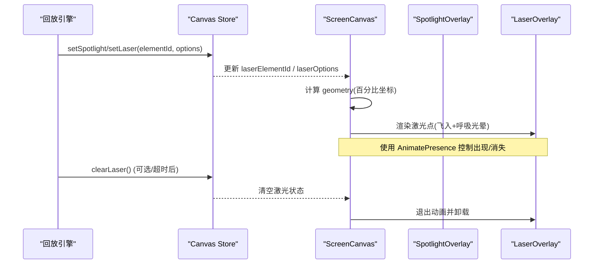
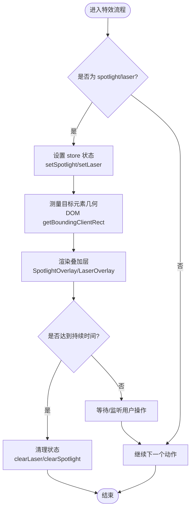
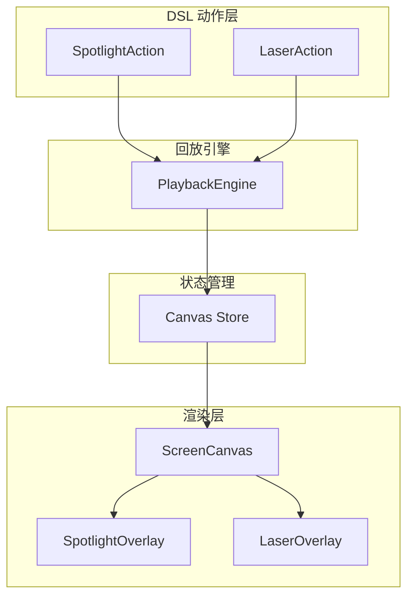
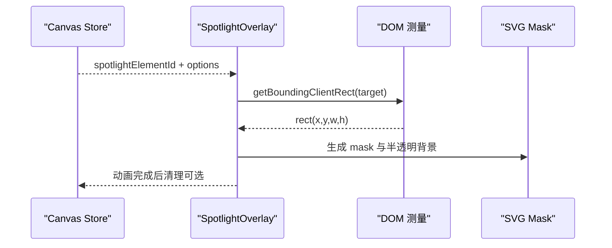
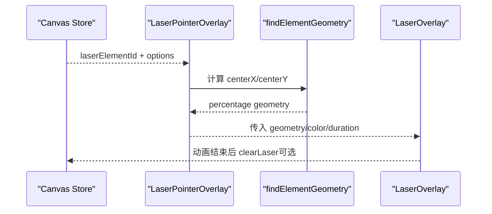
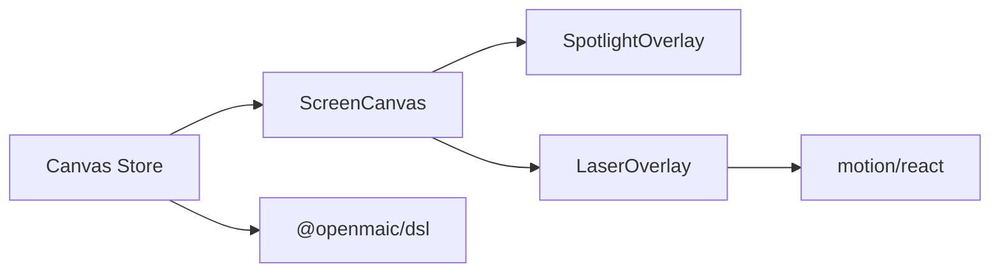

# 视觉特效动作

<cite>
**本文引用的文件**
- [SpotlightOverlay.tsx](file://components/slide-renderer/Editor/SpotlightOverlay.tsx)
- [LaserOverlay.tsx](file://components/slide-renderer/Editor/LaserOverlay.tsx)
- [LaserPointerOverlay.tsx](file://components/slide-renderer/Editor/LaserPointerOverlay.tsx)
- [ScreenCanvas.tsx](file://components/slide-renderer/Editor/ScreenCanvas.tsx)
- [canvas.ts](file://lib/store/canvas.ts)
- [action.ts](file://packages/@openmaic/dsl/src/action.ts)
- [use-canvas-operations.ts](file://lib/hooks/use-canvas-operations.ts)
- [action-navigation.test.ts](file://tests/playback/action-navigation.test.ts)
</cite>

## 产品概述
本章节聚焦于 OpenMAIC 课件播放与编辑过程中的“视觉特效动作”，包括聚光灯（spotlight）与激光笔（laser）两类特效。它们属于“即发即忘”（fire-and-forget）的幻灯片级动作，用于在讲解过程中突出目标元素、引导注意力，并通过可配置的动画与样式提升课堂表现力。文档将系统说明其实现机制、触发模式、状态管理、清理策略、性能考量以及扩展自定义特效的方法。

## 核心业务流程
- 触发入口：通过 DSL Action 定义 spotlight/laser 动作；回放引擎在执行到该动作时，调用 store 设置对应特效状态。
- 渲染响应：屏幕画布组件监听 store 变化，计算目标元素的几何位置，并渲染对应的叠加层（聚光灯遮罩或激光点）。
- 自动清理：特效具备默认持续时间或依赖外部清理接口；当需要重置所有教学特效时，统一调用 clearAllEffects。
- 跳转与回放：在跳帧或暂停场景下，确保不会误触发后续特效；对“过时”的微任务进行忽略，避免状态不一致。



图表来源
- [canvas.ts:363-435](file://lib/store/canvas.ts#L363-L435)
- [ScreenCanvas.tsx:18-124](file://components/slide-renderer/Editor/ScreenCanvas.tsx#L18-L124)
- [LaserOverlay.tsx:1-84](file://components/slide-renderer/Editor/LaserOverlay.tsx#L1-L84)

章节来源
- [action.ts:250-277](file://packages/@openmaic/dsl/src/action.ts#L250-L277)
- [canvas.ts:363-435](file://lib/store/canvas.ts#L363-L435)
- [ScreenCanvas.tsx:18-124](file://components/slide-renderer/Editor/ScreenCanvas.tsx#L18-L124)
- [LaserOverlay.tsx:1-84](file://components/slide-renderer/Editor/LaserOverlay.tsx#L1-L84)

## 功能模块清单
- 聚光灯（SpotlightOverlay）
  - 职责：基于 DOM 测量定位目标元素，生成 SVG 遮罩与半透明背景，突出目标区域。
  - 关键参数：dimness（背景变暗程度）、transition（过渡时长）、mode（pixel/percentage）。
  - 验收要点：遮罩与边框平滑过渡；在不同缩放/比例下保持对齐；不干扰底层交互。
- 激光笔（LaserOverlay + LaserPointerOverlay）
  - 职责：从最近角飞入目标中心，显示带呼吸光晕的光点；支持颜色与持续时长配置。
  - 关键参数：color（颜色）、duration（持续时间）、geometry（百分比坐标）。
  - 验收要点：飞入路径自然；光晕效果稳定；跨容器尺寸自适应。
- 画布与叠加层（ScreenCanvas）
  - 职责：聚合高亮、聚光灯、激光等叠加层；计算百分比几何并驱动动画。
  - 验收要点：层级顺序正确；缩放与视口变化不影响定位；动画流畅无闪烁。
- 状态与操作（Canvas Store + use-canvas-operations）
  - 职责：提供 setSpotlight/setLaser/clearAllEffects 等操作；维护特效选项与目标 ID。
  - 验收要点：状态变更最小化；批量清理一致；与视频播放生命周期解耦。

章节来源
- [SpotlightOverlay.tsx:1-183](file://components/slide-renderer/Editor/SpotlightOverlay.tsx#L1-L183)
- [LaserOverlay.tsx:1-84](file://components/slide-renderer/Editor/LaserOverlay.tsx#L1-L84)
- [LaserPointerOverlay.tsx:1-96](file://components/slide-renderer/Editor/LaserPointerOverlay.tsx#L1-L96)
- [ScreenCanvas.tsx:18-124](file://components/slide-renderer/Editor/ScreenCanvas.tsx#L18-L124)
- [canvas.ts:363-467](file://lib/store/canvas.ts#L363-L467)
- [use-canvas-operations.ts:495-557](file://lib/hooks/use-canvas-operations.ts#L495-L557)

## 数据与状态
- 核心状态字段（Canvas Store）
  - 聚光灯：spotlightElementId、spotlightOptions、spotlightMode、spotlightPercentageGeometry
  - 激光笔：laserElementId、laserOptions
  - 高亮：highlightedElementIds、highlightOptions
  - 缩放：zoomTarget
  - 其他：pickTarget、playingVideoElementId（不受特效清理影响）
- 动作类型与分类
  - FIRE_AND_FORGET_ACTIONS：spotlight、laser（非阻塞，立即执行）
  - SLIDE_ONLY_ACTIONS：spotlight、laser（仅幻灯片场景有效）
  - SYNC_ACTIONS：speech、wb_*、play_video、discussion、widget_*（同步等待完成）
- 百分比几何（PercentageGeometry）
  - 字段：x、y、w、h、centerX、centerY（范围 0-100），用于响应式定位与缩放兼容

```mermaid
classDiagram
class CanvasState {
+string spotlightElementId
+SpotlightOptions|nil spotlightOptions
+string spotlightMode
+PercentageGeometry|nil spotlightPercentageGeometry
+string[] highlightedElementIds
+HighlightOverlayOptions|nil highlightOptions
+string laserElementId
+LaserOptions|nil laserOptions
+{elementId : string; scale : number}|nil zoomTarget
+{sceneId : string; actionId : string; cueType : string}|nil pickTarget
+string playingVideoElementId
}
class SpotlightOptions {
+number radius
+number dimness
+number transition
}
class LaserOptions {
+string color
+number duration
}
class PercentageGeometry {
+number x
+number y
+number w
+number h
+number centerX
+number centerY
}
CanvasState --> SpotlightOptions : "包含"
CanvasState --> LaserOptions : "包含"
CanvasState --> PercentageGeometry : "包含"
```

图表来源
- [canvas.ts:59-80](file://lib/store/canvas.ts#L59-L80)
- [action.ts:317-331](file://packages/@openmaic/dsl/src/action.ts#L317-L331)

章节来源
- [canvas.ts:59-80](file://lib/store/canvas.ts#L59-L80)
- [action.ts:250-277](file://packages/@openmaic/dsl/src/action.ts#L250-L277)
- [action.ts:317-331](file://packages/@openmaic/dsl/src/action.ts#L317-L331)

## 关键约束与边界
- 触发模式（Fire-and-Forget）
  - spotlight/laser 为非阻塞动作，执行后立即返回，不等待渲染完成。
  - 回放引擎在到达对应动作时触发 onEffectFire 回调（测试用例验证）。
- 定时器与清理
  - 激光笔默认持续时长（如 3000ms），可通过 clearLaser 主动清除；clearAllEffects 会统一清理所有教学特效。
  - 视频播放的生命周期独立，不会被特效清理打断。
- 跳转与回放一致性
  - 跳帧到某动作前，不应触发后续未到达的特效；微任务中的“过时”特效应被忽略，保证状态一致。
- 渲染与定位
  - 聚光灯通过 DOM 测量（getBoundingClientRect）计算目标矩形，转换为 SVG viewBox 0-100 坐标，避免百分比转换的对齐偏移。
  - 激光点使用百分比坐标居中定位，并在外层容器内以绝对定位绘制，确保缩放与视口变化下的稳定性。
- 性能考虑
  - 使用 AnimatePresence 与 motion/react 的轻量动画，避免频繁重排；SVG mask 与 backdrop-filter 的使用需谨慎，防止合成问题。
  - 仅在必要时测量 DOM，减少布局抖动；百分比几何缓存与 memoization 降低重复计算。



图表来源
- [canvas.ts:363-467](file://lib/store/canvas.ts#L363-L467)
- [SpotlightOverlay.tsx:43-82](file://components/slide-renderer/Editor/SpotlightOverlay.tsx#L43-L82)
- [LaserOverlay.tsx:20-84](file://components/slide-renderer/Editor/LaserOverlay.tsx#L20-L84)

章节来源
- [action-navigation.test.ts:325-395](file://tests/playback/action-navigation.test.ts#L325-L395)
- [canvas.ts:363-467](file://lib/store/canvas.ts#L363-L467)
- [SpotlightOverlay.tsx:43-82](file://components/slide-renderer/Editor/SpotlightOverlay.tsx#L43-L82)
- [LaserOverlay.tsx:20-84](file://components/slide-renderer/Editor/LaserOverlay.tsx#L20-L84)

## 架构概览


图表来源
- [action.ts:250-277](file://packages/@openmaic/dsl/src/action.ts#L250-L277)
- [canvas.ts:363-467](file://lib/store/canvas.ts#L363-L467)
- [ScreenCanvas.tsx:18-124](file://components/slide-renderer/Editor/ScreenCanvas.tsx#L18-L124)
- [SpotlightOverlay.tsx:1-183](file://components/slide-renderer/Editor/SpotlightOverlay.tsx#L1-L183)
- [LaserOverlay.tsx:1-84](file://components/slide-renderer/Editor/LaserOverlay.tsx#L1-L84)

## 详细组件分析

### 聚光灯（SpotlightOverlay）
- 实现要点
  - 通过 useLayoutEffect 与 DOM 测量获取目标元素矩形，转换为 0-100 坐标系。
  - 使用 SVG mask 与半透明矩形实现“背景压暗 + 目标区域透出”的效果。
  - 边框与遮罩采用 motion 动画，提供平滑过渡与淡入淡出。
- 亮度调节
  - 通过 dimness 控制背景透明度（0-1），值越大越暗；transition 控制过渡时长。
- 定位与适配
  - 优先选择 .element-content 作为实际渲染区域，确保自动高度元素对齐准确。
  - 支持 editor 与 playback 两种 DOM id 前缀，保证 Pro 模式下编辑与回放一致。



图表来源
- [SpotlightOverlay.tsx:43-82](file://components/slide-renderer/Editor/SpotlightOverlay.tsx#L43-L82)
- [SpotlightOverlay.tsx:99-176](file://components/slide-renderer/Editor/SpotlightOverlay.tsx#L99-L176)

章节来源
- [SpotlightOverlay.tsx:1-183](file://components/slide-renderer/Editor/SpotlightOverlay.tsx#L1-L183)
- [canvas.ts:363-397](file://lib/store/canvas.ts#L363-L397)

### 激光笔（LaserOverlay + LaserPointerOverlay）
- 实现要点
  - LaserPointerOverlay 负责测量目标中心并转换为百分比坐标；LaserOverlay 负责动画与光晕。
  - 飞入路径从最近角开始，增强视觉引导；光晕通过重复缩放与透明度渐变实现呼吸效果。
- 颜色与持续时间
  - color 默认红色，duration 默认 3000ms；可通过 options 覆盖。
- 自动清除
  - 支持 clearLaser 主动清除；clearAllEffects 统一清理所有教学特效。



图表来源
- [LaserPointerOverlay.tsx:43-78](file://components/slide-renderer/Editor/LaserPointerOverlay.tsx#L43-L78)
- [LaserOverlay.tsx:20-84](file://components/slide-renderer/Editor/LaserOverlay.tsx#L20-L84)
- [ScreenCanvas.tsx:40-48](file://components/slide-renderer/Editor/ScreenCanvas.tsx#L40-L48)

章节来源
- [LaserPointerOverlay.tsx:1-96](file://components/slide-renderer/Editor/LaserPointerOverlay.tsx#L1-L96)
- [LaserOverlay.tsx:1-84](file://components/slide-renderer/Editor/LaserOverlay.tsx#L1-L84)
- [canvas.ts:419-435](file://lib/store/canvas.ts#L419-L435)

### 画布与叠加层（ScreenCanvas）
- 职责
  - 聚合 HighlightOverlay、SpotlightOverlay、LaserOverlay；计算激光与缩放的百分比几何。
  - 使用 AnimatePresence 控制激光点的出现与消失，确保动画连贯。
- 性能优化
  - useMemo 缓存 geometry 计算；仅在必要条件下触发测量与渲染。
  - 外层容器 padding 为激光飞出留出空间，避免溢出裁剪。

章节来源
- [ScreenCanvas.tsx:18-124](file://components/slide-renderer/Editor/ScreenCanvas.tsx#L18-L124)

### 状态与操作（Canvas Store + use-canvas-operations）
- 操作接口
  - setSpotlight/setSpotlightPercentage/clearSpotlight
  - setLaser/clearLaser
  - setHighlight/clearHighlight
  - setZoom/clearZoom
  - clearAllEffects（统一清理）
- 与视频播放解耦
  - playingVideoElementId 不在 clearAllEffects 中清理，避免打断视频生命周期。

章节来源
- [canvas.ts:363-467](file://lib/store/canvas.ts#L363-L467)
- [use-canvas-operations.ts:495-557](file://lib/hooks/use-canvas-operations.ts#L495-L557)

## 依赖分析
- 组件耦合
  - ScreenCanvas 依赖 Canvas Store 的状态与 findElementGeometry 工具；SpotlightOverlay/LaserOverlay 依赖 DOM 测量与 motion 动画。
- 外部依赖
  - motion/react 提供动画能力；Zustand 管理状态；@openmaic/dsl 定义动作类型。
- 潜在循环依赖
  - 当前结构清晰，未见循环导入；store 与组件单向依赖。



图表来源
- [canvas.ts:1-200](file://lib/store/canvas.ts#L1-L200)
- [ScreenCanvas.tsx:1-20](file://components/slide-renderer/Editor/ScreenCanvas.tsx#L1-L20)
- [action.ts:1-50](file://packages/@openmaic/dsl/src/action.ts#L1-L50)

章节来源
- [canvas.ts:1-200](file://lib/store/canvas.ts#L1-L200)
- [ScreenCanvas.tsx:1-20](file://components/slide-renderer/Editor/ScreenCanvas.tsx#L1-L20)
- [action.ts:1-50](file://packages/@openmaic/dsl/src/action.ts#L1-L50)

## 性能考虑
- 动画与渲染
  - 使用 motion 的 GPU 加速属性（transform、opacity）减少重排；避免在 SVG 中使用 backdrop-filter 导致合成问题。
- DOM 测量
  - 仅在状态变化时测量，避免频繁布局抖动；优先使用 .element-content 提高精度。
- 状态更新
  - 使用 Zustand 的最小化更新；clearAllEffects 一次性清理，减少多次 setState。
- 内存与资源
  - AnimatePresence 及时卸载组件；激光点动画结束后释放资源。

[本节为通用指导，无需特定文件引用]

## 故障排查指南
- 常见问题
  - 激光点未出现：检查 laserElementId 与 laserOptions 是否正确设置；确认 findElementGeometry 返回值有效。
  - 聚光灯错位：确认 DOM id 前缀（editor vs playback）；检查容器尺寸是否为 0。
  - 动画卡顿：减少同时进行的动画数量；避免复杂 CSS 滤镜。
- 调试建议
  - 使用浏览器开发者工具观察 DOM 测量结果与 SVG mask；检查 motion 动画时间线。
  - 回放引擎测试用例验证 onEffectFire 与跳转行为。

章节来源
- [action-navigation.test.ts:325-395](file://tests/playback/action-navigation.test.ts#L325-L395)
- [SpotlightOverlay.tsx:43-82](file://components/slide-renderer/Editor/SpotlightOverlay.tsx#L43-L82)
- [LaserPointerOverlay.tsx:43-78](file://components/slide-renderer/Editor/LaserPointerOverlay.tsx#L43-L78)

## 结论
聚光灯与激光笔作为 OpenMAIC 的核心视觉特效动作，提供了直观的教学辅助能力。通过清晰的 DSL 动作定义、稳定的状态管理与高效的渲染机制，它们在回放与编辑场景中均能保持一致体验。遵循本文的配置与最佳实践，可有效提升课堂演示的表现力与性能。

[本节为总结性内容，无需特定文件引用]