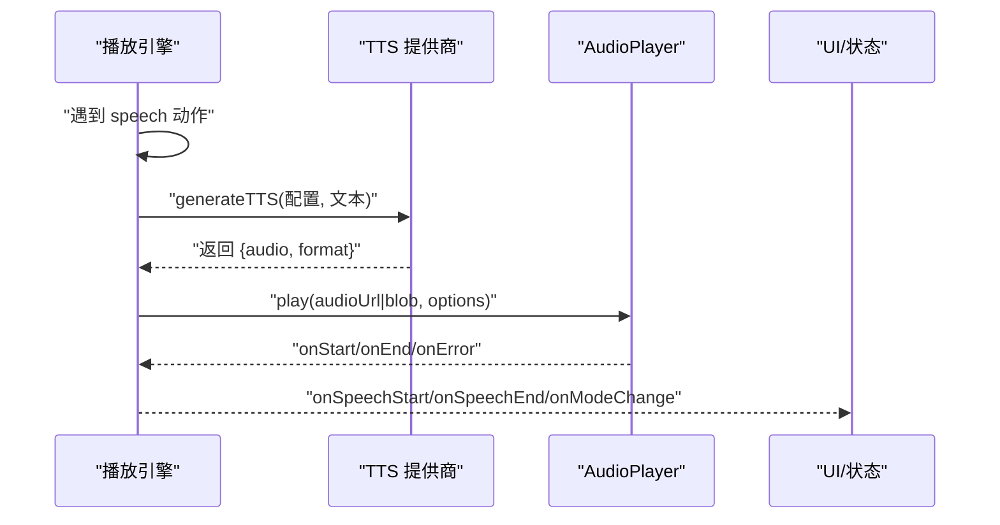
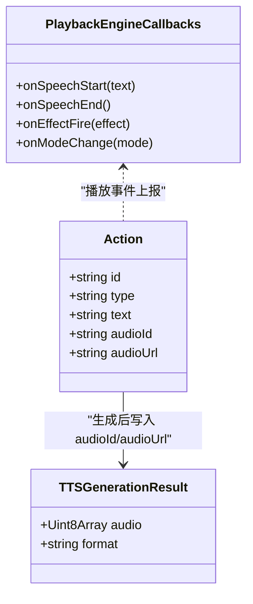

# 语音合成动作

<cite>
**本文引用的文件**
- [lib/audio/tts-providers.ts](file://lib/audio/tts-providers.ts)
- [lib/playback/types.ts](file://lib/playback/types.ts)
- [tests/playback/action-navigation.test.ts](file://tests/playback/action-navigation.test.ts)
- [components/edit/ActionsBar/actions-edit.ts](file://components/edit/ActionsBar/actions-edit.ts)
- [lib/utils/audio-player.ts](file://lib/utils/audio-player.ts)
- [app/api/generate/tts/route.ts](file://app/api/generate/tts/route.ts)
- [lib/server/classroom-media-generation.ts](file://lib/server/classroom-media-generation.ts)
- [tests/edit/actions-edit.test.ts](file://tests/edit/actions-edit.test.ts)
</cite>

## 更新摘要
**所做更改**
- 改进了语音合成动作的错误处理和音频字段标记逻辑
- 确保只在存在实际音频文件时设置audioId和audioUrl
- 增强了setSpeechTextClearAudioById函数的音频字段清理机制
- 优化了TTS生成流程中的音频资源验证

## 产品概述
本文件聚焦于 OpenMAIC 中的"语音合成动作（speech）"的完整实现与使用指南。该动作负责在课件播放过程中，将文本内容通过 TTS（Text-to-Speech）服务或浏览器原生能力转换为音频并播放，同时管理播放生命周期、错误处理以及与 AudioPlayer 的集成。文档面向开发者与高级用户，帮助理解 speech 动作的参数定义、执行机制、资源管理与最佳实践。

## 核心业务流程
- 触发：播放引擎在遇到类型为 speech 的动作时，进入语音合成与播放流程。
- 生成：根据当前 TTS 配置选择提供商（如 OpenAI、Azure、GLM、Qwen、MiniMax、ElevenLabs、VoxCPM、Doubao 等），调用对应 API 生成音频二进制数据与格式。
- 播放：将生成的音频交给 AudioPlayer 进行播放；若已有缓存 audioId/audioUrl，则优先复用。
- 事件：播放开始、结束、错误等回调由 PlaybackEngine 统一上报给上层 UI 与业务逻辑。
- 跳转与恢复：支持跳转到任意安全动作边界，自动静默回放确定性前置动作，避免重复渲染与播放。



**图示来源**
- [lib/audio/tts-providers.ts](file://lib/audio/tts-providers.ts)
- [lib/playback/types.ts](file://lib/playback/types.ts)
- [tests/playback/action-navigation.test.ts](file://tests/playback/action-navigation.test.ts)

**章节来源**
- [lib/audio/tts-providers.ts](file://lib/audio/tts-providers.ts)
- [lib/playback/types.ts](file://lib/playback/types.ts)
- [tests/playback/action-navigation.test.ts](file://tests/playback/action-navigation.test.ts)

## 功能模块清单
- TTS 提供商路由与实现
  - 职责：根据 providerId 路由到具体实现，统一返回 {audio, format}，处理鉴权、速率限制与错误。
  - 关键点：OpenAI/Azure/GLM/Qwen/MiniMax/ElevenLabs/VoxCPM/Doubao/Lemonade 等；支持自定义 OpenAI 兼容后端。
  - 参考路径：[lib/audio/tts-providers.ts](file://lib/audio/tts-providers.ts)

- 播放类型与回调
  - 职责：定义 EngineMode、Effect、PlaybackEngineCallbacks 等类型，规范 onSpeechStart/onSpeechEnd/onEffectFire 等回调。
  - 关键点：模式包括 idle/playing/paused/live；效果包括 spotlight/laser。
  - 参考路径：[lib/playback/types.ts](file://lib/playback/types.ts)

- 动作编辑与缓存字段
  - 职责：提供 setSpeechText/setAudioId 等工具函数，维护 speech 动作的 text/audioId/audioUrl 字段，编辑时清理旧音频缓存。
  - 关键点：setSpeechTextClearAudioById 会删除 audioId/audioUrl，确保文本变更后重新生成。
  - 参考路径：[components/edit/ActionsBar/actions-edit.ts](file://components/edit/ActionsBar/actions-edit.ts)

- 播放引擎与导航
  - 职责：控制播放进度、跳转、静音重放确定性动作、保护 unsafe 目标、处理过时回调与计时器。
  - 关键点：jumpToAction 支持 autoplay 选项；对需要重建上下文的目标进行守卫；保证 stale 回调不污染新状态。
  - 参考路径：[tests/playback/action-navigation.test.ts](file://tests/playback/action-navigation.test.ts)

- 音频播放器接口
  - 职责：封装 HTMLMediaElement 或 Web Speech API 的播放行为，提供 play/pause/cancel 等能力。
  - 关键点：与播放引擎协作，上报 onStart/onEnd/onError；支持 URL/Blob 输入。
  - 参考路径：[lib/utils/audio-player.ts](file://lib/utils/audio-player.ts)

- TTS API 路由
  - 职责：服务端聚合 TTS 请求，校验参数与安全策略，转发至各提供商。
  - 关键点：SSRF 防护、重定向限制、错误码映射。
  - 参考路径：[app/api/generate/tts/route.ts](file://app/api/generate/tts/route.ts)

**章节来源**
- [lib/audio/tts-providers.ts](file://lib/audio/tts-providers.ts)
- [lib/playback/types.ts](file://lib/playback/types.ts)
- [components/edit/ActionsBar/actions-edit.ts](file://components/edit/ActionsBar/actions-edit.ts)
- [tests/playback/action-navigation.test.ts](file://tests/playback/action-navigation.test.ts)
- [lib/utils/audio-player.ts](file://lib/utils/audio-player.ts)
- [app/api/generate/tts/route.ts](file://app/api/generate/tts/route.ts)

## 数据与状态
- 动作模型（speech）关键字段
  - id：动作唯一标识
  - type：'speech'
  - text：要合成的文本
  - audioId：已生成的音频资源 ID（用于缓存与复用）
  - audioUrl：可直接播放的音频 URL（本地 Blob URL 或远程地址）
  - 说明：编辑文本时应清除 audioId/audioUrl，确保下次播放重新生成。

- 播放状态与回调
  - EngineMode：idle/playing/paused/live
  - PlaybackEngineCallbacks：onSpeechStart/onSpeechEnd/onEffectFire/onModeChange 等
  - Effect：spotlight/laser 等视觉特效

- 数据所有权与边界
  - 动作数据由编辑器与播放引擎共同维护；音频资源由 TTS 提供商或本地缓存提供。
  - 播放引擎仅持有引用（ID/URL），不负责持久化音频二进制。



**图示来源**
- [components/edit/ActionsBar/actions-edit.ts](file://components/edit/ActionsBar/actions-edit.ts)
- [lib/playback/types.ts](file://lib/playback/types.ts)
- [lib/audio/tts-providers.ts](file://lib/audio/tts-providers.ts)

**章节来源**
- [components/edit/ActionsBar/actions-edit.ts](file://components/edit/ActionsBar/actions-edit.ts)
- [lib/playback/types.ts](file://lib/playback/types.ts)
- [lib/audio/tts-providers.ts](file://lib/audio/tts-providers.ts)

## 关键约束与边界
- 参数定义与使用
  - audioId：指向已缓存的音频资源 ID，适合离线或重复播放场景。
  - audioUrl：可直接播放的 URL，适合流式或远程资源。
  - 注意：修改 text 时必须清空 audioId/audioUrl，避免播放旧音频。

- 播放生命周期
  - 开始：onSpeechStart 触发，可更新 UI 状态（如高亮说话者）。
  - 结束：onSpeechEnd 触发，推进下一个动作或完成播放。
  - 错误：onError 应捕获网络/权限/格式错误，提示用户并重试或降级。

- 与 AudioPlayer 集成
  - 播放开始/结束事件需透传给播放引擎，确保状态机一致。
  - 支持暂停/继续/停止，避免多实例并发冲突。

- 性能与质量
  - 格式选择：mp3/wav/flac/ogg/webm，按设备与带宽权衡。
  - 速度控制：speed 范围因提供商而异，默认 1.0，合理范围 0.5–2.0。
  - 缓存策略：优先复用 audioId/audioUrl，减少重复生成。

- 安全与合规
  - SSRF 防护：服务端校验 baseUrl，禁止危险重定向。
  - 鉴权：apiKey/baseUrl/modelId/voice/speed 等参数需严格校验。
  - 速率限制：429 错误需识别并回退或重试。

- 最佳实践
  - 短文本优先：长文本分段合成，降低失败概率。
  - 预加载：在用户交互前预取音频，提升响应速度。
  - 降级：API 不可用时回退到浏览器原生 TTS（客户端）。

**章节来源**
- [lib/audio/tts-providers.ts](file://lib/audio/tts-providers.ts)
- [lib/playback/types.ts](file://lib/playback/types.ts)
- [tests/playback/action-navigation.test.ts](file://tests/playback/action-navigation.test.ts)
- [components/edit/ActionsBar/actions-edit.ts](file://components/edit/ActionsBar/actions-edit.ts)
- [lib/utils/audio-player.ts](file://lib/utils/audio-player.ts)
- [app/api/generate/tts/route.ts](file://app/api/generate/tts/route.ts)

## 新增：增强的音频字段验证机制

### 音频字段标记逻辑改进
系统现在实现了更严格的音频字段验证机制，确保只在存在实际音频文件时才设置 audioId 和 audioUrl 字段：

- **stampAudioFields 函数**：位于 `lib/server/classroom-media-generation.ts`，负责根据实际存在的音频文件来标记动作的音频字段
- **条件性设置**：只有在 existingVoiceFiles.length > 0 时才设置 audioId 和 audioUrl
- **默认语音优先**：优先使用默认语音作为锚点，如果默认语音不存在则回退到第一个存在的语音

### 音频字段清理机制
`setSpeechTextClearAudioById` 函数现在提供了更完善的音频字段清理功能：

- **双重清理**：同时删除 audioId 和 audioUrl 字段，确保文本变更后不会播放旧音频
- **类型安全**：使用 TypeScript 类型断言确保操作的准确性
- **索引稳定**：支持通过 ID 查找操作，避免因数组索引变化导致的问题

### TTS 生成流程增强
在 TTS 生成过程中增加了更严格的错误处理：

- **逐语音验证**：为每个语音单独生成并验证文件存在性
- **失败隔离**：单个语音生成失败不影响其他语音的生成
- **统计信息**：记录成功生成和失败的语音数量，便于问题诊断

```mermaid
flowchart TD
A[TTS 生成开始] --> B{检查现有音频文件}
B --> C{是否有实际音频文件?}
C --> |否| D[保持动作无音频状态]
C --> |是| E[设置 audioId 和 audioUrl]
E --> F{默认语音是否存在?}
F --> |是| G[使用 {voice} 模板 URL]
F --> |否| H[直接指向现有文件 URL]
G --> I[完成]
H --> I[完成]
D --> J[等待重新生成]
```

**图示来源**
- [lib/server/classroom-media-generation.ts:237-268](file://lib/server/classroom-media-generation.ts#L237-L268)
- [components/edit/ActionsBar/actions-edit.ts:115-125](file://components/edit/ActionsBar/actions-edit.ts#L115-L125)

**章节来源**
- [lib/server/classroom-media-generation.ts](file://lib/server/classroom-media-generation.ts)
- [components/edit/ActionsBar/actions-edit.ts](file://components/edit/ActionsBar/actions-edit.ts)
- [tests/edit/actions-edit.test.ts](file://tests/edit/actions-edit.test.ts)

## 错误处理与容错机制

### 播放错误处理
AudioPlayer 实现了多层错误处理机制：

- **URL 加载失败**：当指定的音频 URL 无法加载时，自动回退到其他可用源
- **播放权限错误**：处理浏览器自动播放策略限制
- **解码错误**：处理音频格式不支持的情况

### 生成错误处理
TTS 生成过程中的错误处理：

- **API 调用失败**：记录详细错误信息并跳过失败的请求
- **文件写入失败**：确保磁盘空间充足且路径正确
- **网络超时**：设置合理的超时时间防止长时间阻塞

### 回退策略
系统实现了多层次的回退机制：

1. **首选**：服务器预生成的音频文件
2. **次选**：IndexedDB 缓存的客户端生成音频
3. **最后**：浏览器原生 TTS 能力

**章节来源**
- [lib/utils/audio-player.ts](file://lib/utils/audio-player.ts)
- [lib/server/classroom-media-generation.ts](file://lib/server/classroom-media-generation.ts)
- [tests/edit/actions-edit.test.ts](file://tests/edit/actions-edit.test.ts)