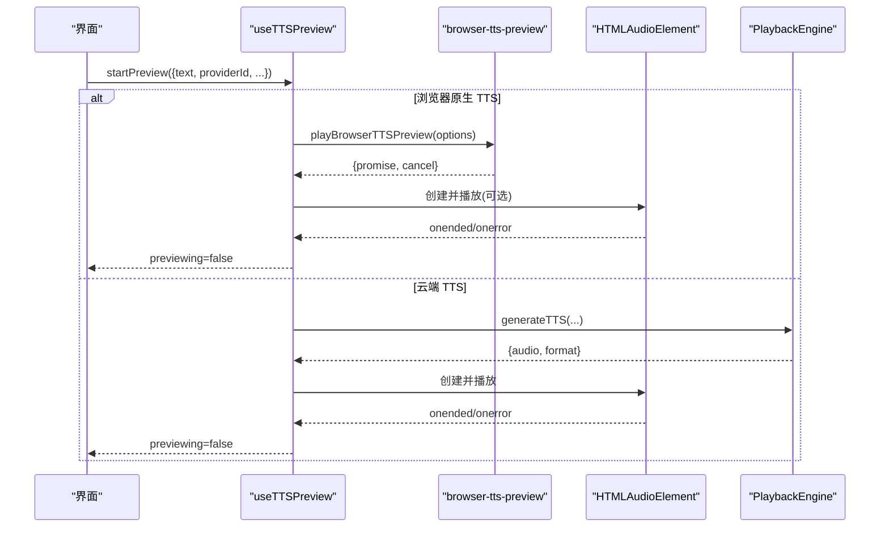
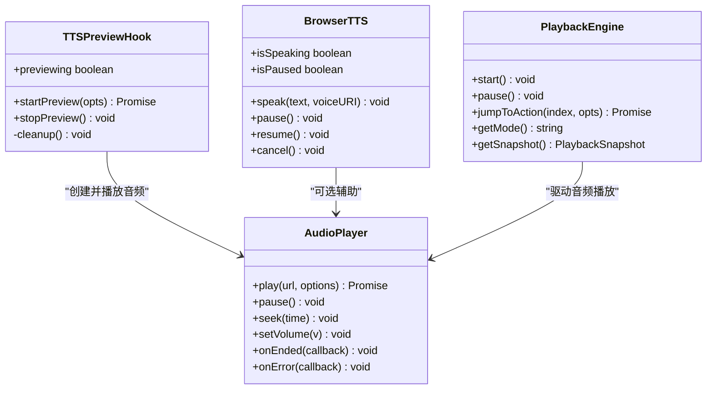
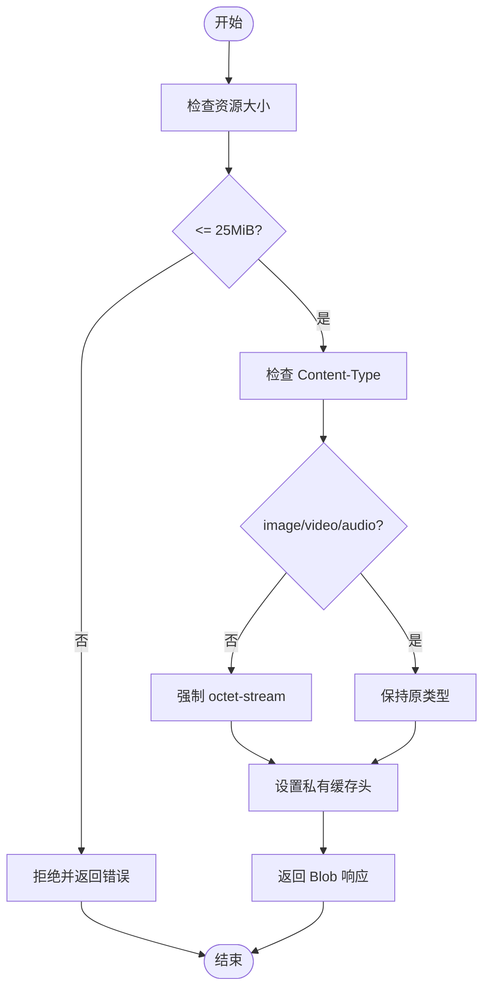

# 媒体播放控制

<cite>
**本文引用的文件**   
- [lib/audio/tts-providers.ts](file://lib/audio/tts-providers.ts)
- [lib/audio/browser-tts-preview.ts](file://lib/audio/browser-tts-preview.ts)
- [lib/hooks/use-browser-tts.ts](file://lib/hooks/use-browser-tts.ts)
- [lib/audio/use-tts-preview.ts](file://lib/audio/use-tts-preview.ts)
- [app/api/proxy-media/route.ts](file://app/api/proxy-media/route.ts)
- [lib/choreography/timing.ts](file://lib/choreography/timing.ts)
- [lib/store/canvas.ts](file://lib/store/canvas.ts)
- [lib/video-export/passes/assets.ts](file://lib/video-export/passes/assets.ts)
- [tests/playback/action-navigation.test.ts](file://tests/playback/action-navigation.test.ts)
</cite>

## 产品概述
本模块聚焦于 OpenMAIC 中的媒体播放控制能力，覆盖音频与视频两大维度：
- 音频播放：封装多 TTS 提供商（含浏览器原生 Web Speech API），支持预生成音频、预览播放、进度跟踪与音量控制。
- 视频播放：提供视频加载、播放状态管理与同步控制，配合导出管线对视频片段进行编排与打包。
- 资源与性能：通过代理接口统一获取媒体资源，限制大小与安全类型；在回放引擎中实现跳转、暂停、自动播放等交互，并内置超时与重试策略。

该能力服务于课件生成与课堂回放场景，确保在多浏览器环境下稳定、流畅地播放音视频内容。

## 核心业务流程
- 音频流程
  - 选择 TTS 提供商（云端或浏览器原生）→ 生成/获取音频 → 创建 Audio 元素 → 播放/暂停/跳转/音量调节 → 监听结束事件更新 UI。
  - 预览模式：使用 useTTSPreview 钩子管理请求生命周期，避免重复请求与内存泄漏。
- 视频流程
  - 通过 store 的 playVideo/pauseVideo 触发渲染层播放控制；导出时按素材清单规划视频片段与时长。
- 回放引擎
  - 基于动作序列驱动播放，支持 jumpToAction、autoplay 控制、阅读计时与完成回调。

**图表来源** 
- [lib/audio/use-tts-preview.ts:1-93](file://lib/audio/use-tts-preview.ts#L1-L93)
- [lib/audio/browser-tts-preview.ts:1-212](file://lib/audio/browser-tts-preview.ts#L1-L212)
- [lib/audio/tts-providers.ts:145-193](file://lib/audio/tts-providers.ts#L145-L193)

**章节来源**
- [lib/audio/use-tts-preview.ts:1-93](file://lib/audio/use-tts-preview.ts#L1-L93)
- [lib/audio/browser-tts-preview.ts:1-212](file://lib/audio/browser-tts-preview.ts#L1-L212)
- [lib/audio/tts-providers.ts:145-193](file://lib/audio/tts-providers.ts#L145-L193)

## 功能模块清单
- 音频播放器封装
  - 职责：统一管理 HTMLAudioElement 的创建、播放、暂停、跳转、音量与结束事件；与回放引擎对接，保证动作级同步。
  - 验收要点：支持 autoplay 控制；跳转后不重复触发旧完成回调；错误可区分中断与非中断。
- 浏览器原生 TTS
  - 职责：利用 Web Speech API 进行文本转语音，支持语言推断、声音选择、速率/音量控制、取消与超时。
  - 验收要点：无 API Key；跨浏览器兼容；中断错误可识别；超时保护。
- 云端 TTS 提供商
  - 职责：统一调用多个 TTS 服务（OpenAI、Azure、GLM、Qwen、MiniMax、ElevenLabs、VoxCPM、Lemonade 等），返回二进制音频与格式。
  - 验收要点：API Key 校验；429 限流识别；错误信息可读；格式推断准确。
- 视频播放控制
  - 职责：通过 store 暴露 playVideo/pauseVideo 方法，驱动渲染层控制视频元素；导出阶段收集视频片段与元数据。
  - 验收要点：播放状态一致；跳转安全；导出时缺失素材有诊断信息。
- 媒体代理与缓存
  - 职责：代理外部媒体资源，限制大小、过滤 Content-Type，设置私有缓存头。
  - 验收要点：超大资源拦截；安全类型白名单；缓存策略合理。
- 回放引擎与时间线
  - 职责：驱动动作执行、音频/视频同步、阅读计时、完成回调；支持跳步与暂停。
  - 验收要点：jumpToAction 行为正确；过期 Promise 不触发旧回调；最大等待上限。

**章节来源**
- [lib/store/canvas.ts:156-191](file://lib/store/canvas.ts#L156-L191)
- [lib/video-export/passes/assets.ts:202-252](file://lib/video-export/passes/assets.ts#L202-L252)
- [lib/choreography/timing.ts:33-66](file://lib/choreography/timing.ts#L33-L66)
- [tests/playback/action-navigation.test.ts:255-577](file://tests/playback/action-navigation.test.ts#L255-L577)

## 数据与状态
- 音频状态
  - 播放状态：playing/paused/idle
  - 进度：currentTime/duration
  - 音量：volume
  - 事件：onended/onerror
- 视频状态
  - 播放状态：playing/paused
  - 元素引用：elementId 到 video 元素的映射
- TTS 预览状态
  - previewing：是否正在预览
  - requestId：用于丢弃过期响应
  - audioUrl：对象 URL 引用，释放避免内存泄漏
- 回放快照
  - actionIndex：当前动作索引
  - mode：playing/paused/idle
  - 完成回调：onComplete/onSpeechEnd

**图表来源** 
- [lib/audio/use-tts-preview.ts:1-93](file://lib/audio/use-tts-preview.ts#L1-L93)
- [lib/hooks/use-browser-tts.ts:1-151](file://lib/hooks/use-browser-tts.ts#L1-L151)
- [tests/playback/action-navigation.test.ts:255-577](file://tests/playback/action-navigation.test.ts#L255-L577)

**章节来源**
- [lib/audio/use-tts-preview.ts:1-93](file://lib/audio/use-tts-preview.ts#L1-L93)
- [lib/hooks/use-browser-tts.ts:1-151](file://lib/hooks/use-browser-tts.ts#L1-L151)
- [tests/playback/action-navigation.test.ts:255-577](file://tests/playback/action-navigation.test.ts#L255-L577)

## 关键约束与边界
- 浏览器兼容性
  - Web Speech API 仅在客户端可用；服务端调用需走云端 TTS 提供商。
  - 不同浏览器对 voices 加载时机不一致，需监听 onvoiceschanged 或超时兜底。
- 资源大小与安全
  - 代理接口限制 25 MiB，仅允许 image/video/audio 类型，其他强制 octet-stream。
- 回放引擎约束
  - 最大视频等待 5 分钟；读取计时基于 CJK/非 CJK 文本估算；jumpToAction 需校验目标安全性。
- 错误处理与重试
  - TTS 提供商 429 限流抛出专用错误；网络错误可按上下文重试（如 MinerU Cloud 示例）。
- 内存优化
  - 及时撤销对象 URL；清理未使用的 Audio 元素；避免重复请求（requestId 守卫）。

**章节来源**
- [app/api/proxy-media/route.ts:67-93](file://app/api/proxy-media/route.ts#L67-L93)
- [lib/choreography/timing.ts:33-66](file://lib/choreography/timing.ts#L33-L66)
- [lib/choreography/timing.ts:68-121](file://lib/choreography/timing.ts#L68-L121)
- [lib/pdf/mineru-cloud.ts:45-79](file://lib/pdf/mineru-cloud.ts#L45-L79)

## 多媒体资源的缓存策略、错误处理和重试机制
- 缓存策略
  - 代理接口设置 Cache-Control: private, max-age=3600，适合用户私有缓存。
  - 前端可使用 IndexedDB 或内存缓存减少重复下载（结合对象 URL 释放）。
- 错误处理
  - TTS 提供商错误分类：限流（429）、认证失败、网络异常、格式解析错误。
  - 浏览器 TTS 错误：canceled/interrupted 视为中断；其他错误向上抛出。
- 重试机制
  - 网络错误判断（fetch failed/econnreset/timeout/aborted）；指数退避重试（示例为 400ms*i）。
  - 回放引擎中，跳转后旧 Promise 必须被忽略，防止过时完成回调。

**图表来源** 
- [app/api/proxy-media/route.ts:67-93](file://app/api/proxy-media/route.ts#L67-L93)

**章节来源**
- [app/api/proxy-media/route.ts:67-93](file://app/api/proxy-media/route.ts#L67-L93)
- [lib/pdf/mineru-cloud.ts:45-79](file://lib/pdf/mineru-cloud.ts#L45-L79)
- [lib/audio/browser-tts-preview.ts:1-212](file://lib/audio/browser-tts-preview.ts#L1-L212)

## 媒体播放 API 使用示例
- 播放音频
  - 使用 createAudioPlayer 或 HTMLAudioElement 创建实例，调用 play(url, options)。
  - 设置 onended 回调以推进回放引擎到下一动作。
- 暂停与继续
  - 调用 pause()；恢复时根据 autoplay 决定是否自动播放。
- 跳转
  - 使用 engine.jumpToAction(index, { autoplay: false }) 定位到指定动作，不自动播放。
- 音量控制
  - 通过 Audio 元素的 volume 属性调节；TTS 提供商参数中也可设置速度/音量。
- 视频控制
  - 调用 store.playVideo(elementId) 启动；store.pauseVideo() 暂停。
- 预览 TTS
  - 使用 useTTSPreview.startPreview({ text, providerId, ... })；stopPreview() 停止并释放资源。

**章节来源**
- [lib/store/canvas.ts:156-191](file://lib/store/canvas.ts#L156-L191)
- [lib/audio/use-tts-preview.ts:1-93](file://lib/audio/use-tts-preview.ts#L1-L93)
- [tests/playback/action-navigation.test.ts:255-577](file://tests/playback/action-navigation.test.ts#L255-L577)

## 跨浏览器兼容性处理、内存优化和性能调优建议
- 兼容性
  - 检测 window.speechSynthesis 可用性；异步 voices 加载监听 onvoiceschanged。
  - 代理接口统一 Content-Type 与缓存头，降低差异影响。
- 内存优化
  - 及时 revokeObjectURL；销毁 Audio 元素；避免重复请求（requestId 守卫）。
  - 大资源代理限制大小，避免内存溢出。
- 性能调优
  - 使用短超时（预览 30s，voices 加载 2s）提升响应性。
  - 回放引擎中设置最大视频等待时间，避免长时间阻塞。
  - 合理估算阅读时长，减少不必要的等待。

**章节来源**
- [lib/audio/browser-tts-preview.ts:1-212](file://lib/audio/browser-tts-preview.ts#L1-L212)
- [lib/hooks/use-browser-tts.ts:1-151](file://lib/hooks/use-browser-tts.ts#L1-L151)
- [lib/choreography/timing.ts:33-66](file://lib/choreography/timing.ts#L33-L66)
- [lib/choreography/timing.ts:68-121](file://lib/choreography/timing.ts#L68-L121)