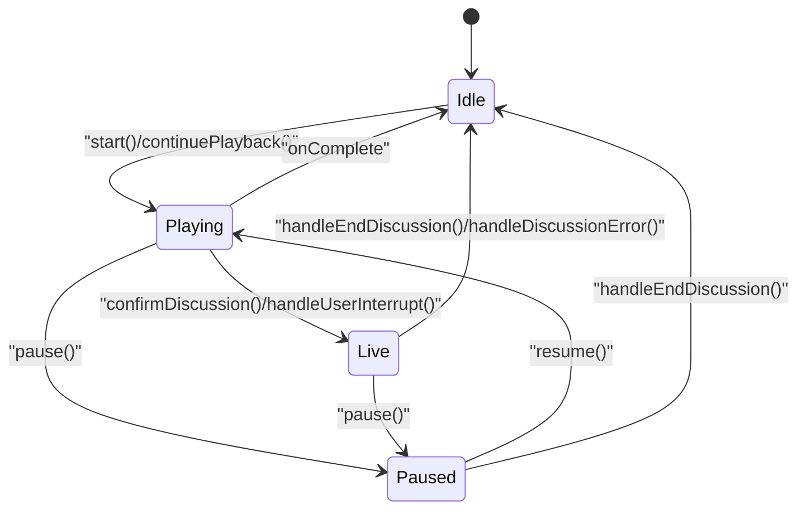
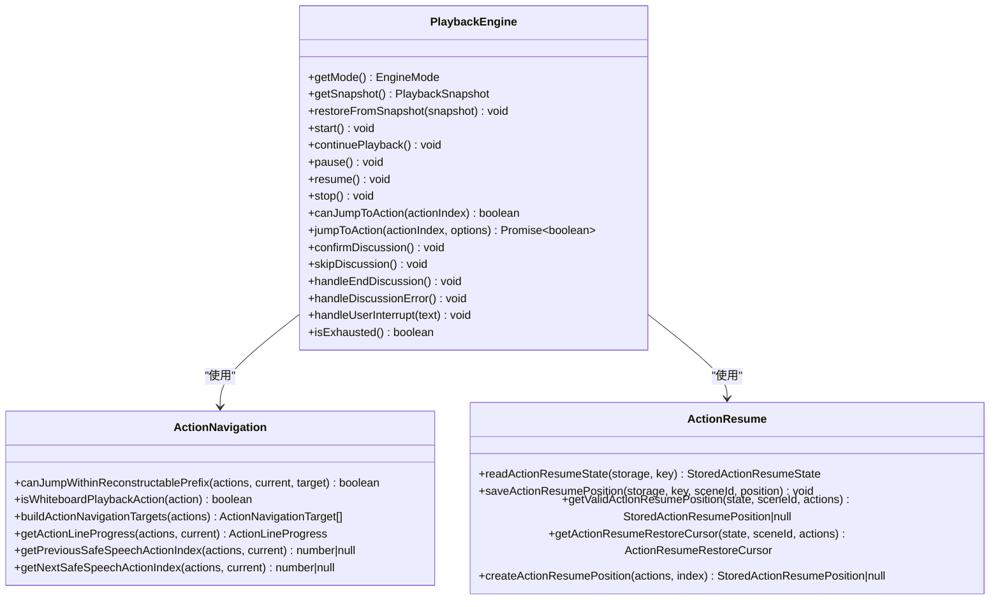
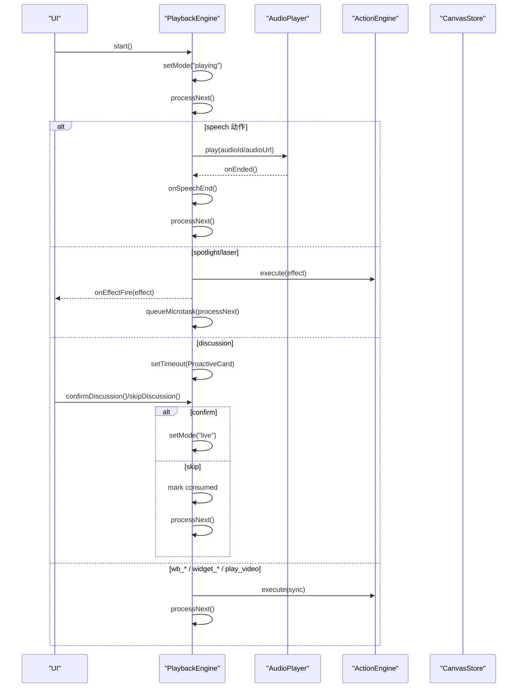
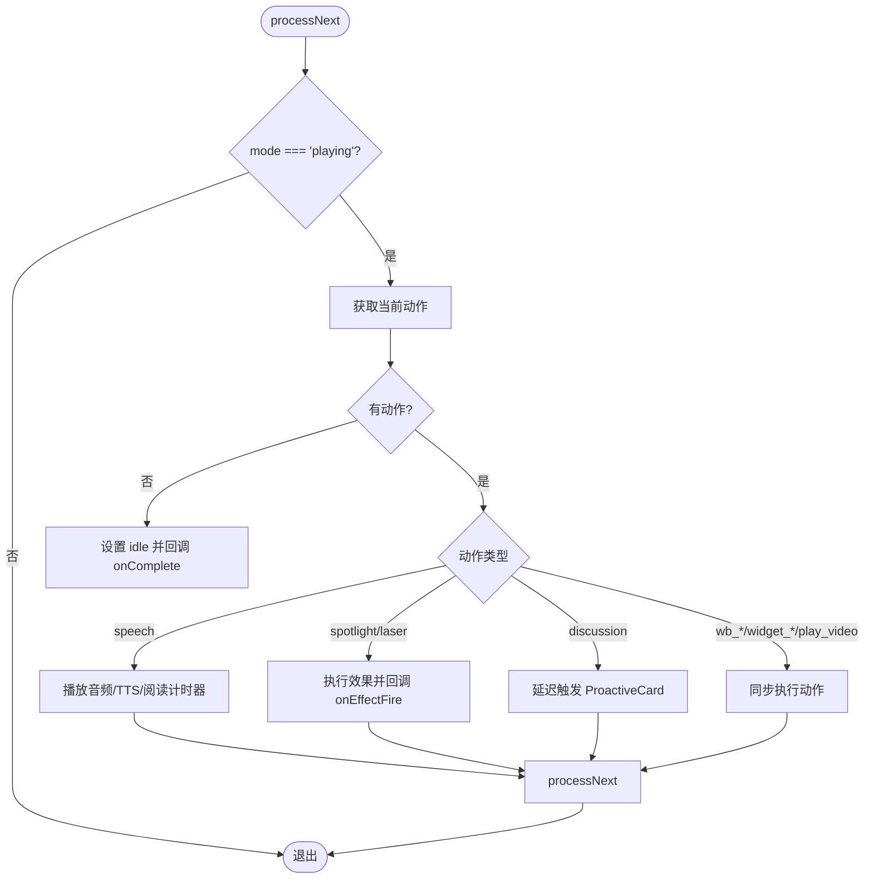
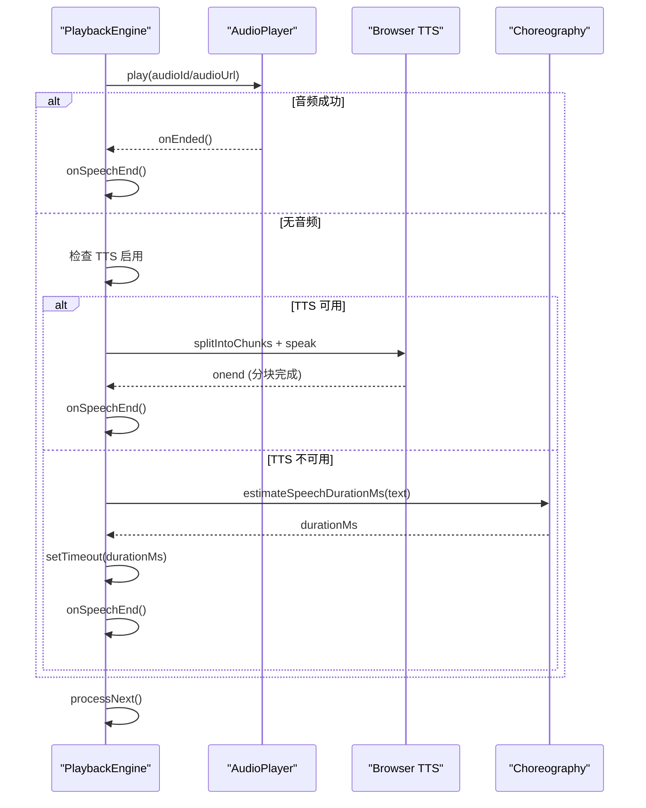
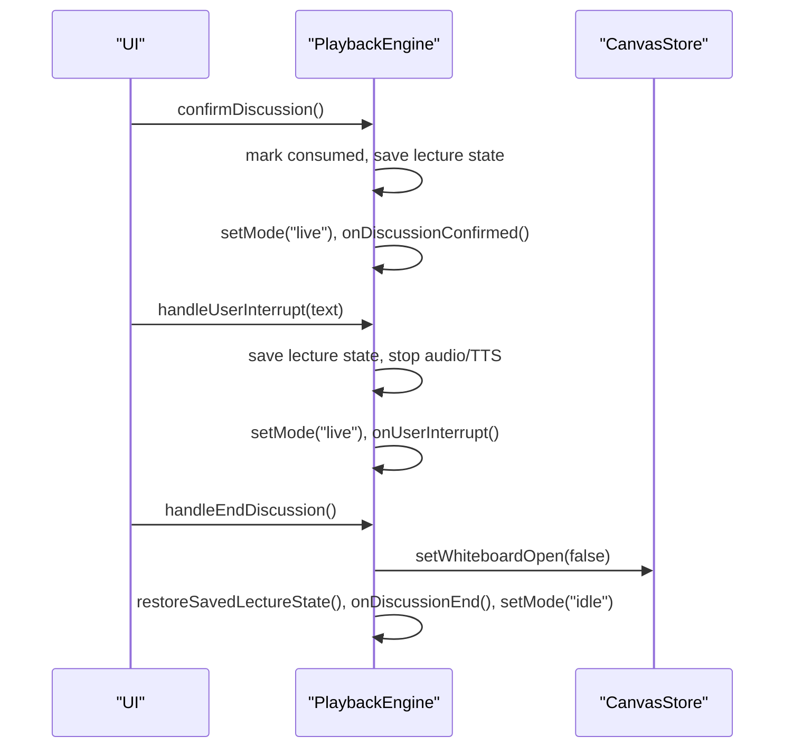
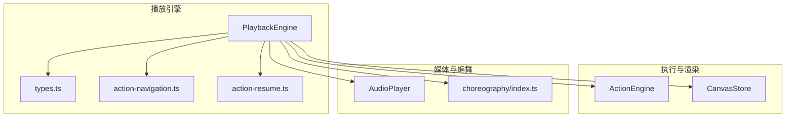
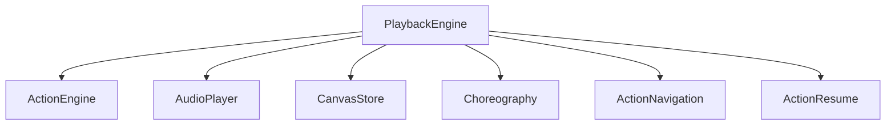

# 播放引擎

<cite>
**本文引用的文件**   
- [lib/playback/engine.ts](file://lib/playback/engine.ts)
- [lib/playback/types.ts](file://lib/playback/types.ts)
- [lib/playback/action-navigation.ts](file://lib/playback/action-navigation.ts)
- [lib/playback/action-resume.ts](file://lib/playback/action-resume.ts)
- [lib/choreography/index.ts](file://lib/choreography/index.ts)
- [lib/store/canvas.ts](file://lib/store/canvas.ts)
- [tests/playback/action-navigation.test.ts](file://tests/playback/action-navigation.test.ts)
</cite>

## 产品概述
本播放引擎负责课堂回放与实时讨论的统一状态机管理，直接消费场景 DSL 中的 actions，无需中间编译步骤。核心能力包括：
- 播放状态机：idle/playing/paused/live 四态切换，支持暂停、恢复、停止、继续播放。
- 动作执行引擎：通过 ActionEngine 同步或异步执行语音、白板绘制、特效（聚光灯/激光）、视频播放等动作。
- 媒体播放控制：优先使用预生成音频，回退到浏览器原生 TTS；无可用音频时按估计阅读时长推进。
- 时间轴同步与进度跟踪：基于场景与动作索引的游标推进，提供快照与持久化断点续播。
- 用户交互处理：主动式讨论卡片触发、用户打断进入 live 模式、讨论结束恢复讲座位置。
- 安全跳转与可重建前缀：仅允许跳转到可安全重建的前缀目标，避免副作用动作导致的状态不一致。

## 核心业务流程
- 开始播放：从 idle 进入 playing，逐条处理 action，遇到 speech 驱动音频/TTS/阅读计时器，遇到 effect 立即触发，遇到 discussion 延迟弹出提示卡。
- 暂停/恢复：暂停时冻结音频与 TTS，记录剩余时间以便恢复；恢复时根据当前状态选择恢复音频、TTS 或阅读计时器。
- 用户打断：将播放转为 live，保存被中断的讲座位置，等待对话结束后恢复并回到 idle。
- 跳转定位：jumpToAction 校验目标是否可重建前缀，静默重放白板动作以到达目标，再决定是否自动播放。
- 完成与退出：所有场景与动作耗尽后进入 idle 并回调 onComplete；stop 清理所有资源与效果。

**图表来源** 
- [lib/playback/engine.ts:1-800](file://lib/playback/engine.ts#L1-L800)
- [lib/playback/types.ts:1-63](file://lib/playback/types.ts#L1-L63)

**章节来源**
- [lib/playback/engine.ts:1-800](file://lib/playback/engine.ts#L1-L800)
- [lib/playback/types.ts:1-63](file://lib/playback/types.ts#L1-L63)

## 功能模块清单
- 播放引擎 PlaybackEngine
  - 职责：统一状态机、动作调度、媒体控制、讨论流程、进度与快照。
  - 验收要点：四态切换正确；speech/spotlight/laser/discussion/video/wb_* 动作处理符合预期；跳转安全校验生效；暂停恢复行为一致。
- 动作导航 action-navigation
  - 职责：判定可跳转目标、白板动作识别、构建导航目标与行进度。
  - 验收要点：unsafe 类型不可跳转；仅 speech 目标可重建前缀；前后安全 speech 索引计算正确。
- 断点续播 action-resume
  - 职责：读写存储的动作断点位置，校验有效性，返回可恢复游标。
  - 验收要点：版本与结构校验；actionId/type 一致性检查；结合可重建前缀限制。
- 编舞 choreography
  - 职责：解析播放游标、估算语音时长、讨论触发延迟常量。
  - 验收要点：空动作场景仍产生 dwell beat；CJK/英文语速差异估算合理；DISCUSSION_TRIGGER_DELAY_MS 稳定。
- 画布状态 store/canvas
  - 职责：视频播放控制、白板开关、聚光灯/激光/高亮/缩放等教学特效。
  - 验收要点：resetCanvasState 在场景切换时重置；playVideo/pauseVideo 与引擎联动。

**章节来源**
- [lib/playback/engine.ts:1-800](file://lib/playback/engine.ts#L1-L800)
- [lib/playback/action-navigation.ts:1-133](file://lib/playback/action-navigation.ts#L1-L133)
- [lib/playback/action-resume.ts:1-129](file://lib/playback/action-resume.ts#L1-L129)
- [lib/choreography/index.ts](file://lib/choreography/index.ts)
- [lib/store/canvas.ts:156-191](file://lib/store/canvas.ts#L156-L191)

## 数据与状态
- 核心状态
  - scenes、sceneIndex、actionIndex：当前场景与动作游标。
  - mode：EngineMode 四态。
  - consumedDiscussions：已消费的讨论 id 集合，避免重复触发。
  - savedSceneIndex/savedActionIndex：被打断的讲座位置，用于恢复。
  - currentTopicState：讨论主题状态 active/pending/closed。
  - 媒体相关：audioPlayer、browserTTSActive、browserTTSChunks、browserTTSChunkIndex、speechTimer、speechTimerRemaining。
  - generation：用于取消过期任务与竞态保护。
- 快照与持久化
  - getSnapshot：导出 sceneIndex、actionIndex、consumedDiscussions、sceneId。
  - restoreFromSnapshot：恢复引擎内部游标与已消费讨论集。
  - action-resume：按 sceneId 存储 actionIndex/actionId/actionType，供下次打开时恢复。
- 数据所有权边界
  - 引擎持有播放游标与状态，不直接修改渲染层；通过 callbacks 与 ActionEngine 通知 UI 与效果系统。
  - Canvas Store 由 ActionEngine 与引擎共同更新，确保场景切换时 resetCanvasState。

**图表来源** 
- [lib/playback/engine.ts:1-800](file://lib/playback/engine.ts#L1-L800)
- [lib/playback/action-navigation.ts:1-133](file://lib/playback/action-navigation.ts#L1-L133)
- [lib/playback/action-resume.ts:1-129](file://lib/playback/action-resume.ts#L1-L129)

**章节来源**
- [lib/playback/engine.ts:1-800](file://lib/playback/engine.ts#L1-L800)
- [lib/playback/action-resume.ts:1-129](file://lib/playback/action-resume.ts#L1-L129)

## 关键约束与边界
- 跳转安全约束
  - 仅当目标是 speech 且其前缀不包含 unsafe 类型（如 play_video、discussion、widget_*）时允许跳转。
  - canJumpToAction 在非 live 模式下才允许跳转；jumpToAction 会静默重放白板动作以重建视觉状态。
- 媒体播放边界
  - 优先使用预生成音频；若无则尝试浏览器原生 TTS（需启用），否则按估计阅读时长推进。
  - 暂停时冻结 TTS 与音频，恢复时按不同路径恢复；stop 时清理所有资源。
- 讨论与打断边界
  - discussion 动作延迟触发 ProactiveCard；用户确认进入 live，跳过则标记 consumed 并继续。
  - handleUserInterrupt 保存讲座位置并进入 live；handleEndDiscussion 恢复位置并回到 idle。
- 性能与稳定性
  - 使用 generation 令牌防止过期回调影响当前播放。
  - spotlight/laser 使用 queueMicrotask 避免深递归导致的栈溢出。
  - 浏览器 TTS 分句块播放规避 Chrome 长 utterance 截断问题。

**章节来源**
- [lib/playback/action-navigation.ts:1-133](file://lib/playback/action-navigation.ts#L1-L133)
- [lib/playback/engine.ts:1-800](file://lib/playback/engine.ts#L1-L800)
- [tests/playback/action-navigation.test.ts:221-457](file://tests/playback/action-navigation.test.ts#L221-L457)

## 详细组件分析

### 播放引擎 PlaybackEngine
- 状态机设计
  - idle → playing：start/continuePlayback 初始化游标与 generation，进入 processNext。
  - playing ↔ paused：pause 冻结音频/TTS/定时器；resume 按路径恢复。
  - playing/live：confirmDiscussion/handleUserInterrupt 进入 live；handleEndDiscussion/handleDiscussionError 回到 idle。
- 动作处理流程
  - speech：onSpeechStart → audioPlayer.play → onEnded → onSpeechEnd → processNext；无音频时走 TTS 或阅读计时器。
  - spotlight/laser：execute 后立即回调 onEffectFire，queueMicrotask 推进。
  - discussion：延迟触发 ProactiveCard；用户确认后进入 live，跳过则标记 consumed。
  - 其他同步动作：await execute 完成后继续。
- 进度与快照
  - onProgress 在推进前回调，保证 snapshot 指向当前动作；isExhausted 扫描剩余未消费动作。
- 错误与恢复
  - handleDiscussionError 仅在 live 或存在保存位置时清理并恢复；stop 全面清理。

**图表来源** 
- [lib/playback/engine.ts:1-800](file://lib/playback/engine.ts#L1-L800)
- [lib/store/canvas.ts:156-191](file://lib/store/canvas.ts#L156-L191)

**章节来源**
- [lib/playback/engine.ts:1-800](file://lib/playback/engine.ts#L1-L800)

### 动作系统与执行引擎
- 动作分类
  - 语音 speech：驱动音频/TTS/阅读计时器。
  - 特效 spotlight/laser：通过 ActionEngine 执行并回调 onEffectFire。
  - 讨论 discussion：延迟触发 ProactiveCard，进入 live 模式。
  - 白板 wb_*：open/draw/clear/delete/close 等，支持静默重放以重建视觉状态。
  - 控件 widget_*：highlight/setState/annotation/reveal 等，属于不安全跳转类型。
  - 媒体 play_video：需要重建上下文，禁止跳转。
- 执行策略
  - 同步动作 await 完成后再推进；异步动作（effect）非阻塞推进。
  - 跳转时静默重放 wb_* 动作，确保目标前的视觉效果一致。

**图表来源** 
- [lib/playback/engine.ts:1-800](file://lib/playback/engine.ts#L1-L800)

**章节来源**
- [lib/playback/engine.ts:1-800](file://lib/playback/engine.ts#L1-L800)

### 媒体播放控制与时间轴同步
- 媒体优先级
  - 预生成音频优先；失败或无音频时尝试浏览器原生 TTS（需启用）；否则按估计阅读时长推进。
- 时间轴同步
  - speech 动作 onEnded 回调推进；无音频时使用 estimateSpeechDurationMs 估算时长。
  - pause/resume 精确恢复剩余时间与 TTS 分块状态。
- 进度跟踪
  - onProgress 在推进前回调，snapshot 包含 sceneIndex/actionIndex/consumedDiscussions/sceneId。
  - isExhausted 扫描剩余未消费动作，用于判断播放是否完成。

**图表来源** 
- [lib/playback/engine.ts:1-800](file://lib/playback/engine.ts#L1-L800)
- [lib/choreography/index.ts](file://lib/choreography/index.ts)

**章节来源**
- [lib/playback/engine.ts:1-800](file://lib/playback/engine.ts#L1-L800)

### 用户交互处理机制
- 主动式讨论
  - discussion 动作延迟触发 ProactiveCard；用户确认进入 live，跳过则标记 consumed 并继续。
- 用户打断
  - handleUserInterrupt 保存讲座位置，停止音频/TTS，进入 live 模式，回调 onUserInterrupt。
- 讨论结束
  - handleEndDiscussion 关闭白板、恢复讲座位置、回调 onDiscussionEnd，回到 idle。
- 错误恢复
  - handleDiscussionError 仅在 live 或存在保存位置时清理并恢复，保持会话可重试。

**图表来源** 
- [lib/playback/engine.ts:1-800](file://lib/playback/engine.ts#L1-L800)
- [lib/store/canvas.ts:156-191](file://lib/store/canvas.ts#L156-L191)

**章节来源**
- [lib/playback/engine.ts:1-800](file://lib/playback/engine.ts#L1-L800)

### 播放控制 API 使用示例
- 基本控制
  - start(): 从开头开始播放。
  - continuePlayback(): 从当前位置继续播放（例如讨论结束后）。
  - pause()/resume(): 暂停/恢复播放。
  - stop(): 停止并清理所有资源。
- 跳转与定位
  - canJumpToAction(index): 检查是否可跳转到指定动作。
  - jumpToAction(index, { autoplay? }): 跳转到目标动作，可选自动播放；会静默重放白板动作。
- 进度与快照
  - getSnapshot(): 获取当前快照，用于持久化。
  - restoreFromSnapshot(snapshot): 恢复引擎状态。
- 讨论与打断
  - confirmDiscussion(): 确认讨论进入 live。
  - skipDiscussion(): 跳过讨论继续播放。
  - handleUserInterrupt(text): 用户打断进入 live。
  - handleEndDiscussion()/handleDiscussionError(): 结束或错误恢复。

**章节来源**
- [lib/playback/engine.ts:1-800](file://lib/playback/engine.ts#L1-L800)

### 自定义动作开发指南
- 新增动作类型
  - 在 engine.ts 的 processNext switch 中添加新类型分支，决定同步/异步执行策略。
  - 若为效果类动作，调用 ActionEngine.execute 并回调 onEffectFire。
  - 若为不安全跳转类型，加入 UNSAFE_ACTION_TYPES 集合，禁止跳转。
- 白板动作
  - 使用 wb_* 类型，支持静默重放以重建视觉状态；确保动作幂等。
- 控件动作
  - widget_* 类型通常依赖上下文重建，禁止跳转；如需跳转，确保可重建前缀。
- 测试建议
  - 参考 tests/playback/action-navigation.test.ts 验证跳转安全性与行为一致性。

**章节来源**
- [lib/playback/engine.ts:1-800](file://lib/playback/engine.ts#L1-L800)
- [lib/playback/action-navigation.ts:1-133](file://lib/playback/action-navigation.ts#L1-L133)
- [tests/playback/action-navigation.test.ts:221-457](file://tests/playback/action-navigation.test.ts#L221-L457)

### 离线播放、缓存策略与错误恢复
- 离线播放
  - 依赖本地存储的动作断点（action-resume）与 Canvas Store 状态；无网络时仍可回放已缓存内容。
- 缓存策略
  - 预生成音频优先；浏览器原生 TTS 作为回退；无音频时按估计时长推进。
  - 断点续播按 sceneId 存储 actionIndex/actionId/actionType，下次打开时恢复。
- 错误恢复
  - handleDiscussionError 清理并恢复非 live 状态；stop 全面清理资源。
  - generation 令牌防止过期回调影响当前播放。

**章节来源**
- [lib/playback/action-resume.ts:1-129](file://lib/playback/action-resume.ts#L1-L129)
- [lib/playback/engine.ts:1-800](file://lib/playback/engine.ts#L1-L800)

## 架构总览

**图表来源** 
- [lib/playback/engine.ts:1-800](file://lib/playback/engine.ts#L1-L800)
- [lib/playback/types.ts:1-63](file://lib/playback/types.ts#L1-L63)
- [lib/playback/action-navigation.ts:1-133](file://lib/playback/action-navigation.ts#L1-L133)
- [lib/playback/action-resume.ts:1-129](file://lib/playback/action-resume.ts#L1-L129)
- [lib/choreography/index.ts](file://lib/choreography/index.ts)
- [lib/store/canvas.ts:156-191](file://lib/store/canvas.ts#L156-L191)

## 依赖分析
- 组件耦合
  - PlaybackEngine 依赖 ActionEngine、AudioPlayer、CanvasStore、Choreography。
  - action-navigation 与 action-resume 为纯函数工具，低耦合。
- 外部依赖
  - 浏览器原生 TTS（Web Speech API）；IndexedDB/SessionStorage 用于断点续播。
- 潜在循环依赖
  - 引擎通过 callbacks 与 ActionEngine 通信，避免直接耦合渲染层。
- 接口契约
  - PlaybackEngineCallbacks 定义事件回调；ActionEngine.execute 定义动作执行契约。

**图表来源** 
- [lib/playback/engine.ts:1-800](file://lib/playback/engine.ts#L1-L800)
- [lib/playback/action-navigation.ts:1-133](file://lib/playback/action-navigation.ts#L1-L133)
- [lib/playback/action-resume.ts:1-129](file://lib/playback/action-resume.ts#L1-L129)

**章节来源**
- [lib/playback/engine.ts:1-800](file://lib/playback/engine.ts#L1-L800)

## 性能考虑
- 使用 generation 令牌避免过期回调影响当前播放。
- spotlight/laser 使用 queueMicrotask 避免深递归导致的栈溢出。
- 浏览器 TTS 分句块播放规避 Chrome 长 utterance 截断问题。
- 暂停恢复精确记录剩余时间与 TTS 分块状态，减少不必要的重新合成。
- 跳转时仅静默重放白板动作，最小化副作用。

[本节为通用指导，不直接分析具体文件]

## 故障排查指南
- 跳转失败
  - 检查 canJumpToAction 返回值；确认目标是否为 speech 且前缀不含 unsafe 类型。
- 播放卡顿
  - 检查 audioPlayer.onEnded 回调是否被覆盖；确认 no-audio 路径的阅读计时器是否正常触发。
- 讨论未触发
  - 检查 discussion 动作的 agentId 是否被过滤；确认 DISCUSSION_TRIGGER_DELAY_MS 配置。
- 错误恢复
  - 调用 handleDiscussionError 清理并恢复；确认 savedSceneIndex/savedActionIndex 是否正确保存。

**章节来源**
- [lib/playback/action-navigation.ts:1-133](file://lib/playback/action-navigation.ts#L1-L133)
- [lib/playback/engine.ts:1-800](file://lib/playback/engine.ts#L1-L800)

## 结论
本播放引擎以统一状态机为核心，直接消费 DSL actions，提供稳健的媒体控制、时间轴同步、用户交互与安全跳转能力。通过 ActionEngine 与 CanvasStore 解耦渲染，借助 generation 令牌与断点续播保障稳定性与可恢复性。开发者可按指南扩展动作类型，结合测试用例验证行为一致性。

[本节为总结，不直接分析具体文件]