# 播放引擎

<cite>
**本文引用的文件**   
- [lib/playback/engine.ts](file://lib/playback/engine.ts)
- [lib/playback/types.ts](file://lib/playback/types.ts)
- [lib/playback/action-navigation.ts](file://lib/playback/action-navigation.ts)
- [lib/playback/action-resume.ts](file://lib/playback/action-resume.ts)
- [lib/choreography/index.ts](file://lib/choreography/index.ts)
- [lib/store/canvas.ts](file://lib/store/canvas.ts)
- [lib/utils/audio-player.ts](file://lib/utils/audio-player.ts)
- [lib/audio/constants.ts](file://lib/audio/constants.ts)
- [lib/utils/database.ts](file://lib/utils/database.ts)
- [tests/playback/action-navigation.test.ts](file://tests/playback/action-navigation.test.ts)
- [tests/playback/voice-replay.test.ts](file://tests/playback/voice-replay.test.ts)
- [tests/audio/audio-player-url-fallback.test.ts](file://tests/audio/audio-player-url-fallback.test.ts)
- [e2e/tests/voice-fallback-playback.spec.ts](file://e2e/tests/voice-fallback-playback.spec.ts)
- [e2e/tests/mentor-voice-switching.spec.ts](file://e2e/tests/mentor-voice-switching.spec.ts)
</cite>

## 更新摘要
**变更内容**   
- 增强语音回退测试，添加服务器管理的TTS模拟功能（mockServerManagedTts）
- 改进缺失语音切换工作流，支持正确的UI导航和状态管理
- 更新测试期望，从male-qn-jingying切换到female-yujie默认语音
- 完善端到端测试流程，验证完整的语音回退链（当前语音→默认语音→IndexedDB缓存）
- 强化404错误处理和多重回退机制的测试覆盖

## 产品概述
本播放引擎负责课堂回放与实时讨论的统一状态机管理，直接消费场景 DSL 中的 actions，无需中间编译步骤。核心能力包括：
- 播放状态机：idle/playing/paused/live 四态切换，支持暂停、恢复、停止、继续播放。
- 动作执行引擎：通过 ActionEngine 同步或异步执行语音、白板绘制、特效（聚光灯/激光）、视频播放等动作。
- 媒体播放控制：优先使用预生成多语音音频，支持运行时语音切换；无可用音频时回退到浏览器原生 TTS；无可用音频时按估计阅读时长推进。
- 时间轴同步与进度跟踪：基于场景与动作索引的游标推进，提供快照与持久化断点续播。
- 用户交互处理：主动式讨论卡片触发、用户打断进入 live 模式、讨论结束恢复讲座位置。
- 安全跳转与可重建前缀：仅允许跳转到可安全重建的前缀目标，避免副作用动作导致的状态不一致。

## 核心业务流程
- 开始播放：从 idle 进入 playing，逐条处理 action，遇到 speech 驱动音频/TTS/阅读计时器，遇到 effect 立即触发，遇到 discussion 延迟弹出提示卡。
- 暂停/恢复：暂停时冻结音频与 TTS，记录剩余时间以便恢复；恢复时根据当前状态选择恢复音频、TTS 或阅读计时器。
- 用户打断：将播放转为 live，保存被中断的讲座位置，等待对话结束后恢复并回到 idle。
- 跳转定位：jumpToAction 校验目标是否可重建前缀，静默重放白板动作以到达目标，再决定是否自动播放。
- 完成与退出：所有场景与动作耗尽后进入 idle 并回调 onComplete；stop 清理所有资源与效果。

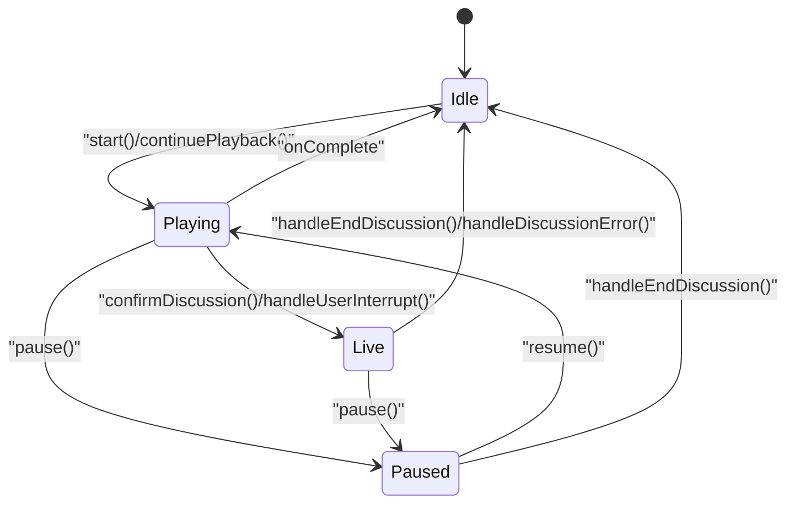

**图表来源** 
- [lib/playback/engine.ts:1-800](file://lib/playback/engine.ts#L1-L800)
- [lib/playback/types.ts:1-63](file://lib/playback/types.ts#L1-L63)

**章节来源**
- [lib/playback/engine.ts:1-800](file://lib/playback/engine.ts#L1-L800)
- [lib/playback/types.ts:1-63](file://lib/playback/types.ts#L1-L63)

## 功能模块清单
- 播放引擎 PlaybackEngine
  - 职责：统一状态机、动作调度、媒体控制、讨论流程、进度与快照。
  - 验收要点：四态切换正确；speech/spotlight/laser/discussion/video/wb_* 动作处理符合预期；跳转安全校验生效；暂停恢复行为一致。
- 动作导航 action-navigation
  - 职责：判定可跳转目标、白板动作识别、构建导航目标与行进度。
  - 验收要点：unsafe 类型不可跳转；仅 speech 目标可重建前缀；前后安全 speech 索引计算正确。
- 断点续播 action-resume
  - 职责：读写存储的动作断点位置，校验有效性，返回可恢复游标。
  - 验收要点：版本与结构校验；actionId/type 一致性检查；结合可重建前缀限制。
- 编舞 choreography
  - 职责：解析播放游标、估算语音时长、讨论触发延迟常量。
  - 验收要点：空动作场景仍产生 dwell beat；CJK/英文语速差异估算合理；DISCUSSION_TRIGGER_DELAY_MS 稳定。
- 画布状态 store/canvas
  - 职责：视频播放控制、白板开关、聚光灯/激光/高亮/缩放等教学特效。
  - 验收要点：resetCanvasState 在场景切换时重置；playVideo/pauseVideo 与引擎联动。
- 音频播放器 AudioPlayer
  - 职责：多语音预生成音频播放、语音感知解析、模板化URL处理、IndexedDB缓存管理。
  - 验收要点：支持{voice}模板替换、多语音回退链、内存泄漏防护、404错误处理。

**章节来源**
- [lib/playback/engine.ts:1-800](file://lib/playback/engine.ts#L1-L800)
- [lib/playback/action-navigation.ts:1-133](file://lib/playback/action-navigation.ts#L1-L133)
- [lib/playback/action-resume.ts:1-129](file://lib/playback/action-resume.ts#L1-L129)
- [lib/choreography/index.ts](file://lib/choreography/index.ts)
- [lib/store/canvas.ts:156-191](file://lib/store/canvas.ts#L156-L191)
- [lib/utils/audio-player.ts:1-352](file://lib/utils/audio-player.ts#L1-L352)

## 数据与状态
- 核心状态
  - scenes、sceneIndex、actionIndex：当前场景与动作游标。
  - mode：EngineMode 四态。
  - consumedDiscussions：已消费的讨论 id 集合，避免重复触发。
  - savedSceneIndex/savedActionIndex：被打断的讲座位置，用于恢复。
  - currentTopicState：讨论主题状态 active/pending/closed。
  - 媒体相关：audioPlayer、browserTTSActive、browserTTSChunks、browserTTSChunkIndex、speechTimer、speechTimerRemaining。
  - generation：用于取消过期任务与竞态保护。
- 讨论触发器状态管理
  - pendingDiscussionTrigger：待处理的讨论触发事件，支持跨暂停/恢复持久化。
  - triggerDelayRemaining：讨论触发延迟的剩余毫秒数，暂停时精确保存。
  - triggerDelayStart：讨论触发定时器启动时间戳，用于计算剩余延迟。
  - currentTrigger：当前活跃的触发事件，用于用户交互处理。
- 快照与持久化
  - getSnapshot：导出 sceneIndex、actionIndex、consumedDiscussions、sceneId。
  - restoreFromSnapshot：恢复引擎内部游标与已消费讨论集。
  - action-resume：按 sceneId 存储 actionIndex/actionId/actionType，供下次打开时恢复。
- 数据所有权边界
  - 引擎持有播放游标与状态，不直接修改渲染层；通过 callbacks 与 ActionEngine 通知 UI 与效果系统。
  - Canvas Store 由 ActionEngine 与引擎共同更新，确保场景切换时 resetCanvasState。

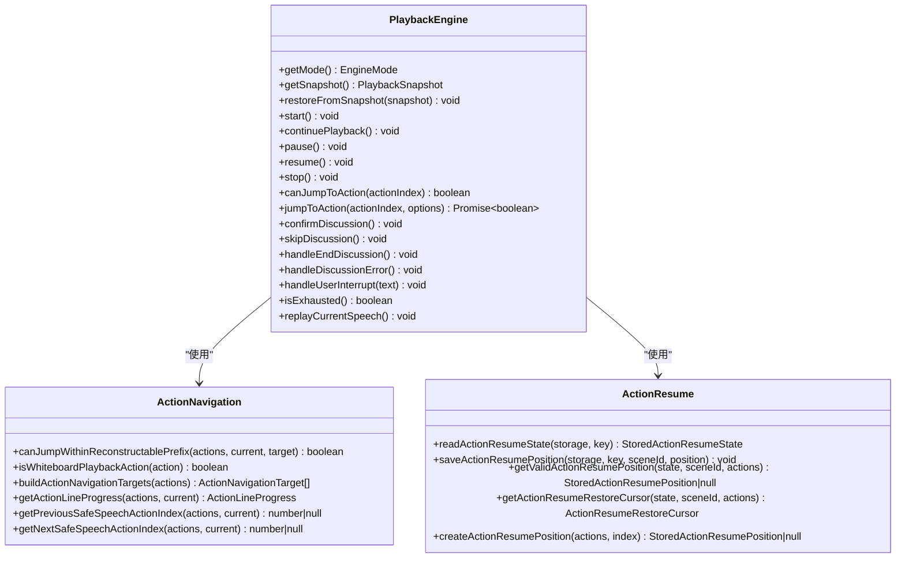

**图表来源** 
- [lib/playback/engine.ts:1-800](file://lib/playback/engine.ts#L1-L800)
- [lib/playback/action-navigation.ts:1-133](file://lib/playback/action-navigation.ts#L1-L133)
- [lib/playback/action-resume.ts:1-129](file://lib/playback/action-resume.ts#L1-L129)

**章节来源**
- [lib/playback/engine.ts:1-800](file://lib/playback/engine.ts#L1-L800)
- [lib/playback/action-resume.ts:1-129](file://lib/playback/action-resume.ts#L1-L129)

## 关键约束与边界
- 跳转安全约束
  - 仅当目标是 speech 且其前缀不包含 unsafe 类型（如 play_video、discussion、widget_*）时允许跳转。
  - canJumpToAction 在非 live 模式下才允许跳转；jumpToAction 会静默重放白板动作以重建视觉状态。
- 媒体播放边界
  - 优先使用预生成多语音音频；失败或无音频时尝试浏览器原生 TTS（需启用），否则按估计阅读时长推进。
  - 暂停时冻结 TTS 与音频，恢复时按不同路径恢复；stop 时清理所有资源。
- 讨论与打断边界
  - discussion 动作延迟触发 ProactiveCard；用户确认进入 live，跳过则标记 consumed 并继续。
  - handleUserInterrupt 保存讲座位置并进入 live；handleEndDiscussion 恢复位置并回到 idle。
- 性能与稳定性
  - 使用 generation 令牌防止过期回调影响当前播放。
  - spotlight/laser 使用 queueMicrotask 避免深递归导致的栈溢出。
  - 浏览器 TTS 分句块播放规避 Chrome 长 utterance 截断问题。

**章节来源**
- [lib/playback/action-navigation.ts:1-133](file://lib/playback/action-navigation.ts#L1-L133)
- [lib/playback/engine.ts:1-800](file://lib/playback/engine.ts#L1-L800)
- [tests/playback/action-navigation.test.ts:221-457](file://tests/playback/action-navigation.test.ts#L221-L457)

## 详细组件分析

### 播放引擎 PlaybackEngine
- 状态机设计
  - idle → playing：start/continuePlayback 初始化游标与 generation，进入 processNext。
  - playing ↔ paused：pause 冻结音频/TTS/定时器；resume 按路径恢复。
  - playing/live：confirmDiscussion/handleUserInterrupt 进入 live；handleEndDiscussion/handleDiscussionError 回到 idle。
- 动作处理流程
  - speech：onSpeechStart → audioPlayer.play → onEnded → onSpeechEnd → processNext；无音频时走 TTS 或阅读计时器。
  - spotlight/laser：execute 后立即回调 onEffectFire，queueMicrotask 推进。
  - discussion：延迟触发 ProactiveCard；用户确认后进入 live，跳过则标记 consumed。
  - 其他同步动作：await execute 完成后继续。
- 进度与快照
  - onProgress 在推进前回调，保证 snapshot 指向当前动作；isExhausted 扫描剩余未消费动作。
- 错误与恢复
  - handleDiscussionError 仅在 live 或存在保存位置时清理并恢复；stop 全面清理。

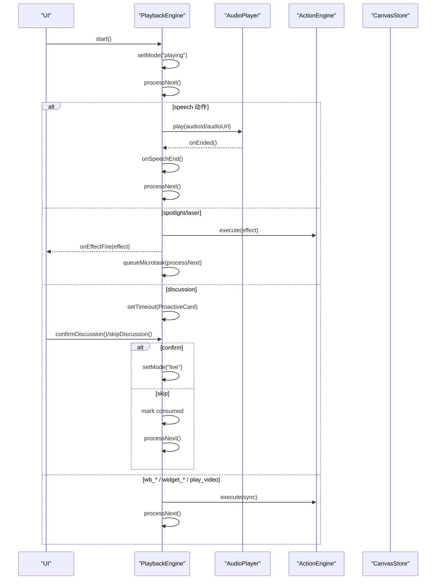

**图表来源** 
- [lib/playback/engine.ts:1-800](file://lib/playback/engine.ts#L1-L800)
- [lib/store/canvas.ts:156-191](file://lib/store/canvas.ts#L156-L191)

**章节来源**
- [lib/playback/engine.ts:1-800](file://lib/playback/engine.ts#L1-L800)

### 新增的即时语音切换功能
**更新** 播放引擎现在支持播放过程中的即时语音切换，无需等待下一句话即可切换到新的音色。

- replayCurrentSpeech() 方法
  - 在播放或暂停状态下，重新播放当前 speech 动作并使用新的语音设置。
  - 自动停止正在播放的音频、TTS 和阅读计时器，确保状态一致性。
  - 在播放模式下立即重新播放，在暂停模式下保持游标位置等待 resume。
- 语音切换机制
  - 调用 invalidatePlaybackGeneration() 防止过期的 onEnded 回调影响新播放。
  - 通过 AudioPlayer.play() 的语音感知解析，自动获取最新的语音配置。
  - 支持 {voice} 模板替换和 IndexedDB 语音后缀交换，无需重新生成音频。
- 状态一致性保证
  - 只在当前动作是 speech 且引擎处于 playing/paused 状态时执行。
  - 非 speech 动作或 idle 状态下为 no-op，不影响现有播放逻辑。
  - 使用 generation 令牌确保旧音频的 onEnded 回调不会干扰新播放。

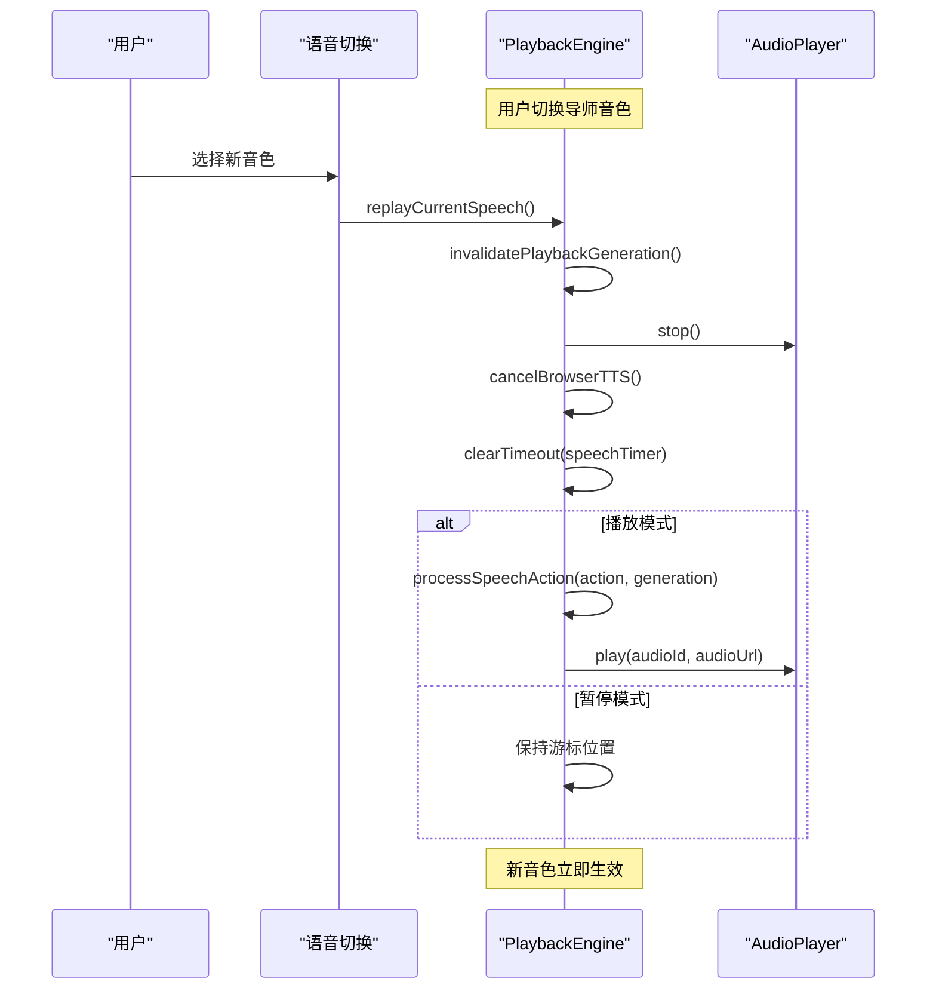

**图表来源** 
- [lib/playback/engine.ts:358-392](file://lib/playback/engine.ts#L358-L392)
- [tests/playback/voice-replay.test.ts:59-216](file://tests/playback/voice-replay.test.ts#L59-L216)

**章节来源**
- [lib/playback/engine.ts:358-392](file://lib/playback/engine.ts#L358-L392)
- [tests/playback/voice-replay.test.ts:59-216](file://tests/playback/voice-replay.test.ts#L59-L216)

### 增强的讨论触发器状态管理
**更新** 播放引擎现在具备更健壮的讨论触发器状态管理，能够正确处理在播放器暂停时触发讨论的边缘情况。

- 讨论触发器持久化
  - pendingDiscussionTrigger：在暂停时保存待处理的讨论触发事件，确保恢复后能继续延迟显示。
  - triggerDelayRemaining：精确计算并保存讨论触发的剩余延迟时间，支持跨暂停/恢复的准确恢复。
  - triggerDelayStart：记录定时器启动时间戳，用于计算暂停期间的实际经过时间。
- 暂停时的状态保存
  - pause() 方法中检测 triggerDelayTimer 是否存在，计算剩余延迟时间并保存到 triggerDelayRemaining。
  - 清除 triggerDelayTimer 但保留 pendingDiscussionTrigger，确保 resume() 能重新调度。
- 恢复时的状态恢复
  - resume() 方法检查 pendingDiscussionTrigger 是否存在，如果存在则使用保存的剩余延迟重新调度。
  - 保持讨论触发的一致性，无论用户何时暂停都不会丢失即将显示的讨论提示。

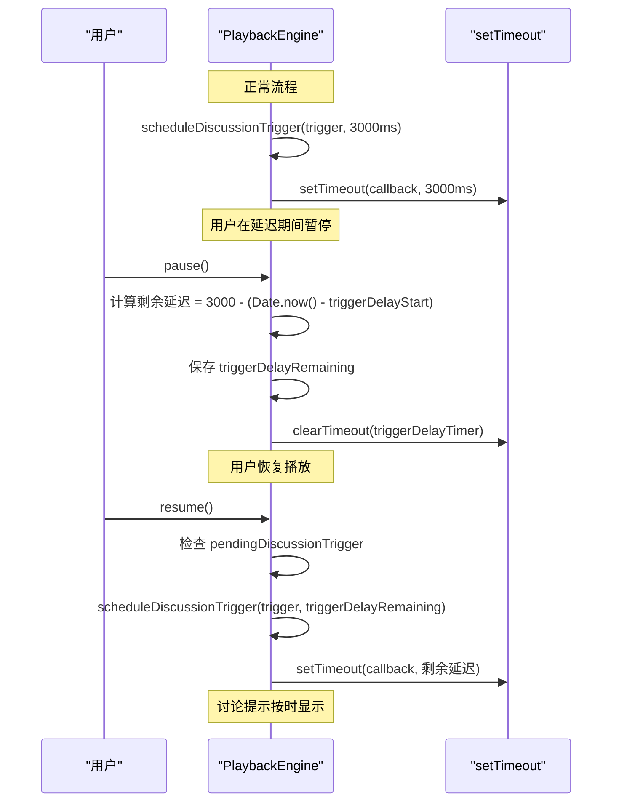

**图表来源** 
- [lib/playback/engine.ts:224-270](file://lib/playback/engine.ts#L224-270)
- [lib/playback/engine.ts:272-329](file://lib/playback/engine.ts#L272-329)
- [lib/playback/engine.ts:512-527](file://lib/playback/engine.ts#L512-527)

**章节来源**
- [lib/playback/engine.ts:224-270](file://lib/playback/engine.ts#L224-270)
- [lib/playback/engine.ts:272-329](file://lib/playback/engine.ts#L272-329)
- [lib/playback/engine.ts:512-527](file://lib/playback/engine.ts#L512-527)

### 重构的 Speech 处理逻辑
**更新** speech 处理逻辑被重构为独立的 `processSpeechAction()` 方法，提高了代码复用性和可维护性。

- 方法分离优势
  - 将 speech 动作的处理逻辑从 processNext() 中提取出来，形成独立的 processSpeechAction() 方法。
  - 支持 replayCurrentSpeech() 直接调用，避免代码重复和状态不一致。
  - 便于测试和维护，speech 处理逻辑更加清晰和独立。
- 处理流程优化
  - onSpeechStart 回调在音频播放前触发，确保 UI 及时响应。
  - 统一的 onEnded 回调处理，支持音频播放、TTS 和阅读计时器的统一结束逻辑。
  - 智能降级策略：预生成音频 → 浏览器 TTS → 阅读计时器。
- 状态管理改进
  - 使用 generation 令牌确保回调的时效性，防止过时操作影响当前播放。
  - 精确的时间管理，支持暂停/恢复时的计时器状态保存和恢复。

**章节来源**
- [lib/playback/engine.ts:584-658](file://lib/playback/engine.ts#L584-658)

### 增强的错误处理机制
**更新** 播放引擎现在具备更好的错误处理能力，特别是在讨论触发和状态恢复方面。

- 讨论错误处理增强
  - handleDiscussionError() 方法现在支持两种状态：正常的 live 模式和暂停的 pending 模式。
  - 检查 hasSavedLectureState 确保即使不在讨论模式中也能正确恢复讲座状态。
  - 清理所有相关状态：currentTopicState、currentTrigger、白板和效果。
- 状态一致性保证
  - 在所有错误处理路径中，确保 restoredSavedLectureState() 被调用，恢复讲座位置。
  - 设置 currentTopicState 为 'closed'，确保状态机处于一致的关闭状态。
  - 调用 setMode('idle') 确保引擎回到安全的空闲状态。
- 边缘情况处理
  - 处理在暂停状态下收到讨论错误的情况，通过 currentTopicState === 'pending' 检测。
  - 防止在不应该清理的状态下执行清理操作，通过条件判断保护。

**章节来源**
- [lib/playback/engine.ts:457-478](file://lib/playback/engine.ts#L457-478)

### 优化的计时器管理
**更新** 播放引擎现在具备更精确的计时器管理，支持暂停/恢复时的准确恢复。

- 阅读计时器精确恢复
  - speechTimerRemaining：保存阅读计时器的剩余毫秒数，暂停时计算实际经过时间。
  - speechTimerStart：记录计时器启动时间戳，用于精确计算剩余时间。
  - resume() 方法中使用保存的剩余时间重新调度计时器，确保阅读时长准确。
- 讨论触发延迟精确恢复
  - triggerDelayRemaining：保存讨论触发的剩余延迟时间。
  - triggerDelayStart：记录触发定时器启动时间，用于计算暂停期间的经过时间。
  - 支持跨暂停/恢复的讨论触发，不会丢失即将显示的讨论提示。
- 计时器清理与重置
  - stop() 方法中清理所有活动计时器，重置剩余时间为 0。
  - cancelActivePlaybackWork() 方法统一清理所有相关的计时器和状态。

**章节来源**
- [lib/playback/engine.ts:231-247](file://lib/playback/engine.ts#L231-247)
- [lib/playback/engine.ts:313-324](file://lib/playback/engine.ts#L313-324)
- [lib/playback/engine.ts:332-356](file://lib/playback/engine.ts#L332-356)

### 动作系统与执行引擎
- 动作分类
  - 语音 speech：驱动音频/TTS/阅读计时器。
  - 特效 spotlight/laser：通过 ActionEngine 执行并回调 onEffectFire。
  - 讨论 discussion：延迟触发 ProactiveCard，进入 live 模式。
  - 白板 wb_*：open/draw/clear/delete/close 等，支持静默重放以重建视觉状态。
  - 控件 widget_*：highlight/setState/annotation/reveal 等，属于不安全跳转类型。
  - 媒体 play_video：需要重建上下文，禁止跳转。
- 执行策略
  - 同步动作 await 完成后再推进；异步动作（effect）非阻塞推进。
  - 跳转时静默重放 wb_* 动作，确保目标前的视觉效果一致。

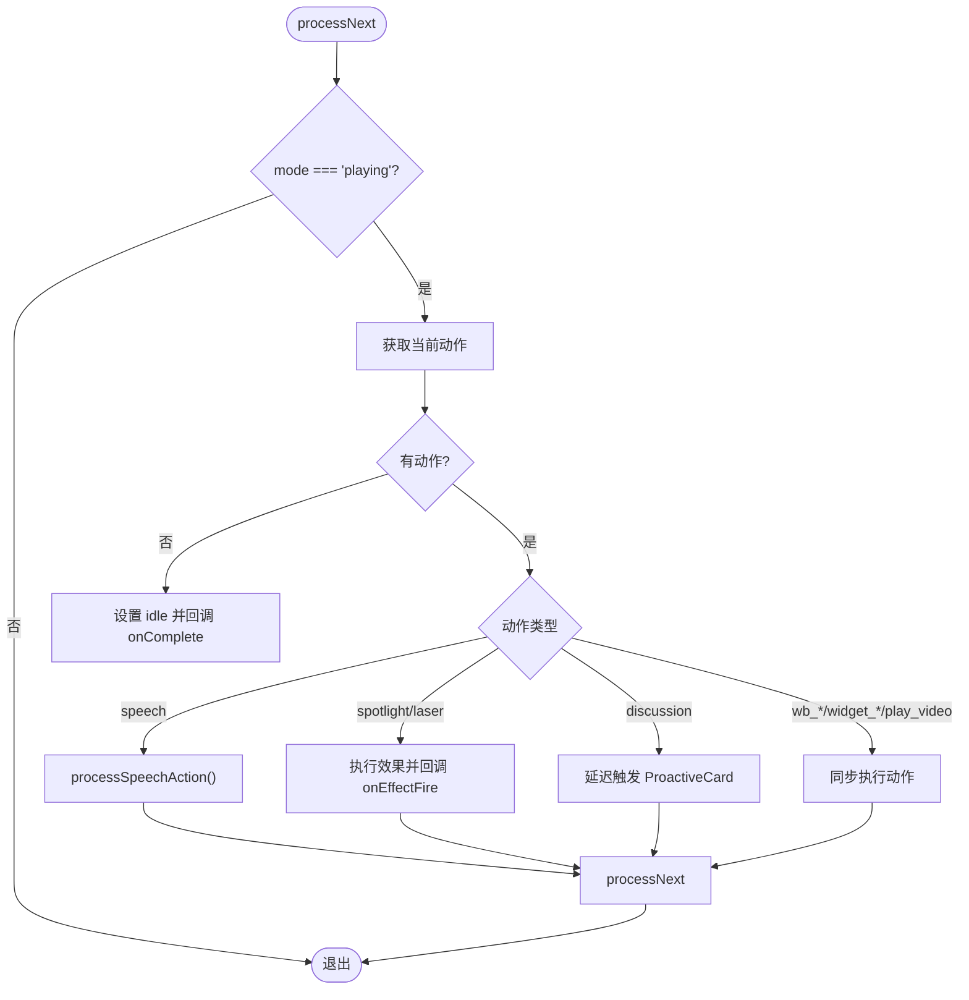

**图表来源** 
- [lib/playback/engine.ts:1-800](file://lib/playback/engine.ts#L1-L800)

**章节来源**
- [lib/playback/engine.ts:1-800](file://lib/playback/engine.ts#L1-L800)

### 媒体播放控制与时间轴同步
- 媒体优先级
  - 预生成多语音音频优先；失败或无音频时尝试浏览器原生 TTS（需启用）；否则按估计阅读时长推进。
- 时间轴同步
  - speech 动作 onEnded 回调推进；无音频时使用 estimateSpeechDurationMs 估算时长。
  - pause/resume 精确恢复剩余时间与 TTS 分块状态。
- 进度跟踪
  - onProgress 在推进前回调，snapshot 包含 sceneIndex/actionIndex/consumedDiscussions/sceneId。
  - isExhausted 扫描剩余未消费动作，用于判断播放是否完成。

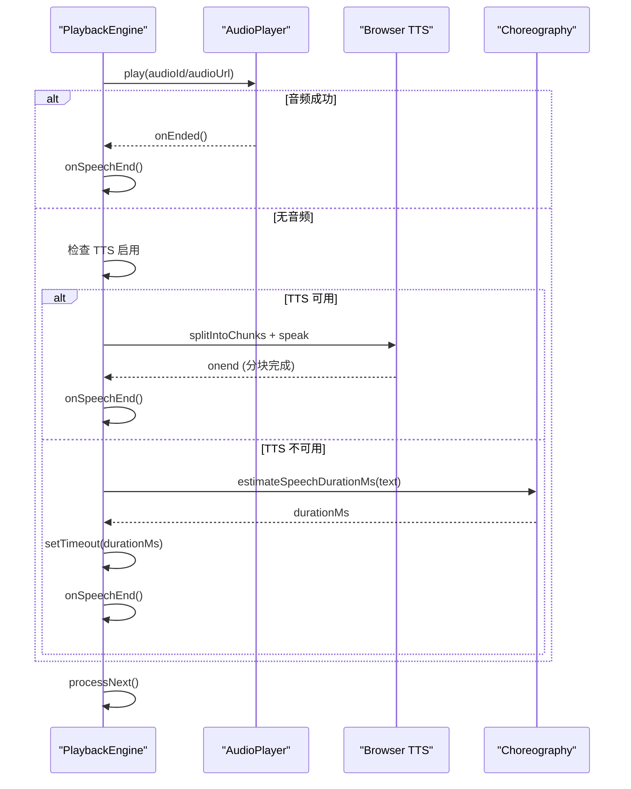

**图表来源** 
- [lib/playback/engine.ts:1-800](file://lib/playback/engine.ts#L1-L800)
- [lib/choreography/index.ts](file://lib/choreography/index.ts)

**章节来源**
- [lib/playback/engine.ts:1-800](file://lib/playback/engine.ts#L1-L800)

### 用户交互处理机制
- 主动式讨论
  - discussion 动作延迟触发 ProactiveCard；用户确认进入 live，跳过则标记 consumed 并继续。
- 用户打断
  - handleUserInterrupt 保存讲座位置，停止音频/TTS，进入 live 模式，回调 onUserInterrupt。
- 讨论结束
  - handleEndDiscussion 关闭白板、恢复讲座位置、回调 onDiscussionEnd，回到 idle。
- 错误恢复
  - handleDiscussionError 仅在 live 或存在保存位置时清理并恢复，保持会话可重试。

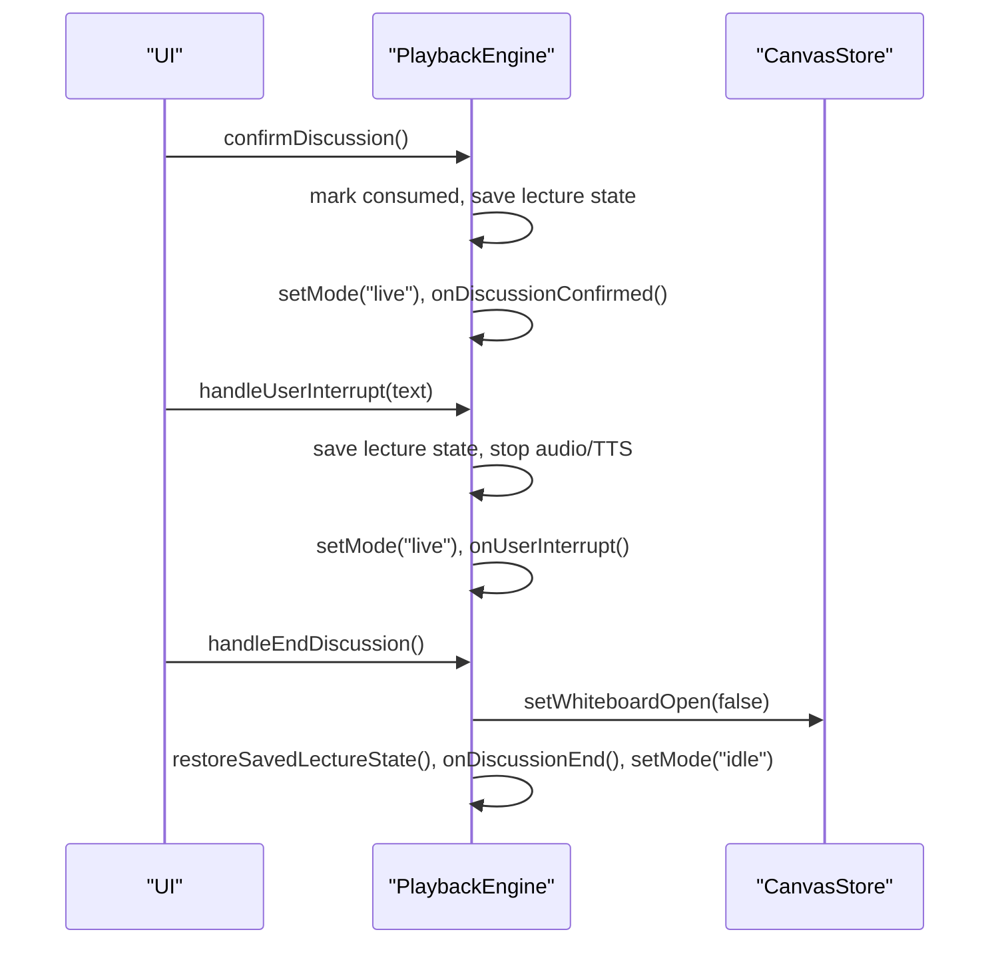

**图表来源** 
- [lib/playback/engine.ts:1-800](file://lib/playback/engine.ts#L1-L800)
- [lib/store/canvas.ts:156-191](file://lib/store/canvas.ts#L156-L191)

**章节来源**
- [lib/playback/engine.ts:1-800](file://lib/playback/engine.ts#L1-L800)

### 播放控制 API 使用示例
- 基本控制
  - start(): 从开头开始播放。
  - continuePlayback(): 从当前位置继续播放（例如讨论结束后）。
  - pause()/resume(): 暂停/恢复播放。
  - stop(): 停止并清理所有资源。
- 跳转与定位
  - canJumpToAction(index): 检查是否可跳转到指定动作。
  - jumpToAction(index, { autoplay? }): 跳转到目标动作，可选自动播放；会静默重放白板动作。
- 进度与快照
  - getSnapshot(): 获取当前快照，用于持久化。
  - restoreFromSnapshot(snapshot): 恢复引擎状态。
- 讨论与打断
  - confirmDiscussion(): 确认讨论进入 live。
  - skipDiscussion(): 跳过讨论继续播放。
  - handleUserInterrupt(text): 用户打断进入 live。
  - handleEndDiscussion()/handleDiscussionError(): 结束或错误恢复。
- **新增** 语音切换
  - replayCurrentSpeech(): 重新播放当前 speech 动作，使用最新的语音设置。

**章节来源**
- [lib/playback/engine.ts:1-800](file://lib/playback/engine.ts#L1-L800)

### 自定义动作开发指南
- 新增动作类型
  - 在 engine.ts 的 processNext switch 中添加新类型分支，决定同步/异步执行策略。
  - 若为效果类动作，调用 ActionEngine.execute 并回调 onEffectFire。
  - 若为不安全跳转类型，加入 UNSAFE_ACTION_TYPES 集合，禁止跳转。
- 白板动作
  - 使用 wb_* 类型，支持静默重放以重建视觉状态；确保动作幂等。
- 控件动作
  - widget_* 类型通常依赖上下文重建，禁止跳转；如需跳转，确保可重建前缀。
- 测试建议
  - 参考 tests/playback/action-navigation.test.ts 验证跳转安全性与行为一致性。

**章节来源**
- [lib/playback/engine.ts:1-800](file://lib/playback/engine.ts#L1-L800)
- [lib/playback/action-navigation.ts:1-133](file://lib/playback/action-navigation.ts#L1-L133)
- [tests/playback/action-navigation.test.ts:221-457](file://tests/playback/action-navigation.test.ts#L221-L457)

### 离线播放、缓存策略与错误恢复
- 离线播放
  - 依赖本地存储的动作断点（action-resume）与 Canvas Store 状态；无网络时仍可回放已缓存内容。
- 缓存策略
  - 预生成多语音音频优先；浏览器原生 TTS 作为回退；无音频时按估计时长推进。
  - 断点续播按 sceneId 存储 actionIndex/actionId/actionType，下次打开时恢复。
- 错误恢复
  - handleDiscussionError 清理并恢复非 live 状态；stop 全面清理资源。
  - generation 令牌防止过期回调影响当前播放。

**章节来源**
- [lib/playback/action-resume.ts:1-129](file://lib/playback/action-resume.ts#L1-L129)
- [lib/playback/engine.ts:1-800](file://lib/playback/engine.ts#L1-L800)

### 增强的音频播放器回退机制
**更新** 音频播放器现在实现了强大的多重回退机制，专门处理404错误和语音文件缺失的情况。

- 多重回退链设计
  - 第一优先级：当前选择的语音URL（支持{voice}模板替换）
  - 第二优先级：默认语音URL（当当前语音文件缺失时自动回退）
  - 第三优先级：IndexedDB缓存（客户端生成的TTS音频）
  - 最终回退：返回false，让上层引擎使用阅读计时器
- 404错误处理机制
  - 智能检测HTTP 404错误，自动触发回退链
  - 记录详细的错误日志，便于调试和问题追踪
  - 防止单个语音文件缺失导致整个播放流程中断
- IndexedDB缓存优化
  - 支持语音后缀交换，无需重新下载音频文件
  - 智能查找算法：当前语音后缀 → 默认语音 → 原始ID
  - 完善的Blob URL管理和内存泄漏防护
- 性能优化
  - 使用requestToken防止并发冲突
  - 异步加载和错误处理，避免阻塞主线程
  - 智能缓存策略，减少不必要的网络请求

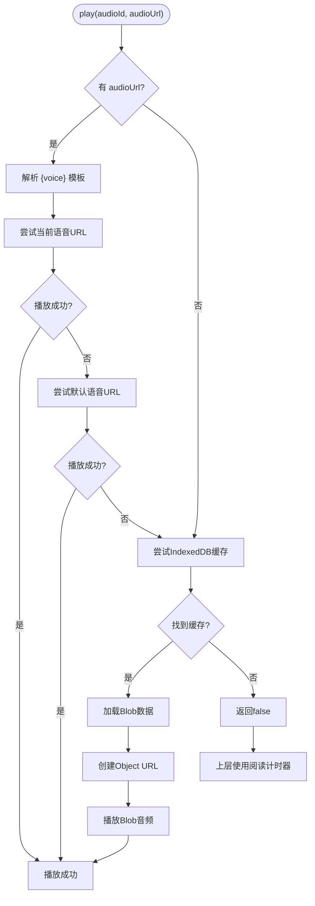

**图表来源** 
- [lib/utils/audio-player.ts:102-186](file://lib/utils/audio-player.ts#L102-L186)
- [lib/utils/audio-player.ts:200-236](file://lib/utils/audio-player.ts#L200-L236)

**章节来源**
- [lib/utils/audio-player.ts:1-352](file://lib/utils/audio-player.ts#L1-L352)
- [lib/audio/constants.ts:55-70](file://lib/audio/constants.ts#L55-L70)
- [tests/audio/audio-player-url-fallback.test.ts:1-148](file://tests/audio/audio-player-url-fallback.test.ts#L1-L148)
- [e2e/tests/voice-fallback-playback.spec.ts:1-315](file://e2e/tests/voice-fallback-playback.spec.ts#L1-L315)

### 服务器管理的TTS提供商模拟
**新增** 端到端测试现在支持服务器管理的TTS提供商模拟，提供更真实的测试环境。

- mockServerManagedTts函数
  - 模拟/api/server-providers端点，返回托管的minimax-tts提供商配置
  - 自动触发首次同步，启用ttsEnabled并设置默认语音为female-yujie
  - 支持完整的提供商配置模拟，包括providers、tts、asr、pdf、image、video、webSearch等
- 服务端托管配置
  - 支持autoConfigApplied=false的全新安装场景
  - 自动选择并启用托管的TTS提供商
  - 提供完整的音色列表和默认值设置
- 测试场景覆盖
  - 缺失语音文件的完整回退链验证
  - 播放过程中语音切换的即时生效
  - 试看模式下声音切换按钮的可用性

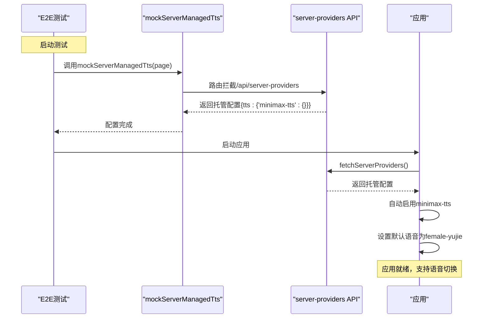

**图表来源** 
- [e2e/tests/mentor-voice-switching.spec.ts:256-273](file://e2e/tests/mentor-voice-switching.spec.ts#L256-L273)
- [e2e/tests/voice-fallback-playback.spec.ts:246-263](file://e2e/tests/voice-fallback-playback.spec.ts#L246-L263)

**章节来源**
- [e2e/tests/mentor-voice-switching.spec.ts:256-273](file://e2e/tests/mentor-voice-switching.spec.ts#L256-L273)
- [e2e/tests/voice-fallback-playback.spec.ts:246-263](file://e2e/tests/voice-fallback-playback.spec.ts#L246-L263)

### 改进的缺失语音切换工作流
**更新** 语音切换工作流现在支持正确的UI导航和状态管理，确保用户体验的一致性。

- switchToMissingVoice函数
  - 打开声音选择器并选择缺失的语音文件（如male-qn-jingying）
  - 模拟404错误场景，验证回退机制的正确性
  - 确保UI状态与实际播放状态保持一致
- UI导航优化
  - 支持播放中途的语音切换，无需等待当前语句结束
  - 浮动层的遮挡处理，使用force参数确保点击成功
  - 语音按钮的可见性和可用性检查
- 状态管理改进
  - 切换后立即更新pill显示，无需刷新页面
  - 支持试看模式下的声音切换，不再被禁用
  - 保持播放状态的连续性，避免中断用户体验

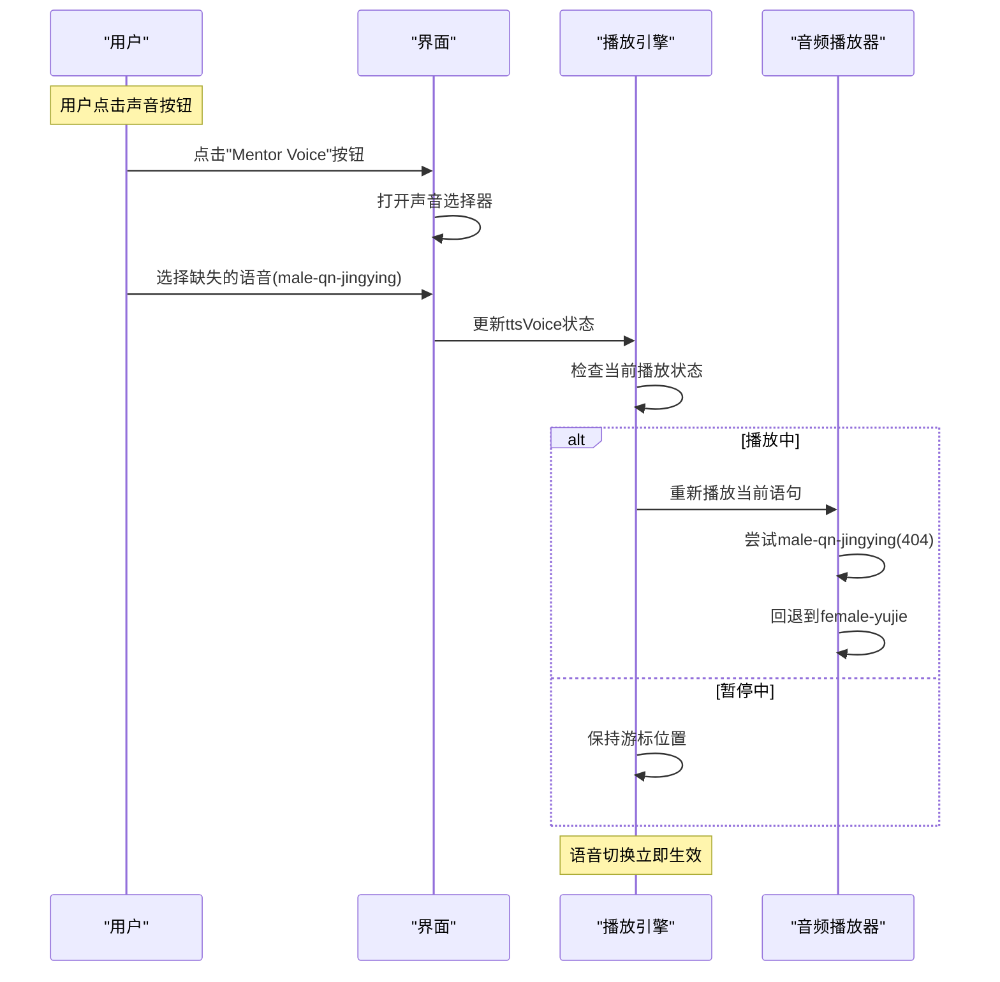

**图表来源** 
- [e2e/tests/mentor-voice-switching.spec.ts:265-271](file://e2e/tests/mentor-voice-switching.spec.ts#L265-L271)
- [e2e/tests/mentor-voice-switching.spec.ts:307-341](file://e2e/tests/mentor-voice-switching.spec.ts#L307-L341)

**章节来源**
- [e2e/tests/mentor-voice-switching.spec.ts:265-271](file://e2e/tests/mentor-voice-switching.spec.ts#L265-L271)
- [e2e/tests/mentor-voice-switching.spec.ts:307-341](file://e2e/tests/mentor-voice-switching.spec.ts#L307-L341)

### 增强的端到端测试流程
**更新** 端到端测试现在支持完整的语音回退链验证，确保系统的鲁棒性。

- 完整的回退链测试
  - 验证当前语音URL → 默认语音URL → IndexedDB缓存的完整回退顺序
  - 模拟404错误场景，确保播放不会因单个语音文件缺失而中断
  - 验证回退链的顺序正确性，确保先尝试当前语音再回退到默认语音
- 测试数据准备
  - 种子数据库包含两条speech动作，第一条的male-qn-jingying文件缺失
  - 第二条speech只有female-yujie文件存在，用于验证回退后的继续播放
  - 模拟音频路由，对male-qn-jingying返回404，对其他语音返回静音WAV
- 断言验证
  - 验证缺失语音请求先于默认语音请求
  - 验证播放能够推进到第二条语音，证明回退链正常工作
  - 验证回退链未导致播放卡顿或死循环

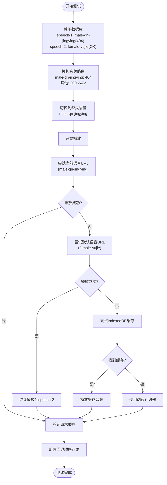

**图表来源** 
- [e2e/tests/voice-fallback-playback.spec.ts:273-314](file://e2e/tests/voice-fallback-playback.spec.ts#L273-L314)

**章节来源**
- [e2e/tests/voice-fallback-playback.spec.ts:273-314](file://e2e/tests/voice-fallback-playback.spec.ts#L273-L314)

## 架构总览
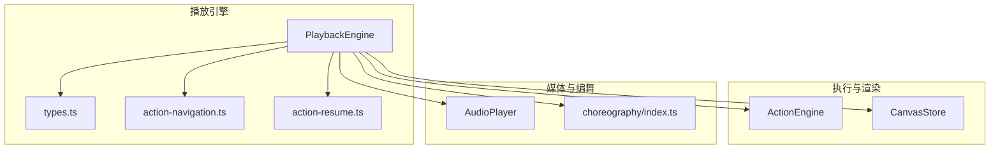

**图表来源** 
- [lib/playback/engine.ts:1-800](file://lib/playback/engine.ts#L1-L800)
- [lib/playback/types.ts:1-63](file://lib/playback/types.ts#L1-L63)
- [lib/playback/action-navigation.ts:1-133](file://lib/playback/action-navigation.ts#L1-L133)
- [lib/playback/action-resume.ts:1-129](file://lib/playback/action-resume.ts#L1-L129)
- [lib/choreography/index.ts](file://lib/choreography/index.ts)
- [lib/store/canvas.ts:156-191](file://lib/store/canvas.ts#L156-L191)

## 依赖分析
- 组件耦合
  - PlaybackEngine 依赖 ActionEngine、AudioPlayer、CanvasStore、Choreography。
  - action-navigation 与 action-resume 为纯函数工具，低耦合。
- 外部依赖
  - 浏览器原生 TTS（Web Speech API）；IndexedDB/SessionStorage 用于断点续播。
- 潜在循环依赖
  - 引擎通过 callbacks 与 ActionEngine 通信，避免直接耦合渲染层。
- 接口契约
  - PlaybackEngineCallbacks 定义事件回调；ActionEngine.execute 定义动作执行契约。

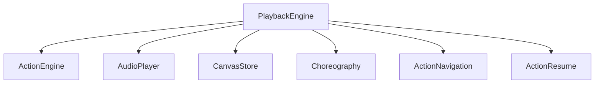

**图表来源** 
- [lib/playback/engine.ts:1-800](file://lib/playback/engine.ts#L1-L800)
- [lib/playback/action-navigation.ts:1-133](file://lib/playback/action-navigation.ts#L1-L133)
- [lib/playback/action-resume.ts:1-129](file://lib/playback/action-resume.ts#L1-L129)

**章节来源**
- [lib/playback/engine.ts:1-800](file://lib/playback/engine.ts#L1-L800)

## 性能考虑
- 使用 generation 令牌避免过期回调影响当前播放。
- spotlight/laser 使用 queueMicrotask 避免深递归导致的栈溢出。
- 浏览器 TTS 分句块播放规避 Chrome 长 utterance 截断问题。
- 暂停恢复精确记录剩余时间与 TTS 分块状态，减少不必要的重新合成。
- 跳转时仅静默重放白板动作，最小化副作用。
- 音频播放器使用 requestToken 防止并发冲突和内存泄漏。
- **新增** 语音切换通过 AudioPlayer.play() 的语音感知解析，无需重新生成音频，显著提升性能。
- **新增** 404错误快速失败，避免长时间等待无效的网络请求。
- **新增** 服务器管理的TTS提供商模拟，提高测试效率和准确性。

[本节为通用指导，不直接分析具体文件]

## 故障排查指南
- 跳转失败
  - 检查 canJumpToAction 返回值；确认目标是否为 speech 且前缀不含 unsafe 类型。
- 播放卡顿
  - 检查 audioPlayer.onEnded 回调是否被覆盖；确认 no-audio 路径的阅读计时器是否正常触发。
- 讨论未触发
  - 检查 discussion 动作的 agentId 是否被过滤；确认 DISCUSSION_TRIGGER_DELAY_MS 配置。
  - 检查暂停/恢复逻辑是否正确处理 pendingDiscussionTrigger 状态。
- 错误恢复
  - 调用 handleDiscussionError 清理并恢复；确认 savedSceneIndex/savedActionIndex 是否正确保存。
  - 检查 currentTopicState 状态是否正确设置为 'closed'。
- 音频播放问题
  - 检查 {voice} 模板是否正确替换；确认 IndexedDB 中是否有对应语音的音频文件。
  - 验证语音后缀替换逻辑；检查 Blob URL 是否正确释放。
- **新增** 语音切换问题
  - 确认 replayCurrentSpeech() 只在 playing/paused 状态下有效。
  - 检查 generation 令牌是否正确失效，防止旧音频回调干扰新播放。
  - 验证 AudioPlayer.play() 是否能正确解析新的语音配置。
- **新增** 404错误处理问题
  - 检查网络请求是否正确返回404状态码。
  - 验证回退链顺序：当前语音 → 默认语音 → IndexedDB。
  - 确认IndexedDB缓存中是否有可用的音频文件。
- **新增** 服务器管理TTS问题
  - 检查/api/server-providers端点是否正确返回托管配置。
  - 验证mockServerManagedTts函数是否正确模拟服务端响应。
  - 确认autoConfigApplied=false时的初始化和默认值设置。

**章节来源**
- [lib/playback/action-navigation.ts:1-133](file://lib/playback/action-navigation.ts#L1-L133)
- [lib/playback/engine.ts:1-800](file://lib/playback/engine.ts#L1-L800)
- [lib/utils/audio-player.ts:1-352](file://lib/utils/audio-player.ts#L1-L352)
- [e2e/tests/mentor-voice-switching.spec.ts:256-273](file://e2e/tests/mentor-voice-switching.spec.ts#L256-L273)
- [e2e/tests/voice-fallback-playback.spec.ts:246-263](file://e2e/tests/voice-fallback-playback.spec.ts#L246-L263)

## 结论
本播放引擎以统一状态机为核心，直接消费 DSL actions，提供稳健的媒体控制、时间轴同步、用户交互与安全跳转能力。通过 ActionEngine 与 CanvasStore 解耦渲染，借助 generation 令牌与断点续播保障稳定性与可恢复性。最新的改进包括增强的讨论触发器状态管理、更好的错误处理和更健壮的计时器管理，以及全新的多语音预生成音频支持。音频播放器现在能够根据用户选择的语音在预生成的音频文件之间智能切换，无需网络请求，显著提升了播放性能和用户体验。**特别重要的是新增的多重回退机制确保了即使在语音文件缺失的情况下，播放流程也不会中断，通过404错误处理和智能回退链（当前语音→默认语音→IndexedDB缓存）保证了系统的鲁棒性。**同时，服务器管理的TTS提供商模拟和端到端测试的增强，为开发和测试提供了更可靠的环境支持。开发者可按指南扩展动作类型，结合测试用例验证行为一致性。

[本节为总结，不直接分析具体文件]